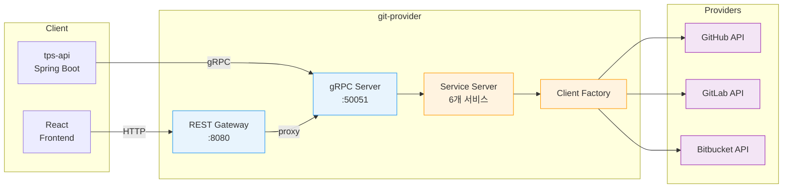
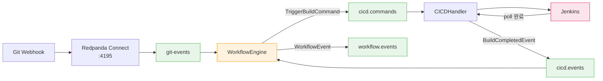
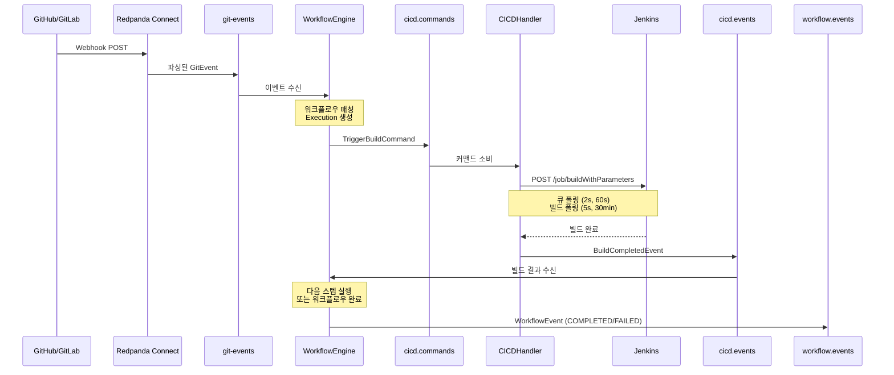

# Git Provider 아키텍처

## 1. 프로젝트 개요

### 목적

git-provider는 GitHub, GitLab, Bitbucket 세 가지 Git 호스팅 서비스를 하나의 gRPC/REST API로 통합하는 Go 마이크로서비스다. TPS DevOps 플랫폼에서 프론트엔드(React)와 백엔드(tps-api, Spring Boot)가 프로바이더 종류에 관계없이 동일한 인터페이스로 Git 작업을 수행할 수 있게 한다.

### 배경

TPS DevOps에서 멀티 프로바이더 지원이 필요한 이유는 고객사마다 사용하는 Git 호스팅이 다르기 때문이다. 어떤 곳은 GitHub Enterprise를, 어떤 곳은 Self-hosted GitLab을 운영한다. git-provider가 이 차이를 흡수하므로 tps-api는 프로바이더별 분기 없이 단일 gRPC 호출로 저장소 관리, 브랜치 비교, MR/PR 생성, CI/CD 트리거까지 처리한다.

### 기술 스택

| 항목 | 기술 | 버전 |
|------|------|------|
| 언어 | Go | 1.25.1 |
| RPC | gRPC + grpc-gateway | grpc v1.78.0, gateway v2.27.4 |
| 메시징 | franz-go (Kafka) | v1.20.7 |
| GitHub SDK | go-github | v57.0.0 |
| GitLab SDK | go-gitlab | v0.115.0 |
| Bitbucket SDK | go-bitbucket | v0.9.88 |
| CI/CD | Jenkins HTTP API | - |
| 직렬화 | JSON (protobuf wire + Kafka) | protobuf v1.36.11 |

### 포트

| 프로토콜 | 포트 | 용도 |
|----------|------|------|
| gRPC | 50051 | tps-api(Spring Boot)에서 호출 |
| REST | 8080 | 프론트엔드/디버깅용 (grpc-gateway) |

---

## 2. 전체 구조

### 요청 흐름

클라이언트(tps-api 또는 REST)가 요청을 보내면 gRPC 서비스가 받아서 프로바이더별 클라이언트 어댑터를 생성하고, 해당 프로바이더의 REST/GraphQL API를 호출한 뒤 protobuf 공통 타입으로 변환하여 응답한다.



### 이벤트 흐름

Git Webhook 이벤트가 Redpanda Connect를 거쳐 Kafka로 들어오면, WorkflowEngine이 매칭된 워크플로우를 찾아 Jenkins 빌드를 트리거하고 결과를 수집한다.



---

## 3. 디렉토리 레이아웃

```
git-provider/
├── cmd/server/main.go           # 진입점: gRPC/REST/Kafka 초기화 + graceful shutdown
│
├── internal/
│   ├── server/                  # gRPC 서비스 구현 (6개)
│   │   ├── git_server.go        #   GitService — Repository CRUD, Branch CRUD
│   │   ├── branch_server.go     #   BranchService — 브랜치 비교, 머지 감지, 정리
│   │   ├── contents_server.go   #   ContentsService — 파일 트리, 내용, README
│   │   ├── mr_server.go         #   MergeRequestService — PR/MR 라이프사이클
│   │   ├── cicd_server.go       #   CICDService — 파이프라인 CRUD, 빌드 트리거
│   │   ├── workflow_server.go   #   WorkflowService — 워크플로우 정의/실행
│   │   └── client_factory.go    #   공통 클라이언트 생성 함수 (3 프로바이더)
│   │
│   ├── client/                  # 프로바이더별 SDK 어댑터
│   │   ├── github.go            #   go-github SDK 래핑 → pb 변환
│   │   ├── gitlab.go            #   go-gitlab SDK 래핑 → pb 변환
│   │   └── bitbucket.go         #   go-bitbucket SDK 래핑 → pb 변환
│   │
│   ├── provider/                # 인증/설정 추상화
│   │   ├── config.go            #   ProviderConfig 인터페이스
│   │   ├── credentials.go       #   Credentials 인터페이스 + Token/Basic 구현
│   │   ├── github.go            #   GitHubConfig 구현
│   │   ├── gitlab.go            #   GitLabConfig 구현 (파일 존재 추정)
│   │   └── bitbucket.go         #   BitbucketConfig 구현
│   │
│   ├── middleware/              # 횡단 관심사
│   │   ├── cors.go              #   HTTP CORS 래퍼
│   │   └── interceptor.go       #   gRPC 로깅 + 패닉 복구 인터셉터
│   │
│   ├── kafka/                   # 이벤트 인프라
│   │   ├── events.go            #   토픽 상수 + 이벤트 구조체 정의
│   │   ├── producer.go          #   EventProducer (Publish, Close)
│   │   └── consumer.go          #   EventConsumer (RegisterHandler, Run, ParseEvent)
│   │
│   ├── workflow/                # 워크플로우 오케스트레이션
│   │   └── engine.go            #   Engine — 이벤트 매칭, 스텝 실행, 결과 처리
│   │
│   ├── pipeline/                # 파이프라인 저장소
│   │   └── store.go             #   인메모리 Pipeline/Build CRUD
│   │
│   ├── cicd/                    # CI/CD 트리거 로직
│   │   ├── trigger.go           #   TriggerAndPoll — Jenkins 빌드 + 폴링
│   │   └── consumer.go          #   MakeCommandHandler — Kafka 커맨드 소비
│   │
│   └── jenkins/                 # Jenkins HTTP 클라이언트
│       └── client.go            #   CSRF, TriggerBuild, GetBuild, GetBuildLog
│
├── api/proto/v1/                # Protobuf 정의
│   ├── provider.proto           #   GitService (8 RPCs)
│   ├── branch.proto             #   BranchService (5 RPCs)
│   ├── contents.proto           #   ContentsService (3 RPCs)
│   ├── mergerequest.proto       #   MergeRequestService (11 RPCs)
│   ├── cicd.proto               #   CICDService (8 RPCs)
│   └── workflow.proto           #   WorkflowService (6 RPCs)
│
├── pkg/pb/v1/                   # protoc 생성 코드 (Go + gRPC + Gateway)
├── docker/                      # Docker Compose 프로파일
├── Dockerfile                   # 멀티스테이지 빌드
├── Makefile                     # proto, build, run, test, clean
└── go.mod                       # 모듈: github.com/runners-high/git-provider
```

---

## 4. gRPC 서비스 맵

6개 서비스, 총 41개 RPC 메서드로 구성된다.

| 서비스 | Proto 파일 | RPCs | 핵심 역할 |
|--------|-----------|------|----------|
| **GitService** | provider.proto | 8 | 저장소 CRUD + 브랜치 CRUD |
| **BranchService** | branch.proto | 5 | 브랜치 비교(ahead/behind), 머지 감지, 정리 |
| **ContentsService** | contents.proto | 3 | 파일 트리, 파일 내용, README 조회 |
| **MergeRequestService** | mergerequest.proto | 11 | PR/MR 생성·수정·머지, 리뷰, 코멘트, diff |
| **CICDService** | cicd.proto | 8 | 파이프라인 CRUD, 빌드 트리거/조회/로그 |
| **WorkflowService** | workflow.proto | 6 | 워크플로우 정의 CRUD, 실행 관리 |

### GitService 주요 메서드

```
ListRepositories    — 사용자 저장소 목록
GetRepository       — 저장소 상세 정보
CreateRepository    — 저장소 생성
DeleteRepository    — 저장소 삭제
ListBranches        — 브랜치 목록
GetBranch           — 브랜치 상세
CreateBranch        — 브랜치 생성 (ref 기준)
DeleteBranch        — 브랜치 삭제
```

### CICDService 주요 메서드

```
CreatePipeline      — 파이프라인 정의 생성
GetPipeline         — 파이프라인 조회
ListPipelines       — 파이프라인 목록 (저장소별 필터)
DeletePipeline      — 파이프라인 삭제
TriggerBuild        — Jenkins 빌드 트리거 (수동)
GetBuild            — 빌드 상태 조회
ListBuilds          — 빌드 이력 조회
GetBuildLog         — Jenkins 콘솔 로그 조회
```

---

## 5. 이벤트 드리븐 아키텍처

### Kafka 토픽 구조

| 토픽 | 방향 | 메시지 타입 | 역할 |
|------|------|------------|------|
| `git-events` | Webhook → git-provider | `GitEvent` | Git push, branch, MR 이벤트 |
| `cicd.commands` | WorkflowEngine → CICDHandler | `TriggerBuildCommand` | 빌드 트리거 명령 |
| `cicd.events` | CICDHandler → WorkflowEngine | `BuildCompletedEvent` | 빌드 완료 알림 |
| `cicd-results` | CICDHandler → 외부 | `BuildResultEvent` | 빌드 결과 (레거시 호환) |
| `workflow.events` | WorkflowEngine → 외부 | `WorkflowEvent` | 워크플로우 상태 변경 |

### 핸들러 등록 메커니즘

`main.go`에서 `EventConsumer.RegisterHandler(topic, handler)`를 호출하여 토픽별 핸들러를 등록한다. 컨슈머의 `Run()` 루프가 franz-go의 `PollFetches()`로 레코드를 받으면, 토픽 이름으로 핸들러 맵을 조회해 디스패치한다.

```go
// main.go — 핸들러 등록
consumer.RegisterHandler(kafka.TopicGitEvents, makeGitEventHandler(store, producer, wfEngine))
consumer.RegisterHandler(kafka.TopicCICDResults, makeBuildResultHandler(store))
consumer.RegisterHandler(kafka.TopicCICDCommands, cicd.MakeCommandHandler(store, producer))
consumer.RegisterHandler(kafka.TopicCICDEvents, wfEngine.MakeCICDEventHandler())
go consumer.Run(ctx)
```

### E2E 워크플로우 시퀀스

전체 흐름을 시간 순서로 정리하면 다음과 같다.



---

## 6. 프로바이더 추상화 계층

프로바이더 추상화는 세 계층으로 구성된다. 각 계층은 인터페이스로 정의되며, 프로바이더별 구현체가 독립적으로 존재한다.

### 3계층 구조

```
ProviderConfig 인터페이스    →  GitHubConfig, GitLabConfig, BitbucketConfig
   └── Credentials 인터페이스  →  TokenCredentials (Bearer), BasicCredentials (Basic Auth)
         └── Client 어댑터     →  GitHubClient, GitLabClient, BitbucketClient
```

### 프로바이더별 차이점

| 항목 | GitHub | GitLab | Bitbucket |
|------|--------|--------|-----------|
| **인증 방식** | Bearer Token | PRIVATE-TOKEN | Basic Auth (email + App Password) |
| **저장소 식별** | owner/repo (분리) | namespace/repo (경로) | workspace/slug |
| **SDK 타입** | 타입 안전 (`*github.Repository`) | 타입 안전 (`*gitlab.Project`) | `map[string]interface{}` 수동 파싱 |
| **Enterprise** | `WithEnterpriseURLs()` | `WithBaseURL()` | Cloud 전용 (고정 URL) |

Bitbucket은 SDK가 `map[string]interface{}`를 반환하기 때문에 수동 타입 변환이 필요하다는 점이 GitHub/GitLab과 근본적으로 다르다. 이 차이가 `bitbucket.go`의 코드량이 다른 클라이언트보다 많은 이유이기도 하다.

---

## 7. 빌드 및 배포

### Multi-stage Dockerfile

빌더 스테이지에서 Go 바이너리를 정적 컴파일(`CGO_ENABLED=0`)하고, 런타임 스테이지는 `alpine:3.20` 기반으로 최소화한다. CA 인증서만 추가하면 외부 HTTPS API 호출이 가능하다.

```dockerfile
# Stage 1: Build
FROM golang:1.25-alpine AS builder
RUN apk add --no-cache git
WORKDIR /app
COPY go.mod go.sum ./
RUN go mod download
COPY . .
RUN CGO_ENABLED=0 GOOS=linux go build -o /git-provider ./cmd/server

# Stage 2: Run
FROM alpine:3.20
RUN apk add --no-cache ca-certificates
COPY --from=builder /git-provider /usr/local/bin/git-provider
EXPOSE 50051 8080
ENTRYPOINT ["git-provider"]
```

### Makefile 타겟

| 타겟 | 명령 | 설명 |
|------|------|------|
| `make proto` | `protoc --go_out ... --grpc-gateway_out ...` | Proto → Go 코드 생성 (6개 proto 파일) |
| `make proto-deps` | `which protoc-gen-*` | protoc 플러그인 자동 설치 |
| `make build` | `CGO_ENABLED=0 go build` | 정적 바이너리 빌드 (`bin/git-provider`) |
| `make run` | `go run ./cmd/server` | 개발 모드 실행 |
| `make test` | `go test -v ./...` | 전체 테스트 |
| `make fmt` | `go fmt ./...` | 코드 포맷팅 |
| `make tidy` | `go mod tidy` | 의존성 정리 |
| `make clean` | `rm -rf bin/ pkg/pb/` | 빌드 결과물 삭제 |

### 환경 변수

| 변수 | 기본값 | 설명 |
|------|--------|------|
| `KAFKA_BROKERS` | `localhost:19092` | Kafka 브로커 주소 (쉼표 구분) |

Kafka 연결 실패 시 서버는 종료하지 않고 경고 로그를 남긴 뒤 CI/CD 이벤트 기능만 비활성화된 상태로 실행된다. 이 설계 덕분에 로컬 개발 환경에서 Kafka 없이도 Git 관련 gRPC 호출은 정상 동작한다.
