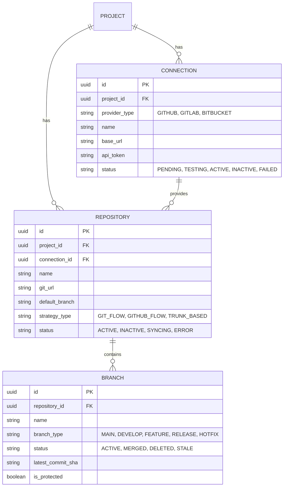
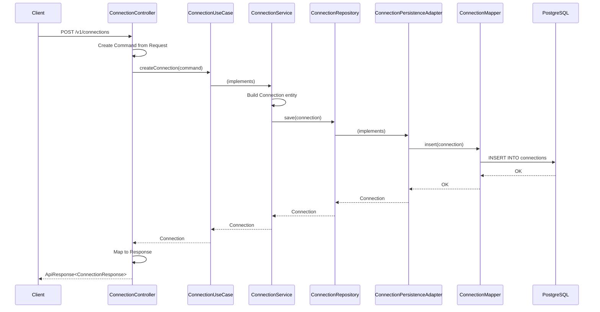
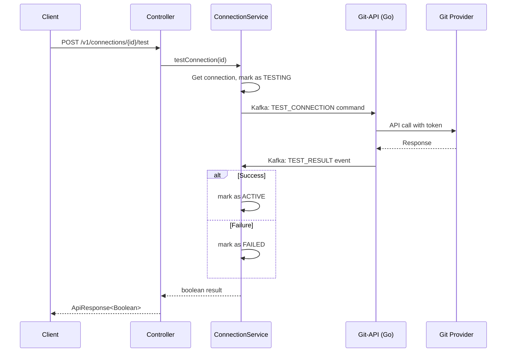
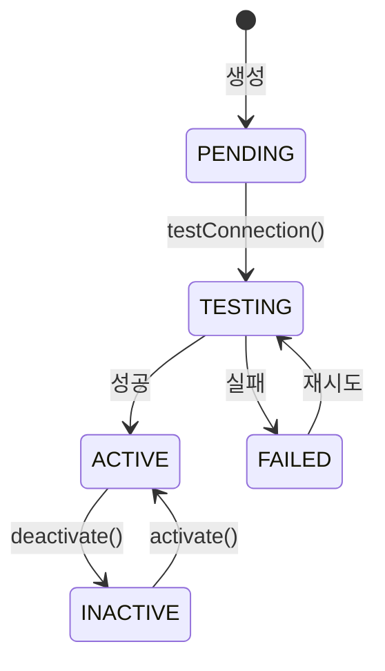
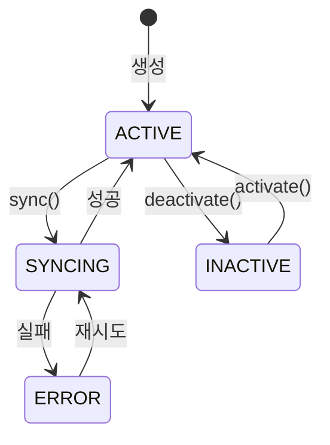
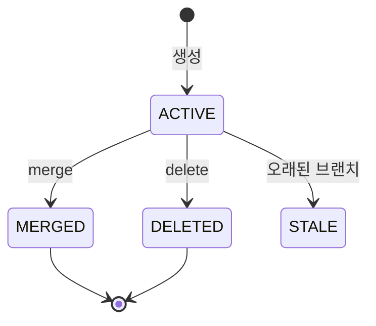

# TPS-API

Git Repository 관리를 위한 Hexagonal Architecture 기반 Spring Boot API

## 개요

TPS-API는 다중 Git Provider(GitHub, GitLab, Bitbucket)를 지원하는 저장소 관리 시스템입니다.
Hexagonal Architecture(Ports and Adapters)를 적용하여 비즈니스 로직과 외부 시스템을 분리합니다.

---

## 기술 스택

| 구분 | 기술 |
|------|------|
| Language | Java 21 (Virtual Threads) |
| Framework | Spring Boot 3.4.1 |
| Build | Gradle 8.11 |
| ORM | MyBatis 3.0.4 |
| Database | PostgreSQL |
| API Docs | SpringDoc OpenAPI 2.7.0 |
| Observability | OpenTelemetry |

---

## 아키텍처

### Hexagonal Architecture

```
┌─────────────────────────────────────────────────────────────────────────────┐
│                            Adapter (외부 세계)                               │
│  ┌─────────────────────┐                         ┌─────────────────────┐   │
│  │   Adapter-In-Web    │                         │ Adapter-Out-Persist │   │
│  │  (REST Controller)  │                         │   (MyBatis Mapper)  │   │
│  └──────────┬──────────┘                         └──────────▲──────────┘   │
│             │                                               │               │
│             │ implements                         implements │               │
│             ▼                                               │               │
│  ┌──────────────────────────────────────────────────────────┴──────────┐   │
│  │                      Application Layer                               │   │
│  │  ┌───────────────────────────────────────────────────────────────┐  │   │
│  │  │                         Port-In                                │  │   │
│  │  │  ┌─────────────────┐ ┌─────────────────┐ ┌─────────────────┐  │  │   │
│  │  │  │ConnectionUseCase│ │RepositoryUseCase│ │  BranchUseCase  │  │  │   │
│  │  │  └────────┬────────┘ └────────┬────────┘ └────────┬────────┘  │  │   │
│  │  └───────────┼───────────────────┼───────────────────┼───────────┘  │   │
│  │              │                   │                   │              │   │
│  │              ▼                   ▼                   ▼              │   │
│  │  ┌─────────────────┐ ┌─────────────────┐ ┌─────────────────┐       │   │
│  │  │ConnectionService│ │RepositoryService│ │  BranchService  │       │   │
│  │  └────────┬────────┘ └────────┬────────┘ └────────┬────────┘       │   │
│  │           │                   │                   │                │   │
│  │  ┌────────┴───────────────────┴───────────────────┴──────────────┐ │   │
│  │  │                          Port-Out                              │ │   │
│  │  │  ┌──────────────────┐ ┌───────────────────┐ ┌───────────────┐ │ │   │
│  │  │  │ConnectionRepository│ │RepositoryRepository│ │BranchRepository│ │ │   │
│  │  │  └──────────────────┘ └───────────────────┘ └───────────────┘ │ │   │
│  │  └───────────────────────────────────────────────────────────────┘ │   │
│  └──────────────────────────────────────────────────────────────────────┘   │
│                                                                             │
│  ┌──────────────────────────────────────────────────────────────────────┐  │
│  │                         Domain Layer                                  │  │
│  │  ┌──────────────┐  ┌──────────────┐  ┌──────────────┐                │  │
│  │  │  Connection  │  │  Repository  │  │    Branch    │                │  │
│  │  └──────────────┘  └──────────────┘  └──────────────┘                │  │
│  └──────────────────────────────────────────────────────────────────────┘  │
└─────────────────────────────────────────────────────────────────────────────┘
```

### 도메인 관계도



---

## API 흐름

### Connection 생성 → Repository 등록 → Branch 관리



### 연결 테스트 흐름



---

## API 명세

### Base URL
```
http://localhost:8080/v1
```

### Swagger UI
```
http://localhost:8080/swagger-ui.html
```

---

### Connection API

Git Provider 연결 관리

| Method | Endpoint | 설명 |
|--------|----------|------|
| `POST` | `/connections` | 연결 생성 |
| `PUT` | `/connections/{id}` | 연결 수정 |
| `GET` | `/connections/{id}` | 연결 조회 |
| `GET` | `/connections/project/{projectId}` | 프로젝트별 연결 목록 |
| `GET` | `/connections/provider/{providerType}` | Provider 타입별 연결 목록 |
| `GET` | `/connections/active` | 활성 연결 목록 |
| `DELETE` | `/connections/{id}` | 연결 삭제 |
| `POST` | `/connections/{id}/activate` | 연결 활성화 |
| `POST` | `/connections/{id}/deactivate` | 연결 비활성화 |
| `POST` | `/connections/{id}/test` | 연결 테스트 |

#### 요청 예시
```json
POST /v1/connections
{
  "projectId": "550e8400-e29b-41d4-a716-446655440000",
  "providerType": "GITHUB",
  "name": "Company GitHub",
  "baseUrl": "https://api.github.com",
  "apiToken": "ghp_xxxxxxxxxxxx",
  "metadata": "{\"org\": \"my-org\"}"
}
```

#### 응답 예시
```json
{
  "success": true,
  "data": {
    "id": "123e4567-e89b-12d3-a456-426614174000",
    "projectId": "550e8400-e29b-41d4-a716-446655440000",
    "providerType": "GITHUB",
    "name": "Company GitHub",
    "baseUrl": "https://api.github.com",
    "status": "PENDING",
    "createdAt": "2025-01-05T10:00:00"
  }
}
```

---

### Repository API

Git 저장소 관리

| Method | Endpoint | 설명 |
|--------|----------|------|
| `POST` | `/repositories` | 저장소 등록 |
| `PUT` | `/repositories/{id}` | 저장소 수정 |
| `GET` | `/repositories/{id}` | 저장소 조회 |
| `GET` | `/repositories/project/{projectId}` | 프로젝트별 저장소 목록 |
| `GET` | `/repositories/connection/{connectionId}` | 연결별 저장소 목록 |
| `DELETE` | `/repositories/{id}` | 저장소 삭제 |
| `POST` | `/repositories/{id}/sync` | 저장소 동기화 |

---

### Branch API

Git 브랜치 관리

| Method | Endpoint | 설명 |
|--------|----------|------|
| `POST` | `/branches` | 브랜치 생성 |
| `PUT` | `/branches/{id}` | 브랜치 수정 |
| `GET` | `/branches/{id}` | 브랜치 조회 |
| `GET` | `/branches/repository/{repositoryId}` | 저장소별 브랜치 목록 |
| `GET` | `/branches/repository/{repositoryId}/status/{status}` | 상태별 브랜치 목록 |
| `GET` | `/branches/repository/{repositoryId}/type/{type}` | 타입별 브랜치 목록 |
| `DELETE` | `/branches/{id}` | 브랜치 삭제 |
| `PUT` | `/branches/{id}/status` | 브랜치 상태 변경 |
| `PUT` | `/branches/{id}/commit` | 커밋 SHA 업데이트 |

---

## 도메인 상태

### Connection Status



### Repository Status



### Branch Status



---

## 실행 방법

### 사전 요구사항
- Java 21+
- PostgreSQL 15+
- Docker (선택)

### 로컬 실행
```bash
# 의존성 다운로드 및 빌드
./gradlew build

# 실행
./gradlew bootRun

# Virtual Threads 활성화 실행
./gradlew bootRun --args='--spring.threads.virtual.enabled=true'
```

### Docker 실행
```bash
cd project/docker
docker compose up -d postgres
docker compose up -d tps-api
```

---

## 폴더 구조

[ARCHITECTURE.md](ARCHITECTURE.md) 참조

---

## 관련 문서

- [아키텍처 상세](ARCHITECTURE.md)
- [멀티 프로바이더 설계](../docs/TPS/tech/git-api/providers.md)
- [Git-API (Go 모듈)](../git-api/README.md)
