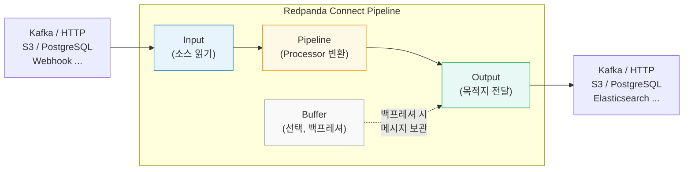

# 왜 Redpanda Connect 인가?

---

> Redpanda Connect는 Go 기반 단일 바이너리(20MB)로, YAML 선언만으로 데이터 파이프라인을 구성할 수 있습니다. 300개 이상의 커넥터가 내장되어 있어, 커스텀 코드 없이 대부분의 연동 시나리오를 처리할 수 있습니다. 
>
> at-least-once 보장이 내장되어 있고, 모든 파이프라인이 통일된 YAML 형식을 따릅니다.

## Connect의 역할 경계

Connect는 서비스 사이에서 데이터를 변환/라우팅 하는 "인프라 접착제(glue)"입니다. 비즈니스 로직을 처리하는 도구가 아닙니다.

| 작업                                | Connect               | 애플리케이션 코드          |
| ----------------------------------- | --------------------- | -------------------------- |
| 필드 매핑·포맷 변환 (JSON ↔ Avro)   | ✅                     | 가능하지만 과한 편         |
| 조건부 라우팅 (토픽 분기)           | ✅                     | 가능                       |
| 프로토콜 브릿징 (HTTP → Kafka → DB) | ✅                     | 가능                       |
| 재시도·DLQ (인프라 에러 처리)       | ✅                     | 가능                       |
| 잔고 확인 → 차감 (상태 읽기+쓰기)   | ❌                     | ✅                          |
| DB + 메시지 원자적 처리 (트랜잭션)  | ❌                     | ✅ (Outbox, @Transactional) |
| 복잡한 분기 (if-else 3단+)          | ❌ 가독성 붕괴         | ✅                          |
| 단위 테스트                         | YAML 테스트 도구 부족 | ✅ (JUnit, Mockito)         |

경계를 구분하는 기준은 단순합니다. 

- 데이터를 보고 변환하고 라우팅한다. (Connect)
- 상태를 읽고, 판단하고 상태를 변경한다. (애플리케이션 코드)

Bloblang은 데이터 변환 DSL이지 범용 프로그래밍 언어가 아니라서, 상태 관리나 트랜잭션 기능이 없습니다. 예를 들어 "주문 이벤트를 엘라스틱 서치에 적재"는 커넥터로 충분하지만, "주문 이벤트를 받아서 재고를 차감하고, 부족하면 취소 이벤트 발행"은 애플리케이션 코드의 영역입니다.

## 아키텍처(4가지 컴포넌트)

Redpanda Connect를 이해하려면 파이프라인을 구성하는 4개 컴포넌트 역할을 먼저 이해해야합니다. 이 4개가 명확히 분리되어 있기 때문에, Input을 교체해도 Pipeline과 Output은 그대로 재사용할 수 있습니다. 



| 컴포넌트     | 역할                                           | 예시                                       |
| ------------ | ---------------------------------------------- | ------------------------------------------ |
| **Input**    | 데이터 소스에서 메시지를 읽어들인다            | Kafka, HTTP, S3, PostgreSQL, Webhook       |
| **Pipeline** | 메시지를 변환하거나 필터링한다                 | Bloblang, JSON 파싱, 필드 추출             |
| **Output**   | 변환된 메시지를 목적지로 전달한다              | Kafka, HTTP, S3, PostgreSQL, Elasticsearch |
| **Buffer**   | 백프레셔 발생 시 메시지를 임시 보관한다 (선택) | 메모리, 디스크 기반 버퍼                   |

- 각 컴포넌트는 독립적으로 교체할 수 있다. Input이 Kafka/HTTP인지 관계없이 Pipeline의 변환 로직은 동일하고 Output도 무엇이든 상관없이 Pipeline의 결과를 받는다.
- Buffer는 Output이 느릴 때 메시지를 임시 보관하여 Input/Output의 속도 차이를 흡수해준다.

## 파일 구조

파이프라인 YAML을 프로젝트에서 어떻게 정리할지는 운영 방식에 따라 달라집니다.

**파이프라인별 단일 파일**

```bash
connect/
├── orders-to-elastic.yaml      # 파이프라인 1
├── users-to-postgres.yaml      # 파이프라인 2
├── webhook-to-kafka.yaml       # 파이프라인 3
└── dlq-reprocess.yaml          # DLQ 재처리 전용
```

**스트림 모드(여러 파이프라인 동시 실행)**

하나의 Connect 프로세스에서 여러 파이프라인을 동시에 실행하는 방식입니다. `rpk connect streams` 명령어로 디렉토리 내 모든 YAML을 로드하고, REST API(`:4195/streams`)로 런타임에 추가/수정/삭제할 수 있습니다.

```bash
connect/streams/
├── orders-to-elastic.yaml     # 파이프라인 A
├── users-to-postgres.yaml     # 파이프라인 B
└── webhook-to-kafka.yaml      # 파이프라인 C

# 전체 디렉토리의 파이프라인을 한 프로세스로 실행
rpk connect streams connect/streams/*.yaml
```

단일 파일 모드(`rpk connect run`)는 파이프라인 하나를 하나의 프로세스로 실행하므로 격리가 명확하고, 스트림 모드는 리소스를 공유하되 REST API로 동적 관리가 가능합니다. Kubernetes 환경에서는 단일 파일 모드로 파이프라인마다 Pod를 분리하는 것이 일반적입니다.

# rpk connect CLI

---

> Redpanda Connect는 `rpk`와 별도의 프로젝트다. `rpk`는 Redpanda 브로커 관리 도구이고, Redpanda Connect(구 Benthos)는 Go 기반 데이터 파이프라인 런타임이다. 
>
> Docker 이미지도 다르다(`redpandadata/redpanda` vs `redpandadata/connect`). `rpk connect`는 rpk가 Redpanda Connect 바이너리를 래핑하여 호출하는 것이므로, Redpanda 없이도 `redpanda-connect` 바이너리로 독립 실행할 수 있다.

## 명령어 종류

| 명령어                             | 용도                           | 비고                                   |
| ---------------------------------- | ------------------------------ | -------------------------------------- |
| `rpk connect run <file>`           | 단일 파이프라인 실행           | 가장 기본적인 실행 방식                |
| `rpk connect streams [dir]`        | Streams Mode (멀티 파이프라인) | REST API로 동적 관리 가능 — 아래 상세  |
| `rpk connect lint <file>`          | YAML 문법 검증                 | CI에서 배포 전 검증에 활용             |
| `rpk connect test <file>`          | 단위 테스트 실행               | YAML 내 `tests:` 블록 실행             |
| `rpk connect list <type>`          | 사용 가능한 컴포넌트 조회      | inputs, outputs, processors, caches 등 |
| `rpk connect create <type>/<name>` | 컴포넌트 템플릿 생성           | 빈 YAML 스캐폴딩                       |

### rpk connect run (단일 파이프라인)

가장 일반적으로 쓰는 명령어입니다. YAML 파일 하나를 지정하면 해당 파이프라인이 foreground로 실행됩니다.

```yaml
# 기본 실행
rpk connect run pipeline.yaml

# 환경변수 주입 (YAML 내 ${VAR} 치환)
BROKER_URL=localhost:19092 rpk connect run pipeline.yaml

# 설정 오버라이드 (CLI에서 직접 값 지정)
rpk connect run pipeline.yaml --set input.kafka_franz.seed_brokers=localhost:19092

# 로그 레벨 변경
rpk connect run --log.level DEBUG pipeline.yaml
```

- --set 플래그는 YAML의 특정 필드를 CLI에서 오버라이드할 때 쓴다. 환경별로 브로커 주소만 다른 경우, YAML을 복사하지 않고 --set으로 해결해 줄 수 있습니다.

### rpk connect lint(배포 전 검증)

파이프라인 YAML의 문법 오류를 실행 전에 잡습니다. CI/CD 파이프라인에서 배포 전 검증 단계로 사용합니다.

```yaml
# 단일 파일 검증
rpk connect lint pipeline.yaml

# 디렉토리 전체 검증
rpk connect lint ./connect/*.yaml

# 성공 시 출력 없음 (exit code 0), 실패 시 에러 위치 표시
# 예: pipeline.yaml:15:5 field 'tpic' not recognised
```

- lint는 필드명 오타, 필수 필드 누락 등 잘못된 중첩 구조를 감지합니다. 다만 값의 유효성(브로커 주소 접속 가능)은 검증하지 않습니다.

### rpk connect test(YAML 단위 테스트)

파이프라인 YAML안에 tests: 블록을 선언하면, 실제 외부 시스템 없이 변환 로직을 테스트 할 수 있습니다.

```yaml
# pipeline.yaml
pipeline:
  processors:
    - mapping: |
        root.full_name = this.first_name + " " + this.last_name
        root.age_group = if this.age >= 18 { "adult" } else { "minor" }

tests:
  - name: "성인 사용자 변환"
    input_batch:
      - content: '{"first_name":"Kim","last_name":"Minsoo","age":25}'
    output_batches:
      - - json_equals:
            full_name: "Kim Minsoo"
            age_group: "adult"

  - name: "미성년자 변환"
    input_batch:
      - content: '{"first_name":"Lee","last_name":"Jiyoung","age":15}'
    output_batches:
      - - json_equals:
            age_group: "minor"
```

```bash
rpk connect test pipeline.yaml
# 출력: Test 'pipeline.yaml' succeeded
```

- tests: 블록은 파이프라인 실행 시 무시되므로, 테스트 코드를 파이프라인 파일에 같이 둬도 문제 없다.

### rpk connect list(컴포넌트 카탈로그)

Redpanda Connect에 내장된 300개 이상의 컴포넌트를 카테고리별로 조회한다.

```bash
# 사용 가능한 Input 목록
rpk connect list inputs

# Output 목록
rpk connect list outputs

# Processor 목록
rpk connect list processors

# Cache 목록
rpk connect list caches
```

### rpk connect create(템플릿 생성)

컴포넌트 기본 YAML 구조를 출력한다. 공식 문서를 찾아보는 대신 CLI에서 바로 스캐폴딩할 수 있다.

```yaml
# kafka_franz Input 템플릿
rpk connect create input/kafka_franz

# http_client Output 템플릿
rpk connect create output/http_client
```

## 도커 실행

Redpanda Connect는 전용 Docker이미지로 실행한다. rpk와 별개입니다.

```yaml
# docker-compose.yml
services:
  connect-jenkins:
    image: redpandadata/connect:4.43
    volumes:
      - ./connect/jenkins-webhook.yaml:/pipeline.yaml
    command: ["run", "/pipeline.yaml"]
    depends_on:
      - redpanda
```

## Stream 모드(런타임 파이프라인 관리)

Streams Mode는 REST API를 통해 **런타임에** 파이프라인을 CRUD할 수 있어서, 외부 시스템(Web UI, CI/CD 등)과의 자동 연계가 가능해진다.

| 모드             | 명령어                                 | 동적 관리       |
| ---------------- | -------------------------------------- | --------------- |
| 단일 파일        | `rpk connect run pipeline.yaml`        | ❌               |
| 디렉토리         | `rpk connect streams ./streams/*.yaml` | ❌ (재시작 필요) |
| **Streams Mode** | `rpk connect streams` (YAML 없이)      | ✅ (REST API)    |

```bash
# Streams Mode 시작
rpk connect streams

# 관측성 설정 + 공유 리소스 포함
rpk connect streams -o ./observability.yaml -r ./resources/*.yaml
```

- -o옵션은 관측성 전용 YAML을 지정하는 플래그입니다. 파이프라인이 아닌 metric, logger, tracer 설정만 담은 파일을 로드하며 이 설정은 모든 동적 파이프라인에 공통 적용됩니다.

  ```yaml
  # observability.yaml — -o 옵션으로 로드되는 파일
  metrics:
    prometheus:
      path: /metrics
      port: 9090
  
  logger:
    level: INFO
    format: json
    static_fields:
      service: "connect-streams"
  
  ```

### REST API 엔드포인트

| 동작        | Method | Endpoint                 |
| ----------- | ------ | ------------------------ |
| 전체 조회   | GET    | `/streams`               |
| 생성        | POST   | `/streams/{id}`          |
| 수정 (전체) | PUT    | `/streams/{id}`          |
| 수정 (부분) | PATCH  | `/streams/{id}`          |
| 삭제        | DELETE | `/streams/{id}`          |
| 일괄 설정   | POST   | `/streams`               |
| 헬스체크    | GET    | `/ready`                 |
| 메트릭      | GET    | `/streams/{id}/stats`    |
| 리소스 관리 | POST   | `/resources/{type}/{id}` |

```bash
# 파이프라인 생성 — YAML body
curl -s -X POST http://localhost:4195/streams/webhook-to-kafka \
  -H "Content-Type: application/x-yaml" \
  -d '
input:
  http_server:
    path: /webhook
    allowed_verbs: [POST]
pipeline:
  processors:
    - mapping: "root = this"
output:
  kafka_franz:
    seed_brokers: ["localhost:19092"]
    topic: webhook-events
'

# 파이프라인 상태 확인
curl -s http://localhost:4195/streams | jq .

# 파이프라인 삭제
curl -s -X DELETE http://localhost:4195/streams/webhook-to-kafka
```

- **환경변수 보간 제한**: REST API로 생성한 파이프라인에서는 `${ENV_VAR}` 형태의 환경변수 보간이 동작하지 않는다. Bloblang 함수 보간(`${! env("ENV_VAR") }`)은 사용 가능하므로, 동적 생성 시에는 함수 보간을 사용해야 한다.

### Dynamic Inputs/Outputs

Streams API가 파이프라인 단위의 CRUD라면, Dynamic Input/Output은 개별 컴포넌트 단위의 CRUD다. `dynamic` input을 선언하면 `/inputs/{label}` 엔드포인트로 런타임에 Input을 추가/교체/삭제할 수 있다. Output도 `/outputs/{label}`로 동일한 패턴이다.

```yaml
# 파이프라인 YAML — dynamic input 선언
input:
  dynamic:
    inputs:
      initial-source:        # ← 이 label이 REST API 경로가 된다
        kafka_franz:
          seed_brokers: ["localhost:19092"]
          topics: ["events"]
          consumer_group: dynamic-demo

pipeline:
  processors:
    - mapping: "root = this"

output:
  kafka_franz:
    seed_brokers: ["localhost:19092"]
    topic: processed-events
```

- 위 파이프라인을 실행하면 /inputs/{label} 앤드포인트가 활성화 된다.

```bash
# 새 Input 추가 — label "webhook-source"로 HTTP 서버 Input 추가
curl -X POST http://localhost:4195/inputs/webhook-source \
  -H "Content-Type: application/x-yaml" \
  -d 'http_server: { path: /webhook, allowed_verbs: [POST] }'

# 기존 Input 교체 — label "initial-source"의 토픽 변경
curl -X PUT http://localhost:4195/inputs/initial-source \
  -H "Content-Type: application/x-yaml" \
  -d 'kafka_franz: { seed_brokers: ["localhost:19092"], topics: ["events-v2"], consumer_group: dynamic-demo }'

# Input 제거
curl -X DELETE http://localhost:4195/inputs/webhook-source
```

- 동적 Input은 여러 label이 동시에 존재한다면 fan-in처럼 동작한다.(모든 input의 메시지가 같은 pipeline으로 합쳐진다.)
- 동적 Output도 동일한 패턴이며, 여러 label이 있으면 fan-out처럼 동작한다.

### 실무 시나리오: Jenkins 다중 인스턴스 자동 연계

사용자가 Web UI에서 Jenkins 인스턴스를 등록하면, 백엔드가 Streams API를 호출하여 해당 인스턴스의 빌드 이벤트를 수집하는 파이프라인을 자동 생성하는 구조다.

```yaml
# jenkins-pipeline-template.yaml — 인스턴스별로 변수만 교체
input:
  http_client:
    url: "${! env(\"JENKINS_URL\") }/api/json?tree=jobs[name,lastBuild[number,result,timestamp]]"
    verb: GET
    headers:
      Authorization: "Bearer ${! env(\"JENKINS_TOKEN\") }"
    timeout: 10s
    retry_period: 30s

pipeline:
  processors:
    - mapping: |
        root.source = "jenkins"
        root.instance_id = env("INSTANCE_ID")
        root.jobs = this.jobs.map_each(job -> {
          "name": job.name,
          "build_number": job.lastBuild.number,
          "result": job.lastBuild.result,
          "timestamp": job.lastBuild.timestamp
        })

output:
  kafka_franz:
    seed_brokers: ["redpanda:9092"]
    topic: ci-events
```

```bash
# 파이프라인 생성 — 인스턴스별 ID로 등록
curl -X POST http://redpanda-connect:4195/streams/jenkins-prod-01 \
  -H "Content-Type: application/x-yaml" \
  -d @jenkins-pipeline-template.yaml

# 두 번째 인스턴스도 같은 템플릿으로 등록
curl -X POST http://redpanda-connect:4195/streams/jenkins-staging-01 \
  -H "Content-Type: application/x-yaml" \
  -d @jenkins-pipeline-template.yaml

# 인스턴스 제거
curl -X DELETE http://redpanda-connect:4195/streams/jenkins-prod-01
```


Jenkins 인스턴스가 몇 대든 동일한 템플릿으로 파이프라인을 생성할 수 있고, Connect 프로세스를 재시작할 필요가 없다.

### Streams Mode vs Kafka Connect REST API 비교

| 항목            | Redpanda Connect (Streams Mode)     | Kafka Connect                         |
| --------------- | ----------------------------------- | ------------------------------------- |
| API 포트        | 4195                                | 8083                                  |
| 파이프라인 단위 | Stream (input→pipeline→output 전체) | Connector (source 또는 sink 하나)     |
| 생성            | `POST /streams/{id}` + YAML body    | `POST /connectors` + JSON body        |
| 일시정지/재개   | ❌ (삭제 후 재생성)                  | `PUT /connectors/{name}/pause|resume` |
| 설정 형식       | YAML 또는 JSON                      | JSON만                                |
| 변환 로직 포함  | ✅ (pipeline.processors)             | ❌ (SMT로 제한적 변환)                 |
| 분산 모드       | 단일 프로세스                       | 클러스터 기반 자동 분산               |
| 플러그인 관리   | 불필요 (단일 바이너리에 내장)       | JAR 설치 + Worker 재시작              |

