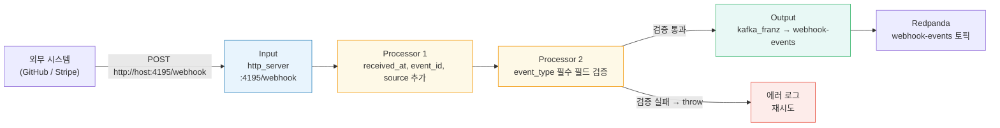
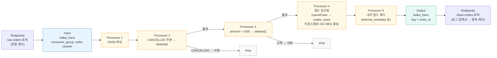
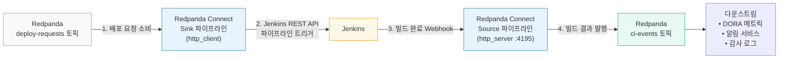
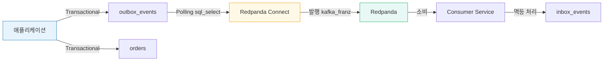
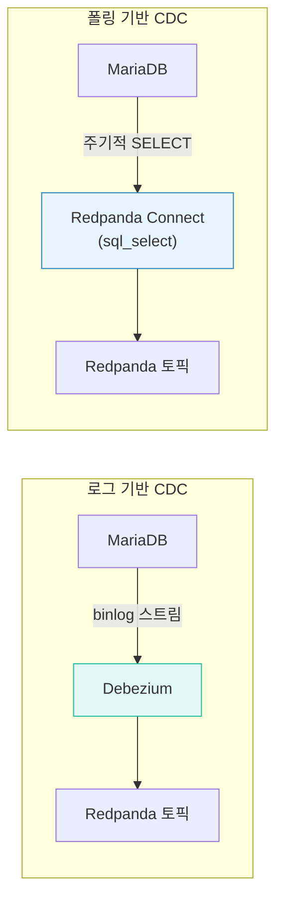
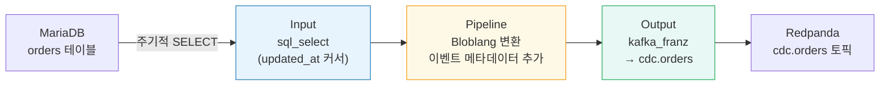

# 실습 시나리오

---

## 1. HTTP WebHook - Redpanda

외부 시스템(Github, Stripe 등)에서 발생하는 웹훅 이벤트를 Redpanda 토픽으로 수집합니다. 요구사항은 다음과 같습니다.

- HTTP POST 웹훅 통신
- 수신 시간 타임스탬프 추가
- Redpanda webhook-events 토픽에 저장
- 에러 발생 시 재시도



### 파이프라인 설정

```yaml
# --- Input: HTTP 웹훅 수신 ---
input:
  http_server:
    path: /webhook                     # POST 요청을 받을 엔드포인트 경로
    allowed_verbs: [POST]              # 허용할 HTTP 메서드
    timeout: 30s                       # 응답 대기 타임아웃
    cors:
      enabled: true                    # CORS 허용 (브라우저 테스트용)
      allowed_origins: ["*"]


# --- Pipeline: 메타데이터 추가 + 필수 필드 검증 ---
pipeline:
  processors:
    - mapping: |
        root = this
        root.received_at = now().ts_format("2006-01-02T15:04:05Z07:00")
        root.event_id = uuid_v4()      # 추적용 고유 이벤트 ID
        root.source = "webhook-server"

    - mapping: |                       # event_type 없으면 에러 발생 → 재시도
        root = if !this.exists("event_type") {
          throw("Missing required field: event_type")
        } else {
          this
        }


# --- Output: Redpanda 토픽으로 전달 (재시도 포함) ---
output:
  retry:
    backoff:
      initial_interval: 1s            # 첫 재시도 대기 시간
      max_interval: 10s               # 최대 재시도 간격 (지수 백오프)
      max_elapsed_time: 1m            # 재시도 포기 시한
    output:
      kafka_franz:
        seed_brokers:
          - localhost:19092            # Redpanda 브로커 주소
        topic: webhook-events          # 대상 토픽
        key: ${! this.event_type }     # 파티션 키: 같은 이벤트 타입 → 같은 파티션
        compression: snappy            # 메시지 압축 (CPU↓, 네트워크↓)
        max_in_flight: 1               # 동시 전송 수 (순서 보장)
        idempotent_write: true         # 중복 전송 방지 (PID+시퀀스)
        batching:
          count: 100                   # 100개 모이면 배치 전송
          period: 100ms                # 또는 100ms마다 전송


# --- Observability: 메트릭 + 로깅 ---
metrics:
  prometheus:
    enabled: true
    path: /metrics                     # Prometheus scrape 엔드포인트
    port: 9090                         # 메트릭 전용 포트 (파이프라인별 고유)

logger:
  level: INFO                          # 로그 레벨 (DEBUG로 변경 시 상세 로그)
  format: json                         # 구조화 로그 (수집기 파싱 용이)
```

### 테스트 & 출력

```bash
# 웹훅 POST 요청
curl -X POST http://localhost:4195/webhook \
  -H "Content-Type: application/json" \
  -d '{
    "event_type": "order.created",
    "order_id": "ORD-001",
    "amount": 50000
  }'

# Redpanda 토픽 확인
rpk topic consume webhook-events --format json
```

```json
{
  "event_type": "order.created",
  "order_id": "ORD-001",
  "amount": 50000,
  "received_at": "2026-02-06T10:30:15+09:00",
  "event_id": "a1b2c3d4-e5f6-7890-abcd-ef1234567890",
  "source": "webhook-server"
}
```

## 2. Redpanda -> Redpanda (변환)

원본 주문 이벤트 토픽(raw-orders)에서 데이터를 정제하여 클릭 토픽(clean-orders)으로 전송합니다. 다양한 소스에서 데이터가 유입될 때 필드명 규약을 통일시키기 위한 역할을 합니다. 요구사항은 다음과 같습니다.

- 취소된 주문 필터링
- 금액 1,000원 미만 필터링
- 필드 정규화
- 중복 제거



### 파이프라인

```yaml
# --- Input: raw-orders 토픽 소비 ---
input:
  kafka_franz:
    seed_brokers:
      - localhost:19092                # Redpanda 브로커 주소
    topics:
      - raw-orders                     # 정제 전 원본 주문 토픽
    consumer_group: order-cleaner      # 컨슈머 그룹
    start_from_oldest: false           # 최신 메시지부터 소비

# --- Pipeline: 필터링 + 필드 정규화 ---
pipeline:
  processors:
    # 1. JSON 파싱
    - mapping: |
        root = this.parse_json()       # 문자열 → JSON 객체 변환

    # 2. 필터링: 취소된 주문 및 소액 주문 제외
    - mapping: |                       # CANCELLED 주문 → 파이프라인에서 제거
        root = if this.status == "CANCELLED" {
          deleted()
        } else {
          this
        }

    - mapping: |                       # 1000원 미만 소액 주문 → 제거
        root = if this.amount < 1000 {
          deleted()
        } else {
          this
        }

    # 3. 필드 정규화 (camelCase/PascalCase → snake_case 통일)
    - mapping: |
        # camelCase/PascalCase 필드명을 snake_case로 통일
        root.order_id = this.orderId.or(this.order_id).or(this.OrderID)
        root.customer_id = this.customerId.or(this.customer_id)
        root.amount = this.amount.number()
        root.status = this.status.uppercase()

        # 타임스탬프 ISO 8601 형식으로 통일
        root.created_at = if this.createdAt.type() == "string" {
          this.createdAt.ts_parse("2006-01-02T15:04:05Z")
        } else {
          this.created_at
        }.ts_format("2006-01-02T15:04:05Z")

        # 정제 메타데이터 추가
        root.cleaned_at = now().ts_format("2006-01-02T15:04:05Z")
        root.version = "v1"

    # 4. 내부 필드 제거
    - mapping: |                       # 다운스트림에 불필요한 내부 필드 삭제
        root = this.without(
          "internal_metadata",
          "debug_info",
          "raw_payload"
        )

# --- Output: 정제된 토픽으로 전달 ---
output:
  kafka_franz:
    seed_brokers:
      - localhost:19092
    topic: clean-orders                # 정제된 메시지를 보낼 대상 토픽
    # order_id를 키로 사용하면 같은 주문은 같은 파티션에 기록되어
    # 로그 컴팩션으로 중복 제거 효과를 얻는다
    key: ${! this.order_id }           # 파티션 키 (로그 컴팩션 중복 제거)
    compression: snappy
    metadata:
      include_patterns:
        - ".*"                         # 업스트림 메타데이터 전부 전달
    headers:
      source: "order-cleaner"          # 파이프라인 식별 헤더
      version: "1.0"

# --- Observability: 메트릭 + 로깅 ---
metrics:
  prometheus:
    enabled: true
    path: /metrics
    port: 9092                         # 시나리오별 고유 포트 (9090/9091과 충돌 방지)

logger:
  level: INFO                          # 로그 레벨
  format: json                         # 구조화 로그
```

### 테스트/출력

```bash
# 원본 토픽에 다양한 형식의 주문 발행
rpk topic produce raw-orders << 'EOF'
{"orderId":"ORD-001","customerId":"CUST-1","amount":50000,"status":"PENDING","createdAt":"2026-02-06T10:30:00Z"}
{"OrderID":"ORD-002","customerId":"CUST-2","amount":500,"status":"PENDING","createdAt":"2026-02-06T10:31:00Z"}
{"order_id":"ORD-003","customer_id":"CUST-3","amount":30000,"status":"CANCELLED","createdAt":"2026-02-06T10:32:00Z"}
EOF

# 정제된 토픽 확인
rpk topic consume clean-orders --format json
```

```json
{
  "order_id": "ORD-001",
  "customer_id": "CUST-1",
  "amount": 50000,
  "status": "PENDING",
  "created_at": "2026-02-06T10:30:00Z",
  "cleaned_at": "2026-02-06T10:35:15Z",
  "version": "v1"
}
```

## 3. Redpanda <-> Jenkins (Source + Sink)

이 시나리오는 Jenkins를 중심으로 Sink(배포 요청 토픽 -> Jenkins 파이프라인 트리거), Source(빌드 결과 -> 토픽)을 모두 구현합니다.



### Sink 파이프라인

```yaml
# --- Input: 배포 요청 토픽 소비 ---
input:
  kafka_franz:
    seed_brokers:
      - localhost:19092                # Redpanda 브로커 주소
    topics:
      - deploy-requests                # 배포 요청 이벤트 토픽
    consumer_group: connect-jenkins-trigger  # 컨슈머 그룹

# --- Pipeline: Jenkins API 파라미터 구성 ---
pipeline:
  processors:
    - mapping: |
        # Jenkins API 요청 파라미터 구성
        root.job_path = this.job_name.replace("/", "/job/")  # 슬래시 → /job/ 변환
        root.parameters = {
          "BRANCH": this.branch.or("main"),          # 기본 브랜치: main
          "ENVIRONMENT": this.environment.or("staging"),  # 기본 환경: staging
          "VERSION": this.version
        }

# --- Output: Jenkins REST API 호출 ---
output:
  http_client:
    url: 'http://jenkins:8080/job/${! this.job_path }/buildWithParameters'  # Jenkins 파이프라인 트리거 URL
    verb: POST
    headers:
      Content-Type: application/x-www-form-urlencoded
    basic_auth:
      enabled: true
      username: "${JENKINS_USER}"      # 환경변수로 자격증명 주입
      password: "${JENKINS_API_TOKEN}"
    rate_limit: ""
    retry_period: 5s                   # 실패 시 재시도 간격
    max_retry_backoff: 30s             # 최대 재시도 대기 시간
    retries: 3                         # 최대 재시도 횟수

# --- Observability: 메트릭 + 로깅 ---
metrics:
  prometheus:
    enabled: true
    path: /metrics
    port: 9093                         # 시나리오별 고유 포트

logger:
  level: INFO                          # 로그 레벨
  format: json                         # 구조화 로그
```

```bash
# 배포 요청 발행
rpk topic produce deploy-requests --format json << 'EOF'
{
  "job_name": "order-service",
  "branch": "main",
  "environment": "staging",
  "version": "1.2.3"
}
EOF

# Jenkins에서 order-service 파이프라인이 트리거되는지 확인
# http://jenkins:8080/job/order-service/
```

### Source 파이프라인

```groovy
pipeline {
    agent any
    stages {
        stage('Build') {
            steps { sh './gradlew build' }
        }
        stage('Test') {
            steps { sh './gradlew test' }
        }
    }
    post {
        always {
            script {
                def payload = [
                    event_type  : "jenkins.build",
                    job_name    : env.JOB_NAME,
                    build_number: env.BUILD_NUMBER as int,
                    status      : currentBuild.currentResult,
                    duration_ms : currentBuild.duration,
                    branch      : env.GIT_BRANCH,
                    commit      : env.GIT_COMMIT,
                    timestamp   : new Date().format("yyyy-MM-dd'T'HH:mm:ss'Z'",
                                                     TimeZone.getTimeZone('UTC'))
                ]
                httpRequest(
                    url: 'http://redpanda-connect:4195/ci/jenkins',
                    httpMode: 'POST',
                    contentType: 'APPLICATION_JSON',
                    requestBody: groovy.json.JsonOutput.toJson(payload)
                )
            }
        }
    }
}
```

```yaml
# --- Input: Jenkins Webhook 수신 ---
input:
  http_server:
    path: /ci/jenkins                  # Jenkins 빌드 완료 Webhook 경로
    allowed_verbs: [POST]              # POST만 허용
    timeout: 30s                       # 응답 대기 타임아웃

# --- Pipeline: Jenkins 이벤트 정규화 ---
pipeline:
  processors:
    - mapping: |
        root.event_id = uuid_v4()      # 추적용 고유 이벤트 ID
        root.received_at = now()
        root.source = "jenkins"

        # Jenkins 이벤트 필드 정규화
        root.job_name = this.job_name
        root.build_id = this.build_number.string()
        root.status = this.status
        root.branch = this.branch
        root.commit = this.commit.or("")
        root.duration_ms = this.duration_ms.or(0)

# --- Output: ci-events 토픽으로 발행 ---
output:
  kafka_franz:
    seed_brokers:
      - localhost:19092
    topic: ci-events                   # 정규화된 CI 이벤트 토픽
    key: '${! this.job_name }'         # job_name으로 파티셔닝
    compression: snappy

# --- Observability: 메트릭 + 로깅 ---
metrics:
  prometheus:
    enabled: true
    path: /metrics
    port: 9094                         # 시나리오별 고유 포트

logger:
  level: INFO                          # 로그 레벨
  format: json                         # 구조화 로그
```

```bash
# Redpanda Connect 실행
rpk connect run ci-events.yaml

# Jenkins 이벤트 시뮬레이션
curl -X POST http://localhost:4195/ci/jenkins \
  -H "Content-Type: application/json" \
  -d '{
    "job_name": "order-service/main",
    "build_number": 142,
    "status": "SUCCESS",
    "duration_ms": 45200,
    "branch": "main",
    "commit": "abc123f"
  }'

# 토픽 확인
rpk topic consume ci-events --format json
```

## 4. Transactional Outbox/Inbox -> Redpanda Connect (Polling)

Redpanda Connect를 Outbox Replay로 활용하는 방식으로 사용할 수 있습니다.



### 파이프라인

sql_select는 커서 기반 증분 폴링으로 동작합니다. 매 폴링마다 전체 테이블을 스캔하는게 아니라, cursor_columns에 지정한 컬럼 기준으로 마지막 읽은 위치 이후의 행만 조회한다.

```sql
-- 첫 번째 폴링 (커서 없음)
SELECT id, aggregate_type, ... FROM outbox_events
WHERE published_at IS NULL
ORDER BY id ASC;

-- 두 번째 폴링 (커서 = 마지막 읽은 id, 예: 42)
SELECT id, aggregate_type, ... FROM outbox_events
WHERE published_at IS NULL AND id > 42
ORDER BY id ASC;
```

- sql_select는 결과를 처리한 뒤 즉시 다음 조회를 실행합니다. 결과가 없으면 짧은 대기 후 재조회하므로, 별도 poll_interval 설정 없이도 동작합니다.

```yaml
# --- Input: 미발행 Outbox 이벤트 폴링 ---
input:
  sql_select:
    driver: mysql
    dsn: "app_user:app_pass@tcp(localhost:3306)/orders_db"  # MariaDB 연결 문자열
    table: outbox_events               # Outbox 테이블 폴링
    columns:
      - id
      - aggregate_type
      - aggregate_id
      - event_type
      - payload
      - topic
      - created_at
    where: "published_at IS NULL"      # 미발행 이벤트만 조회 (published_at = NULL)
    cursor_columns:
      - id                             # id 커서: 새로 추가된 이벤트만 읽음

# --- Pipeline: 메타데이터 추출 + 페이로드 언래핑 ---
pipeline:
  processors:
    - mapping: |
        let topic = this.topic         # 동적 토픽: 이벤트마다 다른 토픽으로 발행 가능
        let payload = this.payload.parse_json()  # JSON 문자열 → 객체 변환
        root = $payload                # 페이로드가 메시지 본문
        meta topic = $topic            # 토픽명을 메타데이터로 전달
        meta aggregate_type = this.aggregate_type
        meta aggregate_id = this.aggregate_id    # 파티션 키로 사용
        meta event_type = this.event_type
        meta event_id = this.id.string()         # published 마킹에 사용
        meta created_at = this.created_at

# --- Output: Kafka 발행 → published 마킹 (순차 실행) ---
output:
  broker:
    pattern: fan_out_sequential        # 1번 성공 후에만 2번 실행 (순서 보장)
    outputs:
      - kafka_franz:                   # 1번: Redpanda 토픽 발행
          seed_brokers:
            - localhost:19092
          topic: '${! meta("topic") }' # Outbox 레코드에 지정된 토픽으로 동적 발행
          key: '${! meta("aggregate_id") }'  # aggregate_id로 파티셔닝
          metadata:
            include_patterns: [".*"]   # 모든 메타데이터를 Kafka 헤더로 전달
          max_in_flight: 1             # 순서 보장
      - sql_raw:                       # 2번: published_at 마킹 (발행 성공 후에만 실행)
          driver: mysql
          dsn: "app_user:app_pass@tcp(localhost:3306)/orders_db"
          query: "UPDATE outbox_events SET published_at = NOW(6) WHERE id = ?"
          args_mapping: 'root = [ meta("event_id").number() ]'

# --- Observability: 메트릭 + 로깅 ---
metrics:
  prometheus:
    enabled: true
    path: /metrics
    port: 9096                         # 시나리오별 고유 포트

logger:
  level: INFO                          # 로그 레벨
  format: json                         # 구조화 로그
```

## 5. Transactional CDC -> Redpanda

CDC(Change Data Capture)는 데이터베이스의 변경 사항을 실시간 이벤트 스트림으로 캡처하는 기술입니다. 전통적인 배치 ETL이 정해진 주기마다 전체 데이터를 복사하는 반면, CDC는 트랜잭션 커밋 시점에 변경분만 캡처하므로 지연이 짧고 네트워크 부하가 적습니다.

구현 방식은 크게 2가지입니다.



| 방식                       | 원리                      | 지연       | DB 부하   | DELETE 감지               |
| -------------------------- | ------------------------- | ---------- | --------- | ------------------------- |
| **로그 기반** (binlog)     | 트랜잭션 로그를 직접 읽음 | ms 단위    | 매우 낮음 | 지원                      |
| **폴링 기반** (sql_select) | 주기적 SELECT 쿼리        | 초~분 단위 | 중간      | 미지원 (soft delete 필요) |

### Redpanda Connect 폴링 CDC 파이프라인

Redpanda Connect에서 MariaDB 변경을 캡처하는 방법은 sql_select 입력을 사용하는 폴링 방식입니다.



```yaml
# --- Input: MariaDB 폴링 CDC ---
input:
  sql_select:
    driver: mysql
    dsn: "app_user:app_pass@tcp(localhost:3306)/orders_db"  # MariaDB 연결 문자열
    table: orders                      # 변경 감지 대상 테이블
    columns:
      - id
      - customer_id
      - amount
      - status
      - created_at
      - updated_at
    where: "updated_at > ?"            # 마지막 커서 이후 변경된 행만 조회
    cursor_columns:
      - updated_at                     # 커서 컬럼: 마지막 읽은 위치 기억
    init_statement: |
      SET time_zone = '+00:00'         # UTC 기준으로 타임스탬프 통일

# --- Pipeline: CDC 이벤트 메타데이터 추가 ---
pipeline:
  processors:
    - mapping: |
        root.event_id = uuid_v4()      # 추적용 고유 이벤트 ID
        root.event_type = "changed"    # INSERT/UPDATE 모두 changed (DELETE 감지 불가)
        root.source = "mariadb.orders_db.orders"  # 소스 테이블 식별자
        root.timestamp = now()         # 캡처 시점 타임스탬프
        root.payload.id = this.id
        root.payload.customer_id = this.customer_id
        root.payload.amount = this.amount
        root.payload.status = this.status
        root.payload.created_at = this.created_at
        root.payload.updated_at = this.updated_at

# --- Output: cdc.orders 토픽으로 발행 ---
output:
  kafka_franz:
    seed_brokers:
      - localhost:19092
    topic: cdc.orders                  # CDC 이벤트 전용 토픽
    key: '${! this.payload.id }'       # PK를 키로 → 같은 행의 이벤트가 같은 파티션
    compression: snappy
    max_in_flight: 1                   # 순서 보장 (동시 전송 1건)

# --- Observability: 메트릭 + 로깅 ---
metrics:
  prometheus:
    enabled: true
    path: /metrics
    port: 9095                         # 시나리오별 고유 포트

logger:
  level: INFO                          # 로그 레벨
  format: json                         # 구조화 로그
```

### Debezium vs Redpanda Connect 폴링 비교

| 항목            | Debezium (Kafka Connect)       | Redpanda Connect (sql_select) |
| --------------- | ------------------------------ | ----------------------------- |
| **CDC 방식**    | binlog 스트림 (실시간)         | 주기적 SELECT 쿼리            |
| **배포**        | JVM Worker 클러스터            | 단일 Go 바이너리 (20MB)       |
| **설정**        | JSON (REST API)                | YAML 파일                     |
| **변환**        | SMT (제한적, 체인)             | Bloblang (유연, 스크립팅)     |
| **스냅샷**      | 지원 (initial, schema_only 등) | 미지원 (첫 쿼리가 전체 스캔)  |
| **DELETE 감지** | 지원 (tombstone 이벤트)        | 미지원 (soft delete 필요)     |
| **지연시간**    | 밀리초                         | 폴링 주기 (초~분)             |
| **DB 부하**     | 매우 낮음 (로그만 읽음)        | 중간 (SELECT 쿼리 실행)       |
| **적합 환경**   | 대규모 운영, 실시간 필수       | 경량 PoC, 준실시간 허용       |