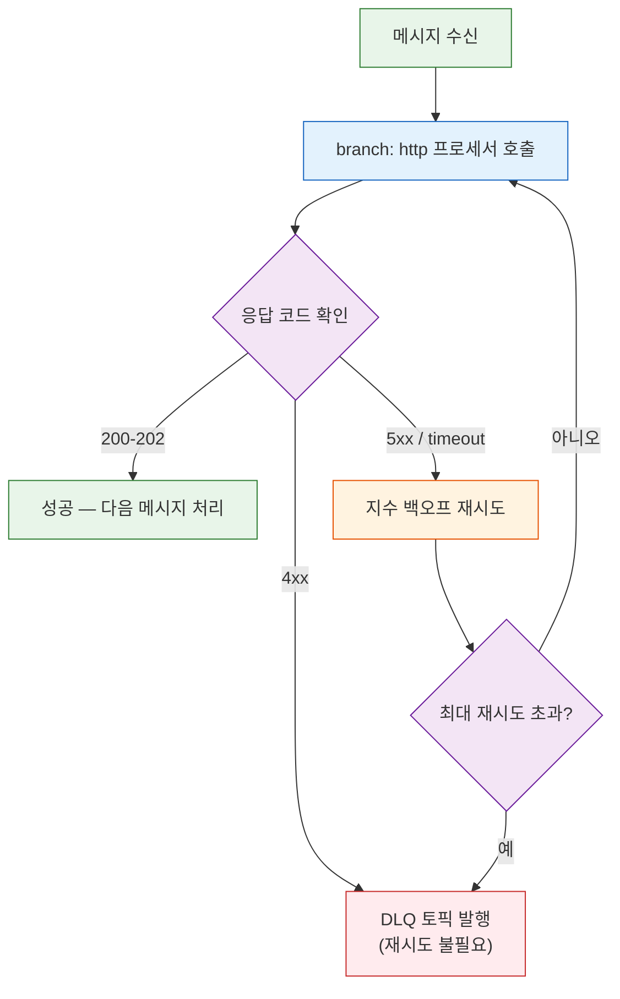
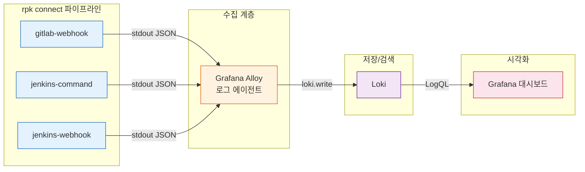

# 에러 핸들링과 로그 수집

---

> 커넥터 파이프라인이 happy path에서 동작하는 것은 시작일 뿐이다. 
>
> 프로덕션에서는 외부 API가 429를 반환하고, 브로커 노드가 재시작되고, 디스크가 꽉 차는 상황이 실제로 일어난다. 이 문서는 두 가지 질문에 답한다: "에러가 발생했을 때 어떻게 분류하고 처리하는가"와 "그 에러를 나중에 추적할 수 있도록 어떻게 기록하고 수집하는가"

## 학습 목표

- HTTP 응답 코드(4xx/5xx)에 따라 재시도와 DLQ를 분기하는 rpk connect 파이프라인을 설계할 수 있다
- Output 래퍼(`retry`, `fallback`, `switch`)로 Output 레벨 에러를 처리하는 방법을 이해한다
- `errored()`/`error()` 함수의 동작 원리와 에러 플래그 생명주기를 파악한다
- rpk connect의 `log` 프로세서와 `fields_mapping`으로 에러 컨텍스트를 구조화 로그로 기록하는 방법을 이해한다
- Alloy + Loki + Grafana로 커넥터 로그를 수집하고 LogQL로 검색하는 파이프라인을 구성할 수 있다

## `errored()` / `error()` 레퍼런스

프로세서가 실패해도 메시지가 버려지지 않는 이유는 rpk connect의 에러 플래그 설계 때문이다. `errored()`와 `error()`는 이 설계를 활용하는 도구이며, 이 문서 전체에서 반복적으로 사용하므로 먼저 정리한다.

### `errored()` — boolean

메시지가 이전 프로세서에서 에러 상태로 마킹되었는지 반환한다. rpk connect는 프로세서가 실패해도 메시지를 버리지 않고, 내부 에러 플래그를 `true`로 설정한 채 다음 프로세서로 넘긴다. `errored()`는 이 플래그를 읽는 함수다.

**에러 플래그가 설정되는 경우:**

| 프로세서 | 에러 발생 조건 |
|---------|--------------|
| `http` | `successful_on`에 포함되지 않은 HTTP 상태 코드 수신 |
| `mapping` | `throw("message")` 호출 |
| `json_parse` / `jmespath` | 파싱 실패 (잘못된 JSON 등) |
| `sql_insert` | DB 연결 실패, 제약 조건 위반 |
| 모든 프로세서 | 타임아웃, 연결 거부 등 내부 예외 |

### `error()` — string

에러 메시지 문자열을 반환한다. 에러가 없으면 빈 문자열 `""`이다.

| 실패 원인 | `error()` 반환값 |
|-----------|-----------------|
| HTTP 503 | `"request returned status 503"` |
| HTTP 429 | `"request returned status 429"` |
| HTTP 400 | `"request returned status 400"` |
| 연결 거부 | `"Post \"http://...\": dial tcp: connection refused"` |
| 타임아웃 | `"Post \"http://...\": context deadline exceeded"` |
| JSON 파싱 | `"failed to parse JSON: unexpected end of JSON input"` |
| throw() | 직접 지정한 문자열 (예: `"validation failed: missing field"`) |
| SQL 에러 | `"pq: duplicate key value violates unique constraint"` |

`error().contains("status 4")`로 분기하는 이유는, rpk connect가 HTTP 에러를 `"request returned status 4XX"` 형태의 고정 포맷 문자열로 생성하기 때문이다. 정확한 상태 코드가 필요하면 `error().contains("status 429")`처럼 전체 코드를 매칭한다.

### 주의사항

- `errored()`/`error()`는 **직전 프로세서의 결과**만 반영한다. 중간에 성공한 프로세서가 있으면 에러 플래그가 리셋된다
- `catch` 프로세서는 에러 상태인 메시지만 가로채서 처리한 뒤 에러 플래그를 **해제**한다
- Output 래퍼(`retry`, `fallback`)는 `errored()`와 무관하게 Output 자체의 반환값으로 동작한다 — 이것이 프로세서 에러 처리(HTTP 응답 코드 기반 에러 핸들링)와 Output 에러 처리(Output 레벨 에러 처리)를 구분하는 이유다

## HTTP 응답 코드 기반 에러 핸들링

외부 API를 호출하는 Sink 커넥터에서 HTTP 응답 코드별 분기가 없으면 어떻게 되는가? 400 Bad Request를 무한 재시도하며 파이프라인 전체가 멈추거나, 503 Service Unavailable을 즉시 DLQ로 보내 복구 가능한 메시지를 버리게 된다. 핵심 원칙은 하나다: **4xx는 재시도해도 결과가 같으므로 즉시 DLQ로, 5xx는 일시적 장애일 수 있으므로 재시도한다.**

### `branch` + `http` 프로세서 + `switch` 분기

rpk connect에서 HTTP 호출 후 응답 코드별 분기를 하려면 `http` **프로세서**를 `branch` 안에서 사용해야 한다. Output의 `http_client`는 에러 시 전체 파이프라인이 멈추기 때문에 응답 코드를 검사할 수 없다. 프로세서는 메시지 단위로 `errored()` 함수와 `error()` 메타데이터를 제공하므로 세밀한 분기가 가능하다.

> `retry`/`fallback`/`switch` 문법 자체는 [02-redpanda-connect.md §3 "Output Wrapper"](./02-redpanda-connect.md)에서 다루었다. 여기서는 HTTP 응답 코드 분기에 집중한다.



아래 YAML은 이 흐름을 구현한 파이프라인이다. `successful_on`으로 성공 코드를 명시하고, 나머지는 에러로 처리한다.

```yaml
input:
  kafka_franz:
    seed_brokers: ["localhost:19092"]
    topics: ["api-sink-requests"]
    consumer_group: "http-sink-group"

pipeline:
  processors:
    # 1. HTTP 호출 (branch 안에서 프로세서로 실행)
    - branch:
        processors:
          - http:
              url: "http://external-api:8080/webhook"
              verb: POST
              successful_on: [200, 201, 202]
              timeout: 10s
              headers:
                Content-Type: application/json
        result_map: |
          root = if errored() {
            root = this
            root.meta_error = error()
          }

    # 2. 에러 여부로 분기
    - switch:
        # 에러 없음 → 정상 처리 완료, 로그만 남기고 통과
        - check: '!errored()'
          processors:
            - log:
                message: "HTTP 호출 성공"
                level: DEBUG

        # 4xx → 재시도 불필요, 즉시 DLQ
        - check: 'error().contains("status 4")'
          processors:
            - log:
                message: "4xx 에러 — DLQ 전송"
                level: WARN
                fields_mapping: |
                  root.error = error()
                  root.payload_preview = this.string()[0:100]
            - resource: "dlq_output"

        # 5xx / 기타 → 재시도 가능
        - check: 'error().contains("status 5") || errored()'
          processors:
            - log:
                message: "5xx/네트워크 에러 — 재시도 예정"
                level: ERROR
                fields_mapping: |
                  root.error = error()
                  root.attempt = meta("retry_count").or("0")
            - retry:
                max_retries: 5
                backoff:
                  initial_interval: 1s
                  max_interval: 30s
                processors:
                  - http:
                      url: "http://external-api:8080/webhook"
                      verb: POST
                      successful_on: [200, 201, 202]
                      timeout: 10s
            - catch:
                - resource: "dlq_output"

output:
  resource: "success_output"

output_resources:
  - label: success_output
    kafka_franz:
      seed_brokers: ["localhost:19092"]
      topic: "api-sink-results"

  - label: dlq_output
    kafka_franz:
      seed_brokers: ["localhost:19092"]
      topic: "dlq-api-sink"
```

`successful_on`을 명시하지 않으면 rpk connect는 2xx 전체를 성공으로 간주한다. 204 No Content 같은 응답이 성공인 경우라면 기본값으로 충분하지만, 207 Multi-Status처럼 부분 실패를 담는 코드가 있을 때는 명시적으로 열거하는 것이 안전하다.

### 429 Too Many Requests — 재시도가 유효한 4xx

429는 4xx이지만 재시도가 유효한 특수 케이스다. rpk connect에서는 `switch` 분기를 하나 더 추가하여 429를 5xx와 동일하게 재시도 경로로 보낼 수 있다.

```yaml
    # 429 → 재시도 가능 (Rate Limit)
    - check: 'error().contains("status 429")'
      processors:
        - log:
            message: "429 Rate Limited — 대기 후 재시도"
            level: WARN
            fields_mapping: |
              root.error = error()
        - sleep:
            duration: "5s"  # Retry-After 헤더 대신 고정 대기
        - retry:
            max_retries: 3
            backoff:
              initial_interval: 5s
              max_interval: 60s
            processors:
              - http:
                  url: "http://external-api:8080/webhook"
                  verb: POST
                  successful_on: [200, 201, 202]
        - catch:
            - resource: "dlq_output"
```

이 분기는 `branch` + `http` 프로세서 + `switch` 분기의 `switch` 블록에서 4xx 분기 **앞에** 배치해야 한다. `switch`는 첫 번째로 매칭되는 `check`를 실행하므로, 429를 먼저 잡지 않으면 일반 4xx 분기에서 DLQ로 빠진다.


## Output 레벨 에러 처리

이전 방식은 프로세서 안에서 HTTP 호출을 세밀하게 제어하는 방식이다. 그런데 프로세서 에러와 Output 에러는 발생 지점이 다르다. Kafka 브로커 연결 끊김, HTTP Sink 타임아웃, 파일 시스템 쓰기 실패 등은 Output 자체에서 발생하며, `errored()`/`error()`로 잡을 수 없다. 이런 에러를 처리하려면 rpk connect의 **Output 래퍼**(`retry`, `fallback`, `switch`)가 필요하다.

### `retry` Output — 일시적 장애 자동 복구

Output 실패 시 가장 기본적인 대응은 `retry` 래퍼다. Output을 감싸면 발행 실패 시 지수 백오프로 자동 재시도한다.

```yaml
output:
  retry:
    max_retries: 10
    backoff:
      initial_interval: 500ms
      max_interval: 30s
    output:
      http_client:
        url: "http://external-api:8080/ingest"
        verb: POST
        timeout: 10s
```

`retry`는 Output이 에러를 반환할 때만 동작한다. HTTP 200을 받았지만 응답 본문에 에러가 있는 경우는 Output 입장에서 "성공"이므로 `retry`가 트리거되지 않는다. 이런 케이스는 HTTP 응답 코드 기반 에러 핸들링 섹션처럼 프로세서에서 응답을 검사해야 한다.

### `fallback` Output — 대체 경로

`retry`를 모두 소진하거나, 특정 Output이 완전히 불가용할 때 대체 Output으로 전환하는 패턴이다. `fallback`은 목록의 첫 번째 Output부터 시도하고, 실패하면 다음 Output으로 넘어간다.

```yaml
output:
  fallback:
    # 1순위: 외부 API 직접 호출
    - retry:
        max_retries: 3
        backoff:
          initial_interval: 1s
          max_interval: 10s
        output:
          http_client:
            url: "http://external-api:8080/ingest"
            verb: POST
            timeout: 10s

    # 2순위: 실패 시 DLQ 토픽으로 전환
    - kafka_franz:
        seed_brokers: ["localhost:19092"]
        topic: "dlq-api-sink"
```

이 설정은 외부 API 호출을 3회 재시도한 뒤에도 실패하면, 메시지를 DLQ 토픽에 발행한다. 메시지가 유실되지 않으면서도 파이프라인이 멈추지 않는 구성이다.

### `switch` Output — 조건부 라우팅

메시지 내용이나 메타데이터에 따라 다른 Output으로 보내는 패턴이다. 에러 복구보다는 정상 흐름에서 라우팅에 주로 쓰이지만, "에러가 발생한 메시지만 별도 Output으로 보내기"에도 활용할 수 있다.

```yaml
output:
  switch:
    retry_until_success: false
    cases:
      # 에러 메시지 → DLQ
      - check: 'meta("has_error") == "true"'
        output:
          kafka_franz:
            seed_brokers: ["localhost:19092"]
            topic: "dlq-api-sink"

      # 정상 메시지 → 결과 토픽
      - output:
          kafka_franz:
            seed_brokers: ["localhost:19092"]
            topic: "api-sink-results"
```

`retry_until_success: false`로 설정하면, 매칭된 Output이 실패해도 다음 케이스로 넘어가지 않고 에러를 반환한다. 기본값은 `true`(매칭될 때까지 무한 재시도)이므로, DLQ 라우팅 용도에서는 `false`가 적절하다.

### 프로세서 vs Output 에러 처리 비교

| 구분 | 프로세서 (HTTP 에러 핸들링) | Output 래퍼 (Output 레벨 에러 처리) |
|------|-------------|-----------------|
| 적용 위치 | `pipeline.processors` | `output` |
| 에러 감지 | `errored()`, `error()` | Output 반환값 (자동) |
| 응답 코드 분기 | 가능 (`switch` + `check`) | 불가 (성공/실패만 구분) |
| 재시도 대상 | 개별 프로세서 | 전체 Output |
| 적합한 상황 | HTTP 응답 코드별 분기, 비즈니스 로직 에러 | 연결 실패, 타임아웃, 브로커 장애 |

**실전 조합**: 프로세서에서 HTTP 응답 코드를 분류하고, Output에서 `fallback`으로 DLQ를 구성하는 것이 가장 흔한 패턴이다. 두 레벨의 에러 처리는 상호 배타가 아니라 보완 관계다. `errored()` / `error()` 레퍼런스에서 정리한 함수는 프로세서 레벨에서만 동작하고, Output 래퍼는 이와 무관하게 Output 자체의 반환값으로 동작한다.


## 재시도 추적과 구조화 로깅

에러를 분류하는 것만으로는 부족하다. 프로덕션에서 "왜 이 메시지가 DLQ에 갔는가?"를 추적하려면, 재시도 횟수, 에러 내용, 원본 메시지 식별자가 로그에 남아야 한다. 비구조화 텍스트 로그는 grep으로 찾을 수는 있지만, 집계하거나 대시보드에 연결할 수 없다. JSON 구조화 로그는 필드 단위 검색과 집계를 가능하게 하여 운영 효율을 높인다.

### `log` 프로세서 + `fields_mapping`

rpk connect의 `log` 프로세서는 `fields_mapping`을 통해 Bloblang 표현식으로 로그 필드를 동적으로 구성할 수 있다. 단순 문자열 메시지 대신, 에러 컨텍스트를 구조화된 필드로 기록하는 것이 목표다.

> `logger` 기본 설정(level, format)은 아래 전체 파이프라인 로거 설정에서 다룬다. 여기서는 에러 추적에 필요한 `fields_mapping` 활용에 집중한다.

```yaml
pipeline:
  processors:
    - branch:
        processors:
          - http:
              url: "http://external-api:8080/ingest"
              verb: POST
              successful_on: [200, 201]
        result_map: 'root = this'

    - switch:
        - check: 'errored()'
          processors:
            - log:
                message: "HTTP 호출 실패 — 재시도 또는 DLQ 분기"
                level: ERROR
                fields_mapping: |
                  root.correlation_id = meta("kafka_key").or("unknown")
                  root.topic = meta("kafka_topic")
                  root.partition = meta("kafka_partition")
                  root.offset = meta("kafka_offset")
                  root.error_message = error()
                  root.timestamp = now()
                  root.payload_size = content().length()
            # 이후 retry 또는 DLQ 분기...
```

이 설정이 만드는 로그 출력은 다음과 같다.

```json
{
  "level": "ERROR",
  "message": "HTTP 호출 실패 — 재시도 또는 DLQ 분기",
  "correlation_id": "order-12345",
  "topic": "api-sink-requests",
  "partition": 2,
  "offset": 48291,
  "error_message": "request returned status 503",
  "timestamp": "2026-03-09T15:04:05Z",
  "payload_size": 1024
}
```

`correlation_id`에 Kafka 키를 사용하는 이유는, 대부분의 이벤트 기반 시스템에서 메시지 키가 비즈니스 식별자(주문 ID, 사용자 ID)를 담기 때문이다. 별도 Correlation ID 헤더가 있다면 `meta("correlation_id")`로 교체하면 된다.

### 전체 파이프라인 로거 설정

개별 `log` 프로세서 외에, 파이프라인 전체의 로거를 JSON 포맷으로 설정하면 rpk connect 자체 로그(시작, 종료, 연결 에러 등)도 구조화된다.

```yaml
logger:
  level: INFO
  format: json            # logfmt 대신 json → 필드 파싱 용이
  add_timestamp: true
  static_fields:
    service: "http-sink-pipeline"
    environment: "production"
```

`static_fields`는 모든 로그 라인에 고정 필드를 추가한다. 여러 파이프라인이 같은 로그 수집기로 들어올 때 `service` 필드로 필터링할 수 있다. `logfmt`과 `json` 중 선택 기준은 로그 수집기가 어떤 포맷을 더 잘 파싱하는가에 달려 있다 — Loki는 logfmt을 네이티브로 지원하고, Elasticsearch는 JSON이 자연스럽다.

## 커넥터 로그 수집 아키텍처 — Loki 연계

구조화 로그를 만들었으면, 그 로그를 중앙에 수집하고 검색할 수 있어야 운영에 쓸모가 있다. 개별 Pod의 `kubectl logs`를 하나씩 확인하는 방식은 파이프라인이 하나일 때만 가능하다. 커넥터가 늘어나면 중앙 집중 수집이 필수이며, 이 문서에서는 Grafana Alloy + Loki 조합을 다룬다.

> 메트릭 기반 모니터링(Prometheus, Grafana, rpk 메트릭 수집)은 [04-operations.md §4 "모니터링과 트러블슈팅"](./04-operations.md)에서 다루었다. 여기서는 **로그** 수집 파이프라인만 다룬다.

메트릭은 "무엇이 얼마나 발생했는가"를 알려주고, 로그는 "구체적으로 무슨 일이 있었는가"를 알려준다. 둘은 보완 관계이며, 메트릭으로 이상을 감지한 뒤 로그로 원인을 추적하는 흐름이 일반적이다. 여기서는 Grafana Alloy를 로그 수집 에이전트로 사용한다.



**Loki vs Elasticsearch**: 선택 기준은 기존 인프라에 달려 있다. Prometheus + Grafana를 이미 사용 중이라면 Loki가 자연스럽고, 전문 검색이 필요하거나 Kibana 기반 워크플로우가 있다면 Elasticsearch(ELK)가 적합하다. 두 선택지 모두 JSON 구조화 로그를 필드 단위로 검색할 수 있다.

> **Promtail → Alloy**: Grafana Alloy는 Promtail, Grafana Agent, Agent Flow를 통합한 후속 프로젝트다. Promtail의 YAML 설정 대신 컴포넌트 기반 문법(`.alloy`)을 사용하며, 로그/메트릭/트레이스를 하나의 바이너리로 수집한다. 신규 구성에서는 Alloy를 사용하는 것이 권장된다.

Kubernetes 환경에서는 컨테이너의 stdout이 노드의 `/var/log/containers/`에 파일로 남는다. Alloy DaemonSet이 이 파일을 읽어 중앙 저장소로 전송하는 구조다. rpk connect는 stdout에 JSON을 출력하기만 하면 되므로, 로그 파일을 직접 관리할 필요가 없다.

### Alloy 설정 — K8s 환경

K8s DaemonSet으로 Alloy를 배포하여 각 노드의 rpk connect 컨테이너 로그를 수집한다. K8s 환경에서는 컨테이너의 stdout이 노드의 `/var/log/containers/`에 파일로 남고, Alloy가 이 파일을 읽어 Loki로 전송한다.

```alloy
// alloy-config.alloy — K8s 환경

// ① K8s Pod 디스커버리
discovery.kubernetes "pods" {
  role = "pod"
}

// ② rpk connect Pod만 필터링 + 레이블 추가
discovery.relabel "rpk_connect" {
  targets = discovery.kubernetes.pods.targets

  rule {
    source_labels = ["__meta_kubernetes_pod_label_app"]
    regex         = "rpk-connect-.*"
    action        = "keep"
  }
  rule {
    source_labels = ["__meta_kubernetes_pod_name"]
    target_label  = "pod"
  }
  rule {
    source_labels = ["__meta_kubernetes_namespace"]
    target_label  = "namespace"
  }
}

// ③ K8s Pod 로그 수집
loki.source.kubernetes "rpk_connect" {
  targets    = discovery.relabel.rpk_connect.output
  forward_to = [loki.process.rpk_connect.receiver]
}

// ④ JSON 파싱 → 필드를 Loki 레이블로 추출
loki.process "rpk_connect" {
  stage.json {
    expressions = {
      level   = "level",
      service = "service",
    }
  }
  stage.labels {
    values = {
      level   = "",
      service = "",
    }
  }
  forward_to = [loki.write.default.receiver]
}

// ⑤ Loki로 전송
loki.write "default" {
  endpoint {
    url = "http://loki:3100/loki/api/v1/push"
  }
}
```

`stage.json` → `stage.labels`에서 JSON 로그의 `service`, `level` 필드를 Loki 레이블로 추출하는 것이 핵심이다. 전체 파이프라인 로거 설정의 `static_fields.service`가 여기서 레이블로 변환되어, Grafana에서 `{service="connect-jenkins-webhook", level="ERROR"}`로 필터링할 수 있게 된다.

Alloy의 컴포넌트 모델은 `forward_to`로 데이터 흐름을 명시적으로 연결한다. Promtail의 암묵적 파이프라인과 달리, 어떤 컴포넌트가 어디로 데이터를 보내는지 설정 파일만 보고 파악할 수 있다.

### Alloy 설정 — 로컬(비K8s) 환경

K8s 없이 `rpk connect run`으로 직접 실행하는 경우, stdout을 파일로 리다이렉트하고 Alloy가 파일을 수집하는 패턴을 쓴다.

```bash
rpk connect run pipeline.yaml 2>&1 | tee -a /var/log/rpk-connect/jenkins-webhook.log
```

```alloy
// alloy-config.alloy — 로컬(파일 기반) 환경

// ① 로그 파일 경로 매칭
local.file_match "rpk_connect" {
  path_targets = [{
    __path__ = "/var/log/rpk-connect/*.log",
    job      = "rpk-connect",
  }]
}

// ② 파일 읽기
loki.source.file "rpk_connect" {
  targets    = local.file_match.rpk_connect.targets
  forward_to = [loki.process.rpk_connect.receiver]
}

// ③ JSON 파싱 + 레이블 추출
loki.process "rpk_connect" {
  stage.json {
    expressions = {
      level   = "level",
      service = "service",
    }
  }
  stage.labels {
    values = {
      level   = "",
      service = "",
    }
  }
  forward_to = [loki.write.default.receiver]
}

// ④ Loki로 전송
loki.write "default" {
  endpoint {
    url = "http://loki:3100/loki/api/v1/push"
  }
}
```

### Loki 최소 설정

```yaml
# loki-config.yaml
auth_enabled: false

server:
  http_listen_port: 3100

common:
  ring:
    kvstore:
      store: inmemory
    replication_factor: 1
  path_prefix: /loki

schema_config:
  configs:
    - from: 2024-01-01
      store: tsdb
      object_store: filesystem
      schema: v13
      index:
        prefix: index_
        period: 24h

storage_config:
  filesystem:
    directory: /loki/chunks
```

### Docker Compose 통합

로컬 개발 환경에서 Loki + Alloy + Grafana를 한번에 띄우는 설정이다.

```yaml
# docker-compose.monitoring.yml
services:
  loki:
    image: grafana/loki:3.4.2
    ports:
      - "3100:3100"
    volumes:
      - ./loki-config.yaml:/etc/loki/config.yaml
      - loki-data:/loki
    command: -config.file=/etc/loki/config.yaml

  alloy:
    image: grafana/alloy:v1.8.1
    volumes:
      - ./alloy-config.alloy:/etc/alloy/config.alloy
      - /var/log:/var/log
      - /var/lib/docker/containers:/var/lib/docker/containers:ro
    command:
      - run
      - /etc/alloy/config.alloy
      - --stability.level=generally-available

  grafana:
    image: grafana/grafana:11.6.0
    ports:
      - "3000:3000"
    environment:
      - GF_AUTH_ANONYMOUS_ENABLED=true
    volumes:
      - grafana-data:/var/grafana

volumes:
  loki-data:
  grafana-data:
```

### Grafana LogQL 검색 예시

Loki에 수집된 rpk connect 로그를 Grafana에서 검색하는 LogQL 예시다.

```logql
# 특정 파이프라인의 에러 로그만 조회
{service="connect-jenkins-command"} |= "ERROR"

# correlation_id로 특정 메시지 추적
{service=~"connect-.*"} | json | correlation_id = "order-12345"

# 최근 1시간 에러 카운트 (파이프라인별)
sum by (service) (
  count_over_time({service=~"connect-.*"} |= "ERROR" [1h])
)
```

`static_fields.service`를 파이프라인별로 다르게 설정해둔 덕분에 `service` 레이블로 필터링이 가능하다. 전체 파이프라인 로거 설정에서 `static_fields`를 강조한 이유이며, Alloy 설정의 `stage.labels`에서 이 값이 Loki 레이블로 변환된다.

```logql
# DLQ 전송 로그만
{service=~"connect-.*"} |= "DLQ"

# 에러 메시지별 Top 5 (최근 24시간)
topk(5,
  sum by (error_message) (
    count_over_time({service=~"connect-.*"} | json | level="ERROR" [24h])
  )
)
```


## 핵심 요약

| 주제 | rpk connect 구현 | 섹션 |
|------|-----------------|------|
| `errored()` / `error()` | 에러 플래그 boolean / 에러 메시지 string | `errored()` / `error()` 레퍼런스 |
| HTTP 에러 분류 | `branch` + `http` 프로세서 + `switch` | HTTP 응답 코드 기반 에러 핸들링 |
| 4xx 처리 | `error().contains("status 4")` → 즉시 DLQ | HTTP 응답 코드 기반 에러 핸들링 |
| 429 처리 | `sleep` + `retry` (Rate Limit 대응) | 429 Too Many Requests |
| 5xx 처리 | `retry` + `catch` → DLQ | HTTP 응답 코드 기반 에러 핸들링 |
| Output 레벨 에러 | `retry` / `fallback` / `switch` Output 래퍼 | Output 레벨 에러 처리 |
| 프로세서 vs Output | 응답 코드 분기 → 프로세서, 연결 실패 → Output 래퍼 | 프로세서 vs Output 에러 처리 비교 |
| 구조화 로깅 | `log` + `fields_mapping` + `static_fields` | 재시도 추적과 구조화 로깅 |
| 로그 수집 | Alloy → Loki → Grafana (LogQL 검색) | 커넥터 로그 수집 아키텍처 |

**기억할 것 네 가지:**
1. 4xx와 5xx를 구분하지 않으면 파이프라인이 멈추거나 복구 가능한 메시지를 잃는다
2. 프로세서 에러(`errored()`)와 Output 에러(래퍼)는 별개 레이어다 — 둘 다 구성해야 빈틈이 없다
3. `errored()`/`error()`는 직전 프로세서의 결과만 반영한다 — 중간에 성공하면 리셋된다
4. 구조화 로그 없이는 "왜 DLQ에 갔는가"를 추적할 수 없다


## 참고 자료

- [03-02.장애 복구와 고가용성](./03-02.장애%20복구와%20고가용성.md) — 런북, dedupe 경고, Connect HA
- [02-redpanda-connect.md §3 — Output Wrapper (retry/fallback/switch)](./02-redpanda-connect.md)
- [04-operations.md §3 — DLQ 개념과 rpk 재처리](./04-operations.md)
- [04-operations.md §4 — 모니터링과 트러블슈팅](./04-operations.md)
- [Redpanda Connect — HTTP Processor](https://docs.redpanda.com/redpanda-connect/components/processors/http/)
- [Redpanda Connect — Log Processor](https://docs.redpanda.com/redpanda-connect/components/processors/log/)
- [Redpanda Connect — Retry Output](https://docs.redpanda.com/redpanda-connect/components/outputs/retry/)
