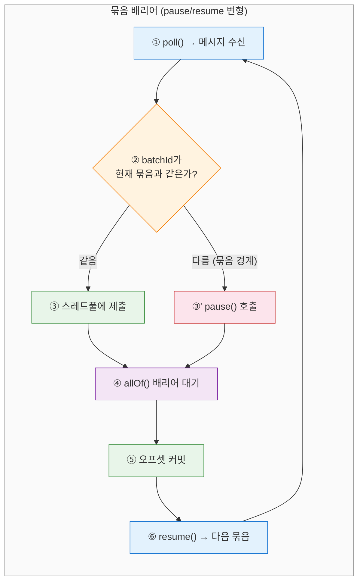
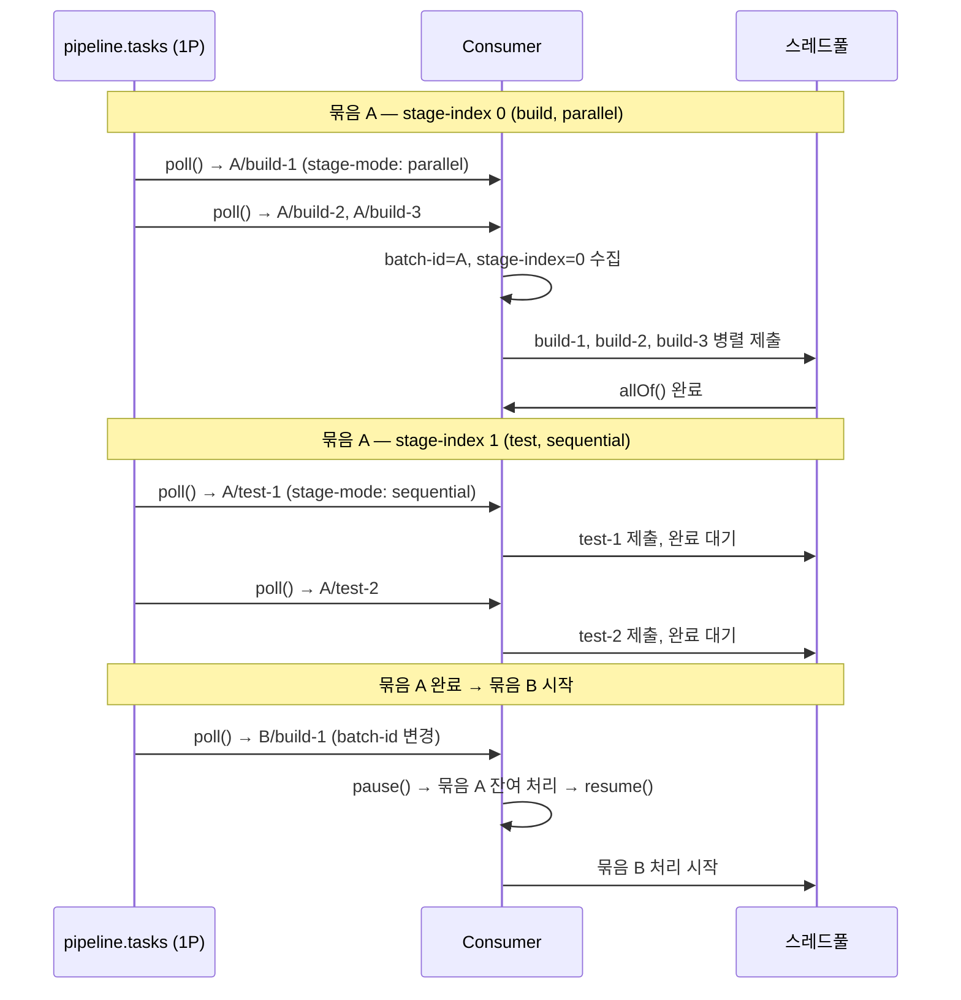
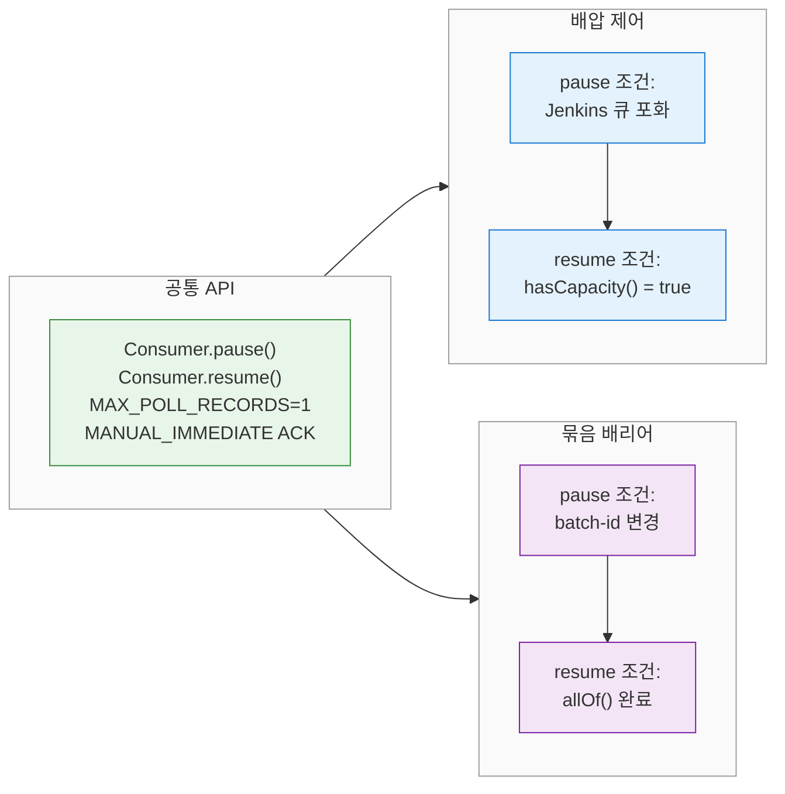
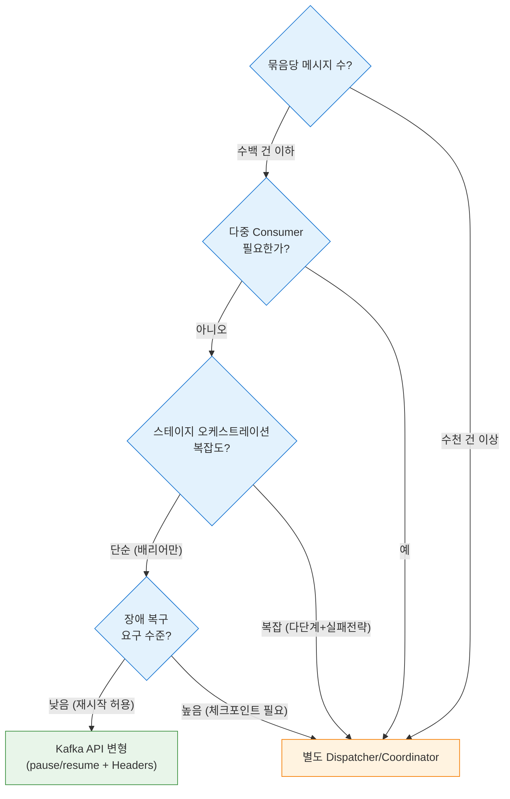

# DAG 순서 보장 심화: Kafka API 프리미티브와 한계
---
> Kafka/Redpanda API가 제공하는 순서 프리미티브의 능력과 한계를 분석하고, pause/resume을 활용한 배리어(barrier) 구현, 단일 토픽 변형 설계, 그리고 Dispatcher가 필요해지는 분기점을 다룹니다.

## 1. Kafka API 프리미티브 능력표

Kafka/Redpanda가 브로커 수준에서 보장하는 순서는 **파티션 내 메시지 순서** 하나뿐입니다. 같은 파티션에 들어간 메시지는 오프셋 순서대로 소비되므로, 파티션 키 해싱으로 같은 키의 메시지를 같은 파티션에 배치하면 해당 키에 대한 순서가 자동으로 보장됩니다. 이것이 Level 1(그룹 키 순서) 보장이며, 파티셔닝 설계만으로 해결할 수 있는 영역입니다.

"묶음(batch) A 전체 완료 → 묶음 B 시작"이라는 Level 2(묶음 간 배리어)는 브로커가 제공하지 않습니다. 브로커는 메시지를 저장하고 전달할 뿐이며, 메시지 그룹의 완료 상태를 추적하거나 다음 그룹의 소비를 차단하는 기능이 없습니다. 이 배리어는 본질적으로 애플리케이션 레이어의 상태 관리 문제이기 때문입니다.

각 프리미티브가 묶음 순서 보장에 기여할 수 있는지 정리하면 다음과 같습니다:

| Kafka 프리미티브 | 본래 용도 | Level 1 (그룹 내 순서) | Level 2 (묶음 간 배리어) | 비고 |
|----------------|----------|:-------------------:|:--------------------:|------|
| 파티션 키 해싱 | 같은 키 → 같은 파티션 | O | X | 묶음 경계를 인식하지 못함 |
| `max.poll.records` | poll당 레코드 수 제한 | - | X | 흐름 제어일 뿐 배리어 아님 |
| `pause()`/`resume()` | 파티션별 소비 일시정지/재개 | - | **부분적** | § 2에서 상세히 다룸 |
| Kafka Transactions | 원자적 produce + offset commit | - | X | 원자성이지 순서가 아님 |
| Kafka Headers | 메시지에 메타데이터 첨부 | - | X | 정보 전달만 가능, 배리어 구현 불가 |
| `ConsumerRebalanceListener` | 파티션 재할당 콜백 | - | X | failover용, 배리어와 무관 |
| `AdminClient.createPartitions()` | 동적 파티션 추가 | - | X | 토폴로지 변경, 배리어와 무관 |

- 표에서 드러나듯, 묶음 간 배리어에 "부분적"이라도 기여할 수 있는 프리미티브는 `pause()`/`resume()` 하나뿐입니다. 
- 나머지는 본래 용도 자체가 순서 제어와 무관하며, 이를 배리어 목적으로 전용하는 것은 의미가 없습니다.


## 2. pause/resume: 배압에서 배리어로

### 2-1. 배압 패턴 구조

`pause()`/`resume()`은 원래 **배압(backpressure)** 제어를 위해 설계된 API입니다. Consumer가 처리할 수 있는 속도보다 메시지가 빠르게 들어올 때, 또는 외부 시스템이 포화 상태일 때 소비를 잠시 멈추는 용도입니다. Jenkins 큐 포화 기반 배압 패턴의 기본 구조는 다음과 같습니다:

```java
// 배압 조건: Jenkins 큐에 여유가 있는가?
if (!queueMonitor.hasCapacity()) {
    pauseConsumer();                    // pause()
    throw new JenkinsQueueFullException("Jenkins queue is full");
}

// 주기적 상태 확인 후 resume
@Scheduled(fixedDelay = 10_000)
public void checkAndResume() {
    if (container.isPauseRequested() && queueMonitor.hasCapacity()) {
        container.resume();             // resume()
    }
}
```

이 패턴의 핵심 요소는 세 가지입니다:

- `MAX_POLL_RECORDS=1` + `MANUAL_IMMEDIATE` ACK로 메시지를 건별로 정밀하게 제어합니다. 한 번에 하나의 메시지만 가져오므로 메시지 단위의 pause/resume 제어가 가능합니다.
- `hasCapacity()`가 외부 시스템(Jenkins 큐)의 상태를 판단하는 조건 역할을 합니다. Jenkins REST API(`/queue/api/json`, `/computer/api/json`)를 호출하여 큐에 대기 중인 빌드 수와 유휴 executor 수를 확인합니다.
- `@Scheduled`로 주기적으로 재개 조건을 확인해 Consumer를 다시 시작합니다. 10초 주기로 Jenkins 큐 상태를 폴링하므로, 최대 10초의 재개 지연이 발생합니다.

배압 패턴에서 `pause()`는 Consumer가 `poll()`을 호출해도 빈 결과를 반환하도록 만듭니다. 정확히 말하면 Kafka Consumer의 `pause(TopicPartition)` API는 해당 파티션에서의 메시지 fetch를 중단하고, `resume()` 호출 전까지 새 메시지를 가져오지 않습니다. 

- Spring Kafka에서는 `MessageListenerContainer.pause()`가 내부적으로 모든 할당된 파티션에 대해 이 API를 호출합니다.

### 2-2. 배리어 조건으로의 전환

배압 패턴과 묶음 배리어 패턴은 구조가 동일합니다. 차이는 `pause()`/`resume()`의 **조건**뿐입니다. 다음 표에서 두 패턴의 요소를 비교할 수 있습니다:

| 요소 | 배압 패턴 | 묶음 배리어 패턴 |
|-----|---------|--------------|
| pause 조건 | Jenkins 큐 포화 | 현재 묶음의 batchId와 다른 메시지 도착 |
| resume 조건 | Jenkins 큐 여유 발생 | 현재 묶음의 모든 메시지 처리 완료 |
| 상태 판단 | `JenkinsQueueMonitor.hasCapacity()` | `BatchBarrier.isCurrentBatchComplete()` |
| 확인 주기 | `@Scheduled(fixedDelay = 10_000)` | `CompletableFuture.allOf()` 콜백 |

배압 패턴에서 `hasCapacity()`를 `isCurrentBatchComplete()`로 교체하면 묶음 배리어가 됩니다. `@Scheduled` 폴링 대신 `CompletableFuture.allOf()`의 완료 콜백에서 `resume()`을 호출하면 불필요한 폴링 없이 즉시 재개할 수 있습니다.



### 2-3. 의사 코드: BatchBarrierConsumer

배압 문서의 `JenkinsBuildConsumer` 구조를 묶음 배리어용으로 변환하면 다음과 같습니다:

```java
@Component
@RequiredArgsConstructor
public class BatchBarrierConsumer {

    private final KafkaListenerEndpointRegistry registry;
    private final ExecutorService threadPool;

    private String currentBatchId = null;
    private final List<CompletableFuture<Void>> pendingTasks = new ArrayList<>();

    private static final String LISTENER_ID = "batch-barrier-listener";

  	// 파이프라인 확인
    @KafkaListener(
        id = LISTENER_ID,
        topics = "pipeline.tasks",
        groupId = "batch-barrier-consumer",
        containerFactory = "batchBarrierContainerFactory"
    )
    public void consume(ConsumerRecord<String, byte[]> record, Acknowledgment ack) {
      
        String batchId = new String(record.headers().lastHeader("batch-id").value());

        if (currentBatchId != null && !currentBatchId.equals(batchId)) {
            // 묶음 경계 감지 → pause + 현재 묶음 완료 대기
            pauseConsumer();
            awaitAndCommitCurrentBatch(ack);
            currentBatchId = batchId;
            resumeConsumer();
        }

        if (currentBatchId == null) {
            currentBatchId = batchId;
        }

        // 스레드풀에 작업 제출
        CompletableFuture<Void> task = CompletableFuture.runAsync(
            () -> processMessage(record), threadPool
        );
        pendingTasks.add(task);
    }

    private void awaitAndCommitCurrentBatch(Acknowledgment ack) {
        CompletableFuture.allOf(pendingTasks.toArray(new CompletableFuture[0])).join();
        ack.acknowledge();
        pendingTasks.clear();
    }

    private void pauseConsumer() {
        MessageListenerContainer container = registry.getListenerContainer(LISTENER_ID);
        if (container != null && container.isRunning()) {
            container.pause();
        }
    }

    private void resumeConsumer() {
        MessageListenerContainer container = registry.getListenerContainer(LISTENER_ID);
        if (container != null && container.isPauseRequested()) {
            container.resume();
        }
    }
}
```

- 배압 문서의 `@Scheduled` 폴링 대신 `CompletableFuture.allOf().join()`으로 동기 대기하는 점이 핵심 차이입니다. 
- 배압은 외부 시스템(Jenkins)의 상태 변화를 기다려야 하므로 폴링이 자연스럽지만, 묶음 배리어는 자체 스레드풀의 완료를 기다리는 것이므로 동기 대기가 더 적합합니다.

`pause()`가 실질적인 의미를 갖는 경우는 Consumer가 **비동기 처리 모델**(리액티브, 콜백 기반)을 사용할 때입니다. 블로킹 `join()` 대신 `thenRun(() -> resume())`을 사용하면 Consumer 스레드가 해방되고, `pause()`가 그 사이에 새 메시지가 소비되는 것을 방지합니다. 비동기 모델에서의 코드 구조는 다음과 같습니다:

```java
// 비동기 모델: pause()가 필수적인 경우
pauseConsumer();
CompletableFuture.allOf(pendingTasks.toArray(new CompletableFuture[0]))
    .thenRun(() -> {
        commitOffset();
        currentBatchId = newBatchId;
        resumeConsumer();  // 콜백에서 resume → Consumer 스레드 해방
    });
// Consumer 스레드는 여기서 즉시 반환됨
// pause()가 없으면 반환 후 poll()이 새 메시지를 가져옴
```

- 동기 블로킹 모델에서는 `join()`이 실행되는 동안 `poll()`이 호출되지 않으므로 `pause()`가 추가 안전망에 가깝습니다. 
- 하지만 비동기 모델에서는 `pause()` 없이 콜백만 사용하면 콜백이 실행되기 전에 Consumer 스레드가 `poll()`을 호출하여 다음 묶음의 메시지를 가져올 수 있습니다.


## 3. 단일 토픽 변형 설계

### 3-1. 헤더 설계

**Kafka Headers**를 활용하면 control 토픽 없이 단일 토픽으로 묶음 메타데이터를 전달할 수 있습니다. 2-토픽 패턴에서 control 토픽이 담당하던 역할, 즉 `BATCH_START` 메시지로 묶음 크기와 스테이지 정보를 전달하는 역할을 각 메시지의 헤더가 대신합니다.

```
토픽: pipeline.tasks (1 파티션)
메시지 헤더:
  - batch-id:    "release-2024-03-15"
  - batch-size:  "9"
  - stage-type:  "build"
  - stage-mode:  "parallel"
  - stage-index: "0"
```

- `batch-size` 헤더가 핵심입니다. Consumer는 같은 `batch-id`의 메시지를 카운트하다가 `batch-size`에 도달하면 묶음이 완전히 수신된 것으로 판단합니다. 이 방식은 Producer가 메시지를 발행할 시점에 묶음 전체 크기를 알고 있어야 한다는 전제를 요구합니다.

- `stage-mode` 헤더는 Consumer가 해당 스테이지를 병렬로 처리할지 순차로 처리할지를 선언적으로 지정합니다. Consumer 코드 내에 분기 로직이 있지만, 처리 방식 자체는 Producer가 메시지를 발행할 때 결정합니다. 이렇게 하면 Consumer 코드를 수정하지 않고도 스테이지 특성에 따라 처리 방식을 바꿀 수 있습니다.

- `stage-index` 헤더는 묶음 내 스테이지의 실행 순서를 나타냅니다. 같은 `batch-id`와 `stage-index`를 가진 메시지들은 하나의 스테이지에 속합니다. Consumer는 현재 `stage-index`의 모든 메시지가 처리된 후에야 다음 `stage-index`의 메시지를 처리합니다. 이 방식으로 스테이지 간 순서를 보장하면서 스테이지 내부의 병렬/순차 처리를 `stage-mode` 헤더에 위임합니다.

Producer 측에서 메시지를 발행할 때 헤더를 설정하는 코드는 다음과 같습니다:

```java
// Producer: 묶음 메타데이터를 각 메시지 헤더에 분산 저장
ProducerRecord<String, byte[]> record = new ProducerRecord<>(
    "pipeline.tasks", payload
);
record.headers()
    .add("batch-id", "release-2024-03-15".getBytes())
    .add("batch-size", "9".getBytes())
    .add("stage-type", "build".getBytes())
    .add("stage-mode", "parallel".getBytes())
    .add("stage-index", "0".getBytes());

kafkaTemplate.send(record);
```

이 방식의 트레이드오프는 메타데이터 중복입니다. 같은 묶음의 9개 메시지 모두 `batch-id`와 `batch-size` 헤더를 가지므로, control 토픽 방식보다 네트워크와 저장 공간을 더 사용합니다. 하지만 토픽을 하나만 관리하면 되므로 인프라 복잡도는 낮습니다.

### 3-2. Consumer 내부 흐름

Consumer는 `poll()`로 메시지를 가져온 뒤 헤더를 읽어 묶음 내 위치를 파악하고, 스테이지 모드에 따라 처리 방식을 결정합니다. 아래 시퀀스 다이어그램은 묶음 A(build 병렬 → test 순차)가 처리되고 묶음 B로 전환되는 흐름을 보여줍니다:



Consumer 내부 로직의 처리 단계는 다음과 같습니다:

- `poll()`로 메시지를 가져오고 `batch-id` 헤더를 읽어 현재 묶음 ID를 확인합니다.
- 같은 `batch-id` + 같은 `stage-index`인 메시지를 수집합니다.
- `stage-mode`에 따라 병렬(`CompletableFuture.allOf()`) 또는 순차(하나씩 완료 대기) 방식으로 처리합니다.
- 하나의 스테이지가 완료되면 다음 `stage-index` 메시지로 넘어갑니다.
- `batch-id`가 변경되면 `pause()` → 현재 묶음 완료 대기 → 오프셋 커밋 → `resume()`을 순서대로 실행합니다.

이 설계를 기존 접근법 3(단일 파티션 + 인프로세스 병렬)과 비교하면 다음과 같습니다:

| 속성 | 접근법 3 (원본) | Kafka API 변형 | 차이의 이유 |
|-----|-------------|--------------|-----------|
| 묶음 경계 감지 | `batchId` 변경 시 | `batchId` 변경 + `pause()` | pause로 소비를 명시적으로 차단 |
| 배리어 구현 | `CompletableFuture.allOf()` | `pause()` + `allOf()` + `resume()` | pause가 추가 안전망 역할 |
| 메타데이터 전달 | 메시지 본문에 포함 | Kafka Headers 활용 | 본문 스키마와 메타데이터를 분리 |
| 스테이지 모드 | 묶음 내부 분류 로직 | `stage-mode` 헤더로 선언적 지정 | Consumer가 헤더를 해석하여 처리 |
| Dispatcher 필요성 | 없음 | 없음 | 구조적 제약이 동일 |

공통점이 차이점보다 큽니다. 단일 파티션, 단일 Consumer, 인프로세스 스레드풀이라는 구조적 제약은 동일하며, Kafka API 변형은 `pause()`/`resume()`과 헤더를 추가해 묶음 경계 제어를 더 명시적으로 만든 것입니다.


## 4. 배압 vs 배리어 — 같은 API, 다른 조건

배압 패턴과 묶음 배리어 패턴은 같은 Kafka Consumer API(`pause`/`resume`)를 사용하지만, 해결하는 문제가 다릅니다. 이 차이를 명확히 이해하면 두 패턴을 상황에 맞게 선택하거나 조합할 수 있습니다. 아래 다이어그램은 공통 API에서 두 패턴이 어떻게 분기하는지 보여줍니다:



배압은 **외부 시스템의 처리 용량**에 반응합니다. Jenkins 큐가 가득 차면 멈추고, 여유가 생기면 재개합니다. 조건 판단이 외부 API 호출(`getQueueInfo()`, `getComputerInfo()`)에 의존하므로 `@Scheduled` 폴링이 자연스럽고, 메시지 간에 논리적 의존 관계는 없습니다. 어떤 메시지든 Jenkins에 여유가 있으면 처리할 수 있습니다.

배리어는 **메시지 그룹의 완료 상태**에 반응합니다. 현재 묶음이 끝나야 다음 묶음을 시작할 수 있습니다. 조건 판단이 내부 상태(`CompletableFuture` 완료 여부)에 의존하므로 콜백이 자연스럽고, 묶음이라는 논리적 의존 관계가 메시지 간에 존재합니다.

두 패턴을 조합하는 것도 가능합니다. 묶음 배리어로 순서를 보장하면서, 각 메시지의 Jenkins 트리거 시점에 배압 제어를 적용하는 2중 제어 방식입니다. 이 경우 조건은 다음과 같이 조합됩니다:

- `pause` 조건: `batchId` 변경 **OR** Jenkins 큐 포화
- `resume` 조건: 현재 묶음 완료 **AND** Jenkins 여유

2중 제어의 의사 코드는 다음과 같습니다:

```java
// 2중 제어: 배리어 + 배압 조합
public void consume(ConsumerRecord<String, byte[]> record, Acknowledgment ack) {
    String batchId = headerValue(record, "batch-id");

    // 배리어 조건: 묶음 경계 감지
    if (currentBatchId != null && !currentBatchId.equals(batchId)) {
        pauseConsumer();
        awaitAndCommitCurrentBatch(ack);
        currentBatchId = batchId;
    }

    // 배압 조건: 외부 시스템 용량 확인
    if (!jenkinsMonitor.hasCapacity()) {
        pauseConsumer();
        // resume은 @Scheduled에서 jenkinsMonitor.hasCapacity() 확인 후 호출
        return;
    }

    submitToThreadPool(record);
}

// resume 조건: 현재 묶음 완료 AND Jenkins 여유
@Scheduled(fixedDelay = 5_000)
public void checkAndResume() {
    if (!container.isPauseRequested()) return;

    boolean batchDone = pendingTasks.isEmpty() || allCompleted();
    boolean jenkinsReady = jenkinsMonitor.hasCapacity();

    if (batchDone && jenkinsReady) {
        resumeConsumer();
    }
}
```

2중 제어는 순서 보장과 과부하 방지를 동시에 달성하지만, 조건 로직이 복잡해지므로 실제로 두 문제가 모두 존재하는 경우에만 적용하는 것이 적절합니다. Jenkins 파이프라인 오케스트레이션처럼 외부 시스템의 큐 포화와 묶음 간 순서 보장이 동시에 요구되는 시나리오가 대표적입니다.


## 5. Dispatcher가 필요해지는 분기점

### 5-1. Kafka API 방식이 충분한 경우

Kafka API 최대 활용 방식은 사실상 "Consumer 안에 Dispatcher를 내장한 것"입니다. 별도 프로세스가 없을 뿐, 배리어 로직 자체는 애플리케이션 코드입니다. 다음 조건을 모두 만족하면 이 방식으로 충분합니다:

- 묶음당 메시지 수가 수백 건 이하이고, 단일 JVM의 스레드풀로 처리량이 충분한 경우
- 단일 Consumer 인스턴스로 모든 메시지를 처리해도 되는 경우
- 스테이지 구성이 단순하거나(배리어만 필요) 다단계 오케스트레이션이 없는 경우
- Consumer 장애 시 처음부터 재시작해도 허용되는 경우 (인메모리 상태 유실 허용)

이 조건에 해당하는 시나리오로는 결제 정산, 일일 보고서 생성, 소규모 배치 ETL 등이 있습니다. 인프라가 단순하고(토픽 1개, Consumer 1개) 운영 부담이 적다는 것이 이 방식의 장점입니다.

각 시나리오의 특성을 정리하면 다음과 같습니다:

- **결제 정산**: 가맹점 수가 수백 개 수준으로 제한적이고, 개별 정산은 DB 조회 + 계산으로 수초 내에 완료됩니다. 일일 묶음 단위이므로 묶음 수도 하루 1개입니다.
- **일일 보고서**: 부서별 보고서를 병렬로 생성하되, 전날 보고서가 완료되어야 당일 보고서를 시작합니다. 부서 수가 수십 개이므로 스레드풀로 충분합니다.
- **소규모 ETL**: 원본 테이블이 10개 이하이고, 각 테이블의 변환 처리가 독립적입니다. 시간별 묶음 단위로 처리하며, 묶음당 메시지 수가 테이블 수와 같습니다.

### 5-2. 분기점 조건

다음 조건 중 하나라도 해당하면 별도 Dispatcher 또는 Coordinator가 필요합니다:

- **수평 확장이 필요한 경우**: 단일 Consumer로는 처리량이 부족해 여러 Consumer가 묶음을 나눠 처리해야 하면, 묶음 완료 상태를 추적하는 중앙 컴포넌트가 필요합니다.
- **다중 토픽/파티션에 걸친 묶음**: 묶음의 메시지가 여러 파티션에 분산되어 있으면, 단일 Consumer의 `pause()`/`resume()`으로는 전체 묶음 경계를 감지할 수 없습니다.
- **스테이지 간 오케스트레이션이 복잡한 경우**: Build → Test → Deploy 같은 다단계 스테이지에서 각 스테이지의 실행 모드(병렬/순차)와 실패 전략(fail-fast/continue)을 제어해야 하면 Consumer 내부 로직이 비대해집니다.
- **장애 복구 요구 수준이 높은 경우**: Consumer가 묶음 처리 중간에 장애를 겪으면 인메모리 상태(현재 묶음 ID, 완료 카운트)가 유실됩니다. Coordinator는 상태 저장소에 체크포인트를 남겨 정확한 지점부터 재개할 수 있습니다.

아래 의사결정 플로우차트는 상황에 따라 어느 방식을 선택해야 하는지 안내합니다:



### 5-3. 요약

Kafka API가 직접 제공하는 것은 두 가지입니다. 첫째는 파티션 내 메시지 순서이고, 둘째는 Consumer 수준의 소비 제어(`pause`/`resume`)입니다. 이 두 가지를 조합하면 단일 Consumer 안에서 묶음 배리어를 구현할 수 있지만, 그것은 "Kafka가 배리어를 제공한다"가 아니라 "Kafka API 위에 애플리케이션 배리어를 얹은 것"입니다.

묶음 배리어 로직은 반드시 애플리케이션 레이어에 존재해야 합니다. Kafka API 변형은 그 로직을 Consumer 내부에 인라인한 것이고, Dispatcher 방식은 별도 컴포넌트로 분리한 것입니다. 복잡도와 확장성 요구가 높아지면 이 배리어 로직을 별도 컴포넌트로 분리하는 것이 자연스럽습니다.

이 문서에서 분석한 세 가지 레벨의 순서 보장을 한 문장으로 정리합니다:

- **Level 1** (그룹 키 순서): Kafka 파티션 키 해싱만으로 해결됩니다. 추가 코드가 필요 없습니다.
- **Level 2** (묶음 간 배리어): Kafka API(`pause`/`resume`) 위에 애플리케이션 배리어를 얹어 구현합니다. 단일 Consumer로 충분하면 인프로세스 방식을, 확장이 필요하면 별도 Dispatcher를 사용합니다.
- **Level 3** (DAG 의존성): 위상 정렬 기반 실행기를 직접 구현하거나, Temporal/Airflow 같은 전문 워크플로우 엔진을 도입합니다.

각 레벨은 이전 레벨을 포함하며, 요구되는 복잡도에 맞는 최소한의 레벨을 선택하는 것이 운영 비용을 줄이는 핵심입니다. 02-01 문서에서 세 가지 패턴의 상세 설계와 비교를, 03-01 문서에서 Spring Boot + Redpanda 구현 코드를 다루고 있으므로 함께 참조하면 전체 그림을 파악할 수 있습니다.

## Sources

- Confluent, "Multi-Threaded Message Consumption with the Apache Kafka Consumer" — https://www.confluent.io/blog/kafka-consumer-multi-threaded-messaging/
- Confluent, "Exactly-Once Semantics Are Possible: Here's How Kafka Does It" — https://www.confluent.io/blog/exactly-once-semantics-are-possible-heres-how-apache-kafka-does-it/
- Temporal Community Forum, "DAG Workflow Orchestration with Kafka" — https://community.temporal.io/t/dag-workflow-with-kafka/
