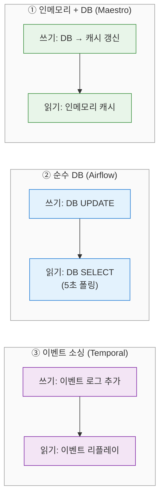
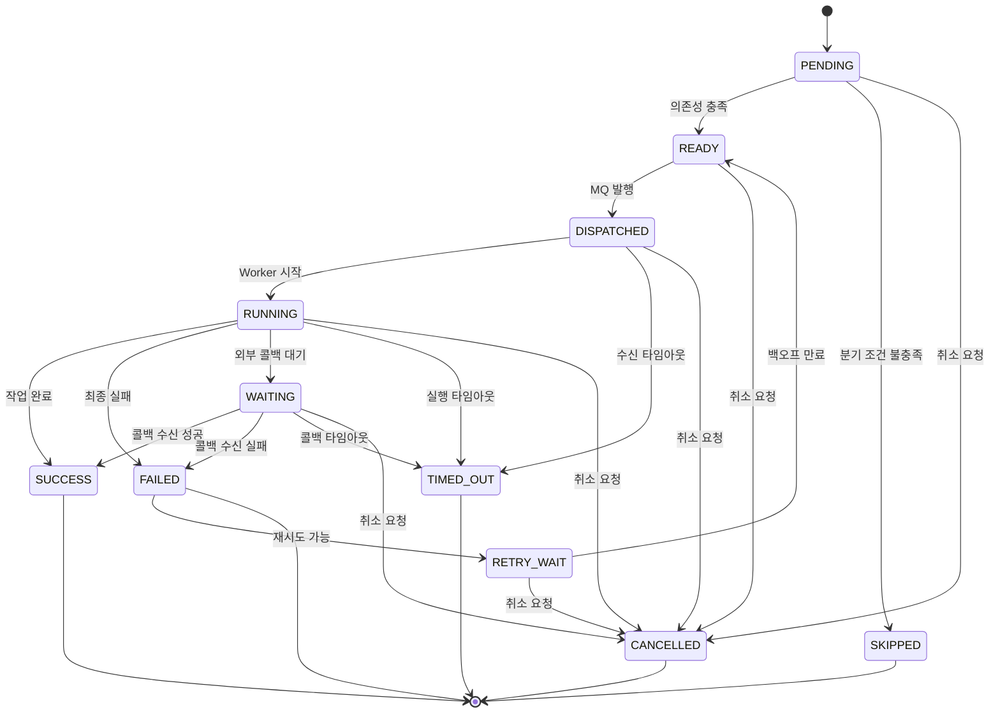
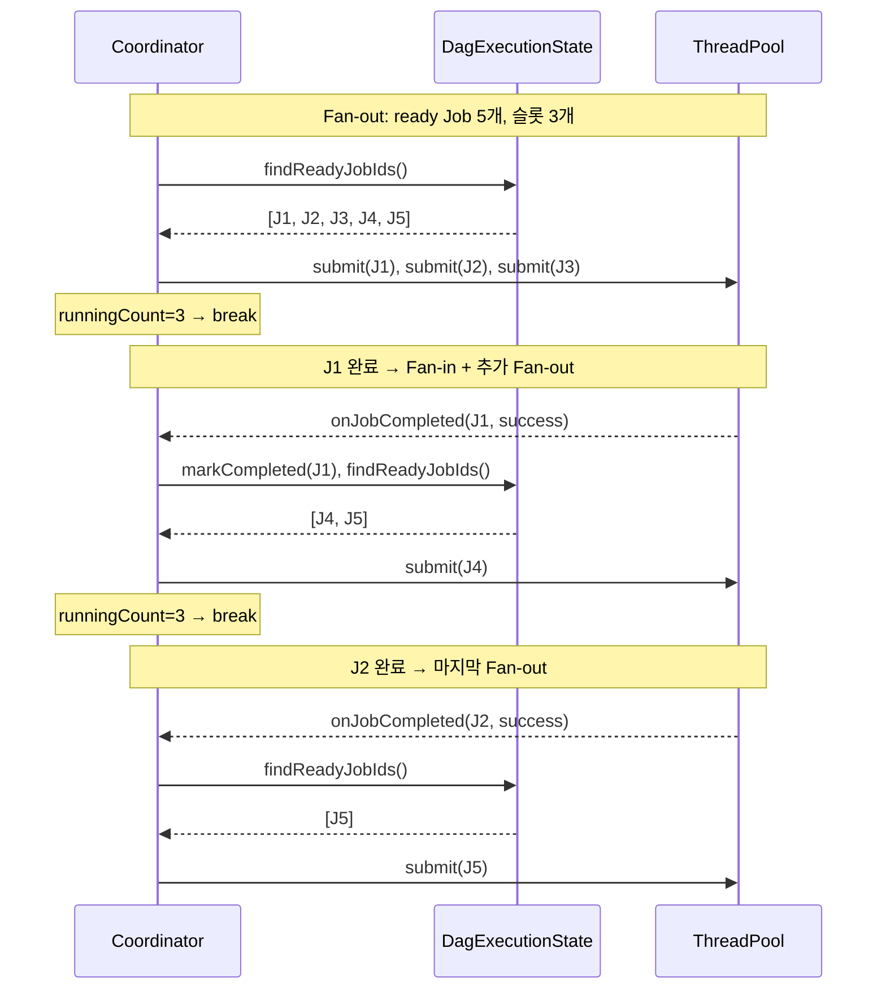
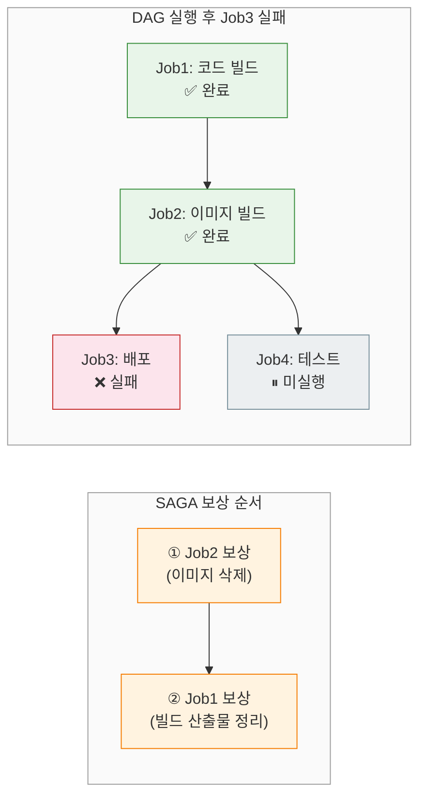
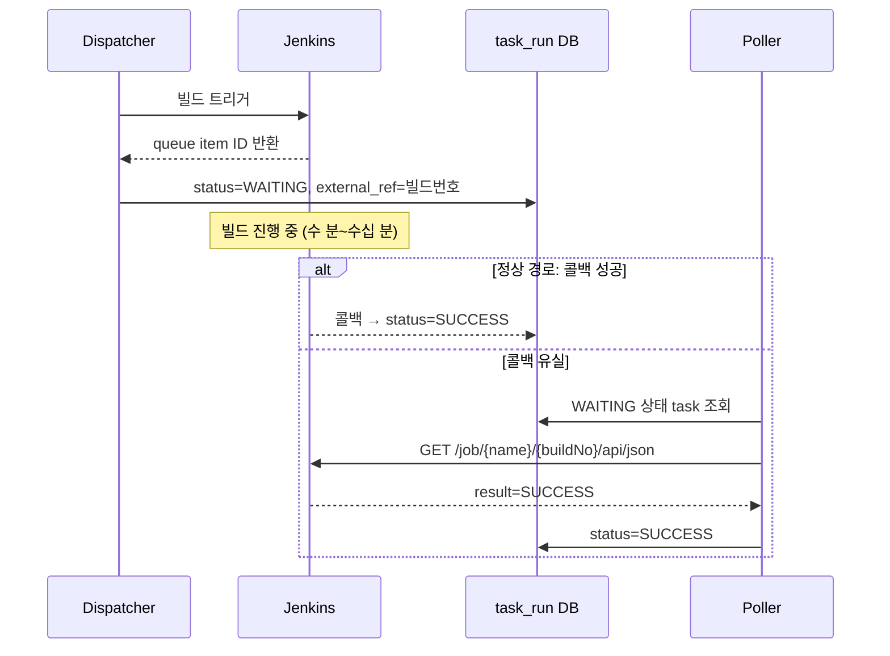
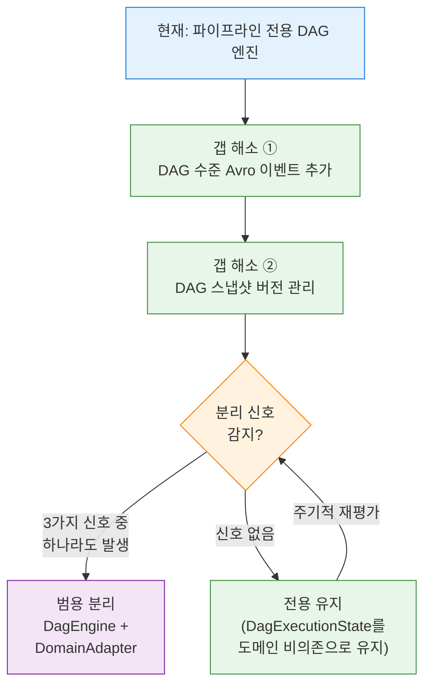

# DAG 엔진 설계 심화: 범용 엔진 vs 파이프라인 전용
---
> 범용 DAG 엔진과 파이프라인 전용 엔진의 설계 차이를 분석하고, 실제 엔진들이 상태 관리, Fan-out/Fan-in, 장애 복구, 동적 DAG를 어떻게 해결하는지 메시지큐 관점에서 다룹니다.


## 1. "범용"이란 구체적으로 무엇인가

> 03-01 문서에서 "자체 구현 vs 워크플로우 엔진 도입"의 의사결정을 다뤘지만, "범용 DAG 엔진"이 무엇을 의미하는지 정의하지 않았다. 이 섹션에서는 범용 엔진이 해결하는 5가지 관심사를 구체적으로 분리하고, 파이프라인 전용 엔진이 어디까지 커버하는지 매핑한다.

### 1-1. 범용 DAG 엔진의 5가지 관심사

범용 DAG 엔진이 해결해야 하는 문제를 다섯 가지 축으로 분류할 수 있다. Temporal, Airflow, Kestra 같은 엔진들이 이 다섯 가지를 모두 다루며, 각 엔진의 차별점은 이 관심사 중 어디에 무게를 두느냐에서 나타난다.

**① DAG 정의 추상화**: DAG의 노드와 엣지를 어떤 형식으로 정의하는가. Temporal은 코드(Go/Java/TypeScript)로 정의하고, Airflow는 Python DAG 객체로, Conductor는 JSON/YAML DSL로 정의한다. 범용 엔진은 도메인 로직과 DAG 구조를 분리해야 하므로, 정의 형식 자체가 도메인에 의존하면 안 된다.

**② 상태 머신 범용성**: DAG 노드의 생명주기 상태(PENDING → RUNNING → COMPLETED/FAILED)를 추적하는 상태 머신이 특정 도메인에 의존하지 않아야 한다. "Jenkins 빌드가 완료됐는가"와 "데이터 변환이 완료됐는가"를 같은 상태 머신으로 다룰 수 있어야 범용이다.

**③ 실행자(Executor) 플러그인**: 노드가 실제로 수행하는 작업을 플러그인 인터페이스로 주입할 수 있어야 한다. Temporal은 Activity로, Conductor는 Worker 폴링으로, Kestra는 Task Plugin으로 이 문제를 해결한다. 실행자가 고정되어 있으면 특정 도메인 전용이 된다.

**④ 멀티테넌시와 격리**: 서로 다른 팀이나 서비스가 같은 엔진 위에서 독립적인 DAG를 정의하고 실행할 수 있어야 한다. 네임스페이스, 권한 관리, 리소스 격리가 필요하다. Temporal은 네임스페이스 단위로 격리하고, Airflow는 DAG-level 접근 제어를 제공한다.

**⑤ DAG 버전 관리**: 같은 DAG의 구조가 시간에 따라 변경될 때, 실행 중인 DAG는 시작 시점의 버전으로 완료되어야 한다. Airflow 3.x가 2025년에 도입한 DAG Versioning이 이 문제의 대표적 해결책이다.

### 1-2. 파이프라인 전용 엔진이 덜어내는 것

Playground의 DAG 엔진은 이 다섯 가지 관심사 중 세 가지를 의도적으로 포기한다. 포기하는 대신 도메인 밀착에서 오는 단순성을 얻는다.

| 관심사 | 범용 엔진 | Playground 파이프라인 전용 | 포기의 이유 |
|--------|----------|------------------------|------------|
| DAG 정의 추상화 | 코드/DSL/YAML | DB 3-테이블 스키마 | 파이프라인 도메인 한정 |
| 상태 머신 범용성 | 도메인 무관 | 파이프라인/Job에 특화 | 상태 전이가 단순 |
| 실행자 플러그인 | 범용 인터페이스 | `PipelineJobExecutor` 인터페이스 | **이미 범용적** |
| 멀티테넌시 | 네임스페이스/권한 | 없음 | 단일 팀 사용 |
| DAG 버전 관리 | 실행 시점 스냅샷 | 없음 | 변경 빈도 낮음 |

주목할 점은 ③번 실행자 플러그인이다. `PipelineJobExecutor` 인터페이스는 `execute()`와 `compensate()` 두 메서드만 정의하며, `JobExecutorRegistry`가 `PipelineJobType` → 실행자 매핑을 관리한다. 이 구조는 이미 도메인에 의존하지 않는다. Jenkins, Nexus, Harbor 등 서로 다른 외부 시스템을 같은 인터페이스로 다루고 있기 때문이다.

```java
/** 실행자 플러그인 인터페이스 — 이미 범용적이다 */
public interface PipelineJobExecutor {
    void execute(PipelineExecution execution, PipelineJobExecution jobExecution)
        throws Exception;

    default void compensate(PipelineExecution execution, PipelineJobExecution jobExecution) {
        // 기본값: no-op (멱등/읽기 전용 Job용)
    }
}
```

반면 DAG 정의는 `pipeline_definition` + `pipeline_job_mapping` + `pipeline_job_dependency` 3개 테이블로 구성되어, "파이프라인"이라는 도메인 용어가 스키마에 박혀 있다. 이 부분이 범용화의 가장 큰 장벽이다.

### 1-2-A. 실행자 플러그인 추상화의 함정

§1-2에서 `PipelineJobExecutor` 인터페이스가 이미 범용적이라고 평가했다. 그러나 실행자 플러그인이 진짜 범용적이려면 한 가지 조건이 더 충족되어야 한다. 도메인 용어가 인터페이스와 `NodeType`에 노출되면 안 된다는 것이다.

예를 들어 `NodeType`에 `TRIGGER_JENKINS`나 `WAIT_JENKINS_RESULT` 같은 구체적인 실행기 이름이 박혀 있으면, 인터페이스가 아무리 범용적이어도 새 실행기를 추가할 때 `NodeType` enum 수정이 필요하다. 이는 추상화가 겉옷에 불과한 상태다.

도메인 중립적인 `NodeType` 설계를 판단하는 기준은 세 가지다:

- `NodeType`은 행위(`START_EXTERNAL_JOB`, `WAIT_EXTERNAL_JOB`, `NOTIFY`, `HTTP_CALL`)를 표현하고, 구체 실행기(Jenkins, GitHub Actions)는 노드 config의 `provider` 필드로 분리한다
- `externalRef` 필드 하나에 Jenkins의 build number, GitHub Actions의 run ID 등을 혼용하기보다, `externalExecutionId` + `externalExecutionSystem`으로 분리하면 운영 추적이 쉬워진다
- 이벤트 이름도 `JenkinsBuildCompletedEvent`가 아니라 `ExternalJobCompletedEvent`로 두고, payload에 provider를 넣어야 이벤트 소비자가 실행기에 의존하지 않는다

현재 Playground는 파이프라인 외에 다른 외부 실행기가 없으므로 이 수준의 추상화는 시기상조다. 하지만 `PipelineJobExecutor` 인터페이스의 메서드 시그니처와 `NodeType` enum이 특정 실행기에 의존하지 않도록 유지하는 것은 비용 없이 할 수 있는 준비다. 상세한 Port/Adapter 구현 패턴은 [04-01 §8](04-01.얇은%20DAG%20엔진%20설계.md#8)을 참조한다.

### 1-3. 분리 비용 분석

"범용으로 분리하면 좋지 않을까?"라는 질문에 구체적 비용으로 답한다.

**추상화 레이어 코드량**: 현재 `DagExecutionCoordinator`는 약 200줄이다. 범용화하면 도메인 비의존 DAG 코어(`DagEngine`) + 도메인 어댑터(`PipelineDagAdapter`) + 이벤트 인터페이스(`DagEventListener`) 최소 3개 클래스가 추가된다. 코드량은 1.5~2배로 늘어나고, 간접 참조(indirection)가 증가해 디버깅 시 점프 횟수가 늘어난다.

**테스트 복잡도**: 현재 `DagExecutionCoordinatorTest`는 파이프라인 도메인의 Mock 객체(`PipelineExecution`, `PipelineJob`)를 직접 사용한다. 범용화하면 도메인 무관한 `DagNode` + `DagEdge` 추상 타입의 테스트와, 이를 파이프라인에 매핑하는 어댑터 테스트가 분리된다. 테스트 파일은 최소 2배로 늘어난다.

**디버깅 난이도**: 장애 발생 시 "Job 3이 왜 실행되지 않았는가?"를 추적할 때, 범용 엔진에서는 `DagEngine` → `DagEventListener` → `PipelineDagAdapter` → `DagExecutionCoordinator` → `PipelineJobExecutor`로 5단계를 거쳐야 한다. 현재는 `DagExecutionCoordinator` → `PipelineJobExecutor` 2단계다.

결론은 명확하다. **현재 파이프라인 외에 DAG 실행이 필요한 도메인이 없으므로, 분리 비용만 발생하고 회수할 곳이 없다.** 분리 시점은 6절에서 다룬다.


## 2. 상태 관리: 인메모리 vs DB vs 이벤트 소싱

> DAG 엔진에서 가장 핵심적인 설계 결정은 "노드의 실행 상태를 어디에, 어떻게 저장하는가"이다. 읽기 성능, 장애 복구 복잡도, 확장성이 이 결정에 의해 결정된다.

### 2-1. 세 가지 상태 관리 전략

업계의 DAG 엔진들은 크게 세 가지 상태 관리 전략을 사용한다.

**① 인메모리 + DB 백업 (Netflix Maestro, Playground)**: 실행 상태를 인메모리에 유지하면서, DB를 진실의 원천(Source of Truth)으로 사용한다. 상태 변경은 먼저 DB에 기록하고, 인메모리 캐시를 갱신한다. 읽기는 인메모리에서, 쓰기는 DB로 향한다. Netflix Maestro는 이 방식으로 기존 대비 100배 성능 향상을 달성했다.

**② 순수 DB (Airflow)**: 모든 상태를 데이터베이스에 저장하고, 스케줄러가 주기적으로 폴링해서 실행 가능한 태스크를 찾는다. 구현이 단순하고 장애 복구가 쉽지만, 폴링 주기만큼 지연이 발생한다. Airflow 스케줄러는 기본 5초 간격으로 DB를 폴링한다.

**③ 이벤트 소싱 (Temporal)**: 모든 상태 변경을 이벤트로 기록하고, 현재 상태는 이벤트를 리플레이해서 복구한다. 워크플로우 코드가 결정론적(deterministic)이어야 하는 제약이 있지만, 장애 복구가 정확한 지점에서 가능하다. Temporal은 Worker가 재시작되면 이벤트 히스토리를 리플레이하여 마지막 상태를 재구성한다.



| 속성 | 인메모리 + DB | 순수 DB | 이벤트 소싱 |
|------|:----------:|:------:|:---------:|
| 읽기 지연 | 마이크로초 | 밀리초~초 | 밀리초 (캐시 후) |
| 쓰기 경로 | DB + 캐시 갱신 | DB만 | 이벤트 로그 추가 |
| 장애 복구 | DB에서 재로드 | 자동 (DB가 상태) | 이벤트 리플레이 |
| 다중 인스턴스 | 캐시 동기화 필요 | 자연스럽게 공유 | Worker 독립적 |
| 구현 복잡도 | 중간 | 낮음 | 높음 |

### 2-2. Playground의 선택: ReentrantLock + ConcurrentHashMap

Playground의 `DagExecutionCoordinator`는 ①번 전략을 따른다. 핵심 필드 두 개가 이 설계를 드러낸다.

```java
// 실행 상태를 인메모리에 유지 — 읽기 성능 최적화
private final ConcurrentHashMap<UUID, DagExecutionState> executionStates
        = new ConcurrentHashMap<>();

// 실행당 1개의 ReentrantLock — 동시 완료 콜백 직렬화
private final ConcurrentHashMap<UUID, ReentrantLock> executionLocks
        = new ConcurrentHashMap<>();
```

`ConcurrentHashMap`이 실행 ID별 상태를 저장하고, `ReentrantLock`이 같은 실행 내에서 여러 Job의 완료 콜백이 동시에 도착할 때 상태 변경을 직렬화한다. 이 패턴은 Netflix Maestro가 2025년 블로그에서 공개한 "인메모리 상태 + DB를 진실의 원천" 접근법과 동일하다.

DB는 `PipelineJobExecution` 테이블이 담당한다. Job 상태 변경(`PENDING` → `RUNNING` → `SUCCESS`/`FAILED`)은 먼저 DB에 기록된 후 인메모리 `DagExecutionState`에 반영된다. 앱이 재시작되면 `@PostConstruct`에서 `RUNNING` 상태인 실행을 DB에서 조회하고, 인메모리 상태를 재구성한다.

이 설계의 성능 이점은 `findReadyJobIds()` 호출에서 드러난다. 이 메서드는 모든 Job의 의존성 만족 여부를 확인해야 하므로 호출마다 O(V+E) 시간이 소요된다. DB 폴링 방식이면 매 5초마다 SQL 쿼리로 이 연산을 수행하지만, 인메모리 방식은 완료 콜백 시점에 즉시 실행한다.

### 2-3. 메시지큐와 상태 동기화

메시지큐 기반 시스템에서 상태 관리의 핵심 과제는 "메시지 처리와 상태 변경의 원자성"이다. Worker가 Job을 처리하고 완료 메시지를 발행하는 사이에 장애가 발생하면, 상태가 불일치할 수 있다.

Kafka/Redpanda는 이 문제를 세 가지 메커니즘으로 해결한다:

- **멱등 Producer**: Producer에 고유 PID를 할당하고 메시지에 시퀀스 번호를 부여한다. 브로커가 중복 메시지를 감지하고 폐기한다.
- **Kafka Transactions**: 여러 토픽/파티션에 대한 쓰기를 원자적으로 수행한다. 입력 토픽에서 읽고, 처리하고, 출력 토픽에 쓰는 전체 과정을 하나의 트랜잭션으로 묶는다.
- **`read_committed` 격리**: Consumer가 커밋된 트랜잭션의 메시지만 읽도록 보장한다.

Playground는 이 문제를 애플리케이션 레벨에서 해결한다. `ProcessedEvent` 테이블의 `(correlationId, eventType)` 복합 유니크 제약이 중복 처리를 차단한다. DB INSERT가 실패하면(`DataIntegrityViolationException`) 이미 처리된 이벤트로 판단하고 건너뛴다. Kafka Transactions보다 단순하지만 "DB 쓰기 성공 → 메시지 발행 실패" 시나리오에서 불일치가 발생할 수 있다. 이 간극은 Transactional Outbox 패턴(06-1 문서)으로 보완한다.

그런데 실무에서는 이 간극 외에도 세 가지 정합성 문제가 반복적으로 나타난다.

**문제 1. DB 갱신 성공 + MQ publish 실패**: `task_run` 상태를 READY로 갱신했는데, dispatch 메시지 발행이 실패하는 경우다. 노드는 READY인데 Worker가 이를 모르므로 영원히 대기한다. 대책은 두 가지가 있다:

- Outbox 테이블에 메시지를 함께 기록하고, 별도 릴레이가 MQ로 전달한다 (06-1 문서의 Transactional Outbox).
- READY 상태인 `task_run`을 주기적으로 탐색하는 스케줄러가 dispatch를 재발행한다.
- dispatch는 멱등하게 설계해야 하므로, 중복 발행이 발생해도 Worker가 동일 작업을 두 번 수행하지 않아야 한다.

**문제 2. MQ 발행 성공 + Worker 장애**: 메시지가 MQ에 도착했지만 Worker가 처리 중 장애로 죽는 경우다. ACK 기반 재전달이 기본 대책이며, `task_run`이 DISPATCHED나 RUNNING 상태로 오래 머무르면 timeout recovery가 상태를 RETRY_WAIT이나 FAILED로 전환한다. heartbeat 없이 상태만으로 판단하면 "느린 작업"과 "장애"를 구분하기 어려우므로, Worker가 주기적으로 heartbeat를 보내는 방식이 더 정확하다.

**문제 3. 외부 시스템(Jenkins) 완료 + 콜백 처리 전 장애**: Jenkins 빌드가 완료되어 콜백을 보냈지만, 콜백을 받는 서버가 장애 중이거나 네트워크가 끊긴 경우다. 콜백 하나만 믿으면 중간 장애에서 구멍이 생긴다. 대책은 `external_ref`(빌드 번호)를 `task_run`에 저장하고, 별도 poller가 Jenkins API를 주기적으로 조회하여 완료 상태를 회수하는 것이다. 콜백은 빠른 경로(fast path), poller는 안전망(safety net)으로 병행 운용하면 eventual consistency를 달성한다.

### 2-4. MQ vs DB 역할 분리 원칙

MQ를 상태 저장소로 사용하려는 유혹은 자연스럽다. 메시지에 "현재 이 노드가 실행 가능한지", "의존성이 몇 개 남았는지" 같은 정보를 넣으면 DB 조회 없이 바로 판단할 수 있을 것 같기 때문이다. 그러나 MQ에 상태를 넣기 시작하면 중복 소비, 재전달, 순서 뒤틀림이 상태 정합성을 깨뜨린다.

**MQ를 진실의 원천으로 삼지 말아야 하는** 이유는 명확하다:

- MQ 메시지는 at-least-once로 전달되므로, 같은 메시지가 두 번 소비될 수 있다. 메시지에 "남은 의존성 수: 1"이 담겨 있으면, 두 번 소비 시 의존성을 두 번 감소시켜 잘못된 실행을 유발한다.
- Consumer 리밸런싱이나 네트워크 지연으로 메시지 순서가 뒤바뀔 수 있다. "노드 A 완료" 메시지보다 "노드 B 시작" 메시지가 먼저 도착하면 상태가 꼬인다.
- MQ에서 특정 메시지를 조건부로 조회하거나 갱신하는 것은 불가능하다. "run-001의 현재 상태"를 알려면 해당 run의 모든 메시지를 처음부터 재생해야 한다.

MQ 메시지는 **실행 지시**만 전달해야 한다. 최소 정보만 담고, 판단에 필요한 상태는 DB에서 조회한다:

```json
{
  "messageId": "msg-20260322-001",
  "runId": "run-001",
  "taskRunId": "task-001",
  "nodeId": "TRIGGER_JENKINS",
  "nodeType": "JENKINS_BUILD",
  "attempt": 1,
  "traceId": "abc123",
  "headers": {
    "correlationId": "run-001",
    "causationId": "task-001"
  }
}
```

이 메시지에는 "이 노드를 실행하라"는 지시만 있다. 노드가 정말 실행 가능한지(의존성 충족 여부, 현재 상태)는 Worker가 DB의 `task_run.status`와 의존 관계를 조회하여 판단한다. 메시지와 DB 상태가 불일치하면(이미 실행 중이거나 취소된 경우) Worker는 메시지를 무시한다. 이 방식이 멱등성을 자연스럽게 보장하는 구조다.

역할을 정리하면 다음과 같다:

| 역할 | MQ | DB |
|------|----|----|
| 실행 지시 전달 | ✅ | - |
| 현재 상태 저장 | - | ✅ |
| 의존성 판단 | - | ✅ |
| 실행 이력 조회 | - | ✅ |
| 이벤트 브로드캐스트 | ✅ | - |

### 2-5. task_run 상태 머신

§1-2에서 PENDING → RUNNING → COMPLETED/FAILED 4개 상태만 언급했다. 실무에서 DAG 엔진을 운영하면 이것만으로는 부족하다. "MQ에 보냈지만 Worker가 아직 시작하지 않은" 상태, "외부 시스템의 응답을 기다리는" 상태, "재시도 백오프 중인" 상태를 구분하지 못하면 장애 원인을 특정하기 어렵다.

`task_run`의 상태를 11개로 확장한다:

- **PENDING**: 선행 조건이 미충족된 상태. 의존하는 노드가 아직 완료되지 않았다.
- **READY**: 모든 의존성이 충족되어 실행 가능한 상태. Dispatcher가 MQ에 발행하기 직전이다.
- **DISPATCHED**: MQ에 실행 지시 메시지를 발행한 상태. Worker가 아직 수신하지 않았을 수 있다.
- **RUNNING**: Worker가 작업을 시작한 상태. heartbeat로 생존을 확인한다.
- **WAITING**: 외부 시스템(Jenkins 등)의 콜백을 대기하는 상태. `external_ref`에 빌드 번호 등을 저장한다.
- **SUCCESS**: 작업이 성공적으로 완료된 상태.
- **FAILED**: 최대 재시도 횟수를 소진하고 최종 실패한 상태.
- **RETRY_WAIT**: 재시도 가능하며 백오프 대기 중인 상태. 백오프가 만료되면 READY로 돌아간다.
- **SKIPPED**: 분기 조건(conditional branching)에 의해 실행하지 않기로 결정된 상태.
- **CANCELLED**: 사용자나 시스템이 취소를 요청한 상태.
- **TIMED_OUT**: 설정된 시간 내에 완료되지 않아 타임아웃된 상태.

상태 전이 다이어그램은 다음과 같다:



DISPATCHED와 RUNNING의 분리가 중요한 이유는 장애 진단에 있다. "DISPATCHED 상태로 5분 이상 머무는 task"는 Worker 장애나 MQ 소비 지연을 의미하고, "RUNNING 상태로 30분 이상 머무는 task"는 작업 자체의 지연이나 Worker 크래시를 의미한다. 이 구분 없이 둘 다 RUNNING으로 표현하면 원인을 좁힐 수 없다.

`workflow_run`(전체 DAG 실행) 상태도 단순 SUCCESS/FAILED로는 부족하다. 병렬 노드가 있으면 "하나는 실패했고 둘은 아직 돌고 있는" 상태를 표현해야 하기 때문이다:

- **CREATED**: DAG 실행이 생성되었지만 아직 시작되지 않은 상태.
- **RUNNING**: 하나 이상의 task가 실행 중인 상태.
- **PARTIAL_FAILED**: 일부 task가 실패했지만 다른 task가 아직 실행 중인 상태. drain-and-fail 전략에서 실행 중 task의 완료를 기다리는 구간이 이 상태에 해당한다.
- **FAILED**: 모든 실행이 끝나고 하나 이상의 task가 실패한 최종 상태.
- **SUCCESS**: 모든 task가 성공적으로 완료된 상태.
- **CANCELLED**: 사용자가 전체 실행을 취소한 상태.
- **TIMED_OUT**: 전체 실행 시간 제한을 초과한 상태.

PARTIAL_FAILED는 Playground의 drain-and-fail 전략(§4-1)과 직접 연결된다. Job B가 실패했을 때 이미 실행 중인 Job C가 있으면, `workflow_run`은 PARTIAL_FAILED 상태로 전환되어 "실패가 발생했지만 아직 진행 중인 작업이 있다"는 사실을 명시적으로 표현한다. 모든 실행 중 Job이 끝나면 FAILED로 최종 전환된다.


## 3. Fan-out/Fan-in: 병렬 분기와 합류

> 02-01 문서에서 Kahn의 알고리즘과 `CompletableFuture.allOf()`로 DAG 실행기를 구현했다. 이 섹션에서는 Playground의 실제 구현이 이 이론을 어떻게 적용하는지 분석하고, 메시지큐 기반 분산 환경에서의 Fan-out/Fan-in 구현 차이를 다룬다.

### 3-1. Fan-out: 동시 실행 가능한 Job 디스패치

`DagExecutionCoordinator.dispatchReadyJobs()`가 Fan-out의 핵심이다. 이 메서드는 `DagExecutionState.findReadyJobIds()`를 호출해 모든 의존성이 충족된 Job을 찾고, `MAX_CONCURRENT_JOBS` 제한 내에서 동시 실행한다.

```java
private void dispatchReadyJobs(PipelineExecution execution) {
    DagExecutionState state = executionStates.get(execution.getId());
    List<Long> readyJobIds = state.findReadyJobIds();

    for (Long jobId : readyJobIds) {
        // containerCap: 동시 실행 Job 수 제한
        if (state.getRunningCount() >= MAX_CONCURRENT_JOBS) break;
        state.markRunning(jobId);
        PipelineJob job = state.getJob(jobId);
        executorService.submit(() -> executeJob(execution, job, jobOrder));
    }
}
```

`findReadyJobIds()`는 Kahn 알고리즘의 런타임 버전이다. 전체 DAG를 한 번에 위상 정렬하는 대신, 매 완료 시점에 "지금 실행 가능한 노드"만 찾는다. 의존성 그래프(`dependencyGraph`)에서 각 Job의 선행 Job이 모두 `completedJobIds`에 포함되어 있으면 ready 상태다.

메시지큐에서 이 패턴은 **토픽 파티셔닝 + Consumer Group 병렬 소비**에 대응한다. Dispatcher가 ready Job 메시지를 `tasks` 토픽의 서로 다른 파티션에 발행하면, Consumer Group의 Worker들이 동시에 소비한다. 03-01 문서의 `StageExecutor.executeParallel()`이 이 패턴을 구현한다.

### 3-2. Fan-in: 완료 수집과 후속 디스패치

Fan-in은 `onJobCompleted()`에서 발생한다. 여러 Worker가 동시에 완료를 보고할 때, 후행 노드의 in-degree를 정확히 감소시키고, 0이 되는 순간 정확히 한 번만 디스패치해야 한다.

```java
public void onJobCompleted(UUID executionId, int jobOrder
        , Long jobId, boolean success) {
    ReentrantLock lock = executionLocks.get(executionId);
    lock.lock();
    try {
        DagExecutionState state = executionStates.get(executionId);
        state.removeRunning(jobId);

        if (success) {
            state.markCompleted(jobId);
        } else {
            state.markFailed(jobId);
        }

        if (state.isAllDone() || state.hasFailure()) {
            finalizeExecution(executionId, state);
        } else {
            dispatchReadyJobs(execution);  // Fan-in 후 다시 Fan-out
        }
    } finally {
        lock.unlock();
    }
}
```

`ReentrantLock`이 핵심이다. Job A와 Job B가 동시에 완료되면, 두 콜백이 같은 `DagExecutionState`를 수정하려 한다. Lock 없이 `markCompleted()` → `findReadyJobIds()` → `markRunning()`을 실행하면 Race Condition이 발생해 후행 Job C가 두 번 디스패치되거나 아예 디스패치되지 않을 수 있다.

이 패턴을 02-01 문서의 `CompletableFuture` 기반 구현과 비교하면 차이가 명확해진다:

| 요소 | 02-01 CompletableFuture | Playground ReentrantLock |
|------|:---------------------:|:------------------------:|
| 동시성 제어 | `ConcurrentHashMap.merge()` 원자 연산 | 실행당 `ReentrantLock` |
| in-degree 감소 | `merge(id, -1, Integer::sum)` | `findReadyJobIds()` 재계산 |
| 이중 디스패치 방지 | `merge` 반환값 == 0일 때만 submit | Lock 구간 내 `markRunning()` |
| 장애 복구 | 없음 (인메모리 유실) | DB에서 상태 재로드 |

Playground 방식은 "in-degree를 원자적으로 감소"하는 대신 "Lock 내에서 전체 ready 목록을 재계산"한다. 성능은 미세하게 낮지만, DB와의 동기화가 자연스럽고 디버깅이 쉽다.

### 3-3. 동시 실행 제한과 배압

`MAX_CONCURRENT_JOBS = 3`은 Jenkins의 `containerCap`(동시 빌드 수 제한)에 맞춘 상수다. DAG에서 ready Job이 5개 발견되더라도 3개만 디스패치하고, 나머지 2개는 다음 완료 콜백에서 디스패치된다.



이 패턴은 02-02 문서의 `pause()`/`resume()` 배압 패턴과 동일한 문제를 해결한다. 메시지큐에서는 Consumer가 처리 용량 초과 시 `pause()`로 소비를 멈추지만, 인프로세스 DAG 엔진에서는 `runningCount >= MAX_CONCURRENT_JOBS` 조건으로 디스패치를 멈춘다. 해결 대상(과부하 방지)은 같지만 수단이 다르다.

Temporal은 이 문제를 **Worker의 MaxConcurrentActivityExecutionSize** 옵션으로 해결한다. Worker가 동시에 실행할 Activity 수를 제한하면, Temporal 서버는 초과 Activity를 큐에 보관했다가 Worker에 여유가 생기면 전달한다. Kestra는 Kafka consumer의 `max.poll.records`와 Worker 스레드풀 크기를 조합해 같은 효과를 낸다.


## 4. 장애 복구와 SAGA 보상

> 03-01 문서에서 fail-fast/continue 전략과 DLQ를 다뤘다. 이 섹션에서는 DAG 구조에서의 실패 전파가 선형 파이프라인과 어떻게 다른지, 그리고 역방향 위상 순서 SAGA 보상이 왜 필요한지 분석한다.

### 4-1. drain-and-fail: DAG에서의 실패 전파 전략

선형 파이프라인에서 3번째 단계가 실패하면 4번째 단계를 실행하지 않으면 된다. DAG에서는 상황이 복잡하다. Job B가 실패했을 때, Job B에 의존하지 않는 Job C는 계속 실행할 수 있는가?

Playground는 **drain-and-fail** 전략을 채택한다. 실패가 발생하면 새 Job을 디스패치하지 않되, 이미 실행 중인 Job은 완료될 때까지 기다린다. 모든 실행 중 Job이 끝나면 보상을 시작한다.

```java
// onJobCompleted 내부 — 실패 후 처리
if (state.hasFailure()) {
    if (state.getRunningCount() == 0) {
        // 모든 실행 중 Job이 끝났으면 → 보상 시작
        finalizeExecution(executionId, state);
    }
    // 실행 중 Job이 남아있으면 → 디스패치 안 하고 대기
    return;
}
```

이 전략을 다른 엔진들과 비교한다:

| 전략 | 엔진 | 동작 | 장점 | 단점 |
|------|------|------|------|------|
| drain-and-fail | Playground | 실행 중 Job 완료 대기 후 보상 | 실행 중 Job의 결과 보존 | 보상 시작까지 지연 |
| fail-fast + cancel | Temporal | 실패 즉시 실행 중 Activity 취소 | 빠른 실패 감지 | 취소 로직 필요 |
| trigger_rule 기반 | Airflow | `all_done`, `one_failed` 등 조건부 실행 | 유연한 정책 | 설정 복잡도 높음 |

drain-and-fail은 "실행 중인 Job을 강제로 취소할 방법이 없는" 환경에 적합하다. Jenkins 빌드를 중간에 취소하려면 Jenkins API를 호출해야 하고, 취소 성공 보장도 어렵다. 취소 대신 "끝날 때까지 기다린 후 정리한다"는 실용적 접근이다.

### 4-2. 역방향 위상 순서 SAGA 보상

DAG에서 SAGA 보상은 **leaf 노드부터 root 방향으로** 진행해야 한다. 이유는 자식 Job의 결과물이 부모 Job의 결과물에 의존하기 때문이다. 예를 들어 "Docker 이미지 빌드(부모) → 이미지 배포(자식)" DAG에서, 배포를 먼저 롤백하고 이미지를 삭제해야 한다. 이미지를 먼저 삭제하면 배포 롤백이 참조할 이미지가 없다.

`DagExecutionState.completedJobIdsInReverseTopologicalOrder()`가 이 순서를 계산한다. 완료된 Job만으로 서브그래프를 구성하고, Kahn 알고리즘으로 위상 정렬한 뒤 역순으로 반환한다.



보상 대상은 **완료된 Job만**이다. 실패한 Job3는 보상하지 않는다(이미 실패했으므로 되돌릴 성공 결과가 없다). 미실행 Job4도 보상하지 않는다. `SagaCompensator`는 `PENDING` 상태의 Job을 건너뛴다.

```java
// SagaCompensator.compensate() — 핵심 루프
for (int i = failedJobOrder - 2; i >= 0; i--) {
    PipelineJobExecution jobExecution = executions.get(i);
    if (jobExecution.getStatus() != PipelineJobStatus.SUCCESS) {
        continue;  // PENDING, FAILED 건너뛰기
    }
    try {
        executor.compensate(execution, jobExecution);
        jobExecution.updateStatus(PipelineJobStatus.COMPENSATED);
    } catch (Exception e) {
        jobExecution.updateStatus(PipelineJobStatus.COMPENSATION_FAILED);
        log.error("[SAGA] 보상 실패 — 수동 개입 필요: {}", jobExecution.getId());
    }
}
```

### 4-3. 보상 실패와 메시지큐

현재 구현에서 보상이 실패하면 `COMPENSATION_FAILED` 상태로 마킹하고 로그를 남긴다. 수동 개입이 필요한 상황이다. 이 한계를 메시지큐로 확장하면, 보상 실패 메시지를 별도 토픽(`compensation.dlq`)에 발행하고, 재시도 Consumer가 지수 백오프로 보상을 재시도할 수 있다.

보상 재시도에서 **멱등성**이 필수적인 이유는 보상 자체가 부분적으로 성공할 수 있기 때문이다. "이미지 삭제" 보상이 Registry API 호출 후 DB 업데이트 전에 실패하면, 재시도 시 이미 삭제된 이미지를 다시 삭제하려 한다. 보상 메서드는 "이미 보상된 상태에서 다시 호출해도 안전"해야 한다. `PipelineJobExecutor.compensate()`의 기본값이 no-op인 이유도 이 원칙에 기반한다.

### 4-4. Jenkins 2-노드 분할 패턴

Jenkins 빌드는 DAG 엔진 입장에서 까다로운 외부 작업이다. 실행 시간이 수 분에서 수십 분까지 소요되고, 상태가 Jenkins 서버에 존재하며, 완료 시점을 능동적으로 알 수 없다. 이 특성 때문에 Jenkins 작업을 단일 노드로 표현하면 Worker 스레드가 Jenkins 완료까지 블로킹되거나, 폴링 루프로 CPU를 낭비하게 된다.

해결책은 Jenkins 작업을 두 개의 노드로 분할하는 것이다:

- **TRIGGER_JENKINS**: Jenkins API로 빌드를 트리거하고, 반환된 queue item ID 또는 build number를 `task_run.external_ref`에 저장한 뒤, task 상태를 WAITING으로 전환한다. Worker 스레드는 즉시 반환된다.
- **WAIT_JENKINS_RESULT**: 콜백 또는 폴링으로 빌드 완료를 감지하고, 결과에 따라 후속 노드를 진행한다.

TRIGGER_JENKINS가 `external_ref`를 저장하는 이유는 장애 복구에 있다. 서버가 재시작되어도 `external_ref`로 Jenkins에 "이 빌드가 어떻게 됐는지" 물어볼 수 있다. `external_ref` 없이 콜백만 기다리면, 콜백 수신 전에 서버가 죽었을 때 빌드 결과를 영영 알 수 없게 된다.

완료 감지 방식은 두 가지가 있다:

**방식 A. Jenkins Webhook 콜백**: Jenkins 빌드가 완료되면 설정된 URL로 POST 요청을 보낸다. Spring 엔드포인트가 이를 수신하고, `external_ref`로 해당 `task_run`을 찾아 상태를 SUCCESS 또는 FAILED로 갱신한다. 지연이 최소화되는 빠른 경로다.

**방식 B. Polling Worker**: 별도 스케줄러가 WAITING 상태인 `task_run` 목록을 주기적으로 조회하고, 각 `task_run`의 `external_ref`를 이용해 Jenkins API(`/api/json`)로 빌드 상태를 확인한다. 빌드가 완료되었으면 DB를 갱신하고 후속 노드를 트리거한다.

콜백 단독 의존이 위험한 이유는 §2-3의 문제 3에서 다뤘다. 콜백이 네트워크 문제로 유실되면 task가 영원히 WAITING 상태에 머문다. 모니터링 대시보드에서 "WAITING 상태가 1시간 이상 지속"을 알림으로 설정해도, 이는 감지일 뿐 자동 복구가 아니다.

콜백과 폴링을 병행하면 다음과 같이 동작한다:



콜백은 빠른 경로(fast path)이고, 폴링은 안전망(safety net)이다. 둘 다 `external_ref`를 키로 사용하고, 상태 갱신은 멱등하게(이미 SUCCESS인 task를 다시 SUCCESS로 갱신해도 무해하게) 설계한다. 콜백이 정상 도착하면 폴링은 이미 완료된 task를 건너뛴다. 콜백이 유실되면 폴링이 eventual consistency로 상태를 회수한다.

이 2-노드 분할 패턴은 Jenkins에 국한되지 않는다. 외부 시스템 호출이 오래 걸리고 상태를 외부에서 관리하는 모든 경우에 적용할 수 있다. Harbor 이미지 스캔, SonarQube 코드 분석, 외부 API 승인 대기 등이 같은 구조로 처리 가능하다.


## 5. 동적 DAG와 버전 관리

> 02-01~03-01 문서에서 다루지 않은 새로운 주제이다. DAG 구조가 런타임에 변경되거나, 시간이 지남에 따라 같은 DAG의 구조가 변화하는 시나리오를 다룬다.

### 5-1. 정적 DAG vs 동적 DAG

**정적 DAG**는 실행 전에 구조가 확정되어 있다. Playground의 `pipeline_definition` + `pipeline_job_dependency` 테이블이 정적 DAG의 전형이다. 파이프라인을 정의할 때 Job과 의존성을 설정하고, 실행 시점에는 구조를 변경하지 않는다. `DagValidator.validate()`가 실행 전에 순환 검증과 연결성 검증을 수행할 수 있는 것도 구조가 확정되어 있기 때문이다.

**동적 DAG**는 실행 중에 구조가 결정되거나 변경된다. 앞 단계의 결과에 따라 뒷 단계의 Job 수나 의존 관계가 달라진다. 예를 들어 멀티모듈 프로젝트의 빌드에서, 변경된 모듈을 감지한 후 해당 모듈에 대해서만 테스트 Job을 동적으로 생성하는 경우가 이에 해당한다.

2025~2026년 기준 업계 엔진들의 동적 DAG 접근법은 세 가지로 나뉜다:

- **Airflow 3.x Dynamic Task Mapping**: 이전 태스크의 출력에 기반해 런타임에 태스크 수를 결정한다. DAG "구조"는 설계 시점에 정의되지만, 태스크 "인스턴스 수"가 동적이다.
- **Prefect 3.0**: DAG 구조 자체를 요구하지 않는다. Python의 `if/else`, `for` 루프로 워크플로우를 정의하며, 런타임에 실행 경로가 결정된다.
- **Temporal Child Workflow**: 부모 워크플로우가 실행 중에 자식 워크플로우를 동적으로 생성한다. Fan-out 시 자식 워크플로우 수를 런타임 데이터에 기반해 결정한다.

Playground에서 동적 DAG가 필요한 시나리오는 제한적이다. 파이프라인 정의가 자주 변경되지 않고, 변경 시 UI에서 Job과 의존성을 편집한 후 다시 실행하면 된다. 동적 DAG 지원은 현 시점에서 투자 대비 회수가 낮다.

### 5-2. DAG 버전 관리

Airflow 3.x는 2025년에 DAG Versioning을 도입했다. 핵심 규칙은 "실행 중인 DAG run은 시작 시점의 DAG 버전으로 완료된다"이다. DAG 코드를 수정해서 새 버전을 배포하더라도, 이미 실행 중인 run은 이전 버전의 태스크 구조와 코드를 사용한다.

Playground에서 이 문제가 발생하는 시나리오는 다음과 같다. 파이프라인 A가 실행 중인데, 관리자가 UI에서 Job 의존성을 변경하면 실행 중인 `DagExecutionState`의 `dependencyGraph`와 DB의 `pipeline_job_dependency` 테이블이 불일치한다. 현재 구현은 `DagExecutionState`가 실행 시작 시 의존성을 인메모리에 로드하므로, 실행 중 DB 변경은 영향을 주지 않는다. 그러나 이 보장은 명시적이지 않고, 장애 복구 시 DB에서 상태를 재로드하면 변경된 의존성이 적용될 위험이 있다.

명시적 버전 관리를 도입하려면 `pipeline_execution` 테이블에 DAG 스냅샷을 저장하는 방법이 있다:

```sql
-- 실행 시점의 DAG 구조를 JSON으로 스냅샷
ALTER TABLE pipeline_execution
    ADD COLUMN dag_snapshot JSONB;

-- dag_snapshot 예시:
-- {"jobs": [...], "dependencies": [{"jobId": 1, "dependsOn": 2}, ...]}
```

실행 시작 시 현재 DAG 구조를 JSON으로 직렬화하여 저장하면, 장애 복구 시에도 시작 시점의 DAG 구조로 복원할 수 있다. Airflow가 내부적으로 `serialized_dag` 테이블에 DAG 구조를 직렬화하여 저장하는 것과 동일한 접근이다.

### 5-3. 메시지큐에서의 DAG 정의 전파

DAG 정의 자체를 메시지큐를 통해 전파하는 패턴도 있다. Kestra는 모든 컴포넌트(Worker, Executor, Scheduler)가 Kafka를 통해 통신하며, 워크플로우 정의도 Kafka 토픽에 저장한다. 이 방식의 장점은 모든 노드가 동일한 워크플로우 정의를 참조하고, 변경 전파가 자동이라는 점이다.

Kafka의 **Compacted Topic**을 DAG 정의 저장소로 활용하는 아이디어도 고려할 수 있다. Compacted Topic은 같은 키의 최신 메시지만 유지하므로, `pipeline-definition-{id}`를 키로 사용하면 각 파이프라인 정의의 최신 버전만 보관된다. Consumer는 토픽을 처음부터 읽어서 모든 파이프라인 정의를 로컬 캐시에 구축한다.

그러나 Playground 규모에서 이 패턴은 과설계이다. 파이프라인 정의가 수십 개 수준이고 변경 빈도가 낮으므로, DB 조회로 충분하다. Kestra가 이 패턴을 채택한 이유는 "수천 개의 워크플로우 정의를 수백 개의 Worker에 분배"해야 하기 때문이다. 규모가 다르면 해법도 달라진다.


## 6. 갭 분석과 진화 경로

### 6-1. 현재 Playground가 커버하는 것

`DagExecutionCoordinator`가 해결하는 문제들을 02-01~03-01의 이론적 패턴과 매핑한다:

| 이론적 패턴 (02-01~03-01) | Playground 구현 | 구현 방식 |
|---------------------|---------------|----------|
| DAG 검증 (순환 탐지) | `DagValidator` | Kahn's BFS 알고리즘 |
| Level 3 의존성 추적 | `DagExecutionState` | `dependencyGraph` + `successorGraph` |
| Fan-out 병렬 실행 | `dispatchReadyJobs()` | `findReadyJobIds()` + `ExecutorService` |
| Fan-in 완료 수집 | `onJobCompleted()` | `ReentrantLock` + 상태 재계산 |
| 배압 (동시 실행 제한) | `MAX_CONCURRENT_JOBS` | `runningCount` 기반 제한 |
| 묶음 배리어 | DAG 의존성 자체 | in-degree 기반 자연스러운 배리어 |
| SAGA 보상 | `SagaCompensator` | 역방향 위상 순서 |
| Webhook 비동기 완료 | Break-and-Resume 패턴 | CAS 기반 상태 갱신 |
| 멱등성 | `ProcessedEvent` 테이블 | `(correlationId, eventType)` 유니크 제약 |

### 6-2. 남은 갭

**① DAG 수준 Avro 이벤트 부재**: 현재 Avro 이벤트(`PipelineStepChangedEvent`, `PipelineExecutionCompletedEvent`)는 Step 단위의 레거시 스키마다. DAG 수준의 이벤트(예: `DagNodeCompleted`, `DagFanInTriggered`)가 없어서, 외부 시스템(프론트엔드 DAG 시각화, 모니터링)이 DAG 실행 흐름을 실시간으로 추적하기 어렵다. **영향도: 중간** — 프론트엔드 DAG 시각화에 직접 영향.

**② 다중 인스턴스 실행 미지원**: `ConcurrentHashMap<UUID, DagExecutionState>`는 단일 JVM에서만 유효하다. 앱을 2대 이상 배포하면, 같은 실행의 상태가 두 인스턴스에 분산될 수 있다. Consumer Group 리밸런싱으로 한 인스턴스만 처리하도록 강제하는 방법이 있지만, 명시적으로 설계되어 있지 않다. **영향도: 낮음** — 현재 단일 인스턴스 운영.

**③ DAG 버전 관리 부재**: 5-2절에서 다룬 문제. 실행 중 DAG 구조 변경 시 불일치 가능성. **영향도: 낮음** — DAG 변경 빈도가 낮고, 실행 중 변경은 드물다.

**④ 보상 실패 재시도 미구현**: 4-3절에서 다룬 문제. 보상 실패 시 수동 개입만 가능. **영향도: 낮음** — 보상 자체가 드물고, 보상 실패는 더 드물다.

### 6-3. 진화 경로

파이프라인 전용 DAG 엔진을 유지하되, 범용으로 분리해야 하는 시점을 판단하는 **세 가지 신호**를 정의한다.

**신호 ①: 파이프라인 외 도메인에서 DAG 실행 요구 발생**. 예를 들어 데이터 파이프라인, 머신러닝 학습 파이프라인, 비즈니스 프로세스 자동화 등이 같은 엔진을 필요로 할 때. 이 시점에서 `DagExecutionCoordinator`를 `DagEngine`(도메인 무관) + `PipelineDagAdapter`(파이프라인 전용)로 분리하는 것이 정당화된다.

**신호 ②: DAG 정의 방식이 3종 이상으로 분기**. 현재는 DB 테이블 기반 하나뿐이지만, JSON 파일 기반, API 동적 생성, YAML DSL 등이 추가되면 정의 추상화 레이어가 필요해진다.

**신호 ③: 실행 상태 조회 API가 도메인 로직과 분리 불가능**. "DAG의 현재 실행 상태"를 조회하는 API가 파이프라인 도메인 용어(`PipelineExecution`, `PipelineJob`)에 강하게 결합되어 있으면, 다른 도메인에서 재사용이 불가능하다.



범용 분리 전까지 할 수 있는 가장 효과적인 준비는 `DagExecutionState`를 도메인 비의존적으로 유지하는 것이다. 현재 `DagExecutionState`는 `PipelineJob`을 직접 참조하지만, 핵심 로직(`findReadyJobIds()`, `completedJobIdsInReverseTopologicalOrder()`)은 `Long` 타입의 Job ID와 `Map<Long, Set<Long>>` 타입의 의존성 그래프만 사용한다. 이 부분은 이미 도메인에 의존하지 않는다. 범용 분리 시 `DagExecutionState`는 거의 그대로 재사용할 수 있고, `DagExecutionCoordinator`의 도메인 의존 부분(`PipelineExecution` 조회, `PipelineJobExecution` 생성)만 어댑터로 분리하면 된다.


## Sources

- Netflix Technology Blog, "100X Faster — How We Supercharged Netflix Maestro's Workflow Engine" (2025) — https://netflixtechblog.com/100x-faster-how-we-supercharged-netflix-maestros-workflow-engine-028e9637f041
- Temporal Documentation, "Workflow Definition" — https://docs.temporal.io/workflow-definition
- Apache Airflow, "What's New in Airflow 3.0" (2025) — https://airflow.apache.org/blog/airflow-three-point-oh-is-here/
- Apache Airflow, "Dynamic Task Mapping" — https://airflow.apache.org/docs/apache-airflow/stable/authoring-and-scheduling/dynamic-task-mapping.html
- Kestra Documentation, "Features" — https://kestra.io/features
- Prefect, "Second Generation Workflow Engine" (2024) — https://www.prefect.io/blog/second-generation-workflow-engine
- Confluent, "Exactly-Once Semantics Are Possible: Here's How Kafka Does It" — https://www.confluent.io/blog/exactly-once-semantics-are-possible-heres-how-apache-kafka-does-it/
- Temporal, "Mastering Saga Patterns for Distributed Transactions" — https://temporal.io/blog/mastering-saga-patterns-for-distributed-transactions-in-microservices
- Temporal, "Workflow Engine Principles" — https://temporal.io/blog/workflow-engine-principles
- Kahn, A. B. (1962), "Topological sorting of large networks", *Communications of the ACM*, 5(11), 558–562 — https://doi.org/10.1145/368996.369025
- 내부 코드: `DagExecutionCoordinator.java`, `DagExecutionState.java`, `DagValidator.java`, `SagaCompensator.java`
- 선행 문서: 02-01 DAG 기반 워크플로우 순서 보장, 02-02 DAG 순서 보장 심화, 03-01 DAG 워크플로우 엔진 사례와 구현
