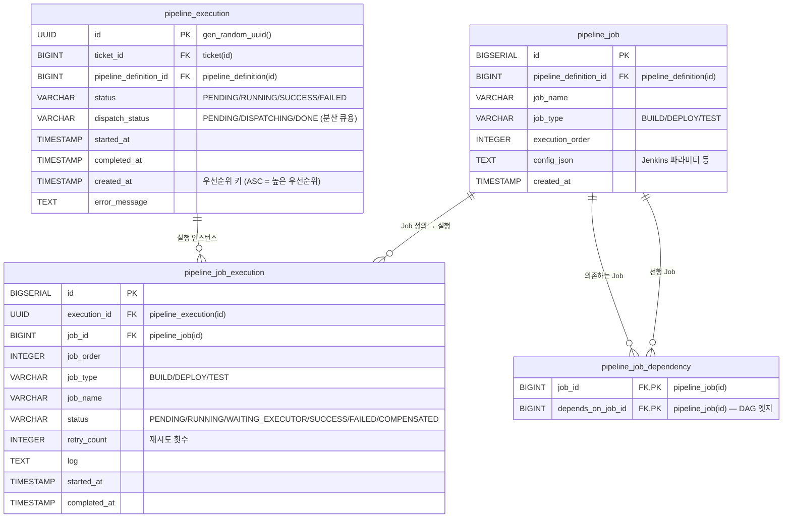
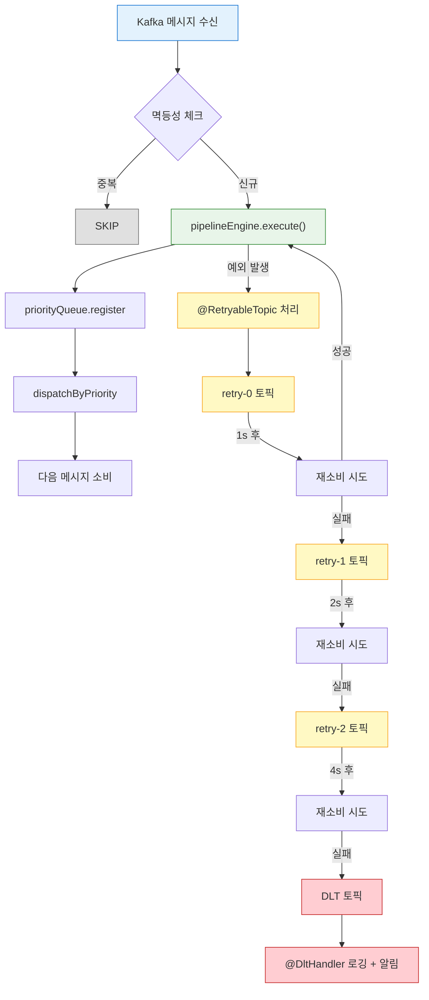
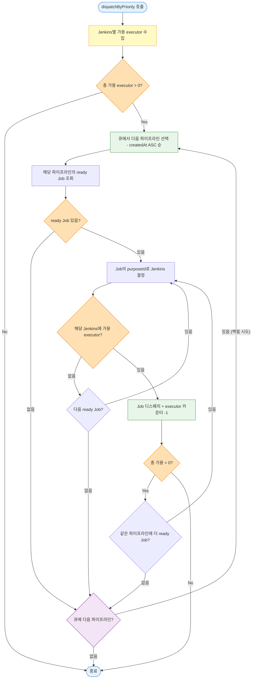
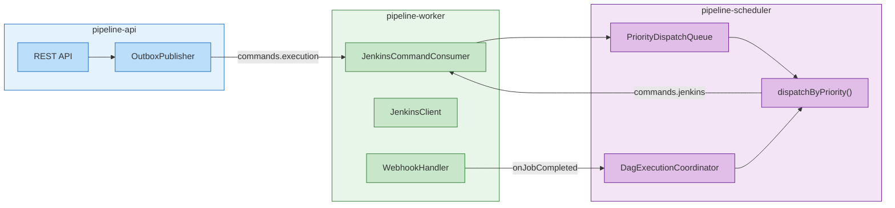

# 우선순위 백필 스케줄러 (Priority Backfill Scheduler)

---

> **Priority Backfill**은 가장 먼저 등록된 파이프라인의 Job이 executor 슬롯을 우선 선점하되, 해당 파이프라인의 준비된 Job이 없어서 슬롯이 비는 상황이 생기면 후순위 파이프라인의 Job이 그 빈자리를 채운다(backfill).

| 방식                  | 우선순위 | executor 활용률                  | 가용성                  | 멀티 모듈 |
| --------------------- | -------- | -------------------------------- | ----------------------- | --------- |
| Per-execution slot    | ❌ 없음   | 낮음 (글로벌 미제어)             | ❌ 인메모리              | ❌         |
| 2-topic blocking      | ✅ FIFO   | 낮음 (P1 완료 후 P2 진입)        | ✅ Kafka offset          | ❌         |
| Semaphore             | ❌ 없음   | 높음                             | △ 재기동 시 재구성 필요 | ❌         |
| Hybrid                | ❌ 없음   | 높음                             | ✅                       | △         |
| **Priority Backfill** | ✅ FIFO   | **최고** (백필로 빈 슬롯 최소화) | ✅ DB 기반 재구성        | ✅         |


## 1. ConcurrentSkipListMap

> `ConcurrentSkipListMap`은 Java의 `java.util.concurrent` 패키지에 포함된 동시성 안전 정렬 맵이다. 내부적으로 **Skip List** 자료구조를 사용한다.

### 1-1. Skip List란?: 정렬된 연결 리스트에 다단계 "고속 레인"을 추가한 확률적 자료구조다. 


- 일반 연결 리스트의 탐색이 O(n)인 반면, Skip List는 O(log n)을 달성한다. 
- 각 노드가 확률적으로 여러 레벨의 포인터를 갖고, 상위 레벨에서 빠르게 건너뛰다가 하위 레벨에서 정밀 탐색하는 구조다.

### 1-2. 왜 TreeMap이 아닌 ConcurrentSkipListMap인가?

| 속성             | TreeMap                           | ConcurrentSkipListMap    |
| ---------------- | --------------------------------- | ------------------------ |
| 동시성           | 외부 동기화 필요 (`synchronized`) | Lock-free (CAS 기반)     |
| 정렬 보장        | Red-Black Tree                    | Skip List                |
| 순회 중 수정     | ConcurrentModificationException   | 안전 (weakly consistent) |
| 성능 (동시 접근) | Lock 경합으로 성능 저하           | Lock-free로 높은 처리량  |

- 파이프라인 시스템에서 `dispatchByPriority()`가 큐를 순회하는 동안, webhook 콜백이 다른 스레드에서 `register()`나 `remove()`를 호출할 수 있다.
- `ConcurrentSkipListMap`은 이 시나리오에서 lock 없이 안전하게 동작한다.

### 1-3. 단일 JVM 한계와 멀티 인스턴스 전략

`ConcurrentSkipListMap`은 인메모리 자료구조이므로, 앱을 2대 이상 배포하면 각 인스턴스가 독립된 큐를 갖게 된다. 이 경우 인스턴스 A가 P1을 우선 처리하는 동안 인스턴스 B가 P3을 먼저 디스패치하는 우선순위 불일치가 발생한다.

| 전략                      | 글로벌 우선순위    | 구현 난이도 | 인프라 추가            | 적용 시점               |
| ------------------------- | ------------------ | ----------- | ---------------------- | ----------------------- |
| **ConcurrentSkipListMap** | ✅ (단일 인스턴스)  | 없음        | 없음                   | 지금                    |
| **DB 기반 분산 큐**       | ✅                  | 중간        | 없음 (기존 PostgreSQL) | 인스턴스 2대 이상       |
| **Redis Sorted Set**      | ✅                  | 중간        | Redis 추가             | 저지연 필요 시          |
| Kafka 파티션              | ❌ 파티션 간 미보장 | 낮음        | 없음                   | 우선순위 포기 가능 시만 |

- **DB 기반 분산 큐 (권장).** `pipeline_execution` 테이블에 `dispatch_status` 컬럼을 추가하고, `SELECT ... FOR UPDATE SKIP LOCKED`로 분산 락을 건다. 
- 각 인스턴스가 DB를 진실의 원천으로 사용하므로 글로벌 우선순위가 보장된다. 인메모리 큐는 DB 캐시 역할만 한다. 별도 인프라 추가 없이 기존 PostgreSQL만으로 구현 가능하다는 것이 장점이다.



```sql
-- 분산 큐 패턴: 가장 오래된 미처리 실행을 원자적으로 선택
-- SKIP LOCKED: 다른 인스턴스가 잡고 있는 행은 건너뛰어 경합 없이 분배
SELECT * FROM pipeline_execution
WHERE status = 'RUNNING' AND dispatch_status = 'PENDING'
ORDER BY created_at ASC
LIMIT 1
FOR UPDATE SKIP LOCKED;


-- 실행 흐름
Instance A: SELECT ... FOR UPDATE SKIP LOCKED → P1 획득 → P1 Job 디스패치
Instance B: SELECT ... FOR UPDATE SKIP LOCKED → P1은 A가 잠금 → SKIP → P2 획득
-- → 글로벌 우선순위 보장: P1이 항상 먼저, P2가 백필
```

**DB 방식의 알려진 이슈와 완화.**

| 이슈           | 원인                                         | 영향 수준         | 완화 방법                                                    |
| -------------- | -------------------------------------------- | ----------------- | ------------------------------------------------------------ |
| 폴링 지연      | webhook → DB 조회 → 디스패치 사이 수~수십 ms | 낮음              | 이벤트 트리거 방식 유지 (webhook에서 직접 호출), 폴링은 안전망으로만 |
| DB 부하        | `FOR UPDATE SKIP LOCKED` 매 webhook마다 호출 | 낮음~중간         | ready job 있을 때만 호출 + 인메모리 캐시 병행                |
| Lock 경합      | 여러 인스턴스가 같은 행 선점 시도            | 인스턴스 10대+ 시 | `SKIP LOCKED`가 잠긴 행 건너뜀, 심각해지면 Redis 전환        |
| 트랜잭션 시간  | 디스패치 로직이 트랜잭션 내에서 오래 걸림    | 중간              | 디스패치 결정만 트랜잭션 내, Kafka 발행은 트랜잭션 밖        |
| DB 단일 장애점 | PostgreSQL 다운 시 스케줄링 중단             | 낮음              | 현재도 DB 의존, HA(Primary-Replica)로 해결                   |


## 2. PriorityDispatchQueue

>  우선순위 관리의 핵심은 `ConcurrentSkipListMap<LocalDateTime, UUID>`이다. 키가 파이프라인 시작 시각(createdAt)이므로 자연스럽게 FIFO 우선순위가 적용된다. 동시성 환경에서도 정렬 순서가 보장되어 별도의 잠금 없이 안전하게 순회할 수 있다.

```bash
# ═══ T=0s: 3개 파이프라인 등록 ═══
ConcurrentSkipListMap (createdAt ASC):
┌────────────────┬────────────────┬────────────────┐
│ key: 00:00:00  │ key: 00:00:01  │ key: 00:00:02  │
│ val: P1 (UUID) │ val: P2 (UUID) │ val: P3 (UUID) │
│ priority: 1st  │ priority: 2nd  │ priority: 3rd  │
└────────────────┴────────────────┴────────────────┘
         ↑ 순회 시작점 (가장 높은 우선순위)

dispatchByPriority() 호출:
  available executors = 3
  → P1 순회: ready [J1,J2,J3] → 3개 디스패치 → available = 0 → STOP
  → P2, P3: 도달하지 못함 (executor 소진)

# ═══ T=20s: P1-J2 완료, P1 DAG 대기 ═══
ConcurrentSkipListMap (변화 없음):
┌────────────────┬────────────────┬────────────────┐
│ P1 (1st)       │ P2 (2nd)       │ P3 (3rd)       │
│ ready: []      │ ready: [J1,J2] │ ready: [J1,J2] │
│ running: [J3,J4]│               │                │
└────────────────┴────────────────┴────────────────┘

dispatchByPriority() 호출:
  available executors = 1 (P1-J2 완료로 1개 반환)
  → P1 순회: ready = [] (J5는 J4 완료 대기) → 스킵
  → P2 순회: ready [J1] → 1개 디스패치 → available = 0 → STOP
       ★ 백필 발생! P2-J1이 P1의 빈자리를 채움

# ═══ T=25s: P1-J3 완료 ═══
dispatchByPriority() 호출:
  available executors = 1
  → P1 순회: ready [J5] (J4+J2 완료 → 조건 충족) → 1개 디스패치 (우선!)
  → P2: 도달하지 못함 (executor 소진)
       ★ P1이 우선권 행사! P2보다 P1-J5가 먼저 배정

# ═══ T=35s: P1-J4 완료 ═══
dispatchByPriority() 호출:
  available executors = 1
  → P1 순회: ready = [] → 스킵
  → P2 순회: ready [J2] → 디스패치 (백필)

# ═══ T=40s: P1-J5 완료 → P1 종료 ═══
ConcurrentSkipListMap에서 P1 제거:
┌────────────────┬────────────────┐
│ P2 (1st로 승격)│ P3 (2nd로 승격)│
│ ready: [J3]    │ ready: [J1,J2] │
└────────────────┴────────────────┘

dispatchByPriority() 호출:
  available executors = 1
  → P2 순회 (이제 최우선): ready [J3] → 디스패치
  → P3: 도달 못함
```

1. `ConcurrentSkipListMap`이 `createdAt` 키로 자동 정렬되어 항상 가장 오래된 파이프라인부터 순회한다.
2. 순회 중 `ready = []`이면 다음 파이프라인으로 넘어가는 것이 백필의 트리거다.
3. 파이프라인 완료 시 `remove()`로 큐에서 제거하면 후순위가 자동 승격된다.


## 3. Consumer 모델

> 기존 블로킹 방식과 달리 @KafkaListener는 즉시 반환합니다.  파이프라인 실행은 비동기로 시작되며, 세마포어는 전체 활성 파이프라인 수(메모리 보호 목적)만 제어한다. 실행 순서는 `PriorityDispatchQueue`가 전담한다.

```java
@RetryableTopic(
    attempts = "4"
    , backoff = @Backoff(delay = 1000, multiplier = 2.0, maxDelay = 8000)
    , dltStrategy = DltStrategy.FAIL_ON_ERROR
    , dltTopicSuffix = "-dlt"
    , retryTopicSuffix = "-retry"
)
@KafkaListener(topics = Topics.PIPELINE_CMD_EXECUTION
        , groupId = "pipeline-engine"
        , concurrency = "3")
public void onPipelineEvent(ConsumerRecord<String, byte[]> record) {
    // 멱등성 체크 (ce_id 헤더)
    var eventId = extractHeader(record, CE_ID_HEADER)
            .orElseThrow(() -> new IllegalStateException("Missing ce_id header"));
    if (isDuplicateEvent(eventId)) return;

    var event = avroSerializer.deserialize(record.value(), ...);
    var execution = executionMapper.findById(UUID.fromString(event.getExecutionId()));
    execution.setJobExecutions(jobExecutionMapper.findByExecutionId(execution.getId()));

    pipelineEngine.execute(execution);       // 즉시 리턴 — 블로킹 없음
    // 큐 등록 + dispatchByPriority()는 startExecution() 내부에서 호출
}
```

- Consumer는 이벤트 수신 → 파이프라인 엔진 위임만 담당한다.
- DB 분산 큐가 파이프라인 순서를 관리하고, Jenkins executor 가용 체크가 실제 Job 제출 시점을 제어한다.
- Jenkins Queue에 넣지 않는 이유는 Jenkins 장애 시 내부 큐의 Job이 소실되기 때문이다. App DB 큐에서 보관하고, 실제 가용할 때만 제출한다.

### 3-1. Jenkins executor 슬롯 — 유일한 게이트

시스템의 슬롯 제어는 Jenkins executor 가용 체크 하나로 통합되었다. `dispatchByPriority()`가 Jenkins 인스턴스별 가용 executor를 확인하고, 여유가 있을 때만 Job을 제출한다.

```bash
┌─────────┐    ┌─────────┐     ┌─────────┐
│ P1 (DAG)│    │ P2 (DAG)│     │ P3 (DAG)│
│ J1→J2→J5│    │ J1→J2   │     │ J1→J2   │
│ J3→J4↗  │    │         │     │         │
└────┬────┘    └────┬────┘     └────┬────┘
         │              │               │
         ▼              ▼               ▼
┌──────────────────────────────────────────────┐
│        Jenkins executor 슬롯 (이중 체크)       │
│                                               │
│  ① Jenkins API 체크:                          │
│     GET /computer/api/json → total - busy     │
│     Jenkins 1: ■ ■ □  (3개 중 2개 사용)        │
│     Jenkins 2: ■ □    (2개 중 1개 사용)        │
│                                               │
│  ② 앱 레벨 체크:                               │
│     countRunningJobsForJenkins(url)            │
│     vs maxExecutorsPerJenkins 설정             │
│                                               │
│  가용 슬롯 = min(①, ②)                         │
│  K8s dynamic agent(①=0) → ②만 사용            │
│                                               │
│  dispatchByPriority()가 판단:                   │
│  "P1 ready job + 슬롯 가용 → 디스패치"          │
│  "P1 ready job 없음 → P2로 넘어감 = 백필"       │
└──────────────────────────────────────────────┘
```

| 슬롯 종류       | 확인 위치                                | 확인 대상                                                    | 부족 시 동작                                |
| --------------- | ---------------------------------------- | ------------------------------------------------------------ | ------------------------------------------- |
| **Jenkins API** | `jenkinsAdapter.getAvailableExecutors()` | Jenkins 실제 가용 executor (total - busy)                    | 환경별 분기 (아래 표 참조)                  |
| **앱 레벨**     | `countRunningJobsForJenkins()`           | 앱에서 디스패치한 running job 수 vs `maxExecutorsPerJenkins` | `WAITING_EXECUTOR` → webhook 도착 시 재시도 |

**Jenkins API 반환값별 동작 분기**

| Jenkins API 반환값 | 환경 | 의미 | 앱 동작 |
|---|---|---|---|
| `available > 0` | static executor | 여유 슬롯 있음 | `min(jenkinsAvailable, appLimit)`으로 디스패치 |
| `available == 0` | static executor | 모든 executor 사용 중 | `WAITING_EXECUTOR`로 전환, webhook 도착 시 재시도 |
| `total == 0` → `-1` 반환 | K8s dynamic agent | Pod가 없는 상태 (요청 시 자동 생성) | Jenkins API 무시, `maxExecutorsPerJenkins`만으로 제한 |
| 예외 발생 → `-1` 반환 | Jenkins 장애/네트워크 오류 | API 응답 실패 | graceful degradation: `maxExecutorsPerJenkins`만으로 제한 |

**`maxExecutorsPerJenkins`가 필요한 이유**

`maxExecutorsPerJenkins`는 Jenkins API 체크의 **폴백 안전망**이다. Jenkins API만으로는 커버할 수 없는 3가지 경우가 존재한다:

- **K8s dynamic agent**: `totalExecutors=0`이 반환되어 Jenkins API 기반 제한이 무의미하다. Pod는 요청 시 생성되므로 이론상 무제한인데, 앱에서 상한을 걸지 않으면 수십 개 Pod가 동시에 뜰 수 있다.
- **Jenkins API 장애**: 네트워크 오류나 Jenkins 다운 시 `-1`이 반환된다. 이때 "모르니까 무제한 디스패치"가 아니라 앱 레벨 제한이 안전장치로 동작한다.
- **API 지연과 실제 상태 불일치**: Jenkins API 응답 사이 다른 인스턴스가 Job을 제출하면 실제 executor보다 더 많은 Job이 디스패치될 수 있다. 앱 레벨 카운터가 이를 보완한다.

### 실제 구현 코드

**① Jenkins API 체크** — `JenkinsAdapter.getAvailableExecutors()`

```java
/**
 * Jenkins의 가용 executor 수를 조회한다.
 * 전체 executor에서 사용 중인 수를 빼서 반환한다.
 * 조회 실패 시 -1을 반환하여 호출부에서 앱 레벨 제한만 적용하도록 한다 (graceful degradation).
 */
public int getAvailableExecutors(JenkinsToolInfo tool) {
    try {
        String url = UriComponentsBuilder.fromHttpUrl(tool.url())
                .path("/computer/api/json")
                .queryParam("tree", "busyExecutors,totalExecutors")
                .toUriString();
        ResponseEntity<String> response = restTemplate.exchange(
                url, HttpMethod.GET
                , new HttpEntity<>(buildHeaders(tool))
                , String.class);
        if (response.getBody() != null) {
            JsonNode root = new ObjectMapper().readTree(response.getBody());
            int total = root.get("totalExecutors").asInt();
            int busy = root.get("busyExecutors").asInt();
            // K8s dynamic agent 환경에서는 totalExecutors=0 (Pod가 없을 때).
            // 이 경우 executor 기반 제한이 무의미하므로 -1 반환하여 폴백.
            if (total == 0) {
                log.debug("Jenkins totalExecutors=0 (dynamic agent 환경), skipping executor limit");
                return -1;
            }
            int available = total - busy;
            log.debug("Jenkins executors: total={}, busy={}, available={}", total, busy, available);
            return available;
        }
        return -1;
    } catch (Exception e) {
        log.warn("Jenkins executor 조회 실패: {}", e.getMessage());
        return -1;
    }
}
```

**② 이중 체크 로직** — `DagExecutionCoordinator.doDispatchByPriority()` 내부

```java
// 캐시에 없으면 Jenkins API + 앱 설정으로 가용 슬롯 계산
int available = availableByJenkins.computeIfAbsent(jenkinsUrl
        , url -> {
            int jenkinsAvailable = jenkinsAdapter.getAvailableExecutors(tool);
            int appLimit = props.maxExecutorsPerJenkins()
                    - countRunningJobsForJenkins(url);
            if (jenkinsAvailable < 0) {
                // K8s dynamic agent 또는 Jenkins API 장애
                // → 앱 설정(maxExecutorsPerJenkins)으로만 제한
                return Math.max(0, appLimit);
            } else {
                // static executor → Jenkins API와 앱 설정 중 작은 값
                return Math.min(jenkinsAvailable, Math.max(0, appLimit));
            }
        });

if (available == 0) {
    // executor 부족 → waitingJobs에 등록
    registerWaitingJob(executionId, jobId, jenkinsUrl);
    continue;
}
```

**③ 앱 레벨 카운터** — `countRunningJobsForJenkins()`

```java
/**
 * 모든 활성 실행에서 특정 Jenkins URL로 디스패치된 running job 수를 카운트한다.
 * dispatchByPriority()에서 앱 레벨 executor 제한에 사용한다.
 */
private int countRunningJobsForJenkins(String jenkinsUrl) {
    int count = 0;
    for (var state : executionStates.values()) {
        for (Long runningJobId : state.runningJobIds()) {
            var job = state.jobs().get(runningJobId);
            if (job != null) {
                var tool = resolveJenkinsTool(job);
                if (tool.url().equals(jenkinsUrl)) count++;
            }
        }
    }
    return count;
}
```

**④ executor 부족 시 대기 등록** — `registerWaitingJob()`

```java
private void registerWaitingJob(UUID executionId, Long jobId, String jenkinsUrl) {
    var wj = new WaitingJob(executionId, jobId, jenkinsUrl, LocalDateTime.now());
    waitingJobs.computeIfAbsent(jenkinsUrl, k -> ConcurrentHashMap.newKeySet()).add(wj);

    // WAITING_EXECUTOR 상태로 전환
    var state = executionStates.get(executionId);
    if (state != null) {
        var jobOrder = state.jobIdToJobOrder().get(jobId);
        if (jobOrder != null) {
            var je = jobExecutionMapper.findByExecutionIdAndJobOrder(executionId, jobOrder);
            if (je != null && je.getStatus() == JobExecutionStatus.PENDING) {
                jobExecutionMapper.updateStatus(je.getId()
                        , JobExecutionStatus.WAITING_EXECUTOR.name()
                        , "Waiting for Jenkins executor availability"
                        , null);
                var execution = executionMapper.findById(executionId);
                if (execution != null) {
                    eventProducer.publishJobExecutionChanged(
                            execution, je, JobExecutionStatus.WAITING_EXECUTOR);
                }
            }
        }
    }

    log.info("[DAG] Job {} waiting for executor: jenkins={}, execution={}"
            , jobId, jenkinsUrl, executionId);
}
```

**⑤ 설정값** — `PipelineProperties`

```java
@ConfigurationProperties(prefix = "pipeline")
public record PipelineProperties(
        int maxConcurrentJobs,           // 동시 실행 가능한 최대 Job 수
        int webhookTimeoutMinutes,       // webhook 응답 대기 허용 시간(분)
        int jobMaxRetries,               // 실행 실패 시 최대 재시도 횟수
        int staleExecutionTimeoutMinutes,// RUNNING 상태 타임아웃(분)
        int executorWaitTimeoutMinutes,  // executor 대기 타임아웃(분)
        int maxExecutorsPerJenkins       // Jenkins당 앱 허용 최대 동시 디스패치 수
) {
    public PipelineProperties {
        if (maxExecutorsPerJenkins <= 0) maxExecutorsPerJenkins = 1;
    }
}
```

### 3-2. Consumer 재시도 및 DLQ 흐름

`pipelineEngine.execute()` 실행 중 예외 발생 시 `@RetryableTopic`이 메시지를 재시도 토픽으로 라우팅한다. 지수 백오프로 재시도하고, 최대 횟수를 초과하면 DLT(Dead Letter Topic)로 이동한다.



| 단계     | 토픽                         | 대기 시간   |
| -------- | ---------------------------- | ----------- |
| 원본     | `commands.execution`         | 즉시 소비   |
| 재시도 1 | `commands.execution-retry-0` | 1초         |
| 재시도 2 | `commands.execution-retry-1` | 2초         |
| 재시도 3 | `commands.execution-retry-2` | 4초         |
| DLT      | `commands.execution-dlt`     | 수동 재처리 |

#### 실제 구현 코드 — `PipelineEventConsumer`

```java
@Slf4j
@Component
@RequiredArgsConstructor
public class PipelineEventConsumer {

    private static final String CE_ID_HEADER = "ce_id";

    private final PipelineEngine pipelineEngine;
    private final PipelineExecutionMapper executionMapper;
    private final PipelineJobExecutionMapper jobExecutionMapper;
    private final ProcessedEventMapper processedEventMapper;
    private final AvroSerializer avroSerializer;

    @RetryableTopic(
            attempts = "4",
            backoff = @Backoff(delay = 1000, multiplier = 2.0, maxDelay = 8000),
            dltStrategy = DltStrategy.FAIL_ON_ERROR,
            dltTopicSuffix = "-dlt",
            retryTopicSuffix = "-retry"
    )
    @KafkaListener(topics = Topics.PIPELINE_CMD_EXECUTION, groupId = "pipeline-engine",
            concurrency = "3",
            properties = {"auto.offset.reset=earliest"})
    public void onPipelineEvent(ConsumerRecord<String, byte[]> record) {
        PipelineExecutionStartedEvent event = avroSerializer.deserialize(
                record.value(), PipelineExecutionStartedEvent.getClassSchema());

        var executionId = UUID.fromString(event.getExecutionId());
        var execution = Optional.ofNullable(executionMapper.findById(executionId))
                .orElseThrow(() -> new IllegalStateException(
                        "Execution not found: " + executionId));
        var eventId = extractHeader(record, CE_ID_HEADER)
                .orElseThrow(() -> new IllegalStateException(
                        "Missing ce_id header for execution: " + executionId));

        // 멱등성 체크: 동일 이벤트 재처리 방지
        if (isDuplicateEvent(eventId)) {
            return;
        }

        execution.setJobExecutions(
                jobExecutionMapper.findByExecutionId(executionId));
        pipelineEngine.execute(execution);  // 즉시 리턴 — 블로킹 없음
    }

    @DltHandler
    public void onPipelineEventDlt(ConsumerRecord<String, byte[]> record) {
        log.error("[DLT] Pipeline command failed after retries: "
                + "topic={}, key={}, partition={}, offset={}",
                record.topic(), record.key()
                , record.partition(), record.offset());
        // TODO: 알림 발송 (Slack, 이메일 등)
    }

    /**
     * DB 기반 멱등성 체크.
     * 이미 처리된 eventId가 있으면 true 반환 → 스킵.
     * 없으면 INSERT 후 false 반환 → 처리 진행.
     */
    private boolean isDuplicateEvent(String eventId) {
        if (processedEventMapper.existsByEventId(eventId)) {
            log.info("Duplicate event, skipping: eventId={}", eventId);
            return true;
        }
        var processed = new ProcessedEvent();
        processed.setEventId(eventId);
        processedEventMapper.insert(processed);
        return false;
    }

    private Optional<String> extractHeader(
            ConsumerRecord<String, byte[]> record, String key) {
        return Optional.ofNullable(record.headers().lastHeader(key))
                .map(Header::value)
                .map(value -> new String(value, StandardCharsets.UTF_8));
    }
}
```

코드에서 주목할 점은 다음과 같다:

- `@RetryableTopic(attempts = "4")`는 원본 1회 + 재시도 3회 = 총 4회 시도를 의미한다. Spring Kafka가 자동으로 `-retry-0`, `-retry-1`, `-retry-2`, `-dlt` 토픽을 생성한다.
- `backoff = @Backoff(delay = 1000, multiplier = 2.0, maxDelay = 8000)`은 1초 → 2초 → 4초 지수 백오프를 적용한다.
- `isDuplicateEvent()`는 DB(`processed_event` 테이블)에 `ce_id`를 저장하여 멱등성을 보장한다. 재시도 과정에서 같은 메시지가 다시 들어오면 스킵한다.
- `@DltHandler`는 모든 재시도가 실패한 메시지를 받아서 로깅한다. 운영 환경에서는 여기에 알림 발송이나 수동 재처리 큐 등록을 추가한다.

### 3-3. dispatchByPriority() 알고리즘

```java
public void dispatchByPriority() {
    // 1단계: Jenkins 인스턴스별 가용 executor 수 수집
    Map<UUID, Integer> availableByJenkins = jenkinsRegistry.getAll()
        .stream()
        .collect(toMap(
            JenkinsInstance::id
            , j -> j.maxExecutors() - j.runningJobs()
        ));

    int totalAvailable = availableByJenkins.values().stream()
        .mapToInt(Integer::intValue).sum();

    if (totalAvailable == 0) return;

    // 2단계: createdAt ASC 순으로 파이프라인 순회
    for (Map.Entry<LocalDateTime, UUID> entry : queue.entrySet()) {
        if (totalAvailable == 0) break;

        UUID executionId = entry.getValue();

        // 3단계: 해당 파이프라인의 준비된 Job 목록 조회
        List<JobExecution> readyJobs = jobRepository
            .findReadyJobs(executionId);

        // 4단계: Job별로 대상 Jenkins executor 확인 후 디스패치
        for (JobExecution job : readyJobs) {
            UUID jenkinsId = purposeResolver.resolve(job.purposeId());
            int available = availableByJenkins.getOrDefault(jenkinsId, 0);

            if (available == 0) continue;

            jenkinsCommandProducer.send(job);
            availableByJenkins.put(jenkinsId, available - 1);
            totalAvailable--;

            if (totalAvailable == 0) return;
        }
        // readyJobs가 비었으면 → 다음 파이프라인으로 (백필 발생 지점)
    }
}
```




## 5. 시나리오 시뮬레이션

### 5-1. 3 파이프라인 × 5 Job × Jenkins executor 3

각 Job의 실행 시간은 10초, DAG 의존성은 순차(J1->J2->J3 직렬, J4는 J1 완료 후, J5는 J2와 J4 완료 후)로 가정한다.

```
시간    executor-1      executor-2      executor-3      이벤트
------  -------         -------         -------         -------
T=0s    [P1-J1]         [P1-J2]         [P1-J3]         P1,P2,P3 등록
                                                        dispatchByPriority() 호출
                                                        P1 준비 Job: J1,J2,J3 → 3슬롯 P1 선점
                                                        P2,P3: 슬롯 없음, 대기

T=10s   [P1-J4]         [P1-J2 진행중]  [P1-J3 진행중]  P1-J1 완료
                                                        dispatchByPriority() 호출
                                                        P1 준비: J4 (J1 완료 조건 충족) → 우선 디스패치
                                                        P2,P3: 여전히 슬롯 없음

T=20s   [P1-J4 진행중]  [P2-J1 백필!]   [P1-J5 대기중]  P1-J2 완료
                                                        dispatchByPriority() 호출
                                                        P1 준비: J5는 J4 완료 필요 → 준비 안됨
                                                        P1 ready job 없음 → P2로 넘어감
                                                        ★ P2-J1 백필! (빈 슬롯 활용)

T=25s   [P1-J5 우선!]   [P2-J1 진행중]  [P3-J1 백필!]   P1-J3 완료
                                                        dispatchByPriority() 호출
                                                        P1 준비: J5 (J4+J2 완료) → 우선 디스패치
                                                        남은 슬롯 1개 → P3-J1 백필

T=30s   [P1-J5 진행중]  [P2-J2]         [P3-J1 진행중]  P1-J4 완료
                                                        P1 ready 없음 → P2-J2 백필

... (이하 P1 종료 후 P2,P3가 executor 채우며 완주)
```

- 핵심 관찰: T=20s에 P1의 DAG 의존성 대기로 준비된 Job이 없어진 순간 P2가 빈 슬롯을 채운다. 이 시점 이후 executor는 한 번도 비지 않는다.

### 5-2. 토픽별 메시지 흐름

```
토픽                    메시지 흐름
-------------------     -----------------------------------------------------------
[commands.execution]    P1  P2  P3
                        ─── ─── ───  (3개 모두 즉시 소비, 블로킹 없음)

[commands.jenkins]      P1-J1 P1-J2 P1-J3 ·· P1-J4 ·· P2-J1(백필) ·· P1-J5 P2-J2 P3-J1
                        ─────T=0s────────── ─T=10s─ ────T=20s───── ─────T=25s──────────

[webhook.inbound]       ···· P1-J1✓ P1-J2✓ P1-J3✓ ···· P1-J4✓ ···· P2-J1✓ P1-J3✓ ··
                        ──────T=10s──────── ─────T=20s──── ────────T=30s──────────

dispatchByPriority()    T=0  T=10  T=20  T=25  T=30  T=35  ...
호출 시점               ↑    ↑     ↑     ↑     ↑     ↑     (webhook 수신 시마다)
```

- `commands.execution`과 `commands.jenkins`가 분리되어 있으므로 파이프라인 수신과 Job 디스패치 속도가 독립적이다. P1이 실행 중이라도 P2, P3는 이미 소비되어 메모리에 올라와 있고, `dispatchByPriority()`가 호출될 때마다 즉시 백필을 시도할 수 있다.


## 6. 아키텍쳐

현재 코드는 `pipeline` 단일 모듈에 모두 위치하지만, Priority Backfill 설계는 자연스럽게 3개 모듈 경계를 따른다.



- `pipeline-scheduler`와 `pipeline-worker`의 경계를 명확히 하기 위해 다음 인터페이스를 정의한다. 현재는 구현체가 같은 모듈에 있어도 무방하고, 나중에 모듈을 분리할 때 이 인터페이스를 기준으로 패키지 경계를 나누면 된다.

```java
/**
 * 파이프라인 스케줄러의 공개 계약.
 * pipeline-scheduler 모듈이 이 인터페이스를 구현하고,
 * pipeline-worker는 이 인터페이스만 의존한다.
 */
public interface PipelineScheduler {

    /** 새 파이프라인을 우선순위 큐에 등록한다. */
    void register(UUID executionId, LocalDateTime priority);

    /** Job 완료 이벤트를 수신해 DAG 상태를 갱신하고 재디스패치를 시도한다. */
    void onJobCompleted(UUID executionId, int jobOrder, Long jobId, boolean success);

    /** 현재 가용 executor 슬롯에 맞춰 준비된 Job을 우선순위 순으로 디스패치한다. */
    void dispatchByPriority();
}
```

