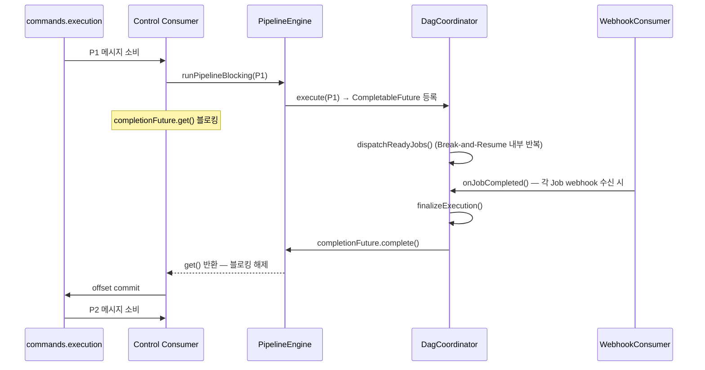
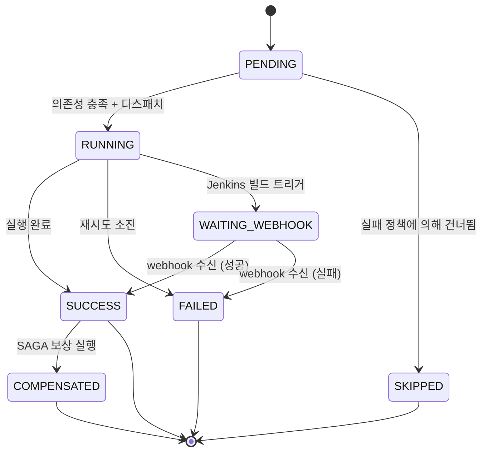
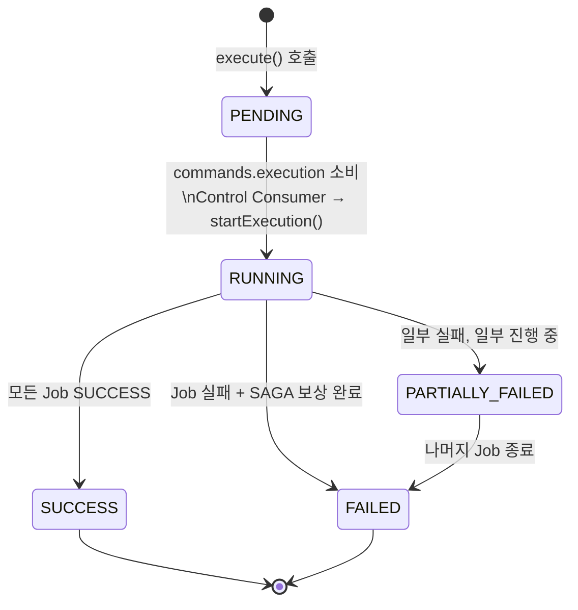
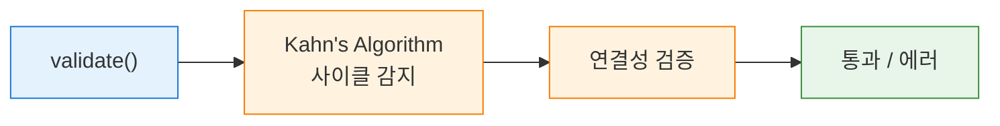
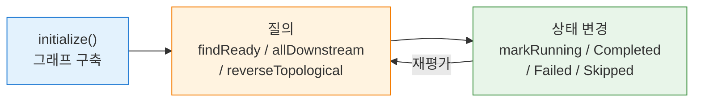
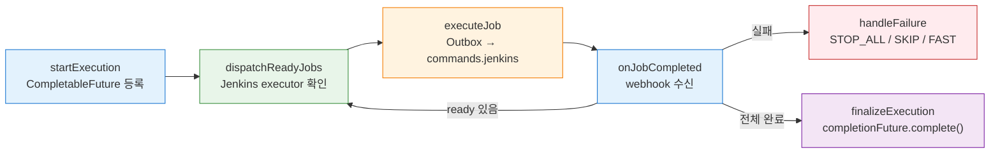
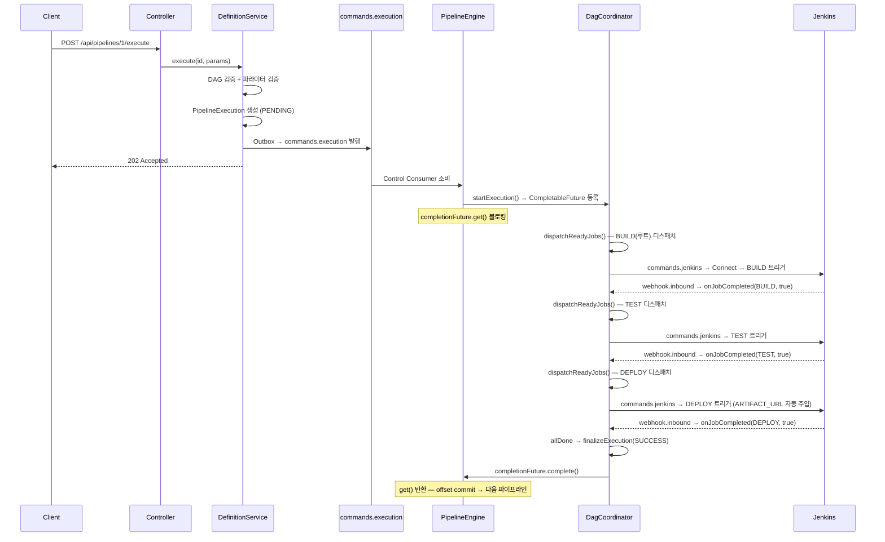
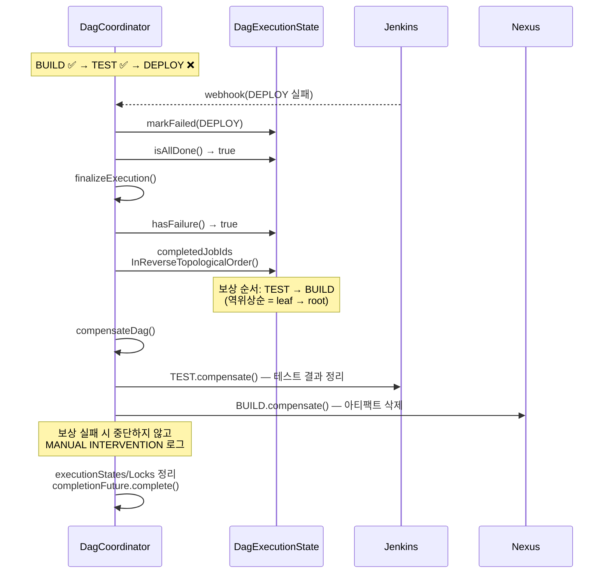

# DAG 엔진 아키텍처와 구현
---
> Redpanda Playground에 구현된 DAG 파이프라인 엔진의 설계와 전체 구현 코드를 담는다.
> 파라미터 시스템, 시각화, DB 모델은 04-02에서, 운영 심화는 04-03에서 다룬다.

## 1. 설계 전제

이 엔진의 설계를 관통하는 전제는 세 가지다. 세 전제 중 하나라도 빠지면 엔진의 구조가 근본적으로 달라지므로, 구현에 앞서 각각의 이유를 이해해야 한다.

**외부 Job은 비동기(Break-and-Resume)다.** Jenkins 빌드는 5분에서 30분까지 걸린다. HTTP 동기 요청-응답으로 감싸면 커넥션이 끊기거나 서버 스레드가 고갈되기 때문에, Job을 트리거한 뒤 스레드를 반환하고 완료 신호(webhook)가 올 때 재개하는 비동기 모델이 필수다.

**DAG 엔진은 상태 머신 + 스케줄러다.** 위상 정렬이나 그래프 탐색 알고리즘은 단순하다. 어려운 부분은 "이 Job이 지금 실행 가능한가?"를 판단하는 상태 전이 로직과, 여러 webhook 콜백이 동시에 도착할 때 상태 정합성을 유지하는 동시성 제어에 있다.

**DB가 진실의 원천이다.** MQ 메시지는 유실되거나 중복 전달될 수 있다. Job의 현재 상태를 MQ 메시지로 판단하면 고아 Job이나 중복 실행이 발생한다. 실제 상태는 반드시 DB를 조회해야 하며, 어떤 컴포넌트가 장애를 일으켜도 DB의 상태를 기준으로 복구할 수 있는 구조가 이 전제에서 비롯된다.

## 2. 아키텍처 개요

엔진은 **2-토픽 패턴**으로 동작한다. 파이프라인 간 순서 보장과 Job 간 병렬 실행이라는 두 요구사항을 토픽 하나로 동시에 풀기 어렵기 때문에, 역할이 다른 두 토픽으로 분리했다.

- `commands.execution` (1 파티션): 파이프라인 단위 Control 토픽이다. 파티션이 하나이므로 Consumer가 한 번에 메시지를 하나씩 처리하고, 처리가 끝날 때까지 다음 메시지를 소비하지 않는다. 이 블로킹 특성이 파이프라인 간 순서를 자연스럽게 보장한다.
- `commands.jenkins` (3 파티션): Job 단위 Task 토픽이다. 파티션이 여러 개이므로 같은 파이프라인 안의 독립 Job들이 병렬로 Jenkins에 전달된다.
- `webhook.inbound`: Jenkins가 빌드 완료를 Redpanda Connect를 통해 발행하는 토픽이다. `WebhookEventConsumer`가 소비하여 DAG를 재개한다.

### 2-A. 전체 흐름

```
API → Outbox → [commands.execution 1파티션] → Control Consumer (블로킹)
  → DagCoordinator → Outbox → [commands.jenkins 3파티션] → Connect → Jenkins
  → Jenkins webhook → [webhook.inbound] → WebhookConsumer → onJobCompleted
  → finalizeExecution → completionFuture.complete() → Consumer 언블로킹 → 다음 파이프라인
```



```mermaid
graph LR
    API["REST API"] --> OB1["Outbox\n(execution)"]
    OB1 --> CE["commands.execution\n1 파티션"]
    CE --> CC["Control Consumer\n블로킹 대기"]
    CC --> DC["DagCoordinator\nstartExecution()"]
    DC --> OB2["Outbox\n(jenkins)"]
    OB2 --> CJ["commands.jenkins\n3 파티션"]
    CJ --> CN["Redpanda Connect"]
    CN --> JK["Jenkins"]
    JK --> WH["POST /webhook/jenkins"]
    WH --> WI["webhook.inbound"]
    WI --> WC["WebhookConsumer\nonJobCompleted()"]
    WC --> FE["finalizeExecution()\ncompletionFuture.complete()"]
    FE --> CC

    style API fill:#E3F2FD,stroke:#1976D2,color:#333
    style OB1 fill:#FFF9C4,stroke:#F9A825,color:#333
    style CE fill:#E8F5E9,stroke:#388E3C,color:#333
    style CC fill:#E3F2FD,stroke:#1565C0,color:#333
    style DC fill:#E3F2FD,stroke:#1976D2,color:#333
    style OB2 fill:#FFF9C4,stroke:#F9A825,color:#333
    style CJ fill:#E8F5E9,stroke:#388E3C,color:#333
    style CN fill:#F3E5F5,stroke:#7B1FA2,color:#333
    style JK fill:#FFF3E0,stroke:#E65100,color:#333
    style WH fill:#FFF3E0,stroke:#E65100,color:#333
    style WI fill:#E8F5E9,stroke:#388E3C,color:#333
    style WC fill:#E3F2FD,stroke:#1976D2,color:#333
    style FE fill:#E8F5E9,stroke:#2E7D32,color:#333
```

### 2-B. Control Consumer 블로킹 시퀀스

Control Consumer는 `commands.execution`에서 메시지를 하나 꺼낸 뒤, `completionFuture.get()`으로 블로킹한다. `finalizeExecution()`이 `completionFuture.complete()`를 호출해야만 블로킹이 풀리고 다음 메시지를 소비한다. 이 구조 덕분에 파이프라인 P1이 완전히 끝나기 전에 P2가 시작되지 않는다.



### 2-C. 토픽 타임라인

3개 파이프라인(P1, P2, P3)이 각 3개 Job(J1→J2→J3 순차 의존)을 실행하는 타임라인이다. `commands.execution`은 P1 완료 후에야 P2를 소비하는 반면, `commands.jenkins`는 같은 파이프라인 내 독립 Job을 병렬로 전달한다.

```
[commands.execution]:  P1 ──────블로킹───────── P1완료 ── P2 ──────블로킹───────── P2완료 ── P3
[commands.jenkins]:    P1-J1 ·· P1-J2 ········ P1-J3 ···│···· P2-J1 ·· P2-J2 ·· P2-J3
[webhook.inbound]:     ···· P1-J1✓ ·· P1-J2✓ ··· P1-J3✓ │ P2-J1✓ ·· P2-J2✓ ·· P2-J3✓
```

### 2-1. Job 상태 전이도



### 2-2. 파이프라인 실행 상태 전이도



- PENDING → RUNNING 전이는 Kafka를 경유한다. API가 Outbox에 실행 커맨드를 기록하면, OutboxPoller가 `commands.execution`에 발행하고, Control Consumer가 소비하여 `startExecution()`을 호출하는 시점에 RUNNING으로 전환된다.
- PARTIALLY_FAILED는 병렬 DAG에서 발생한다. "A 브랜치는 실패, B 브랜치는 아직 실행 중"일 때 이 상태로 표시되어 운영자가 현재 상황을 정확히 파악할 수 있다.


## 3. Validation 계층 - DagValidator

> `DagValidator`는 실행 전에 DAG 구조의 유효성을 검증하는 컴포넌트다. 두 가지를 확인한다.
>
> 1. 그래프에 사이클이 없는지 Kahn's Algorithm으로 감지한다.
> 2. 그래프가 단절되지 않았는지 BFS로 연결성을 검증한다.

**Kahn's Algorithm은 BFS 기반 위상정렬 알고리즘**이다.

- 진입 차수가 0인 노드를 큐에 넣고 처리하는 것으로 시작한다. 노드를 꺼낼 때마다 후속 노드의 진입 차수를 1 감소시키고, 0이 된 노드를 다시 큐에 추가하는 과정을 반복한다.
- 모든 노드를 처리했는데도 큐에 들어가지 못한 노드가 남아 있으면 사이클이 존재한다는 의미다.
- 시간 복잡도는 O(V + E)이며, DFS 대신 Kahn's를 선택한 이유는 처리되지 않은 노드가 곧 사이클 참여 노드이므로 별도 로직 없이 사이클 구성 목록을 즉시 얻을 수 있기 때문이다.

연결성 검증은 양방향 인접 리스트를 구축하고 첫 번째 노드에서 BFS를 수행하여 모든 노드에 도달하는지 확인한다. 엣지가 하나도 없는 전체 병렬 실행 케이스는 연결성 검증을 건너뛴다. 이 케이스에서는 모든 Job이 독립적이므로 단절 여부가 무의미하기 때문이다.

### 3-1. 검증 흐름도



### 3-2. 전체 코드(DagValidator.java)

```java
/**
 * DAG(Directed Acyclic Graph) 유효성을 검증한다.
 *
 * <p>Kahn's algorithm으로 순환 탐지와 위상 정렬을 동시에 수행한다.
 * BFS 기반이므로 DFS보다 구현이 단순하고, 순환 발견 시 "어떤 노드가 순환에
 * 포함되었는지"를 남은 노드 집합으로 즉시 알 수 있다는 장점이 있다.</p>
 *
 * <p>연결성 검증도 함께 수행한다. 단절 그래프는 실행 순서가 모호하므로 거부한다.</p>
 */
@Component
public class DagValidator {

    /**
     * Job 목록의 DAG 유효성을 검증한다.
     *
     * @param jobs 검증할 Job 목록 (dependsOnJobIds가 로드된 상태)
     * @throws IllegalStateException DAG 조건(비순환, 연결성)을 위반할 때
     */
    public void validate(List<PipelineJob> jobs) {
        if (jobs == null || jobs.isEmpty()) {
            return;
        }
        runKahns(jobs);
    }

    /**
     * 위상 정렬 결과를 반환한다. validate()와 동일한 Kahn's algorithm을 사용하며
     * 정렬된 Job ID 리스트를 반환한다.
     *
     * @param jobs 위상 정렬할 Job 목록
     * @return 위상 정렬된 Job ID 리스트
     */
    public List<Long> topologicalSort(List<PipelineJob> jobs) {
        return runKahns(jobs);
    }

    /**
     * Kahn's algorithm을 실행하여 위상 정렬과 검증을 동시에 수행한다.
     *
     * @param jobs 검증 및 정렬할 Job 목록
     * @return 위상 정렬된 Job ID 리스트
     * @throws IllegalStateException DAG 조건(비순환, 연결성)을 위반할 때
     */
    private List<Long> runKahns(List<PipelineJob> jobs) {
        // Job ID → Job 매핑
        Map<Long, PipelineJob> jobMap = new HashMap<>();
        for (var job : jobs) {
            jobMap.put(job.getId(), job);
        }

        // 진입 차수(in-degree) 계산
        Map<Long, Integer> inDegree = new HashMap<>();
        Map<Long, List<Long>> adjacency = new HashMap<>(); // 후속 Job 목록

        for (var job : jobs) {
            inDegree.putIfAbsent(job.getId(), 0);
            adjacency.putIfAbsent(job.getId(), new ArrayList<>());
        }

        for (var job : jobs) {
            if (job.getDependsOnJobIds() != null) {
                for (Long depId : job.getDependsOnJobIds()) {
                    if (!jobMap.containsKey(depId)) {
                        throw new IllegalStateException(
                                "Job '%s'이 존재하지 않는 Job ID %d에 의존합니다"
                                        .formatted(job.getJobName(), depId));
                    }
                    adjacency.get(depId).add(job.getId());
                    inDegree.merge(job.getId(), 1, Integer::sum);
                }
            }
        }

        // Kahn's algorithm: BFS로 위상 정렬
        Queue<Long> queue = new LinkedList<>();
        for (var entry : inDegree.entrySet()) {
            if (entry.getValue() == 0) {
                queue.add(entry.getKey());
            }
        }

        if (queue.isEmpty()) {
            throw new IllegalStateException("루트 Job이 없습니다 (모든 Job이 의존성을 가짐 — 순환 의심)");
        }

        List<Long> sorted = new ArrayList<>();
        while (!queue.isEmpty()) {
            Long current = queue.poll();
            sorted.add(current);

            for (Long successor : adjacency.get(current)) {
                int newDegree = inDegree.get(successor) - 1;
                inDegree.put(successor, newDegree);
                if (newDegree == 0) {
                    queue.add(successor);
                }
            }
        }

        // 순환 탐지: 처리되지 않은 노드가 있으면 순환이 존재한다
        if (sorted.size() != jobs.size()) {
            List<String> cycleJobs = jobs.stream()
                    .filter(j -> inDegree.get(j.getId()) > 0)
                    .map(PipelineJob::getJobName)
                    .toList();
            throw new IllegalStateException(
                    "순환 의존성이 감지되었습니다: " + String.join(", ", cycleJobs));
        }

        // 연결성 검증: 루트에서 모든 노드에 도달 가능한지 BFS로 확인
        validateConnectivity(jobs, adjacency);

        return sorted;
    }

    private void validateConnectivity(
            List<PipelineJob> jobs
            , Map<Long, List<Long>> adjacency) {
        // 엣지가 없으면 전체 병렬 실행 — 연결성 검증 불필요
        boolean hasEdges = adjacency.values().stream().anyMatch(list -> !list.isEmpty());
        if (!hasEdges) {
            return;
        }

        // 양방향 인접 리스트 구축 (무방향 연결성 검사)
        Map<Long, Set<Long>> undirected = new HashMap<>();
        for (var job : jobs) {
            undirected.putIfAbsent(job.getId(), new HashSet<>());
        }
        for (var entry : adjacency.entrySet()) {
            for (Long successor : entry.getValue()) {
                undirected.get(entry.getKey()).add(successor);
                undirected.get(successor).add(entry.getKey());
            }
        }

        // BFS로 첫 번째 노드에서 도달 가능한 노드 수 확인
        Set<Long> visited = new HashSet<>();
        Queue<Long> bfs = new LinkedList<>();
        Long startNode = jobs.get(0).getId();
        bfs.add(startNode);
        visited.add(startNode);

        while (!bfs.isEmpty()) {
            Long current = bfs.poll();
            for (Long neighbor : undirected.get(current)) {
                if (visited.add(neighbor)) {
                    bfs.add(neighbor);
                }
            }
        }

        if (visited.size() != jobs.size()) {
            throw new IllegalStateException(
                    "단절된 그래프입니다: %d개 Job 중 %d개만 연결되어 있습니다"
                            .formatted(jobs.size(), visited.size()));
        }
    }
}
```


## 4. State 계층 - DagExecutionState

`DagExecutionState`는 **하나의 DAG 실행에 대한 그래프 구조와 런타임 상태를 관리**하는 클래스다.

- 불변 필드(jobs, dependencyGraph, successorGraph)와 가변 필드(completedJobIds, runningJobIds, failedJobIds, skippedJobIds)를 생성자 수준에서 분리한다.
- 불변 필드는 `Collections.unmodifiableMap`으로 감싸고, 가변 상태는 전용 메서드(`markCompleted`, `markRunning` 등)를 통해서만 변경할 수 있도록 제한하여 실수로 그래프 구조를 수정하는 일을 방지한다.

`initialize()` 정적 팩토리 메서드는 Job 목록을 2-pass로 순회하며 의존성 그래프와 후속 그래프를 동시에 구축한다.

- 첫 번째 루프에서 각 Job의 선행 의존성을 등록하고, 두 번째 루프에서 역방향을 구축하여 "누가 나를 필요로 하는가" 관계를 만든다.
- 2-pass로 분리한 이유는 의존성 그래프가 완성된 상태에서 역방향을 구축해야 정확성 검증이 쉽기 때문이다.

### 4-1. 상태 전이 흐름도



핵심 질의 메서드 세 가지가 엔진의 판단을 지탱한다.

1. `findReadyJobIds()`는 `containsAll` 기반으로 **모든 선행 의존성이 completedJobIds에 포함된 Job을 ready로 판정**한다.
2. `allDownstream()`은 BFS로 실패한 Job의 전이적 하류를 수집하여 **SKIP_DOWNSTREAM** 정책에서 사용된다.
3. `completedJobIdsInReverseTopologicalOrder()`는 SUCCESS 상태 Job들의 서브그래프에 Kahn's Algorithm을 적용하고 역순으로 뒤집어 SAGA 보상 순서를 결정한다.

### 4-2. 전체 코드

`DagExecutionState.java` (270줄):

```java
/**
 * DAG 실행의 런타임 상태를 추적한다.
 *
 * <p>실행당 하나의 인스턴스가 생성되며, 실행당 ReentrantLock이 상태 변경을 직렬화한다.
 * ConcurrentHashMap에 저장되므로 참조 교체 자체는 원자적이다.</p>
 *
 * <p>불변 필드(jobs, dependencyGraph 등)와 가변 필드(completedJobIds 등)를 명시적으로 분리한다.
 * 가변 상태 변경은 전용 메서드(markCompleted 등)를 통해서만 가능하고,
 * 외부에는 읽기 전용 뷰만 노출한다.</p>
 */
public class DagExecutionState {

    private final Map<Long, PipelineJob> jobs;
    private final Map<Long, Set<Long>> dependencyGraph;
    private final Map<Long, Set<Long>> successorGraph;
    private final Map<Long, Integer> jobIdToJobOrder;
    private final FailurePolicy failurePolicy;

    private final Set<Long> completedJobIds;
    private final Set<Long> runningJobIds;
    private final Set<Long> failedJobIds;
    private final Set<Long> skippedJobIds;

    private DagExecutionState(
            Map<Long, PipelineJob> jobs
            , Map<Long, Set<Long>> dependencyGraph
            , Map<Long, Set<Long>> successorGraph
            , Map<Long, Integer> jobIdToJobOrder
            , FailurePolicy failurePolicy) {
        this.jobs = jobs;
        this.dependencyGraph = dependencyGraph;
        this.successorGraph = successorGraph;
        this.jobIdToJobOrder = jobIdToJobOrder;
        this.failurePolicy = failurePolicy;
        this.completedJobIds = new HashSet<>();
        this.runningJobIds = new HashSet<>();
        this.failedJobIds = new HashSet<>();
        this.skippedJobIds = new HashSet<>();
    }

    /**
     * Job 목록으로부터 초기 실행 상태를 구성한다.
     *
     * @param jobList         실행할 Job 목록
     * @param jobIdToJobOrder Job ID → Job order 매핑
     * @return 초기 상태 (모든 Job이 미실행)
     */
    public static DagExecutionState initialize(
            List<PipelineJob> jobList
            , Map<Long, Integer> jobIdToJobOrder) {
        return initialize(jobList, jobIdToJobOrder, FailurePolicy.STOP_ALL);
    }

    /**
     * Job 목록과 실패 정책으로 초기 실행 상태를 구성한다.
     *
     * @param jobList         실행할 Job 목록
     * @param jobIdToJobOrder Job ID → Job order 매핑
     * @param failurePolicy   실패 시 적용할 정책
     * @return 초기 상태 (모든 Job이 미실행)
     */
    public static DagExecutionState initialize(
            List<PipelineJob> jobList
            , Map<Long, Integer> jobIdToJobOrder
            , FailurePolicy failurePolicy) {
        var jobs = new LinkedHashMap<Long, PipelineJob>();
        var deps = new HashMap<Long, Set<Long>>();
        var successors = new HashMap<Long, Set<Long>>();

        for (var job : jobList) {
            jobs.put(job.getId(), job);
            deps.put(job.getId(), job.getDependsOnJobIds() != null
                    ? new HashSet<>(job.getDependsOnJobIds())
                    : new HashSet<>());
            successors.put(job.getId(), new HashSet<>());
        }

        // 후속 그래프 구축
        for (var entry : deps.entrySet()) {
            for (Long depId : entry.getValue()) {
                successors.get(depId).add(entry.getKey());
            }
        }

        return new DagExecutionState(
                Collections.unmodifiableMap(jobs)
                , Collections.unmodifiableMap(deps)
                , Collections.unmodifiableMap(successors)
                , Collections.unmodifiableMap(jobIdToJobOrder)
                , failurePolicy != null ? failurePolicy : FailurePolicy.STOP_ALL
        );
    }

    // ── 상태 변경 메서드 ──────────────────────────────────────────────

    public void markCompleted(Long jobId) {
        completedJobIds.add(jobId);
    }

    public void markRunning(Long jobId) {
        runningJobIds.add(jobId);
    }

    public void markFailed(Long jobId) {
        failedJobIds.add(jobId);
    }

    public void markSkipped(Long jobId) {
        skippedJobIds.add(jobId);
    }

    public void removeRunning(Long jobId) {
        runningJobIds.remove(jobId);
    }

    // ── 읽기 전용 접근자 ──────────────────────────────────────────────

    public Map<Long, PipelineJob> jobs() {
        return jobs;
    }

    public Map<Long, Integer> jobIdToJobOrder() {
        return jobIdToJobOrder;
    }

    public FailurePolicy failurePolicy() {
        return failurePolicy;
    }

    /** 실행 중인 Job ID의 방어적 복사본을 반환한다. */
    public Set<Long> runningJobIds() {
        return Set.copyOf(runningJobIds);
    }

    /** 현재 실행 중인 Job 수를 반환한다. */
    public int runningCount() {
        return runningJobIds.size();
    }

    /**
     * 모든 의존성이 충족되어 실행 가능한 Job ID를 찾는다.
     * 이미 실행 중이거나 완료/실패/SKIP된 Job은 제외한다.
     *
     * @return 실행 가능한 Job ID 목록
     */
    public List<Long> findReadyJobIds() {
        var ready = new ArrayList<Long>();
        for (var entry : dependencyGraph.entrySet()) {
            Long jobId = entry.getKey();
            if (completedJobIds.contains(jobId)
                    || runningJobIds.contains(jobId)
                    || failedJobIds.contains(jobId)
                    || skippedJobIds.contains(jobId)) {
                continue;
            }
            // 모든 의존성이 완료되었는지 확인
            if (completedJobIds.containsAll(entry.getValue())) {
                ready.add(jobId);
            }
        }
        return ready;
    }

    /** 모든 Job이 종료 상태(성공/실패/SKIP)인지 확인한다. */
    public boolean isAllDone() {
        return completedJobIds.size() + failedJobIds.size() + skippedJobIds.size() == jobs.size();
    }

    /** 실패한 Job이 하나라도 있는지 확인한다. */
    public boolean hasFailure() {
        return !failedJobIds.isEmpty();
    }

    /** 실패한 Job 수를 반환한다. */
    public int failedCount() {
        return failedJobIds.size();
    }

    /** 실패한 Job ID의 방어적 복사본을 반환한다. */
    public Set<Long> failedJobIds() {
        return Set.copyOf(failedJobIds);
    }

    /** Job이 종료 상태(완료/실패/SKIP)인지 확인한다. */
    public boolean isTerminated(Long jobId) {
        return completedJobIds.contains(jobId)
                || failedJobIds.contains(jobId)
                || skippedJobIds.contains(jobId);
    }

    /**
     * 실패한 Job의 전이적 하위(transitive downstream) Job ID를 BFS로 수집한다.
     * SKIP_DOWNSTREAM 정책에서 사용한다.
     *
     * <p>이미 RUNNING 상태인 Job은 제외한다. 실행 중인 Job은 완료 후
     * onJobCompleted에서 재평가된다.</p>
     *
     * @param failedJobId 실패한 Job ID
     * @return 전이적 하위 Job ID 집합 (실패한 Job 자신은 포함하지 않음)
     */
    public Set<Long> allDownstream(Long failedJobId) {
        var downstream = new LinkedHashSet<Long>();
        var queue = new LinkedList<Long>();
        queue.add(failedJobId);

        while (!queue.isEmpty()) {
            Long current = queue.poll();
            Set<Long> succs = successorGraph.getOrDefault(current, Set.of());
            for (Long succ : succs) {
                if (!downstream.contains(succ) && !runningJobIds.contains(succ)) {
                    downstream.add(succ);
                    queue.add(succ);
                }
            }
        }
        return downstream;
    }

    /** 역방향 위상 순서로 완료된 Job ID를 반환한다 (SAGA 보상용). */
    public List<Long> completedJobIdsInReverseTopologicalOrder() {
        // BFS로 위상 정렬 후 역순
        var inDegree = new HashMap<Long, Integer>();
        for (Long jobId : completedJobIds) {
            inDegree.put(jobId, 0);
        }
        for (Long jobId : completedJobIds) {
            Set<Long> succs = successorGraph.getOrDefault(jobId, Set.of());
            for (Long succ : succs) {
                if (completedJobIds.contains(succ)) {
                    inDegree.merge(succ, 1, Integer::sum);
                }
            }
        }

        var queue = new LinkedList<Long>();
        for (var entry : inDegree.entrySet()) {
            if (entry.getValue() == 0) {
                queue.add(entry.getKey());
            }
        }

        var sorted = new ArrayList<Long>();
        while (!queue.isEmpty()) {
            Long current = queue.poll();
            sorted.add(current);
            Set<Long> succs = successorGraph.getOrDefault(current, Set.of());
            for (Long succ : succs) {
                if (completedJobIds.contains(succ)) {
                    int newDeg = inDegree.get(succ) - 1;
                    inDegree.put(succ, newDeg);
                    if (newDeg == 0) {
                        queue.add(succ);
                    }
                }
            }
        }

        // 역순으로 반환 (leaf → root)
        Collections.reverse(sorted);
        return sorted;
    }
}
```


## 5. Orchestration 계층 - DagExecutionCoordinator

> `DagExecutionCoordinator`는 DAG 실행의 전체 생명주기를 조율하는 컴포넌트다.
>
> - 핵심 흐름은 `startExecution` → `dispatchReadyJobs` → `executeJob` → `onJobCompleted` → `dispatchReadyJobs` → ... → `finalizeExecution` 순서로 진행된다.
> - Validation과 State 계층에 검증과 상태 관리를 위임하고, 이 계층은 외부 시스템(Jenkins, DB, MQ)과의 통합 및 오케스트레이션에 집중한다.

**2-토픽 패턴과 CompletableFuture로 파이프라인 순서를 제어한다.**

`startExecution()`은 `CompletableFuture<Void>`를 생성하여 `executionCompletions` 맵에 등록하고 반환한다. Control Consumer(`PipelineEventConsumer`)는 이 Future에 `get()`을 호출하여 블로킹한다. `finalizeExecution()`이 `completionFuture.complete(null)`을 호출해야만 블로킹이 풀리고 다음 파이프라인 메시지가 소비된다. 기존의 `executionOrder` 큐와 `retryBlockedExecutions()` 스케줄러는 이 구조로 대체되어 제거됐다.

**dispatchReadyJobs()는 Jenkins executor 가용량을 먼저 확인한다.**

`jenkinsAdapter.getAvailableExecutors()`로 Jenkins가 현재 받을 수 있는 빌드 슬롯 수를 조회한다. Jenkins가 -1을 반환하면(K8s Dynamic Agent이거나 연결 실패) per-execution 슬롯 수(`props.maxConcurrentJobs()`)로 폴백한다. 이 방식을 택한 이유는 Jenkins의 실제 부하를 반영하지 않으면 큐가 넘쳐 빌드 요청이 거부되는 상황이 발생하기 때문이다.

**동시성 모델은 Per-execution ReentrantLock이다.**

실행(Execution) 단위로 독립된 Lock을 할당하여, 서로 다른 파이프라인 실행은 간섭 없이 병렬 처리되고, 같은 실행 내에서만 상태 전이가 직렬화된다. `dispatchReadyJobs()`는 `startExecution()`(이미 Lock 보유)에서도, `onJobCompleted()`에서도 호출될 수 있으므로, `needsLock` 패턴으로 재진입 시 불필요한 lock/unlock을 방지한다.

**실패 정책은 3종이다.**

- **STOP_ALL**: 새 디스패치를 중단하고 RUNNING Job 완료를 기다린 뒤 SAGA 보상을 실행한다.
- **SKIP_DOWNSTREAM**: 실패한 Job의 전이적 하류만 SKIP하고 독립 브랜치는 계속 실행한다.
- **FAIL_FAST**: 모든 PENDING Job을 즉시 SKIP하고 RUNNING 완료를 기다린다.

**Break-and-Resume 패턴으로 Jenkins와 통합한다.**

`executeJob()`에서 타입별 실행기를 호출한 뒤, webhook 대기(스레드 반환), 동기 완료, 재시도(지수 백오프) 세 갈래로 분기한다. Jenkins 빌드의 경우 WAITING_WEBHOOK으로 마킹하고 `return`하여 스레드를 풀로 반환한다. webhook이 도착하면 `onJobCompleted()`에서 DAG를 재개한다.

**SAGA 보상은 역위상순으로 수행한다.**

`finalizeExecution()`에서 실패가 확정되면, `completedJobIdsInReverseTopologicalOrder()`로 보상 순서를 결정하고 `compensateDag()`가 각 Job의 보상을 실행한다. 보상 실패 시 전체 체인을 중단하지 않고 다음 Job의 보상을 계속 시도하며, "MANUAL INTERVENTION REQUIRED" 로그를 남겨 운영자에게 위임한다.

**크래시 복구는 `@PostConstruct`로, Stale 정리는 `@Scheduled`로 수행한다.** 앱 재시작 시 `recoverRunningExecutions()`가 DB의 RUNNING 실행을 조회하여 상태를 재구성한다. RUNNING/WAITING_WEBHOOK 상태의 Job은 webhook 유실을 가정하고 FAILED로 전환하는 보수적 접근을 취한다. `cleanupStaleExecutions()`는 5분마다 실행되며 타임아웃 초과 실행을 FAILED 처리한다.

### 5-1. 실행 생명주기 흐름도



### 5-1b. dispatch → Jenkins 커맨드 흐름

`dispatchReadyJobs()`가 ready Job을 발견하면 Outbox에 커맨드를 기록한다. Outbox는 트랜잭션 보장을 위해 DB에 INSERT되고, OutboxPoller(500ms 주기)가 `commands.jenkins`에 발행한다. Redpanda Connect가 소비하여 Jenkins `buildWithParameters` API를 호출한다.

```
DagCoordinator.dispatchReadyJobs()
  → jenkinsAdapter.getAvailableExecutors() (정상: executor 기반 / 폴백: per-execution)
  → Outbox INSERT {P1-J1 커맨드}
    → OutboxPoller (500ms)
      → [commands.jenkins] publish
        → Redpanda Connect consume
          → Jenkins POST /buildWithParameters
```

### 5-1c. webhook → 재디스패치 흐름

Jenkins 빌드가 완료되면 Redpanda Connect의 단일 포트(4195)로 webhook이 들어온다. Connect가 `webhook.inbound`에 발행하고, `WebhookEventConsumer`가 소비하여 `onJobCompleted()`를 호출한다. 이후 ready Job이 있으면 `dispatchReadyJobs()`로 DAG를 재개하고, 마지막 Job이라면 `finalizeExecution()`으로 파이프라인을 종료한다.

```
Jenkins 빌드 완료
  → POST /webhook/jenkins (Connect :4195)
    → [webhook.inbound] produce
      → WebhookEventConsumer consume
        → onJobCompleted()
          → dispatchReadyJobs() (다음 Job 있을 때)
          → 또는 finalizeExecution() → completionFuture.complete()
```

### 5-1d. BUILD → TEST → DEPLOY 파이프라인 예시

`POST /api/pipelines/1/execute`로 실행을 요청하면 다음과 같이 흐른다.

**정상 흐름:**



**SAGA 보상 흐름 (DEPLOY 실패 시):**



### 5-2. 시나리오 시뮬레이션

파이프라인 3개(P1, P2, P3), 각 3개 Job(J1→J2→J3 순차 의존), Jenkins executor 2슬롯인 상황이다. `commands.execution`이 1파티션이므로 P1이 끝나야 P2가 시작된다. 각 파이프라인 내에서는 J1→J2→J3이 순차 진행되므로 병렬 효과는 파이프라인 간이 아니라 파이프라인 내 독립 Job들 사이에서 나타난다.

**Step 1: P1 시작**

```
[commands.execution]:  [P1] ← 소비 중 (블로킹)
[commands.jenkins]:    (비어 있음)
[webhook.inbound]:     (비어 있음)

Control Consumer: completionFuture.get() 블로킹
DagCoordinator.startExecution(P1)
  → dispatchReadyJobs(): J1 ready (루트, 의존성 없음)
  → getAvailableExecutors() → 2슬롯
  → Outbox INSERT {P1-J1 커맨드}
```

**Step 2: P1-J1 Jenkins 실행 중**

```
[commands.execution]:  [P1] ← 블로킹 유지
[commands.jenkins]:    [P1-J1 커맨드] ← Connect 소비 → Jenkins POST
[webhook.inbound]:     (비어 있음)

P1-J1: WAITING_WEBHOOK 상태
```

**Step 3: P1-J1 완료 → J2 디스패치**

```
[commands.execution]:  [P1] ← 블로킹 유지
[commands.jenkins]:    [P1-J2 커맨드] ← Connect 소비 → Jenkins POST
[webhook.inbound]:     [P1-J1 완료] ← WebhookConsumer 소비

onJobCompleted(P1, J1, success=true)
  → markCompleted(J1)
  → dispatchReadyJobs(): J2 ready (J1 완료)
  → Outbox INSERT {P1-J2 커맨드}
```

**Step 4: P1-J2 완료 → J3 디스패치**

```
[commands.execution]:  [P1] ← 블로킹 유지
[commands.jenkins]:    [P1-J3 커맨드]
[webhook.inbound]:     [P1-J2 완료]

onJobCompleted(P1, J2, success=true)
  → dispatchReadyJobs(): J3 ready
  → Outbox INSERT {P1-J3 커맨드}
```

**Step 5: P1-J3 완료 → P1 종료 → P2 시작**

```
[commands.execution]:  [P1 완료] → offset commit → [P2] ← 소비 시작
[commands.jenkins]:    (비어 있음)
[webhook.inbound]:     [P1-J3 완료]

onJobCompleted(P1, J3, success=true)
  → isAllDone() → true
  → finalizeExecution(SUCCESS)
  → completionFuture.complete()   ← Control Consumer 언블로킹
  → executionStates/Locks 정리

Control Consumer: get() 반환 → offset commit → P2 소비 → 동일 흐름 반복
```

**핵심 관찰:** P2는 P1의 `completionFuture.complete()` 이후에야 소비된다. Jenkins executor가 2슬롯이더라도 Control Consumer의 블로킹 구조 덕분에 P1과 P2의 Job이 동시에 실행되지 않는다. 같은 파이프라인 내 독립 브랜치(예: J2a와 J2b가 모두 J1에만 의존하는 경우)는 `dispatchReadyJobs()` 한 번의 호출로 동시에 디스패치되어 병렬 실행된다.

### 5-3. 전체 코드

`DagExecutionCoordinator.java`:

```java
/**
 * DAG 기반 파이프라인 실행을 조율한다.
 *
 * <p>핵심 흐름: startExecution → dispatchReadyJobs → (webhook/동기 완료) →
 * onJobCompleted → dispatchReadyJobs → ... → 전체 완료/실패 판정.</p>
 *
 * <p>동시성 모델: 실행당 {@link ReentrantLock}으로 상태 변경과 디스패치를 직렬화한다.
 * 같은 실행의 웹훅 콜백이 동시에 도착해도 check-and-dispatch가 순서대로 처리된다.
 * 실행 간에는 독립적이므로 서로 블로킹하지 않는다.</p>
 *
 * <p>파이프라인 간 순서는 2-토픽 패턴으로 제어한다. startExecution()이 반환하는
 * CompletableFuture를 Control Consumer가 get()으로 블로킹하고, finalizeExecution()이
 * complete()를 호출하면 다음 파이프라인 메시지가 소비된다.</p>
 *
 * <p>메모리 상태(executionStates)는 캐시 역할만 하고, DB가 진실의 원천이다.
 * 앱 재시작 시 RUNNING 상태 실행을 DB에서 조회하여 상태를 복원한다.</p>
 */
@Slf4j
@Component
@RequiredArgsConstructor
public class DagExecutionCoordinator {

    private final PipelineExecutionMapper executionMapper;
    private final PipelineJobExecutionMapper jobExecutionMapper;
    private final PipelineJobMapper jobMapper;
    private final JobMapper singleJobMapper;
    private final PipelineDefinitionMapper definitionMapper;
    private final PipelineEventProducer eventProducer;
    private final DagEventProducer dagEventProducer;
    private final SagaCompensator sagaCompensator;
    private final JobExecutorRegistry jobExecutorRegistry;
    private final JenkinsAdapter jenkinsAdapter;
    private final DagValidator dagValidator;
    @Qualifier("jobExecutorPool")
    private final ExecutorService jobExecutorPool;
    @Qualifier("retryScheduler")
    private final ScheduledExecutorService retryScheduler;
    private final PipelineProperties props;

    /** 실행 ID → 런타임 상태. 실행 시작 시 등록, 완료 시 제거. */
    private final ConcurrentHashMap<UUID, DagExecutionState> executionStates = new ConcurrentHashMap<>();

    /** 실행 ID → Lock. 동일 실행의 상태 변경을 직렬화한다. */
    private final ConcurrentHashMap<UUID, ReentrantLock> executionLocks = new ConcurrentHashMap<>();

    /**
     * 실행 ID → CompletableFuture. Control Consumer가 get()으로 블로킹하고,
     * finalizeExecution()이 complete()로 언블로킹한다.
     */
    private final ConcurrentHashMap<UUID, CompletableFuture<Void>> executionCompletions = new ConcurrentHashMap<>();

    // ── Feature #1: 크래시 복구 ────────────────────────────────────────

    /**
     * 앱 재시작 시 DB의 RUNNING 실행을 자동 재개한다.
     *
     * <p>RUNNING/WAITING_WEBHOOK 상태의 job은 webhook 유실을 가정하고 FAILED로 전환한다.
     * 이후 ready job이 있으면 재dispatch한다. 보수적 접근 — 필요 시 부분 재시작 API로 재개 가능.</p>
     */
    @PostConstruct
    public void recoverRunningExecutions() {
        var runningExecutions = executionMapper.findByStatus(PipelineStatus.RUNNING.name());

        for (var execution : runningExecutions) {
            // DAG 모드만 처리 (pipelineDefinitionId가 null이면 기존 순차 모드)
            if (execution.getPipelineDefinitionId() == null) {
                continue;
            }

            var executionId = execution.getId();
            log.info("[DAG-RECOVERY] Recovering execution: {}", executionId);

            try {
                // Job 목록 + 의존성 로드
                var jobs = jobMapper.findByDefinitionId(execution.getPipelineDefinitionId());
                for (var job : jobs) {
                    job.setDependsOnJobIds(jobMapper.findDependsOnJobIds(
                            execution.getPipelineDefinitionId(), job.getId()));
                }

                // JobExecution 로드
                var jobExecutions = jobExecutionMapper.findByExecutionId(executionId);
                var jobIdToJobOrder = new HashMap<Long, Integer>();
                for (var je : jobExecutions) {
                    if (je.getJobId() != null) {
                        jobIdToJobOrder.put(je.getJobId(), je.getJobOrder());
                    }
                }

                // failurePolicy 로드
                var policy = FailurePolicy.STOP_ALL;
                var definition = definitionMapper.findById(execution.getPipelineDefinitionId());
                if (definition != null && definition.getFailurePolicy() != null) {
                    policy = definition.getFailurePolicy();
                }

                // 상태 재구성
                var lock = new ReentrantLock();
                executionLocks.put(executionId, lock);
                lock.lock();
                try {
                    var state = DagExecutionState.initialize(jobs, jobIdToJobOrder, policy);
                    executionStates.put(executionId, state);

                    // 기존 job execution 상태를 state에 반영
                    for (var je : jobExecutions) {
                        if (je.getJobId() == null) continue;

                        switch (je.getStatus()) {
                            case SUCCESS -> state.markCompleted(je.getJobId());
                            case FAILED, COMPENSATED -> state.markFailed(je.getJobId());
                            case SKIPPED -> state.markSkipped(je.getJobId());
                            case RUNNING, WAITING_WEBHOOK -> {
                                // webhook 유실 가정 → FAILED 처리
                                log.warn("[DAG-RECOVERY] Marking interrupted job as FAILED: jobId={}, status={}",
                                        je.getJobId(), je.getStatus());
                                jobExecutionMapper.updateStatus(je.getId()
                                        , JobExecutionStatus.FAILED.name()
                                        , "Failed during crash recovery (interrupted)"
                                        , LocalDateTime.now());
                                state.markFailed(je.getJobId());
                            }
                            case PENDING -> { /* 그대로 둠 */ }
                        }
                    }

                    // 전체 완료 체크
                    if (state.isAllDone()) {
                        finalizeExecution(executionId, state);
                    } else if (state.hasFailure()) {
                        handleFailure(executionId, state, execution);
                    } else {
                        dispatchReadyJobs(execution);
                    }
                } finally {
                    lock.unlock();
                }

                log.info("[DAG-RECOVERY] Execution recovered: {}", executionId);
            } catch (Exception e) {
                log.error("[DAG-RECOVERY] Failed to recover execution: {}", executionId, e);
                executionMapper.updateStatus(executionId, PipelineStatus.FAILED.name()
                        , LocalDateTime.now(), "Recovery failed: " + e.getMessage());
            }
        }

        if (!runningExecutions.isEmpty()) {
            log.info("[DAG-RECOVERY] Recovered {} DAG execution(s)", runningExecutions.size());
        }
    }

    // ── 실행 시작 ──────────────────────────────────────────────────────

    /**
     * DAG 실행을 시작한다. 루트 Job(의존성 없는 Job)부터 디스패치하고,
     * Control Consumer가 블로킹할 CompletableFuture를 등록하여 반환한다.
     *
     * @param execution 실행 정보 (pipelineDefinitionId가 non-null이어야 한다)
     * @return 파이프라인 완료 시 complete()가 호출될 Future
     */
    public CompletableFuture<Void> startExecution(PipelineExecution execution) {
        var executionId = execution.getId();
        log.info("[DAG] Starting DAG execution: {}", executionId);

        // Control Consumer가 블로킹할 Future 등록
        var completionFuture = new CompletableFuture<Void>();
        executionCompletions.put(executionId, completionFuture);

        // 실행 상태를 RUNNING으로 전환
        executionMapper.updateStatus(
                executionId
                , PipelineStatus.RUNNING.name()
                , null
                , null);

        // Job 목록 로드 + 의존성 로드
        var jobs = jobMapper.findByDefinitionId(execution.getPipelineDefinitionId());
        for (var job : jobs) {
            job.setDependsOnJobIds(jobMapper.findDependsOnJobIds(execution.getPipelineDefinitionId(), job.getId()));
        }

        // DAG 검증
        dagValidator.validate(jobs);

        // JobExecution 목록 로드 → Job ID ↔ Job order 매핑 구축
        var jobExecutions = jobExecutionMapper.findByExecutionId(executionId);
        var jobIdToJobOrder = new HashMap<Long, Integer>();
        for (var je : jobExecutions) {
            if (je.getJobId() != null) {
                jobIdToJobOrder.put(je.getJobId(), je.getJobOrder());
            }
        }

        // failurePolicy 로드
        var policy = FailurePolicy.STOP_ALL;
        var definition = definitionMapper.findById(execution.getPipelineDefinitionId());
        if (definition != null && definition.getFailurePolicy() != null) {
            policy = definition.getFailurePolicy();
        }

        // 초기 상태 구성 — lock을 먼저 등록하고 lock 안에서 state 초기화 + 디스패치
        var lock = new ReentrantLock();
        executionLocks.put(executionId, lock);
        lock.lock();
        try {
            var state = DagExecutionState.initialize(jobs, jobIdToJobOrder, policy);
            executionStates.put(executionId, state);

            // 부분 재시작: 이미 SUCCESS인 job을 완료로 사전 등록
            for (var je : jobExecutions) {
                if (je.getJobId() != null && je.getStatus() == JobExecutionStatus.SUCCESS) {
                    state.markCompleted(je.getJobId());
                    log.info("[DAG] Pre-registered completed job from previous run: jobId={}", je.getJobId());
                }
            }

            // 루트 Job 디스패치
            dispatchReadyJobs(execution);
        } finally {
            lock.unlock();
        }

        return completionFuture;
    }

    // ── Job 완료 처리 ──────────────────────────────────────────────────

    /**
     * Job 완료 시 호출된다. 웹훅 콜백 또는 동기 실행 완료 후 호출.
     *
     * @param executionId 실행 ID
     * @param jobOrder    완료된 Job 순서
     * @param jobId       완료된 Job ID
     * @param success     성공 여부
     */
    public void onJobCompleted(UUID executionId, int jobOrder, Long jobId, boolean success) {
        var lock = executionLocks.get(executionId);
        if (lock == null) {
            log.warn("[DAG] No lock found for execution: {}", executionId);
            return;
        }

        lock.lock();
        try {
            var state = executionStates.get(executionId);
            if (state == null) {
                log.warn("[DAG] No state found for execution: {}", executionId);
                return;
            }

            // 상태 업데이트
            state.removeRunning(jobId);
            if (success) {
                state.markCompleted(jobId);
                log.info("[DAG] Job completed successfully: jobId={}, execution={}", jobId, executionId);

                // BUILD Job 완료 시 configJson의 GAV로 Nexus URL을 구성하여 contextJson에 저장
                var completedJob = state.jobs().get(jobId);
                if (completedJob != null && completedJob.getJobType() == PipelineJobType.BUILD) {
                    saveArtifactUrlToContext(executionId, completedJob);
                }
            } else {
                state.markFailed(jobId);
                log.warn("[DAG] Job failed: jobId={}, execution={}", jobId, executionId);
            }

            // DAG Job 완료 이벤트 발행
            publishDagJobCompletedEvent(executionId, jobId, jobOrder, state, success);

            // 전체 완료 체크
            if (state.isAllDone()) {
                finalizeExecution(executionId, state);
                return;
            }

            // 실패 처리
            if (!success) {
                var execution = executionMapper.findById(executionId);
                if (execution != null) {
                    handleFailure(executionId, state, execution);
                }
                return;
            }

            // 성공이지만 기존 실패가 있으면 정책에 따라 분기
            if (state.hasFailure()) {
                var execution = executionMapper.findById(executionId);
                if (execution != null) {
                    handleFailure(executionId, state, execution);
                }
                return;
            }

            // 새로 ready된 Job 디스패치
            var execution = executionMapper.findById(executionId);
            if (execution != null) {
                dispatchReadyJobs(execution);
            }
        } finally {
            lock.unlock();
        }
    }

    /**
     * 웹훅 타임아웃 시 호출된다.
     */
    public void onJobFailed(UUID executionId, int jobOrder, Long jobId) {
        onJobCompleted(executionId, jobOrder, jobId, false);
    }

    /**
     * 특정 실행이 DAG 모드인지 확인한다.
     */
    public boolean isManaged(UUID executionId) {
        return executionStates.containsKey(executionId);
    }

    /**
     * jobOrder로 jobId를 역참조한다.
     */
    public Long findJobIdByJobOrder(UUID executionId, int jobOrder) {
        var state = executionStates.get(executionId);
        if (state == null) return null;
        for (var entry : state.jobIdToJobOrder().entrySet()) {
            if (entry.getValue() == jobOrder) {
                return entry.getKey();
            }
        }
        return null;
    }

    // ── Feature #4: Stale 실행 정리 강화 ───────────────────────────────

    /**
     * 완료된 실행 상태를 정리하고, staleExecutionTimeoutMinutes 초과 RUNNING 실행을 FAILED 처리한다.
     */
    @Scheduled(fixedDelay = 300_000) // 5분
    public void cleanupStaleExecutions() {
        // 1) 메모리에서 이미 완료된 상태 정리
        var staleIds = new ArrayList<UUID>();
        for (var entry : executionStates.entrySet()) {
            if (entry.getValue().isAllDone()) {
                staleIds.add(entry.getKey());
            }
        }
        for (var id : staleIds) {
            executionStates.remove(id);
            executionLocks.remove(id);
            executionCompletions.remove(id);
            log.info("[DAG] Cleaned up completed execution state: {}", id);
        }

        // 2) DB에서 staleExecutionTimeoutMinutes 초과 RUNNING 실행 FAILED 처리
        var runningExecutions = executionMapper.findByStatus(PipelineStatus.RUNNING.name());
        for (var execution : runningExecutions) {
            if (execution.getStartedAt() == null) continue;

            long minutesElapsed = Duration.between(execution.getStartedAt(), LocalDateTime.now()).toMinutes();
            if (minutesElapsed > props.staleExecutionTimeoutMinutes()) {
                var executionId = execution.getId();
                log.warn("[DAG] Stale execution detected ({}min > {}min limit): {}",
                        minutesElapsed, props.staleExecutionTimeoutMinutes(), executionId);

                // 비종료 job을 FAILED 마킹
                var jobExecutions = jobExecutionMapper.findByExecutionId(executionId);
                for (var je : jobExecutions) {
                    if (je.getStatus() == JobExecutionStatus.PENDING
                            || je.getStatus() == JobExecutionStatus.RUNNING
                            || je.getStatus() == JobExecutionStatus.WAITING_WEBHOOK) {
                        jobExecutionMapper.updateStatus(je.getId()
                                , JobExecutionStatus.FAILED.name()
                                , "Stale execution timeout (%dmin)".formatted(minutesElapsed)
                                , LocalDateTime.now());
                    }
                }

                executionMapper.updateStatus(executionId, PipelineStatus.FAILED.name()
                        , LocalDateTime.now()
                        , "Stale execution timeout after %d minutes".formatted(minutesElapsed));

                // 메모리 상태 정리
                executionStates.remove(executionId);
                executionLocks.remove(executionId);
                // CompletableFuture가 남아 있으면 예외로 완료하여 Control Consumer를 언블로킹한다
                var stuckFuture = executionCompletions.remove(executionId);
                if (stuckFuture != null) {
                    stuckFuture.completeExceptionally(
                            new IllegalStateException("Stale execution timeout after %d minutes".formatted(minutesElapsed)));
                }
            }
        }
    }

    // ── PipelineEventConsumer 진입점 ──────────────────────────────────

    /**
     * Control Consumer(PipelineEventConsumer)가 호출하는 블로킹 실행 메서드.
     * completionFuture.get()으로 블로킹하여 파이프라인 완료 전까지 다음 메시지를 소비하지 않는다.
     *
     * @param execution  실행 정보
     * @param executionId 실행 ID
     */
    public void runPipelineBlocking(PipelineExecution execution, UUID executionId) {
        try {
            var completionFuture = startExecution(execution);
            completionFuture.get(); // 파이프라인 완료까지 블로킹
        } catch (Exception e) {
            log.error("Pipeline execution failed: executionId={}", executionId, e);
        }
    }

    // ── private helpers ──────────────────────────────────────────────

    private void dispatchReadyJobs(PipelineExecution execution) {
        var executionId = execution.getId();
        var lock = executionLocks.get(executionId);

        // 이미 lock을 들고 있을 수 있으므로 조건 분기
        boolean needsLock = !lock.isHeldByCurrentThread();
        if (needsLock) lock.lock();

        try {
            var state = executionStates.get(executionId);
            if (state == null) return;

            var readyJobIds = state.findReadyJobIds();
            if (readyJobIds.isEmpty()) return;

            // Jenkins executor 가용량 확인.
            // getAvailableExecutors()가 -1을 반환하면 K8s Dynamic Agent이거나 연결 실패이므로
            // per-execution 슬롯 수(maxConcurrentJobs)로 폴백한다.
            int jenkinsAvailable = jenkinsAdapter.getAvailableExecutors();
            int available = jenkinsAvailable >= 0
                    ? Math.min(jenkinsAvailable, props.maxConcurrentJobs() - state.runningCount())
                    : props.maxConcurrentJobs() - state.runningCount();

            if (available <= 0) {
                log.info("[DAG] No available slots (jenkins={}, running={}/{}), waiting for completion",
                        jenkinsAvailable, state.runningCount(), props.maxConcurrentJobs());
                return;
            }

            var toDispatch = readyJobIds.subList(0, Math.min(readyJobIds.size(), available));

            for (Long jobId : toDispatch) {
                state.markRunning(jobId);
                var job = state.jobs().get(jobId);
                var jobOrder = state.jobIdToJobOrder().get(jobId);

                log.info("[DAG] Dispatching job: {} (type={}, jobOrder={}, execution={})",
                        job.getJobName(), job.getJobType(), jobOrder, executionId);

                // DAG Job 디스패치 이벤트 발행
                dagEventProducer.publishDagJobDispatched(
                        executionId.toString(), jobId, job.getJobName()
                        , job.getJobType().name(), jobOrder);

                jobExecutorPool.submit(() -> executeJob(execution, job, jobOrder));
            }
        } finally {
            if (needsLock) lock.unlock();
        }
    }

    private void executeJob(PipelineExecution execution, PipelineJob job, Integer jobOrder) {
        var executionId = execution.getId();
        var je = jobExecutionMapper.findByExecutionIdAndJobOrder(executionId, jobOrder);
        if (je == null) {
            log.error("[DAG] JobExecution not found: execution={}, jobOrder={}", executionId, jobOrder);
            onJobCompleted(executionId, jobOrder, job.getId(), false);
            return;
        }

        // 사용자 파라미터를 jobExecution에 전달 (Step Executor가 참조)
        var userParams = execution.parameters();
        if (!userParams.isEmpty()) {
            je.setUserParams(userParams);
        }

        // 실행 컨텍스트 전달 (이전 Job의 출력물을 다음 Job이 참조)
        var execContext = execution.context();

        // DEPLOY Job이 BUILD Job에 의존하면, 해당 빌드의 ARTIFACT_URL을 자동 주입
        if (job.getJobType() == PipelineJobType.DEPLOY && !execContext.isEmpty()) {
            var deps = job.getDependsOnJobIds();
            if (deps != null) {
                var state = executionStates.get(executionId);
                for (var depId : deps) {
                    var depJob = state != null ? state.jobs().get(depId) : null;
                    if (depJob != null && depJob.getJobType() == PipelineJobType.BUILD) {
                        var depArtifactUrl = execContext.get("ARTIFACT_URL_" + depId);
                        if (depArtifactUrl != null) {
                            execContext.put("ARTIFACT_URL", depArtifactUrl);
                            log.debug("[DAG] DEPLOY Job {} ← BUILD Job {}의 ARTIFACT_URL 자동 주입", job.getId(), depId);
                            // 첫 번째 BUILD 의존성의 아티팩트만 사용. 다중 BUILD→단일 DEPLOY 시 확장 필요.
                            break;
                        }
                    }
                }
            }
        }

        if (!execContext.isEmpty()) {
            je.setExecutionContext(execContext);
        }

        // Job configJson의 ${PARAM} 플레이스홀더를 사용자 파라미터 + 실행 컨텍스트로 치환
        var configJson = job.getConfigJson();
        if (configJson != null) {
            // 컨텍스트 + 사용자 파라미터를 병합 (사용자 파라미터가 우선)
            var mergedParams = new java.util.HashMap<>(execContext);
            mergedParams.putAll(userParams);
            if (!mergedParams.isEmpty()) {
                je.setResolvedConfigJson(ParameterResolver.resolve(configJson, mergedParams));
            } else {
                je.setResolvedConfigJson(configJson);
            }
        }

        // RUNNING으로 전환
        jobExecutionMapper.updateStatus(je.getId(), JobExecutionStatus.RUNNING.name(), null, LocalDateTime.now());
        eventProducer.publishJobExecutionChanged(execution, je, JobExecutionStatus.RUNNING);

        try {
            var executor = jobExecutorRegistry.getExecutor(job.getJobType());
            if (executor == null) {
                throw new IllegalStateException("No executor for job type: " + job.getJobType());
            }
            executor.execute(execution, je);

            // Break-and-Resume: webhook 대기
            if (je.isWaitingForWebhook()) {
                jobExecutionMapper.updateStatus(je.getId(), JobExecutionStatus.WAITING_WEBHOOK.name()
                        , "Waiting for Jenkins webhook callback...", LocalDateTime.now());
                eventProducer.publishJobExecutionChanged(execution, je, JobExecutionStatus.WAITING_WEBHOOK);
                log.info("[DAG] Job {} waiting for webhook (execution={})", job.getJobName(), executionId);
                // 스레드 반환 — webhook 도착 시 onJobCompleted()에서 재개
                return;
            }

            // 동기 완료
            jobExecutionMapper.updateStatus(je.getId(), JobExecutionStatus.SUCCESS.name(), je.getLog(), LocalDateTime.now());
            eventProducer.publishJobExecutionChanged(execution, je, JobExecutionStatus.SUCCESS);
            onJobCompleted(executionId, jobOrder, job.getId(), true);

        } catch (Exception e) {
            // Feature #3: Job 재시도 (동기 실행 예외만)
            int currentRetry = je.getRetryCount();
            if (currentRetry < props.jobMaxRetries()) {
                jobExecutionMapper.incrementRetryCount(je.getId());
                int nextRetry = currentRetry + 1;
                long delaySeconds = 1L << currentRetry; // 2^retryCount: 1s, 2s, 4s

                log.warn("[DAG] Job execution failed, scheduling retry {}/{} in {}s: {} (execution={})",
                        nextRetry, props.jobMaxRetries(), delaySeconds, job.getJobName(), executionId, e);

                jobExecutionMapper.updateStatus(je.getId(), JobExecutionStatus.PENDING.name()
                        , "Retry %d/%d scheduled (delay: %ds): %s".formatted(
                                nextRetry, props.jobMaxRetries(), delaySeconds, e.getMessage())
                        , null);

                retryScheduler.schedule(
                        () -> executeJob(execution, job, jobOrder)
                        , delaySeconds, TimeUnit.SECONDS);
                return;
            }

            log.error("[DAG] Job execution failed after {} retries: {} (execution={})",
                    currentRetry, job.getJobName(), executionId, e);
            jobExecutionMapper.updateStatus(je.getId(), JobExecutionStatus.FAILED.name(), e.getMessage(), LocalDateTime.now());
            eventProducer.publishJobExecutionChanged(execution, je, JobExecutionStatus.FAILED);
            onJobCompleted(executionId, jobOrder, job.getId(), false);
        }
    }

    /**
     * 실패 발생 시 failurePolicy에 따라 분기 처리한다.
     */
    private void handleFailure(UUID executionId, DagExecutionState state, PipelineExecution execution) {
        switch (state.failurePolicy()) {
            case STOP_ALL -> handleStopAll(executionId, state);
            case SKIP_DOWNSTREAM -> handleSkipDownstream(executionId, state, execution);
            case FAIL_FAST -> handleFailFast(executionId, state);
        }
    }

    /**
     * STOP_ALL: 새 Job 디스패치를 중단하고, 실행 중 Job 완료를 기다린다.
     */
    private void handleStopAll(UUID executionId, DagExecutionState state) {
        if (state.runningCount() == 0) {
            skipPendingJobs(executionId, state);
            finalizeExecution(executionId, state);
        }
        // running이 남아 있으면 그들의 완료를 기다림 (새 디스패치 없음)
    }

    /**
     * SKIP_DOWNSTREAM: 실패한 Job의 전이적 하위만 SKIP하고, 다른 브랜치는 계속 실행한다.
     */
    private void handleSkipDownstream(UUID executionId, DagExecutionState state, PipelineExecution execution) {
        // 실패한 각 job의 downstream을 SKIP
        for (Long failedJobId : new ArrayList<>(state.failedJobIds())) {
            var downstream = state.allDownstream(failedJobId);
            for (Long downId : downstream) {
                if (!state.isTerminated(downId)) {
                    state.markSkipped(downId);
                    var jobOrder = state.jobIdToJobOrder().get(downId);
                    if (jobOrder != null) {
                        var je = jobExecutionMapper.findByExecutionIdAndJobOrder(executionId, jobOrder);
                        if (je != null && je.getStatus() == JobExecutionStatus.PENDING) {
                            jobExecutionMapper.updateStatus(je.getId(), JobExecutionStatus.SKIPPED.name()
                                    , "Skipped: upstream job failed (SKIP_DOWNSTREAM policy)"
                                    , LocalDateTime.now());
                        }
                    }
                }
            }
        }

        // 전체 완료 체크
        if (state.isAllDone()) {
            finalizeExecution(executionId, state);
        } else {
            // 독립 브랜치의 ready job 디스패치
            dispatchReadyJobs(execution);
        }
    }

    /**
     * FAIL_FAST: 모든 PENDING Job을 즉시 SKIP, RUNNING 완료 대기.
     */
    private void handleFailFast(UUID executionId, DagExecutionState state) {
        skipPendingJobs(executionId, state);

        if (state.runningCount() == 0) {
            finalizeExecution(executionId, state);
        }
        // running이 남아 있으면 완료 대기
    }

    private void skipPendingJobs(UUID executionId, DagExecutionState state) {
        var jobExecutions = jobExecutionMapper.findByExecutionId(executionId);
        for (var je : jobExecutions) {
            if (je.getStatus() == JobExecutionStatus.PENDING) {
                jobExecutionMapper.updateStatus(je.getId(), JobExecutionStatus.SKIPPED.name()
                        , "Skipped due to upstream failure", LocalDateTime.now());
                if (je.getJobId() != null) {
                    state.markSkipped(je.getJobId());
                }
            }
        }
    }

    private void finalizeExecution(UUID executionId, DagExecutionState state) {
        var execution = executionMapper.findById(executionId);
        if (execution == null) return;

        execution.setJobExecutions(jobExecutionMapper.findByExecutionId(executionId));
        long durationMs = calculateDurationMs(execution);

        if (state.hasFailure()) {
            // SAGA 보상: 역방향 위상 순서로 완료된 Job 보상
            log.warn("[DAG] Execution failed, starting SAGA compensation: {}", executionId);
            var reverseOrder = state.completedJobIdsInReverseTopologicalOrder();
            compensateDag(execution, reverseOrder, state);

            var errorMsg = "DAG execution failed: %d job(s) failed".formatted(state.failedCount());
            executionMapper.updateStatus(executionId, PipelineStatus.FAILED.name()
                    , LocalDateTime.now(), errorMsg);
            eventProducer.publishExecutionCompleted(execution
                    , AvroPipelineStatus.FAILED, durationMs, errorMsg);
        } else {
            executionMapper.updateStatus(executionId, PipelineStatus.SUCCESS.name()
                    , LocalDateTime.now(), null);
            eventProducer.publishExecutionCompleted(execution
                    , AvroPipelineStatus.SUCCESS, durationMs, null);
            log.info("[DAG] Execution completed successfully: {} in {}ms", executionId, durationMs);
        }

        // 상태 정리
        executionStates.remove(executionId);
        executionLocks.remove(executionId);

        // Control Consumer 언블로킹 — 다음 파이프라인 메시지 소비 허용
        var completionFuture = executionCompletions.remove(executionId);
        if (completionFuture != null) {
            completionFuture.complete(null);
        }
    }

    private void compensateDag(
            PipelineExecution execution
            , List<Long> reverseJobIds
            , DagExecutionState state) {
        var jobExecutors = jobExecutorRegistry.asJobTypeMap();

        for (Long jobId : reverseJobIds) {
            var jobOrder = state.jobIdToJobOrder().get(jobId);
            if (jobOrder == null) continue;

            var je = jobExecutionMapper.findByExecutionIdAndJobOrder(execution.getId(), jobOrder);
            if (je == null || je.getStatus() != JobExecutionStatus.SUCCESS) continue;

            try {
                var executor = jobExecutors.get(je.getJobType());
                if (executor != null) {
                    executor.compensate(execution, je);
                }
                jobExecutionMapper.updateStatus(je.getId(), JobExecutionStatus.COMPENSATED.name()
                        , "Compensated after DAG saga rollback", LocalDateTime.now());
                eventProducer.publishJobExecutionChanged(execution, je, JobExecutionStatus.COMPENSATED);
                log.info("[DAG-SAGA] Compensated job: {} (jobOrder={})", je.getJobName(), jobOrder);
            } catch (Exception e) {
                log.error("[DAG-SAGA] Compensation FAILED for job: {} - MANUAL INTERVENTION REQUIRED",
                        je.getJobName(), e);
                jobExecutionMapper.updateStatus(je.getId(), JobExecutionStatus.FAILED.name()
                        , "COMPENSATION_FAILED: " + e.getMessage(), LocalDateTime.now());
            }
        }
    }

    private void publishDagJobCompletedEvent(
            UUID executionId, Long jobId, int jobOrder
            , DagExecutionState state, boolean success) {
        var job = state.jobs().get(jobId);
        if (job == null) return;

        var je = jobExecutionMapper.findByExecutionIdAndJobOrder(executionId, jobOrder);
        long durationMs = 0;
        int retryCount = 0;
        String logSnippet = null;

        if (je != null) {
            retryCount = je.getRetryCount();
            logSnippet = je.getLog() != null && je.getLog().length() > 500
                    ? je.getLog().substring(0, 500) : je.getLog();
            if (je.getStartedAt() != null) {
                durationMs = Duration.between(je.getStartedAt(), LocalDateTime.now()).toMillis();
            }
        }

        dagEventProducer.publishDagJobCompleted(
                executionId.toString(), jobId, job.getJobName()
                , job.getJobType().name(), jobOrder
                , success ? "SUCCESS" : "FAILED"
                , durationMs, retryCount, logSnippet);
    }

    private long calculateDurationMs(PipelineExecution execution) {
        return execution.getStartedAt() != null
                ? Duration.between(execution.getStartedAt(), LocalDateTime.now()).toMillis()
                : 0;
    }

    /**
     * BUILD Job 완료 시 configJson의 GAV 좌표로 Nexus 아티팩트 URL을 구성하여 contextJson에 저장한다.
     * 키는 ARTIFACT_URL_{jobId}로, 여러 BUILD Job이 있을 때 각각 구분된다.
     * DEPLOY Job의 configJson에서 ${ARTIFACT_URL_{jobId}} 플레이스홀더로 참조할 수 있다.
     */
    private void saveArtifactUrlToContext(UUID executionId, PipelineJob job) {
        try {
            var execution = executionMapper.findById(executionId);
            if (execution == null) return;

            // configJson에서 GAV 좌표 추출 (userParams로 ${PARAM} 치환 후)
            var configJson = job.getConfigJson();
            if (configJson == null || configJson.isBlank()) return;

            var userParams = execution.parameters();
            var resolved = !userParams.isEmpty()
                    ? ParameterResolver.resolve(configJson, userParams)
                    : configJson;

            var configMap = OBJECT_MAPPER.readValue(resolved
                    , new com.fasterxml.jackson.core.type.TypeReference<java.util.Map<String, String>>() {});

            // Nexus URL: preset에서 조회 (category=LIBRARY), 없으면 configJson 폴백
            var nexusUrl = singleJobMapper.findToolUrlByPresetIdAndCategory(job.getPresetId(), "LIBRARY");
            if (nexusUrl == null || nexusUrl.isBlank()) {
                nexusUrl = configMap.getOrDefault("NEXUS_URL", "");
            }
            var groupId = configMap.getOrDefault("GROUP_ID", "");
            var artifactId = configMap.getOrDefault("ARTIFACT_ID", "");
            var version = configMap.getOrDefault("VERSION", "");
            var packaging = configMap.getOrDefault("PACKAGING", "war");

            if (nexusUrl.isEmpty() || groupId.isEmpty() || artifactId.isEmpty() || version.isEmpty()) {
                log.debug("[DAG] BUILD Job {}에 GAV 정보 부족 — contextJson 스킵", job.getId());
                return;
            }

            var groupPath = groupId.replace('.', '/');
            var artifactUrl = "%s/repository/maven-releases/%s/%s/%s/%s-%s.%s".formatted(
                    nexusUrl, groupPath, artifactId, version, artifactId, version, packaging);

            execution.putContext("ARTIFACT_URL_" + job.getId(), artifactUrl);
            executionMapper.updateContextJson(executionId, execution.getContextJson());
            log.info("[DAG] BUILD Job {} 완료 → contextJson에 ARTIFACT_URL_{} 저장: {}",
                    job.getId(), job.getId(), artifactUrl);
        } catch (Exception e) {
            log.warn("[DAG] ARTIFACT_URL 저장 실패 (executionId={}, jobId={}): {}",
                    executionId, job.getId(), e.getMessage());
        }
    }

    private static final com.fasterxml.jackson.databind.ObjectMapper OBJECT_MAPPER
            = new com.fasterxml.jackson.databind.ObjectMapper();
}
```

## Sources

- 04-02 -- 파라미터 시스템, 시각화, DB 모델, 패키지 결합 분석
- 04-03 -- 운영 심화: 동시성 관리, 크래시 복구, 재시도, 개선 여지
