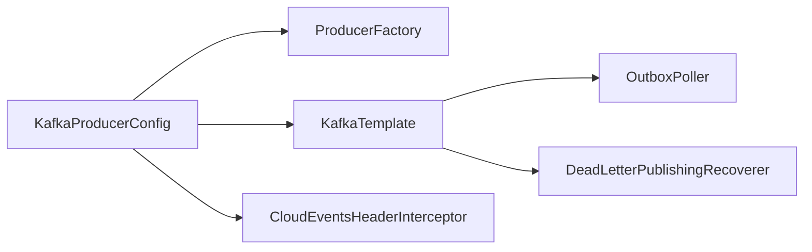

# Spring Kafka DLT와 Producer Config 분석

---

이 문서는 message-lib의 Kafka 설정을 기준으로 다음 세 가지를 설명한다.

1. `KafkaErrorConfig`가 `@DltHandler`와 어떤 관계인지
2. `KafkaProducerConfig`가 실제로 어디에 연결되는지
3. 현재 방식이 최선인지, 어떤 상황에서 개선이 필요한지


## 전체 구조 한눈에 보기

> 현재 구조는 `@RetryableTopic + @DltHandler` 방식이 아니라, `DefaultErrorHandler + DeadLetterPublishingRecoverer` 방식의 전역 에러 처리 구조다.


- 프로듀서 측은 하나의 `KafkaTemplate<String, byte[]>`를 중심으로 동작한다.




## 1. `KafkaErrorConfig`는 `@DltHandler`를 안 쓸 때 들어가는 DLT 처리인가

> 결론부터 말하면, 실질적으로는 맞다. 다만 정확히는 `@DltHandler`의 문법적 대체가 아니라, **리스너 컨테이너 전역 에러 핸들러 기반의 DLQ 처리**다.

### 현재 구현이 하는 일

`KafkaErrorConfig`는 `CommonErrorHandler` 빈을 만들고, 내부에 `DefaultErrorHandler`를 둔다.

핵심 흐름은 다음과 같다.

1. `@KafkaListener`가 메시지를 처리하다 예외를 던진다.
2. `DefaultErrorHandler`가 지수 백오프로 재시도한다.
3. 재시도 횟수를 넘기거나 재시도 불가 예외면 `DeadLetterPublishingRecoverer`가 DLQ 토픽으로 보낸다.
4. `DlqConsumer`가 그 DLQ 메시지를 다시 읽어서 로그를 남긴다.

즉, "**최종 실패 메시지를 별도 토픽으로 보내고 후처리한다**"는 의미에서는 DLT 처리라고 봐도 된다.

### `@DltHandler` 방식과의 차이

`@DltHandler`는 보통 `@RetryableTopic`과 함께 사용된다. 이 방식은 Spring Kafka가 retry topic, dlt topic, backoff 정책을 토픽 단위로 더 선언적으로 관리한다.

반면 현재 구조는 다음 특징을 가진다.

- retry topic을 여러 개 만들지 않는다.
- 원래 리스너 컨테이너 안에서 재시도하다가 최종 실패 시 DLQ로 보낸다.
- 정책 적용 단위가 개별 리스너 메서드보다 전역 컨테이너 정책에 가깝다.

| 구분 | 현재 구조 | `@RetryableTopic + @DltHandler` |
| --- | --- | --- |
| 재시도 위치 | 같은 리스너 컨테이너 안 | retry topic 체인 |
| DLT 처리 진입 | `DefaultErrorHandler` | Spring Kafka retry topic infra |
| 설정 성격 | 전역 정책 | 리스너/토픽별 선언적 정책 |
| 복잡도 | 낮음 | 더 높음 |
| 세밀한 분기 | 상대적으로 약함 | 상대적으로 강함 |

### 이 코드에서 실제 DLT 처리 범위

현재 코드는 아래 두 종류의 실패를 분리해서 다룬다.

1. **Consumer 처리 실패**
   - `KafkaErrorConfig`가 재시도 후 `Topics.DLQ`로 보낸다.
   - 이후 `DlqConsumer`가 수신한다.

2. **Producer 측 Outbox 발행 실패**
   - `OutboxPoller`가 Kafka 전송 실패를 잡아 outbox row를 `PENDING` 또는 `DEAD` 상태로 관리한다.
   - 즉, 이쪽은 Kafka DLQ가 아니라 **DB 기반 재시도/사망 큐**다.

이 프로젝트는 결과적으로 **이중 실패 처리 계층**을 가진다.

- Producer 측: Outbox 상태값(`PENDING`/`DEAD`)
- Consumer 측: Kafka DLQ(`tps.dlq`)


## 2. `KafkaProducerConfig`는 어떻게 쓰이는가

> `KafkaProducerConfig`는 단순히 producer를 하나 만드는 클래스가 아니다. 이 라이브러리에서 Kafka 송신의 공통 진입점을 만든다.

이 클래스는 두 개의 핵심 빈을 만듭니다.

1. `ProducerFactory<String, byte[]>`
2. `KafkaTemplate<String, byte[]>`

설정값은 `KafkaProperties`에서 가져오므로, 실제 직렬화기/acks/bootstrap server 같은 값은 애플리케이션의 `spring.kafka.producer.*` 설정에 의해 결정된다.

예시:

- `key-serializer = StringSerializer`
- `value-serializer = ByteArraySerializer`
- `acks = all`

즉, 이 라이브러리는 "Kafka를 어떻게 연결할지"를 하드코딩하지 않고, Spring Boot의 `spring.kafka` 설정을 따라간다.

### 실제 사용처 1: `OutboxPoller`

`OutboxPoller`는 DB outbox 테이블에 쌓인 이벤트를 읽어 Kafka로 발행한다.

동작 순서는 다음과 같다.

1. PENDING 이벤트를 조회한다.
2. `PROCESSING`으로 바꾼다.
3. 각 이벤트를 `ProducerRecord<String, byte[]>`로 만든다.
4. `KafkaTemplate.send(...).get(...)`로 동기 발행한다.
5. 성공 시 `SENT`, 실패 시 재시도 또는 `DEAD` 처리한다.

즉, 이 `KafkaTemplate<String, byte[]>`는 **비즈니스 이벤트 발행용 producer**다.

### 실제 사용처 2: `KafkaErrorConfig`

`KafkaErrorConfig`의 `DeadLetterPublishingRecoverer`도 같은 `KafkaTemplate<String, byte[]>`를 사용한다.

즉, 이 템플릿은 단순 비즈니스 송신뿐 아니라, **실패 메시지를 DLQ로 다시 발행하는 용도**에도 쓰인다.

결과적으로 현재 `KafkaProducerConfig`는 다음 두 경로를 공통화한다.

- 정상 이벤트 발행
- 실패 이벤트 DLQ 재발행

### CloudEvents 인터셉터 역할

`KafkaTemplate`에는 `CloudEventsHeaderInterceptor`가 연결되어 있다.

이 인터셉터는 메시지 전송 직전에 다음 헤더를 비어 있을 때 자동 보강한다.

- `ce_specversion`
- `ce_id`
- `ce_source`
- `ce_time`
- `trace-id` (MDC에 있으면)

여기서 중요한 점은, `OutboxPoller`도 일부 CloudEvents 헤더를 직접 넣는다는 것이다.

- `OutboxPoller`가 이벤트별 헤더를 넣음
  - `ce_type`
  - `ce_correlationid`
  - `ce_id`
  - `ce_source`
  - `ce_specversion`
- `CloudEventsHeaderInterceptor`는 빠진 기본 헤더를 채움

따라서 역할 분담은 다음처럼 이해하면 된다.

- `OutboxPoller`: 이벤트 문맥에 따라 달라지는 헤더
- Interceptor: 모든 producer 경로에 공통으로 필요한 기본 헤더

### `@EnableKafka`, `@EnableScheduling`의 의미

`KafkaProducerConfig`에는 producer 설정 외에 다음도 같이 있다.

- `@EnableKafka`
- `@EnableScheduling`

즉, 이 클래스는 단순 프로듀서 팩토리가 아니라,

- `@KafkaListener` 활성화
- `OutboxPoller`의 `@Scheduled` 실행 활성화

까지 같이 켜는 인프라 진입점 역할도 한다.


## 3. 현재 방식이 최선인가

결론은 다음과 같다.

> **작고 단순한 공통 라이브러리로 일관된 기본 동작을 제공하기에는 괜찮다.**
> 하지만 운영 규모가 커지거나 토픽별 정책이 달라지면 지금 구조만으로는 부족해질 가능성이 높다.

### 현재 방식의 장점

#### 1. 구조가 단순하다

전역 `CommonErrorHandler` 하나로 소비자 실패 정책을 통일한다. 작은 팀이나 공통 라이브러리에는 이 단순함이 큰 장점이다.

#### 2. retry topic 인프라가 필요 없다

`@RetryableTopic` 기반은 편리하지만 retry topic, DLT topic, 정책 선언이 더 많아진다. 지금 구조는 별도 retry topic 체인 없이도 재시도 + DLQ를 구현한다.

#### 3. producer 타입이 통일되어 있다

`KafkaTemplate<String, byte[]>` 하나로

- outbox 이벤트 발행
- DLQ 재발행

을 모두 처리하므로 직렬화 전략이 단순하다.

#### 4. Outbox와 소비자 DLQ가 분리되어 있다

producer 측 실패와 consumer 측 실패를 같은 메커니즘으로 억지로 합치지 않았다.

- producer 실패: DB 상태 기반 재시도
- consumer 실패: Kafka DLQ

이 분리는 개념적으로 타당하다.

### 현재 방식의 한계

#### 1. DLQ 토픽과 파티션이 너무 고정적이다

현재 코드는 모든 실패를 `Topics.DLQ`의 **0번 파티션**으로 보낸다.

이 선택의 문제는 다음과 같다.

- 장애량이 많아지면 0번 파티션이 병목이 된다.
- 원본 토픽/파티션 맥락을 활용하지 못한다.
- 토픽별 격리가 어렵다.

작은 시스템에서는 괜찮지만, 운영 규모가 커지면 좋지 않다.

#### 2. DLQ 소비가 "로그만 남기고 끝"이다

`DlqConsumer`는 현재 로그만 남긴다. 운영에서 DLQ는 보통 다음 중 하나로 이어져야 한다.

- 수동 재처리
- 자동 재처리
- 장애 알림
- 별도 보관소 적재
- 원인 분류

지금 구조는 "실패를 모아두는 것"까지는 되지만, "실패를 운영하는 것"은 약하다.

#### 3. 전역 정책이라 토픽별 튜닝이 어렵다

모든 리스너가 같은 에러 핸들러 정책을 쓰면 단순하지만, 실제 운영에서는 이런 요구가 자주 생긴다.

- 어떤 토픽은 즉시 DLQ
- 어떤 토픽은 10회 재시도
- 어떤 토픽은 역직렬화 실패만 바로 격리

이런 차등 정책은 `@RetryableTopic` 또는 리스너별 container factory 구성이 더 유리하다.

#### 4. 설정 클래스 책임이 섞여 있다

`KafkaProducerConfig`라는 이름인데 실제로는 다음을 다 한다.

- producer 빈 생성
- Kafka listener 활성화
- scheduling 활성화

작동은 문제없지만, 책임 이름과 실제 역할이 1:1로 맞지 않는다.

더 명확하게 나누려면 예를 들면 다음처럼 분리할 수 있다.

- `KafkaProducerConfiguration`
- `KafkaListenerInfrastructureConfiguration`
- `OutboxSchedulingConfiguration`

#### 5. 소스 트리와 빌드 산출물의 불일치 흔적이 있다

현재 소스에서는 `PipelineKafkaAutoConfiguration.java`가 보이지 않지만, 빌드 산출물에는 auto-configuration 클래스가 존재한다.

이 점은 다음 위험을 만든다.

- 현재 소스가 최신이 아닐 수 있다.
- 문서와 실제 패키징 결과가 어긋날 수 있다.
- 설정이 왜 로드되는지 추적이 어려워진다.

학습용 문서 관점에서는 "자동 설정은 빌드 결과 기준으로 확인됨" 정도로 이해하면 된다.


## 어떤 상황에서 지금 방식이 적절한가

현재 구조가 잘 맞는 상황:

- 서비스 수가 많지 않다.
- consumer 재시도 정책이 대부분 비슷하다.
- DLQ는 우선 격리만 하고, 운영 도구는 나중에 붙일 계획이다.
- 공통 라이브러리로 빠르게 표준 동작을 만들고 싶다.

현재 구조가 부족해지는 상황:

- 토픽별 재시도 정책이 다르다.
- DLQ를 실제 운영 프로세스에 연결해야 한다.
- 실패량이 많아 DLQ 단일 토픽/단일 파티션이 병목이 된다.
- 팀이 커져서 설정 책임 분리가 중요해진다.


## 개선 우선순위 제안

실무적으로 개선한다면 다음 순서를 권장한다.

### 1순위: DLQ 운영성 보강

가장 먼저 할 일은 `DlqConsumer`를 로그 전용에서 운영 가능한 구조로 바꾸는 것이다.

예:

- 실패 사유와 원본 토픽/오프셋 저장
- Slack/이메일/모니터링 알림
- 수동 재처리 엔드포인트

### 2순위: DLQ 라우팅 개선

현재의 `Topics.DLQ + partition 0` 고정은 단순하지만 확장성이 약하다.

대안:

- 원본 토픽별 DLT로 분리
- 원본 파티션 유지
- 공통 DLQ를 쓰더라도 해시 기반 파티셔닝 적용

### 3순위: 설정 책임 분리

`KafkaProducerConfig`의 역할을 이름과 책임 기준으로 나누면 유지보수가 쉬워진다.

### 4순위: 토픽별 재시도 정책 필요 시 `@RetryableTopic` 검토

모든 리스너가 같은 정책이면 현재 방식이 더 단순하다. 하지만 토픽별/리스너별 정책 차이가 커지면 `@RetryableTopic + @DltHandler` 쪽이 더 선언적이고 운영 친화적일 수 있다.


## 최종 정리

### 질문 1 정리

`KafkaErrorConfig`는 `@DltHandler`와 동일한 메커니즘은 아니지만, **현재 프로젝트에서 consumer 실패를 DLQ로 보내는 전역 DLT 처리 역할**을 한다고 봐도 된다.

### 질문 2 정리

`KafkaProducerConfig`는 `KafkaTemplate<String, byte[]>`를 생성해 다음 두 경로에 공통으로 공급한다.

- `OutboxPoller`의 정상 이벤트 발행
- `KafkaErrorConfig`의 DLQ 재발행

또한 `CloudEventsHeaderInterceptor`를 붙여 송신 메시지의 공통 헤더도 보강한다.

### 질문 3 정리

현재 방식은 **단순하고 공통화된 기본 전략**으로서는 괜찮다. 다만 아래 항목은 최선이라 보기 어렵다.

- DLQ를 단일 토픽/단일 파티션으로 고정한 점
- DLQ 소비가 로그만 남기는 점
- 토픽별 재시도 정책이 어려운 점
- producer 설정과 scheduling/listener 활성화 책임이 섞인 점

즉, 현재 구조는 "시작점으로는 합리적"이지만, 운영 성숙도가 올라가면 DLQ 운영성 강화와 정책 세분화가 필요하다.


## 부록: 현재 구조를 한 문장으로 표현하면

> 이 message-lib는 **producer 쪽은 Outbox 상태머신으로, consumer 쪽은 Spring Kafka 전역 에러 핸들러 + DLQ로 실패를 분리 처리하는 구조**다.


## 추가 질문: `@Retryable`을 쓰면 `KafkaErrorConfig`는 필요 없는가

이 질문은 많이 헷갈린다. 결론부터 말하면 다음과 같다.

- `@Retryable`을 쓰더라도 보통 `KafkaErrorConfig`는 여전히 필요하다.
- 단, `@RetryableTopic`을 쓰는 경우에는 현재 `KafkaErrorConfig`의 retry/DLT 역할과 중복될 수 있다.

즉, 핵심은 `@Retryable`과 `@RetryableTopic`을 구분하는 것이다.

### `@Retryable`은 무엇인가

`@Retryable`은 Spring Retry의 메서드 재호출 AOP다.

이 기능은 "메서드를 몇 번 다시 호출할 것인가"에 집중한다. 즉, 어떤 서비스 메서드나 어떤 호출 단위를 재시도 대상으로 삼는 방식이다.

예를 들어 `@KafkaListener` 내부에서 아래처럼 별도 서비스 메서드를 호출한다고 하자.

```java
@KafkaListener(topics = "example")
public void listen(String message) {
    someService.process(message);
}
```

그리고 `someService.process()`에 `@Retryable`이 붙어 있으면, `process()` 메서드가 내부적으로 여러 번 재호출될 수 있다.

하지만 여기서 중요한 점은, **이것만으로 Kafka DLT가 생기지는 않는다**는 것이다.

### 왜 `@Retryable`만으로는 DLT를 대체하지 못하는가

`@Retryable`은 메서드 레벨 재시도다. 반면 현재 `KafkaErrorConfig`의 `DefaultErrorHandler`는 **Kafka 리스너 컨테이너 레벨 에러 처리기**다.

두 기능의 차이는 다음과 같다.

| 구분 | `@Retryable` | `DefaultErrorHandler` |
| --- | --- | --- |
| 적용 단위 | 메서드 호출 | Kafka listener 컨테이너 |
| 주 관심사 | 메서드 재호출 | 레코드 재처리, 오프셋, recoverer, DLT |
| DLT 발행 | 직접 제공하지 않음 | `DeadLetterPublishingRecoverer`로 가능 |
| Kafka 맥락 인지 | 약함 | 강함 |

즉, `@Retryable`은 "비즈니스 로직을 몇 번 더 시도해보자"에 가깝고, `DefaultErrorHandler`는 "Kafka 메시지 처리 실패를 어떻게 재시도하고 최종적으로 어디로 보낼까"에 가깝다.

### 둘을 같이 쓰면 어떻게 되는가

보통은 다음 순서로 이해하면 된다.

1. `@KafkaListener`가 호출된다.
2. 내부에서 `@Retryable`이 붙은 메서드가 재시도된다.
3. 그래도 최종 실패하면 예외가 바깥으로 올라간다.
4. 그때 `DefaultErrorHandler`가 예외를 받아 Kafka 재시도/DLT 처리를 한다.

즉, `@Retryable`과 `KafkaErrorConfig`는 대체 관계라기보다 **서로 다른 계층의 재시도**다.

### 언제 `KafkaErrorConfig`가 안 탈 수 있는가

예외가 Kafka 컨테이너 밖으로 올라가지 않으면 `DefaultErrorHandler`는 개입하지 못한다.

대표적인 경우:

- `@Retryable` + `@Recover`로 최종 실패를 내부에서 삼켜버리는 경우
- 리스너 내부에서 예외를 catch하고 다시 던지지 않는 경우

이 경우는 Kafka DLT로 가지 않는다. 대신 "애플리케이션 내부 복구"를 선택한 것이다.

이건 가능은 하지만, "실패 메시지를 Kafka DLT에 남겨야 하는 운영 요구"가 있으면 맞지 않을 수 있다.

### `@RetryableTopic`은 왜 다른가

`@RetryableTopic`은 Spring Kafka가 제공하는 retry topic/DLT infrastructure다.

이 방식은:

- retry topic 생성
- backoff 정책 적용
- 최종 DLT 전송
- 필요하면 `@DltHandler` 연결

을 Kafka 관점에서 선언적으로 구성한다.

따라서 `@RetryableTopic`을 쓰면 현재 `KafkaErrorConfig`가 맡는 retry/DLT 역할과 직접 겹칠 가능성이 높다.

즉:

- `@Retryable` 사용: `KafkaErrorConfig` 대체 아님
- `@RetryableTopic` 사용: `KafkaErrorConfig`와 역할 중복 가능

### 실무적으로 어떻게 판단하면 되는가

#### 경우 1: `@Retryable`만 사용

아래 목표라면 `KafkaErrorConfig`를 유지하는 편이 맞다.

- 메서드 내부에서 짧게 몇 번 더 시도하고 싶다.
- 그래도 실패하면 Kafka DLQ로 보내고 싶다.

이 경우 구조는 다음처럼 된다.

- 1차: `@Retryable`
- 최종 실패: `DefaultErrorHandler` + DLT

#### 경우 2: `@RetryableTopic` 사용

아래 목표라면 `KafkaErrorConfig`와 충돌 여부를 점검해야 한다.

- retry topic 체인을 쓰고 싶다.
- `@DltHandler`로 최종 실패를 받고 싶다.
- 토픽별 재시도 정책을 선언적으로 나누고 싶다.

이 경우는 보통 `@RetryableTopic` 쪽으로 일원화하고, 전역 `DefaultErrorHandler`는 최소화하거나 보조 역할만 남기는 식으로 정리한다.

### 한 줄 정리

- `@Retryable`은 메서드 재시도다. DLT를 대체하지 않는다.
- `KafkaErrorConfig`는 Kafka 메시지 실패 처리와 DLT 라우팅을 담당한다.
- `@RetryableTopic`은 현재 `KafkaErrorConfig`와 더 직접적으로 경쟁하는 대안이다.


## 패턴 비교: `@Retryable` vs `DefaultErrorHandler` vs `@RetryableTopic`

세 방식은 모두 "실패했을 때 다시 시도한다"는 점은 같지만, 재시도 위치와 최종 실패 처리 방식이 다르다.

### 1. `@Retryable`: 비즈니스 메서드 재시도

이 방식은 Kafka 자체보다는 "메서드 호출"을 다시 시도하는 패턴이다.

```java
@Service
public class JenkinsService {

    @Retryable(
            retryFor = RuntimeException.class,
            maxAttempts = 3,
            backoff = @Backoff(delay = 1000, multiplier = 2.0)
    )
    public void triggerBuild(JenkinsBuildEvent event) {
        callJenkins(event);
    }

    @Recover
    public void recover(RuntimeException e, JenkinsBuildEvent event) {
        log.error("Jenkins 호출 최종 실패: jobName={}", event.jobName(), e);
    }
}

@KafkaListener(topics = "jenkins.build")
public void listen(String payload) {
    JenkinsBuildEvent event = parse(payload);
    jenkinsService.triggerBuild(event);
}
```

특징:

- 재시도 대상이 Kafka 레코드 자체가 아니라 메서드다.
- `@Recover`에서 예외를 끝내면 Kafka DLT는 타지 않는다.
- 외부 API 일시 장애를 짧게 흡수할 때 유용하다.

적합한 경우:

- HTTP 호출, DB 조회, 외부 SDK 호출 같은 메서드 단위 재시도
- Kafka DLT보다 애플리케이션 내부 복구가 더 중요한 경우

부적합한 경우:

- Kafka 레코드 단위 DLT 운영이 필요한 경우
- offset, DLT 토픽, dead-letter recoverer 같은 Kafka 문맥이 중요한 경우

### 2. `DefaultErrorHandler`: 컨테이너 전역 재시도 + DLT

이 방식은 현재 문서에서 분석한 구조다.

```java
@Configuration
public class KafkaErrorConfig {

    @Bean
    public CommonErrorHandler kafkaErrorHandler(KafkaTemplate<String, byte[]> kafkaTemplate) {
        DeadLetterPublishingRecoverer recoverer =
                new DeadLetterPublishingRecoverer(
                        kafkaTemplate,
                        (record, ex) -> new TopicPartition("tps.dlq", 0)
                );

        ExponentialBackOff backOff = new ExponentialBackOff(1000L, 2.0);
        backOff.setMaxElapsedTime(7000L);

        DefaultErrorHandler errorHandler = new DefaultErrorHandler(recoverer, backOff);
        errorHandler.addNotRetryableExceptions(IllegalArgumentException.class);
        return errorHandler;
    }
}

@KafkaListener(topics = "jenkins.build")
public void listen(ConsumerRecord<String, byte[]> record) {
    process(record); // 실패 시 예외 발생
}
```

특징:

- Kafka 리스너 컨테이너가 레코드 처리 실패를 직접 재시도한다.
- 최종 실패 시 `DeadLetterPublishingRecoverer`가 DLT/DLQ로 보낸다.
- 공통 라이브러리로 기본 정책을 통일하기 좋다.

적합한 경우:

- 서비스 전체에 공통 retry/DLT 정책을 적용하고 싶은 경우
- retry topic까지는 필요 없고 단순한 DLQ면 충분한 경우
- Kafka 운영 정책을 중앙에서 통일하고 싶은 경우

부적합한 경우:

- 토픽별 retry 횟수와 backoff를 세밀하게 다르게 가져가야 하는 경우
- retry topic 체인을 활용해야 하는 경우

### 3. `@RetryableTopic`: 토픽 기반 선언적 재시도 + DLT

이 방식은 Spring Kafka가 retry topic과 DLT를 생성/연결하도록 맡기는 패턴이다.

```java
@RetryableTopic(
        attempts = "4",
        backoff = @Backoff(delay = 1000, multiplier = 2.0, maxDelay = 10000),
        dltTopicSuffix = "-dlt"
)
@KafkaListener(topics = "jenkins.build", groupId = "jenkins-build-consumer")
public void listen(String payload) {
    process(payload);
}

@DltHandler
public void dlt(String payload,
                @Header(KafkaHeaders.RECEIVED_TOPIC) String topic) {
    log.error("DLT 수신: topic={}, payload={}", topic, payload);
}
```

특징:

- retry topic이 별도로 생긴다.
- 최종 실패 시 DLT로 이동한다.
- `@DltHandler`로 최종 실패 메시지를 직접 받을 수 있다.
- 리스너 단위로 선언하기 좋다.

적합한 경우:

- 토픽별로 다른 retry 정책이 필요한 경우
- 특정 consumer만 별도 DLT 전략을 가져가고 싶은 경우
- retry 흐름을 Spring Kafka 표준 방식으로 명시하고 싶은 경우

부적합한 경우:

- 공통 라이브러리 하나로 단순 정책만 제공하면 충분한 경우
- retry topic 증가 자체가 운영 부담인 경우


## 세 패턴의 관계

이 셋은 완전히 배타적이지 않다.

### 조합 1: `@Retryable` + `DefaultErrorHandler`

가장 흔한 조합이다.

```text
메서드 내부 짧은 재시도
  -> 그래도 실패
  -> Kafka 컨테이너 에러 핸들러가 최종 DLT 처리
```

의미:

- 순간적인 외부 API 실패는 메서드 레벨에서 빠르게 흡수
- 구조적 실패는 Kafka DLQ로 넘김

### 조합 2: `@RetryableTopic` 단독

이 경우는 보통 Kafka 재시도/DTL 정책을 `@RetryableTopic` 쪽으로 일원화한다.

```text
KafkaListener 실패
  -> retry topic 이동
  -> 재소비
  -> 최종 DLT 이동
```

의미:

- Kafka 문맥에서 retry 전략을 더 명시적으로 관리
- 전역 `DefaultErrorHandler`는 최소화하거나 보조용으로 유지

### 조합 3: `@Retryable` + `@RetryableTopic`

가능은 하지만 과해질 수 있다.

```text
메서드 내부 재시도
  -> 실패
  -> retry topic 이동
  -> 다시 소비 후 메서드 내부 재시도 반복
```

이 조합은 중첩 재시도라서 전체 시도 횟수와 지연 시간이 커지기 쉽다. 의도적으로 설계하지 않으면 운영에서 예측이 어려워진다.

## 무엇을 선택해야 하는가

### `@Retryable`을 우선 쓸 때

- 외부 API 호출만 잠깐 흔들린다.
- Kafka DLT는 최종 안전망으로 두고 싶다.
- 메서드 단위 재시도가 더 자연스럽다.

권장 조합:

- `@Retryable` + `DefaultErrorHandler`

### `DefaultErrorHandler`를 우선 쓸 때

- 전역 공통 정책이 필요하다.
- 공통 라이브러리에서 기본 동작을 강제하고 싶다.
- retry topic 없이도 충분하다.

권장 조합:

- `DefaultErrorHandler` 단독
- 필요하면 내부 서비스에 제한적으로 `@Retryable` 추가

### `@RetryableTopic`을 우선 쓸 때

- 토픽별 정책 차이가 크다.
- DLT를 리스너별로 명시적으로 운용하고 싶다.
- Spring Kafka 표준 retry topic 구조를 활용하고 싶다.

권장 조합:

- `@RetryableTopic` 중심 설계
- 전역 `DefaultErrorHandler`는 중복되지 않게 단순화

## 실무 요약

가장 실용적인 판단 기준은 아래와 같다.

| 상황 | 추천 |
| --- | --- |
| 외부 API를 몇 번 더 두드려 보고 싶다 | `@Retryable` |
| 최종 실패를 Kafka DLQ로 보내고 싶다 | `DefaultErrorHandler` |
| 토픽별 retry/DLT 정책을 선언적으로 나누고 싶다 | `@RetryableTopic` |
| 짧은 내부 재시도 후 그래도 실패하면 DLQ로 보내고 싶다 | `@Retryable` + `DefaultErrorHandler` |

한 줄로 정리하면:

> `@Retryable`은 메서드 복구, `DefaultErrorHandler`는 Kafka 레코드 복구, `@RetryableTopic`은 Kafka 토픽 기반 복구라고 보면 된다.
