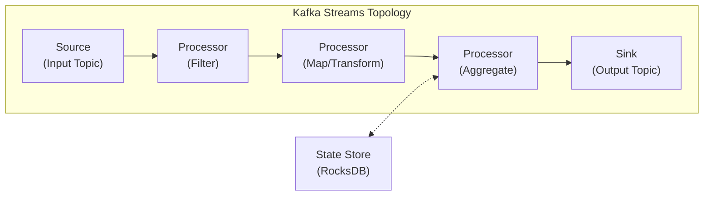

# 스트림 처리

------

> *스트림 처리는 메시지 브로커에 저장된 데이터를 실시간 변환, 필터링, 집계하는 패턴입니다. 단순히 메시지 읽기/쓰기를 넘어서 데이터가 흐르는 동안 비즈니스 로직을 적용해 새로운 인사이트를 생성합니다.*

스트림을 처음 접한다면 공장의 컨베이어 벨트를 생각하면 된다.

```java
택배가 쉬지 않고 들어옴 (= 이벤트 스트림)
    ↓
[1단계] 바코드 스캔 (= 변환/필터링)
    ↓
[2단계] 지역별 분류 (= 라우팅/집계)
    ↓
[3단계] 트럭에 적재 (= 출력 토픽에 쓰기)
```

| **개념**         | **택배 분류 센터 비유**                                      |
| ---------------- | ------------------------------------------------------------ |
| **Topology**     | 컨베이어 벨트의 전체 배치도 (어떤 순서로 어떤 작업을 하는지) |
| **KStream**      | 택배 하나하나의 흐름 (모든 택배 기록을 보존)                 |
| **KTable**       | "현재 각 트럭에 몇 개 실렸는가" 현황판 (최신 상태만 유지)    |
| **State Store**  | 분류 작업자의 메모장 (지금까지 몇 개 처리했는지 기억)        |
| **Windowing**    | "매 10분마다 처리량 집계" (시간 단위로 끊어서 세기)          |
| **Exactly-once** | 같은 택배를 두 번 분류하거나 빠뜨리지 않는 보장              |

## 배치 처리 vs 스트림 처리

| **항목**        | **배치 처리**                   | **스트림 처리**                       |
| --------------- | ------------------------------- | ------------------------------------- |
| **데이터 소스** | 정적 데이터셋 (파일, DB 스냅샷) | 무한 이벤트 스트림 (메시지 브로커)    |
| **처리 시점**   | 스케줄 기반 (매시간, 매일)      | 이벤트 도착 즉시                      |
| **지연시간**    | 분~시간                         | 밀리초~초                             |
| **도구**        | Hadoop MapReduce, Spark Batch   | Kafka Streams, Flink, Spark Streaming |
| **적합 사례**   | 정산, 리포트 생성, ML 모델 학습 | 사기 탐지, 실시간 대시보드, 알림      |

**배치 처리**

- 일정량의 데이터가 쌓일 때까지 기다렸다가 한꺼번에 처리합니다.
- ex) 하루치 주문 데이터를 모아서 밤에 집계하는 방식

**스트림 처리**

- 데이터가 도착하는 즉시 처리하며, 주문이 발생하면 실시간으로 재고 차감/추천 시스템 업데이트
- 검색 결과를 얻기까지 시간이 매우 짧습니다.

# Kafka Stream 개요

---

> *Kafka Stream은 공식에서 제공하는 스트림 처리 라이브러리입니다. Redpanda도 Kafka API와 호환되므로 그대로 사용 가능합니다.*

Kafka Stream은 클라이언트 라이브러리 방식으로, Flink나 Spark Streaming와 달리, 애플리케이션 라이브러리로 포함되어 쉽게 쓸 수 있습니다.

```java
// Flink / Spark Streaming:
애플리케이션 JAR 제출 → Flink/Spark 클러스터 → 배포 및 실행
(별도 클러스터 운영 필요)

// Kafka Streams:
애플리케이션 JAR 실행 → 바로 스트림 처리 시작
(추가 인프라 불필요)
```

## @KafkaListener vs Kafka Stream 차이

@KafkaListener는 이벤트를 받아서 처리하는 것까지는 할 수 있지만, 상태(State)를 자체적으로 유지하는 능력이 없습니다. 예를 들어 "사용자별 포스트 개수"를 계산하려면 외부 DB에 직접 조회하고 쓰는 별도 로직이 필요합니다.

```java
// @KafkaListener: Stateless 처리
@KafkaListener(topics = "user.events")
public void handle(UserEvent event) {
    // 문제: 상태를 유지할 수 없음
    // "사용자별 포스트 개수"를 계산하려면 별도 DB 필요
    long count = userRepository.countByUserId(event.getUserId());
    userRepository.updatePostCount(event.getUserId(), count + 1);
}
```

이러한 방식의 한계점은 3가지입니다.

1. **Stateful 집계가 어렵습니다**: 별도 DB에 의존해야 한다.
2. **여러 토픽의 Join이 불가능합니다**: 두 토픽의 데이터를 결합하려면 직접 상태관리 코드 작성
3. **윈도우 집계나 중복 제거 같은 고급 패턴 사용이 어렵습니다.**

### Kafka Stream의 해결책

Kafka Stream은 RocksDB 기반의 State Store를 인스턴스 내부에 내장하여 상태를 직접 관리합니다. 외부 DB없이 집계, join이 가능해집니다.

```java
// Kafka Streams: Stateful 처리
@Bean
public KStream<String, UserEvent> userStream(StreamsBuilder builder) {
    KStream<String, UserEvent> stream = builder.stream("user.events");

    // 집계: 사용자별 포스트 개수를 State Store에 저장
    KTable<String, Long> postCounts = stream
        .groupByKey()
        .count(Materialized.as("post-count-store"));

    return stream;
}
```

| 특성                  | 설명                                                         |
| --------------------- | ------------------------------------------------------------ |
| **State Store 내장**  | RocksDB 기반 로컬 상태 저장. 외부 DB 불필요.                 |
| **클러스터 불필요**   | 라이브러리로 동작하여 Spring Boot에 임베드 가능              |
| **스케일 아웃**       | 파티션별로 자동 분산 처리. 인스턴스를 추가하면 자동으로 부하 분산. |
| **Exactly-Once**      | 트랜잭션 지원으로 중복 처리 없음                             |
| **Interactive Query** | 외부(HTTP API)에서 State Store를 직접 조회 가능.             |

## Topology: Source → Processor → Sink

> Kafka Stream은 Topology라는 구조로 정의됩니다. 물건 받아서(Source) → 작업을 수행(Processor) → 어디로 보내는가(Sink)

```java
Source (입력 토픽)
   ↓
Processor (변환, 필터링, 집계)
   ↓
Processor (추가 변환)
   ↓
Sink (출력 토픽)
```

### 간단한 필터링 예시

```java
StreamsBuilder builder = new StreamsBuilder();

// Source: orders 토픽에서 읽기
KStream<String, Order> orders = builder.stream("orders");

// Processor: 필터링 및 변환
KStream<String, Order> highValueOrders = orders
    .filter((key, order) -> order.getAmount() >= 10000)
    .mapValues(order -> order.withDiscountApplied());

// Sink: high-value-orders 토픽에 쓰기
highValueOrders.to("high-value-orders");
```



## Sub-topology와 Task

> *Topology는 내부적으로 Sub-topology와 Task라는 단위로 분할되어 실행됩니다.*

```java
예시:
  Sub-topology 1 → 소스 토픽 "orders" (8 파티션)
    → Task 1_0, 1_1, 1_2, ... 1_7  (8개 Task)

  Sub-topology 2 → 소스 토픽 "clicks" (4 파티션)
    → Task 2_0, 2_1, 2_2, 2_3     (4개 Task)

  총 12개 Task → Consumer Group 내 인스턴스들에 분산 할당
```

**Sub-topology**

- 하나의 Topology안에서 Source Node부터 연결된 노드를 추적하면 독립적인 그래프가 형성됩니다. 서로 연결되지 않은 독립 그래프가 각각 하나의 Sub-Topology가 된다.
- ex) orders 토픽과, clicks 토픽을 각각 별도로 처리하면 2개의 sub-topology 생성

**Task**

- Sub-Topology가 참조하는 소스 토픽의 파티션 수 만큼 Task가 생성됩니다. (병렬 처리 단위)

# Kstream vs KTable

------

> ***Kafka Stream은 KStream/KTable이라는 2가지 핵심 추상화를 제공합니다.***
>
> - **KStream(사건의 기록)** 은행 거래 내역서. "1월 3일 입금 50만원, 1월 5일 출금 10만원, 1월 7일 입금 30만원" — 모든 거래가 시간순으로 기록된다. 과거 기록을 지우지 않는다.
> - **KTable(최신 스냅샷)** 통장 잔액. "현재 잔액: 70만원" — 과거 거래는 상관없고, 지금 얼마인지만 보여준다. 새 거래가 들어오면 잔액이 갱신된다.

## KStream(이벤트 스트림)

Kstream은 모든 변경 이력을 보존하는 무한 이벤트 스트림 입니다. 같은 키에 대해 여러 레코드가 존재할 수 있으며, 각 레코드는 독립적인 이벤트입니다.

```java
// 주문 이벤트 스트림 (KStream):
key=user123, value={orderId: 1, amount: 5000}  ← 첫 번째 주문
key=user123, value={orderId: 2, amount: 8000}  ← 두 번째 주문
key=user123, value={orderId: 3, amount: 3000}  ← 세 번째 주문
```

## KTable(변경 로그)

KTable은 최신 상태만 유지하는 변경 로그 입니다. 같은 키에 대해 여러 레코드가 오면 최신 값으로 덮어 씁니다.

```java
// 재고 상태 테이블 (KTable):
key=product123, value={stock: 100}     ← 초기 재고
key=product123, value={stock: 95}      ← 5개 판매 (이전 값 덮어씀)
key=product123, value={stock: 90}      ← 5개 추가 판매 (최신 상태)
```

### GlobalKTable(전체 파티션을 가진 테이블)

KTable은 할당된 파티션의 데이터만 로컬에 유지하지만, GlobalKTable은 모든 파티션의 데이터를 모든 인스턴스에 복제합니다.

```java
// KTable: 인스턴스별로 할당된 파티션의 데이터만 보유
KTable<String, Product> products = builder.table("products");

// GlobalKTable: 모든 인스턴스가 전체 상품 데이터를 보유
GlobalKTable<String, Product> allProducts = builder.globalTable(
    "products",
    Materialized.<String, Product, KeyValueStore<Bytes, byte[]>>as("products-global-store")
);
```

| **항목**            | **KTable**            | **GlobalKTable**                |
| ------------------- | --------------------- | ------------------------------- |
| **데이터 범위**     | 할당된 파티션만       | 모든 파티션 (전체 복제)         |
| **메모리 사용**     | 적음 (파티션 비례)    | 많음 (전체 데이터)              |
| **조인 시 키 제약** | 동일 파티션 키 필요   | 아무 키로든 조인 가능           |
| **적합한 데이터**   | 대용량 (사용자, 주문) | 소용량 참조 데이터 (상품, 설정) |

## **Stream-Table Join**

KStream과 KTable은 서로 변환할 수 있습니다.

```java
// KStream → KTable: 최신 값으로 집계
KTable<String, Long> userOrderCount = orders
    .groupByKey()
    .count();  // 사용자별 주문 건수 (KTable)

// KTable → KStream: 변경 이벤트로 변환
KStream<String, StockChange> stockChanges = stockTable.toStream();
```

실무에서는 KStream과 KTable을 Join하는 경우가 많습니다.

```java
// ex) 주문 이벤트/상품 정보 JOIN
KStream<String, Order> orders = builder.stream("orders");
KTable<String, Product> products = builder.table("products");

// Stream-Table Join
KStream<String, EnrichedOrder> enrichedOrders = orders
    .selectKey((key, order) -> order.getProductId())  // 조인 키 설정
    .join(products, (order, product) ->
        new EnrichedOrder(order, product.getName(), product.getPrice())
    );
```

# State Store(로컬 상태 저장소)

------

> *스트림 처리에서 상태 관리는 핵심입니다. 집계/조인/윈도우 연산은 모두 과거 데이터를 기록해야 하고, Kafka Stream에서 이를 위해 State Store를 제공합니다.*

## RocksDB

RocksDB는 Facebook이 만든 임베디드 key-value 스토리지 엔진입니다. 애플리케이션에 내장되는 형태이며, SQLite와 같은 방식이지만 용도가 다릅니다.

| **항목**        | **SQLite**            | **RocksDB**                              |
| --------------- | --------------------- | ---------------------------------------- |
| **데이터 모델** | 관계형 (테이블, SQL)  | Key-Value (get/put/delete)               |
| **최적화 대상** | 범용 (읽기/쓰기 균형) | **쓰기 집중** 워크로드                   |
| **내부 구조**   | B-Tree                | **LSM-Tree** (Log-Structured Merge Tree) |
| **사용처**      | 모바일 앱, 소규모 DB  | Kafka Streams, CockroachDB, TiKV         |

Kafka Stream에서 State Store는 이벤트가 들어올 때마다 상태를 갱신하는 쓰기 집중 워크로드다.

- ex) “사용자별 주문 건수”를 집계하면 주문 이벤트가 올 때마다 put(”user123”, 151)이 호출된다.
- RocksDB의 LSM-Tree 구조가 이런 패턴에 최적이다.

```java
쓰기 요청 → MemTable (메모리) → 꽉 차면 → SSTable (디스크 파일)로 flush
                                              ↓
                                   백그라운드 Compaction으로 병합/정리
```

- 쓰기가 빠르다: 디스크에 바로 쓰지 않고 메모리에 먼저 쓴 뒤 일괄 flush 진행 (순차 I/O)
- 읽기도 충분히 빠르다: MemTable → Block Cache → SSTable 순서로 조회하므로 최근 데이터는 메모리에서 조회한다.

## Kafka Stream에서의 RocksDB

State Store는 각 애플리케이션 인스턴스의 로컬 디스크에 생성됩니다. RocksDB는 “빠른 로컬 캐시” 역할을 하고, ChangeLog 토픽이 영구 백업 역할을 합니다.

```bash
Kafka Streams 인스턴스 (JVM 프로세스)
├── 비즈니스 로직 (filter, aggregate, join)
├── RocksDB (State Store)         ← 프로세스 내부에 내장
│   ├── MemTable (메모리)
│   └── SSTable (로컬 디스크)
│       ├── /tmp/kafka-streams/app-id/
│       │   ├── 0_0/             # Partition 0의 State Store
│       │   │   ├── CURRENT
│       │   │   ├── MANIFEST
│       │   │   └── *.sst        # SSTable 파일
│       │   ├── 1_0/             # Partition 1의 State Store
│       │   └── ...
└── Changelog 토픽               ← RocksDB 변경사항의 백업 (Kafka에 저장)
```

각 파티션마다 독립적인 State Store(RocksDB 인스턴스)가 생성되며, 인스턴스가 죽으면 로컬 RocksDB 파일은 사라지지만, Changelog 토픽에서 재생하면 복구됩니다.

## ChangeLog 토픽으로 내결함성 보장

메모장(State Store)이 로컬 디스크에 있으면 서버가 죽을 때 같이 사라집니다. 그래서 Kafka Stream는 메모장에 적을 때마다 복사본을 Kafka 토픽에도 자동으로 보냅니다.

```bash
애플리케이션이 State Store 업데이트:
state.put("user123", 10);

↓ Kafka Streams가 자동으로 Changelog 토픽에 전송:

Changelog 토픽:
key=user123, value=10
```

- 애플리케이션이 재시작되면, Kafka Stream은 Changelog 토픽에서 데이터를 읽어 State Store를 복원합니다.
- ChangeLog는 Compaction 정책을 사용합니다. (최신 상태만 유지됨)

## State Store는 DB를 대체하지 못한다.

State Store의 key-value 조회 및 집계도 진행하는걸 보면 "DB 대신 사용가능한거 아닌가?"라는 생각이 들 수 있습니다. 하지만 설계 목적부터 DB와 다릅니다.

1. 쿼리 모델이 key 룩업으로 한정된다.
2. 데이터의 성격이 "파생"이다.
3. 트랜잭션 보장 수준이 다르다.
4. Interactive Query에 구조적 한계가 있다.

# Windowing(시간 기반 집계)

---

> 스트림 처리에서 "무한한 데이터를 어떻게 집계하는가?"는 중요한 문제입니다. 주문이 24시간 쉬지 않고 들어오는데, "총 주문 건수"를 구하면 숫자가 끝없이 커지기만 합니다. 실무에서 원하는건 "최근 5분", "매시간 매출"과 같이 구간을 정해서 집계하는 것입니다.

## 고정 윈도우(Tumbling Window)

고정된 크기의 겹치지 않는 윈도우 입니다.

```bash
시간: 00:00  00:05  00:10  00:15  00:20
윈도우:  [----1---][----2---][----3---][----4---]
```

```java
KStream<Windowed<String>, Long> orderCountsPer5Min = orders
    .groupByKey()
    .windowedBy(TimeWindows.ofSizeWithNoGrace(Duration.ofMinutes(5)))
    .count();
```

## 슬라이딩 윈도우(Hopping Window)

고정된 크기이지만 일정 간격으로 이동하여 겹치는 윈도우 입니다.

```bash
시간: 00:00  00:05  00:10  00:15  00:20
윈도우:  [------1------]
           [------2------]
              [------3------]
                 [------4------]
```

```java
KStream<Windowed<String>, Long> orderCountsLast10Min = orders
    .groupByKey()
    .windowedBy(TimeWindows.ofSizeAndGrace(Duration.ofMinutes(10), Duration.ofMinutes(1))
        .advanceBy(Duration.ofMinutes(5)))
    .count();
```

- 윈도우 크기 10분, 간격 5분

## 세션 윈도우(Session Window)

비활성 기간(Inactivity gap)을 기준으로 윈도우를 동적으로 생성합니다. 이벤트 각 간격이 임계값을 초과하면 새 윈도우가 시작됩니다.

```bash
사용자 활동:
00:00 클릭 → 00:05 클릭 → 00:10 클릭 [30분 공백] 01:00 클릭 → 01:05 클릭

윈도우:
[Session 1: 00:00 ~ 00:10]  (3개 이벤트)
[Session 2: 01:00 ~ 01:05]  (2개 이벤트)
```

```java
KStream<Windowed<String>, Long> sessionPageViews = clicks
    .groupByKey()
    .windowedBy(SessionWindows.ofInactivityGapWithNoGrace(Duration.ofMinutes(30)))
    .count();
```

## 시간 시멘틱스

Kafka Stream에서 윈도우와 조인은 타임 스탬프를 기준으로 동작합니다. "어떤 시간을 사용하느냐"에 따라 처리 결과가 달라집니다.

| 시간 유형           | 정의                                           | 예시                              |
| ------------------- | ---------------------------------------------- | --------------------------------- |
| **Event-time**      | 이벤트가 실제 발생한 시간                      | 주문이 클라이언트에서 생성된 시각 |
| **Ingestion-time**  | 이벤트가 Kafka 브로커에 도착한 시간            | 브로커가 레코드를 수신한 시각     |
| **Processing-time** | 이벤트가 스트림 애플리케이션에서 처리되는 시간 | 애플리케이션이 poll()한 시각      |
| **Stream-time**     | Task별로 처리한 레코드 중 최대 타임스탬프      | 현재까지 본 가장 최근 이벤트 시간 |

- Kafka Stream은 Event-Time을 기준으로 동작합니다.

### Grace Period(늦게 도착한 레코드)

네트워크 지연이나 재전송으로 인해 윈도우 종료 후에 도착하는 레코드가 있을 수 있습니다. Grace Period를 설정하면 일정 시간 동안 늦은 레코드를 수용합니다.

```java
// 5분 윈도우 + 1분 grace period
// → 윈도우 종료 후 1분까지는 늦은 레코드도 집계에 포함
TimeWindows window = TimeWindows.ofSizeAndGrace(
    Duration.ofMinutes(5),   // 윈도우 크기
    Duration.ofMinutes(1)    // grace period
);

// grace period 없이 설정 (늦은 레코드 즉시 폐기)
TimeWindows strictWindow = TimeWindows.ofSizeWithNoGrace(Duration.ofMinutes(5));
```

# Exactly-once Semantics

---

> *"정확히 한 번만 배달"하는 것이 이상적이지만, 분산 시스템에서는 네트워크 장애, 서버 재시작 등으로 이를 보장하기 어렵습니다.*

분산 시스템에서 메시지 처리 보장 수준은 총 3가지 입니다.

- At-most-once(최대 1번 처리되지만, 손실가능)
- At-least-once(최소 1번 처리되지만, 중복가능.)
- Exactly-once(정확히 1번 처리되며, 손실/중복 없다.)

Kafka Streams는 Exactly-once Semantics(EOS)를 지원합니다. 이는 장애 발생 시에도 각 메시지가 정확히 한 번만 처리되도록 보장합니다.

## 트랜잭션 기반 구현

EOS는 Kafka의 트랜잭션 기능을 활용합니다. 처리 결과와 오프셋 커밋을 하나의 트랜잭션으로 묶습니다.

```bash
1. 입력 토픽에서 메시지 읽기
2. 비즈니스 로직 처리
3. 트랜잭션 시작
   ├─ 출력 토픽에 결과 쓰기
   └─ Consumer 오프셋 커밋
4. 트랜잭션 커밋

장애 발생 → 트랜잭션 롤백 → 처음부터 재시도
```

- 트랜잭션이 커밋되기 전에 장애 발생 시, 출력과 오프셋이 모두 롤백됩니다.

```java
Properties props = new Properties();
props.put(StreamsConfig.PROCESSING_GUARANTEE_CONFIG, StreamsConfig.EXACTLY_ONCE_V2);
props.put(StreamsConfig.APPLICATION_ID_CONFIG, "my-stream-app");

KafkaStreams streams = new KafkaStreams(topology, props);
streams.start();
```

- EOS는 처리량을 약간 희생합니다. 트랜잭션 오버헤드로 인해 지연시간이 수십Ms정도 증가할 수 있으며, 중복이 허용되는 경우에는 AT_LEAST_ONCE를 사용해 성능을 최적화할 수 있습니다.
