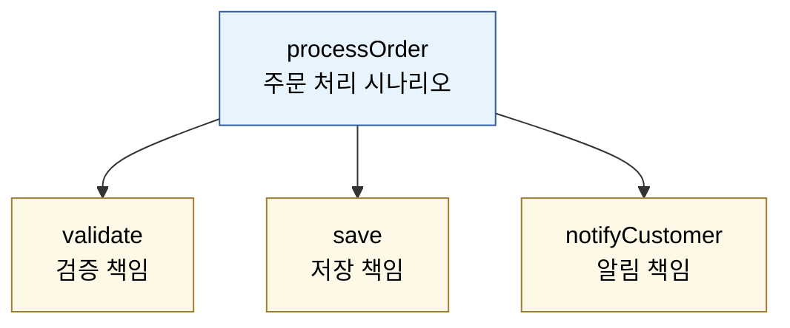
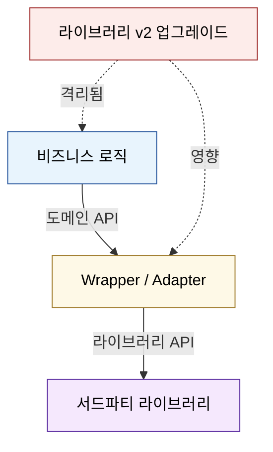
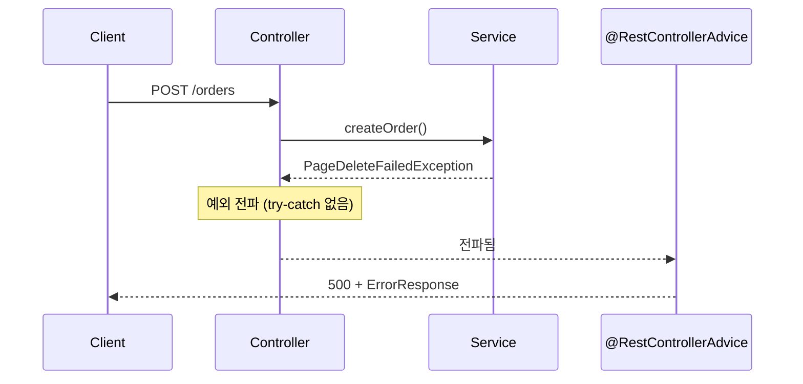

# 클린 코드 원칙

---

> 좋은 코드는 한 번에 태어나지 않는다. 작게 쓰고, 다시 다듬고, 더 작게 쪼개는 반복 속에서 모양이 잡힌다. 클린 코드는 그 반복을 지탱하는 미시 규칙의 묶음이다.


## SOLID와의 관계 — 미시와 거시

SOLID는 클래스·모듈 단위의 거시 원칙이고, 클린 코드는 변수 이름·함수 길이·주석·예외 처리 같은 코드 줄 단위의 미시 규칙이다. SOLID가 "이 클래스의 책임이 한 가지인가"를 묻는다면, 클린 코드는 "이 함수가 한 가지만 하는가, 이름이 의도를 드러내는가"를 묻는다. 둘은 같은 방향을 가리키지만 작용하는 스케일이 다르다.

두 영역이 분리되면 학습 진입이 쉽다. 클린 코드 규칙은 즉시 적용할 수 있고, SOLID 원칙은 설계 결정의 가이드로 작동한다. 이 문서는 Robert Martin의 《Clean Code》 12개 핵심 원칙을 Java/Spring 맥락에 맞춰 정리한다.


## 1. 의미 있는 이름

이름이 의도를 드러내지 못하면, 그 자리에 주석이 따라붙는다. 주석이 필요하다는 것은 이름이 부족하다는 신호다. 변수·함수·클래스 이름은 다음 셋을 동시에 만족해야 한다. 첫째, "무엇을 담는가"가 드러나야 한다. 둘째, 발음과 검색이 쉬워야 한다. 셋째, 비슷한 이름끼리 의미 차이가 명확해야 한다.

**Before**

```java
public List<int[]> getThem() {
    List<int[]> list1 = new ArrayList<>();
    for (int[] x : theList) {
        if (x[0] == 4) list1.add(x);
    }
    return list1;
}
```

이 코드를 1주일 뒤의 본인이 본다고 가정하면, `theList`가 뭔지, `x[0] == 4`가 무슨 의미인지 추적 불가능하다.

**After**

```java
public List<Cell> getFlaggedCells() {
    List<Cell> flaggedCells = new ArrayList<>();
    for (Cell cell : gameBoard) {
        if (cell.isFlagged()) flaggedCells.add(cell);
    }
    return flaggedCells;
}
```

대체된 것은 단어 몇 개뿐이다. 그러나 함수가 무엇을 반환하는지, 어떤 조건으로 거르는지가 코드 자체에서 읽힌다.

생성자를 오버로딩하지 않고 정적 팩토리 메서드로 의도를 드러내는 것도 같은 원칙이다. `new BigDecimal(0.1)`보다 `BigDecimal.valueOf(0.1)`이 부동소수 함정을 피한다는 의도를 이름으로 드러낸다.

### REST API 응답 코드도 *이름*이다

이름이 의도를 드러내야 한다는 원칙은 코드 식별자에만 머무르지 않는다. HTTP 상태 코드와 헤더도 *클라이언트에게 의도를 드러내는 이름*이다. catsbi의 지하철 구간 회고가 다룬 흔한 안티패턴이 있다.

```java
// Before — 201 응답이 Section 자체를 회신
// Location: /sections/3   ← 생성된 Section의 경로
// Body: {}
@PostMapping("/lines/{lineId}/sections")
public ResponseEntity<Void> addSection(...) {
    Section section = sectionService.add(...);
    return ResponseEntity.created(URI.create("/sections/" + section.getId())).build();
}
```

문제는 두 가지다. 첫째, *생성된 자원의 본문이 비어 있다* — HTTP 201 Created의 의미는 "생성된 자원을 본문에 회신한다"인데 메시지가 부재한다. 둘째, *Location 경로가 단일 Section 조회 URL*인데 실제로 그런 엔드포인트가 없어 후속 GET이 404가 난다.

```java
// After — 본문에 라인 표현, Location은 라인 조회 경로
@PostMapping("/lines/{lineId}/sections")
public ResponseEntity<LineResponse> addSection(@PathVariable Long lineId, ...) {
    Line line = sectionService.addAndReturnLine(lineId, ...);
    return ResponseEntity
            .created(URI.create("/lines/" + lineId))
            .body(LineResponse.from(line));
}
```

원칙 한 줄로 압축된다. *상태 코드와 헤더는 식별자다.* "어떤 자원이 어디에 생겼는가"를 클라이언트가 한 번 더 묻지 않고 알 수 있게 드러내야 한다. HTTP 명세는 사실상 *공유된 이름 규약*이고, 그 규약을 어기면 함수 이름을 `handle()`로 둔 것과 같은 비용이 든다.

### 식별자 다음은 *수식자 순서*

이름이 정해진 다음 가독성을 더 끌어올리는 작은 단계가 있다. *Java 수식자(modifier) 순서를 표준에 맞춘다*. catsbi의 인수 테스트 리팩토링 회고가 강조한 시각이다.

Java 언어 사양은 다음 순서를 권장한다.

```
public > protected > private > abstract > default > static > final > transient > volatile > synchronized > native > strictfp
```

```java
// 흩어진 순서
final static public String DEFAULT_NAME = "...";
synchronized public static void init() { ... }

// 표준 순서
public static final String DEFAULT_NAME = "...";
public static synchronized void init() { ... }
```

이 규칙 하나만으로 다음이 좋아진다. 같은 의미의 선언이 같은 *모양*으로 보이고, IDE가 자동 정렬하는 코드와 사람이 쓰는 코드가 일치한다. 새 코드 리뷰에서 "어 이 친구 declaration 모양이 다르네"로 잠깐 멈추는 비용이 사라진다. *이름*이 의미를 담는다면, *수식자 순서*는 그 이름의 *외형 표준*이다.


## 2. 함수 — 작게, 한 가지만

함수는 작아야 한다. 그리고 더 작아야 한다. 작은 함수 한 줄이 곧 하나의 추상화 수준을 가지면, 함수 본문은 같은 추상화 수준의 문장들로 채워진다. 추상화 수준이 섞이는 함수는 읽는 사람이 매번 줌인-줌아웃을 해야 한다.

**판단 기준 세 가지**

- 함수가 한 가지 일만 하는가. 이름에 "and"가 들어가야 한다면 둘로 나눌 신호다.
- 매개변수가 3개를 넘는가. 3개를 넘으면 객체나 일급 컬렉션으로 묶을 시점이다.
- 함수 안의 문장들이 모두 같은 추상화 수준인가. SQL 호출과 도메인 계산이 한 함수에 섞이면 분리한다.

**Before**

```java
public void processOrder(Order order) {
    // 추상화 수준 혼재: 검증, 저장, 알림이 한 곳에
    if (order.getAmount().compareTo(BigDecimal.ZERO) <= 0)
        throw new IllegalArgumentException();
    if (order.getItems().isEmpty())
        throw new IllegalArgumentException();

    String sql = "INSERT INTO orders (...) VALUES (...)";
    jdbcTemplate.update(sql, ...);

    SmtpClient smtp = new SmtpClient("smtp.gmail.com", 587);
    smtp.send("주문 완료", order.getCustomerEmail());
}
```

**After**

```java
public void processOrder(Order order) {
    validate(order);
    save(order);
    notifyCustomer(order);
}

private void validate(Order order)        { /* 검증 책임만 */ }
private void save(Order order)            { /* 저장 책임만 */ }
private void notifyCustomer(Order order)  { /* 알림 책임만 */ }
```

상위 메서드는 "주문 처리는 검증·저장·알림"이라는 시나리오를 그대로 읽게 한다. 세부 구현이 궁금해지면 그때 한 단계 내려간다.



상위는 같은 추상화 수준의 세 가지 행동을 *나란히* 호출한다. 세부 구현은 한 단계 아래로 내려간 뒤에야 보인다. 이 계층화가 깨지면 한 함수 안에 SQL과 도메인 계산이 섞이고, 읽는 사람은 매 줄마다 줌인-줌아웃을 반복한다.

함수 이름은 서술적으로 짓는다. `handle()`, `process()`, `manage()` 같은 동사는 의미가 비어 있다. `validateOrderAmount()`, `persistOrder()`처럼 무엇을 어떻게 하는지가 이름에 들어가야 한다.

### 함수 분리 전 단계 — 변수 응집 → 변수 제거 → 함수형 표현

jojoldu이 강조한 리팩토링 순서가 본 절을 보완한다. 함수를 작게 쪼개기 *전에* 변수 단위로 먼저 다듬는 단계가 있다는 시각이다. 한 메서드 안에 *연관된 변수들과 그 처리 코드*가 흩어져 있으면, 함수 분리부터 시도해도 분리선이 어디인지 보이지 않는다.

순서는 셋이다. 첫째, 같은 변수에 관여하는 코드 줄을 한 곳으로 모은다(*변수 응집*). 둘째, 모이고 나면 중간 변수들이 *사실은 필요 없다는 사실*이 드러나 제거 가능해진다(*변수 제거*). 셋째, 변수가 줄어들면 반복문이 자연스럽게 `map`/`filter`/`reduce`로 표현된다(*함수형 표현*). 이 셋이 끝나면 메서드 분리선이 자명해진다.

```java
// Step 1 — 흩어진 상태
List<Order> orders = repo.findAll();
BigDecimal total = BigDecimal.ZERO;
List<String> ids = new ArrayList<>();
for (Order o : orders) {
    total = total.add(o.amount());
    ids.add(o.id());
}
log.info("orders={}, total={}", ids, total);

// Step 2 — 변수 응집 (orders 관련 줄을 한 덩어리로)
List<Order> orders = repo.findAll();
List<String> ids = orders.stream().map(Order::id).toList();
BigDecimal total = orders.stream().map(Order::amount).reduce(BigDecimal.ZERO, BigDecimal::add);

// Step 3 — 함수형 표현, 메서드 분리선이 자연스럽게 보인다
log.info("orders={}, total={}", collectIds(orders), sumAmount(orders));
```

### 측정 가능한 기준 — NextStep TDD 3규칙

dkswnkk이 NextStep TDD 과정에서 인용한 *측정 가능한* 함수 규칙 셋이 있다. 두루뭉술한 "작게"를 숫자로 떨어뜨린다.

| 규칙 | 의미 |
|------|------|
| **한 메서드 한 단계 들여쓰기** | 메서드 안에 if 안에 for 같은 중첩이 안 보여야 한다. 둘째 들여쓰기가 필요하다면 별도 메서드로 분리한다 |
| **else 예약어 금지** | 조기 return(*가드 절*)로 분기를 평탄화한다. else 블록은 보통 추상화 수준이 섞여 있다는 신호다 |
| **15줄 이내 메서드** | 한 화면에 들어와야 사람 눈이 한 번에 흐름을 잡는다. 넘어가면 분리 신호다 |

가드 절 예시는 다음과 같다.

```java
// Before — else 블록이 깊이를 만든다
public BigDecimal calculate(Order order) {
    if (order != null) {
        if (order.isValid()) {
            return order.amount().multiply(taxRate());
        } else {
            return BigDecimal.ZERO;
        }
    } else {
        return BigDecimal.ZERO;
    }
}

// After — 가드 절로 평탄화, else 없음
public BigDecimal calculate(Order order) {
    if (order == null)       return BigDecimal.ZERO;
    if (!order.isValid())    return BigDecimal.ZERO;
    return order.amount().multiply(taxRate());
}
```

TPS Jenkins 도메인이 이 기준을 어떻게 통과하는지 본다. `RecoveryService(35줄)`, `CancelService(44줄)`, `CompletionService(46줄)`은 클래스 자체가 짧고, 안의 메서드는 모두 ≤20줄로 측정 기준을 통과한다. 가장 큰 `DispatchService(147줄)`조차 메서드 단위로 보면 `receive(23줄)`, `dispatchBatch(13줄)`, `submitBatch(35줄)` 처럼 *클래스가 크지 메서드는 작다*는 점이 측정 가능한 형태로 검증된다.

## 3. 주석 — 변명이 아니다

주석은 코드의 결함을 보완하는 도구이지, 그 자체로 가치가 있는 것이 아니다. 좋은 주석이 필요하다고 느꼈다면, 먼저 코드 이름과 구조로 그 의미를 표현할 수 있는지 물어본다.

**제거 대상**

```java
// 사용자를 검색한다
public User findUser(Long id) { /* ... */ }
```

함수 이름이 이미 다 말하고 있다. 주석은 노이즈일 뿐이다.

**살려야 할 주석**

```java
// JIRA-1234: 외부 결제 API가 timeout 시 멱등 키 재전송을 거부하는 버그가 있어
// 3초 sleep 후 재시도한다. 2026-04 PG사 패치 예정.
Thread.sleep(3000);
```

"왜 이 코드가 여기 있는가"가 코드만으로 추적 불가능한 외부 컨텍스트(이슈 번호, 외부 시스템 버그, 정책 결정)는 주석에 담는다. 이런 주석은 코드 리뷰에서 항상 가치를 인정받는다.

자동 생성된 Javadoc, 코드와 동일한 내용을 반복하는 주석, "// TODO: 나중에 수정"처럼 책임자 없는 주석은 모두 제거 대상이다.


## 4. 경계 — 서드파티 코드는 감싸라

외부 라이브러리나 API를 직접 호출하는 코드가 도메인 곳곳에 흩어져 있으면, 라이브러리 버전 업그레이드가 거대한 작업이 된다. 경계 패턴(Wrapper, Adapter)은 외부 의존성을 한 곳에 가둔다.

**Before — Map을 그대로 노출**

```java
public class Sensors {
    private Map<SensorId, Sensor> sensors = new HashMap<>();

    public Map<SensorId, Sensor> getSensors() {
        return sensors; // 외부에서 임의로 수정 가능
    }
}

// 호출처마다 같은 코드가 반복된다
Sensor sensor = sensors.getSensors().get(sensorId);
```

`Map`은 너무 일반적이라 도메인 의미가 사라진다. 캡슐화도 깨진다.

**After — 감싸기**

```java
public class Sensors {
    private final Map<SensorId, Sensor> sensors = new HashMap<>();

    public Sensor get(SensorId id) {
        return sensors.get(id);
    }

    public void register(Sensor sensor) {
        sensors.put(sensor.id(), sensor);
    }
}
```

내부 자료구조를 `HashMap`에서 `ConcurrentHashMap`으로 바꾸거나, 캐싱 계층을 끼우거나, 영속화 백엔드로 교체해도 `Sensors`의 공개 API는 그대로 유지된다. 모든 호출처가 영향을 받지 않는다.

이 원칙은 외부 HTTP 클라이언트, 메시지 큐 클라이언트, 결제 PG SDK에 그대로 적용된다. 라이브러리를 직접 노출하지 말고 도메인 어휘로 감싼 인터페이스 뒤로 숨긴다.

**서드파티 변화로부터의 격리**가 이 패턴의 실제 가치다. 외부 라이브러리는 사용자가 통제할 수 없는 속도로 변한다. 메이저 버전이 올라가며 메서드 시그니처가 바뀌거나, API 키 발급 방식이 달라지거나, 응답 포맷이 새 필드를 추가한다. 호출 코드가 라이브러리에 직접 의존하면 그 변화 하나가 *애플리케이션 전체*의 변경으로 번진다. 감싸기는 그 영향 범위를 *래퍼 한 클래스*로 가둔다. 라이브러리가 업그레이드되어도 비즈니스 코드는 한 줄도 손대지 않을 수 있어야 한다.



비즈니스 로직과 라이브러리 사이에 래퍼 한 층을 두면, 라이브러리 변경의 충격이 래퍼에서 멈춘다. 초기 비용은 어댑터 클래스 하나의 추가지만, 회수되는 비용은 향후 모든 업그레이드 작업의 범위 축소다.


## 5. 단일 책임 — 함수와 클래스 모두

SOLID의 SRP가 클래스 단위라면, 클린 코드의 SRP는 함수 단위로 한 번 더 적용된다. 함수가 변경되는 이유가 둘 이상이면, 그 함수는 둘로 쪼개야 한다.

```java
// Before: 변경 사유가 둘 — 가격 정책 변경과 통화 표시 변경
public String formatPrice(Order order) {
    BigDecimal price = order.amount().multiply(taxRate());
    return "$" + price.toPlainString();
}

// After: 책임 분리
public BigDecimal calculatePrice(Order order) {
    return order.amount().multiply(taxRate());
}

public String formatCurrency(BigDecimal amount) {
    return "$" + amount.toPlainString();
}
```

분리되었더니 환율 표시를 다국어로 확장할 때 `formatCurrency`만 손대면 된다. 가격 계산 로직은 영향받지 않는다.

### 측정 가능한 제약 — 인스턴스 변수 3개 이하

dkswnkk이 NextStep TDD 과정에서 가장 *도전적*이었다고 회고한 규칙이 *3개 이상의 인스턴스 변수를 가진 클래스 금지*다. 단일 책임의 *측정 가능한* 형태로 작동한다.

근거는 단순하다. 인스턴스 변수가 늘어나면 그 변수들을 함께 다루는 *암묵적 책임*이 생긴다. `User`가 `name`, `email`, `phoneNumber`, `address`, `roles`, `lastLoginAt`을 다 들고 있으면, "신원 관리 + 연락처 관리 + 권한 관리 + 활동 추적"이 한 클래스에 섞여 있는 셈이다. 3개 제약은 자연스럽게 클래스 분리와 일급 컬렉션·VO 도입을 *강제한다*.

```java
// Before — 책임 4개가 섞임
public class User {
    private String name;
    private String email;
    private String phoneNumber;
    private String address;
    private Set<Role> roles;
    private LocalDateTime lastLoginAt;
}

// After — 책임별로 쪼개진다 (각 클래스의 인스턴스 변수 ≤3)
public record User(UserId id, Profile profile, Credentials credentials) {}
public record Profile(String name, ContactInfo contact) {}
public record ContactInfo(Email email, PhoneNumber phone) {}
public record Credentials(Set<Role> roles, LocalDateTime lastLoginAt) {}
```

물론 모든 클래스에 3개 제약을 *예외 없이* 적용하면 잘게 쪼개는 비용이 더 든다. TPS approval 도메인의 `ApprovalExecution` Aggregate Root만 봐도 인스턴스 변수가 10개 가까이 된다. 그러나 *Aggregate Root는 도메인 일관성 경계*라는 특별한 자리이고, *일반 서비스나 DTO에는* 3개 제약이 좋은 가이드가 된다.

## 6. 명령과 조회의 분리 (CQS)

한 함수는 무언가를 *하거나* 무언가를 *반환하거나* 둘 중 하나여야 한다. 둘 다 하는 함수는 부작용 추적을 어렵게 만든다.

```java
// Before: 부작용과 반환을 동시에
public boolean setUsername(User user, String name) {
    if (name == null || name.isBlank()) return false;
    user.setUsername(name);
    return true;
}

if (setUsername(user, name)) { /* ??? */ }  // 호출만 봐서는 의도가 모호하다
```

```java
// After: 명령(상태 변경)과 조회(검증) 분리
public boolean isValidUsername(String name) {
    return name != null && !name.isBlank();
}

public void setUsername(User user, String name) {
    if (!isValidUsername(name))
        throw new IllegalArgumentException("invalid username");
    user.setUsername(name);
}
```

호출부 의도가 깔끔해진다. 검증을 먼저 묻고, 통과하면 수행한다.

### 6.1 부작용을 함수 말단으로 — 테스트 용이성의 근원

jojoldu이 강조한 시각은 한 단계 더 들어간다. CQS의 핵심은 *명령 vs 조회의 분리*이지만, 그 *근원적인 형태*는 *부작용을 가능한 함수 말단으로 지연*시키는 데 있다. 부작용이 함수 깊숙이 박혀 있으면 테스트는 Mocking에 의존해야 하고, 라이브러리·테스트 도구가 바뀔 때마다 테스트가 무너진다.

전략은 두 영역으로 코드를 나누는 것이다. *순수 영역*은 계산·필터링·변환만 한다. 같은 입력에 같은 출력을 내고, 외부 호출이 없다. *부작용 영역*은 API 호출·DB 쓰기·이벤트 발행·로그 출력처럼 외부 세계와 닿는다. 두 영역 사이를 명확히 갈라놓으면 순수 영역은 *Mocking 없이* 단위 테스트 가능하고, 부작용 영역은 *통합 테스트*로 검증한다.

```java
// Before — 부작용이 비즈니스 로직 안에 박힘
public void payCompanyFees(List<CompanySelling> sellings) {
    for (CompanySelling s : sellings) {
        BigDecimal fee = s.amount().multiply(FEE_RATE);
        if (fee.compareTo(THRESHOLD) > 0) {
            httpClient.sendFee(s.bankCode(), fee);   // ← 부작용이 깊숙이
        }
    }
}

// After — 순수 영역과 부작용 영역 분리
public List<Fee> calculateCompanyFees(List<CompanySelling> sellings) {  // 순수
    return sellings.stream()
            .map(s -> new Fee(s.bankCode(), s.amount().multiply(FEE_RATE)))
            .filter(f -> f.amount().compareTo(THRESHOLD) > 0)
            .toList();
}

public void payCompanyFees(List<CompanySelling> sellings) {              // 부작용
    List<Fee> fees = calculateCompanyFees(sellings);
    for (Fee fee : fees) {
        httpClient.sendFee(fee.bankCode(), fee.amount());
    }
}
```

이제 `calculateCompanyFees`는 *Mocking 없이* 입력 리스트만 넣고 결과를 검증할 수 있다. `httpClient`는 통합 테스트에서만 등장한다. CQS가 한 메서드 안에서 *명령/조회 분리*라면, 본 패턴은 한 흐름 안에서 *순수/부작용 분리*다. 두 원칙은 같은 방향을 가리킨다.


## 7. 예외 처리 — 오류 코드 대신 예외

오류 코드를 반환하는 함수는 호출처마다 if 검사가 반복되어 가독성을 무너뜨린다. 예외를 쓰면 정상 흐름과 오류 흐름이 분리된다.

```java
// Before: 오류 코드
public int deletePage(Page page) {
    if (configKeys.deleteKey(page) == E_OK) {
        if (registry.deleteReference(page) == E_OK) {
            logger.log("page deleted");
            return E_OK;
        }
        logger.log("config key deleted but reference failed");
        return E_REFERENCE_FAILED;
    }
    logger.log("config key delete failed");
    return E_KEY_FAILED;
}
```

```java
// After: 예외
public void deletePage(Page page) {
    try {
        configKeys.deleteKey(page);
        registry.deleteReference(page);
        logger.log("page deleted");
    } catch (Exception e) {
        logger.log(e.getMessage(), e);
        throw new PageDeleteFailedException(e);
    }
}
```

Spring 환경에서는 한 단계 더 나아간다. `@RestControllerAdvice` + `@ExceptionHandler`로 컨트롤러 바깥에 예외 변환 계층을 둔다. try-catch가 비즈니스 메서드 본문에 흩어지는 일을 막을 수 있다.



비즈니스 코드는 예외를 *던지기만* 한다. 변환 책임은 Advice 한 곳으로 모인다.

```java
@RestControllerAdvice
public class GlobalExceptionHandler {

    @ExceptionHandler(PageDeleteFailedException.class)
    public ResponseEntity<ErrorResponse> handlePageDelete(PageDeleteFailedException e) {
        return ResponseEntity
                .status(HttpStatus.INTERNAL_SERVER_ERROR)
                .body(new ErrorResponse("PAGE_DELETE_FAILED", e.getMessage()));
    }
}
```

라이브러리가 던지는 여러 예외는 의미가 같다면 하나의 도메인 예외로 감싸 던진다. 호출처는 라이브러리 종류를 신경 쓰지 않고 도메인 예외 하나만 처리하면 된다.


## 8. 디미터 법칙 — "친구의 친구를 부르지 마라"

객체는 자기 자신과 자기가 직접 보유한 필드만 호출해야 한다. `a.getB().getC().doSomething()` 같은 체인은 내부 구조를 외부에 노출하는 안티패턴이다.

```java
// Before
String city = order.getCustomer().getAddress().getCity().getName();
```

이 한 줄은 `Order`, `Customer`, `Address`, `City` 네 클래스의 구조에 모두 의존한다. 어느 하나가 바뀌면 이 줄이 깨진다.

```java
// After
String city = order.customerCity();
```

`Order`가 내부 협력 객체를 묻고 답한 결과만 외부에 노출한다. `Optional`/`Stream`이 같은 효과를 함수형으로 제공하기도 한다.

```java
String city = orderRepository.findById(orderId)
        .map(Order::customerCity)
        .orElse("UNKNOWN");
```


## 9. 테스트 코드 — 일급 시민으로 다뤄라

테스트 코드는 운영 코드와 동등한 품질로 관리해야 한다. 깨끗한 테스트가 없으면, 운영 코드를 자신 있게 리팩토링할 수 없다. 테스트가 더러우면 어느 순간 "수정하기 무서운 영역"으로 굳어 버린다.

좋은 테스트가 갖는 다섯 가지 특성을 *F.I.R.S.T*로 줄여 부른다. *Fast*(빠르고), *Independent*(서로 독립적이고), *Repeatable*(어디서든 같은 결과를 내고), *Self-Validating*(통과/실패가 자동으로 판별되고), *Timely*(운영 코드 작성 직전에 쓴다).

```java
// 가독성 낮은 테스트
@Test
void test1() {
    var u = new User(); u.setName("Alice"); u.setAge(30);
    var s = new UserService(new UserRepository());
    s.save(u);
    assertTrue(s.findById(u.getId()).isPresent());
}

// AAA 패턴 적용
@Test
void 저장된_사용자는_ID로_조회된다() {
    // Arrange
    User alice = new User("Alice", 30);
    UserService service = new UserService(new UserRepository());

    // Act
    service.save(alice);

    // Assert
    assertThat(service.findById(alice.id())).isPresent();
}
```

테스트 이름은 "주어가 어떤 행위를 하면 결과가 어떻다"를 한 문장으로 드러낸다. Given-When-Then 또는 AAA(Arrange-Act-Assert) 구조로 본문을 잡으면, 의도와 검증이 시각적으로 분리된다.

### 좋은 함수는 테스트하기 쉽다

테스트 코드 품질의 *근원*은 운영 코드 품질에 있다. jojoldu이 강조한 명제 한 문장으로 요약된다. **좋은 함수는 테스트하기 쉽다.** 거꾸로 말하면, 테스트가 어려운 함수는 *순수 영역과 부작용 영역이 섞여 있다*는 신호다(§6.1).

테스트가 어려운 이유는 보통 둘 중 하나다. *부작용이 함수 깊숙이 박혀 있어* Mocking 없이 검증이 불가능하거나, *입력에 대한 출력이 결정적이지 않아* 같은 입력에 다른 결과가 나오기 때문이다. 두 경우 모두 운영 코드의 책임 분리가 부족한 상태다. F.I.R.S.T의 *Repeatable*과 *Self-Validating*은 결국 "순수 함수로 핵심을 빼낼 수 있는가"라는 질문으로 귀결된다.

```java
// 테스트 어려운 함수 — 부작용이 박혀 있어 mock 없이 검증 불가
public BigDecimal calculateAndSend(Order order) {
    BigDecimal fee = order.amount().multiply(FEE_RATE);
    paymentClient.send(order.bankCode(), fee);   // ← 부작용
    return fee;
}

// 테스트 쉬운 함수 — 순수 계산만, 같은 입력 → 같은 출력 보장
public BigDecimal calculateFee(Order order) {
    return order.amount().multiply(FEE_RATE);
}
```

`calculateFee`는 Mocking 없이 입력 5개로 결과를 검증할 수 있고, JUnit 한 줄로 자동 검증된다(*Self-Validating*). `calculateAndSend`는 `paymentClient` mock 없이는 단위 테스트가 불가능하다. 테스트 작성이 *어렵게 느껴진다면* 운영 코드를 먼저 손볼 신호로 받아들인다.


## 10. 점진적 개선 — 한 번에 완벽은 없다

처음 작성한 코드를 한 번에 클린하게 쓰는 것은 거의 불가능하다. 동작하는 코드를 먼저 만들고, 그 위에서 점진적으로 다듬는다. "Make it work, make it right, make it fast" 순서다.

go-hyeonjeong의 할인 정책 리팩토링 사례가 전형적이다. 처음에는 if-else로 일단 동작하게 만든다. 그다음 메서드 추출로 가독성을 끌어올린다. 그다음 정책 객체로 추상화해 OCP를 만족시킨다. 각 단계에서 테스트가 통과하므로 회귀 위험 없이 한 발씩 나아간다.

```java
// Step 1: 동작 우선
BigDecimal discount = grade.equals("VIP") ? amount.multiply(...)
                    : grade.equals("GOLD") ? amount.multiply(...)
                    : BigDecimal.ZERO;

// Step 2: 메서드 추출
BigDecimal discount = calculateDiscount(grade, amount);

// Step 3: 정책 객체 추상화 (Strategy 패턴)
BigDecimal discount = DiscountPolicy.of(grade).apply(amount);
```

코드는 시간이 갈수록 더 깨끗해진다. "보이스카우트 규칙" — 캠프장을 떠날 때는 처음 도착했을 때보다 깨끗하게 — 이 매 커밋에 적용되면, 한 분기 후 코드베이스 품질은 눈에 띄게 달라진다.

### 더 큰 스케일 — 스트랭글러 패턴

함수·메서드 수준의 점진적 개선을 *서비스·시스템 수준*으로 확장한 형태가 *스트랭글러 패턴(Strangler Fig Pattern)*이다. Martin Fowler가 명명한 이 패턴은 레거시 시스템을 *한 번에 갈아엎지 않고* 새 시스템이 *목 졸라가듯* 점진적으로 기능을 대체하게 한다.

레거시 모놀리스를 마이크로서비스로 옮기는 흔한 상황을 떠올린다. 빅뱅 마이그레이션은 출시 직전까지 위험이 누적된다. 스트랭글러는 이 위험을 *기능 단위*로 분산시킨다.

1. 새 서비스가 레거시 옆에 작은 책임으로 등장한다(예: *주문 생성*만 새 서비스가 담당)
2. 트래픽 라우터(API 게이트웨이 또는 프록시)가 점진적으로 그 기능을 새 서비스로 전환한다
3. 레거시의 해당 기능은 더 이상 호출되지 않게 되고, 안전을 확인한 후 제거된다
4. 다음 기능에 대해 1~3 반복 — 모든 기능이 새 서비스로 옮겨가면 레거시가 사라진다

스트랭글러가 잘 작동하려면 *기능별 명확한 경계*가 전제된다. 본 §4 경계 감싸기와 §6.1 부작용 격리가 함수·메서드 수준에서 만들어낸 분리가, 시스템 수준에서는 스트랭글러의 *교체 가능 단위*를 만든다.

### 실무 점진적 개선의 흔적 — TPS Recovery Scheduler javadoc

코드 변경의 *역사*를 코드 자체에 남기는 사례가 TPS executor에 있다. `ExecutionRecoverScheduler` javadoc에는 SUBMITTING/SUBMITTED/RUNNING 세 스케줄이 *왜 분리됐는지*가 기록돼 있다.

```java
/**
 * UC07 — 복구 스케줄러.
 *
 * <p>SUBMITTED / RUNNING / SUBMITTING 은 성격이 달라 스케줄을 분리했다:</p>
 * <ol>
 *   <li>SUBMITTING timeout — 기본 1분 주기. timeout 안전망만 실행한다. 오래됐다는 이유로
 *       QUEUED 로 되돌리지 않아 Jenkins 이중 제출 가능성을 차단한다.</li>
 *   <li>SUBMITTED sync — 기본 60초 주기. queueId 로 Jenkins 큐 상태를 재조회.
 *       executable 이 발견되면 유실된 STARTED 이벤트를 보정해 RUNNING 전이만 수행한다.</li>
 *   <li>RUNNING aged — 기본 5분 주기. 실제 빌드는 수 분~수십 분 단위이므로
 *       Jenkins 호출을 아끼려 주기를 길게 둔다.</li>
 * </ol>
 */
```

본 §10이 강조한 "동작 우선 → 메서드 추출 → 정책 추상화" 3단 진화가 *javadoc에 박혀 있다*. 분리 결정의 *근거*가 코드 옆에 남아 있어서, 나중에 누군가가 "왜 세 개로 분리됐지, 하나로 합치면 안 되나?"라고 물었을 때 답을 코드만 봐도 알 수 있다. 점진적 개선이 *완료된 결과*만이 아니라 *진화의 흔적*도 코드에 남기는 사례다.


## 11. DI만으로 좋은 설계는 아니다

Spring을 쓴다고 자동으로 클린한 코드가 되는 것은 아니다. `@Autowired`가 흩뿌려진 코드도 책임 분리가 안 되어 있으면 흉한 코드 그대로다. 인프콘 2024 "클린 스프링" 강연이 강조한 핵심도 같다. DI는 도구일 뿐이고, 책임 분리·테스트 가능성·변경 예측력이 진짜 척도다.

**판단 질문 세 가지**

- 이 서비스에 외부 의존성(DB, HTTP, 시간)을 mock으로 갈아 끼우고 단위 테스트가 작성되는가
- 새 기능 요구가 왔을 때 수정할 파일 수를 추정할 수 있는가
- 한 클래스가 변경되는 이유를 한 줄로 말할 수 있는가

세 답이 모두 "그렇다"가 되어야 비로소 깨끗한 Spring 코드라 부를 수 있다.

> **실무 적용 예시 — TPS executor의 `DispatchService` javadoc**
>
> 위 체크리스트 셋째 — *"한 클래스가 변경되는 이유를 한 줄로 말할 수 있는가"* — 를 통과한 사례를 본다. TPS executor의 `DispatchService` 클래스 javadoc은 *왜 이 서비스가 트랜잭션을 직접 보유하지 않는지*를 명시한다.
>
> ```java
> /**
>  * Dispatch/Submit UseCase 오케스트레이션 서비스.
>  *
>  * <p>애플리케이션 계층은 트랜잭션을 직접 보유하지 않는다. {@code receive},
>  * {@code dispatchBatch}, {@code submitBatch} 는 모두 비트랜잭션 orchestration 으로
>  * 동작하고, 실제 DB 원자성은 write adapter 의 {@code saveWithHistory}
>  * 에서만 짧게 보장한다.</p>
>  *
>  * <p>이렇게 하면 Jenkins Feign 호출(헬스/큐/스크립트/트리거)처럼 긴 외부 I/O 가
>  * 트랜잭션 안에 들어가지 않아 DB 락·커넥션 점유를 최소화할 수 있다. 배치 내 한 Job
>  * 실패가 다른 Job 저장을 롤백시키지 않는 것도 같은 이유다.</p>
>  */
> @Service
> public class DispatchService implements DispatchUseCase { ... }
> ```
>
> 이 javadoc은 두 가지를 동시에 만족한다. 첫째, *변경의 이유*가 한 단락으로 명시돼 있다 — 외부 I/O를 트랜잭션 밖으로 빼는 정책이 바뀌면 이 클래스를 손본다. 둘째, *설계 의도*가 코드 옆에 남아 있어 6개월 뒤 누군가가 "왜 `@Transactional`이 없지?"라고 물었을 때 답을 코드만 봐도 알 수 있다. `@Service`를 붙이는 것은 도구의 일부일 뿐이고, *왜 이 자리에서 트랜잭션을 풀어둔 결정인가*가 진짜 설계다. 깨끗한 Spring 코드의 모범 사례다.


## 12. 과도한 디자인 패턴 경계

마지막 원칙은 역설이다. 클린 코드 학습을 시작하면 모든 if-else를 Strategy로, 모든 분기를 State로 바꾸고 싶어진다. 그러나 단순한 요금 계산이나 둘뿐인 등급 분기에 패턴을 박는 것은 추상화 비용만 짊어지는 행위다.

go-hyeonjeong의 ATDD 회고 인용을 그대로 옮긴다. *"전략 패턴, 책임 연쇄 패턴이 이론적으로 우아하나 요금 계산 같은 단순 로직에서는 오히려 복잡성을 증가시킨다. 협업하기 좋은 코드라는 실용성이 이상적 설계보다 우선한다."*

패턴 도입 시점은 명확한 신호가 보일 때다. 분기가 셋 이상이고, 다음 3개월 안에 더 추가될 가능성이 있고, 분기 로직이 점점 길어지고 있을 때. 그 전까지는 평범한 if-else가 더 정직하다.


## 13. 실무 도메인에서 본 12원칙

원칙은 추상적이지만 적용은 구체적이다. TPS 두 도메인(executor `jenkins/`, operator `approval/`)이 본 문서 12원칙 중 *어디를 만족하고, 어디는 일부러 풀었는지* 비교 표로 정리한다. 모두 충족이 목표가 아니라 *결정 사유가 명확한가*가 척도다.

| 원칙 | TPS 적용 상태 | 비고 |
|------|--------------|------|
| 1. 의미 있는 이름 | △ — `atrzExprDt`, `prgrsSttsCd`, `jobExcnId` 같은 약어가 많다 | DB 컬럼명 호환을 *의도적으로* 우선한 결정. 신규 진입자에게 비용이지만 정합성 가치가 더 크다 |
| 2. 함수 작게 | ✅ — `RecoveryService(35줄)`, `CancelService(44줄)`, 메서드 단위는 모두 ≤20줄 | 클래스가 크더라도 메서드는 작게 유지 |
| 3. 주석 변명 금지 | ✅ — javadoc이 "왜"만 담는다 | `DispatchService` line 21-31, `ExecutionRecoverScheduler` line 22-46 |
| 4. 경계 감싸기 | ✅ — `JenkinsCommandFeignClient` + `JenkinsAuthInterceptor`(Feign 어댑터) | 서드파티 격리 통과 |
| 5. 단일 책임 | ✅ — Recovery/Dispatch/Cancel/SubmitClaim/Completion 5개 분리 | 책임 단위 명확 |
| 6. CQS | ✅ — `AprvMng/Prcs × Query/Command` 4개 컨트롤러 | CQRS 거시 적용 |
| 7. 예외 처리 | ✅ — `TpsException + ErrorCodeApproval` 도메인 예외 + 도메인 안 검증 | 호출처 무부담 |
| 8. 디미터 법칙 | ✅ — Aggregate Root 통해서만 접근 (`execution.processStep(...)`) | "묻고 답하기" 패턴 |
| 9. 테스트 코드 | (별도 검증 범위 밖) | 본 분석에서는 다루지 않음 |
| 10. 점진적 개선 | ✅ — `ExecutionRecoverScheduler` javadoc이 진화 기록 | 좋은 본보기 |
| 11. DI ≠ 좋은 설계 | ✅ — `DispatchService` javadoc이 *왜 트랜잭션을 안 들고 있는지* 명시 | 설계 의도가 코드에 박힘 |
| 12. 과한 패턴 경계 | ✅ — `submitBatch` switch가 Strategy로 *승격되지 않은 것*이 정직한 결정 | 본 §12 원칙 그대로 |

전체적으로 *충족 9 / 부분 충족 1(이름) / 측정 외 1(테스트)*의 분포다. 부분 충족 1번도 *결정 사유가 명확하기* 때문에 위반이 아니라 *의식적 트레이드오프*다. 이 표가 보여주는 것은 "잘 만든 도메인은 12원칙을 모두 만족한다"가 아니라, "잘 만든 도메인은 *각 원칙을 어떻게 다룰지 결정한다*"는 점이다. 클린 코드는 규칙 체크리스트가 아니라 *결정의 가시화*에 가깝다.


## 적용 우선순위

12개를 한꺼번에 적용하려 들면 코드베이스가 흔들린다. ROI가 큰 순서로 단계적으로 도입한다.

| 순서 | 원칙 | 효과 |
|------|------|------|
| 1 | 의미 있는 이름 | 즉시 가독성 향상. 비용 거의 없음 |
| 2 | 함수 작게 쪼개기 | 재사용성·테스트 용이성 동반 상승 |
| 3 | 주석 제거(불필요한 것) | 노이즈 감소 |
| 4 | CQS / 디미터 법칙 | 부작용 추적과 결합도 감소 |
| 5 | 경계 감싸기 | 외부 의존성 격리 |
| 6 | 예외 처리 통합 | 비즈니스 로직 정화 |
| 7 | 테스트 코드 품질 | 리팩토링 안전망 확보 |
| 8 | 점진적 개선 습관화 | 장기적 코드 품질 누적 |

## 후속 학습

- [01-01.SOLID 원칙](../java/03_DesignPatterns/01-01.SOLID%20원칙.md) — 클래스 단위 거시 원칙
- [02-01.일급객체 사상과 Java 코드 스타일](../java/03_DesignPatterns/02-01.일급객체%20사상과%20Java%20코드%20스타일.md) — 일급객체·VO·일급 컬렉션
- [02-01.리팩토링 절차와 규칙](02-01.리팩토링%20절차와%20규칙.md) — Five Lines of Code 기반 리팩토링 방법론(좋은 코드에 도달하는 법): Skills/Culture/Tools·6단계 워크플로·테스트 없이 안전하게
- [02-02.리팩토링의 기술적 토대](02-02.리팩토링의%20기술적%20토대.md) — 같은 책 2장: 가독성·유지보수성·불변식 지역화·상속보다 조합. §1 이름·§3 주석이 다루는 *가독성*의 상위 원리
- [02-03.긴 함수 쪼개기](02-03.긴%20함수%20쪼개기.md) — 같은 책 3장: Five lines·Extract method·Either call or pass·if only at the start. §1 이름·§2 함수(추상화 수준·15줄)를 실행 규칙으로 푼 자리
- [02-05.유사 코드 통합](02-05.유사%20코드%20통합.md) — 같은 책 5장: Unify similar classes·Combine ifs·조건 산술·Introduce strategy pattern. §6 CQS를 조건에 한정 적용한 Use pure conditions가 여기에
- [02-06.데이터 방어](02-06.데이터%20방어.md) — 같은 책 6장(1부 마지막): getter/setter 금지·Encapsulate data·Enforce sequence. §5 단일 책임(Never have common affixes)·§8 디미터(Do not use getters)를 캡슐화 규칙으로 푼 자리
