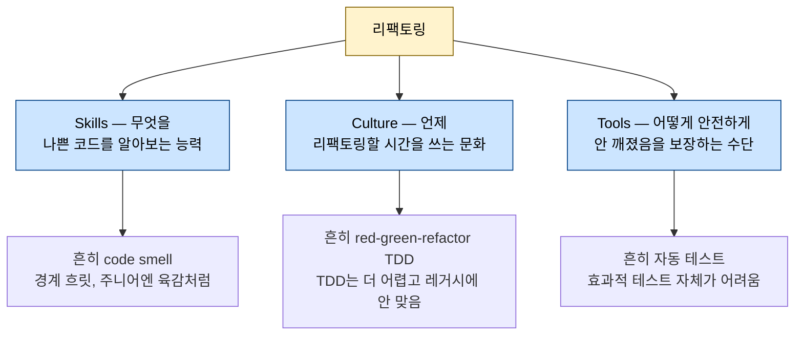
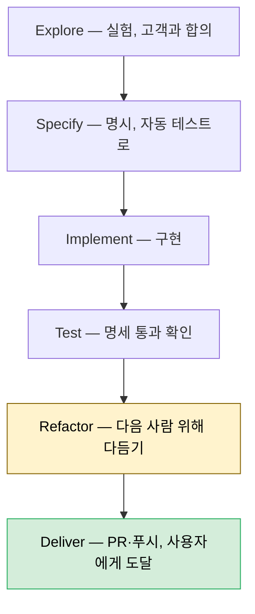

# 리팩토링 절차와 규칙

---

> [01-01.클린 코드 원칙](01-01.클린%20코드%20원칙.md)이 *좋은 코드의 기준*(네이밍·함수·주석 같은 미시 규칙)을 다뤘다면, 이 글은 그 기준에 *어떻게 도달하는가* — 즉 리팩토링의 방법론을 다룹니다. 흔히 리팩토링은 code smell과 단위 테스트로 가르쳐 진입장벽이 높지만, *Five Lines of Code*는 "한눈에 판정 가능한 규칙"으로 그 문턱을 낮춥니다. 무엇을·언제·어떻게 안전하게 리팩토링하는지를 규칙 기반으로 풀어, 주니어도 작은 연습으로 안전하게 시작할 수 있게 합니다.


## 학습 목표

> 리팩토링의 정의와 Skills·Culture·Tools 세 축, 6단계 워크플로, 그리고 테스트 없이도 안전하게 리팩토링하는 도구를 설명할 수 있는 것이 이 장의 목표입니다.

이 장을 다 읽고 다음 다섯 가지에 자신 있게 답할 수 있으면 학습이 완료됩니다.

1. 리팩토링의 정의("하는 일을 바꾸지 않고 코드를 바꾸기")와 좋은 코드의 정의를 말할 수 있습니다.
2. 리팩토링에 Skills·Culture·Tools 셋이 모두 필요한 이유를 설명할 수 있습니다.
3. code smell과 규칙(rule)의 차이, 그리고 규칙이 "보조바퀴"인 이유를 설명할 수 있습니다.
4. 6단계 워크플로(explore→deliver)와 레거시에서의 "먼저 쉽게 만들고 쉽게 바꾸기"를 말할 수 있습니다.
5. 테스트 대신 컴파일러·버전 관리·리팩토링 패턴으로 안전을 얻는 방법을 설명할 수 있습니다.


## 1. 리팩토링이란 — 하는 일을 바꾸지 않고 코드를 바꾸기

> 리팩토링은 가장 단순하게는 "하는 일을 바꾸지 않고 코드를 바꾸는 것"입니다. 그 목적이 *읽기 쉽고 유지보수 쉬운 코드*일 때, 우리는 그것을 좋은 코드라 부릅니다.

리팩토링의 가장 단순한 정의는 **"하는 일을 바꾸지 않고 코드를 바꾸는 것"**(changing code without changing what it does)입니다. 예를 들어 같은 식을 두 번 계산하던 코드를 지역 변수로 한 번만 계산하게 바꿉니다.

```typescript
// Before — 같은 식을 두 번 계산
return pow(base, exp / 2) * pow(base, exp / 2);

// After — 지역 변수로 추출(결과는 동일, 계산은 한 번)
let result = pow(base, exp / 2);
return result * result;
```

리팩토링하는 이유는 여럿입니다. 코드를 더 빠르게(위 예시), 더 작게, 더 일반적/재사용 가능하게, 그리고 **더 읽기 쉽고 유지보수하기 쉽게** 만드는 것입니다. 마지막 이유가 워낙 중요해서 우리는 그것을 *좋은 코드*와 동일시합니다.

> **정의 — 좋은 코드(Good code)**: 사람이 읽기 쉽고 유지보수가 쉬우며, 의도한 일을 정확히 수행하는 코드.

리팩토링은 *하는 일*을 바꾸면 안 되므로, 셋 중 "정확히 수행"은 이미 보장된 채로 둡니다. 그래서 리팩토링은 *읽기 쉬움·유지보수 쉬움*에 집중합니다.

> **정의 — 리팩토링(Refactoring)**: 하는 일을 바꾸지 않고 코드를 더 읽기 쉽고 유지보수하기 쉽게 바꾸는 것. (이 책이 다루는 리팩토링은 객체지향 언어에 크게 의존합니다.)

리팩토링이 중요한 이유는 셋입니다. 첫째는 경제성입니다. 프로그래머는 대부분의 시간을 코드를 *읽고 이해*하는 데 쓰지 *쓰는* 데 쓰지 않습니다. 복잡한 도메인에서 이해 없이 바꾸면 치명적 실패가 나기 때문입니다. 가독성을 높이면 새 기능에 쓸 시간이 늘어납니다. 둘째는 유지보수성입니다. 유지보수가 쉬우면 버그가 적고 고치기도 쉽습니다. 셋째는 즐거움입니다. 코드를 읽을 때 우리는 머릿속에 동작 모델을 세우는데, 한 번에 담아야 할 것이 많을수록 지칩니다. 처음부터 짜는 게 재밌고 디버깅이 끔찍한 이유가 여기 있습니다.


## 2. Skills·Culture·Tools — 리팩토링의 세 축

> 리팩토링은 무엇을(Skills)·언제(Culture)·어떻게 안전하게(Tools) 셋이 모두 있어야 가능합니다. 그래서 난이도 지형의 정중앙에 놓입니다.

소프트웨어 개발의 문제는 보통 Skills·Culture·Tools 중 무엇이 부족한지로 설명됩니다. 리팩토링은 정교한 작업이라 셋을 모두 요구하며, 그래서 지형의 정중앙에 놓입니다.



**Skills(무엇을)** 는 어떤 코드가 나빠서 고쳐야 하는지 아는 능력입니다. 경험 많은 프로그래머는 code smell 지식으로 판단하지만, smell의 경계가 흐릿하고 해석 여지가 커서 배우기 어렵습니다. 주니어에게는 스킬이라기보다 육감처럼 보입니다. **Culture(언제)** 는 리팩토링에 시간을 쓰도록 권하는 문화와 워크플로입니다. 흔히 TDD의 red-green-refactor 루프로 구현하지만, TDD 자체가 더 어려운 craft이고 레거시 코드베이스에는 잘 맞지 않습니다. **Tools(어떻게 안전하게)** 는 우리가 한 일이 안전한지 보장하는 수단입니다. 흔히 자동화 테스트로 달성하지만, 효과적인 자동 테스트를 배우는 것 자체가 어렵습니다.

이 책의 접근은 이 세 문턱을 모두 낮춥니다. 추상적 code smell 대신 *규칙*으로 Skills를, TDD 대신 *일반 워크플로*로 Culture를, 자동 테스트 대신 *컴파일러·버전 관리·패턴*으로 Tools를 대체합니다.


## 3. Skills — code smell 대신 규칙으로

> 무엇을 고칠지는 첫 진입장벽입니다. 추상적 code smell 대신 "메서드는 5줄을 넘으면 안 된다" 같은 한눈에 판정 가능한 규칙을 씁니다. 규칙은 보조바퀴라 완벽하진 않지만 시작점을 줍니다.

무엇을 리팩토링할지가 첫 진입장벽입니다. 보통은 **code smell**로 가르칩니다. smell은 "코드가 나쁠 수 있다"는 신호들로 강력하지만, 추상적이라 시작이 어렵고 감을 잡는 데 시간이 걸립니다. 이 책은 대신 **쉽게 알아보고 적용 가능한 규칙(rule)** 을 제시합니다. 규칙은 빠르게 배울 수 있습니다. 단 때로 너무 엄격해서 smelly하지 않은 코드도 고치게 하고, 드물게는 규칙을 따라도 smelly한 코드가 남습니다. 규칙과 smell의 겹침은 완전하지 않습니다.

차이를 예로 봅니다. 잘 알려진 code smell은 **"함수는 한 가지만 해야 한다"** 입니다. 좋은 가이드라인이지만 *한 가지*가 무엇인지 알기 어렵습니다. 아래 코드는 나누고·거듭제곱하고·곱하니 세 가지를 하는 걸까요, 아니면 숫자 하나만 반환하고 상태를 바꾸지 않으니 한 가지를 하는 걸까요? 판단에 경험이 필요합니다.

```typescript
let result = pow(base, exp / 2);
return result * result;
```

이에 비해 규칙은 **"메서드는 5줄을 넘으면 안 된다"**(Five Lines of Code, 상세는 후속 챕터)입니다. 한눈에 판정할 수 있고 더 물을 것이 없습니다. 명확하고 간결하며 기억하기 쉽습니다.

> **한계** — 규칙은 보조바퀴(training wheels)입니다. 모든 상황의 좋은 코드를 보장하지 못하고, 때로는 따르지 않는 게 맞습니다. 하지만 어디서 시작할지 모를 때 유용하고 좋은 리팩토링을 동기부여합니다. 규칙 이름은 *never* 같은 절대 표현으로 기억하기 쉽게 지었고, 상세 설명에 예외와 의도를 둡니다. 학습은 ①절대 이름만 → ②내재화 후 예외 → ③의도 순으로 올라가며, 그러면 coding guru가 됩니다.


## 4. Culture — 6단계 워크플로

> 리팩토링은 정기적으로 할 때 비용이 가장 적습니다. TDD의 red-green-refactor에 묶지 않고, explore부터 deliver까지 6단계 워크플로의 한 단계로 둡니다.

리팩토링은 정기적으로 할 때 가장 좋고 비용이 적습니다(Kent Beck: "리팩토링은 샤워하는 것과 같다"). 대부분의 문헌은 red-green-refactor를 권하지만 이는 리팩토링을 TDD에 묶습니다. 이 책은 둘을 분리해 리팩토링만 집중하려고, 어떤 작업에도 쓸 수 있는 **6단계 워크플로**를 권합니다.



처음에는 무엇을 만들지 확실치 않을 때가 많으므로 **Explore**(실험)로 시작해 고객과 합의합니다. 무엇을 만들지 알면 **Specify**(명시, 가능하면 자동 테스트)로 못 박고, **Implement**(구현)한 뒤 **Test**(명세 통과)하고, 전달 전에 **Refactor**(다음 사람이 작업하기 쉽게)하고, **Deliver**(PR·푸시로 사용자에게 도달)합니다. 규칙 기반이라 step5 리팩토링이 단순합니다. 규칙은 위반 메서드를 한눈에 찾게 설계됐고, 규칙마다 리팩토링 패턴이 연결돼 어떻게 고칠지 명확합니다. 패턴은 step-by-step이며 *컴파일 에러를 의도적으로 이용*해 실수를 막습니다.

레거시 시스템에서도 전체를 멈추고 다 고칠 필요가 없습니다. **"First make the change easy, then make the easy change"**(Kent Beck) — 새 것을 구현하기 전에 먼저 리팩토링해서 추가하기 쉽게 만듭니다. 베이킹 전에 재료를 다 준비하는 것과 같습니다. 다만 리팩토링이 늘 옳지는 않습니다. ①한 번 쓰고 지울 코드(XP의 spike) ②은퇴 직전 maintenance mode 코드 ③임베디드·게임 물리엔진처럼 엄격한 성능을 요구하는 코드 — 이 세 경우엔 리팩토링이 비용 대비 가치가 없을 수 있습니다. 그 외에는 리팩토링 투자가 현명한 선택입니다.


## 5. Tools — 테스트 없이 안전하게

> 자동 테스트는 빠르게 가도 안전하게 해주는 브레이크입니다. 새 스킬을 배우는 동안에는 빠르게 갈 필요가 없으므로, 리팩토링 패턴·버전 관리·컴파일러로 안전을 얻습니다.

자동 테스트를 좋아하지만 효과적으로 테스트하는 법 자체가 복잡한 스킬입니다. 이미 안다면 써도 좋고, 모른다면 걱정하지 않아도 됩니다. **자동 테스트는 자동차의 브레이크**와 같습니다. 천천히 가려고가 아니라 *빠르게 가도 안전하려고* 답니다. 그런데 리팩토링을 새로 배우는 동안에는 빠르게 갈 필요가 없습니다.

대신 다른 도구에 더 기댑니다. ①레시피 같은 상세 step-by-step 리팩토링 패턴 ②버전 관리 ③컴파일러입니다. 패턴을 아주 작은 단계로 신중히 수행하면 아무것도 깨지 않고 리팩토링할 수 있고, IDE가 대신 해줄 수 있는 경우 특히 그렇습니다. 테스트를 다루지 않는 대신 **컴파일러와 타입**으로 흔한 실수를 잡습니다. 그래도 작업 중인 애플리케이션을 정기적으로 열어 완전히 깨지지 않았는지 확인하고, 확인됐거나 컴파일러가 happy하면 **commit**합니다. 그러면 나중에 깨졌는데 즉시 고칠 방법을 모를 때 마지막으로 동작하던 시점으로 쉽게 되돌아갑니다.

> **주의** — 테스트 없는 실제 시스템도 리팩토링할 수 있지만, 확신을 어디선가 얻어야 합니다. IDE 리팩토링, 수동 테스트, 진짜 작은 단계 등입니다. 다만 이런 활동에 드는 추가 시간을 생각하면, 실제 시스템에서는 자동 테스트가 더 비용 효율적일 가능성이 큽니다. 이 책이 테스트 없이 진행하는 것은 *학습용 안전 환경*이기 때문이며, 테스트와 리팩토링을 따로 배우는 게 더 쉬워서 분리한 것입니다.


## 6. 규칙을 쓰는 법 — 따르다가 더 잘 알게 될 때까지

> 규칙은 절대 이름 → 예외 포함 설명 → 기저 code smell 이해 순으로 올라가며 *이해*를 쌓는 장치입니다. 그래서 자동 리팩토링 프로그램으로 대체할 수 없습니다.

이 책의 초점은 리팩토링 *입문*이지, 모든 상황의 프로덕션 규칙 제공이 아닙니다. 규칙을 쓰는 법은 ①먼저 이름을 배워 따르고 ②쉬워지면 예외가 담긴 설명을 익히고 ③그것으로 기저 code smell을 이해하는 것입니다. 이것이 자동 리팩토링 프로그램을 만들 수 없는 이유이기도 합니다. 규칙의 목적은 *이해를 구축*하는 것이기 때문입니다(규칙 기반으로 문제 영역을 하이라이트하는 플러그인 정도는 가능합니다). 한 줄로 줄이면 **"follow the rules until you know better"** — 더 잘 알게 될 때까지 규칙을 따릅니다.

이 책은 part1 내내 단일 예제(2D 블록 밀기 퍼즐 게임)를 리팩토링합니다. 한 코드베이스를 계속 쓰면 매 장 새 예제를 익힐 필요가 없습니다. 게임을 고른 이유는 수동 테스트 시 오동작을 직관으로 쉽게 알아챌 수 있어서입니다(로그를 보는 것보다 재밌습니다). 예제 코드는 이미 DRY·KISS를 지키지만 그래도 유쾌하지 않습니다 — 규칙으로 다듬기 전까지는요.


## 7. 실무 적용

> 우리 프로젝트의 커밋 게이트·외과적 변경 원칙은 이미 "리팩토링과 기능 변경을 분리"하는 이 책의 정신과 닿아 있습니다.

이 책의 6단계 워크플로에서 Refactor가 Deliver 직전 독립 단계인 점은, 포맷팅·로직을 한 커밋에 섞지 않는 외과적 변경 원칙과 같은 방향입니다. 리팩토링 커밋과 기능 커밋을 분리하면 리뷰어가 "동작이 그대로인가"와 "새 동작이 맞는가"를 따로 검증할 수 있습니다.

테스트 없이 컴파일러·버전 관리로 안전을 얻는 방식은 학습 환경의 선택입니다. 실무에서는 리팩토링 전에 회귀 테스트로 동작을 고정하는 편이 안전하며, 특히 레거시에서는 "First make the change easy"를 적용하기 전에 그 변경 지점을 덮는 최소한의 테스트부터 확보하는 게 현명합니다. 규칙(예: 메서드 5줄)은 보조바퀴이므로, 팀 컨벤션이 이미 있으면 그 컨벤션을 1순위로 두고 규칙은 시작점으로만 씁니다.


## 8. 면접 대비 Q&A

> 리팩토링 방법론 질문은 "리팩토링과 기능 변경의 경계", "테스트 없이 어떻게 안전한가" 같은 *원칙의 빈틈*을 파고듭니다.

### Q1. 리팩토링의 정의는 무엇인가요?

"하는 일을 바꾸지 않고 코드를 바꾸는 것"입니다. 이 책의 좁은 정의로는 하는 일을 바꾸지 않고 코드를 더 읽기 쉽고 유지보수하기 쉽게 바꾸는 것입니다. *동작 불변*이 핵심이라, 기능 추가·버그 수정과는 분리된 작업입니다.

### Q2. 리팩토링에 Skills·Culture·Tools가 모두 필요한 이유는?

무엇을 고칠지 알아야 하고(Skills), 고칠 시간을 쓰는 문화가 있어야 하며(Culture), 고친 게 안전한지 보장할 수단이 있어야(Tools) 실제로 리팩토링이 일어나기 때문입니다. 셋 중 하나만 빠져도 — 가령 시간은 있는데 안전 수단이 없으면 — 리팩토링이 위험해지거나 미뤄집니다.

### Q3. code smell과 규칙(rule)은 무엇이 다른가요?

code smell은 "코드가 나쁠 수 있다"는 추상적 신호라 경계가 흐릿하고 판단에 경험이 필요합니다. 규칙은 "메서드 5줄 초과 금지"처럼 한눈에 판정 가능합니다. 규칙은 보조바퀴라 완벽하진 않지만(너무 엄격하거나 드물게 놓침) 시작점을 주고, 익히면 예외와 기저 smell 이해로 올라갑니다.

### Q4. 6단계 워크플로에서 리팩토링은 어디에 있나요?

Explore→Specify→Implement→Test→**Refactor**→Deliver 중 Deliver 직전입니다. 전달 전에 다음 사람이 작업하기 쉽게 다듬는 단계입니다. 레거시에서는 새 기능 구현 *전에* 먼저 리팩토링하는 "First make the change easy, then make the easy change"도 씁니다.

### Q5. 테스트 없이 어떻게 안전하게 리팩토링하나요?

레시피 같은 step-by-step 리팩토링 패턴을 아주 작은 단계로 수행하고, 컴파일러·타입으로 흔한 실수를 잡으며, 동작 확인 후 commit해 되돌릴 지점을 남깁니다. 단 이는 학습용 안전 환경의 선택이고, 실제 시스템에서는 회귀 테스트가 더 비용 효율적일 가능성이 큽니다.


## 관련 문서

> 이 글이 리팩토링의 *방법론*이라면, 도달할 목표인 좋은 코드의 기준과 설계 원칙은 아래 문서가 맡습니다.

- [01-01.클린 코드 원칙](01-01.클린%20코드%20원칙.md) — 리팩토링이 도달하려는 *좋은 코드의 기준*(네이밍·함수·주석 미시 규칙). 특히 §10 점진적 개선과 짝
- [../java/03_DesignPatterns/01-01.SOLID 원칙](../java/03_DesignPatterns/01-01.SOLID%20원칙.md) — 클래스·모듈 단위 거시 설계 원칙
- [../java/03_DesignPatterns/02-01.일급객체 사상과 Java 코드 스타일](../java/03_DesignPatterns/02-01.일급객체%20사상과%20Java%20코드%20스타일.md) — Java 코드 스타일로 본 좋은 코드 표현
