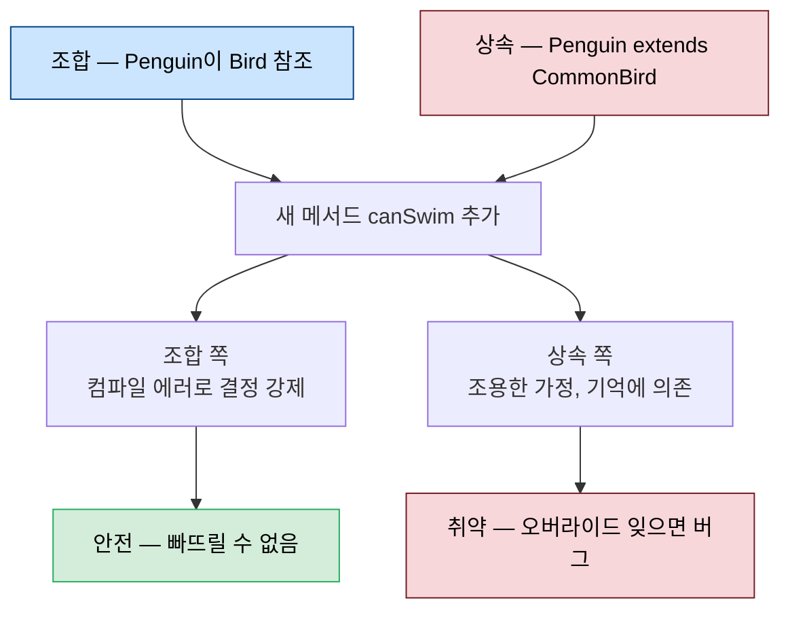
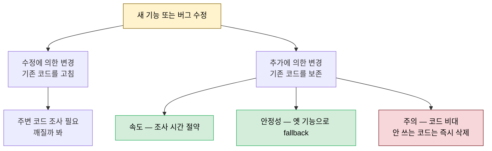

# 리팩토링의 기술적 토대

---

> [02-01.리팩토링 절차와 규칙](02-01.리팩토링%20절차와%20규칙.md)이 리팩토링을 *어떻게 일하는가*(절차·규칙·문화)로 다뤘다면, 이 글은 리팩토링이 *기술적으로 무엇을 좋게 만드는가*를 다룹니다. 리팩토링의 정의 "하는 일을 바꾸지 않고 코드를 바꾸기"를 가독성·유지보수성이라는 두 축으로 분해하고, 유지보수성을 무너뜨리는 전역 상태와 불변식을 짚은 뒤, 상속보다 조합을 택해 "추가에 의한 변경"으로 가는 길을 설명합니다. 같은 *Five Lines of Code* 2장이 출처입니다.


## 학습 목표

> 가독성과 유지보수성이 각각 무엇인지, 전역 상태와 불변식이 왜 위험한지, 그리고 상속보다 조합이 어떻게 "추가에 의한 변경"을 가능하게 하는지를 설명할 수 있는 것이 이 장의 목표입니다.

이 장을 다 읽고 다음 다섯 가지에 자신 있게 답할 수 있으면 학습이 완료됩니다.

1. 가독성(의도 전달)과 유지보수성(조사해야 하는 양)을 각각 정의할 수 있습니다.
2. 전역 상태와 불변식이 시스템을 취약하게 만드는 과정을 예로 설명할 수 있습니다.
3. "불변식 지역화 — 함께 변하는 것은 함께 둔다"가 무슨 뜻인지 말할 수 있습니다.
4. 리팩토링이 성능은 바꿔도 되는 이유와 블랙박스 scope를 설명할 수 있습니다.
5. 상속보다 조합을 택하면 왜 "추가에 의한 변경"과 속도·유연성·안정성을 얻는지 설명할 수 있습니다.


## 1. 코드를 더 좋게 — 가독성과 유지보수성

> 리팩토링은 "코드를 더 좋게" 만들되 "하는 일은 안 바꾸는" 작업입니다. "더 좋게"의 두 축이 가독성과 유지보수성입니다.

리팩토링의 정의는 *하는 일을 바꾸지 않고 코드를 더 좋게 만드는 것*입니다. 여기서 "더 좋게"가 가리키는 두 축이 가독성과 유지보수성입니다.

**가독성(Readability)** 은 코드가 *의도를 전달하는 능력*입니다. 코드가 의도대로 동작한다고 가정하면, 그것이 무엇을 하는지 알아내기가 쉽다는 뜻입니다. 의도를 전달하는 수단은 여럿입니다. 컨벤션을 두고 따르기, 주석, 변수·메서드·클래스·파일의 네이밍, 공백 사용 등입니다. 아래는 이 수단을 전부 어긴 코드와 지킨 코드의 대비입니다.

```typescript
// 읽기 어려운 코드 — 거의 모든 의도 전달 수단을 어김
function checkValue(str: boolean) {   // boolean인데 파라미터명이 str
  // Check value                      // 이름만 반복하는 주석
  if (str !== false)                  // 이중 부정이라 읽기 어려움
    // return                         // 코드만 반복하는 주석
    return true;
  else; // otherwise                  // 놓치기 쉬운 세미콜론 + trivial 주석
    return str;                       // 오해 부르는 들여쓰기, 여기서 str은 false뿐
}
```

```typescript
// 읽기 쉬운 코드 — 같은 동작
function isTrue(bool: boolean) {
  if (bool)
    return true;
  else
    return false;
}

// 더 단순화하면 의도가 한눈에
function isTrue(bool: boolean) {
  return bool;
}
```

**유지보수성(Maintainability)** 은 기능을 바꿀 때 — 버그를 고치든 기능을 더하든 — *우리가 얼마나 조사해야 하는가*의 표현입니다. 변경 전에 우리는 보통 새 코드가 들어갈 맥락을 살핍니다. 지금 무엇을 하는지 파악하고, 어떻게 안전하고 빠르게 바꿀지 가늠합니다. 읽고 포함할 코드가 많을수록 시간이 더 들고 무언가를 놓칠 확률이 높아집니다. 그래서 유지보수성은 변경에 내재된 위험과 직결됩니다. 조사 단계가 길다는 것은 유지보수성이 나쁘다는 증상입니다.


## 2. 취약한 시스템 — 전역 상태와 불변식

> 한 곳을 바꾸면 무관해 보이는 다른 곳이 깨지는 시스템을 취약하다고 합니다. 그 뿌리는 전역 상태와, 코드가 명시적으로 확인하지 않는 속성인 불변식입니다.

어떤 시스템에서는 한 곳을 바꾸면 전혀 상관없어 보이는 곳이 깨집니다. 온라인 상점에서 추천 기능을 손봤는데 결제 서브시스템이 깨지는 식입니다. 이런 시스템을 **취약하다(fragile)** 고 부릅니다.

취약성의 뿌리는 보통 **전역 상태(global state)** 입니다. 여기서 *전역*은 우리가 지금 보는 범위의 바깥을 뜻합니다. 메서드의 관점에서는 필드가 전역입니다. 상태(state)는 프로그램이 도는 동안 변할 수 있는 모든 것 — 변수, 데이터베이스의 데이터, 디스크의 파일, 하드웨어까지 포함합니다. 전역 상태를 가늠하는 유용한 트릭은 중괄호 `{ ... }` 를 보는 것입니다. 중괄호 바깥의 모든 것이 그 안쪽 코드에게는 전역 상태입니다.

전역 상태가 위험한 이유는 우리가 데이터에 속성을 *연관시키기* 때문입니다. 코드에서 명시적으로 확인하지 않는(또는 assertion으로만 확인하는) 속성을 **불변식(invariant)** 이라 부릅니다. "이 숫자는 절대 음수가 안 된다", "이 파일은 분명히 존재한다"가 그 예입니다. 데이터가 전역이면, *다른 속성을 가정하는* 누군가가 그 데이터를 만지면서 우리 속성을 의도치 않게 깰 수 있습니다. 시스템이 바뀌고 프로그래머가 잊고 새 사람이 합류하면, 불변식을 끝까지 지키기란 거의 불가능합니다.

```typescript
// 식료품점 — daysUntilExpiry는 항상 양수라는 불변식이 생김
// 매일 1씩 빼고 0이 되면 자동 제거하기 때문
item.daysUntilExpiry -= 1;

// 그 불변식을 믿고 urgency를 계산 (0으로 나눌 일 없다고 가정)
const urgency = item.value / item.daysUntilExpiry;
```

2년 뒤 유통기한 없는 전구를 추가합니다. 0을 빼면 -1이 되는 그 기능을 기억해 `daysUntilExpiry`를 0으로 시작하도록 둡니다(빼고 나면 0이 안 되게). 그런데 **불변식은 완전히 잊습니다.** 전구의 urgency를 계산하는 순간 시스템이 `Error: Division by zero`로 무너집니다. 불변식이 코드의 *다른 곳*에 떨어져 있어서, 새 코드를 짤 때 보이지 않았던 것입니다.

속성을 명시적으로 확인해 불변식을 없앨 수도 있지만, 그것은 *하는 일을 바꾸는* 일이라 리팩토링이 할 수 없습니다(다음 절). 대신 리팩토링은 불변식을 *서로 가까이 옮겨* 보이게 만듭니다. 이것을 **불변식 지역화(localizing invariants)** 라 부릅니다 — *함께 변하는 것은 함께 둔다(things that change together should be together).*


## 3. 하는 일을 바꾸지 않는다 — 블랙박스와 scope

> 리팩토링은 코드를 블랙박스로 보고 바깥에서 구별되지 않게 둡니다. 단 성능은 예외이며, 블랙박스의 경계를 얼마나 넓게 잡을지가 scope 결정입니다.

"코드가 무엇을 하는가"는 다소 형이상학적인 질문입니다. 첫 직관은 코드를 블랙박스로 보는 것입니다. 바깥에서 구별되지 않는 한 안은 바꿔도 됩니다. 같은 값을 넣으면 리팩토링 전후로 같은 결과가 나와야 하고, 그 결과가 예외라도 같은 예외여야 합니다.

여기에는 주목할 예외가 하나 있습니다. **성능은 바꿔도 됩니다.** 리팩토링 중 코드가 느려지는 것은 보통 신경 쓰지 않습니다. 이유는 둘입니다. 첫째, 대부분의 시스템에서 성능은 가독성·유지보수성보다 덜 가치 있습니다. 둘째, 성능이 중요하다면 리팩토링과 *분리된 단계*에서 프로파일링 도구나 성능 전문가의 안내로 다뤄야 합니다.

리팩토링할 때는 블랙박스의 경계를 정해야 합니다. 얼마나 많은 코드를 바꿀 의도인가입니다. 더 많이 포함할수록 더 많은 것을 바꿀 수 있습니다. 이는 협업에서 특히 중요합니다. 우리가 리팩토링하는 코드를 다른 사람이 건드리면 끔찍한 머지 충돌이 납니다. 사실상 리팩토링 중인 코드를 *예약(reserve)* 해 아무도 못 바꾸게 하는 셈이라, 예약하는 코드가 적을수록 충돌 위험이 낮아집니다. 그래서 적절한 scope를 정하는 일은 어렵고 중요한 균형 잡기입니다.

> **리팩토링의 세 기둥** — ① 의도를 전달해 가독성을 높이고, ② 불변식을 지역화해 유지보수성을 높이며, ③ 이 둘을 *우리 scope 바깥 코드에 영향을 주지 않고* 수행합니다.


## 4. 상속보다 조합 — 추가에 의한 변경

> 비지역 불변식을 우연히 끌어들이는 흔한 길이 상속입니다. GoF가 1994년에 이미 "상속보다 조합을 선호하라"고 권했고, 조합은 "추가에 의한 변경"으로 이어집니다.

비지역 불변식이 유지보수를 어렵게 한다는 것은 새로운 얘기가 아닙니다. **Gang of Four**(Erich Gamma·Richard Helm·Ralph Johnson·John Vlissides)가 1994년 *Design Patterns*에서 이미 짚었습니다. 비지역 불변식을 우연히 끌어들이는 흔한 길이 **상속(inheritance)** 이고, 그들의 유명한 권고가 그 회피법입니다 — **"Favor object composition over inheritance."**(상속보다 객체 조합을 선호하라.) 객체가 다른 객체의 참조를 갖는 것이 조합입니다.

```typescript
// 상속 — Penguin이 CommonBird를 확장
class CommonBird implements Bird {
  hasBeak() { return true; }
  canFly() { return true; }
}
class Penguin extends CommonBird {
  canFly() { return false; }
}
```

```typescript
// 조합 — Penguin이 CommonBird를 참조하고 호출을 수동으로 위임
class Penguin implements Bird {
  private bird = new CommonBird();
  hasBeak() { return this.bird.hasBeak(); } // 수동 forward
  canFly() { return false; }
}
```

차이는 변경이 닥칠 때 드러납니다. Bird에 새 메서드 `canSwim`을 추가하고 CommonBird에 구현을 둔다고 합시다. **조합** 쪽에서는 Penguin이 새 메서드를 구현하지 않아 *컴파일 에러*가 납니다. 그래서 우리는 펭귄이 수영하는지를 직접 *결정*해야 합니다. 다른 새처럼 굴게 하려면 `hasBeak`처럼 trivial하게 위임하면 됩니다. 반면 **상속** 쪽에서는 Penguin이 수영을 못한다고 *조용히 가정*해 버립니다. 우리는 `canSwim`을 오버라이드해야 한다는 것을 *기억*해야만 합니다. 사람의 기억은, 특히 새 기능에 정신이 팔려 있을 때, 취약한 의존성입니다.

조합 기반 시스템은 코드를 훨씬 세밀하게 조합하고 재사용하게 합니다. 조합을 많이 쓰는 시스템을 다루는 것은 LEGO 블록 놀이와 같습니다. 모든 것이 맞물리게 만들어지면 부품을 갈아 끼우거나 기존 컴포넌트를 조합해 새것을 빠르게 만들 수 있습니다. 이 **유연성(flexibility)** 은 대부분의 시스템이 원 개발자가 상상하지 못한 방식으로 쓰이게 된다는 점에서 중요합니다.



조합의 가장 큰 이점은 **추가에 의한 변경(change by addition)** 입니다. 기존 기능에 영향을 주지 않고 — 때로는 기존 코드를 *전혀 건드리지 않고* — 기능을 더하거나 바꿀 수 있다는 뜻입니다. 이것이 곧 **개방-폐쇄 원칙(open-closed principle)** 입니다. 컴포넌트는 확장(추가)에 열려 있고 수정에는 닫혀 있어야 합니다.



추가에 의한 변경은 두 이점을 더 줍니다. **속도** 측면에서, 새 구현이나 버그 수정 때 보통 깨질까 봐 주변 코드부터 살피는데, 다른 코드를 건드리지 않고 바꿀 수 있으면 그 시간을 통째로 아낍니다. 단 계속 추가만 하면 코드베이스가 빠르게 비대해지니, 어느 코드가 쓰이고 안 쓰이는지 각별히 보고 *안 쓰는 코드는 가능한 빨리 삭제*해야 합니다. **안정성** 측면에서는, 추가 마인드셋이면 항상 기존 코드를 보존할 수 있어 새 코드가 실패하면 옛 기능으로 fallback하게 만들기 쉽습니다. 그래서 기존 기능에 새 에러를 들이지 않습니다. 불변식 지역화로 에러가 적은 것과 합쳐져 시스템이 훨씬 안정됩니다.


## 5. 리팩토링과 일상 업무 — 기술 부채와 보이스카우트 규칙

> 리팩토링하지 않은 코드를 전달하면 다음 사람의 시간을 빌리는 것이고, 나쁜 아키텍처에는 이자가 붙습니다. 이것이 기술 부채입니다.

리팩토링은 모든 프로그래머의 일상이어야 합니다. 리팩토링하지 않은 코드를 전달하면 다음 프로그래머에게서 시간을 빌리는 셈이고, 더 나쁜 것은 나쁜 소프트웨어 아키텍처에 *이자율*이 붙는다는 점입니다. 그래서 이를 **기술 부채(technical debt)** 라 부릅니다. 권장하는 일상 리팩토링은 두 갈래입니다. 레거시 시스템에서는 변경하기 *전에* 먼저 리팩토링하고 그다음 일반 워크플로를 따릅니다. 그리고 코드를 변경한 *후에* 리팩토링합니다. 전달 전에 반드시 리팩토링하는 이 태도를 **보이스카우트 규칙(The Boy Scout rule)** 이라 부릅니다 — *Always leave a place better than you found it*(있던 곳을 떠날 때 더 좋게 두라).

리팩토링은 배우는 데 시간이 들지만 결국 자동화됩니다. 좋은 코드의 이점을 직접 겪으면 코드를 쓰고 생각하는 방식이 바뀝니다. 안정성이 생기면 그것을 활용할 방법 — 배포 빈도를 높이거나, 유연성으로 설정 관리·feature-toggling 시스템을 짓는 것 — 을 떠올리게 됩니다. 리팩토링은 코드를 공부하는 완전히 다른 방법이기도 합니다. 이해하는 데 며칠 걸릴 코드라도, 리팩토링으로 조금씩 소화하다 보면 최종 결과가 읽기 쉬워집니다(이해 없이도 개선이 가능하다는 것은 후속 챕터에서 보입니다).


## 6. 소프트웨어의 도메인

> 소프트웨어는 항상 실세계의 어떤 측면을 모델링하며, 그 실세계 대응물을 도메인이라 부릅니다. 도메인에는 사용자·언어·문화가 따라옵니다.

소프트웨어는 실생활의 특정 측면을 모델링합니다. 프로세스를 자동화하거나 실세계 사건을 추적·시뮬레이션하는 식으로, 항상 실세계 대응물이 있습니다. 이 실세계 대응물을 **도메인(domain)** 이라 부르며, 도메인에는 사용자와 전문가, 고유한 언어, 고유한 문화가 따라옵니다. 책의 예제 도메인인 2D 퍼즐 게임에서는 플레이어가 사용자, 게임·레벨 디자이너가 도메인 전문가입니다. 플레이어가 "eat"할 수 있는 "flux" 같은 고유 언어가 있고, 일부 객체는 중력의 영향을 받고(돌·박스) 일부는 받지 않는다(열쇠·플레이어)는 기대 같은 문화가 있습니다. 개발할 때 우리는 도메인 전문가와 밀접하게 일하며 그들의 언어와 문화를 배워야 합니다. 프로그래밍 언어는 모호함을 허용하지 않으므로, 전문가조차 모르는 corner case를 탐색해야 할 때도 있습니다. 결국 프로그래밍은 주로 학습과 소통입니다.


## 7. 실무 적용

> 우리 프로젝트의 JPA 불변식 보호·Aggregate 경계 결정은 이미 "불변식 지역화"의 구체적 사례입니다.

불변식 지역화는 도메인 설계에서 이미 익숙한 결정입니다. DDD의 Aggregate가 "한 트랜잭션 안에서 어떤 불변식을 함께 지킬 것인가"의 경계라는 것이 같은 발상입니다 — 함께 지켜야 할 불변식을 한 Root 안에 모아 외부가 우회하지 못하게 합니다. JPA에서 `@Version` 영역에 native SQL이 침범하면 stale version으로 락이 깨지는 사고도, 같은 불변식을 만지는 코드가 떨어져 있을 때 생기는 전형적 취약성입니다.

상속보다 조합은 Spring 코드에서 전략 주입으로 자주 나타납니다. 정책을 인터페이스로 분리해 주입하면 도메인 본체를 수정하지 않고 구현만 갈아 끼워 동작을 바꿉니다 — 추가에 의한 변경이자 개방-폐쇄 원칙의 실현입니다. 다만 "안 쓰는 코드는 즉시 삭제"는 실무에서 특히 지키기 어렵습니다. fallback용으로 남긴 옛 경로가 죽은 코드로 굳기 쉬우므로, 추가에 의한 변경을 택했다면 사용처를 주기적으로 점검해야 합니다.


## 8. 면접 대비 Q&A

> 기술적 토대 질문은 "가독성과 유지보수성의 차이", "상속과 조합 중 무엇을 언제" 같은 *원리의 경계*를 파고듭니다.

### Q1. 가독성과 유지보수성은 어떻게 다른가요?

가독성은 코드가 *의도를 전달하는 능력*입니다. 코드가 의도대로 동작한다고 가정할 때 무엇을 하는지 알아내기 쉬운 정도입니다. 유지보수성은 기능을 바꿀 때 *얼마나 조사해야 하는가*입니다. 조사할 코드가 많을수록 시간이 들고 놓칠 위험이 커지므로, 유지보수성은 변경에 내재된 위험과 직결됩니다.

### Q2. 시스템이 취약(fragile)하다는 것은 무슨 뜻이고 원인은?

한 곳을 바꾸면 무관해 보이는 다른 곳이 깨지는 시스템입니다. 원인은 보통 전역 상태입니다. 우리가 보는 범위 바깥의 데이터에 누군가 *다른 속성을 가정*하고 접근하면, 우리가 명시적으로 확인하지 않는 속성 — 불변식 — 이 의도치 않게 깨지기 때문입니다.

### Q3. 불변식 지역화(localizing invariants)란?

코드가 명시적으로 확인하지 않는 속성이 불변식입니다(예: "이 값은 음수가 안 된다"). 불변식을 만지는 코드가 서로 떨어져 있으면 한쪽을 고치다 다른 쪽을 깨기 쉽습니다. 리팩토링은 동작을 못 바꾸므로 불변식을 *없애지는* 못하지만, 서로 *가까이 옮겨* 보이게 만듭니다. 한마디로 "함께 변하는 것은 함께 둔다"입니다.

### Q4. 리팩토링이 성능은 바꿔도 되는 이유는?

리팩토링은 코드를 블랙박스로 보고 바깥에서 구별되지 않게 두지만, 성능은 그 예외입니다. 대부분의 시스템에서 성능은 가독성·유지보수성보다 덜 가치 있고, 성능이 중요하면 프로파일링 도구가 안내하는 *분리된 최적화 단계*에서 다뤄야 하기 때문입니다.

### Q5. 상속보다 조합을 택하면 무엇을 얻나요?

조합은 객체가 다른 객체의 참조를 갖는 구조라, 새 메서드가 생기면 컴파일 에러로 *결정을 강제*합니다. 상속은 조용히 가정해 오버라이드를 기억에 맡깁니다. 조합은 또 "추가에 의한 변경"을 가능하게 해 — 기존 코드를 안 건드리고 기능을 더해 — 개발 속도(조사 시간 절약), 유연성(LEGO처럼 조합), 안정성(옛 기능 fallback)을 얻습니다. 이것이 개방-폐쇄 원칙입니다.


## 관련 문서

> 이 글이 리팩토링의 *기술적 토대*라면, 그 위에서 일하는 절차와, 가독성·설계 원칙의 디테일은 아래 문서가 맡습니다.

- [02-01.리팩토링 절차와 규칙](02-01.리팩토링%20절차와%20규칙.md) — 같은 책의 *어떻게 일하는가*(Skills·Culture·Tools·6단계 워크플로). 이 글의 기술 원리를 실제 작업 흐름에 얹는 단계
- [02-03.긴 함수 쪼개기](02-03.긴%20함수%20쪼개기.md) — 이 글 §4의 가독성·상속보다 조합을 실제 코드에서 실행하는 첫 규칙(Five lines)과 패턴(Extract method)
- [02-04.타입 코드를 다형성으로](02-04.타입%20코드를%20다형성으로.md) — 이 글 §4 상속보다 조합·추가에 의한 변경을 if·switch 제거로 밀어붙인 규칙(late binding·Only inherit from interfaces)
- [01-01.클린 코드 원칙](01-01.클린%20코드%20원칙.md) — §1 의미 있는 이름·§3 주석은 이 글 §1의 *가독성(의도 전달)*을 줄 단위 규칙으로 푼 디테일
- [../java/03_DesignPatterns/01-01.SOLID 원칙](../java/03_DesignPatterns/01-01.SOLID%20원칙.md) — §OCP가 이 글 §4의 *개방-폐쇄 원칙*을, §LSP가 상속의 올바른 사용 기준을 다룸
