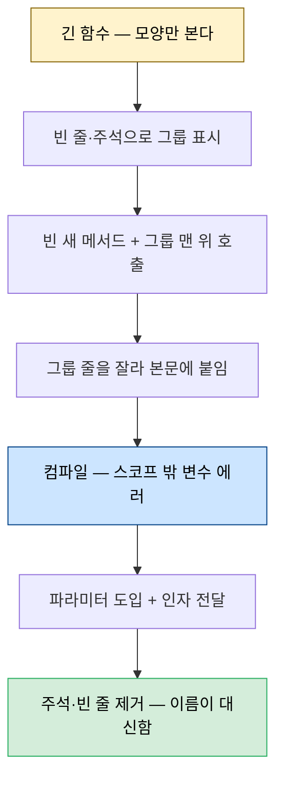
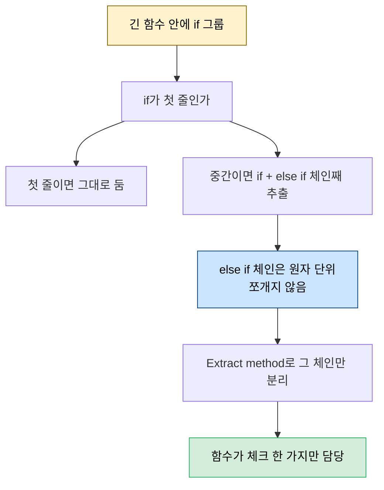

# 긴 함수 쪼개기 — Five lines·Extract method

---

> [02-01.리팩토링 절차와 규칙](02-01.리팩토링%20절차와%20규칙.md)이 *어떻게 일하는가*, [02-02.리팩토링의 기술적 토대](02-02.리팩토링의%20기술적%20토대.md)가 *무엇을 좋게 만드는가*였다면, 이 글은 그 둘을 *실제로 실행하는 첫 규칙과 패턴*을 다룹니다. "메서드는 5줄을 넘지 않는다"는 한눈에 판정 가능한 규칙으로 너무 긴 함수를 찾아내고, Extract method라는 기계적 절차로 안전하게 쪼갭니다. 거기에 추상화 수준을 맞추는 Either call or pass, if를 격리하는 if only at the start까지 — 네 규칙이 모두 Extract method 하나로 풀립니다. *Five Lines of Code* 3장이 출처입니다.


## 학습 목표

> Five lines 규칙이 왜 5줄인지, Extract method를 코드의 세부를 안 보고도 안전하게 수행하는 법, 그리고 Either call or pass·if only at the start로 추상화 수준과 if를 어떻게 정리하는지를 설명할 수 있는 것이 이 장의 목표입니다.

이 장을 다 읽고 다음 다섯 가지에 자신 있게 답할 수 있으면 학습이 완료됩니다.

1. Five lines 규칙의 줄 세는 법과 "왜 하필 5줄"인지(근본 자료구조 1회 순회)를 말할 수 있습니다.
2. Extract method를 컴파일러에 기대 안전하게 수행하는 절차를 설명할 수 있습니다.
3. 메서드 이름이 "최소 5줄마다 주석을 다는 것"과 같다는 말의 뜻을 설명할 수 있습니다.
4. Either call or pass가 추상화 수준 혼재를 어떻게 막는지 예로 들 수 있습니다.
5. if only at the start와 "else if 체인은 쪼갤 수 없는 원자 단위"의 관계를 설명할 수 있습니다.


## 1. Five lines — 왜 5줄인가

> 가장 근본 규칙은 "메서드는 5줄을 넘지 않는다"입니다. 구체적 한계값보다 *한계가 있다는 것*이 중요하고, 그 값은 근본 자료구조를 한 번 순회하는 데 필요한 만큼으로 잡습니다.

이 책의 가장 근본 규칙은 **Five lines** — 어떤 메서드도 5줄을 넘지 않는다는 것입니다. 여기서 줄(statement)은 `if`·`for`·`while`, 또는 세미콜론으로 끝나는 것(할당·메서드 호출·return 등)을 뜻합니다. 공백과 중괄호 `{` `}` 는 세지 않습니다. 어떤 메서드든 이 규칙에 맞출 수 있습니다. 20줄 메서드라면 앞 10줄과 뒤 10줄을 각각 헬퍼로 빼고 원본을 두 줄(헬퍼 두 개 호출)로 만들면 됩니다. 이를 반복하면 각 메서드가 두 줄까지 줄어듭니다.

구체적 한계값 자체보다 *한계가 있다는 것*이 중요합니다. 경험상 그 값은 **근본 자료구조를 한 번 순회하는 데 필요한 만큼**으로 잡으면 잘 맞습니다. 2D 세팅에서는 근본 자료구조가 2D 배열이고, 2D 배열을 한 번 순회하는 코드가 정확히 5줄입니다.

```typescript
// 2D 배열에 짝수가 있는지 — 정확히 5줄(이중 for + if-return + return)
function containsEven(arr: number[][]) {
  for (let x = 0; x < arr.length; x++) {
    for (let y = 0; y < arr[x].length; y++) {
      if (arr[x][y] % 2 === 0) {
        return true;
      }
    }
  }
  return false;
}
```

긴 메서드 자체가 smell입니다. 모든 로직을 한 번에 머리에 담아야 하기 때문입니다. "얼마나 길면 긴가"라는 물음은 다른 smell "메서드는 한 가지만 해야 한다"에서 답을 빌립니다. 5줄이 *의미 있는 한 가지*에 딱 필요한 만큼이라면, 이 한계가 그 smell도 막아 줍니다. 방치하면 메서드는 기능이 붙으며 시간이 지날수록 커지고 이해하기 어려워지는데, 크기 한계가 그 미끄러짐을 막습니다.

> **핵심** — 5줄짜리 메서드 넷이 20줄짜리 하나보다 훨씬 빨리 이해됩니다. 각 메서드의 *이름*이 의도를 전달할 기회이기 때문입니다. 그래서 **메서드 네이밍은 최소 5줄마다 주석을 다는 것과 동등**합니다. 작은 메서드 이름을 잘 지으면 큰 함수의 이름을 찾기도 쉬워집니다.


## 2. Extract method — 안전하게 함수를 쪼개기

> 코드가 *무엇을 하는지* 들여다보지 않고 *모양*만 보고 같은 일에 관련된 줄을 묶습니다. 그 묶음을 컴파일러에 기대 기계적으로 추출하면 거의 깨지지 않습니다.

긴 함수를 처음 이해할 때는 함수 *이름*부터 봅니다. 모든 줄을 이해하려 들면 시간이 들고 비생산적입니다. 대신 코드의 *모양(shape)* 을 보고 같은 일에 관련된 줄을 그룹으로 묶습니다. 그룹 사이에 빈 줄을 넣고, 가끔 기억을 돕는 주석을 답니다. 평소엔 주석을 피하지만(낡거나 나쁜 코드의 데오도란트가 되기 쉬우므로) 여기 주석은 *임시*입니다. "코끼리를 먹는 법은 한 입씩"이라는 말처럼, 함수 전체를 소화하지 않고 잘라 작고 쉬운 조각씩 처리합니다.

게임의 `draw` 함수를 예로 듭니다. 세부를 안 봐도 `// Draw map`·`// Draw player` 두 그룹이 보입니다. 각 그룹을 ① 빈 새 메서드를 만들고 ② 주석 자리에 호출을 넣고 ③ 그룹의 줄을 잘라 본문으로 붙이는 식으로 추출합니다.

```typescript
// Before — draw가 map 그리기와 player 그리기를 한 함수에서 다 함
function draw() {
  let canvas = document.getElementById("GameCanvas") as HTMLCanvasElement;
  let g = canvas.getContext("2d");
  g.clearRect(0, 0, canvas.width, canvas.height);

  // Draw map  (이하 이중 for + fillStyle 분기 + fillRect)
  // Draw player  (fillStyle red + fillRect)
}
```

```typescript
// After — 주석을 메서드 이름으로 바꾸니 주석이 사라짐
function draw() {
  let canvas = document.getElementById("GameCanvas") as HTMLCanvasElement;
  let g = canvas.getContext("2d");
  g.clearRect(0, 0, canvas.width, canvas.height);
  drawMap(g);
  drawPlayer(g);
}
// drawMap·drawPlayer는 g를 파라미터로 받아 원래 줄을 그대로 가짐
```

추출하면 `g`가 스코프 밖이라 컴파일 에러가 납니다. 원래 위치에서 `g`의 타입을 확인해 `drawMap`에 `g: CanvasRenderingContext2D` 파라미터로 도입하고, 호출부에 `g`를 인자로 넘기면 에러가 풀립니다. 줄을 옮기기만 하므로 에러 위험이 적고, 파라미터를 빠뜨리면 컴파일러가 알려 줍니다. 주석을 메서드 이름으로 옮겼으니 주석과 그룹용 빈 줄을 제거합니다.



추출한 줄이 어떤 파라미터에 *할당*하면 한 단계가 더 붙습니다. 새 메서드 끝에 `return p;`를 두고 호출부를 `p = newMethod(...);`로 받습니다. 아래는 2D 배열 최솟값을 찾는 `minimum`에서 비교·할당 줄을 `min`으로 빼는 과정입니다.

```typescript
// Before
function minimum(arr: number[][]) {
  let result = Number.POSITIVE_INFINITY;
  for (let x = 0; x < arr.length; x++)
    for (let y = 0; y < arr[x].length; y++)
      if (result > arr[x][y])      // 이 두 줄을 추출
        result = arr[x][y];
  return result;
}
```

```typescript
// After — result에 할당하므로 return result + 호출부 result = min(...)
function minimum(arr: number[][]) {
  let result = Number.POSITIVE_INFINITY;
  for (let x = 0; x < arr.length; x++)
    for (let y = 0; y < arr[x].length; y++)
      result = min(result, arr, x, y);
  return result;
}
function min(result: number, arr: number[][], x: number, y: number) {
  if (result > arr[x][y])
    result = arr[x][y];
  return result;      // 추출 줄이 result에 할당했으므로 되돌려 줌
}
```

> **한계** — `Math.min`이나 `arr[x][y]`를 인자로 넘기면 더 예뻐 보일 수 있고, 안전하게 갈 수 있다면 그것도 좋습니다. 하지만 이 절차의 교훈은 *다소 번거로워도 안전*하다는 것입니다. 안 깨졌다는 확신이 완벽한 출력보다 가치 있습니다 — 특히 코드가 무엇을 하는지 아직 모를 때 그렇습니다. 추적할 것이 많을수록 무언가를 잊을 확률이 높고, 컴파일러는 잊지 않습니다. if의 일부 분기에서만 return하면 추출이 막히므로, 메서드 *아래에서 위로* 작업해 return을 위로 밀어 올리는 것이 요령입니다.


## 3. Either call or pass — 추상화 수준 맞추기

> 한 함수가 객체에 메서드를 호출하면서 동시에 그 객체를 인자로 넘기면, 읽을 때 저수준과 고수준을 오가야 합니다. 둘 중 하나만 하도록 추상화 수준을 맞춥니다.

메서드와 파라미터를 도입하다 보면 한 함수 안에서 책임의 수준이 불균형해집니다. 저수준 연산(배열 인덱스 접근)과 고수준 함수 호출이 섞이면, 읽는 사람이 매 줄 줌인·줌아웃을 반복해야 합니다. 그래서 **함수는 객체에 메서드를 *호출*하거나 객체를 인자로 *전달*하거나 — 둘 다 하지 않는다**는 규칙을 둡니다.

```typescript
// Before — sum(arr)은 고수준, arr.length는 저수준 (혼재 위반)
function average(arr: number[]) {
  return sum(arr) / arr.length;
}

// After — length를 size(arr)로 추상화해 수준을 맞춤
function average(arr: number[]) {
  return sum(arr) / size(arr);
}
```

위반은 알아보기 쉽습니다. 인자로 넘기는지, `.`이 옆에 붙어 있는지만 보면 됩니다. 앞서 `draw`도 `g`를 파라미터로 받으면서 `g`에 메서드를 호출해 이 규칙을 어겼습니다. `g.clearRect` 한 줄만 빼면 `canvas`를 넘기면서 `canvas.getContext`를 호출해 또 위반하므로, 대신 앞 세 줄을 함께 `createGraphics`로 추출해 graphics 객체 생성을 한 덩어리로 만듭니다. 이렇게 디테일을 추출할 때 규칙이 *다른 디테일도* 추출하도록 강제해, 메서드 내부의 추상화 수준이 항상 같게 유지됩니다.


## 4. 좋은 함수 이름 — 정직·완전·이해 가능

> Extract method는 매번 좋은 이름을 붙일 기회입니다. 좋은 이름은 의도를 정직하게 기술하고, 함수가 하는 모든 것을 담으며, 도메인의 단어로 이해 가능해야 합니다.

좋은 이름에 보편 규칙은 없지만 세 속성은 있습니다. **정직(honest)** — 함수의 의도를 기술합니다. **완전(complete)** — 함수가 하는 모든 것을 담습니다. **이해 가능(understandable)** — 작업 도메인의 단어를 써서 팀·고객과 소통이 효율적이게 합니다.

`update` 함수를 같은 방법으로 쪼개 봅니다. 두 그룹의 주요 단어가 각각 input과 map입니다. `update`를 쪼개니 `updateInputs`·`updateMap`이 초안이지만, 입력은 "update"하지 않으므로 네이밍 트릭으로 `handle`을 써 `handleInputs`로 바꿉니다. 이런 이름은 함수가 더 작아진 *나중에* 돌아와 개선할 수 있는지 다시 봅니다. Extract method의 또 다른 가독성 이점이 여기서 나옵니다 — 파라미터에 새 맥락에 맞는 이름을 줄 수 있습니다. 루프 안에서는 `current`가 괜찮은 이름이지만, 떼어 낸 `handleInput` 함수 안에서는 `input`이 훨씬 낫습니다.


## 5. if only at the start — if를 격리하기

> 조건을 체크하는 것도 하나의 책임입니다. if가 있으면 함수의 첫 번째이자 유일한 일이어야 하고, else if 체인은 쪼갤 수 없는 원자 단위로 둡니다.

함수는 한 가지만 해야 하고, 무언가를 체크하는 것도 한 가지입니다. 그래서 **if가 있으면 함수의 첫 번째 것이어야** 하고, 뒤에 다른 것을 하지 않아야 합니다. 뒤에 무언가 있으면 그것을 따로 추출해 피합니다. 단 if가 유일한 일이어야 한다는 말이 *본문을 추출하거나 else와 분리하라*는 뜻은 아닙니다. 본문과 else는 코드 *구조*의 일부이고, 리팩토링은 행동을 바꾸지 않으니 구조도 바꾸지 않습니다.

```typescript
// Before — 순회와 소수 판정 두 책임이 한 함수에
function reportPrimes(n: number) {
  for (let i = 2; i < n; i++)
    if (isPrime(i))
      console.log(`${i} is prime`);
}

// After — 체크(판정)를 별도 함수로 격리하니 if가 그 함수의 첫이자 유일한 일
function reportPrimes(n: number) {
  for (let i = 2; i < n; i++)
    reportIfPrime(i);
}
function reportIfPrime(n: number) {
  if (isPrime(n))
    console.log(`${n} is prime`);
}
```



이 규칙은 if를 격리합니다. else if 체인은 쪼갤 수 없는 원자 단위라, if와 else if 묶음을 Extract method로 함께 빼내는 것이 최소 단위입니다. 게임의 `updateMap`은 중간에 큰 if 그룹이 있어, 주요 단어 map·tile에서 `updateTile`을 추출해 5줄 안에 듭니다. `handleInputs`도 같은 변환으로 `handleInput`을 빼냅니다. 다만 `handleInput`은 각 if 본문이 이미 한 줄이고 else if 체인을 쪼갤 수 없어, 이 장의 Extract method만으로는 5줄 규칙을 맞출 수 없습니다 — 그 우아한 해법은 다음 장의 몫입니다.


## 6. 실무 적용

> 우리 도메인의 짧은 메서드 관행(`dispatchBatch` 13줄·`receive` 23줄)과 가드 절·else 회피는 이미 Five lines·if only at the start와 같은 방향입니다.

이 책의 5줄은 우리 팀의 측정 가능한 함수 규칙과 같은 방향입니다. NextStep TDD가 인용하는 "else 예약어 금지·15줄 이내 메서드"는 숫자만 다를 뿐, *함수를 작게·한 가지만*이라는 목표가 같습니다. 5줄은 보조바퀴이므로, 팀 컨벤션(예: 15줄)이 이미 있으면 그 컨벤션을 1순위로 두고 5줄은 시작점으로만 씁니다. TPS Jenkins 도메인의 `DispatchService(147줄)`가 클래스로는 크지만 `receive(23줄)`·`dispatchBatch(13줄)`처럼 메서드 단위로는 작은 것이 이 정신의 실현입니다.

Extract method를 컴파일러에 기대 수행하는 방식은 테스트가 약한 코드에서 특히 쓸 만합니다. 다만 실무에서는 추출 전에 그 지점을 덮는 최소한의 회귀 테스트부터 두는 편이 안전합니다. if only at the start는 가드 절로 분기를 평탄화하는 우리 관행과 닿아 있는데, 둘 다 "체크는 한 곳에서 먼저"라는 점에서 같습니다.


## 7. 면접 대비 Q&A

> 규칙·패턴 질문은 "왜 하필 5줄인가", "테스트 없이 어떻게 안전한가", "else if는 왜 못 쪼개는가" 같은 *경계*를 파고듭니다.

### Q1. 왜 하필 5줄인가요? 줄은 어떻게 세나요?

구체적 한계값보다 *한계가 있다는 것*이 중요합니다. 5줄은 근본 자료구조를 한 번 순회하는 데 필요한 만큼(2D 배열이면 이중 for + 판정 + return)으로 잡은 값입니다. 줄은 if·for·while과 세미콜론으로 끝나는 것을 세고, 공백과 중괄호는 세지 않습니다.

### Q2. Extract method를 테스트 없이 어떻게 안전하게 하나요?

줄을 옮기기만 하고, 스코프 밖이 된 변수는 컴파일러가 에러로 짚어 줍니다. 그 변수를 파라미터로 도입하고, 추출한 코드가 어떤 값에 할당하면 `return`으로 되돌려 호출부에서 받습니다. 컴파일러는 파라미터 누락을 잊지 않으므로, 안 깨졌다는 확신을 컴파일 성공으로 얻습니다.

### Q3. "메서드 이름이 5줄마다 주석을 다는 것과 같다"는 무슨 뜻인가요?

20줄 한 함수를 5줄짜리 넷으로 쪼개면, 각 메서드 이름이 그 5줄이 무엇을 하는지 알려 줍니다. 따라서 이름을 잘 지으면 본문에 주석을 따로 달 필요가 없습니다 — 이름이 곧 최소 5줄마다 붙는 주석 역할을 합니다.

### Q4. Either call or pass 위반은 어떻게 알아보나요?

한 함수가 객체에 메서드를 호출하면서(`g.clearRect`) 동시에 그 객체를 인자로 넘기면(`drawMap(g)`) 위반입니다. `.`이 옆에 붙은 호출인지, 인자로 넘기는지만 보면 되므로 코드 세부를 몰라도 찾을 수 있습니다. 추출로 한 수준만 남기면 됩니다.

### Q5. else if 체인은 왜 더 쪼갤 수 없나요?

else if 체인은 하나의 조건 판정을 표현하는 *쪼갤 수 없는 원자 단위*이기 때문입니다. 리팩토링은 행동을 바꾸지 않으므로 구조도 바꾸지 않습니다. 그래서 Extract method로 얻을 수 있는 최소 단위는 그 if와 else if 묶음 전체이고, 본문이 이미 한 줄이면 더 줄일 방법은 이 장의 범위를 벗어납니다(다음 장의 해법).


## 관련 문서

> 이 글이 리팩토링을 실행하는 *첫 규칙과 패턴*이라면, 그 위와 아래의 절차·원리·미시 기준은 아래 문서가 맡습니다.

- [02-01.리팩토링 절차와 규칙](02-01.리팩토링%20절차와%20규칙.md) — 같은 책의 *어떻게 일하는가*. §3에서 "메서드 5줄 초과 금지"를 규칙의 대표 예로 든 그 규칙의 본체가 이 글
- [02-02.리팩토링의 기술적 토대](02-02.리팩토링의%20기술적%20토대.md) — Extract method가 가능하게 하는 가독성·유지보수성의 원리, 그리고 §4 상속보다 조합
- [02-04.타입 코드를 다형성으로](02-04.타입%20코드를%20다형성으로.md) — §5에서 else if 체인이라 못 쪼갠 `handleInput`의 우아한 해법. enum을 클래스로 바꿔 if 자체를 없앰
- [03-02.주석 멀리하기](03-02.주석%20멀리하기.md) — 같은 책 8장. §2 Extract method로 "코드 블록을 설명하는 주석을 메서드 이름으로" 바꾸는 적용
- [01-01.클린 코드 원칙](01-01.클린%20코드%20원칙.md) — §1 의미 있는 이름(함수 이름 3속성의 줄 단위 디테일)·§2 함수의 추상화 수준 일관(Either call or pass의 상위 개념)·NextStep 15줄 규칙
