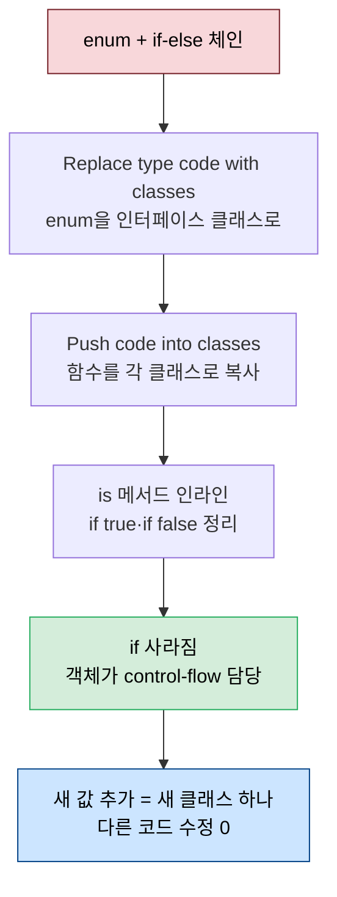
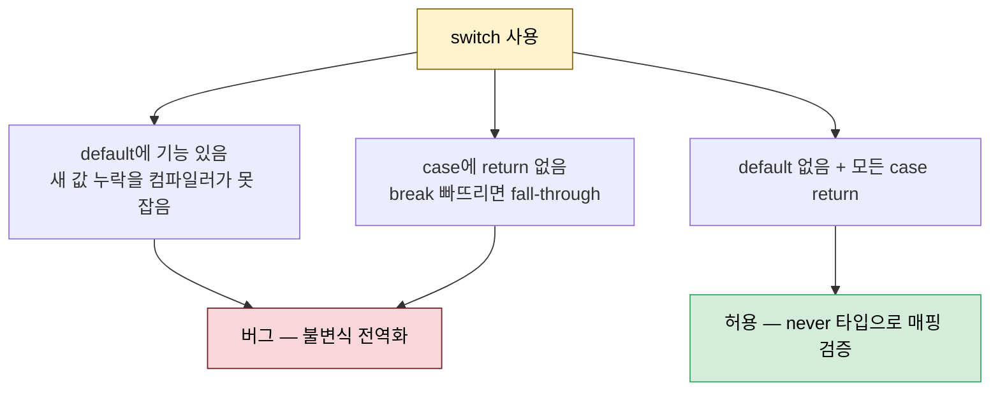

# 타입 코드를 다형성으로 — if·switch 제거

---

> [02-03.긴 함수 쪼개기](02-03.긴%20함수%20쪼개기.md) 끝에서 `handleInput`은 else if 체인이라 Extract method로 더 쪼갤 수 없었습니다. 이 글이 그 우아한 해법입니다. enum 같은 *타입 코드*를 인터페이스와 클래스로 바꾸고(Replace type code with classes), 그 클래스 안으로 코드를 밀어 넣어(Push code into classes) if 자체를 없앱니다. 거기에 switch를 다루는 Never use switch, 과도한 일반성을 줄이는 Specialize method, 추상 클래스를 금하는 Only inherit from interfaces, 그리고 정리용 Inline method·Try delete then compile까지 — type code를 다형성으로 바꾸는 여섯 규칙과 패턴입니다. *Five Lines of Code* 4장이 출처입니다.


## 학습 목표

> if-else와 switch가 왜 early binding인지, enum을 클래스로 바꿔 if를 없애는 두 패턴(Replace type code with classes·Push code into classes), 그리고 과도한 일반성과 추상 클래스를 피하는 규칙을 설명할 수 있는 것이 이 장의 목표입니다.

이 장을 다 읽고 다음 다섯 가지에 자신 있게 답할 수 있으면 학습이 완료됩니다.

1. "Never use if with else"가 early binding·late binding과 어떻게 연결되는지 설명할 수 있습니다.
2. Replace type code with classes와 Push code into classes가 어떻게 if를 없애는지 절차로 말할 수 있습니다.
3. Never use switch의 예외 조건(default 없음·모든 case return)과 그 이유를 설명할 수 있습니다.
4. Specialize method가 "일반화 본능에 반하는" 이유와 언제 쓰는지 말할 수 있습니다.
5. Only inherit from interfaces가 추상 클래스를 금하는 이유(공유 코드=coupling)를 설명할 수 있습니다.


## 1. Never use if with else — 결정을 미루기

> if-else는 코드에서 결정이 내려지는 지점을 컴파일 시점에 고정합니다. 이것이 early binding이고, 결정을 객체에 맡겨 실행 시점으로 미루는 late binding이 더 유연합니다.

**우리가 제어하지 못하는 데이터 타입을 체크하는 게 아니라면, if와 else를 함께 쓰지 않습니다.** if-else를 쓰면 결정이 내려지는 지점이 그 위치에 *고정(lock in)* 되어, 그보다 나중에는 어떤 변형도 끼워 넣을 수 없습니다. 하드코딩된 상수를 싫어하듯, **if-else는 하드코딩된 결정**이라 싫어합니다.

```typescript
// standalone if는 "체크" — 허용 (메서드 시작의 단순 검증)
function assertNotEmpty(ar: number[]) {
  if (size(ar) === 0)
    throw "Empty array not allowed";   // else가 없으니 결정이 아닌 체크
}
function average(ar: number[]) {
  assertNotEmpty(ar);
  return sum(ar) / size(ar);
}
```

다만 *무엇을 체크하는지* 봐야 합니다. `e.key`는 `string` 타입이고 string의 구현을 바꿀 수 없으니 else if 체인을 피할 수 없습니다. 이런 경우는 보통 프로그램의 *가장자리* — 사용자 입력이나 DB 조회처럼 외부에서 값을 받는 곳입니다. 거기서 첫 할 일은 서드파티 타입을 *우리가 제어하는 타입으로 매핑*하는 것이고, 그 else if는 I/O에 직결되어 앱 나머지와 분리됩니다. 규칙은 *else*를 특정해 겨냥하므로, standalone if는 "체크"로 보아 허용합니다. 검증은 else만 찾으면 되니 쉽습니다.

이 규칙은 **early binding** smell과 닿아 있습니다. 컴파일 시점에 if-else 결정이 해소·고정되어 재컴파일 없이는 못 바꿉니다. 반대가 **late binding** — 코드가 실행되는 마지막 순간에 동작이 정해지는 성질입니다. if는 control-flow 연산자이지만, 객체지향에는 더 강한 control-flow 연산자가 있습니다 — 바로 **객체**입니다. 인터페이스에 두 구현을 두면 *어느 클래스를 인스턴스화하느냐*로 실행할 코드가 정해집니다. 이 규칙은 더 강하고 유연한 도구인 객체를 쓰도록 강제합니다.


## 2. Replace type code with classes — enum을 클래스로

> enum을 인터페이스로, enum 값을 클래스로 바꿉니다. 각 값에 대한 기능을 그 값의 클래스에 모으면, 새 값을 추가할 때 여러 파일을 고치는 대신 새 클래스 하나만 만들면 됩니다.

`handleInput`의 if-else를 없애는 첫걸음은 `Input` enum을 인터페이스로 바꾸는 것입니다. enum 값들이 클래스가 되고, 값이 객체가 되니 if 안의 코드를 각 클래스의 메서드로 옮길 수 있습니다. enum은 보통 앱 전체에 흩어진 switch나 else if로 쓰입니다. switch는 "이 위치에서 각 값을 어떻게 다룰지"를 진술하지만, 값을 클래스로 바꾸면 *다른 값을 고려하지 않고* 그 값 관련 기능만 한곳에 모읍니다 — 기능을 데이터에 지역화하는 것입니다. enum에 새 값을 더하면 여러 파일의 로직을 검증해야 하지만, 인터페이스를 구현하는 새 클래스를 더하면 그 파일에 메서드를 구현하는 것으로 끝납니다(쓰기 전까지 다른 코드 수정 0).

```typescript
// Process — 임시명 인터페이스 + 클래스(해당 메서드만 true) + enum rename
interface Input2 {
  isRight(): boolean; isLeft(): boolean; isUp(): boolean; isDown(): boolean;
}
class Right implements Input2 {
  isRight() { return true; }   // 자신만 true
  isLeft() { return false; }   // 나머지는 false (임시 메서드)
  isUp() { return false; }
  isDown() { return false; }
}
// enum Input → enum RawInput 으로 rename → 쓰는 곳마다 컴파일 에러로 안내
```

타입 코드는 enum만이 아닙니다. 정확한 `===` 비교를 지원하는 타입(특히 int)도 타입 코드 역할을 합니다. `const SMALL = 33; const MEDIUM = 37;` 같은 int 상수는 중앙 상수 없이 숫자로 쓰일 수 있어 추적이 어려우니, 보이는 즉시 `enum TShirtSizes { SMALL = 33, ... }`로 바꾼 뒤 이 패턴을 적용합니다. 절차는 ① 임시명 인터페이스(각 값 메서드) ② 각 값 클래스(해당만 true) ③ enum rename으로 에러 유발 ④ 타입을 임시명으로·동등 체크를 메서드로 ⑤ 나머지 값 참조를 `new` 클래스로 ⑥ 에러가 없어지면 인터페이스를 영구명으로 rename입니다.

> **한계** — 이 패턴 자체는 가치가 적습니다. 모든 값에 `is` 메서드를 두는 것도 smell이라, smell 하나를 다른 것으로 바꾼 셈입니다. 하지만 enum 값들은 강하게 묶여 있던 반면 `is` 메서드는 하나씩 처리할 수 있고, 이 메서드 대부분은 다음 단계에서 사라지는 임시입니다. 진짜 가치는 뒤따르는 Push code into classes가 만듭니다.


## 3. Push code into classes — 코드를 클래스로 밀어 넣기

> 어떤 함수의 모든 조건이 같은 인스턴스를 본다면, 그 코드는 그 클래스에 있어야 합니다. 함수를 각 클래스로 복사하고 상수를 인라인하면 if가 통째로 사라집니다.

`handleInput`의 모든 조건이 `input` 파라미터를 보므로, 그 코드는 `input`의 클래스에 있어야 합니다. 함수를 모든 클래스에 복사해 `function`을 떼고 파라미터를 `this`로 바꾼 뒤, 각 클래스에서 `is` 메서드의 상수 반환값을 인라인하면 `if (false)`·`if (true)`가 드러나고, 이를 정리하면 if가 사라집니다. 저자가 가장 좋아하는 패턴으로, 구조적이라 인지 부하가 적으면서 결과가 깔끔합니다.

```typescript
// Right 클래스에 복사 → is 메서드 인라인 → if(false)/if(true) 정리
class Right implements Input {
  handle() { moveHorizontal(1); }   // 인라인 후 한 줄만 남음
}
// 원 함수는 호출 한 줄로 — 모든 if가 사라짐
function handleInput(input: Input) {
  input.handle();
}
```



절차는 ① source 함수를 모든 클래스에 복사·`function` 제거·context를 `this`로·미사용 파라미터 제거 ② 시그니처를 target 인터페이스에 약간 다른 이름으로 복사 ③ 각 클래스에서 상수식 반환 메서드 인라인·미리 계산 가능한 것 계산(`if (true)`/`if (false) {...}` 제거)·적절한 이름으로 변경 ④ 원 함수 본문을 새 메서드 호출로 교체입니다. 단순형은 Fowler의 "Move method"와 본질적으로 같지만, 이 이름이 의도와 힘을 더 잘 전달합니다.

이 패턴은 동등 체크 시리즈뿐 아니라 *명확한 컨텍스트* — 같은 인스턴스에 여러 메서드를 호출하는 자리(좌변이 같은 `[.]`) — 에도 적용됩니다. `moveHorizontal`처럼 `map[playery][playerx + dx]`를 반복해 보는 함수도 그 Tile 클래스로 밀어 넣을 수 있습니다. 그 과정에서 `isFlux() || isAir()` 같은 도메인 표현은 `isEdible()`로, `isStone() || isBox()`는 `isPushable()`로 묶어 *의미를 보존하며 강조*합니다.


## 4. Inline method — 불필요해진 메서드 제거

> 리팩토링은 순환적입니다. 무언가를 가능하게 하려 추가한 메서드가 제 역할을 다하면 다시 제거합니다. 코드 추가를 두려워하지 않습니다.

`handleInput`을 막 도입했지만, 그것이 머물러야 한다는 뜻은 아닙니다. 리팩토링은 종종 순환적이라, 다음 리팩토링을 가능하게 하려 무언가를 추가했다가 다시 제거합니다. `input.handle()` 한 줄만 남은 `handleInput`은 더 이상 가독성을 더하지 않으니, 호출처에 본문을 펼치고 메서드를 지웁니다. 이것이 **Inline method** — 3장 Extract method의 정확한 역입니다.

```typescript
// Before — handleInput이 한 줄짜리 위임만 함
function handleInputs() {
  while (inputs.length > 0) {
    let current = inputs.pop();
    handleInput(current);
  }
}

// After — 본문을 펼치고 handleInput 삭제 (current → input rename)
function handleInputs() {
  while (inputs.length > 0) {
    let input = inputs.pop();
    input.handle();
  }
}
```

여기서 소문자 inline methods와 패턴 Inline method를 구분합니다. Push code 도중 `is` 메서드를 인라인할 때는 *모든* 호출처가 아니라 원 메서드를 보존했습니다(호출처 단순화용). 패턴 Inline method는 *모든* 호출처에 펼친 뒤 메서드를 삭제합니다. 절차는 ① 이름을 임시로(컴파일 에러) ② 본문 복사·파라미터 기록 ③ 에러 나는 곳마다 호출을 본문으로·인자를 파라미터에 매핑 ④ 에러가 없어지면 원 메서드 삭제입니다.

> **한계** — 너무 복잡한 메서드는 인라인하지 않습니다. branch-free로 성능 최적화한 절댓값 함수는 한 줄이지만 저수준 연산에 기대므로, 메서드로 두는 편이 오히려 가독성을 더합니다. 인라인하면 "연산은 같은 추상화 수준이어야" smell(Either call or pass의 근거)을 어기게 됩니다.


## 5. Specialize method — 과도한 일반성 줄이기

> 일반화하고 재사용하려는 본능과 반대로, 더 특수한 버전을 만듭니다. 특수한 메서드는 더 적은 곳에서 호출되어 더 빨리 미사용이 되고, 그러면 제거할 수 있습니다.

`remove(tile: Tile)`은 어떤 타일 타입이든 맵 전체에서 제거할 수 있어 *너무 일반적*입니다. 일반성은 책임을 흐리고 여러 곳에서 호출되게 해 변경을 어렵게 합니다. 그래서 일반화 본능에 반해 *특수화*합니다. 사용처를 조사하니 실제로는 `remove(new Lock1())`·`remove(new Lock2())`만 쓰였습니다. 이를 이용해 `removeLock1`·`removeLock2`로 특수화하면, 더 적은 곳에서 호출되어 일반 버전이 미사용이 되고 삭제됩니다.

```typescript
// Before — 일반적 (어떤 타일이든 제거)
function remove(tile: Tile) {
  for (let y = 0; y < map.length; y++)
    for (let x = 0; x < map[y].length; x++)
      if (map[y][x] === tile)   // 인스턴스 비교 — 너무 일반적
        map[y][x] = new Air();
}

// After — 특수화 (Lock1만 제거, 동등 체크가 메서드 호출로)
function removeLock1() {
  for (let y = 0; y < map.length; y++)
    for (let x = 0; x < map[y].length; x++)
      if (map[y][x].isLock1())
        map[y][x] = new Air();
}
```

절차는 ① 메서드 복제 ② 하나를 영구명으로 rename·특수화 기준 파라미터 제거/교체 ③ 에러 없게 수정 ④ 옛 호출을 새 것으로 전환입니다. 체스 예에서 일반식 `canMove(start, end, dx, dy)`를 `rookCanMove(start, end)`(dx=1·dy=0 대입 후 단순화)로 특수화하면 주석이 필요 없을 만큼 이해하기 쉬워집니다. 이 패턴은 Jonathan Blow가 강연에서 특수화의 이점을 언급한 바 있고, 리팩토링 패턴으로 기술된 것은 이 책이 처음입니다.


## 6. Never use switch — 가장자리의 유일한 switch

> switch의 두 편의(default·fall-through)가 버그를 부릅니다. default 없이 모든 case에서 return하는 한정된 형태만 허용하며, 그것도 enum 인덱스를 클래스로 매핑하는 가장자리에서만 씁니다.

맵을 enum 인덱스로 저장하는 경우(직렬화가 쉬워 DB·파일에 흔함)처럼 외부 데이터를 바꿀 수 없을 때는, 인덱스를 새 클래스로 매핑하는 함수를 만듭니다. 이때 switch가 등장하는데, **default가 없고 모든 case에서 return하는 한정된 형태**만 허용합니다.

```typescript
// 유일하게 허용되는 switch — default 없음, 모든 case return
function assertExhausted(x: never): never {   // TS 전용 magic function (불변)
  throw new Error("Unexpected object: " + x);
}
function transformTile(tile: RawTile) {
  switch (tile) {
    case RawTile.AIR: return new Air();
    case RawTile.STONE: return new Stone();
    // ... 모든 값
    default: assertExhausted(tile);   // 새 값 누락 시 컴파일러가 잡아 줌
  }
}
```

switch가 위험한 이유는 두 편의 때문입니다. 첫째 **default** — 새 값을 추가해도 컴파일러가 불변식 재검증을 요구하지 않습니다(우리가 새 값 처리를 잊은 것과 default로 두려는 것을 구분하지 못합니다). 둘째 **fall-through** — `break`를 빠뜨리면 다음 case까지 실행됩니다. default에 기능을 두지 않고(없으면 더 좋음) 모든 case에서 return하면 둘 다 막힙니다. TypeScript에서는 `assertExhausted(x: never): never`라는 magic function으로 컴파일러가 모든 enum 값 매핑을 검증하게 할 수 있습니다. smell로서 switch는 *컨텍스트*("여기서 값 X를 어떻게")에 집중해 불변식을 데이터에서 멀리 떼어 전역화하는 반면, 클래스로 push하는 것은 *데이터*("이 값이 상황 X를 어떻게")에 집중합니다.




## 7. Only inherit from interfaces — 추상 클래스 금지

> 추상 클래스의 공유 코드는 coupling을 만들고, 기본 구현은 새 서브클래스에서 빠뜨려도 컴파일러가 알려 주지 않습니다. 인터페이스만 상속하면 새 클래스마다 능동적으로 구현하게 강제됩니다.

클래스로 push하면 클래스마다 코드가 중복됩니다. 추상 클래스로 공통 코드를 모으면 중복은 피하지만, **공유 코드가 coupling을 만듭니다.** 추상 클래스에 `methodA`·`methodB`가 있는데 한 서브클래스는 `methodA`만, 다른 서브클래스는 `methodB`만 필요하면 빈 버전으로 오버라이드할 수밖에 없습니다. 기본 구현이 있는 메서드는 새 서브클래스를 추가할 때 컴파일러가 그 메서드를 일깨워 주지 않습니다 — default의 문제가 또 나타납니다. 인터페이스만 상속하면 새 클래스마다 *능동적으로* 구현하게 강제되어, 6개월 뒤 새 타일 타입을 추가할 때 속성을 빠뜨리거나 잘못 오버라이드하는 일을 막습니다.

이 규칙은 GoF의 "Favor object composition over inheritance"에서 도출한 것을 극단으로 민 것입니다. 문제가 상속을 *요구*하는 경우는 극히 드물고, 아니라면 조합이 더 유연하고 안정적입니다. 여러 클래스가 코드를 공유해야 하면 그 코드를 다른 공유 클래스에 두는데, 그 해법(Strategy 패턴)은 다음 장의 몫입니다. 한편 클래스 간 코드 중복이 늘 나쁜 것은 아닙니다 — 중복이 나쁜 이유는 한 곳을 바꾸면 다른 곳도 따라 바뀌어야 할 때 *divergence(분기)를 조장*하기 때문인데, 타일별 그래픽처럼 시간이 지나며 *달라져야 하는* 코드라면 중복이 오히려 낫습니다.

마지막으로 정리 단계에서 미사용 메서드를 제거합니다. 인터페이스는 public이라 IDE가 미사용을 판정하지 못하지만, 우리가 도입해 전체 scope를 아는 인터페이스라면 **Try delete then compile** — 메서드를 지우고 컴파일해 에러가 없으면 클래스에서도 지우는 기법 — 으로 안전하게 정리할 수 있습니다. 단 새 기능 구현 중에는 아직 안 쓰이는 메서드를 지울 위험이 있어 하지 않습니다.


## 8. 실무 적용

> 우리 도메인의 enum + switch 상태 분기, 그리고 Strategy 주입은 이미 "타입 코드를 다형성으로"의 사례입니다.

타입 코드를 다형성으로 바꾸는 발상은 우리 코드에 이미 있습니다. 결제 수단별·등급별 분기를 if-else 대신 Strategy로 객체화하면 OCP가 충족된다는 것이 같은 이야기입니다. 일급함수가 있는 언어에서는 `BiFunction`을 enum 상수에 담아 호출처의 if를 없애는 식으로 더 가볍게 같은 효과를 냅니다. 다만 이 책의 "추상 클래스 절대 금지"는 우리 컨벤션과 충돌할 수 있습니다 — Effective Java의 추상 골격 구현(인터페이스 + 추상 클래스 공통 구현)은 정반대 권고이므로, 팀 컨벤션이 있으면 그것을 1순위로 두고 이 규칙은 "상속 대신 조합을 먼저 고려하라"는 방향 지침으로 받아들이는 편이 안전합니다.

`Never use switch`의 예외(default 없음·모든 case return)는 실무에서도 유용합니다. enum을 다룰 때 `default`에 로직을 두지 않고 모든 case를 명시하면, 새 enum 값을 추가했을 때 컴파일러나 정적 분석이 누락을 잡아 줍니다 — 상태 전이가 enum + switch로 짜인 코드의 회귀를 막는 실질적 가드입니다.


## 9. 면접 대비 Q&A

> 다형성 전환 질문은 "if-else와 다형성 중 언제 무엇", "switch는 왜 악한가", "추상 클래스는 왜 안 되는가" 같은 *경계*를 파고듭니다.

### Q1. if-else를 객체(다형성)로 바꾸면 무엇이 좋아지나요?

if-else는 컴파일 시점에 결정을 고정하는 early binding이라, 그 위치보다 나중에 변형을 끼워 넣을 수 없습니다. 인터페이스와 구현 클래스로 바꾸면 *어느 클래스를 인스턴스화하느냐*로 동작이 정해지는 late binding이 되어, 새 동작을 새 클래스 추가만으로 더할 수 있습니다(change by addition·OCP).

### Q2. Replace type code with classes와 Push code into classes는 어떻게 다른가요?

앞은 enum을 인터페이스로, 값을 클래스로 바꿔 *그릇*을 만드는 단계입니다(아직 `is` 메서드만 있어 가치가 적습니다). 뒤는 그 클래스 안으로 함수를 밀어 넣어 `is` 메서드를 인라인하고 if를 *없애는* 단계입니다. 둘은 짝으로 쓰여 type code를 다형성으로 바꿉니다.

### Q3. switch를 왜 피하나요? 허용되는 형태는?

default는 새 값 추가 시 컴파일러가 불변식 재검증을 요구하지 않게 만들고, fall-through는 `break` 누락 버그를 부릅니다. 그래서 default 없이 모든 case에서 return하는 형태만 허용하며, 그것도 enum 인덱스를 클래스로 매핑하는 가장자리에서만 씁니다. TypeScript에서는 `never` 타입을 받는 함수로 컴파일러가 모든 값 매핑을 검증하게 합니다.

### Q4. Specialize method는 왜 일반화 본능에 반하나요?

일반적 메서드는 책임을 흐리고 여러 곳에서 호출되어 변경을 어렵게 합니다. 더 특수한 버전(`remove`→`removeLock1`)은 더 적은 곳에서 호출되어 더 빨리 미사용이 되고, 그러면 안전하게 제거할 수 있습니다. 코드를 줄이는 방향의 리팩토링입니다.

### Q5. 추상 클래스 대신 인터페이스만 상속하는 이유는?

추상 클래스의 공유 코드는 coupling을 만들고, 기본 구현이 있는 메서드는 새 서브클래스를 추가할 때 컴파일러가 일깨워 주지 않습니다(default의 문제). 인터페이스만 상속하면 새 클래스마다 모든 메서드를 능동적으로 구현하게 강제되어, 빠뜨림과 잘못된 오버라이드를 막습니다. 공유가 정말 필요하면 상속이 아니라 별도 공유 클래스(Strategy)로 풉니다.


## 관련 문서

> 이 글이 type code를 다형성으로 바꾸는 *규칙과 패턴*이라면, 그 직전 단계와 객체화의 결정판 패턴은 아래 문서가 맡습니다.

- [02-03.긴 함수 쪼개기](02-03.긴%20함수%20쪼개기.md) — 이 글의 출발점. §5 if only at the start에서 else if 체인이라 못 쪼갠 `handleInput`을 여기서 다형성으로 해결
- [02-02.리팩토링의 기술적 토대](02-02.리팩토링의%20기술적%20토대.md) — §4 상속보다 조합·추가에 의한 변경. 이 글의 late binding·Only inherit from interfaces가 그 원리의 실행
- [02-05.유사 코드 통합](02-05.유사%20코드%20통합.md) — 같은 책 5장. §7에서 "공유는 상속이 아니라 Strategy로"라고 예고한 그 Introduce strategy pattern의 본체와, 유사 클래스·조건 통합
- [../java/03_DesignPatterns/01-04.행동 패턴](../java/03_DesignPatterns/01-04.행동%20패턴.md) — §Strategy·§State. if-else 분기를 객체로 끌어올리는 GoF 패턴(이 책 Ch5에서 다룰 Introduce strategy pattern의 본체)
