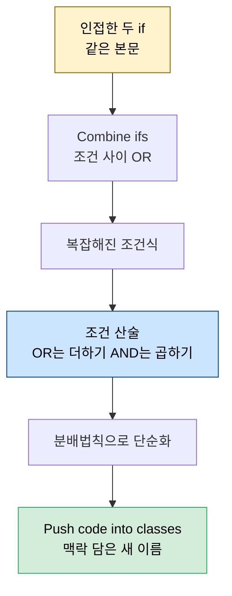
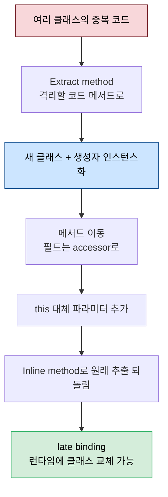

# 유사 코드 통합 — Strategy 패턴과 조건 산술

---

> [02-04.타입 코드를 다형성으로](02-04.타입%20코드를%20다형성으로.md)에서 if·switch를 클래스로 바꿔 if를 없앴다면, 이 글은 그렇게 생긴 *비슷한 코드를 하나로 합치는* 방법을 다룹니다. 상수 메서드에서만 다른 클래스를 합치고(Unify similar classes), 인접한 같은 본문의 if를 합치며(Combine ifs), 조건을 산술처럼 다뤄 단순화합니다. 정점은 코드를 별도 클래스로 옮기는 **Introduce strategy pattern** — 이 책에서 가장 정교하고, late binding의 궁극입니다. 거기에 순수 조건 규칙, 1구현 인터페이스 금지, UML 클래스 다이어그램까지 — *Five Lines of Code* 5장이 출처이자 1부의 정점입니다.


## 학습 목표

> 상수 메서드에서만 다른 클래스를 합치는 법, 조건을 산술 규칙으로 단순화하는 법, 그리고 코드를 별도 클래스로 옮기는 Strategy 패턴과 그것이 왜 late binding의 궁극인지를 설명할 수 있는 것이 이 장의 목표입니다.

이 장을 다 읽고 다음 다섯 가지에 자신 있게 답할 수 있으면 학습이 완료됩니다.

1. Unify similar classes의 basis(상수 메서드 집합)와 분수 덧셈 비유를 설명할 수 있습니다.
2. Combine ifs와 조건 산술(‖=+, &&=×)이 어떻게 구조를 노출하는지 말할 수 있습니다.
3. Use pure conditions가 왜 조건 산술의 전제인지 설명할 수 있습니다.
4. Introduce strategy pattern의 절차와 그것이 late binding의 궁극인 이유를 말할 수 있습니다.
5. No interface with only one implementation이 왜 필요하고 Extract interface from implementation으로 언제 인터페이스를 만드는지 설명할 수 있습니다.


## 1. Unify similar classes — 상수 메서드만 다른 클래스 합치기

> 두 클래스가 상수를 반환하는 메서드(상수 메서드)에서만 다르면 하나로 합칠 수 있습니다. 분수 덧셈처럼, 먼저 나머지를 같게 만든 뒤(분모 맞추기) 합칩니다.

`Stone`과 `FallingStone`의 차이가 `isFallingStone`(하나는 `false`, 하나는 `true` 반환)과 `moveHorizontal` 둘뿐이라고 합시다. 상수를 반환하는 메서드를 **상수 메서드(constant method)** 라 부르고, 두 클래스가 *값만 다른 상수 메서드*를 공유하면 합칠 수 있습니다. 합치는 과정은 **분수 덧셈**과 닮았습니다. 분수를 더하려면 먼저 분모를 같게 만들듯, 클래스를 합치려면 먼저 상수 메서드를 *제외한 모든 것*을 같게 만든 뒤(1단계) 실제로 합칩니다(2단계).

```typescript
// 1단계 — moveHorizontal을 같게: if(true){본문}을 감싸고
//          true를 basis 메서드(isFallingStone) 비교로 바꾼 뒤 서로 복사
class Stone implements Tile {
  moveHorizontal(dx: number) {
    if (this.isFallingStone() === false) { /* 밀기 */ }
    else if (this.isFallingStone() === true) { }   // FallingStone의 본문
  }
}
// 2단계 — 상수 메서드를 필드로: falling을 생성자 파라미터로 받아 통합
class Stone implements Tile {
  constructor(private falling: boolean) { }   // TS: private 파라미터 = 필드 자동 생성
  isFallingStone() { return this.falling; }
}
// new FallingStone() → new Stone(true) 로 전환하고 FallingStone 삭제
```

basis는 클래스들이 다른 *상수 메서드 집합*입니다. 두 메서드면 two-point basis이고, basis는 가능한 작게 둡니다. X개 클래스를 합치려면 최대 (X−1)-point basis가 필요합니다. 클래스가 적을수록 보통 더 많은 구조가 드러납니다. 실제로 위 통합은 숨어 있던 type code를 노출합니다 — boolean `falling`이 곧 type code라, `enum FallingState { FALLING, RESTING }`으로 바꾸면 이름 없는 boolean 인자가 사라져 읽기 쉬워지고, enum이니 **Replace type code with classes**로 `Falling`·`Resting` 클래스까지 끌고 갈 수 있습니다.

> **한계** — 이 패턴은 저자가 처음 기술한 것으로, 흔한 상황은 아닙니다. 합치는 두 클래스가 *상수 메서드에서만* 달라야 적용되므로, 그렇게 만들기 위해 1단계에서 비-basis 메서드를 의도적으로 같게 다듬는 사전 작업이 필요합니다. `if(true)`를 감싸 조건을 특수화하고 서로 복사하는 단계는 번거롭지만, 각 단계가 컴파일러로 검증되어 안전합니다.


## 2. Combine ifs와 조건 산술 — 구조 노출하기

> 인접한 두 if의 본문이 같으면 조건 사이에 ‖를 넣어 합칩니다. 조건은 ‖를 +로, &&를 ×로 보는 산술 규칙으로 단순화할 수 있습니다.

리팩토링으로 두 if의 본문이 같아지면, 조건 사이에 `||`를 넣어 하나로 합칩니다. 이때 동작을 바꾸지 않도록 각 식 주위의 괄호를 유지합니다. 동일 본문 if를 나란히 쓰는 일은 부자연스러우니, 이 패턴(**Combine ifs**)은 보통 의도적 리팩토링에서만 만납니다. `||`를 추가해 두 식의 관계를 노출하는 것이 목적입니다.

```typescript
// Before — 인접한 두 if의 본문이 같음
if (expression1) { /* body */ }
else if (expression2) { /* same body */ }

// After — || 로 합침 (각 식 괄호 유지로 동작 불변)
if ((expression1) || (expression2)) { /* body */ }
```

합쳐진 조건이 복잡해지면 *조건 산술*로 다룹니다. 이론을 따지지 않아도, **‖(와 |)는 +(덧셈)처럼, &&(와 &)는 ×(곱셈)처럼** 동작합니다. ‖의 두 줄이 +를 이루고 &에 ×가 숨어 있다는 기억술로 우선순위를 떠올릴 수 있고, 그러면 친숙한 산술 규칙이 그대로 적용됩니다. 예를 들어 `isStony && air || isBoxy && air`는 `(isStony || isBoxy) && air`로 묶입니다 — `ab + cb = (a+c)b`와 같습니다. 조건을 수식으로 바꿔 단순화한 뒤 코드로 되돌리는 이 연습은, 실무에서 복잡한 조건의 *괄호 오류*를 잡는 데 특히 강력합니다.



단순화한 `||`는 다시 클래스로 밀어 넣습니다. 단 이름은 맥락을 담아야 합니다 — 4장에서 stone·box의 관계를 `pushable`이라 불렀지만, 떨어지는 맥락에는 맞지 않으니 `canFall`이라는 새 이름을 씁니다. 같은 관계라고 이름을 맹목적으로 재사용하지 않습니다.


## 3. Use pure conditions — 조건은 순수해야

> 조건 산술을 쓰려면 조건에 부수효과가 없어야 합니다. 부수효과는 드물어 발견에 인지 비용이 들고, 데이터 가져오기와 바꾸기를 섞으면 위험한 전역 상태 변경이 됩니다.

조건 산술은 조건에 *부수효과가 없을 때만* 통합니다. 그래서 **조건은 항상 순수해야** 합니다. 조건은 `if`·`while` 뒤와 `for`의 중간부이고, 순수란 변수 할당·예외 throw·I/O 같은 부수효과가 없다는 뜻입니다. 부수효과 있는 조건은 산술 규칙을 못 쓰게 할 뿐 아니라, 조건에 부수효과가 드물어 *발견해야 하는* 것이 되니 조사와 인지 부담을 늘립니다.

```typescript
// Before — readLine이 다음 줄 반환 + 포인터 전진(부수효과)
while ((line = br.readLine()) !== null) { console.log(line); }

// After — 반환(순수)과 전진(부수효과)을 분리
class Reader {
  nextLine() { this.current++; }            // 부수효과만
  readLine() { return this.data[this.current] || null; }   // 순수, 몇 번 불러도 안전
}
for (; br.readLine() !== null; br.nextLine()) {
  let line = br.readLine();
  console.log(line);
}
```

구현을 제어하지 못해 반환과 부수효과를 분리할 수 없으면, 어떤 메서드든 감싸 둘을 나누는 범용 `Cacher`를 씁니다. 이 규칙은 "Separate queries from commands"(Mitchell·McKim, *Design by Contract, by Example*) smell에서 왔습니다 — command는 부수효과, query는 순수이고, void 메서드에만 부수효과를 허용하면 따르기 쉽습니다. 일반 smell과 다른 점은 *호출부*에 집중하고 *조건*에 한정한다는 것입니다. 조건 밖에서 query와 command를 섞는 것은 리팩토링 능력에 영향이 없어 스타일 문제에 가깝습니다(`++`가 증가와 반환을 동시에 하는 흔한 예처럼). 부수효과는 전역 상태 변경이라 위험하니, 격리하면 관리가 쉬워집니다. 이는 [01-01.클린 코드 원칙](01-01.클린%20코드%20원칙.md) §6 CQS와 같은 방향입니다.


## 4. Introduce strategy pattern — 코드를 클래스로 옮기기

> 다른 클래스를 인스턴스화해 변형을 도입하는 것이 Strategy 패턴입니다. 클래스를 추가하는 것만으로 동작을 바꾸거나 합칠 수 있어, late binding의 궁극입니다.

`Stone`과 `Box`에 같은 낙하 코드가 있고, 이번에는 *수렴*을 원합니다(낙하 동작은 sync를 유지해야 합니다). 코드를 `FallStrategy`라는 별도 클래스로 옮깁니다. **다른 클래스를 인스턴스화해 변형을 도입하는 것이 Strategy 패턴**이고, 변형 옵션을 당장 쓰지 않더라도 *가능성*은 추가됩니다. 그래서 저자는 코드를 자기 클래스로 옮기는 것 전부를 Strategy 패턴이라 부릅니다(strategy가 필드를 가지면 state 패턴이라 부르지만 구분은 대개 학술적입니다).

```typescript
// FallStrategy로 낙하 코드를 옮김 — Stone·Box가 공유
class Stone implements Tile {
  private fallStrategy: FallStrategy;
  constructor(falling: FallingState) {
    this.fallStrategy = new FallStrategy(falling);
  }
  update(x: number, y: number) {
    this.fallStrategy.update(this, x, y);   // this를 파라미터로 넘겨 위임
  }
}
class FallStrategy {
  constructor(private falling: FallingState) { }
  update(tile: Tile, x: number, y: number) {
    this.falling = map[y + 1][x].isAir() ? new Falling() : new Resting();
    this.drop(tile, x, y);   // if only at the start를 지키려 Extract method
  }
}
```



절차는 ① 격리할 코드에 Extract method(통합하려면 메서드를 동일하게) ② 새 클래스 ③ 생성자에서 인스턴스화 ④ 메서드 이동 ⑤ 필드 의존 시 필드를 옮기고 accessor를 만들어 원 클래스 에러를 고치고 `this` 대신 파라미터 추가 ⑥ Inline method로 1단계 추출을 되돌림입니다. **Strategy의 변형은 late binding의 궁극**입니다 — 런타임에 코드가 전혀 모르는 클래스를 로드해 control flow에 통합할 수 있고, 재컴파일조차 필요 없습니다. 저자가 "이 책에서 하나만 가져가라면 Strategy 패턴의 강력함"이라 말하는 이유입니다. Strategy는 `removeLock1`·`removeLock2` 같은 *유사 함수*나 `Key`·`Lock` 같은 *유사 클래스*를 합치는 데에도 그대로 쓰입니다.

> **한계** — Strategy는 GoF가 1994년 *Design Patterns*에서 소개했고, 코드에 사후 주입한다는 발상은 Fowler의 *Refactoring*에서 왔습니다. type code를 클래스로 바꾼 것과는 다릅니다 — 그 클래스는 데이터라 메서드를 많이 밀어 넣지만, strategy 클래스는 완성 후 메서드를 거의 더하지 않고 기능을 바꾸려면 새 클래스를 만듭니다. 우리 도메인에서도 분기가 셋 이상이고 곧 늘어날 때가 도입 신호이지, 둘뿐이고 늘 일이 없으면 평범한 if-else가 더 정직합니다([01-04.행동 패턴](../java/03_DesignPatterns/01-04.행동%20패턴.md)).


## 5. 인터페이스는 필요할 때만 — 1구현 금지와 사후 추출

> 구현이 하나뿐인 인터페이스는 가독성을 더하지 않고 오히려 변형을 잘못 신호합니다. 인터페이스는 변형이 필요해질 때 구현에서 사후 추출합니다.

Strategy를 도입할 때 변형을 당장 추가하지 않는다면 인터페이스를 서두를 필요가 없습니다. **구현이 하나뿐인 인터페이스를 두지 않는다**는 규칙 때문입니다. 1구현 인터페이스는 가독성을 더하지 않고, *변형이 있다*고 잘못 신호해 인지 모델에 오버헤드를 더하며, 구현 클래스를 수정할 때 인터페이스도 함께 손봐야 해 느려집니다. 이는 Specialize method와 같은 논리 — 도움이 안 되는 일반화입니다. John Carmack의 말처럼 "추상화는 실제 복잡성의 증가를 지각된 복잡성의 감소와 맞바꾸는 것"이므로 신중해야 합니다.

```typescript
// Extract interface from implementation — 변형이 필요해질 때 사후 추출
interface ElementProcessor {   // 같은 이름 인터페이스 신설 후 클래스 rename·implement
  processElement(e: number): void;
  getAccumulator(): number;
}
class SumProcessor implements ElementProcessor {
  constructor(private accumulator: number) { }
  getAccumulator() { return this.accumulator; }
  processElement(e: number) { this.accumulator += e; }
}
// 두 번째 구현(MinimumProcessor)이 생기는 순간 인터페이스가 정당해짐
```

인터페이스가 필요해지면 **Extract interface from implementation**으로 만듭니다. 절차는 ① 추출 대상 클래스와 같은 이름의 인터페이스를 만들고 ② 클래스를 rename해 그 인터페이스를 implement한 뒤 ③ 컴파일 에러를 순회하며 `new`이면 인스턴스화를 새 클래스명으로, 아니면 에러를 낸 메서드를 인터페이스에 추가하는 것입니다. 이렇게 하면 `ArrayMinimum`·`ArraySum`이 `BatchProcessor` 하나로 합쳐지고, 새 처리기는 `ElementProcessor`를 구현하는 클래스 하나를 추가하는 것으로 끝납니다 — change by addition입니다.


## 6. UML 클래스 다이어그램

> 클래스와 인터페이스의 구조·관계를 박스와 화살표로 그립니다. Only inherit from interfaces 덕에 실무에서는 composition과 implementation 두 관계로 대부분 충분합니다.

코드의 아키텍처나 관계를 전달할 때 다이어그램이 편하고, 그 틀이 **UML(Unified Modeling Language)** 입니다. Strategy 같은 패턴은 보통 **클래스 다이어그램**으로 그립니다. 클래스는 박스에 제목과 가끔 메서드(필드는 드물게)로, 인터페이스는 제목 위에 `interface` 표기로 나타내고, private은 `-`·public은 `+`로 적습니다. 대개 public 인터페이스만 그리므로 가시성 표기는 자주 생략합니다.

클래스 다이어그램의 핵심은 관계입니다. 관계는 "X uses a Y", "X is a Y", "X has a Y(s)" 세 범주이고 각각 두 화살표 타입이 있지만, 실무에서는 단순화됩니다. Only inherit from interfaces 규칙이 상속 화살표를 막고, "uses"는 관계를 모르거나 무관할 때 쓰며, composition과 aggregation의 차이는 대개 미적입니다. 그래서 **composition과 implementation 두 관계로 대부분 충분**합니다. 전체 프로그램을 다이어그램으로 그리면 압도적이라 도움이 안 되니, 디자인 패턴이나 작은 아키텍처 일부만 그리며 중요한 메서드만 포함합니다.


## 7. 실무 적용

> 우리 도메인의 Strategy/State 도입 신호("분기 셋 이상·곧 추가")와 CQS는 이미 이 장의 규칙과 닿아 있습니다. 단 1구현 인터페이스 금지는 DI 컨벤션과 충돌할 수 있습니다.

이 장의 패턴은 우리 코드와 직접 닿아 있습니다. 결제 수단별·등급별 분기를 Strategy로 객체화하면 OCP가 충족되고, 일급함수가 있는 언어에서는 `BiFunction`을 enum에 담아 더 가볍게 같은 효과를 냅니다. 다만 도입 신호를 지켜야 합니다 — 분기가 둘뿐이고 늘 일이 없는데 Strategy를 박으면 추상화 비용만 집니다. Use pure conditions는 우리 CQS 관행과 같은 방향이라, 조건에 부수효과를 넣지 않으면 테스트가 Mocking에 덜 의존합니다.

`No interface with only one implementation`은 실무에서 주의가 필요합니다. Spring의 DI는 "인터페이스에 대고 코딩하라"를 권장하지만, 이 책은 그 1구현 인터페이스가 boilerplate라고 봅니다. 둘은 충돌하므로, 우리 프로젝트의 DI 컨벤션이 있으면 그것을 1순위로 두되, "변형 가능성이 없는데 습관적으로 인터페이스를 만들지는 말자"는 방향 지침으로 받아들이는 편이 균형 잡힙니다. 테스트 더블을 위해 인터페이스가 필요한 경우는 이 규칙의 예외에 가깝습니다.


## 8. 면접 대비 Q&A

> 유사 코드 통합 질문은 "Strategy와 State의 차이", "조건 산술이 왜 가능한가", "인터페이스를 언제 만드나" 같은 *경계*를 파고듭니다.

### Q1. Unify similar classes의 basis가 무엇인가요?

클래스들이 서로 다른 *상수 메서드 집합*입니다. 두 메서드면 two-point basis이고, basis는 가능한 작게 둡니다. 분수 덧셈처럼 먼저 basis를 제외한 모든 메서드를 같게 만든 뒤(분모 맞추기), 상수 메서드를 필드로 바꿔 클래스를 합칩니다. X개를 합치려면 최대 (X−1)-point basis가 필요합니다.

### Q2. 조건 산술은 왜 가능하고 무엇이 전제인가요?

‖는 +(덧셈), &&는 ×(곱셈)처럼 동작해 분배법칙 같은 산술 규칙이 그대로 적용됩니다(`ab+cb=(a+c)b`). 전제는 조건이 순수해야 한다는 것입니다 — 부수효과가 있으면 호출 횟수·순서에 따라 결과가 달라져 산술 규칙이 깨집니다.

### Q3. Strategy 패턴이 왜 late binding의 궁극인가요?

변형을 if-else로 하면 컴파일 시점에 결정이 고정되지만, Strategy는 *어느 클래스를 인스턴스화하느냐*로 동작이 정해집니다. 런타임에 코드가 전혀 모르던 클래스를 로드해 control flow에 통합할 수 있고 재컴파일도 필요 없으므로, 결정을 가장 늦은 순간까지 미루는 late binding의 정점입니다.

### Q4. Strategy와 State 패턴은 어떻게 다른가요?

근본은 같습니다 — 클래스를 추가해 변형을 가능하게 하는 것입니다. strategy가 필드를 가지면 state라 부르지만, 이 구분은 대개 학술적입니다. 실무 관점에서는 "외부에서 알고리즘을 주입받으면 Strategy, 객체가 스스로 다음 상태로 전이하면 State"로 의도를 나눕니다.

### Q5. 인터페이스는 언제 만들어야 하나요?

구현이 둘 이상이 되어 변형이 *실제로* 생길 때입니다. 구현이 하나뿐인 인터페이스는 가독성을 더하지 않고 변형을 잘못 신호하며 파일·수정 비용만 늘립니다. 그래서 인터페이스를 미리 만들지 않고, 변형이 필요해지면 Extract interface from implementation으로 사후 추출합니다(테스트 더블이 필요한 경우는 예외에 가깝습니다).


## 관련 문서

> 이 글이 유사 코드를 *합치는* 패턴이라면, 그 직전 단계와 Strategy의 GoF 원전·CQS 디테일은 아래 문서가 맡습니다.

- [02-06.데이터 방어](02-06.데이터%20방어.md) — 같은 책 6장·1부의 마지막. 이 글 §6에서 만든 빈약한 KeyConfiguration의 데이터를 캡슐화로 방어(getter/setter 제거·Encapsulate data·Enforce sequence)
- [02-04.타입 코드를 다형성으로](02-04.타입%20코드를%20다형성으로.md) — 이 글의 출발점. §7에서 "공유는 상속이 아니라 Strategy로"라고 예고한 그 Strategy의 본체가 이 글
- [02-02.리팩토링의 기술적 토대](02-02.리팩토링의%20기술적%20토대.md) — §4 상속보다 조합·추가에 의한 변경. Strategy가 그 원리의 결정판이고, 부수효과=전역 상태의 위험도 여기서
- [01-01.클린 코드 원칙](01-01.클린%20코드%20원칙.md) — §6 CQS(명령과 조회의 분리). Use pure conditions가 조건에 한정해 적용한 그 원칙의 본체
- [../java/03_DesignPatterns/01-04.행동 패턴](../java/03_DesignPatterns/01-04.행동%20패턴.md) — §Strategy·§State의 GoF 원전과 도입 신호("분기 셋 이상·곧 추가"). 람다로 본 전략 패턴
