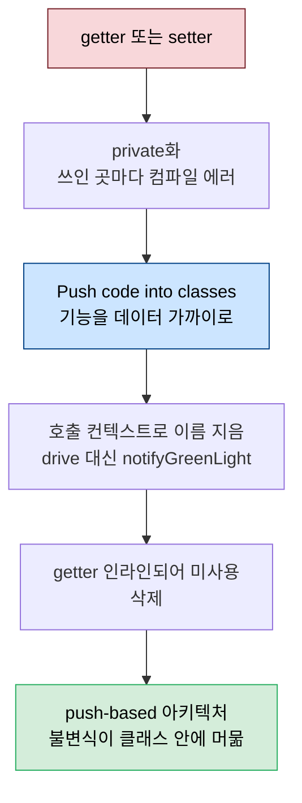
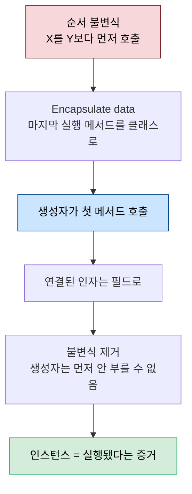

# 데이터 방어 — 캡슐화와 getter 제거

---

> [02-05.유사 코드 통합](02-05.유사%20코드%20통합.md) 끝의 KeyConfiguration은 데이터만 담은 빈약한 클래스였습니다. 이 글은 그 데이터를 *방어*합니다. [02-02.리팩토링의 기술적 토대](02-02.리팩토링의%20기술적%20토대.md) §2에서 불변식은 함께 변하는 것을 함께 둘 때 지켜진다고 했는데, 캡슐화 — 데이터와 기능 접근을 제한하는 것 — 는 그 불변식이 *지역적으로만* 깨질 수 있게 만들어 예방을 쉽게 합니다. getter·setter를 없애고(Do not use getters or setters), 공통 접사를 클래스로 모으고(Encapsulate data), 생성자로 순서 불변식을 아예 제거하는(Enforce sequence) 여섯 규칙과 패턴입니다. *Five Lines of Code* 6장이자 1부의 마지막입니다.


## 학습 목표

> getter·setter가 왜 캡슐화를 깨는지, push-based 아키텍처가 무엇인지, 공통 접사를 클래스로 모으는 법, 그리고 생성자로 순서 불변식을 제거하는 Enforce sequence를 설명할 수 있는 것이 이 장의 목표입니다.

이 장을 다 읽고 다음 다섯 가지에 자신 있게 답할 수 있으면 학습이 완료됩니다.

1. getter·setter가 어떻게 캡슐화를 깨고 불변식을 전역화하는지 설명할 수 있습니다.
2. push-based와 pull-based 아키텍처의 차이를 말할 수 있습니다.
3. "공통 접사는 책임의 신호"라는 규칙과 단일 책임 원칙의 관계를 설명할 수 있습니다.
4. Encapsulate data의 절차와 루프 안 인스턴스화 함정을 말할 수 있습니다.
5. Enforce sequence가 생성자로 순서 불변식을 어떻게 제거하는지 설명할 수 있습니다.


## 1. getter·setter를 쓰지 않기

> 비-Boolean 필드의 getter·setter는 캡슐화를 깨고 불변식을 전역화합니다. 데이터를 꺼내(pull) 중앙에서 계산하는 대신, 계산을 데이터 가까이로 밀어 넣는(push) 아키텍처가 더 안전합니다.

**비-Boolean 필드에는 setter·getter를 쓰지 않습니다.** 여기서 getter·setter란 비-Boolean 필드를 직접 반환하거나 할당하는 메서드입니다(이름이 `getX`인지와 무관하고, C#의 property도 포함합니다). 캡슐화와 함께 가르쳐지지만, 객체 필드의 getter는 즉시 캡슐화를 깨고 불변식을 전역화합니다 — 객체를 반환하면 수신자가 그것을 재배포하거나 public 메서드를 호출해 우리가 예상 못한 방식으로 수정할 수 있고, 우리는 통제할 수 없습니다. setter도 마찬가지로, 실무에서는 내부 구조가 바뀌면 수신자까지 따라 바꿔야 하는 tight coupling을 만듭니다.

private 필드의 가장 큰 장점은 **push-based 아키텍처**를 권한다는 것입니다. push-based는 계산을 데이터에 최대한 가까이 밀어 넣고, pull-based는 데이터를 fetch해 중앙에서 계산합니다. pull-based는 메서드 없는 "dumb" 데이터 클래스와, 여러 곳의 데이터를 섞는 큰 "manager" 클래스를 낳아 둘 사이를 tight하게 묶습니다. push-based는 데이터를 "get"하는 대신 인자로 *pass*해, 모든 클래스가 기능을 갖고 코드가 효용에 따라 분산됩니다.

```typescript
// pull-based — generatePostLink가 모든 데이터를 fetch (getter 사슬)
function generatePostLink(website: Website, post: BlogPost) {
  let url = website.getUrl();
  let name = post.getAuthor().getUsername();  // stranger를 통해 또 stranger
  return url + name + post.getId();
}

// push-based — 데이터를 인자로 pass, 각 클래스가 자기 일을 함
class BlogPost {
  generateLink(website: Website) {            // post가 스스로 링크를 만듦
    return this.author.generateLink(website, this.id);
  }
}
```

이 규칙은 **디미터 법칙(Law of Demeter)** — "낯선 이와 말하지 마라(Don't talk to strangers)" — 에서 왔습니다. stranger는 직접 접근하지 못하지만 참조를 얻을 수 있는 객체이고, 객체지향에서는 주로 getter를 통해 그 참조를 얻습니다. 참조를 얻은 객체와 상호작용하면 *그 객체를 얻는 방식*에 tight하게 묶여, 소유자가 내부 구조를 바꿀 수 없게 됩니다. push-based에서는 메서드를 서비스처럼 노출하고, 사용자는 내부 구조를 몰라야 합니다. (이는 [01-01.클린 코드 원칙](01-01.클린%20코드%20원칙.md) §8 디미터 법칙과 같은 발상입니다.)


## 2. Eliminate getter or setter — getter 없애기

> getter를 private으로 만들어 에러를 내고, 그 자리에 Push code into classes로 기능을 옮긴 뒤, 인라인되어 미사용이 된 getter를 지웁니다.

getter를 없애는 방법은 기능을 데이터에 가까이 옮기는 것입니다. getter와 setter가 워낙 닮아 같은 절차로 둘 다 제거됩니다. 보통 getter 대신 여러 함수가 생기는데 — getter가 쓰인 컨텍스트 수만큼 — 그러면 데이터 컨텍스트가 아니라 *호출 컨텍스트*를 기준으로 이름을 짓습니다. 4장 TrafficLight에서 `car.drive()`(효과로 명명)를 `car.notifyGreenLight()`(컨텍스트로 명명)로 바꾼 것이 같은 이야기입니다.

```typescript
// Eliminate getter or setter — 3단계
class KeyConfiguration {
  // 1. private화 → 쓰인 곳마다 에러
  // 2. Push code into classes로 에러 수정
  removeLock() { remove(this.removeStrategy); }   // get 대신 기능을 데이터에
  // 3. getRemoveStrategy는 인라인되어 미사용 → 삭제
}
```



절차는 ① getter/setter를 private으로 만들어 쓰인 곳마다 에러를 내고 ② Push code into classes로 에러를 수정하고 ③ 인라인되어 미사용이 된 getter/setter를 삭제하는 것입니다. 게임에서는 KeyConfiguration의 `getColor`·`getRemoveStrategy`, FallStrategy의 `getFalling`을 이렇게 없앱니다. 다만 `getColor`를 대체한 `setColor(g)`는 g를 받으면서 `g.fillRect`도 호출해 Either call or pass를 어기므로, fillRect를 함께 push하거나 추출해 정리합니다.


## 3. Never have common affixes — 공통 접사는 클래스로

> 여러 메서드·변수가 같은 접두사·접미사를 가지면 그것은 응집의 신호입니다. 공통 접사가 가리키는 공통 책임을 별도 클래스로 모읍니다.

컨텍스트를 알리려고 `username`·`startTimer`처럼 접사를 붙이지만, 여러 요소가 같은 접사를 가지면 그것은 *응집의 신호*입니다. 더 나은 전달 수단은 클래스입니다. 클래스로 모으면 외부 인터페이스를 완전히 제어하고 helper를 숨겨 — 5줄 규칙이 메서드를 많이 만들어 내므로 특히 가치 있습니다 — 전역 scope를 오염시키지 않습니다. 무엇보다 데이터를 숨겨 불변식을 클래스 안에서 유지하니, 그것이 *지역 불변식*이 되어 지키기 쉬워집니다.

```typescript
// Before — accountDeposit을 직접 부르면 출금 없이 입금 가능 (위험)
function accountDeposit(to: string, amount: number) { /* ... */ }
function accountTransfer(amount: number, from: string, to: string) {
  accountDeposit(from, -amount);
  accountDeposit(to, amount);
}

// Good — 공통 접사 account를 클래스로, deposit은 private
class Account {
  private deposit(to: string, amount: number) { /* ... */ }
  transfer(amount: number, from: string, to: string) {
    this.deposit(from, -amount);   // deposit은 transfer를 통해서만
    this.deposit(to, amount);
  }
}
```

이 규칙은 **단일 책임 원칙(single responsibility principle)** — "메서드는 한 가지만"의 클래스판 — 에서 왔습니다. 클래스는 단일 책임을 가져야 하고, 공통 접사는 그 메서드·변수가 한 책임을 공유한다는 신호이므로 별도 클래스로 옮깁니다. 단일 책임 설계는 보통 사전 설계로 가르쳐지지만, 여기서는 코드에 드러난 *증상*(공통 접사)으로 접근합니다 — 앱이 진화하며 뒤늦게 떠오르는 책임도 이렇게 식별할 수 있습니다([01-01 §5 단일 책임](01-01.클린%20코드%20원칙.md), [SOLID §SRP](../java/03_DesignPatterns/01-01.SOLID%20원칙.md)).


## 4. Encapsulate data — 변수와 메서드를 클래스로

> 공통 접사를 가진 변수와 메서드를 클래스로 옮깁니다. 변수 캡슐화가 가장 큰 이점인데, scope를 제한하면 클래스 안 메서드만 데이터를 만져 불변식 검증이 클래스 안으로 한정됩니다.

`playerx`·`playery`·`drawPlayer`처럼 같은 접사를 가진 요소를 `Player` 클래스로 모으는 과정이 Encapsulate data입니다. 메서드 캡슐화는 이름을 단순화하고 응집을 분명히 하지만, 가장 큰 이점은 변수 캡슐화에서 옵니다. 데이터에 연관된 속성(불변식)은 접근처가 많을수록 유지가 어려운데, scope를 제한하면 클래스 안 메서드만 데이터를 수정하므로 불변식을 검증할 때 클래스 안만 보면 됩니다.

```typescript
// 변수를 private으로·이름 단순화·임시 getter/setter → 파라미터로 추적
class Player {
  private x = 1;
  private y = 1;
  // getX/getY/setX/setY는 임시 — 이후 Eliminate getter or setter로 제거
}
let player = new Player();   // 변수가 있던 자리에 인스턴스화 (루프 밖!)
```

절차는 ① 클래스 생성 ② 변수를 `let`→`private`으로 옮기고 이름을 단순화하고 임시 getter/setter 추가 ③ 컴파일러가 참조 에러로 안내하면 인스턴스 변수명을 정해 접근을 getter/setter로 바꾸고, 두 개 이상 메서드에서 에러가 나면 변수명을 첫 파라미터·첫 인자로 추가하며, 하나만 남을 때까지 반복하고, 변수를 캡슐화했으면 변수가 있던 자리에 인스턴스화하는 것입니다. 이후 임시 getter/setter는 Eliminate getter or setter로 없애 `Player`에 `moveHorizontal`·`move`·`pushHorizontal` 같은 메서드를 push합니다. `map`·`transformMap`·`updateMap`·`drawMap`도 같은 방식으로 `Map` 클래스로 모읍니다.

> **한계** — Fowler의 "Encapsulate field"와 닮았지만, 이 버전은 public 접근을 *파라미터로도* 교체해 필드 없는 메서드까지 캡슐화하고 인스턴스화 위치를 옮기기 쉽습니다. 다만 함정이 있습니다 — 변수를 캡슐화할 때 인스턴스화를 *루프 안*에 두면 컴파일은 되지만 매 반복마다 새 인스턴스가 생겨 오동작합니다. 그래서 "변수가 있던 바로 그 자리"에 인스턴스화하는 것이 절차에 박혀 있습니다.


## 5. Enforce sequence — 생성자로 순서 불변식 제거

> 어떤 메서드를 다른 것보다 먼저 호출해야 하는 순서 불변식은, 그 선행 작업을 생성자에 넣으면 사라집니다. 생성자는 먼저 부르지 않을 수 없기 때문입니다.

`Map`은 다른 메서드 전에 `map.transform()`을 호출해야 했습니다 — X를 Y보다 먼저 호출해야 하는 이것을 **순서 불변식(sequence invariant)** 이라 부릅니다. 객체지향에는 초기화 수단이 따로 있습니다 — 생성자입니다. `transform`을 생성자로 바꾸고 호출을 제거하면, 생성자는 먼저 부르지 않을 수 없으므로 불변식 자체가 *제거*됩니다. 기억할 필요가 없습니다 — 불가능하니까요. **인스턴스가 곧 그 코드가 실행됐다는 증거**가 됩니다.

```typescript
// 출력 전 대문자화를 강제 — 생성자가 그 일을 하니 잊을 수 없음
class CapitalizedString {
  private value: string;
  constructor(str: string) {
    this.value = capitalize(str);   // 인스턴스 = 대문자화됐다는 증거
  }
  print() { console.log(this.value); }   // "대문자화 후 출력" 불변식이 사라짐
}
```



절차는 ① 마지막에 실행돼야 할 메서드에 Encapsulate data ② 생성자가 첫 메서드를 호출 ③ 두 메서드의 인자가 연결되면 필드로 만들어 메서드에서 제거하는 것입니다. 두 변형이 있습니다 — **internal**(target 함수를 클래스 안으로·private 필드·메서드)과 **external**(public readonly 필드·특정 파라미터 타입의 함수). getter나 public 필드가 없어 캡슐화가 더 강한 internal을 씁니다. 은행 송금 예에서 `Transfer`의 생성자가 출금(`deposit(from, -amount)`)을 호출하게 하면 출금 없이 입금하는 일을 막을 수 있습니다.

마지막으로 메서드 없는 enum을 다루는 또 다른 방법은 **private constructor**입니다. 생성자를 private으로 하면 객체는 클래스 안에서만 생성되어 인스턴스 수를 제어할 수 있고, public 상수에 인스턴스를 두면 enum처럼 씁니다. 게임의 마지막 enum `RawTile`은 인덱스로 저장돼 메서드를 달 수 없었지만, `RawTile` 인스턴스를 순서대로 담은 배열(`RAW_TILES`)로 숫자를 클래스에 매핑하고 Replace type code with classes로 값별 클래스(`RawTileValue.transform()`)에 코드를 push해 `transformTile`의 switch마저 없앱니다.


## 6. 실무 적용

> 우리 도메인의 Aggregate Root "묻고 답하기"·일급 컬렉션은 이미 이 장의 캡슐화와 닿아 있습니다. 단 getter/setter 절대 금지는 JPA·DTO 관행과 충돌할 수 있습니다.

이 장의 캡슐화는 우리 코드에 이미 있습니다. DDD의 Aggregate Root가 내부 Entity를 직접 노출하지 않고 `execution.processStep(...)`처럼 메서드로만 받는 "묻고 답하기" 패턴이 push-based의 실현이고, 일급 컬렉션이 내부 리스트를 `unmodifiableList`로만 내주는 것이 디미터 법칙의 적용입니다. Enforce sequence의 "인스턴스=실행 증거"는 생성자에서 불변식을 검증해 "생성 직후 이미 불변식을 만족"하게 만드는 도메인 모델·Factory의 발상과 같습니다.

다만 "getter/setter 절대 금지"는 우리 컨벤션과 충돌할 수 있습니다. JPA 엔티티·요청/응답 DTO는 프레임워크가 getter/setter나 record accessor를 요구하므로, 이 규칙은 *도메인 모델 내부*에 한정해 "데이터를 꺼내 중앙에서 계산하지 말고 기능을 데이터 가까이 두라"는 방향 지침으로 받아들이는 편이 안전합니다. 경계(컨트롤러·직렬화)에서는 접근자가 필요하고, 그것까지 없애면 프레임워크와 싸우게 됩니다.


## 7. 면접 대비 Q&A

> 캡슐화 질문은 "getter가 왜 나쁜가", "push와 pull의 차이", "순서를 어떻게 강제하나" 같은 *경계*를 파고듭니다.

### Q1. getter·setter가 왜 캡슐화를 깨나요?

객체 필드의 getter는 그 객체를 외부로 내보내, 수신자가 재배포하거나 public 메서드로 우리가 예상 못한 수정을 할 수 있게 합니다. 불변식이 클래스 밖으로 새어 전역화되는 것입니다. setter는 내부 구조가 바뀌면 수신자까지 따라 바꿔야 하는 tight coupling을 만듭니다(Boolean은 예외로 둡니다).

### Q2. push-based와 pull-based 아키텍처의 차이는?

pull-based는 데이터를 getter로 fetch해 중앙(manager)에서 계산하고, push-based는 데이터를 인자로 pass해 계산을 데이터 가까이로 밀어 넣습니다. pull은 dumb 데이터 클래스 + 거대 manager로 tight coupling을 낳고, push는 모든 클래스가 기능을 가져 코드가 효용에 따라 분산됩니다. private 필드가 push를 권장합니다.

### Q3. "공통 접사는 클래스로"가 단일 책임과 어떻게 연결되나요?

`username`·`userEmail`처럼 여러 요소가 같은 접사를 가지면 그것은 한 책임을 공유한다는 신호입니다. 단일 책임 원칙은 클래스가 한 책임만 갖도록 하는데, 공통 접사를 별도 클래스로 모으면 그 책임이 명시되고 helper를 숨겨 외부 인터페이스를 제어할 수 있습니다. 사전 설계가 아니라 코드 증상으로 책임을 식별하는 방식입니다.

### Q4. Encapsulate data의 루프 함정은 무엇인가요?

변수를 클래스로 캡슐화한 뒤 인스턴스화를 루프 *안*에 두면, 컴파일은 되지만 매 반복마다 새 인스턴스가 생겨 상태가 누적되지 않아 오동작합니다. 그래서 "변수가 선언돼 있던 바로 그 자리"에 인스턴스화해야 합니다 — 그 위치는 루프 밖임이 보장됩니다.

### Q5. Enforce sequence는 순서 불변식을 어떻게 제거하나요?

X를 Y보다 먼저 호출해야 하는 순서 불변식을, X(선행 작업)를 생성자에 넣어 해결합니다. 객체지향에서 생성자는 항상 메서드보다 먼저 호출되므로, 순서를 *기억*할 필요 없이 강제됩니다. 인스턴스를 얻었다는 것 자체가 생성자(선행 작업)가 성공적으로 실행됐다는 증거가 됩니다.


## 관련 문서

> 이 글이 데이터를 *방어*하는 캡슐화라면, 그 직전 단계와 불변식·디미터·SRP의 원전은 아래 문서가 맡습니다.

- [03-01.컴파일러와 협업](03-01.컴파일러와%20협업.md) — 같은 책 7장·2부의 시작. 이 글이 닫은 1부(게임 예제 절차) 다음, 그 절차를 떠받치는 일반 원칙으로 넘어감(access control·Enforce sequence가 컴파일러 강점으로 재정리됨)
- [02-05.유사 코드 통합](02-05.유사%20코드%20통합.md) — 이 글의 출발점. §6에서 만든 빈약한 KeyConfiguration의 데이터를 여기서 방어하고, Strategy로 모은 코드를 캡슐화
- [02-02.리팩토링의 기술적 토대](02-02.리팩토링의%20기술적%20토대.md) — §2 불변식 지역화·전역 상태의 위험. 캡슐화가 그 불변식을 클래스 안에 가두는 실행
- [01-01.클린 코드 원칙](01-01.클린%20코드%20원칙.md) — §5 단일 책임(Never have common affixes의 본체)·§8 디미터 법칙(Do not use getters의 본체)
- [../java/03_DesignPatterns/01-01.SOLID 원칙](../java/03_DesignPatterns/01-01.SOLID%20원칙.md) — §SRP. 클래스 단위 단일 책임 원칙의 거시 정의
