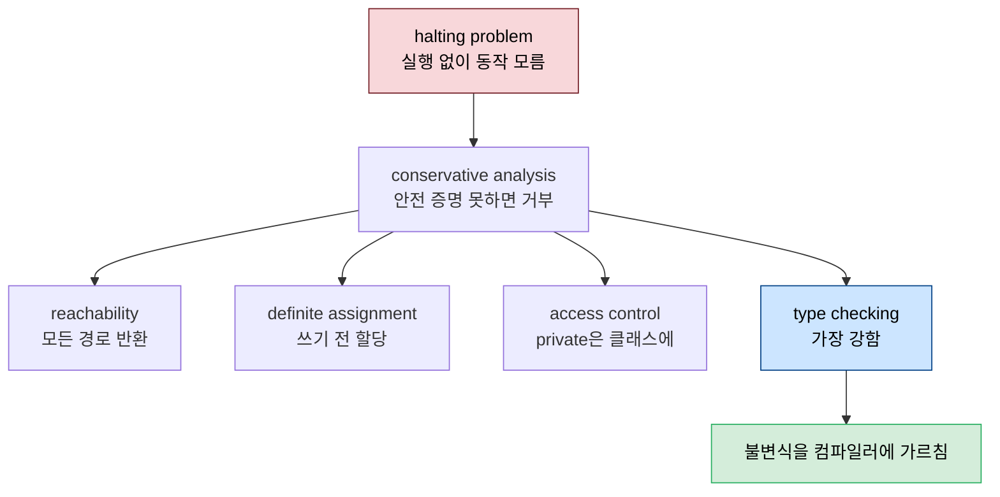
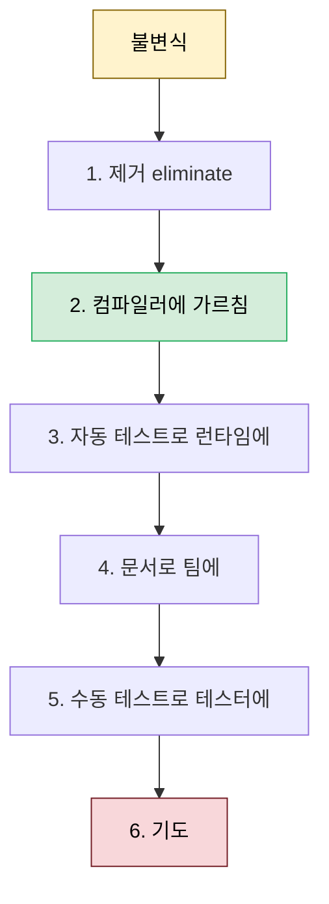

# 컴파일러와 협업 — 강점·약점과 책임 공유

---

> [02-01](02-01.리팩토링%20절차와%20규칙.md)부터 [02-06](02-06.데이터%20방어.md)까지의 1부가 한 게임 예제로 리팩토링 *절차*를 익혔다면, 이 글부터 시작하는 2부는 그 절차를 떠받치는 *일반 원칙*을 다룹니다. 첫 원칙은 컴파일러를 잔소리꾼이 아니라 *팀의 일원*으로 받아들이는 것입니다. 컴파일러가 무엇을 보장하고(강점) 무엇을 못 잡는지(약점)를 알면, 강점에 기대 불변식을 제거하고 약점은 피해 설계할 수 있습니다. 나아가 정확성의 책임을 컴파일러와 나누면, 코드를 직접 읽는 것보다 컴파일 성공에서 더 큰 확신을 얻게 됩니다. *Five Lines of Code* 7장이자 2부의 첫 장입니다.


## 학습 목표

> 컴파일러가 halting problem 때문에 무엇을 못 하는지, 어떤 강점(reachability·definite assignment·access control·type checking)으로 불변식을 제거하는지, 그리고 불변식을 다루는 6단계 사다리를 설명할 수 있는 것이 이 장의 목표입니다.

이 장을 다 읽고 다음 다섯 가지에 자신 있게 답할 수 있으면 학습이 완료됩니다.

1. halting problem과 conservative analysis가 무엇인지 설명할 수 있습니다.
2. 컴파일러의 네 가지 강점과 그것으로 불변식을 제거하는 법을 말할 수 있습니다.
3. 컴파일러가 못 잡는 약점(null·산술·범위·무한 루프·동시성)과 대응을 설명할 수 있습니다.
4. 컴파일러와 싸우는 행위(cast·any·런타임 타입·default·상속·unchecked exception)를 식별할 수 있습니다.
5. 불변식 6단계 사다리와 경고를 0으로 유지해야 하는 이유를 설명할 수 있습니다.


## 1. 컴파일러를 알아가기 — halting problem

> 실행하지 않고는 프로그램이 어떻게 동작할지 알 수 없습니다. 이것이 halting problem이고, 그래서 컴파일러는 "안전을 증명할 수 없으면 거부"하는 보수적 분석에만 의존할 수 있습니다.

컴파일러는 프로그램이라 일관성에는 강하지만(여러 번 컴파일해도 같은 결과) 판단에는 약합니다("의심스러우면 물어본다"). 근본 목표는 동등한 다른 언어 프로그램 생성이지만, 서비스로 런타임 특정 에러도 검증합니다. 실행하지 않고는 프로그램 동작을 알 수 없다는 것이 **halting problem**입니다 — 실행해도 한 경로만 관찰할 뿐입니다.

```typescript
// getDay()는 35를 절대 반환하지 않으므로 if 안은 실행되지 않음
if (new Date().getDay() === 35)
  5.foo();   // number에 foo는 없지만, 도달 불가라 무관
```

어떤 프로그램은 확실히 실패해 거부되고 어떤 것은 확실히 안전해 허용되며, 그 사이를 컴파일러가 결정합니다. 때로는 예상 못한 동작(런타임 실패 포함)을 허용하고, 때로는 안전을 보장할 수 없으면 거부합니다 — 이것을 **conservative analysis(보수적 분석)** 라 부릅니다. 보수적 분석은 특정 실패의 가능성이 0임을 증명하며, 우리는 보수적 분석에만 의존할 수 있습니다. halting problem은 특정 언어가 아니라 프로그래밍 언어 고유의 속성이고(이것이 프로그래밍 언어의 정의), 언어마다 *언제 보수적인가*만 다릅니다.


## 2. 컴파일러의 네 가지 강점

> 컴파일러는 모든 경로가 반환하는지(reachability), 변수가 쓰이기 전에 할당됐는지(definite assignment), 접근이 통제됐는지(access control), 타입이 맞는지(type checking)를 보장합니다. 이 강점에 기대 불변식을 제거합니다.

컴파일러가 보수적으로 증명하는 네 가지가 가장 쓸모 있는 강점입니다.

**Reachability** — 모든 경로에서 메서드가 반환하는지 검사합니다. TypeScript에서는 `never` 타입을 받는 `assertExhausted`로 이를 활용해, enum의 모든 값을 처리했는지(exhaustiveness check) 컴파일러가 확인하게 합니다.

```typescript
function assertExhausted(x: never): never {
  throw new Error("Unexpected object: " + x);
}
function handle(t: Color) {
  if (t === Color.RED) return "#ff0000";
  if (t === Color.GREEN) return "#00ff00";
  assertExhausted(t);   // Color.BLUE를 안 다뤄 컴파일 에러
}
```

**Definite assignment** — 변수가 쓰이기 전에 확실히 할당됐는지 봅니다(유용한 값이란 뜻은 아니고, 명시적으로 할당됐다는 것입니다). if 안에서만 초기화하면 모든 경로에서 할당이 보장되지 않아 거부됩니다. 이 분석의 다른 대상이 **read-only(final) 필드**인데, 생성자 종료 시점에 반드시 값을 가져야 합니다. 배열을 "이름이 John인 객체"용 read-only 필드를 가진 클래스로 감싸면, John이 사라지는 일 자체를 막아 불변식을 제거합니다.

**Access control** — `private`으로 만들면 우연히 새지 않습니다. 흔한 오해를 바로잡으면, **private은 객체가 아니라 클래스에 적용**되어 같은 클래스의 다른 객체의 private 멤버는 볼 수 있습니다. 불변식에 민감한 메서드는 private으로 보호합니다([02-06.데이터 방어](02-06.데이터%20방어.md)).

**Type checking** — 가장 강한 강점입니다. 변수·멤버 존재를 검증하고(1부에서 rename으로 에러를 낼 때 쓴 것), Enforce sequence를 가능하게 합니다. 빈 리스트를 표현할 수 없게 인코딩하면 `first([])`가 타입 에러가 됩니다.

```typescript
interface NonEmptyList<T> { head: T; }
class Last<T> implements NonEmptyList<T> {
  constructor(public readonly head: T) { }
}
// Cons<T>는 head + tail(NonEmptyList<T>) — 빈 리스트로는 만들 수 없음
function first<T>(xs: NonEmptyList<T>) { return xs.head; }
```

강타입은 binary가 아니라 스펙트럼입니다. 이 책의 TypeScript 부분집합은 Java·C# 수준이지만, 강도가 더 높은 언어로는 Borrowing types(Rust)·Polymorphic type inference(OCaml/F#)·Type classes(Haskell)·Union/intersection types(TypeScript)·Dependent types(Coq/Agda)가 있습니다. 타입 체커에 속성을 가르치는 것은 정교한 정적 분석기나 수동 증명과 동등한 최고 수준의 보안인데, 후자보다 훨씬 쉽고 오류가 적습니다.




## 3. 컴파일러가 못 잡는 약점

> null 역참조·산술 에러·범위 초과·무한 루프·동시성 문제는 컴파일러가 보장하지 못합니다. 약점을 알아야 약한 토대 위에 짓지 않습니다.

컴파일러가 보장하지 못하는 약점을 알면, 그 위에 안전을 쌓는 실수를 피합니다.

| 약점 | 무엇이 위험한가 | 대응 |
|------|----------------|------|
| **null 역참조** | null에 메서드를 호출하면 크래시. 도구가 전부 못 잡음 | "null 체크가 안 보이면 아마 null." 한 번 더 체크가 덜보다 낫습니다 |
| **산술 에러** | 0 나눗셈은 크래시, 오버플로는 조용히 이상 동작 | divisor가 0 아닌지·over/underflow 안 나는지 확인하거나 BigInteger |
| **out-of-bounds** | 범위 밖 인덱스 접근(예: −1 반환) 크래시 | 전체 순회하거나 definite assignment로 존재 증명 |
| **무한 루프** | 조용히 멈춤 | `while`→`for`→`foreach`·고수준 구조(`forEach`·stream·LINQ) |
| **동시성** | race condition·deadlock·starvation | 가능하면 *공유 가변 데이터를 가진 다중 스레드*를 피함 |

`sum(arr) / arr.length`는 `average(null)`로도, 빈 배열로도 컴파일러가 막지 못합니다 — null 역참조와 0 나눗셈 둘 다입니다. 동시성은 특히 위험합니다. 두 스레드가 공유 변수를 경쟁해 같은 값을 읽고 갱신하는 race condition, 서로의 lock을 기다리며 둘 다 멈추는 deadlock(문 앞에서 서로 양보하는 두 사람), 한 스레드가 영영 실행되지 못하는 starvation(한쪽 차량이 끊기지 않는 1차선 다리)이 그것입니다. 셋 다 "다중·공유·가변" 중 하나를 없애면 막힙니다. (Java에서의 메커니즘은 [05_JVM/03-02 메모리 가시성과 동기화](../java/05_JVM/03-02.메모리%20가시성과%20동기화.md)에서 다룹니다.)


## 4. 컴파일러를 사용하기 vs 싸우지 않기

> 컴파일러를 TODO 리스트·sequence 강제·미사용 탐지에 적극 쓰되, cast·any·런타임 타입·default·상속·unchecked exception으로 컴파일러를 속이거나 끄지 않습니다.

프로그래밍은 건설이 아니라 *소통*입니다(Martin Fowler) — 컴퓨터에·다른 개발자에·컴파일러에 코드를 읽힙니다. "Data structures are algorithms frozen in time"이라는 말처럼 프로그램은 팀의 도메인 지식이 시간 속에 얼어붙은 것이고, 컴파일러는 그 텍스트의 품질을 보장하는 편집자입니다. 그래서 컴파일러를 *사용*합니다 — 깨뜨릴 때 메서드를 rename해 컴파일러를 TODO 리스트로 쓰고(`_handled`를 붙여 enum 사용처를 훑고), Enforce sequence로 불변식을 강제하고, Try delete then compile로 미사용 코드를 탐지합니다.

```typescript
// 싸우는 행위 — cast는 "내가 더 안다"고 컴파일러를 끄는 진통제
let num = <number> JSON.parse(variable);   // 서드파티면 custom parser가 안전

// 게으름 — default는 누군가 정정을 잊게 만듦
class Animal { constructor(name: string, isMammal = true) { /* ... */ } }
let nemo = new Animal("Clown fish");   // nemo가 mammal이 되는 버그

// 런타임 타입 — 지식을 버려 type checking 강점을 out-of-bounds 약점으로
function f(conf: Map<string, string>) { return conf.get("prefix"); }  // 키 미검사
```

싸우는 행위는 세 죄에서 나옵니다. **타입 이해 부족** — cast(해당 식의 타입 검사를 끔)·`any`(type checker를 통째로 끔)·런타임 타입(10 파라미터를 `Map`으로 바꿔 지식을 버림, "빨래 싫다고 옷을 태우는" 격). **게으름** — default(정정을 잊음)·클래스 상속(default 동작이자 coupling, Mammal에 `laysEggs`를 더하면 Platypus가 깨짐)·unchecked exception(일어날 수 있는데 호출자가 안 막음). **아키텍처 이해 부족** — getter/setter나 private 필드를 인자로 넘겨 캡슐화를 깸. 대신 `this`를 넘겨 불변식을 지역에 둡니다.

> **한계** — 이 책의 "절대 금지"들은 우리 컨벤션과 충돌할 수 있습니다. JSON 경계에서 cast나 parser는 불가피하고, JPA·DTO는 default 값·getter/setter를 요구하며, Java의 checked exception은 이 책의 권고와 같은 방향이지만 람다·Stream과 만나면 오히려 불편합니다. 규칙은 *도메인 코어*에 한정해 "지식을 런타임이 아니라 컴파일타임에 두라"는 방향 지침으로 받아들이는 편이 안전합니다.


## 5. 불변식 6단계 사다리

> 불변식은 먼저 제거하고, 못 하면 컴파일러에, 그것도 못 하면 차례로 자동 테스트·문서·수동 테스트로 내려갑니다. 위일수록 장기적으로 저렴합니다.

지역 불변식은 scope가 제한돼 유지가 쉽지만, 여전히 컴파일러와 충돌합니다 — 우리가 컴파일러가 모르는 것을 알기 때문입니다. 원소 수를 `total`에 추적하는 `CountingSet`에서 random 원소를 고르는 메서드는, `total`이 원소 수라는 *지역 불변식*을 컴파일러가 몰라 reachability 분석에 실패합니다. `Impossible` 예외로 당장의 에러는 풀 수 있지만, 그것이 미래에 깨지지 않을 보장은 0입니다(remove에서 `total` 감소를 잊으면). 그래서 불변식은 다음 사다리("이길 수 없으면 합류하라")로 다룹니다.



① 제거하고 ② 못 하면 컴파일러에 가르치고 ③ 못 하면 자동 테스트로 런타임에 가르치고 ④ 못 하면 문서로 팀에 가르치고 ⑤ 못 하면 수동 테스트로 테스터에 가르치고 ⑥ 못 하면 기도합니다. 여기서 "못 한다"는 불가능이 아니라 *비현실적*이라는 뜻입니다. 아래로 갈수록 유지 부담이 커집니다 — 테스트는 sync가 어긋나면 알려 주지만 문서는 안 알려 주므로 문서가 더 비쌉니다. 위일수록 장기적으로 저렴하니, "테스트 쓸 시간이 없다"는 변명은 무장 해제됩니다(안 하면 장기적으로 더 비쌉니다). 단 수명이 짧은 프로토타입이라면 아래 옵션을 골라도 됩니다.

마지막으로 경고를 무시하지 않습니다. 병원의 **alarm fatigue**(경보 피로)처럼 경고를 무시할 때마다 미래에 덜 주의하게 되고, **broken window theory**처럼 나쁜 것 옆에 나쁜 것을 더하기 쉬워집니다. 사소한 경고가 결정적인 것을 가리는 것이 가장 위험하므로, **건강한 경고 수는 0 하나뿐**입니다. 오래 방치됐으면 상한을 두고 매월 줄여 0에 이른 뒤 경고 금지 설정을 켭니다.


## 6. 실무 적용

> 우리 도메인의 read-only 필드·접근 제어·체크 예외는 이미 컴파일러 협업의 사례입니다. 단 "절대 금지"는 경계 코드와 충돌하니 도메인 코어에 한정합니다.

이 장의 발상은 우리 코드에 이미 있습니다. 생성자에서 불변식을 검증하고 final 필드로 못 박는 도메인 모델·Factory가 definite assignment의 활용이고, Aggregate Root가 내부를 `private`으로 가두는 것이 access control의 활용입니다. Java의 checked exception(`Exception` 직접 상속)은 "일어날 수 있으면 호출자가 알게 하라"는 이 책의 권고와 정확히 같습니다([01_Core/03-01 예외 처리](../java/01_Core/03-01.예외%20처리.md)).

불변식 6단계 사다리는 실무 의사결정에 그대로 쓸 만합니다. 어떤 규칙을 강제할 때 "타입으로 막을 수 있나 → ArchUnit/컴파일 게이트로 막을 수 있나 → 테스트로 가드할 수 있나 → 문서로만 남길까"를 위에서부터 따지면, 가장 싸고 오래가는 방어를 먼저 고르게 됩니다. 다만 "절대 금지"들(cast·default·getter)은 JSON 직렬화·JPA·DI 같은 경계에서 불가피하므로, 도메인 코어에만 적용하고 경계에서는 프레임워크와 싸우지 않습니다.


## 7. 면접 대비 Q&A

> 컴파일러 협업 질문은 "컴파일러가 왜 다 못 잡나", "cast는 왜 나쁜가", "불변식을 어떻게 다루나" 같은 *경계*를 파고듭니다.

### Q1. halting problem과 conservative analysis가 무엇인가요?

halting problem은 실행하지 않고는 프로그램 동작을 알 수 없다는 프로그래밍 언어 고유의 속성입니다(실행해도 한 경로만 봅니다). 그래서 컴파일러는 안전을 보장할 수 없으면 거부하는 보수적 분석을 합니다 — 특정 실패의 가능성이 0임을 증명하는 것이고, 우리는 이 보수적 분석에만 의존할 수 있습니다.

### Q2. 컴파일러의 강점으로 불변식을 어떻게 제거하나요?

read-only 필드는 생성자 종료 시 값이 반드시 있어야 하므로(definite assignment), "이 값은 항상 존재한다"는 불변식을 제거합니다. 빈 리스트를 표현할 수 없게 타입으로 인코딩하면(type checking) "리스트가 비어 있지 않다"는 불변식이 컴파일 시점에 보장됩니다. 둘 다 사람이 지켜야 할 불변식을 컴파일러가 지키게 옮기는 것입니다.

### Q3. cast나 any가 왜 컴파일러와 싸우는 행위인가요?

cast는 "내가 컴파일러보다 안다"며 해당 식의 타입 검사를 끄는 것이고, `any`는 type checker를 통째로 끕니다. 타입 체커가 컴파일러의 가장 강한 부분이라 이를 끄는 것이 최악입니다. 만성 통증에 진통제를 주는 격으로, 지금은 편하지만 원인(타입 이해 부족)을 안 고칩니다. 서드파티 입력은 custom parser로 우리 타입으로 바꾸는 게 안전합니다.

### Q4. 불변식 6단계 사다리는 무엇이고 왜 위가 더 좋은가요?

제거 → 컴파일러 → 자동 테스트 → 문서 → 수동 테스트 → 기도 순입니다. 아래로 갈수록 유지 부담이 커지는데, 테스트는 코드와 어긋나면 실패로 알려 주지만 문서는 조용히 낡기 때문입니다. 위일수록 장기적으로 저렴하므로, 막을 수 있다면 타입·컴파일러로 막는 것을 먼저 시도합니다.

### Q5. 경고를 왜 0으로 유지해야 하나요?

경고를 무시할 때마다 경보 피로로 미래에 덜 주의하게 되고, 사소한 경고가 결정적인 경고를 가립니다. 건강한 경고 수는 0뿐이라, 오래 방치됐으면 상한을 두고 매월 줄여 0에 이른 뒤 경고 금지 설정을 켭니다. 깨끗한 코드베이스라야 broken window를 막을 수 있습니다.


## 관련 문서

> 이 글이 컴파일러 협업의 *일반 원칙*이라면, 그 원칙이 1부에서 어떻게 쓰였는지와 Java에서의 구체 메커니즘은 아래 문서가 맡습니다.

- [02-06.데이터 방어](02-06.데이터%20방어.md) — 1부 마지막. access control·Enforce sequence·private 필드 대신 this 넘기기가 이 글의 강점 활용으로 다시 정리됨
- [02-04.타입 코드를 다형성으로](02-04.타입%20코드를%20다형성으로.md) — assertExhausted·never로 switch를 검증한 exhaustiveness check가 이 글 §2 reachability의 본체
- [../java/05_JVM/03-02.메모리 가시성과 동기화](../java/05_JVM/03-02.메모리%20가시성과%20동기화.md) — §3 동시성 약점(race condition·deadlock·starvation)의 Java 메커니즘
- [../java/01_Core/03-01.예외 처리](../java/01_Core/03-01.예외%20처리.md) — checked/unchecked exception의 Java 문법. 이 글 §4 "unchecked는 일어날 수 없는 것에만"의 근거
