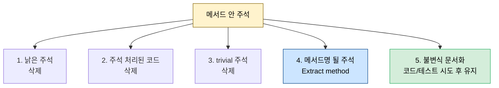
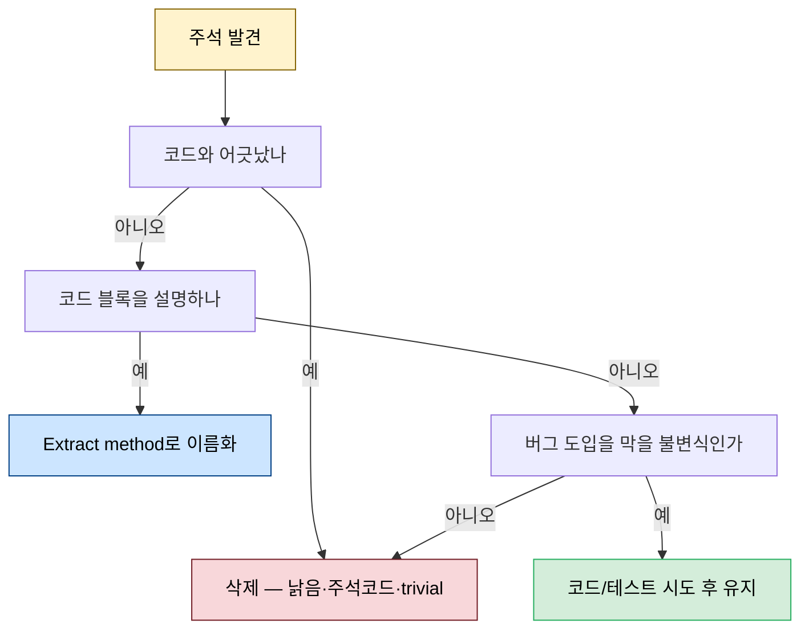

# 주석 멀리하기 — 다섯 종류와 각각의 처리

---

> [03-01.컴파일러와 협업](03-01.컴파일러와%20협업.md)이 컴파일러를 팀의 일원으로 삼는 2부의 첫 원칙이었다면, 이 글은 그 연장에서 *주석*을 다룹니다. 주석은 컴파일러가 검사하지 않아 낡고 오해를 부르기 쉬우므로, 전달하는 코드에서는 대체로 피합니다. Kevlin Henney의 "코드가 말할 수 없는 것만 주석으로 남겨라"를 기준으로, 메서드 안의 주석을 다섯 종류로 나눠 각각 어떻게 처리하는지 — 삭제할 것, 메서드 이름으로 바꿀 것, 유지할 것 — 를 정리합니다. *Five Lines of Code* 8장이자 2부의 둘째 장입니다.


## 학습 목표

> 주석이 왜 위험한지, 가치를 더하는 주석과 그렇지 않은 주석을 어떻게 가르는지, 그리고 다섯 종류의 주석을 각각 어떻게 처리하는지를 설명할 수 있는 것이 이 장의 목표입니다.

이 장을 다 읽고 다음 다섯 가지에 자신 있게 답할 수 있으면 학습이 완료됩니다.

1. 주석이 위험한 이유(컴파일러 미검사·낡음·데오도란트)를 설명할 수 있습니다.
2. "코드가 말할 수 없는 것만 주석"이라는 기준의 뜻을 말할 수 있습니다.
3. 주석 다섯 종류와 각각의 처리(삭제·메서드명화·유지)를 말할 수 있습니다.
4. 주석을 메서드 이름으로 바꾸는 것이 왜 Extract method인지 설명할 수 있습니다.
5. 불변식 문서화 주석을 코드→테스트→주석 순으로 다루는 이유를 설명할 수 있습니다.


## 1. 주석은 왜 위험한가

> 주석은 컴파일러가 검사하지 않아 낡고 오해를 부르기 쉽고, 나쁜 코드 위에 덮는 데오도란트가 되기 쉽습니다. 그래서 전달하는 코드에서는 대체로 피합니다.

여기서 다루는 주석은 **메서드 *안*의 주석**입니다 — Javadoc처럼 외부 도구가 쓰는 문서 주석이 아닙니다. 주석은 잘 쓰면 가치 있지만, 잘 쓰는 법을 공부하는 사람이 드물어 대개 나쁜 주석만 양산되어 코드의 가치를 떨어뜨립니다. 그래서 일반 규칙은 *회피*입니다. Rob Pike가 1989년에 세 이유를 들었습니다 — ① 코드가 명확하고 좋은 타입·변수 이름을 쓰면 스스로 설명하고, ② 컴파일러가 검사하지 않아 정확성이 보장되지 않으며(특히 코드 수정 후 오해를 부르는 주석은 위험), ③ 주석이 코드를 어지럽힙니다. Martin Fowler는 주석을 smell로 보며, 흔히 *나쁜 코드 위에 덮는 데오도란트*라고 합니다 — 주석을 더하는 대신 코드를 청소해야 합니다.

교육이 주석으로 코드를 설명하라고 요구하는 것은 과제에 중간 계산식을 적게 하는 것과 같아, 교육엔 좋아도 실무엔 덜 유용합니다. Kevlin Henney의 말처럼 "이해할 수 없는 코드를 쓴 사람이 주석은 명료하게 쓸 거라는 가정은 흔한 오류"입니다. 주석은 컴파일러가 모르므로 제약 없이 쓰기 쉽지만, 바로 그 때문에 수명이 긴 시스템에서 코드와 어긋나 무관해지거나 더 나쁘게는 오해를 줍니다. 그래서 기준은 하나입니다 — **"코드가 말할 수 없는 것만 주석으로 남겨라"**(Kevlin Henney). 중간 단계의 주석은 훌륭하니, 주석은 리팩토링 단계에서 다루고 전달 전에 "더 나은 표현이 없나"를 항상 따집니다.


## 2. 다섯 종류와 각각의 처리

> 메서드 안 주석을 다섯 종류로 나눠 쉬운 해결부터 어려운 순으로 다룹니다. 넷은 삭제하거나 메서드 이름으로 바꾸고, 마지막 하나(불변식 문서화)만 조건부로 유지합니다.

Robert C. Martin의 *Clean Code*는 주석을 스무 종 가까이 나누지만, 너무 많아 추적이 어렵습니다. 그래서 다섯 종류로 나눠 각각 구체적 대응을 둡니다. 쉬운 해결에서 어려운 순입니다.



**① 낡은 주석 — 삭제.** 무관하거나 부정확한(틀리거나 오해를 주는) 주석입니다. 원래 의도는 좋았으나 코드와 sync가 어긋난 것입니다. 읽는 시간만 먹으니 삭제하고, 더 나쁜 *오도*는 거짓에 기대 설계해 재작업·버그를 부르니 더 빨리 지웁니다.

```typescript
// 주석은 "and", 조건은 "or" — 불일치하는 낡은 주석 (위험)
if (element.hasSelection() || element.isMultiSelect()) {
  // Is has a selection and allows multi selection
  // ...
}
```

**② 주석 처리된 코드 — 삭제.** 코드 제거 실험은 주석 처리가 빠르지만(좋은 실험법), 실험 후에는 지웁니다. 버전 관리에 있으니 복구가 쉽습니다. 올바른 방법은 Git 브랜치를 만들어 옛 코드를 지우고 새 코드를 작업하다, 안 되면 브랜치를 버리고 되면 main에 머지하는 것입니다.

```typescript
function fib(n: number) {
  // if (n <= 1) return n;            // 옛 알고리즘을 주석 처리 — 삭제 대상
  // else return fib(n-1) + fib(n-2); // 버전 관리에 있으니 지워도 복구 가능
  return C * (Math.pow(PHI, n) - Math.pow(PHI_, n));
}
```

**③ trivial 주석 — 삭제.** 코드가 주석만큼 읽기 쉬우면 아무것도 더하지 않습니다. 코드를 스캔할 때 무시하는 주석도 여기 속하니, 아무도 안 읽으면 공간만 차지해 무료로 제거합니다(예: `// Log error` 위의 `Logger.error(...)`).

**④ 메서드 이름이 될 주석 — Extract method.** 기능이 아니라 *코드*를 문서화하는 주석은, 그 블록을 주석과 같은 이름의 메서드로 추출하면 주석이 trivial해져 삭제됩니다([02-03 §2 Extract method](02-03.긴%20함수%20쪼개기.md)에서 본 것입니다).

```typescript
// Before — 주석이 코드 블록을 설명
// Build request url
if (queryString) fullUrl += "?" + queryString;

// After — 주석을 메서드 이름으로 (주석은 사라짐)
fullUrl = buildRequestUrl(fullUrl, queryString);
```

긴 메서드 이름을 싫어하기 쉽지만, 그것은 자주 호출하는 메서드에만 문제입니다. 언어에서 자주 쓰는 단어가 짧듯, 코드베이스도 자주 쓰는 것일수록 설명이 덜 필요해 이름이 짧아집니다. 이런 주석은 주로 *일을 계획하며 코끼리를 쪼갤 때* 생깁니다(`// Fetch data / Check / Transform / Else / Submit` 같은 road map). 일부는 구현 후 trivial해지고(예: `Else`) 나머지는 메서드가 되니, 코드를 쓴 *뒤에* 가치를 더하는지 비판적으로 평가합니다.


## 3. 불변식 문서화 주석은 유지한다

> 다섯째는 비지역 불변식을 문서화하는 주석입니다. "이 주석이 누군가 버그 도입을 막을까?"로 식별하고, 코드→테스트로 옮길 수 없을 때만 주석으로 유지합니다.

마지막 종류는 *비지역 불변식*을 문서화하는 주석입니다 — 버그가 잦은 바로 그곳입니다. "이 주석이 언젠가 누군가 버그 도입을 막을까?"라고 물어 식별합니다. 이런 주석을 만나면 먼저 코드로 만들 수 있는지(때로 컴파일러로, [03-01 §2](03-01.컴파일러와%20협업.md))를 보고, 드무니 그다음 자동 테스트로 검증할 수 있는지를 봅니다. 둘 다 비현실적일 때만 주석으로 유지합니다 — [03-01 §5 불변식 6단계 사다리](03-01.컴파일러와%20협업.md)의 "제거→컴파일러→테스트→문서" 순서를 주석에 적용한 것입니다.

```typescript
// 인증·복잡한 상호작용은 테스트가 끔찍히 어려워 주석이 정당
// Log off used to force re-authentication on next request
session.logout();
```

`session.logout()`처럼 수상해 보이는 문장에 이유를 단 주석은, 인증 같은 상호작용을 테스트·시뮬레이션하기가 끔찍히 어렵기에 정당합니다. 한편 `todo`(아직 안 함)·`fixme`(아마 잘못됨)·`hack`(서드파티 우회)은 코드의 불변식이 아니라 *프로세스의 불변식*입니다. 티켓 시스템에 두자는 주장도 정당하지만, 코드 안에 둔다면 *몇 개인지 보이고 그 수가 줄어야* 합니다 — 미루지 말고 실제로 고쳐 주석을 없애는 쪽으로 갑니다. "나무 심기 가장 좋은 때는 20년 전, 두 번째로 좋은 때는 지금"이라는 말 그대로입니다.


## 4. 실무 적용

> 우리 프로젝트의 "JIRA 번호·외부 버그는 주석에" 관행은 이 장의 5종 중 ⑤(불변식 문서화)에 해당합니다. 나머지 4종은 코드 리뷰에서 적극 지워도 됩니다.

이 장의 5분류는 우리 코드 리뷰 기준과 정확히 맞물립니다. "왜 이 코드가 여기 있는가"를 코드로 추적할 수 없는 외부 컨텍스트(이슈 번호·외부 시스템 버그·정책 결정)를 담은 주석이 ⑤ 불변식 문서화에 해당해, 리뷰에서 가치를 인정받습니다([01-01 §3 클린 코드의 주석](01-01.클린%20코드%20원칙.md)이 같은 기준을 줍니다). 반대로 ①~④(낡음·주석 처리 코드·trivial·메서드명 될 것)는 리뷰에서 망설임 없이 지우거나 메서드로 바꿔도 됩니다.

주석을 메서드 이름으로 바꾸는 ④는 5줄 규칙과 짝을 이룹니다 — 긴 메서드를 쪼개며 자연스럽게 의도가 이름에 담기므로, 계획용 주석으로 골격을 잡고 구현 후 메서드로 승격시키는 흐름이 실무에서 잘 맞습니다. 다만 "주석을 전부 없애라"는 극단은 위험합니다. ⑤처럼 테스트가 비현실적인 불변식은 주석이 가장 싼 방어이고, 그것까지 지우면 버그가 잦은 곳의 마지막 안전망을 잃습니다.

코드 리뷰에서 주석을 만나면 다음 판정 흐름으로 빠르게 분류합니다.




## 5. 면접 대비 Q&A

> 주석 질문은 "주석이 왜 나쁜가", "그럼 언제 남기나", "낡은 주석은 왜 위험한가" 같은 *경계*를 파고듭니다.

### Q1. 주석을 왜 피하라고 하나요?

컴파일러가 검사하지 않아 코드 수정 후 낡아 무관해지거나 오해를 주기 때문입니다. 나쁜 코드 위에 덮는 데오도란트가 되기도 합니다. 기준은 "코드가 말할 수 없는 것만 주석으로 남겨라"입니다 — 코드·타입·변수 이름으로 표현할 수 있으면 그쪽이 낫습니다.

### Q2. 낡은 주석이 왜 단순 노이즈보다 위험한가요?

읽는 시간만 먹는 데 그치지 않고, 거짓 정보에 기대 설계하면 재작업과 버그를 부르기 때문입니다. 주석과 조건이 "and/or"로 어긋난 경우처럼, 오해를 주는 주석은 trivial한 주석보다 적극적으로 해롭습니다.

### Q3. 주석 다섯 종류와 처리는?

① 낡은 주석 → 삭제, ② 주석 처리된 코드 → 삭제(버전 관리에 있음), ③ trivial 주석 → 삭제, ④ 메서드명이 될 주석 → Extract method로 이름화, ⑤ 비지역 불변식 문서화 → 코드나 자동 테스트로 옮기고 안 되면 유지. 넷은 없애고 마지막 하나만 조건부로 남깁니다.

### Q4. 주석을 메서드 이름으로 바꾸는 게 왜 Extract method인가요?

코드 블록을 설명하는 주석은, 그 블록을 주석과 같은 이름의 메서드로 추출하면 이름이 의도를 대신 말해 주석이 trivial해지고 삭제됩니다. 긴 이름이 부담되지만 자주 호출하는 메서드만 문제이고, 자주 쓰는 것일수록 설명이 덜 필요해 이름도 짧아집니다.

### Q5. 불변식 문서화 주석은 왜 바로 지우지 않나요?

비지역 불변식은 버그가 잦은 곳이라, 그 주석이 누군가의 버그 도입을 막을 수 있기 때문입니다. 먼저 코드(컴파일러)로, 그다음 자동 테스트로 옮기려 시도하되, 인증처럼 테스트가 비현실적이면 주석이 가장 싼 방어이므로 유지합니다. TODO/FIXME/HACK은 프로세스 불변식이라, 코드에 둔다면 수가 줄어들도록 관리합니다.


## 관련 문서

> 이 글이 주석을 다섯 종류로 처리하는 법이라면, 그 처리가 기대는 Extract method·불변식 사다리·클린 코드의 주석 원칙은 아래 문서가 맡습니다.

- [03-01.컴파일러와 협업](03-01.컴파일러와%20협업.md) — §5 불변식 6단계 사다리. 이 글 §3의 "불변식 주석은 코드→테스트→유지 순"이 그 사다리를 주석에 적용한 것
- [02-03.긴 함수 쪼개기](02-03.긴%20함수%20쪼개기.md) — §2 Extract method. 이 글 §2의 "주석을 메서드 이름으로(④)"가 그 패턴의 적용
- [01-01.클린 코드 원칙](01-01.클린%20코드%20원칙.md) — §3 주석(변명이 아니다). "왜는 주석에, 나머지는 코드로"라는 같은 기준의 줄 단위 디테일과 JIRA 외부 컨텍스트 예
