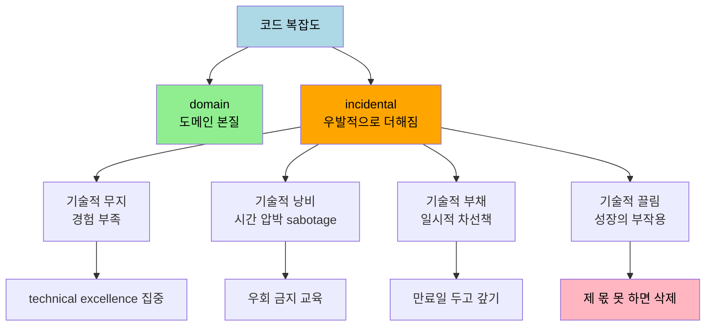
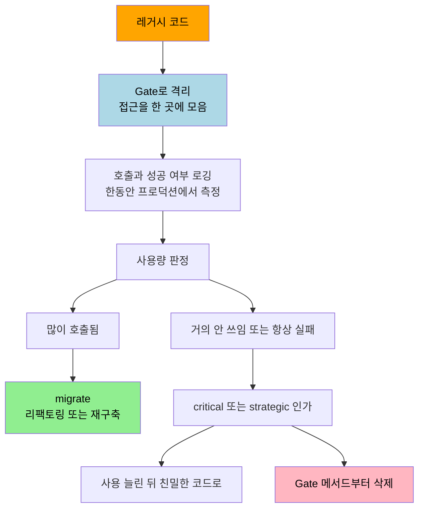

# 코드 삭제를 사랑하라 — 부채로서의 코드와 제거의 기술

---

> [03-02.주석 멀리하기](03-02.주석%20멀리하기.md)가 코드에 군더더기로 남는 주석을 지우는 이야기였다면, 이 글은 그 시야를 넓혀 *코드 자체*를 지우는 이야기입니다. 우리는 코드를 자산으로 여기지만 *Five Lines of Code* 9장은 정반대를 말합니다 — 코드는 부채입니다. 기능을 얻으려고 떠안는 필요악일 뿐이고, 유지하는 한 비용을 청구합니다. 무엇이 개발을 느리게 만드는지(기술적 무지·낭비·부채·끌림)를 먼저 가르고, 레거시·동결 프로젝트·브랜치·문서·테스트·설정·라이브러리·기능에서 제 몫을 못 하는 것을 어떻게 덜어내는지를 정리합니다. *Five Lines of Code* 2부의 셋째 장입니다.


## 학습 목표

이 글을 읽고 나면 다음 다섯 가지를 자신 있게 답할 수 있습니다.

- 코드가 왜 자산이 아니라 부채인지, 매몰비용 오류가 왜 함정인지 설명할 수 있다.
- incidental complexity의 네 갈래(기술적 무지·낭비·부채·끌림)를 origin과 해결책으로 구분할 수 있다.
- strangler fig 패턴을 Gate로 구현해 레거시의 결합도와 사용량을 측정하는 절차를 설명할 수 있다.
- 동결 프로젝트와 spike and stabilize 패턴에서 "삭제를 default로" 만드는 이유를 안다.
- 브랜치·문서·테스트·설정·라이브러리·기능을 각각 어떤 기준으로 지우는지 판단할 수 있다.


## 1. 코드는 부채입니다

> 시스템이 유용한 것은 기능 때문이고 기능은 코드에서 나오므로 코드가 암묵적으로 가치 있다고 느끼기 쉽지만, 코드는 부채입니다. 기능을 얻기 위해 떠안는 필요악입니다.

코드를 가치 있다고 느끼는 이유는 둘입니다. 하나는 기능이 코드에서 나온다는 점이고, 다른 하나는 코드를 만드는 비용이 비싸다는 점입니다. 숙련된 사람이 오랜 시간(과 많은 카페인)을 들여야 합니다. 그런데 시간과 노력을 들였다는 이유로 무언가에 가치를 부여하는 것을 **매몰비용 오류(sunk-cost fallacy)** 라 부릅니다. 가치는 투자 자체가 아니라 *투자의 결과*에서 옵니다. 코드를 다룰 때 이 점이 결정적인 까닭은, 그 코드가 가치 있든 없든 우리는 유지보수에 노력을 계속 쏟아야 하기 때문입니다.

자동화의 함정도 같은 뿌리에서 옵니다. 지루한 수동 작업을 보고 "이거 자동화할 수 있겠다"고 생각하다가, 자동화 코드에 정신이 팔려 원래 문제보다 자동화에 더 많은 시간을 쓰는 일이 흔합니다. 손으로 풀었으면 더 빨랐을 일을 말입니다. 코드를 쓰는 즐거움과 비용을 동시에 다루려면, kata와 spike를 커리어 내내 훈련으로 삼되 그 실험 코드는 직후에 곧바로 지우는 편이 낫습니다.

이 장 전체를 하나로 줄이면 **less is better(적은 것이 낫다)** 입니다. Christopher Hsee가 1998년에 한 연구가 이를 보여줍니다. 24피스 디너세트의 가치를 측정한 뒤 깨진 조각 몇 개를 *추가*하자 전체 가치가 *떨어졌습니다*. 더하기만 했는데도 가치가 줄어든 것입니다. 시스템에 오래 남을 코드가 어느 정도는 필요하지만(도메인의 복잡도에 따라 다릅니다), 적은 쪽이 낫다는 원칙이 그 위에 섭니다.


## 2. incidental complexity의 네 갈래

> 시스템은 기능·실험·예외 처리가 쌓이며 자연히 커집니다. 이 복잡도는 도메인이 요구한 것과 우발적으로 끼어든 것으로 갈리고, 후자는 다시 네 갈래로 나뉩니다.

복잡도에는 두 종류가 있습니다. **domain complexity** 는 도메인 본질에서 옵니다 — 세금 계산 시스템은 세법이 복잡하니 우리가 무엇을 하든 복잡합니다. **incidental complexity** 는 도메인이 요구하지 않았는데 우발적으로 더해진 복잡도입니다. 흔히 이것을 기술 부채와 같은 말로 쓰지만, 저자는 더 잘게 나눕니다. origin과 해결책이 다른 네 갈래입니다.

| 갈래 | origin(어디서 오는가) | 해결책 |
|------|----------------------|--------|
| **technical ignorance**(기술적 무지) | 더 나은 방법을 몰라서 한 나쁜 결정 | technical excellence에 지속적으로 집중 |
| **technical waste**(기술적 낭비) | 시간 압박에 *의도적으로* 우회 | 절대 우회하지 않도록 교육 — 이득이 없으니 sabotage |
| **technical debt**(기술적 부채) | 이득을 위해 *일시적으로* 택한 차선책 | 만료일을 두고 갚기 |
| **technical drag**(기술적 끌림) | 코드베이스가 커진 부작용 | 제 몫 못 하는 것을 삭제 |

**기술적 무지** 는 가장 단순합니다. 무엇을 모르는지조차 모르거나 배울 시간이 없어, 불필요한 결합 없이 풀 실력이 모자랄 때 생깁니다. 지속 가능한 유일한 해결은 애자일 선언문의 한 원칙입니다 — "Continuous attention to technical excellence and good design enhances agility." 책과 블로그, 컨퍼런스, 공동 프로그래밍으로 지식을 나누되, 무엇보다 **의도적 연습(deliberate practice)** 을 대신할 것은 없습니다. 인지 능력을 끌어올려야 하는 순간에는 **공동 프로그래밍** 이 효과적입니다. Llewellyn Falco가 정리한 strong-style pairing의 근본 원칙은 "어떤 아이디어든 코드로 들어가기 전에 다른 사람의 뇌를 거쳐야 한다"는 것입니다. 키보드 앞 사람은 다른 사람이 지시한 것만 합니다. 두 명이면 pair programming, 여럿이면 ensemble programming입니다. 라이브로 리뷰가 되니 비동기 코드 리뷰가 필요 없어져 전달 과정이 더 가벼워집니다.

**기술적 낭비** 는 흔히 시간 압박에서 옵니다. 문제를 충분히 이해하지 못한 채 바빠서 넘어가거나, 시간이 없다고 테스트·리팩토링을 건너뛰거나, 데드라인 때문에 프로세스를 우회합니다. 이 결정은 의도적입니다 — 외부 압박 탓이라도 개발자가 더 나은 지식에 반해 선택한 것이라, 저자는 이를 **sabotage(태업)** 라 부릅니다. 저자는 이해관계자에게 이렇게 묻는다고 합니다. "브레이크와 에어백을 검사하지 않는 대신 새 차를 3주 일찍 받겠습니까?" 어떤 산업에는 규제가 있고, 개발자에게는 관행이 있습니다. 압박을 받아도 지킵니다.

**기술적 부채** 는 더 미묘합니다. 이득을 위해 *일시적으로* 차선책을 택하는 것입니다. 핵심은 *일시적* 이라는 점이고, 일시적이지 않으면 부채가 아니라 낭비입니다. 긴급 이슈를 hotfix로 막고 나중에 제대로 다시 구현하는 경우가 그렇습니다. 부채를 지는 것은 전략적 결정이며, **만료일(expiry date)이 있는 한** 본질적으로 나쁘지 않습니다. 부채의 이자율 비유와 보이스카우트 규칙은 [02-02.리팩토링의 기술적 토대](02-02.리팩토링의%20기술적%20토대.md)의 §5에서 다뤘으니 여기서는 네 갈래 중 하나라는 위치만 짚습니다.

**기술적 끌림** 은 가장 모호합니다. 개발을 느리게 만드는 모든 것이고, 앞의 세 갈래에 더해 문서·테스트·심지어 모든 코드를 포함합니다. 자동 테스트는 (의도적으로) 코드 변경을 어렵게 만듭니다 — 테스트도 함께 바꿔야 하니까요. 문서는 갱신해야 해서, 코드는 변경의 파급을 고려하고 유지보수해야 해서 우리를 늦춥니다. 끌림은 무언가를 만든 부작용이라 그 자체로 나쁘지는 않지만, *드물게 쓰이는* 것을 유지할 때는 나쁩니다. 저자가 만든 어느 서브시스템은 고객이 끝내 채택하지 않았는데도 "준비되면 쓰게 남겨두라"는 지시 때문에, 이후 모든 작업에서 "고객이 갑자기 이걸 쓰면?"을 고려해야 했습니다. "남겨둬도 손해 볼 것 없다"는 흔한 주장은 거짓입니다. 답은 **가능한 한 많이 삭제하되 그 이상은 말 것** 입니다. 제 값을 못 하면 조금 쓰여도 지웁니다. "Use it or lose it."




## 3. 친밀도로 코드를 분류합니다

> 코드 삭제의 비용은 그 코드를 얼마나 잘 아느냐에 달려 있습니다. 최근 만든 코드는 친밀하고, 자주 쓰는 라이브러리는 익숙하며, 그 사이는 전부 미지의 영역입니다.

Dan North는 GOTO 2016의 "Software, faster" 발표에서 코드를 친밀도 세 단계로 나눴습니다. 최근에 개발한 코드는 친밀하고, 자주 쓰는 라이브러리와 유틸리티는 익숙하며, 그 사이의 모든 것은 미지의 영역이라 다시 배워야 해서 유지비가 비쌉니다. 끌림과 연결하면, 자주 써서 익숙한 코드는 남겨도 됩니다 — 자주 쓰는 것만이 미지로 퇴화하는 것을 막는 유일한 길입니다.

여기에 시간이라는 축이 더해집니다. **친밀한 코드를 지우는 일은 먼저 이해해야 하는 코드를 지우는 일보다 싸고 안전합니다.** Dan North는 갓 만든 코드의 친밀도가 약 6주 후 퇴화하기 시작해 빠르게 미지로 넘어간다고 봅니다. 정확한 기간이 중요한 것은 아니지만, 작성자조차 시간이 지나면 그 코드를 이해하는 데 의미 있는 우위를 잃습니다. 이 글에서는 이후 그 기준점을 6주로 가정합니다.


## 4. 레거시 — strangler fig로 들여다보고 지웁니다

> 레거시 코드는 흔히 "수정하기 두려운 코드"로 정의됩니다. 어디가 얼마나 쓰이고 그중 무엇이 실패하는지 모르니, 먼저 측정 장치를 끼워 넣어야 합니다.

레거시 코드는 흔히 **"수정하기 두려운 코드"** 로 정의되고, 이는 **circus factor** 가 낮은 결과입니다. circus factor(bus factor·lottery factor라고도 합니다)는 몇 명이 서커스단에 도망가면 지식이 소실되어 개발 일부가 멈추는지를 나타냅니다. "이 시스템 배포는 John만 안다"면 circus factor는 1입니다. 동작은 해도 편히 고치지 못하는 것 자체가 문제입니다 — 토요일 새벽 3시에 깨지면 누가 고칠지 알 수 없으니까요.

첫 단계는 레거시가 얼마나 쓰이는지 파악하는 것입니다. 그런데 호출 횟수만으로는 부족합니다. 레거시는 호출돼도 실패해 결과가 안 쓰이는 경우가 흔하니 성공한 호출 수도 알아야 하고, 나머지 코드와 얼마나 강하게 묶여 있는지도 알아야 합니다. 저자는 결합도부터 권장합니다.

[01-01.클린 코드 원칙](01-01.클린%20코드%20원칙.md)에서 서비스 수준의 점진적 대체로 소개한 **strangler fig 패턴** 을, 여기서는 코드 수준의 측정 장치로 씁니다. strangler fig 나무가 기존 나무를 감싸고 결국 목 졸라 죽이듯, host인 레거시를 감쌉니다. 절차는 이렇습니다. 레거시 클래스들을 새 namespace에 캡슐화하고, 모든 접근이 통과할 **Gate 클래스** 를 둡니다. 새 namespace의 public 한정자를 전부 package-private로 낮추면 외부 접근이 막혀 컴파일 에러가 나는데, 그 에러는 Gate에 public 함수를 더해 해결합니다.

```typescript
// Listing 9.3 — 레거시를 namespace로 감싸고 Gate로 접근을 한 곳에 모읍니다
namespace Legacy {
  class LegacyA {
    static a() { /* ... */ }
  }
  class LegacyB {
    b() { /* ... */ }
  }
  export class Gate {
    a() { return LegacyA.a(); }
    bClass() { return new LegacyB(); }
  }
}

let gate = new Legacy.Gate();
gate.a();
let b = gate.bClass();
b.b();
```

이 시점에서 레거시의 접점은 전부 Gate의 함수이므로 접점 수를 정확히 알게 됩니다. 그리고 Gate 한 곳에 모니터링을 넣으면 매 호출과 성공 여부를 기록할 수 있습니다. 최소한의 장치이고 원하는 만큼 정교하게 만들 수 있습니다.

```typescript
// Listing 9.5 — Gate에서 호출과 성공/실패를 로깅해 사용량을 측정합니다
export class Gate {
  a() {
    try {
      let result = LegacyA.a();
      Logger.log("a success");
      return result;
    } catch (e) {
      Logger.log("a fail"); // 호출됐지만 실패한 경우를 따로 셉니다 — 레거시에 흔합니다
      throw e;
    }
  }
}
```

이대로 프로덕션에 올리고 기다립니다. 한 달에 한 번도 안 쓰이는 기능은 유지하지 않는다는 기준이 비합리적이지 않습니다. 한동안 두면 각 부분의 사용량과 항상 실패하는 호출이 드러납니다. 그다음에는 쉬운 결정부터 처리합니다. 가장 많이 호출되는 것은 거의 확실히 migrate하고, 가장 적게 호출되는 것은 거의 확실히 삭제합니다. 양 극단을 먼저 정리하고 어려운 결정인 중간으로 향합니다. critical하거나 strategic한 코드라면 먼저 호출 수가 그 사실을 반영하도록 UI·교육·마케팅으로 사용을 늘린 뒤, 리팩토링해서 "최근" 범주로 옮기거나 재구축 후 Gate를 바꿔 전환합니다. critical하지도 strategic하지도 않으면 Gate의 메서드를 지웁니다 — 그러면 레거시의 큰 부분이 안 쓰이게 되고, 인터페이스 메서드는 Try delete then compile로 발견할 수 있습니다.




## 5. 동결 프로젝트와 spike and stabilize — 삭제를 default로

> 만들었지만 장벽 때문에 쓰지 못하는 동결 프로젝트는, 가만히 두면 미지의 끌림으로 굳습니다. 그래서 "아무것도 안 하면 사라지도록" default를 뒤집습니다.

이해관계자가 큰 기능을 요청해 다 만들었는데, 접근 권한이나 사용자 교육 같은 장벽 때문에 쓰지 못할 때가 있습니다. 기다리는 대신 다음 일로 넘어가면 **동결 프로젝트(frozen project)** 가 됩니다. 동결 프로젝트는 코드만이 아니라 DB 테이블·통합·서비스까지 포함하고, 원작자가 잊으면 — 특히 빠진 것이 사용자 교육뿐이면 — 시스템에 흔적이 없어 조사로도 발견되지 않습니다. main 브랜치에 안 쓰이는 코드가 표시 없이 남아 변경마다 고려해야 하고, 장벽이 풀릴 무렵 그 기능이 여전히 relevant할 보장도 없습니다.

해결의 핵심은 **default를 삭제로 뒤집는 것** 입니다. 코드 외부에 영향이 없으면 프로젝트를 main에서 revert해 별도 브랜치로 옮기고 tag를 단 뒤, 6주 후 그 tag를 지우는 노트를 남깁니다. 6주 안에 쓰기 시작하지 않으면 사라집니다. 코드 외부 변경을 포함하면 브랜치로 둘 수 없으니, 제거할 컴포넌트를 전부 적은 티켓을 만들어 6주 뒤로 예약합니다. 두 경우 모두 **의도적 행동을 취하지 않으면 코드가 사라지므로**, 이 시나리오에서는 기술적 끌림을 우발적으로 더할 수 없고 의도적으로만 더할 수 있게 됩니다.

큰 변경의 낭비를 줄이는 또 다른 방법이 Dan North의 **spike and stabilize** 패턴입니다(6주 규칙이 원래 여기서 왔습니다). 프로젝트를 spike로 취급해 정규 앱과 최대한 분리하고 고품질을 무시합니다 — 자동 테스트도 리팩토링도 없습니다. 단 결정적으로 **모니터링은 포함** 해 사용량을 압니다. 6주 후 돌아와 쓰였으면 제대로 재구현하고, 안 쓰였으면 삭제합니다. spike가 main과 최소한으로만 통합돼 있어 삭제가 쉽고, 쓰일지 모른 채 리팩토링·테스트에 들였을 시간까지 아낍니다.


## 6. 브랜치·문서·테스트 — 무엇을 어떤 기준으로 지우는가

> Git 브랜치는 몇 바이트뿐이라 거의 공짜처럼 보이지만 멘탈 오버헤드 측면에서는 비쌉니다. 문서와 테스트도 각각 제 몫을 못 하면 끌림이 됩니다.

**브랜치** 는 Git에서 몇 바이트뿐이라 제거에 덜 부지런해져 쌓입니다. 브랜치를 만드는 이유는 hotfix, 나중에 돌아갈 커밋의 tag, 동료 작업과 간섭 없이 작업하기입니다. hotfix와 협업용은 main에 머지하면 지워야 하고, tag 용도는 Git 내장 tagging을 써야 합니다. 더 어려운 것은 사람이 개입하는 gate(통합 팀·비동기 코드 리뷰) 때문에 main에 못 들어가고 막힌 브랜치입니다. 오래 사는 브랜치는 비싸고 영혼을 갉는 머지 충돌을 부릅니다. 해법은 Kanban의 **WIP(work in progress) limit** 을 빌려 브랜치 수에 hard limit을 두는 것입니다. limit은 최소한 workstation 수 이상이어야 하고(ensemble 하나·pair 하나·아니면 개발자 한 명), 한번 정하면 팀 크기 변경 외에는 어떤 이유로도 바꾸지 않습니다.

**문서** 가 값진 것은 정확히 세 조건을 충족할 때입니다 — **relevant**(올바른 질문에 답함)·**accurate**(답이 정확함)·**discoverable**(답을 찾을 수 있음). 하나라도 빠지면 가치가 크게 줄어듭니다. 낡은 문서의 위험은 어느 속성을 어겼느냐에 따라 다릅니다. discoverable 위반이 가장 덜 심각하고(조사·작성 시간만 낭비), irrelevant가 더 나쁘며(매번 무관한 부분을 건너뛰어야 함), inaccurate가 최악입니다(혼란을 넘어 에러를 부릅니다). 무엇을 문서화할지는 알고리즘으로 정합니다. 주제가 자주 변하면 문서화해도 얻을 것이 없고, 드물게 쓸 것이면 문서화하고, 자동화할 수 있으면 자동화하고, 그것도 아니면 외웁니다. 정확성을 유지하는 또 다른 방법은 자동 테스트 케이스 자체를 문서로 쓰는 것입니다.

**테스트** 는 red일 때만 행동을 일으켜야 가치가 있습니다. 이 기준에서 벗어난 세 종류는 지웁니다. **optimistic test** 는 `hash(a) === hash(b)` 같은 tautology라 실패할 수 없으니 무가치합니다 — "실패하는 것을 본 적 없는 테스트는 믿지 마라"는 말 그대로입니다. **pessimistic test** 는 항상 red라 alarm fatigue를 부르고 진짜 에러를 놓치게 합니다(실패 허용치는 0이어야 합니다). **flaky test** 는 예측 불가하게 red/green을 오가 행동을 일으키지 못합니다. 또 테스트가 코드보다 복잡해 리팩토링이 필요하다면, 그것은 테스트되는 코드에 적절한 아키텍처가 없다는 신호이므로 리팩토링 노력은 테스트가 아니라 코드에 들여야 합니다. 느린 e2e 테스트가 다른 테스트를 덜 돌리게 만들면, 빠른 테스트와 분리하거나 — 실패 원인이 없다면 그것도 optimistic test이니 — 제거합니다.


## 7. 설정·라이브러리·기능 — 시간과 의존을 좁힙니다

> 설정은 코드 복잡도와 테스트 공간을 늘리고, 라이브러리는 양날의 검이며, 기능조차 사용이 비용을 지불하지 못하면 부채입니다.

**설정** 은 "완벽하게 못 만들면 최소한 설정 가능하게 하라"는 격언처럼 유용하지만, 추가할 때마다 복잡도가 늘고 대개 테스트 공간이 두 배가 됩니다(각 옵션을 다른 모든 flag와 함께 테스트해야 하니 지수적으로 늘어납니다). 그래서 설정을 가능한 한 일시적으로 보고 수명으로 분류합니다.

- **experimental**: feature flag와 A/B 테스트가 예입니다. 기능 release 후 제거할 의도이므로 6주 안에 지웁니다. testing 설정은 experimental 단계를 벗어나 permanent로 굳기 쉬우니, 처음부터 experimental로 정하고 끝나는 즉시 제거할 리마인더를 둡니다.
- **transitional**: 레거시에서 신규로 옮기는 것 같은 큰 변경 중에 유용합니다. 6주 안에 끝나지 않으니 더 긴 복잡도를 감수하되, 전환이 사용자에게 invisible하면 설정을 코드 안 중앙 한 곳에 모아 하나의 collection으로 다룹니다. 전환이 완료되는 시점에 한 번에 통째로 지우는데, 안전하게 하려면 다시 strangler fig로 레거시 컴포넌트의 모든 접근을 Gate로 감쌉니다 — Gate를 에러 없이 지울 수 있게 되면 전체 레거시도 지울 수 있다는 뜻입니다.
- **permanent**: 사용을 늘리거나 유지가 trivial해야만 정당합니다. 같은 소프트웨어를 두 고객에 재사용하거나 usage tier를 나누는 설정은 사용자 수를 늘려 값어치를 하고, light/dark mode flag는 styling 최외곽만 건드려 유지보수에 영향이 없습니다. 이 둘 중 어느 것도 아니면 비용을 못 하니 제거합니다.

**라이브러리** 는 수천 줄을 아끼고 in-house보다 높은 품질·보안을 줍니다(저자는 보안을 평생 그 일에 바친 사람에게 맡기라 조언합니다). 그러나 양날의 검입니다 — 코드는 유지하지 않아도 업데이트는 해야 하고, 그때 우리 코드를 적응시켜야 하며, 예측성을 잃고, 의존하던 기능이 deprecated되면 대체를 만들어야 합니다. David Gilbertson의 사고 실험은 위험을 잘 보여줍니다. 콘솔에 색을 입히는 작은 라이브러리에 악성 코드를 숨겨 "사람들이 진통제처럼 npm 패키지를 설치"하는 흐름을 타고 수십만 다운로드를 얻어 데이터를 탈취한다는 이야기입니다. package manager 탓에 의존성 추가가 쉬워졌고, 우리 의존성뿐 아니라 의존성의 의존성까지 걱정해야 합니다. 해법은 셋입니다. 고품질 vendor를 골라 업데이트를 드물게 만들고, "아프면 더 자주 하라"는 DevOps 속담처럼 자주 업데이트해 작업을 잘게 쪼개며, 의존성을 가시화해 각 라이브러리가 *enhancing*인지 *critical*인지 분류합니다. jQuery의 수백 함수 중 Ajax 하나만 쓴다면 더 맞는 작은 라이브러리를 찾거나 in-house로 대체하는 편이 낫습니다.

마지막은 **동작하는 기능** 입니다. 코드는 부채이고 사용(usage)이 그 비용을 지불하는 가치입니다. 기능을 더하면 가치가 는다는 것은 흔한 오해입니다 — 이득(기능)은 복잡하니 비용을 리팩토링이나, 더 낫게는 코드 제거로 줄이는 편이 종종 쉽습니다. 사용 증가보다 비용이 큰 기능이라면 동작하더라도 지웁니다. 안 쓰이는 것은 잠재력과 무관하게 비용일 뿐입니다. 그래서 코드 삭제를 사랑해야 합니다 — 삭제는 즉시 코드베이스를 더 값지게 만듭니다.


## 8. 실무에 적용하기

이 장의 원칙은 우리가 매일 마주하는 코드 정리 판단에 그대로 닿습니다. 핵심은 "지울지 말지"를 직관이 아니라 측정과 분류로 바꾸는 것입니다.

- **fallback 경로를 죽은 코드로 굳히지 않기**: [02-02 §5](02-02.리팩토링의%20기술적%20토대.md)에서 다룬 "추가에 의한 변경"의 약점이 여기서 만납니다. fallback용으로 남긴 옛 경로는 사용량을 측정하지 않으면 기술적 끌림으로 굳습니다. Gate나 간단한 호출 카운터로 한 달간 사용을 재고, 0이면 6주 노트와 함께 지웁니다.
- **feature flag에 만료일 박기**: 새 flag를 만들 때 티켓이나 캘린더에 6주 후 제거 리마인더를 함께 만듭니다. experimental 설정이 permanent로 새어 사용자 베이스를 둘로 가르는 것을 처음부터 막습니다.
- **stale 브랜치에 hard limit**: 팀의 workstation 수를 세어 브랜치 한도를 정하고, PR 머지 시 Delete Branch를 습관화합니다. 막힌 브랜치가 한도에 닿으면 그것이 곧 CI 병목 신호입니다.
- **테스트는 한 번 실패시켜 보기**: 새 테스트를 작성하면 일부러 깨뜨려 red를 확인한 뒤 통과시킵니다. tautology와 flaky를 작성 시점에 걸러냅니다.


## 9. 면접 관점에서

이 장은 "코드를 잘 짠다"를 넘어 "코드를 잘 줄인다"는 성숙도를 묻기 좋은 주제입니다.

- **Q. 기술 부채와 기술 낭비는 어떻게 다릅니까?** 둘 다 의도적인 차선책이지만, 부채는 *일시적*이고 만료일이 있어 전략적으로 정당합니다. 낭비는 일시적이지 않아 이득이 없으니 사실상 sabotage입니다. 같은 hotfix라도 나중에 제대로 고칠 계획과 기한이 있으면 부채, 그대로 방치하면 낭비입니다.
- **Q. 두려워서 손대지 못하는 레거시를 어떻게 다룹니까?** circus factor를 높이는 것이 목표입니다. strangler fig로 레거시를 Gate 뒤에 격리해 접점·사용량·성공률을 측정하고, 많이 쓰이면 리팩토링이나 재구축으로 친밀한 코드로 옮기고, 안 쓰이면 Gate 메서드부터 지워 점진적으로 제거합니다.
- **Q. 안 쓰는 코드를 "그냥 남겨두면 되지 않냐"는 의견에 어떻게 답합니까?** 코드는 부채라 유지하는 한 비용을 청구한다는 점을 듭니다. 안 쓰는 코드도 변경의 파급에서 고려 대상이 되고, 미지로 퇴화해 레거시가 됩니다. Hsee의 "less is better" — 깨진 조각을 더하면 디너세트 전체 가치가 떨어진다 — 가 이를 압축합니다.
- **Q. 어떤 테스트를 지워야 합니까?** red일 때만 행동을 일으키지 못하는 테스트입니다. 항상 통과하는 optimistic(tautology), 항상 실패하는 pessimistic(alarm fatigue), 예측 불가한 flaky가 그것입니다. 테스트가 코드보다 복잡해지면 리팩토링은 코드 쪽에 해야 합니다.


## 관련 문서

- [03-02.주석 멀리하기](03-02.주석%20멀리하기.md) — 코드 안의 주석을 다섯 종류로 나눠 지우는 2부 둘째 장. 이 글은 그 시야를 코드 전체로 넓힙니다.
- [02-02.리팩토링의 기술적 토대](02-02.리팩토링의%20기술적%20토대.md) — §5에서 기술 부채의 이자율 비유와 보이스카우트 규칙을 다룹니다. 이 글의 네 갈래 중 부채의 토대입니다.
- [01-01.클린 코드 원칙](01-01.클린%20코드%20원칙.md) — strangler fig 패턴을 서비스·시스템 수준의 점진적 대체로 소개합니다. 이 글은 같은 패턴을 코드 수준의 측정 장치로 씁니다.
