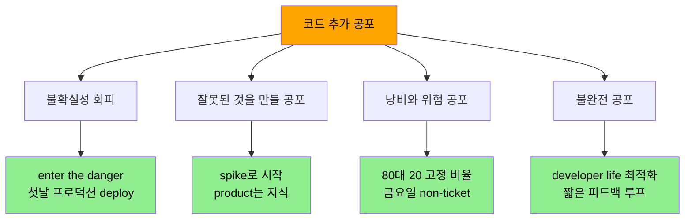
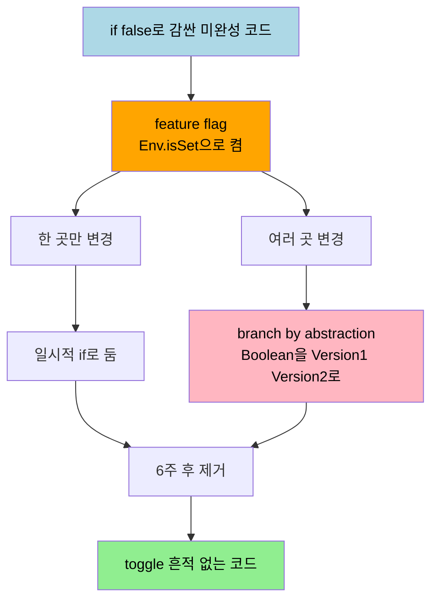

# 코드 추가를 두려워 말라 — 공포 극복과 추가에 의한 변경

---

> [03-03.코드 삭제를 사랑하라](03-03.코드%20삭제를%20사랑하라.md)가 "코드는 부채이니 덜어내라"는 이야기였다면, 이 글은 그 정반대 방향에서 균형을 잡습니다. 코드가 비용이라는 결론은 자칫 코드 쓰기를 두렵게 만들고, 완벽한 코드를 써야 한다는 압박은 그 공포를 키웁니다. *Five Lines of Code* 10장은 이 공포의 증상을 알아보고 — spike·고정 비율·developer life로 — 극복하는 법을 말하고, 그다음 "코드 수정보다 추가가 더 안전하다"는 사실을 중복·확장성·하위 호환·feature toggle·branch by abstraction으로 활용하는 법을 정리합니다. *Five Lines of Code* 2부의 넷째 장입니다.


## 학습 목표

이 글을 읽고 나면 다음 다섯 가지를 자신 있게 답할 수 있습니다.

- 코드 추가를 두려워하는 네 가지 증상과 각각의 극복법을 설명할 수 있다.
- "코드 추가가 수정보다 안전하다"는 명제와 modification by addition의 의미를 안다.
- 코드 공유와 중복이 각각 global·local change velocity와 fragility에 미치는 영향을 구분할 수 있다.
- accidental complexity와 essential complexity를 구분하고 변형 도입을 언제까지 미루는지 안다.
- feature toggle의 5단계 구현과 branch by abstraction으로의 확장·제거 절차를 설명할 수 있다.


## 1. 코드 추가가 두려운 네 가지 증상

> 코드가 결함 날 수 있는 방법이 너무 많아 완벽은 비현실적 목표입니다. 그 압박이 생산성을 떨어뜨리는 네 가지 모습이 있습니다.

코드를 쓰는 데에는 두 가지 공포가 겹칩니다. 하나는 앞 장에서 본 "코드는 비용"이라는 인식이고, 다른 하나는 완벽한 코드를 못 쓴다는 두려움입니다. 완벽이라는 말에는 성능·구조·추상화 수준·사용 용이성·유지보수 용이성·정확성·보안이 한꺼번에 걸려 있어, 이것을 모두 머리에 담고 비자명한 문제를 푸는 것은 불가능합니다. 저자는 CS를 정규로 배우기 전에는 "코드가 동작하는가"만 신경 써서 생산적이었는데, 대학에서 코드가 실패하는 온갖 방법을 배운 뒤 작업 한 줄을 쓰기 전에 며칠을 고민하는 **coding stage fright(코딩 무대 공포)** 에 빠졌다고 고백합니다. 이 공포는 네 가지 증상으로 나타나고, 극복법도 각기 다릅니다.

**증상 1 — 불확실성 회피.** 가장 불확실한 영역을 가장 두려워하는데, 거기가 가장 배워야 할 곳입니다. 즉흥 연극의 **enter the danger(위험 속으로 들어가라)** 는 불편한 상황을 회피하지 않고 직면해 거기서 최고를 끌어내라는 개념입니다. 용기는 Scrum의 다섯 가치 중 하나이고, Google의 대규모 연구는 팀 생산성의 가장 큰 예측 인자가 **psychological safety(심리적 안전)** 였다고 밝혔습니다. 저자는 새 현장의 첫 deploy가 늘 무서웠기에 "첫날에 무언가를 프로덕션에 deploy한다"는 전략을 씁니다. 공포는 심리적 고통이고, 앞 장의 "아프면 더 하라"처럼 무서우면 안 무서워질 때까지 더 합니다.

**증상 2 — 잘못된 것을 만들 공포(§10.2).** 실패 공포가 만들기 전에 논의·설계·고민만 하게 만듭니다. "잘못된 것을 만들" 공포가 "나쁘게 만들" 공포를 압도할 때입니다. 권장 워크플로는 **spike(탐색)** 로 시작해 이를 풉니다. spike 코드는 main에 가지 않으니 결함이 나도 무관해 공포가 사라지고, 첫 실제 버전을 더 낫게 만들 지식과 자신감을 줍니다. 다만 규율이 필요합니다 — 이해관계자가 **product는 코드가 아니라 지식**임을 이해해야 하고, spike 코드를 프로덕션에 넣지 않기를 엄격히 지켜야 합니다. 결과를 슬라이드 한 장(핵심 3점 + 목업)으로 codify하면 시간이 낭비되지 않았음을 보이기 쉽고, 주간 지식 공유로 [circus factor](03-03.코드%20삭제를%20사랑하라.md)도 낮춥니다.

**증상 3 — 낭비·위험 공포(§10.3).** 주변 도구·파이프라인이 실제 프로덕션 코드보다 훨씬 정교한 경우입니다. 도구는 위험·낭비를 줄이려고 쓰는 것인데, 코드가 없으면 줄일 위험도 낭비도 없으니 그것은 미루기일 뿐입니다. 저자는 "코드가 아직 없어요, 파이프라인 만드느라 바빴어요"라던 팀을 회상합니다. 해법은 *The DevOps Handbook*(Gene Kim 외, 2016)의 권고로, 개발자 시간의 **20%를 비기능 요구(지원 도구)에** 할당해 프로덕션 코드와 지원 도구의 복잡도를 **80:20**으로 묶는 것입니다. 작은 시간 슬롯은 컨텍스트 스위치로 낭비되고 다섯 번째 sprint를 통째로 비우는 방식은 재미없으니, 저자가 본 가장 성공적인 형태는 **금요일을 이해관계자 요청과 무관한 작업에 예약**하는 것이었습니다.

**증상 4 — 불완전 공포(§10.4).** **imposter syndrome(가면 증후군)** 은 자격 없다 느끼고 폭로될까 두려워하는 것으로, 코드를 완벽히 만들려다 미루거나 trivial한 작업만 잡게 합니다. 저자는 완벽한 코드에 대한 믿음을 버렸습니다. 효율·사용성·확장성·안정성은 모두 시간이 들고 생산 비용도 그만큼 중요하므로, 무엇에 집중하고 어디서 불완전을 수용할지 선택해야 합니다. 저자가 찾은 하나의 기준은 **optimizing for developer life(개발자 삶 최적화)** — 작업을 받고 동작하는 것까지의 시간을 가능한 한 짧게 하는 것입니다. 짧은 피드백 루프는 연습을 최대화하고 품질을 높입니다. 이것이 앞 장에서 본 spike and stabilize의 철학이기도 합니다.




## 2. 코드 추가는 수정보다 안전합니다

> 코드를 추가하는 것은 기존 동작을 건드리지 않으므로 수정보다 안전합니다. 이 사실을 활용하는 첫 번째 길은 중복이고, 그 트레이드오프를 정확히 알아야 합니다.

이 장의 나머지는 "코드 추가가 수정보다 안전하다"는 사실, 즉 **modification by addition(추가에 의한 변경)** 을 활용하는 법입니다. 가장 기본적인 추가가 중복입니다. 책에서 §4.3의 draw 코드는 모든 Tile 클래스에 복제한 뒤 유사성이 우연이라 판단해 그대로 두었고(divergence를 허용), §5.4의 update 코드는 복제했다가 연결되어 있다고 판단해 [unify](02-05.유사%20코드%20통합.md)했습니다. 중복은 코드의 분기를 격려하거나 억제하는 방법이지만, 두 가지 다른 속성이 더 중요합니다.

첫째는 **change velocity(변경 속도)** 입니다. 코드를 공유하면 모든 사용처에 한 번에 영향을 줄 수 있어 global 변경이 빠르지만, 한 호출처만 바꾸기는 어렵습니다. 반대로 중복하면 각 사이트가 decoupled되어 한 곳만 수정하기는 쉽지만 global 영향은 모든 위치를 갱신해야 합니다. **공유는 global change velocity를, 중복은 local change velocity를 높입니다.**

둘째는 **fragility(취약성)** 입니다. [02-02에서 정의한](02-02.리팩토링의%20기술적%20토대.md) fragility는 한 곳의 변경이 무관해 보이는 곳을 깨뜨리는 경향입니다. 공유 함수의 각 호출처는 서로 다른 local invariant를 가질 수 있는데, 공유 코드를 바꾸면 그 invariant들이 깨질 위험이 있습니다(공유 코드에 지역적이지 않으니까요). 그래서 **공유는 시스템의 fragility를 높입니다.** global velocity가 높다는 것은 코드가 빠르게 적응한다는 장점이지만, fragility 상승과 global 손상 위험이 그 대가이고, 둘 다 테스트·모니터링의 필요성을 키웁니다.

복제 코드는 완전히 decoupled되어 실험이 쉽고 변경이 안전합니다(남의 것을 깨지 않으니까요). 그래서 **spike 중에는 중복을 최대한 격려**합니다 — 가설을 빠르게 테스트하는 길입니다. 코드가 안정되면 잊기 전에 돌아와 [Ch5의 리팩토링 패턴](02-05.유사%20코드%20통합.md)으로 source와 unify할지 세 가지를 묻습니다. "source와 결합되어야 하는가, 이것이 변하면 source도 변해야 하는가, 우리 팀이 unify된 코드를 소유하는가." 하나라도 아니라면 별도로 둡니다.


## 3. 확장성과 두 가지 복잡도

> 변형을 별도 클래스로 밀어내면 새 변형 추가가 클래스 하나 추가만큼 간단해집니다. 다만 그 변형 지점은 복잡도를 늘리므로 필요할 때까지 미룹니다.

코드를 추가하는 또 다른 길은 확장성입니다. 코드가 변경에 수용적임을 알면 변형을 별도 클래스로 밀어내, 새 변형 추가가 클래스 하나 추가만큼 간단해지게 만듭니다. 다만 variation point는 흐름을 이해하기 어렵게 만들어 복잡도를 늘립니다. 도메인이 요구하지 않는 복잡도를 **accidental complexity(우발적 복잡도)**, 도메인에서 상속되어 본질적으로 필요한 복잡도를 **essential complexity(본질적 복잡도)** 라 합니다. accidental complexity를 제한하려면 variation point 도입을 필요할 때까지 미룹니다. 그래서 책 전반의 변형은 늘 세 단계였습니다 — 코드를 복제하고, 작업·적응하고, 말이 되면 source와 unify합니다.

이 흐름은 **Expand-Contract 패턴** 과 닮았습니다. expand에서 새 기능을 추가하고(추가만이라 안전, 단 두 복사본을 유지), migrate에서 caller를 천천히 옮기고(가장 긴 단계), contract에서 원본을 삭제합니다. 이 패턴을 데이터베이스 무중단 마이그레이션에 적용하는 5단계와 테이블 소유권 정리는 [03_architecture/04_ddd/03-03.데이터베이스 리팩토링](../../03_architecture/04_ddd/03-03.데이터베이스%20리팩토링.md)에 deep하게 있으니, 여기서는 같은 패턴이 *코드 확장*에도 쓰인다는 점만 짚습니다.

책의 코드 확장 두 방법은 모두 정적 구조를 동적 구조로 바꿉니다. [Replace type code with classes(P4.1.3)](02-04.타입%20코드를%20다형성으로.md)는 if·switch의 정적 제어 흐름을 인터페이스 메서드 호출로 바꿔, 구현 클래스를 추가하는 것만으로 동작을 확장하게 합니다. [Introduce strategy pattern(P5.4.2)](02-05.유사%20코드%20통합.md)은 코드의 두 복사본을 unify해, 새 strategy를 추가하는 것만으로 동적으로 새 복사본을 더하게 합니다.


## 4. 추가가 하위 호환성을 가능케 합니다

> public 인터페이스나 API로 기능을 노출하면, 업데이트가 caller를 깨지 않도록 보호할 책임이 생깁니다. 가장 안전한 길은 "아무것도 바꾸지 않는 것"입니다.

public 인터페이스나 API로 기능을 외부에 노출하면, 사람들이 의존하는 만큼 업데이트가 의도치 않은 부작용을 일으키지 않도록 보호할 책임이 생깁니다. 표준 해법은 **versioning** 입니다. 저자는 "코드에서 가장 안전한 것은 아무것도 바꾸지 않는 것"이라고 — 반은 농담으로 — 말합니다. caller에게 최대한의 안전을 주려면 코드는 평생 하위 호환을 유지해야 하고, 그래서 변경할 때는 기존 메서드를 그대로 둔 채 새 메서드·새 endpoint·새 이벤트를 도입합니다. Microsoft가 Windows 95의 코드를 Windows 10에서까지 돌리는 하위 호환성 commitment가 그 극단의 예입니다.

방법은 앞에서 본 과정과 같습니다. 바꾸려는 endpoint를 복제하고, 변경을 구현하고(아무에게도 영향이 없으니 안심), 원본과 unify합니다. 이때 생기는 accidental complexity를 줄이려면 옛 버전을 deprecate하고 튜토리얼을 새 버전으로 옮기며, [앞 장의 레거시 처리](03-03.코드%20삭제를%20사랑하라.md)처럼 원본에 모니터링을 붙여 사용이 0이 되면 제거합니다. 어느 버전을 쓸지는 가장 단순하게 entry point 이름에 직접 넣되, **가장 바깥 layer(사용자와 우리 사이)만** 버전을 매깁니다. 우리가 제어하는 메서드는 테스트로 검증할 수 있으니 버전이 필요 없습니다.

```text
// Listing 10.1 — 일관성 없는 버전 명명의 나쁜 예 (PHP의 SQL 입력 sanitize)
mysql_escape_string
mysql_real_escape_string
mysqli_real_escape_string
```

데이터 계약 차원의 스키마 호환성(Backward·Forward Compatibility)은 [03_architecture/05_edd/01-03.데이터 계약과 스키마 설계 원칙](../../03_architecture/05_edd/01-03.데이터%20계약과%20스키마%20설계%20원칙.md)에 별도로 있으니, 여기서는 코드 API의 entry point versioning에 한정합니다.


## 5. feature toggle — deploy와 release를 분리합니다

> 코드를 codebase에 두되 돌리지 않을 수 있습니다. deploy와 release를 분리하면, 준비되지 않은 코드도 안전하게 통합·배포할 수 있습니다.

동료의 코드와 머지하는 것을 integrating이라 합니다. 자주, 작은 배치로 통합할수록 에러와 머지 충돌의 공포가 줄어듭니다. 그런데 "코드가 준비되지 않았으면? 사용자가 새 기능에 준비되지 않았으면?"이라는 물음이 남습니다. 이 물음은 deploy를 release와 같다고 볼 때 생깁니다. 사실 코드를 codebase에 두되 돌리지 않을 수 있습니다 — 가장 쉬운 방법은 `if(false)`로 감싸는 것이고, 컴파일만 되면 main에 통합하고 deploy해도 안전합니다. 이것이 **feature toggle** 의 아이디어입니다. 복잡한 시스템도 있지만 배울 때는 가장 단순한 형태부터 시작합니다.

```typescript
// Listing 10.4~10.10 — feature toggle 5단계
class FeatureToggle {
  static featureA() {
    return Env.isSet("featureA"); // ① false → ⑤ 환경변수로. 변수 없으면 false
  }
}

class Context {
  foo() {
    if (FeatureToggle.featureA()) {
      code(); // ④ else에서 복제 → ⑤ 여기를 원하는 대로 변경
    } else {
      code(); // ③ 기존 코드를 else로 감쌈 (변경 없음)
    }
  }
}
```

순서는 이렇습니다. ① `FeatureToggle` 클래스를 만들고, ② 작업용 static 메서드 `featureA`를 false 반환으로 추가하고(이것이 feature flag), ③ 변경할 곳에서 기존 코드를 else로 감싼 빈 if를 두고, ④ else의 코드를 if로 복제한 뒤, ⑤ if 안을 원하는 대로 바꾸고 `featureA`가 환경변수를 반환하게 합니다. 로컬에서 변수를 설정해 테스트하되 남에게는 보이지 않으므로 안전하게 deploy하고, 고객이 준비되면 프로덕션 환경변수를 켭니다.

두 가지 주의가 있습니다. 첫째, 과정을 틀리면 의도치 않게 무언가 프로덕션에 들어갈 위험이 있어 — 저자는 프로덕션 통제를 잃는 것을 가장 두려워합니다 — 단순한 버전을 권합니다. 둘째, 같은 코드 두 복사본과 if가 생기는데, 이 if는 일시적이므로 **technical debt** 입니다. flag를 낳은 작업을 닫으면 [최대 6주 후](03-03.코드%20삭제를%20사랑하라.md) toggle을 제거할 작업을 예약합니다 — 프로덕션에 켜져 있으면 else를, 아니면 if를 지웁니다. flag가 곪게 두면 codebase를 오염시키고 치명적 실패를 부릅니다. 2012년 Knight Capital은 새 코드가 **7년간 쓰이지 않던 config flag를 재사용**했는데 그 flag에 묶인 옛 코드가 일부 서버에 남아 있어, 45분 만에 4억 달러 넘게 잃었습니다.

두 주의를 해결하고 나면 toggle을 DB로 옮겨 UI로 켜고 끄거나, 처음 10% 사용자에게만 보이는 slow rollout을, 나아가 "사용자가 샀는가" 같은 metric에 결합한 **A/B testing** 으로 확장합니다. 2008년 Obama 캠페인 사이트는 A/B testing으로 가족 사진과 "Learn More" 버튼 조합을 찾아 기부를 6천만 달러 늘린 것으로 추정됩니다.


## 6. branch by abstraction — 복잡한 toggle을 클래스로

> feature toggle은 Never use if with else를 깨지만, if가 일시적이거나 — 여러 곳에 걸치면 — Boolean을 클래스로 바꿔 if를 제거합니다.

여기서 "feature toggle이 [Never use if with else(R4.1.1)](02-04.타입%20코드를%20다형성으로.md)를 깨는 것 아닌가?"라는 의문이 듭니다. 맞습니다. 두 가지로 대응합니다. flag가 한 곳에서만 쓰이면 if가 일시적이고 삭제가 의도이며 확장하지 않을 것이므로 그대로 둡니다. 그러나 기능이 여러 곳을 바꿔야 하면 여러 if에 invariant가 흩어지므로, 전달 전에 feature flag 안의 Boolean에 [Replace type code with classes](02-04.타입%20코드를%20다형성으로.md)를 적용합니다. true/false 대신 `Version1`/`Version2`를 반환하는 것입니다. 클래스가 abstraction이고 둘이 있는 것이 branching이라, 이를 **branch by abstraction** 이라 합니다.

```typescript
// Listing 10.12 — branch by abstraction: if를 클래스로 밀어냅니다
class FeatureToggle {
  static featureA() {
    return Env.isSet("featureA") ? new Version2() : new Version1();
  }
}
class ContextA {
  foo() { FeatureToggle.featureA().aCode(); } // if 없이 메서드 호출
}
interface FeatureA {
  aCode(): void;
  bCode(): void;
}
class Version1 implements FeatureA {
  aCode() { aCodeV1(); }
  bCode() { bCodeV1(); }
}
class Version2 implements FeatureA {
  aCode() { aCodeV2(); }
  bCode() { bCodeV2(); }
}
```

이렇게 하면 기능 변경의 invariant가 그 클래스 안에 지역화됩니다. toggle을 제거할 때는 네 단계를 밟습니다. ① 한 클래스(`Version1`)를 지우고, ② [No interface with only one implementation(R5.4.3)](02-05.유사%20코드%20통합.md)에 따라 인터페이스도 지우고, ③ 남은 클래스와 flag의 메서드를 inline하고, ④ 그 클래스도 지웁니다. 남는 것은 toggle의 흔적이 없는 `class FeatureToggle {}`과 직접 호출뿐입니다.




## 7. 실무에 적용하기

이 장의 원칙은 "어떻게 안전하게 변경을 넣는가"라는 일상적 판단에 그대로 닿습니다. 핵심은 수정 대신 추가를 택해 기존 동작을 건드리지 않는 것입니다.

- **첫날 deploy로 공포 줄이기**: 새 환경에 합류하면 작은 변경 하나라도 첫날에 프로덕션까지 흘려보냅니다. 파이프라인을 한 번 끝까지 통과시키는 경험이 이후의 모든 변경에서 공포를 덜어 줍니다.
- **API 변경은 새 endpoint로**: 기존 메서드 시그니처를 바꾸는 대신 새 메서드를 더하고 옛것을 deprecate합니다. entry point 이름에 버전을 박되 가장 바깥 layer에만 둡니다. 스키마 차원이라면 [05_edd의 호환성 정책](../../03_architecture/05_edd/01-03.데이터%20계약과%20스키마%20설계%20원칙.md)을 함께 봅니다.
- **feature flag에 만료일 박기**: flag를 만드는 즉시 [6주 후 제거 작업](03-03.코드%20삭제를%20사랑하라.md)을 예약합니다. 한 곳이면 if로, 여러 곳이면 branch by abstraction으로 두어 제거가 기계적이게 합니다.
- **spike와 프로덕션을 분리**: 탐색용 코드는 main에 넣지 않습니다. 결과는 코드가 아니라 한 장의 지식으로 남기고, 가치가 입증된 것만 제대로 다시 씁니다.


## 8. 면접 관점에서

이 장은 "변경을 두려워하지 않으면서도 위험을 어떻게 통제하는가"라는 성숙도를 묻기 좋은 주제입니다.

- **Q. 코드 추가가 수정보다 안전하다는 말은 무슨 뜻입니까?** 기존 코드를 그대로 두고 새 메서드·클래스·endpoint를 더하면 기존 동작이 깨지지 않습니다. 그래서 하위 호환·feature toggle·Expand-Contract가 모두 "수정 대신 추가" 위에 섭니다. 가장 안전한 것은 아무것도 바꾸지 않는 것입니다.
- **Q. 코드를 공유하는 것과 중복하는 것은 어떻게 다릅니까?** 공유는 global change velocity를 높여 여러 곳을 한 번에 바꾸지만 fragility도 높입니다(한 호출처의 invariant를 깨기 쉬움). 중복은 각 사이트를 decoupled해 한 곳만 안전하게 바꾸지만 global 변경은 모든 위치를 손봐야 합니다. spike에서는 중복을 격려하고, 안정되면 결합이 필요한지 물어 unify를 결정합니다.
- **Q. accidental complexity와 essential complexity의 차이는?** essential은 도메인 본질에서 오는 불가피한 복잡도이고, accidental은 도메인이 요구하지 않았는데 더해진 복잡도입니다. 모든 곳을 extensible하게 만들면 accidental complexity가 늘므로, variation point 도입은 필요할 때까지 미룹니다. 리팩토링은 accidental complexity를 줄이는 것이 목표입니다.
- **Q. feature toggle의 if는 Never use if with else 규칙을 어기지 않습니까?** 어깁니다. 다만 그 if는 일시적이고 확장하지 않을 것이라 정당화되며, 한 곳이면 그대로 두고 여러 곳이면 Boolean을 Version1/Version2 클래스로 바꾸는 branch by abstraction으로 if를 제거합니다. 제거 시에는 한 클래스→인터페이스→inline 순으로 흔적 없이 걷어냅니다.


## 관련 문서

- [03-03.코드 삭제를 사랑하라](03-03.코드%20삭제를%20사랑하라.md) — "코드는 부채"라는 앞 장. 이 글은 그 정반대에서 "추가는 안전하다"로 균형을 잡고, 6주 규칙·circus factor·spike and stabilize를 공유합니다.
- [02-04.타입 코드를 다형성으로](02-04.타입%20코드를%20다형성으로.md) — Replace type code with classes로 정적 if를 동적 메서드 호출로. branch by abstraction이 이 패턴을 Boolean에 적용한 것입니다.
- [02-05.유사 코드 통합](02-05.유사%20코드%20통합.md) — Introduce strategy pattern과 No interface with only one implementation. 확장성과 toggle 제거가 이 패턴들 위에 섭니다.
- [03_architecture/04_ddd/03-03.데이터베이스 리팩토링](../../03_architecture/04_ddd/03-03.데이터베이스%20리팩토링.md) — Expand-Contract를 데이터베이스 무중단 마이그레이션에 적용하는 5단계. 이 글은 같은 패턴을 코드 확장에 씁니다.
