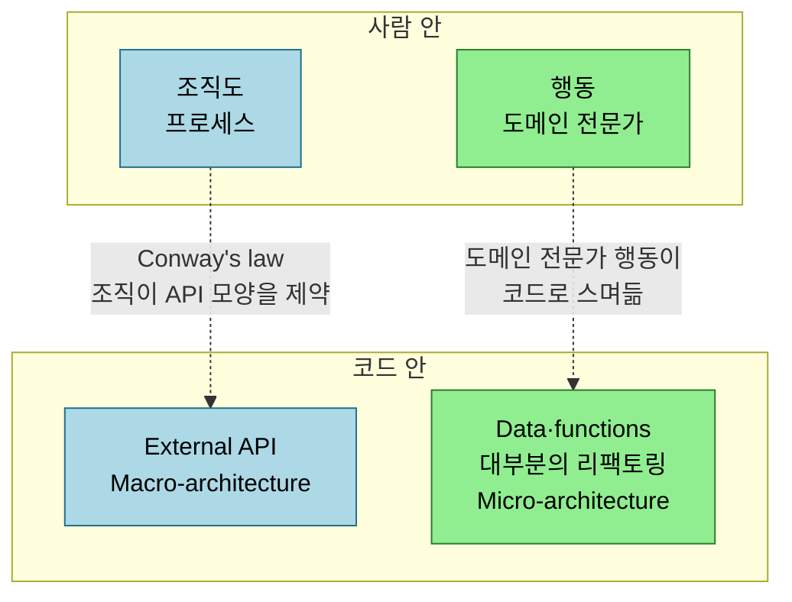
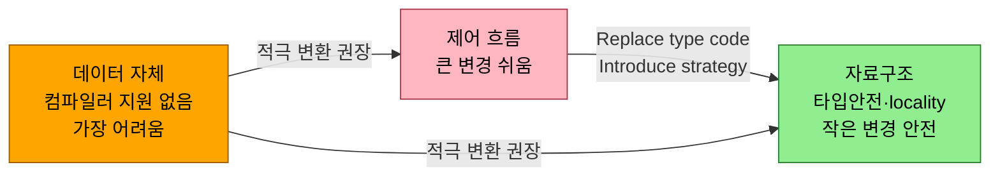

# 코드의 구조를 따르라 — 행동을 담는 세 자리와 미활용 구조

---

> 앞의 네 장이 개별 리팩토링 규칙과 그 토대를 다뤘다면, 이 글은 그것들을 하나로 묶는 2부의 종합편입니다. *Five Lines of Code* 11장의 출발점은 "소프트웨어는 현실의 모델이고, 코드는 현실에서 온 구조를 codify한 것"이라는 명제입니다. 그 구조가 어디서 오는지(도메인·조직·사람)를 먼저 가르고, 행동을 코드에 담는 세 자리(제어 흐름·자료구조·데이터)와 그 사이를 오가는 리팩토링을 정리합니다. 그다음 언제 리팩토링이 도움이 되고 언제 해가 되는지, 코드를 이해하지 못한 채 안전을 얻는 다섯 방법, 그리고 공백·중복·접사·런타임 타입에 숨은 미활용 구조를 활용하는 법을 다룹니다. *Five Lines of Code* 2부의 다섯째 장입니다.


## 학습 목표

이 글을 읽고 나면 다음 다섯 가지를 자신 있게 답할 수 있습니다.

- 구조 공간의 네 범주를 scope와 origin으로 나누고 Conway's law가 무엇인지 설명할 수 있다.
- 행동을 담는 세 자리(제어 흐름·자료구조·데이터)의 트레이드오프를 구분할 수 있다.
- 언제 리팩토링을 고형화하고 언제 억제하는지, change vector를 예측 대신 관찰하는 이유를 안다.
- 코드를 이해하지 못한 채 안전을 얻는 다섯 방법과 각각의 남은 위험을 설명할 수 있다.
- 공백·중복·공통 접사·런타임 타입 검사에 숨은 미활용 구조를 어떤 패턴으로 활용하는지 안다.


## 1. 구조는 scope와 origin으로 나뉩니다

> 소프트웨어는 현실의 모델이라 현실의 연결이 코드로 스며듭니다. 그 구조는 코드 안에도 사람 안에도 있고, 한 팀에도 여러 팀에도 걸칩니다.

소프트웨어는 현실 세계의 한 측면을 모델링한 것입니다. 현실은 우리가 배우고 자라며 변하므로 소프트웨어도 적응해야 하고, 그래서 쓰이는 한 결코 완성되지 않습니다. 현실의 연결이 코드에 표현된다는 것은 곧 **코드가 현실에서 온 구조를 codify한 것**이라는 뜻입니다. 저자는 이 구조를 두 축으로 나눕니다. 하나는 구조가 한 팀·사람에 머무는가(intra-team) 여러 팀·사람에 걸치는가(inter-team)이고, 다른 하나는 구조가 코드 안에 있는가 사람 안에 있는가입니다.

| | Inter-team | Intra-team |
|---|---|---|
| **코드 안** | External API | Data·functions, 대부분의 리팩토링 |
| **사람 안** | 조직도, 프로세스 | 행동, 도메인 전문가 |

코드 안의 inter-team 구조는 **Macro-architecture** 로, 우리 제품이 무엇이고 다른 코드가 어떻게 상호작용하는지를 정해 external API와 각 팀이 소유하는 데이터를 결정합니다. 코드 안의 intra-team 구조는 **Micro-architecture** 로, 팀이 가치를 전달하기 위해 데이터와 코드를 어떻게 조직하는지이며 **이 책의 리팩토링 패턴이 모두 여기에 속합니다.** 사람 쪽에는 조직이 정의한 프로세스(Scrum·Kanban)와 계층(조직도), 그리고 도메인 전문가가 정의한 구조가 있습니다.

놀라운 점은 **구조가 수평 차원으로 미러링된다**는 것입니다. 조직 구조가 external API의 모양을 제약하는 것이 **Conway's law** 이고, 도메인 전문가의 행동 구조가 코드로 스며듭니다. 이것이 유용한 까닭은, 코드에서 비효율을 발견하면 그 현실의 출처 — 전문가의 작업 방식이나 프로세스 — 를 찾아 거기서 고칠 수 있기 때문입니다. 사용자 행동도 코드 구조를 제약하므로 **사용자를 코드의 일부로** 볼 수 있습니다. 재훈련할 수 있으면 리팩토링의 범위 안이고, 그렇지 못하면 외부 제약입니다. 사람의 행동을 바꾸는 것이 코드를 바꾸는 것보다 쉽게 들리지만 대규모 조직에서는 오히려 더 느리므로, 먼저 사용자 행동을 비효율까지 포함해 있는 그대로 모델링한 뒤 점진적으로 효율적 기능과 훈련을 함께 제공하는 편이 낫습니다.



> 가로축은 Inter-team(여러 팀에 걸침) 대 Intra-team(한 팀 안), 세로축은 코드 안 대 사람 안입니다. 같은 행으로 미러링되는 점선이 Conway's law입니다.


## 2. 행동을 담는 세 자리

> 행동이 어디서 오든 코드에 담는 자리는 셋입니다 — 제어 흐름, 자료구조, 데이터 자체. 리팩토링은 그 사이를 오가거나 한 자리 안의 중복을 관리하는 일입니다.

행동은 세 자리에 담깁니다 — **제어 흐름(control flow)·자료구조(structure of the data)·데이터 자체(data)**. 리팩토링은 행동을 바꾸지 않으므로, 한 자리 안의 중복을 관리하거나 한 자리에서 다른 자리로 구조를 옮기는 일입니다. 저자는 같은 행동(FizzBuzz와 무한 루프)을 세 자리로 각각 인코딩해 차이를 보입니다.

**제어 흐름** 은 제어 연산자·메서드 호출·코드 줄로 표현됩니다. 셋 중 메서드 호출과 줄은 non-local 구조를 표현할 수 있지만 루프는 local에만 작용하고, 반대로 제어 연산자와 메서드 호출은 줄이 못 하는 무한 루프(`for(;;)`, 자기 호출 함수)를 만들 수 있습니다. 제어 흐름은 statement를 옮기는 것만으로 흐름을 바꿀 수 있어 큰 변경이 쉽습니다. 보통 안정을 위해 제어 흐름에서 *벗어나도록* 리팩토링하지만, 큰 조정이 필요하면 일부러 제어 흐름으로 옮겼다가 변경 후 되돌립니다. [Extract method](02-03.긴%20함수%20쪼개기.md)와 Combine ifs가 이 자리에서 작동합니다.

**자료구조** 는 "자료구조는 시간 속에 얼린 알고리즘"이라는 말이 잘 보여줍니다. 저자가 드는 예는 binary search 함수와 binary search tree(BST)의 연결입니다 — 정렬 리스트에서 탐색 공간을 반씩 줄이는 binary search의 행동이, "왼쪽 자식은 모두 작고 오른쪽 자식은 모두 크다"는 BST의 invariant로 굳어 있습니다. 제어 흐름과 달리 자료구조는 기존 variation point와 맞지 않는 큰 변경은 어렵지만, 타입 안전성과 locality 덕에 작은 변경이 더 안전하고 캐싱으로 성능을 얻기도 합니다. [Replace type code with classes](02-04.타입%20코드를%20다형성으로.md)와 [Introduce strategy pattern](02-05.유사%20코드%20통합.md)이 제어 흐름을 자료구조로 옮깁니다.

**데이터 자체** 에 담는 것이 가장 어렵습니다. [halting problem의 맹점](03-01.컴파일러와%20협업.md)에 빠져 컴파일러의 지원을 전혀 받지 못하기 때문입니다. 업계에서는 흔히 중복 데이터의 형태로 나타나는데, 일관성 문제와 에러의 원천이 됩니다. 그래서 저자는 데이터에 담긴 구조를 적극적으로 다른 두 자리로 변환하기를 권합니다.

```typescript
// Listing 11.9·11.11 — 세 자리로 표현한 무한 루프 (행동은 같고 자리만 다릅니다)
function loopByControlFlow() {
  function loop() { loop(); } // 제어 흐름: 함수가 직접 자기를 호출
}

class Rec {
  constructor(public readonly f: (_: Rec) => void) { } // 자료구조: Rec가 자기 타입을 품음
}
function loopByDataStructure() {
  let helper = (r: Rec) => r.f(r);
  helper(new Rec(helper)); // helper가 Rec를 통해 간접 자기 호출
}

function loopByData() {
  let a = [() => { }];
  a[0] = () => a[0](); // 데이터: heap의 참조를 통해 간접 자기 호출 (컴파일러 지원 없음)
  a[0]();
}
```



> 행동을 담는 세 자리입니다. 리팩토링은 한 자리 안의 중복을 관리하거나 자리 사이로 구조를 옮기는 일이고, 다루기 어려운 데이터는 다른 두 자리로 변환하기를 권합니다.


## 3. 코드를 더해 구조를 노출하고, 예측 대신 관찰합니다

> 리팩토링은 현재 구조를 고형화해 비슷한 변경에 수용적으로 만듭니다. 다만 어느 방향으로 굳힐지는 추측이 아니라 관찰한 변경 이력으로 정합니다.

리팩토링은 어떤 변경을 쉽게, 다른 변경을 어렵게 만들어 **change vector(소프트웨어가 향하는 방향)** 를 지원합니다. 코드가 많을수록 이 방향을 더 잘 알게 됩니다 — 데이터가 많으니까요. 그래서 리팩토링은 현재 구조를 고형화(solidify)해 비슷한 변경에 수용적으로 만들고, 본 적 있거나 예상하는 곳에 variation point를 둡니다. 안정된 시스템에서는 이것이 개발 속도와 품질을 높이지만, 불확실성이 큰 시스템에서는 solidity보다 실험이 더 필요합니다.

기저 구조가 불확실하면 리팩토링을 억제(throttle)하고 correctness를 먼저 챙깁니다. 이때도 fragility를 높이거나 non-local invariant를 만들면 안 되고, 미룬 코드는 캡슐화해 나머지에 영향을 주지 않게 합니다. 다만 **variation point는 더하지 않습니다** — 변경 용이성의 대가로 복잡도를 더하고, 그 복잡도가 실험을 어렵게 하며 다른 구조를 숨길 수 있기 때문입니다. 그래서 새 기능이나 서브시스템처럼 불확실한 곳에서는 클래스보다 enum과 loop가 합리적입니다(빠르게 바꿀 수 있고, 새 코드는 집중적으로 테스트되니 실수를 놓칠 위험이 낮습니다). 코드가 성숙해 구조가 안정되면 리팩토링으로 거기에 맞게 빚어냅니다. **코드의 solidity는 그 방향에 대한 우리의 확신을 표현해야 합니다.**

여기서 change vector를 *예측*하려 들면 오히려 코드베이스를 해칩니다. 추측 대신 경험적 기법(Toyota Kata·Evidence-Based Management·Popcorn Flow)으로 안내해야 합니다. 똑똑해 보이는 일반화의 유혹 — extensible하게, general하게 만들 기회 — 은 그 generality가 쓰일지 확신하지 못하면 불필요한 코드와 accidental complexity만 더합니다. 저자는 체스 구현을 두고 "말을 인터페이스와 클래스로 만들겠다"는 개발자에게 "하드코딩이 더 쉽지 않냐, 체스는 500년간 안 변했다"고 답합니다. 그래서 코드의 변경 경향을 관찰합니다 — 안 변하면 아무것도 하지 않고, 예측 불가하게 변하면 fragility를 피할 만큼만 리팩토링하고, 그 외에는 과거에 일어난 변경 종류에 맞춰 리팩토링합니다.


## 4. 코드를 이해하지 못한 채 안전을 얻는 다섯 방법

> 리팩토링은 도메인을 몰라도 코드 안의 구조만 따르면 됩니다. 다만 사람은 실수하므로, 그 위험을 줄이는 다섯 방법을 겹쳐 씁니다.

리팩토링은 행동을 세 자리 사이에서 옮기는 일이고 구조는 코드 안에 있으므로, 도메인을 이해하지 못해도 이미 있는 구조를 따르고 sound한 패턴을 실수 없이 쓰면 됩니다. 까다로운 것은 "실수 없이"입니다 — 사람은 실수하니까요. 어느 것도 완전하지 않아 보통 조금씩 겹쳐 쓰고, 끝내 남는 위험은 받아들입니다.

| 방법 | 어떻게 | 남는 위험 |
|------|--------|----------|
| **테스트** | correctness/functional 테스트를 자동화 | 실수 지점을 커버 못 하거나 기대한 것을 테스트 안 함 |
| **숙달** | 리팩토링을 작은 단계로 분해해 연습으로 기계화(wax on, wax off) | 위험이 줄 뿐, 여전히 인간 |
| **도구 보조** | IDE의 자동 리팩토링으로 인간 요소 제거 | 도구의 버그(널리 쓰이면 빠르게 패치) |
| **형식 검증** | proof assistant로 버그 없음을 기계 검사(비행기·Mars rover) | proof assistant의 버그가 증명 실수와 맞물림 |
| **fault tolerance** | 실패 시 자동 rollback(feature toggle) | 올바른 응답과 에러를 구분 못 함(실패 시 −1 반환을 정수로 오인) |

테스트는 가장 흔하고 correctness 확인을 넘어 사용자의 세계를 이해하는 길이지만 사람이 하면 관리 불가해져 자동화합니다. 숙달은 단계를 충분히 작게 쪼개 실패 위험을 줄이되 위험은 여전히 인간에게 남고, 도구 보조는 그 인간 요소마저 제거합니다. 형식 검증은 실패가 극히 비싼 소프트웨어에 쓰는 품질의 정점이지만 결국 또 하나의 도구라 같은 종류의 위험을 남기고, fault tolerance는 [feature toggle의 자동 rollback](03-04.코드%20추가를%20두려워%20말라.md)처럼 실수해도 self-correct하게 만듭니다.


## 5. 미활용 구조 — 공백·중복·접사·런타임 타입

> 미활용 구조는 대개 위험 회피의 흔적입니다. 노력이 적고 위험이 낮은 표시 — 빈 줄·중복·공통 접사·타입 검사 — 에 가장 흔히 드러납니다.

모든 것에 구조가 있고 그 상당수가 코드로 스며듭니다. 다만 우연하거나 일시적인 구조를 활용하면 velocity가 떨어지므로, 토대가 견고한지 — 이 구조가 지속할지 — 를 늘 따집니다. **도메인은 보통 소프트웨어보다 오래되고 성숙해 급변이 적으니 안전하게 활용할 수 있지만**, 프로세스와 팀은 수명이 짧고 불안정해 시스템에 구워 넣으면 다시 풀어내야 합니다. 활용할 만한 구조는 노력이 적고 위험이 낮은 네 가지 표시에 가장 흔히 드러납니다.

**공백.** 개발자는 코끼리를 작게 자르듯 statement를 그룹으로 묶고 사이에 빈 줄을 둡니다. statement 그룹의 빈 줄은 [Extract method](02-03.긴%20함수%20쪼개기.md)로, field 그룹의 빈 줄은 [Encapsulate data](02-06.데이터%20방어.md)로 고형화합니다 — 예컨대 `Particle`의 `x`·`y`가 `color`보다 가깝게 묶여 있으면 `x`·`y`를 `Vector2D`로 묶습니다.

**중복.** statement는 메서드로, 메서드는 클래스로 — 1부의 구조 그대로입니다. 중복 statement는 Extract method로 시작하고, 클래스에 흩어졌으면 Encapsulate data로 중앙화합니다. 통합 결과가 동일하면 하나만 남기고, 유사하면 [Unify similar classes](02-05.유사%20코드%20통합.md)로 상수만 다른 한 클래스로 묶습니다. 흐름만 유사하고 statement가 다르면 [Introduce strategy pattern](02-05.유사%20코드%20통합.md)으로 같게 만듭니다 — 이 패턴이 강력한 까닭은 숨은 구조마저 노출하기 때문입니다.

**공통 접사.** 너무 명백하고 신뢰할 만해 [Never have common affixes(R6.2.1)](02-06.데이터%20방어.md)라는 규칙이 있을 정도입니다. 빈 줄+주석처럼 그룹화와 제안 이름을 동시에 주므로 해법은 역시 Encapsulate data입니다. field·method뿐 아니라 유사하게 이름 붙은 클래스에도 적용되는데, 메커니즘은 언어마다 다릅니다(Java는 클래스·패키지, C#·TypeScript는 namespace). 예를 들어 `StringProtocol`·`JSONProtocol`이 공통 suffix `Protocol`을 가지면 `namespace protocol`로 감싸 `protocol.String`처럼 접사를 떼어냅니다(`String`은 built-in과 충돌하므로 namespace 없이는 못 뗍니다).

**런타임 타입 검사.** `typeof`·`instanceof`·reflection·typecasting은 미활용 구조의 흔한 신호입니다. 객체지향은 런타임 타입 검사 없이 고안됐고, 대신 **dynamic dispatch through interfaces** 라는 더 강한 메커니즘을 내장합니다 — 이것이 [Never use if with else(R4.1.1)](02-04.타입%20코드를%20다형성으로.md)의 특수 케이스입니다. A·B를 우리가 제어한다면 새 인터페이스를 만들어 둘 다 구현하게 하고 [Push code into classes](02-04.타입%20코드를%20다형성으로.md)로 `if`를 없앱니다. 소스를 제어하지 못하면 타입 검사를 코드의 *가장자리(edge)* 로 밀어 코어를 pristine하게 유지합니다.


## 6. 실무에 적용하기

이 장은 개별 규칙을 넘어 "어떤 구조를 어디에 담고, 언제 그것을 굳힐 것인가"라는 판단을 줍니다.

- **불확실한 새 코드는 enum·loop로 시작**: 새 서브시스템처럼 방향이 불확실할 때는 클래스로 일찍 굳히지 않습니다. 빠르게 바꿀 수 있는 제어 흐름으로 두고, 변경 이력이 쌓여 방향이 보이면 그때 [다형성](02-04.타입%20코드를%20다형성으로.md)으로 빚습니다.
- **빈 줄과 공통 접사를 신호로 읽기**: 동료가 남긴 빈 줄과 공통 prefix는 그 사람의 정신 모델입니다. 코드 리뷰나 정리 때 이 표시를 Extract method·Encapsulate data로 고형화하면 의도가 구조로 드러납니다.
- **instanceof를 보면 다형성을 의심**: `if (x instanceof A)` 분기가 보이면 인터페이스로 옮길 수 있는지 먼저 봅니다. 외부 타입이라 제어할 수 없으면 그 검사를 경계로 밀어 코어에 스며들지 않게 합니다.
- **예측하지 말고 관찰**: "나중에 확장할 것 같다"는 추측으로 variation point를 미리 넣지 않습니다. 체스 말처럼 안 변하는 것은 하드코딩이 정답이고, 변경은 일어난 뒤에 그 종류에 맞춰 리팩토링합니다.


## 7. 면접 관점에서

이 장은 리팩토링을 "기법의 모음"이 아니라 "구조를 읽고 다루는 일관된 사고"로 설명할 수 있는지를 묻기 좋습니다.

- **Q. 행동을 코드에 담는 세 자리는 무엇이고 어떻게 다릅니까?** 제어 흐름·자료구조·데이터입니다. 제어 흐름은 큰 변경이 쉽고, 자료구조는 타입 안전·locality·성능과 작은 변경의 안전을 주며, 데이터는 컴파일러 지원이 없어 가장 다루기 어렵습니다. 리팩토링은 이 셋 사이에서 행동을 옮기거나 한 자리 안의 중복을 관리하는 일입니다.
- **Q. Conway's law가 코드에 주는 함의는?** 조직 구조가 시스템의 인터페이스 구조로 미러링된다는 법칙입니다. 그래서 코드의 비효율이 사실은 조직·프로세스·도메인 전문가의 작업 방식에서 비롯될 수 있고, 진짜 해법이 코드 바깥에 있을 수 있습니다.
- **Q. 언제 리팩토링을 미뤄야 합니까?** 기저 구조가 불확실할 때입니다. 이때는 correctness를 먼저 챙기고 variation point를 더하지 않습니다 — variation point는 복잡도를 더해 실험을 어렵게 하고 다른 구조를 숨길 수 있기 때문입니다. 코드의 solidity는 그 방향에 대한 확신만큼만 가져야 합니다.
- **Q. 코드를 이해하지 못해도 안전하게 리팩토링할 수 있습니까?** 구조가 코드 안에 있으므로 이미 있는 구조를 따르고 sound한 패턴을 실수 없이 쓰면 됩니다. 실수 위험은 테스트·숙달·도구 보조·형식 검증·fault tolerance를 겹쳐 줄이되, 어느 것도 완전하지 않아 남는 위험은 받아들입니다.


## 관련 문서

- [03-04.코드 추가를 두려워 말라](03-04.코드%20추가를%20두려워%20말라.md) — 코드 추가가 수정보다 안전하다는 앞 장. accidental·essential complexity와 variation point의 비용을 공유합니다.
- [03-01.컴파일러와 협업](03-01.컴파일러와%20협업.md) — halting problem과 "algorithms frozen in time". 데이터에 담긴 구조가 왜 컴파일러 지원을 못 받는지의 토대입니다.
- [02-04.타입 코드를 다형성으로](02-04.타입%20코드를%20다형성으로.md) — Never use if with else·Replace type code with classes·Push code into classes. 런타임 타입 검사를 dynamic dispatch로 바꾸는 토대입니다.
- [02-06.데이터 방어](02-06.데이터%20방어.md) — Encapsulate data·Never have common affixes. 공백과 공통 접사를 고형화하는 패턴입니다.
