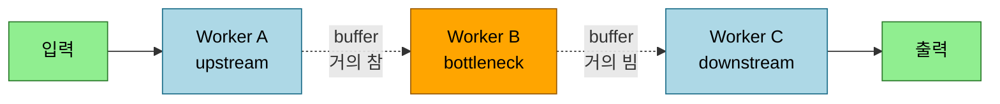
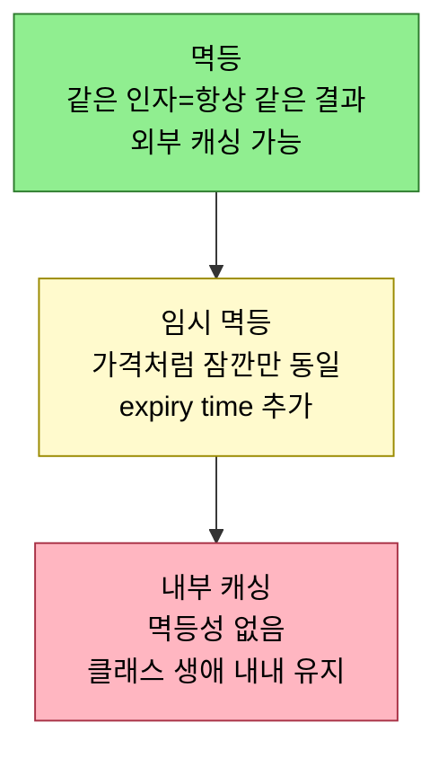

# 최적화와 일반성을 피하라 — 단순함을 위협하는 두 게임

---

> *Five Lines of Code* 12장은 프로그래머가 즐기지만 도움보다 해가 잦은 두 게임 — 성능 최적화와 일반성 — 을 다룹니다. 칼을 달라는 사람에게 맥가이버 칼을 건네는 일은 생존 상황에서는 구원이지만 전문 주방의 셰프에게는 과도이듯, 일반성은 context가 전부입니다. 이 글은 먼저 두 활동이 왜 인지 부하를 늘리는지(단순함의 적인 coupling과 invariant)를 짚고, 일반성을 언제·어떻게 더하고 무엇보다 어떻게 막는지, 그리고 최적화를 성능 테스트로 동기 부여한 뒤 리팩토링·제약 이론·프로파일링·자료구조·캐싱·격리의 순서로 어떻게 안전하게 수행하는지 정리합니다. *Five Lines of Code* 2부의 여섯째 장입니다.


## 학습 목표

이 글을 읽고 나면 다음 다섯 가지를 자신 있게 답할 수 있습니다.

- 일반성과 최적화가 각각 coupling과 invariant를 통해 어떻게 인지 부하를 늘리는지 설명할 수 있다.
- 최소로 짓고 비슷한 안정성끼리 통합해 불필요한 일반성을 막는 방법을 안다.
- 성능 테스트 3종(benchmark·load·performance approval)으로 최적화를 동기 부여하는 이유를 안다.
- 제약 이론으로 병목을 찾고 resource pooling으로 도메인 코드를 건드리지 않고 최적화하는 원리를 설명할 수 있다.
- 캐싱 3종(멱등·임시 멱등·내부)의 안전도 차이와 performance tuning을 격리하는 까닭을 구분할 수 있다.


## 1. 단순함이 위협받는 두 자리

> 인지 용량을 빠르게 채우는 둘은 coupled components와 invariant입니다. 일반화는 전자를, 최적화는 후자를 늘려 단순함을 갉아먹습니다.

이 장과 책 전체를 관통하는 주제는 **단순함을 향한 노력**입니다. Gene Kim의 비즈니스 우화 *The Unicorn Project*(IT Revolution Press, 2019)가 소프트웨어 개발의 ideal 중 하나로 꼽을 만큼 본질적인데, 인간의 인지 용량이 제한적이기 때문입니다 — 한 번에 머리에 담을 수 있는 정보가 한정돼 있습니다. 코드를 다룰 때 이 용량을 빠르게 채우는 둘이 있습니다. **coupled components** 는 둘을 동시에 머리에 둬야 하고, **invariant** 는 기능을 이해하려면 계속 추적해야 합니다. 이 둘은 각각 흔한 프로그래밍 활동에 연결됩니다 — 무언가를 더 일반적으로 만들면 가능한 사용처가 늘어 더 많은 것이 coupled되고, 일반화된 코드를 다룰 땐 호출될 수 있는 방법을 더 많이 고려해야 합니다.

[4장](02-04.타입%20코드를%20다형성으로.md)에서 일반성의 문제를 직접 겪었습니다. 다음 함수를 볼 때, 가능한 모든 `Tile` 값으로 불리는지 일부로만 불리는지 알 수 없습니다. 이걸 모르면 함수를 단순화할 수 없습니다.

```typescript
// Listing 12.1 — 불필요하게 일반적인 함수
function remove(tile: Tile) {
  for (let y = 0; y < map.length; y++) {
    for (let x = 0; x < map[y].length; x++) {
      if (map[y][x] === tile) {
        map[y][x] = new Air();
      }
    }
  }
}
```

다른 한쪽 활동은 invariant를 악용하는 최적화입니다. [7장의 counting set](03-01.컴파일러와%20협업.md)이 그 예입니다. 이 집합은 각 원소의 개수를 추적하고, 균등하게 무작위 원소를 뽑으려 전체 개수보다 작은 무작위 정수를 만듭니다. 매번 전체 개수를 다시 세는 것이 낭비처럼 느껴져, `total` 필드를 도입해 그 낭비를 없앨 수 있습니다.

```typescript
// Listing 12.2·12.3 — total 필드로 재계산을 없앤 counting set
class CountingSet {
  private data: StringMap<number> = { };
  private total = 0;                      // ← 최적화: 재계산 회피
  randomElement(): string {
    let index = randomInt(this.size());
    for (let key in this.data.keys()) {
      index -= this.data[key];
      if (index <= 0) return key;
    }
    throw new Impossible();
  }
  add(element: string) {
    let c = this.data.get(element);
    if (c === undefined) c = 0;
    this.data.put(element, c + 1);
    this.total++;                         // ← invariant: 더할 때마다 갱신
  }
  size() { return this.total; }           // ← 다시 세지 않음
}
```

이 필드와 함께 "원소를 더하거나 뺄 때 항상 `total`을 갱신한다"는 invariant가 생깁니다. 어기면 `randomElement`가 깨집니다. 반면 최적화하지 않은 버전에서는 새 메서드를 더해도 기존 메서드를 깨뜨릴 수 없습니다. 단순함을 추구한다고 절대 최적화·일반화를 못 한다는 뜻은 아닙니다 — 수학자도 정리를 증명하려 더 일반적인 lemma가 필요하듯이요. 다만 그 일반성·최적화가 왜 필요한지 **hard evidence** 가 있어야 하고, 단순함을 희생할 땐 부작용을 최소화하는 예방책을 둬야 합니다.


## 2. 일반성은 최소로 짓고, 비슷한 안정성끼리만 통합합니다

> 일반성의 가장 쉬운 동기는 duplicate→transform→unify의 unify가 공짜로 줍니다. 다만 최소로 짓고, 새것을 옛것과 성급히 합치지 않아야 그 최소가 유지됩니다.

일반성을 더하기 전에 동기를 이해해야 합니다. 다행히 이 책이 권하는 **duplicate → transform → unify** 절차의 마지막 unify 단계가 현재 기능에 필요한 정확한 수준의 일반성을 자동으로 줍니다. 하지만 몇 가지 함정이 이마저 실패하게 만듭니다.

**최소로 짓기.** 세 단계 절차는 *기능이 minimal일 때만* minimal한 일반성을 보장합니다. 필요 이상으로 많은 기능, 더 일반적인 기능을 지으면 어떤 방법도 우리를 구하지 못합니다. 유일한 대응은 최소로 짓겠다는 꾸준한 다짐뿐입니다. Kent Beck의 표현이 가장 좋습니다 — **"Maximize the amount of work not done(하지 않은 일의 양을 최대화하라)."** 최소로 지으려면 먼저 context, 즉 구현하려는 행동의 scope를 이해해야 합니다. 이해에 구멍이 있으면 뇌는 모든 걸 커버해야 한다고 가정하고, 더 많은 걸 푸는 함수가 사용자에게 선물이라 착각합니다. 그러나 요구사항은 소프트웨어가 진화하며 변하므로, 불필요한 일반성을 구현·유지한 노력은 쉽게 무효가 됩니다. 가진 문제만 풀고, 상상할 수 있는 문제는 풀지 않습니다. 저자는 탁구 레이팅 시스템에 "가장 흥미로운 경기가 될 팀을 생성하는" 기능을 확신하며 넣었지만, 사용자에겐 이미 매치업을 정하는 방법이 있어 호기심에 몇 번 쓰이고 말았다고 고백합니다.

**비슷한 안정성끼리 통합.** 위 실수에서 추가 기능을 떼어내는 건 [코드 삭제](03-03.코드%20삭제를%20사랑하라.md)로 대부분 되돌릴 수 있었지만, 그 기능을 수용하려 일반화한 support 함수·backend 코드는 제거가 훨씬 어려웠습니다. 그래서 통합할 땐 조심해야 합니다 — **새것을 옛것과 즉시 통합하지 않는 것** 이 경험칙입니다. 비슷한 안정성에 도달할 때까지 기다립니다. 존재한 기간이 같을 필요는 없습니다 — 보통 두 번째 인스턴스가 훨씬 빨리, 세 번째가 더 빨리 안정됩니다.

**불필요한 일반성 제거.** 최후의 방어는 정기적으로 감시하다 발견하면 제거하는 것입니다. [Specialize method](02-04.타입%20코드를%20다형성으로.md)와 Try delete then compile 두 패턴이 있지만, 후자는 제거 가능한 일반성을 다 찾지는 못합니다. 더 결실 있는 방법은 **런타임 인자를 모니터링** 하는 것입니다. 객체가 어지간히 serializable하면 파라미터를 로깅하기 쉽고, 최근 n번의 호출을 살펴 어떤 파라미터가 항상 같은 값이면 그 파라미터로 Specialize method를 적용합니다. 몇 가지 다른 값으로 불려도, 각각에 특화된 복사본을 만들 가치가 있을 수 있습니다.


## 3. 최적화는 성능 테스트로 동기 부여하고, 순서대로 수행합니다

> 일반성과 달리 최적화엔 자동 동기 부여 절차가 없으니, 성능 테스트가 실패할 때만 손댑니다. 그다음 리팩토링 → 제약 이론 → 프로파일링 → 자료구조 → 캐싱 순으로 안전한 것부터 씁니다.

일반성과 달리 최적화에는 필요성을 자동으로 정당화하는 단순한 절차가 없습니다. 대신 **자동 성능 테스트를 세팅하고, 테스트가 실패할 때만 최적화를 찾는** 도구가 있습니다. 흔한 세 종류는, 임베디드·실시간 시스템에서 마감 시각을 지키는지 보는 **benchmark test**("이 메서드는 14ms 안에 끝나야 한다" — 쓰긴 쉽지만 GC·바이러스 스캐너 같은 환경에 tightly coupled되어 production-like 환경에서만 신뢰), 웹·클라우드의 throughput을 검증하는 **load test**("초당 1000 요청 처리" — 외부 요인에 더 resilient), 그리고 외부 요인과 완전히 decoupled된 **performance approval test**("지난 실행보다 10% 넘게 느리면 안 된다" — main loop에 느린 것이 들어가거나 자료구조가 바뀌어 cache miss가 는 것을 잡음)입니다. 법조계를 빌리면 **"코드는 그렇지 않다고 증명되기 전까지 효율적"** 입니다. 테스트가 최적화 필요를 증명한 뒤에는, 미래 유지보수의 인지 부담을 최소로 유지하는 법을 알아야 합니다.

**먼저 리팩토링합니다.** 리팩토링의 목표 중 하나가 invariant를 지역화해 더 명료하게 만드는 것이고, 최적화는 invariant에 의존하므로 잘 빚어진 코드가 최적화하기 쉽습니다. [3장의 Either call or pass(R3.1.1)](02-03.긴%20함수%20쪼개기.md)에서 `length`를 별도 함수로 추출한 리팩토링이 그 예입니다.

```typescript
// Listing 12.4 Before → 12.5 After (length를 size 함수로)
function average(arr: number[]) { return sum(arr) / arr.length; }
function average(arr: number[]) { return sum(arr) / size(arr); }
```

당시엔 과해 보였지만, 미래에 메서드를 클래스로 캡슐화하면 이 메서드들이 새 자료구조의 깔끔하고 minimal한 public interface가 됩니다. 캐싱 추가는 클래스에 필드 하나를 더하는 일이 되고(12.6→12.7: `NumberSequence`가 생성자에서 `total`을 미리 계산), 자료구조를 바꾸려면 Extract interface from implementation(P5.4.4) 후 새 클래스를 만들면 됩니다. 또 코드를 좋게 두는 다른 이유는, 컴파일러가 흔한 idiom을 연구해 계속 더 나은 코드를 생성하기 때문입니다. 똑똑하려다 컴파일러가 의도를 못 알아보면 오히려 느려집니다 — [컴파일러와 협업하라](03-01.컴파일러와%20협업.md)는 7장의 메아리입니다. [1장](02-01.리팩토링%20절차와%20규칙.md)에서 좋은 컴파일러는 side effect가 없음을 판단한 뒤 반복된 부분식 `pow(base, exp / 2)`를 자동 제거하므로 두 프로그램이 같은 성능을 냅니다.

```typescript
// Listing 12.10·12.11 — 멋져 보이는 코드는 읽기만 어렵습니다
function isEven(n: number) { return n % 2 === 0; }   // idiomatic
function isEven(n: number) { return (n & 1) === 0; } // showing off
```

`n % 2 === 0`이나 `n / 2`는 너무 흔해 모든 mainstream 컴파일러가 자동으로 `n & 1`·`n >> 1` 수준으로 최적화합니다. "보여주기" 코드의 유일한 효과는 가독성 저하뿐입니다.

**제약 이론으로 병목을 찾습니다.** 리팩토링 후에도 테스트가 미충족이고 concurrent 시스템이라면 **theory of constraints** 가 적용됩니다. Goldratt의 소설 *The Goal*(1984)이 보이듯, local 비효율을 줄이는 노력은 global 효율에 거의 영향이 없습니다. 시스템을 교통에 비유하면, 작업은 차량, workstation은 통과율이 제각각인 신호 교차로, 그 사이 도로는 차량이 줄 서는 buffer입니다. 오른쪽 buffer가 거의 비고 왼쪽이 거의 차면 그 교차로가 **bottleneck** 입니다.



> 어느 시점에나 병목 worker는 정확히 하나입니다. upstream을 최적화하면 병목 입구에 buffer만 쌓이고, downstream을 최적화하면 입력을 못 받아 무효입니다. **오직 병목 worker의 최적화만 시스템 성능에 영향** 을 줍니다. 다만 병목을 최적화하면 새 병목이 생깁니다.

이 상황의 해법이 **resource pooling** 입니다. 가용한 처리 자원을 공동 pool에 모아 필요한 자가 쓰게 해, 최대 용량을 병목에 줍니다. 외부로는 service 수준의 load balancer, 내부로는 thread pooling입니다. naive한 구현(stage마다 무한 루프를 도는 worker 하나)에서 resource pooling(무한 루프를 stage 밖으로 빼 stage를 task로 만들고, Worker thread가 task를 dequeue해 실행)으로 바꾸면, 코드 구조는 거의 같은데 throughput이 크게 오릅니다 — 100요청 처리가 약 201초에서 150초로 줄어듭니다. 무엇보다 thread choreography를 신경 쓸 필요 없이 시스템이 자동 처리하고, stage의 도메인 코드 인지비용은 늘지 않습니다(대가는 pooling 코드 자체의 유지비용).

**프로파일링으로 hot spot을 찾습니다.** pooling 후에도 미충족이면 병목 *내부* 를 최적화합니다. 단일 thread 상황이라 한 thread를 더 빨리 끝내야 하는데, 전부 최적화할 수는 없으니 가장 영향이 큰 곳에 집중합니다. **hot spot** — thread가 시간을 가장 많이 쓰는 메서드 — 은 메서드가 시간이 걸리거나 루프 안에 있을 때 생기고, 신뢰할 유일한 발견법은 **profiling**(누적 시간 추적)입니다. 80%의 시간을 쓰는 20%의 코드로 drill down합니다. 이 80:20 관계가 최적화를 daily work로 두지 말아야 하는 근거입니다 — 최적화는 team productivity라는 더 값진 자원을 대가로 치릅니다(예외는 hot spot이 일상인 performance specialist·임베디드·실시간 개발자). profiler를 늘 써야 하는 또 다른 이유는, big O 같은 점근 분석이 단순화라는 점입니다 — 점근적으로 우월한 알고리즘이 cache miss 탓에 실전에선 더 느릴 수 있고, 측정만이 이를 드러냅니다. 대부분의 라이브러리 sort가 작은 데이터엔 점근적으로 우월한 quick sort(O(n·lg n)) 대신 insertion sort(O(n²))를 쓰는 것이 증거입니다.

**자료구조를 교체합니다.** hot spot을 찾으면, 가장 안전한 최적화는 **동등한 인터페이스를 가진 자료구조로 교체** 하는 것입니다. 도메인 코드가 안 바뀌어 안전하고, 도입되는 invariant는 usage에 있어 깨져도 성능 저하에 그칩니다(성능 테스트가 즉시 잡음). 때로는 **지역적으로** 자료구조를 바꿔 이득을 봅니다 — hot spot 안에서 순서대로 원소를 뽑으면 반복 최소 추출로 O(n)이지만, 데이터를 hot spot 밖에서 min heap에 넣으면 O(lg n), 진입 전에 정렬해두면 O(1)입니다. 코드 위치마다 behavioral invariant가 다르므로 용도에 맞춰 지역적으로 자료구조를 바꾸는 것은 자명해 보여도 과소사용되는 기법입니다. 예를 들어 linked list의 `sort`는 직접 조작보다 array로 변환→정렬→복원이 cache 동작상 더 효율적입니다(`list.root` 접근이 되는 건 `private`가 object-private가 아니라 class-private이기 때문입니다).

**캐싱합니다.** 흔히 안전한 또 다른 최적화입니다 — 여러 번 계산하는 대신 한 번 하고 저장해 재사용합니다([5장](02-05.유사%20코드%20통합.md)의 `Cacher`가 side effect와 return value를 분리). 모든 캐싱의 공통 invariant는 "같은 인자로 함수를 여러 번 호출한다"입니다. 안전도는 멱등성에 따라 갈립니다.



> 위에서 아래로 갈수록 fragile합니다. 멱등 함수는 hashCode로 외부 캐싱이 가능해 가장 안전하고, 임시 멱등(상품 가격처럼)은 캐시 중 값이 변할 수 있어 expiry time을 두지만 duration이 바뀔 가능성 탓에 더 약하며, 멱등성이 없으면 [12.7의 total 필드](03-01.컴파일러와%20협업.md)처럼 내부 캐싱이라 클래스의 전 생애 동안 유지해야 해 가장 위험합니다.

**performance tuning은 격리합니다.** 알고리즘·동시성·캐싱으로도 부족한 드문 경우엔 micro-optimization으로 갑니다. magic bit pattern(보통 16진수 magic number)이 그 예로, Quake III Arena의 역제곱근 함수 `Q_rsqrt`의 `i = 0x5f3759df - (i >> 1); // what the f***?` 주석이 상징적입니다. tuned 코드는 이해 없이 큰 변경이 불가해 사실상 *잠긴* 코드이므로, 잠기는 영역을 최소화하도록 메서드·클래스로 격리합니다. 평소엔 naming을 나중에 개선해도 되지만 tuned 코드는 추출 시점보다 더 잘 이해할 일이 드무니, well named·documented·quality controlled에 노력을 들입니다. 한 단계 더 나아가 전용 **package**(저자는 `magic`이라 부름 — "Sufficiently advanced technology is indistinguishable from magic")로 묶으면, import 시 첫 줄과 code completion에 드러나 미래 개발자에게 "여기는 파고들지 말라"는 경고가 됩니다. 이 영역은 아무도 이해 못 하는 trash heap이 아니라, 소수가 탁월히 이해하는 altar여야 합니다.


## 4. 실무에 적용하기

이 장은 "성능과 유연함이 좋다"는 직관을 뒤집어, 둘 다 증명 없이는 비용이라는 판단을 줍니다.

- **일반성은 unify가 줄 때만 받기**: 미래를 상상해 파라미터를 일반화하지 않습니다. [duplicate→transform→unify](02-05.유사%20코드%20통합.md)의 unify가 현재 기능에 필요한 만큼만 일반성을 주고, 그 이상은 요구사항이 변하면 부채가 됩니다.
- **새 코드와 옛 코드를 성급히 합치지 않기**: 방금 짠 코드는 아직 불안정합니다. 인접한 옛 코드와 모양이 비슷하다고 바로 통합하면, 한쪽이 변할 때 일반화한 공통부를 다시 풀어야 합니다. 두 번째 인스턴스가 안정될 때까지 중복을 견딥니다.
- **성능 테스트 없이는 최적화 금지**: "느릴 것 같다"는 직감으로 `n >> 1` 같은 코드를 쓰지 않습니다. 컴파일러가 idiom을 더 잘 최적화하고, 진짜 병목은 [프로파일링](03-05.코드의%20구조를%20따르라.md)으로만 드러납니다.
- **병목이 아니면 건드리지 않기**: 제약 이론상 병목 밖의 최적화는 효과가 없습니다. resource pooling으로 자원을 병목에 몰아주고, 그래도 부족하면 병목 내부의 hot spot만 자료구조 교체·캐싱으로 손댑니다.


## 5. 면접 관점에서

이 장은 성능·유연성 욕구를 절제할 줄 아는지, 최적화를 측정 기반으로 접근하는지를 묻기 좋습니다.

- **Q. 일반성과 최적화는 왜 단순함을 해칩니까?** 단순함은 코드가 요구하는 인지 부하의 문제입니다. 일반성은 사용처를 늘려 coupling 위험을 키우고, 최적화는 유지해야 할 invariant를 도입합니다. coupled component와 invariant 둘 다 인지 용량을 빠르게 채웁니다. 그래서 둘 다 hard evidence 없이는 하지 않습니다.
- **Q. 불필요한 일반성을 어떻게 막고 어떻게 제거합니까?** 막는 법은 최소로 짓기("하지 않은 일을 최대화")와 비슷한 안정성끼리만 통합하기입니다. 제거는 런타임 인자를 모니터링해 항상 같은 값으로 불리는 파라미터를 찾아 Specialize method를 적용합니다.
- **Q. 최적화를 무엇으로 정당화하고, 어떤 순서로 합니까?** specification, 실무적으로는 성능 테스트(benchmark·load·performance approval)로 정당화합니다. 순서는 ① 리팩토링으로 invariant 지역화 ② 제약 이론으로 병목 찾아 resource pooling ③ 프로파일링으로 hot spot 식별 ④ 자료구조 교체·캐싱 ⑤ 최후에 격리된 tuning입니다 — 안전한 것부터입니다.
- **Q. 제약 이론이 최적화에 주는 함의는?** 순차 연결된 worker 시스템에는 어느 순간에나 병목이 하나뿐이고, 병목 밖의 최적화는 buffer만 쌓거나 효과가 없습니다. 그래서 local 효율을 올려도 global 효율은 안 오릅니다. resource pooling으로 자원을 공동 pool에 모아 병목에 최대 용량을 줍니다.


## 관련 문서

- [03-05.코드의 구조를 따르라](03-05.코드의%20구조를%20따르라.md) — 예측 대신 관찰·variation point를 더하지 않기. "불확실하면 일반성을 더하지 말라"는 이 장의 generality 절제와 같은 뿌리입니다.
- [02-05.유사 코드 통합](02-05.유사%20코드%20통합.md) — duplicate→transform→unify·Introduce strategy·Cacher·Extract interface. 일반성을 unify가 주는 만큼만 받고 캐싱으로 분리하는 토대입니다.
- [02-04.타입 코드를 다형성으로](02-04.타입%20코드를%20다형성으로.md) — Specialize method와 불필요하게 일반적인 함수(Listing 12.1의 출처 4장). 일반성 제거 패턴의 토대입니다.
- [03-01.컴파일러와 협업](03-01.컴파일러와%20협업.md) — 컴파일러와 싸우지 않기·counting set의 total 필드. 좋은 idiom이 자동으로 최적화되는 까닭과 내부 캐싱의 위험을 공유합니다.
- [02-03.긴 함수 쪼개기](02-03.긴%20함수%20쪼개기.md) — Either call or pass(R3.1.1)·Extract method. 최적화 전 리팩토링이 invariant를 지역화하는 토대입니다.
