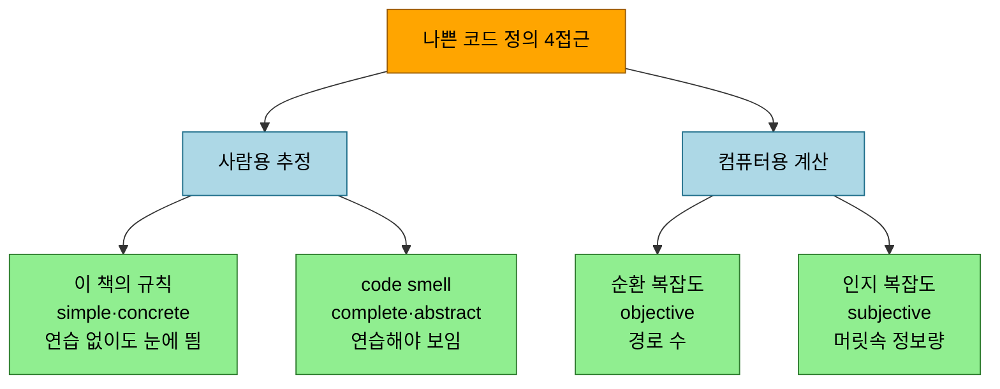
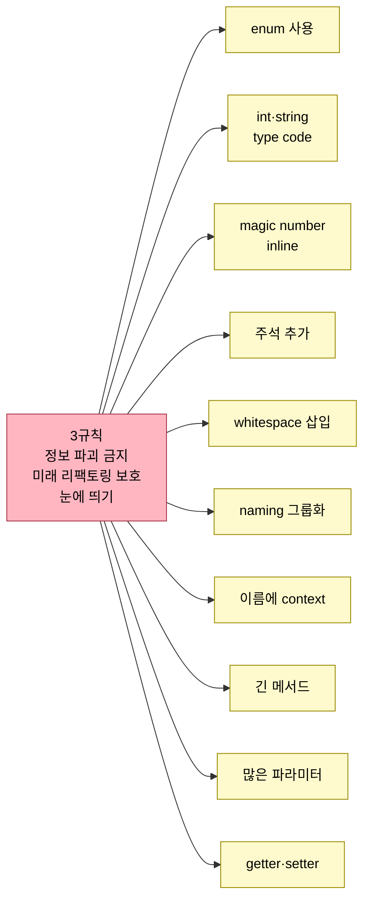

# 나쁜 코드는 나빠 보이게 — anti-refactoring과 안전한 신호 남기기

---

> *Five Lines of Code* 13장은 앞 장들과 정반대 방향을 다룹니다. 좋은 코드를 만드는 대신, 고칠 시간이나 실력이 없는 나쁜 코드를 *한눈에 나빠 보이게* 만드는 일 — 저자가 anti-refactoring이라 부르는 기법입니다. 어설프게 다듬어 "끔찍하지만은 않게" 덮어버리면 문제가 양탄자 밑으로 숨지만, 의도적으로 나쁘게 두면 다시 찾기 쉽고 제약이 지속 불가함을 신호합니다. 이 글은 그 동기(프로세스 신호·psychological safety·broken window theory)를 짚고, 나쁜 코드를 정의하는 네 접근(이 책 규칙·code smell·순환 복잡도·인지 복잡도)을 살핀 뒤, 코드를 *안전하게* 망가뜨리는 세 규칙과 그 위에 선 열 가지 실천 기법을 정리합니다. *Five Lines of Code* 2부의 마지막 장입니다.


## 학습 목표

이 글을 읽고 나면 다음 다섯 가지를 자신 있게 답할 수 있습니다.

- 나쁜 코드를 의도적으로 남기는 것이 왜 프로세스 신호가 되는지, psychological safety가 왜 전제인지 설명할 수 있다.
- pristine·legacy 분리와 broken window theory가 리팩토링 순서에 주는 함의를 안다.
- 나쁜 코드를 정의하는 네 접근(이 책 규칙·code smell·순환 복잡도·인지 복잡도)의 성격 차이를 구분할 수 있다.
- 코드를 안전하게 망가뜨리는 세 규칙(정보 파괴 금지·미래 리팩토링 보호·가시성)을 설명할 수 있다.
- 열 가지 실천 기법이 세 규칙을 각각 어떻게 만족하는지 한두 예로 들 수 있다.


## 1. 나쁜 코드는 프로세스 이슈의 신호입니다

> 고칠 수 없는 나쁜 코드는 어설프게 덮지 말고 그대로 둡니다. 그래야 다시 찾기 쉽고 제약이 지속 불가함을 알립니다 — 단, messenger를 쏘지 않는 psychological safety가 전제입니다.

때로 더 좋아야 한다는 걸 알면서도 복잡도나 시간 부족으로 마땅한 수준까지 리팩토링하지 못합니다. 그럴 때 "끔찍하지만은 않게" 약간 다듬곤 하는데 — 저품질을 배달하기 싫은 자존심 때문이지만 — 이건 실수입니다. 그 상황에선 문제를 양탄자 밑으로 쓸어 넣느니 **끔찍한 mess를 그대로 배달하는 편이 낫습니다.** 나쁜 코드를 남기면 두 가지 이점이 있습니다. **다시 찾기 쉽고**, 제약(시간·우선순위)이 **지속 불가함을 신호** 합니다.

다만 이 신호에는 상당한 **psychological safety** 가 필요합니다 — messenger인 우리가 쏘이지 않으리라 믿어야 합니다. 그런 안전이 없다면, 그건 코드 품질보다 더 큰 문제일 가능성이 높습니다. Google과 re:Work의 Project Aristotle은 psychological safety가 가장 큰 생산성 요인임을 보였습니다. 저자는 tech lead 시절 **"Knowing is always better"** 를 mantra로 삼아 messenger를 늘 환영했습니다 — 지속 불가한 페이스로 품질이 미끄러지는지 알고 싶었고, 중간 품질 코드는 모르고 지나칠 수 있어도 *대놓고 나쁜* 코드는 그러지 않으니까요.

```typescript
// Listing 13.1 Good enough — 메서드는 작지만 poorly extracted (banner.state 반복이 숨음)
function animate() { handleChosen(); handleDisplaying(); handleCompleted(); handleMoving(); }
function handleChosen()    { if (value >= threshold && banner.state === "chosen") { /* ... */ } }
function handleDisplaying(){ if (value >= target && banner.state === "displaying") { /* ... */ } }

// Listing 13.2 Intentionally bad — inline + FIXME 주석으로 "State 클래스로 push해야 함"을 드러냄
function animate() {
  // FIXME: All concern banner.state
  if (value >= threshold && banner.state === State.Chosen)    { /* ... */ }
  if (value >= target && banner.state === State.Displaying)   { /* ... */ }
  if (banner.state === State.Completed)                       { /* ... */ }
}
enum State { Chosen, Displaying, Completed, Moving }
```

어느 쪽이 리팩토링을 더 필요로 할까요 — 답은 **둘 다** 입니다. 13.1은 메서드가 작아 그럴듯하지만 어설프게 추출돼 `banner.state`가 반복된다는 사실을 숨깁니다. 13.2는 그 반복을 한눈에 보이게 만들어, 이 메서드를 `State` 클래스로 밀어야 함을 신호합니다.


## 2. pristine 코드와 legacy 코드로 분리합니다

> 나쁠수록 발견하기 쉽습니다. quite good·good enough·bad 중 good enough보다 차라리 bad가 낫습니다 — pristine과 legacy를 갈라야 broken window theory를 거꾸로 이용할 수 있습니다.

코드가 나쁠수록 발견하기 쉽습니다. 이게 중요한 까닭은, 개발자가 문제 해결에 집중을 다 쏟고 있어 한눈에 안 보이는 건 놓치기 때문입니다. 대놓고 나쁘면 계속 상기되어, 시간이 날 때 누군가 고칠 가능성이 훨씬 큽니다. **"If you cannot make it good, make it stand out(좋게 못 만들겠으면 눈에 띄게 만들라)."** 모든 코드가 완벽해야 한다는 게 아니라, 코드를 quite good·good enough·bad로 나눈다면 **good enough보다 차라리 bad가 낫다** 는 것입니다. quite good의 바를 넘길 시간이나 실력이 없으면 차라리 나쁘게 만들어, 코드를 **pristine code와 legacy code로 분리** 합니다.

한눈에 pristine인지 legacy인지 구분되면 파일의 good/bad 비율을 추정할 수 있고, 이게 리팩토링을 안내합니다. 저자는 **거의 완전히 pristine에 가까운 파일부터** 시작합니다. 두 이유가 있습니다. 첫째, 리팩토링은 cascading 활동이라 어떤 코드를 좋게 하려면 주변도 좋게 해야 하는데, 주변이 이미 좋으면 rabbit hole에 빠질 위험이 낮습니다. 둘째는 **broken window theory** 입니다 — 깨진 창 하나를 두면 곧 더 따라온다는 것입니다. 논쟁적이고 반증됐을 수도 있지만 metaphor로는 의미가 있습니다. 새 신발일 땐 조심하다가 더러워지면 신경을 끄고 급속히 망가지듯, 나쁜 코드를 보면 그 옆에 나쁜 코드를 두기가 쉬워집니다. 반대로 파일 전체를 pristine하게 만들면 보통 더 오래 pristine하게 유지됩니다.


## 3. 나쁜 코드를 정의하는 네 접근

> 보고 좋고 나쁨을 판정하는 완벽한 법은 없습니다(가독성이 주관적이니까요). 대신 네 접근이 "얼마나 나쁜지"를 추정하는데, 사람용 둘과 컴퓨터용 둘로 갈립니다.

코드를 보고 좋은지 판정하는 완벽한 방법은 없습니다 — 가독성이 좋은 코드의 일부인데 가독성은 주관적이기 때문입니다. 대신 얼마나 나쁜지를 추정하는 네 접근이 있고, eye-catching한 trait을 찾는 데 쓰입니다.



> 사람용 둘은 추정이고 컴퓨터용 둘은 계산값입니다. 한눈에 추정할 때 사람은 결국 들여쓰기에 의존합니다 — if·for마다 한 번씩 들여쓰니까요.

**이 책의 규칙(simple·concrete).** 1부의 주제였습니다. 집중이 딴 데 있어도, 연습이 적어도 눈에 띄도록 설계된 규칙들입니다. 강력하지만 universal하지는 않습니다 — 책을 안 읽은 사람은 [같은 객체에 pass와 call을 섞는 것](02-03.긴%20함수%20쪼개기.md)을 나쁘다고 안 볼 수 있습니다. 팀이 공유 규칙을 가지면 그 반대로 하기가 쉽습니다(예: `minimum` 함수가 [Five lines(R3.1.1)](02-03.긴%20함수%20쪼개기.md)와 if only at the start(R3.5.1) 두 규칙을 깸).

**code smell(complete·abstract).** 저자의 규칙은 Martin Fowler의 *Refactoring*과 Robert C. Martin의 *Clean Code*가 모은 code smell에서 distill한 것입니다. 대부분은 꽤 연습해야 eye-catching해지지만, "Magic constants"·"Duplicated code"처럼 입문 강의에서 가르칠 만큼 단순한 것도 있습니다.

**순환 복잡도(cyclomatic, objective).** 코드를 통과하는 경로 수를 셉니다 — `if`는 두 경로(참/거짓), `for`·`while`도 진입/skip 두 경로, 각 `||`·`&&`는 경로를 둘로 가릅니다. 테스트 개수의 하한도 줍니다(경로당 최소 하나). control flow로 계산하지만 사람에겐 명백하지 않아, 한눈에 추정할 땐 들여쓰기에 의존합니다(위 `minimum`은 4).

**인지 복잡도(cognitive, subjective).** 훨씬 최근 지표로, 읽는 동안 머리에 담아야 할 정보량을 추정합니다. nesting을 순환 복잡도보다 더 심하게 벌점하는데(통과하는 각 조건을 기억해야 하므로), 사람의 읽기 난이도에 더 가깝습니다(위 `minimum`은 6 — `for`+1, 중첩 `for`+2, `if`+3).


## 4. 안전하게 망가뜨리는 세 규칙과 열 가지 기법

> 코드를 망가뜨리되 구조를 영구 손상하지 않고 표현만 바꾸려면 세 규칙을 지킵니다 — 정보 파괴 금지·미래 리팩토링 보호·눈에 띄기. 이 셋을 지키면 최악이어도 쉽게 되돌릴 수 있습니다.

코드를 vandalize(나쁜 코드를 눈에 띄게)할 때 세 규칙을 따릅니다. ① **옳은 정보를 절대 파괴하지 않는다** — 가장 중요합니다. 이름이 좋고 body만 지저분하면 이름을 나쁘게 만들지 않습니다(낡거나 trivial한 주석 같은 incorrect·superfluous 정보는 제거 허용). ② **미래 리팩토링을 더 어렵게 만들지 않는다** — 다음 사람은 나일 수도 있으니, 가진 정보를 표시하고 리팩토링 방향까지 제안합니다(추출할 곳에 빈 줄). 가급적 더 쉽게 만듭니다. ③ **결과는 눈에 띄어야 한다** — 신호로 인식되고 pristine과 뚜렷한 gap이 생기도록. 이 셋을 지키면 무엇이든 최악이어도 쉽게 undo됩니다.



> 열 기법은 모두 안전하고 쉽게 가역적입니다 — 바쁠 때 쓰느라 가끔 오판하므로 안전·가역이 필수입니다. 팀이 code smell로 보는 것에 맞춰 자기 기법을 더 만들되, 세 규칙은 깨지 않습니다.

기법들은 크게 두 갈래로 묶입니다. **타입을 거칠게 만드는 갈래** 는 [enum](02-04.타입%20코드를%20다형성으로.md)으로 Boolean을 대체하거나(type signature에 정보를 *추가* 하므로 안전하고, [Replace type code with classes→Push code into classes→Try delete then compile](02-04.타입%20코드를%20다형성으로.md)의 표준 흐름으로 이어짐), 빠른 실험엔 int·string을 type code로 쓰고(string 내용이 constant 이름 역할), magic number를 직접 inline합니다(이름에 정보가 있으면 주석을 달아 규칙①을 지킴 — `FOUR_THIRDS`를 `4/3`으로, `Math.PI`를 `3.141592653589793`으로). **구조를 거칠게 드러내는 갈래** 는 [메서드명이 될 주석](03-02.주석%20멀리하기.md)을 달고(`// Find min`·`// Sub from each element`), [Extract method](02-03.긴%20함수%20쪼개기.md)·[Encapsulate data](02-06.데이터%20방어.md)할 곳에 빈 줄을 넣고, [common affix](02-06.데이터%20방어.md)를 가진 field를 인접 배치하거나(`windowPosition`·`windowSize`를 붙임) 이름에 context를 더해 affix를 만들고(`avg_ArrUtil`처럼 casing을 깨 강조), 어설프게 추출된 메서드를 inline해 [긴 메서드](02-03.긴%20함수%20쪼개기.md)로 만들며, 많은 파라미터를 노출하거나([HashMap·data object로 smell을 숨기지 않고](03-01.컴파일러와%20협업.md) 모든 call site가 리팩토링을 외치게), [getter·setter](02-06.데이터%20방어.md)로 데이터를 캡슐화해 road sign을 답니다.


## 5. 실무에 적용하기

이 장은 "좋은 코드만이 답"이라는 직관을 뒤집어, *고칠 수 없는 나쁜 코드를 정직하게 드러내는* 판단을 줍니다.

- **덮지 말고 드러내기**: 시간이 없어 제대로 못 고칠 땐 "끔찍하지만은 않게" 다듬어 덮지 않습니다. FIXME 주석과 inline으로 [반복되는 구조](03-05.코드의%20구조를%20따르라.md)를 한눈에 보이게 두는 편이, 나중에 누군가 고칠 가능성을 높입니다.
- **pristine 파일부터 리팩토링**: 거의 깨끗한 파일을 먼저 손봅니다 — 주변이 이미 좋아 rabbit hole 위험이 낮고, broken window가 번지지 않습니다.
- **신호는 가역적으로**: enum·주석·빈 줄처럼 되돌리기 쉬운 기법만 씁니다. 바쁠 때 오판해도 세 규칙을 지켰다면 최악이어도 쉽게 undo됩니다.
- **코드 리뷰에서 합의로**: magic number나 많은 파라미터를 봤을 때 "상수만 추출"이 아니라 "메서드 전체를 고친다"는 팀 합의가 있어야 신호가 작동합니다. 합의 없이는 그저 나쁜 코드입니다.


## 6. 면접 관점에서

이 장은 품질을 흑백이 아니라 *신호와 가시성* 의 문제로 다룰 줄 아는지, 팀 프로세스 관점을 갖췄는지를 묻기 좋습니다.

- **Q. 고칠 수 없는 나쁜 코드를 왜 일부러 나빠 보이게 둡니까?** 어설프게 덮으면 문제가 숨어 다시 찾기 어렵고, 제약이 지속 불가하다는 신호도 사라집니다. 대놓고 나쁘면 다시 찾기 쉽고 계속 상기되어 시간이 날 때 고쳐집니다. 단 messenger를 쏘지 않는 psychological safety가 전제입니다(Project Aristotle).
- **Q. 나쁜 코드를 정의하는 접근에는 뭐가 있습니까?** 완벽한 법은 없지만 네 가지 — 이 책의 규칙(simple·concrete), code smell(complete·abstract), 순환 복잡도(경로 수, objective), 인지 복잡도(머릿속 정보량, subjective)입니다. 사람용 둘은 추정, 컴퓨터용 둘은 계산값이며 한눈엔 모두 들여쓰기로 드러납니다.
- **Q. 코드를 안전하게 망가뜨리는 규칙은?** ① 옳은 정보를 파괴하지 않는다 ② 미래 리팩토링을 더 어렵게 하지 않는다(가급적 쉽게) ③ 결과는 눈에 띄어야 한다. 이 셋을 지키면 어떤 변경도 최악이어도 쉽게 되돌릴 수 있습니다.
- **Q. broken window theory가 리팩토링에 주는 함의는?** 나쁜 코드 옆엔 나쁜 코드를 두기 쉬우니, 파일을 통째로 pristine하게 만들면 더 오래 깨끗이 유지됩니다. 그래서 리팩토링은 거의 깨끗한 파일부터 시작해 cascading rabbit hole을 피합니다.


## 관련 문서

- [03-06.최적화와 일반성을 피하라](03-06.최적화와%20일반성을%20피하라.md) — 최적화 코드를 isolated package(magic)로 묶어 품질 기대를 한눈에 알리는 앞 장. "품질 수준을 한눈에 드러낸다"는 이 장 anti-refactoring과 같은 동기입니다.
- [02-04.타입 코드를 다형성으로](02-04.타입%20코드를%20다형성으로.md) — Replace type code with classes·Push code into classes·Try delete then compile. enum·type code를 신호로 쓰고 그 뒤 제거하는 표준 흐름의 토대입니다.
- [02-06.데이터 방어](02-06.데이터%20방어.md) — Encapsulate data·Never have common affixes·getter/setter. common affix 그룹화·getter 신호가 가리키는 리팩토링의 토대입니다.
- [03-02.주석 멀리하기](03-02.주석%20멀리하기.md) — 메서드명이 될 주석. 주석을 정보 보존과 신호로 동시에 쓰는 기법의 토대(주석을 드물게 둘수록 눈이 빨리 인식)입니다.
- [02-03.긴 함수 쪼개기](02-03.긴%20함수%20쪼개기.md) — Five lines(R3.1.1)·Extract method·긴 메서드. 어설프게 추출된 메서드를 inline해 신호로 만드는 기법과 정반대 방향의 토대입니다.
