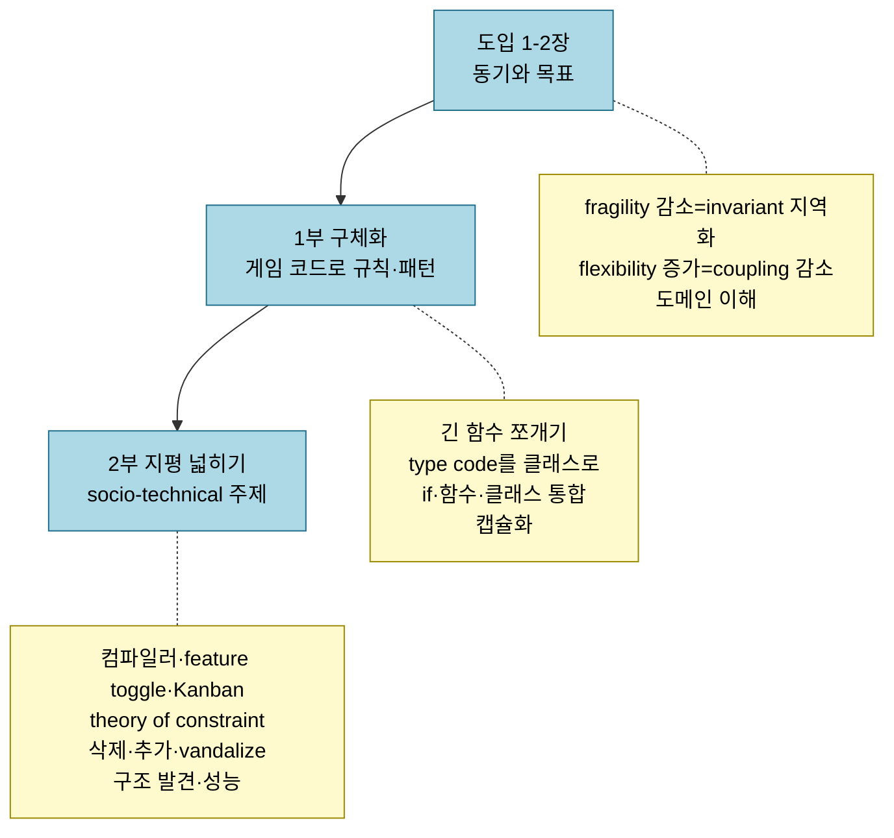
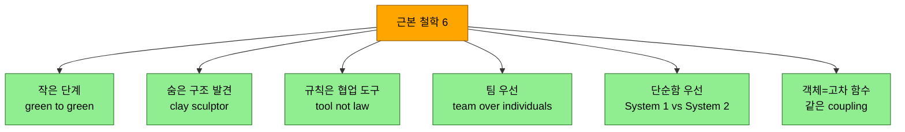

# 리팩토링의 근본 철학과 다음 여정 — 작은 단계·숨은 구조·팀

---

> *Five Lines of Code* 14장은 새 기법이 아니라 책 전체를 묶는 회고와 철학의 장입니다. 저자는 먼저 지나온 여정 — 리팩토링의 동기(1~2장), 게임 코드로 익힌 구체적 규칙(1부), 코드 품질을 둘러싼 socio-technical 주제(2부) — 를 되짚습니다. 그다음 그 모든 내용을 떠받친 여섯 가지 근본 철학(작은 단계·숨은 구조 발견·규칙은 협업 도구·팀 우선·완전함보다 단순함·객체와 고차 함수의 동등성)을 풀고, 마지막으로 이 책을 디딤돌 삼아 나아갈 세 길(마이크로 아키텍처·매크로 아키텍처·소프트웨어 품질)을 제시합니다. *Five Lines of Code* 의 마지막 장입니다.


## 학습 목표

이 글을 읽고 나면 다음 다섯 가지를 자신 있게 답할 수 있습니다.

- 큰 변환을 green to green의 작은 단계로 쪼개는 이유와 git reset이 브랜치 전환보다 나은 까닭을 설명할 수 있다.
- line→메서드→클래스→package로 cascade하며 숨은 구조를 발견하는 trick을 안다.
- 규칙이 법이 아니라 협업 도구이며, 팀이 개인보다 우선하는 까닭을 설명할 수 있다.
- System 1/2로 왜 "완전하지만 복잡한 규칙"보다 "단순하지만 틀릴 수 있는 규칙"을 택하는지 안다.
- 객체와 고차 함수가 리팩토링 관점에서 같다는 점, 그리고 책 너머 세 학습 루트를 구분할 수 있다.


## 1. 지나온 여정 — 동기·1부·2부

> 이 책은 리팩토링을 더 많은 이에게 다가갈 수 있게 만드는 여정이었습니다. 동기를 세우고(1~2장), 게임 코드로 구체적 규칙을 익히고(1부), 코드 품질의 socio-technical 토대를 넓혔습니다(2부).

이 책의 목표는 리팩토링을 더 많은 이에게 **accessible하고 actionable** 하게 만드는 것이었습니다. code smell·컴파일러 활용·feature toggling 같은 복잡한 개념의 진입 장벽을 낮추려 했습니다. "우리는 쓰는 언어로 세상을 칠합니다(We color the world with the language we use)" — 그래서 규칙·패턴·챕터 제목으로 어휘를 풍부하게 하려 했습니다.



> 1~2장은 리팩토링의 목표를 정의했습니다 — invariant를 지역화해 fragility를 줄이고, coupling을 줄여 flexibility를 높이고, 소프트웨어 도메인을 이해하는 것입니다.

**도입(1~2장)** 은 리팩토링이 무엇이고 왜 본질적이며 언제 우선하는지를 다뤘습니다. **1부** 는 reasonable해 보이는 코드베이스를 단계별로 개선하며 — [긴 함수 쪼개기](02-03.긴%20함수%20쪼개기.md), [type code를 클래스로 바꿔 함수를 메서드로 push](02-04.타입%20코드를%20다형성으로.md), [if·함수·클래스 통합](02-05.유사%20코드%20통합.md), [캡슐화 강제](02-06.데이터%20방어.md) — 강력한 리팩토링 패턴 카탈로그를 쌓았습니다. **2부** 는 추상 수준을 높여, 구체 규칙 대신 코드 품질에 영향을 주는 socio-technical 주제(컴파일러·feature toggling·theory of constraint, [삭제](03-03.코드%20삭제를%20사랑하라.md)·[추가](03-04.코드%20추가를%20두려워%20말라.md)·[vandalize](03-07.나쁜%20코드는%20나빠%20보이게.md)의 문화, 구조 발견·성능 최적화)를 다뤘습니다.


## 2. 여섯 가지 근본 철학

> specifics를 다 기억하지 않아도, 근본 원리를 internalize하면 책의 이득을 누립니다. 저자가 규칙을 생각하고 쓰는 여섯 가지 방식입니다.

정보가 너무 많아 한 사람이 모두 top of mind에 둘 수는 없습니다. 다행히 근본 원리를 내면화했다면 세부를 다 기억하지 않아도 됩니다.



> 앞의 셋은 리팩토링하는 방식(작은 단계·숨은 구조)과 규칙의 위상(협업 도구)을, 뒤의 셋은 사람과 팀에 관한 것(팀 우선·단순함·표현의 동등성)을 다룹니다.

**작은 단계 — green to green.** TDD와 공유하는 근본 의견은, 작은 단계가 에러 위험을 극적으로 줄인다는 것입니다. 큰 변환도 작은 변환을 chain으로 엮어 이룹니다. 모든 단계는 작고 *working에서 working으로* 갑니다 — green to green입니다. 위험 감소 외에도, green→green은 경로 변경의 유연성을 줍니다. 긴급 수정 요청이 오면 `git reset`으로 마지막 green 상태로 돌아가 작업을 최소만 잃습니다. 단순히 브랜치를 전환해 나중에 돌아오는 게 아니라 *reset* 해야 하는데, 리팩토링 중에는 머릿속에 loose thread가 많아 context를 전환하면 그것들을 기억하지 못해 에러 위험이 폭증하기 때문입니다. context 전환은 오직 green 상태에서, green 상태로만 합니다. [feature toggle](03-04.코드%20추가를%20두려워%20말라.md)처럼 코드와 문화를 함께 바꾸는 변환도, 모든 변경 둘레에 if를 넣고 빼는 reflex가 second nature가 된 *뒤에야* production 이점을 취합니다.

**숨은 구조 발견 — clay sculptor.** 리팩토링할 때 저자는 자신을 점토 조각가로 상상합니다 — 점토 덩어리에서 천천히 molding해 안의 구조를 드러냅니다(돌보다 코드가 malleable·reversible해 점토라 부르지만, Michelangelo의 "모든 돌덩이 안에는 조각상이 있고, 그것을 발견하는 것이 조각가의 일이다"가 핵심을 잘 표현합니다). [구조를 발견하는 trick](03-05.코드의%20구조를%20따르라.md)은 1부 대부분의 주제였습니다 — **line으로 메서드 위치를, 메서드로 클래스 위치를, 클래스로 namespace·package 위치를 안내** 하며 안에서 바깥의 더 추상적인 layer로 cascade합니다. 그래서 메서드는 하나 부족한 것보다 하나 많은 편이 낫습니다 — 메서드 하나가 common affix 유무를, 곧 또 다른 클래스를 가르기도 하니까요.

**규칙은 협업 도구 — tool not law.** silver bullet은 없습니다. 규칙은 법이 아니라 도구입니다. 맹목적으로 적용하거나, 더 나쁘게는 동료를 단속(police)하는 데 쓰는 것은 중대한 실수입니다 — [안전감이 개발팀의 1순위](03-07.나쁜%20코드는%20나빠%20보이게.md)니까요. 규칙이 리팩토링할 때 안전과 자신감을 주면 좋고, 서로 머리를 때리는 데 쓰이면 나쁩니다. 규칙은 코드 품질을 대화하는 좋은 기반이고 출발점이며, 리팩토링 학습의 동기를 만드는 데 탁월합니다.

**팀 우선 — team over individuals.** 소프트웨어 개발은 팀의 일입니다. 개인이 병렬로 일하면 효율이 오른다는 착각에 빠지기 쉽지만, 그건 knowledge silo를 만들어 병렬화 이득보다 해가 큽니다. pair·ensemble programming은 유익한 협업의 예로, 지식·skill·책임을 분산해 더 큰 trust와 commitment로 이어집니다 — "빨리 가려면 혼자 가고, 멀리 가려면 함께 가라(If you want to go fast, go alone. If you want to go far, go together)"는 아프리카 속담처럼요. "이 줄이 너무 긴가?"·"이게 나쁜가?"라는 물음에 저자는 늘 셋을 되묻습니다 — "개발자들이 이해하나? 만족하나? 성능/보안 제약을 깨지 않으면서 더 단순한 버전이 있나?"

**단순함 우선 — System 1 vs System 2.** 자기 규칙을 만들 때는 universal하게 만들려는 함정을 피해야 합니다 — vague·general한 규칙(code smell처럼)은 인상적으로 specified되지만 가장 중요한 기준인 *적용 용이성* 에서 실패합니다. 인지심리학의 두 시스템 중 **System 1** 은 빠르고 에너지를 거의 안 쓰지만 부정확하고(뇌가 선호), **System 2** 는 느리고 비싸지만 정확합니다("Moses가 방주에 동물을 몇 마리씩 태웠나?"에 "둘"이면 System 1, 방주는 Noah였다고 알아채면 System 2). 프로그래밍은 문제 해결이라 System 2이고, 개발자는 이미 푸는 문제에 정신 용량을 소진합니다. 그러니 사람이 실행할 규칙은 *생각 없이 적용할 만큼 단순* 해야 합니다. "단순하지만 틀릴 수 있는"과 "복잡하지만 옳은"의 척도에서 행동 변화를 원하면 단순함 쪽으로 기울이되, "이건 법이 아니라 guideline"이라는 disclaimer와 common sense로 맹목적 추종을 막습니다.

**객체와 고차 함수의 동등성.** 책은 객체와 클래스를 많이 썼지만, 리팩토링 관점에서 **메서드 하나인 객체와 고차 함수(lambda·delegate·closure·arrow)는 같은 것** 입니다 — 객체에 field가 있으면 closure이고, 둘은 같은 coupling을 가집니다. 하나가 더 화려해 보이지만 일부에겐 읽기 어려우니, 팀이 읽기 쉽다고 보는 쪽을 씁니다.

```typescript
// Listing 14.1 Object → 14.2 Higher-order function (같은 coupling)
function remove(shouldRemove: RemoveStrategy) {        // 객체: 단일 메서드 인터페이스
  if (shouldRemove.check(map[y][x])) map[y][x] = new Air();
}
remove(new RemoveLock1());                             // class RemoveLock1 { check(t) { return t.isLock1(); } }

function remove(shouldRemove: (tile: Tile) => boolean) { // 고차 함수: .check가 사라짐
  if (shouldRemove(map[y][x])) map[y][x] = new Air();
}
remove(tile => tile.isLock1());                        // RemoveLock1의 body를 람다로
```


## 3. 여기서 어디로 — 세 학습 루트

> 이 책을 디딤돌 삼아 나아갈 세 길은 마이크로 아키텍처·매크로 아키텍처·소프트웨어 품질입니다. 각 길에 저자가 권하는 고전이 있습니다.

이 여정은 여러 방향으로 이어질 수 있고, 가장 자연스러운 셋은 다음과 같습니다.

- **마이크로 아키텍처 루트** — 이 책의 주 초점이라 가장 매끄러운 전환입니다. expression부터 public interface·API 설계 직전까지의 coupling·fragility를 다룹니다. 더 정교한 smell은 Robert C. Martin의 *Clean Code*, 리팩토링 패턴 repertoire 확장은 Martin Fowler의 *Refactoring* 입니다.
- **매크로 아키텍처 루트** — [Conway's law](03-05.코드의%20구조를%20따르라.md)가 지배하는 inter-team 영역으로, 아키텍처가 조직의 communication 구조를 mirror합니다. 코드에 영향을 주려면 사람에 집중해야 해 저자는 "people route"라 부릅니다 — Mathew Skelton의 *Team Topologies* 를 권합니다.
- **소프트웨어 품질 루트** — 팀 성격에 따라 갈립니다. coding muggle에게 전달하는 product team은 **testing**(리팩토링이 내장된 TDD — Kent Beck *Test-Driven Development*), 다른 프로그래머에게 라이브러리를 전달하는 platform team은 **type theory**(Benjamin Pierce *Types and Programming Languages*), 가장 야심찬 독자는 **provable correctness**(dependent type·proof assistant — Edwin Brady *Type-Driven Development with Idris*, Lean)를 학습합니다. testing은 bulletproof가 아니고 type safety는 가르친 것만 커버하지만, provable correctness는 bulletproof하게 모든 것을 커버합니다.


## 4. 실무에 적용하기

이 장은 개별 기법을 넘어 "리팩토링을 어떤 태도로 대할 것인가"라는 메타 판단을 줍니다.

- **항상 green에서 green으로**: 리팩토링 도중 긴급 요청이 오면 어설픈 상태에서 브랜치를 전환하지 않습니다. 마지막 working 상태로 `git reset`해 loose thread를 잃기 전에 빠져나오고, 정리된 뒤 다시 작은 단계로 시작합니다.
- **메서드는 하나 많게**: 구조가 안 보일 때는 [line이 가리키는 곳마다 메서드를 추출](02-03.긴%20함수%20쪼개기.md)합니다. 과해 보여도, 그 메서드 하나가 common affix를 드러내 클래스 경계를 알려주곤 합니다.
- **규칙으로 사람을 때리지 않기**: 규칙은 코드 품질을 *대화* 하는 기반입니다. 동료를 단속하는 데 쓰면 [안전감](03-07.나쁜%20코드는%20나빠%20보이게.md)을 해쳐, 규칙이 주려던 이득을 스스로 무너뜨립니다.
- **자기 규칙은 단순하게**: 팀에 맞는 규칙을 만들 때 universal을 노리면 vague해집니다. 생각 없이 적용할 만큼 단순하게 만들고, "법이 아니라 guideline"임을 명시해 common sense에 맡깁니다.


## 5. 면접 관점에서

이 장은 리팩토링을 기법 모음이 아니라 *일관된 태도와 팀 활동* 으로 설명할 수 있는지를 묻기 좋습니다.

- **Q. green to green이 무엇이고 왜 git reset을 씁니까?** 모든 리팩토링 단계를 working에서 working으로 가게 하는 것입니다. 리팩토링 중에는 머릿속에 loose thread가 많아, 긴급 요청에 브랜치만 전환하면 그것들을 잃어 에러 위험이 폭증합니다. 그래서 마지막 green으로 reset해 최소만 잃고, context 전환은 green 상태에서/로만 합니다.
- **Q. 숨은 구조를 어떻게 발견합니까?** 점토 조각가처럼 안에서 바깥으로 cascade합니다 — line이 메서드 위치를, 메서드가 클래스 위치를, 클래스가 package 위치를 안내합니다. 그래서 메서드는 하나 부족한 것보다 하나 많은 편이 낫습니다.
- **Q. 규칙을 왜 단순하게 만들어야 합니까?** 프로그래밍은 System 2(느리고 정확하지만 비싼) 과업이라 개발자가 이미 정신 용량을 소진합니다. 규칙이 복잡하면 적용되지 않으니, "단순하지만 틀릴 수 있는" 쪽을 택하고 guideline임을 명시해 common sense로 보완합니다.
- **Q. 객체와 고차 함수는 리팩토링 관점에서 어떻게 다릅니까?** 메서드 하나인 객체와 고차 함수는 같은 것이고, field가 있으면 closure입니다. 같은 coupling을 가지므로 선택 기준은 오직 *팀이 읽기 쉬운 쪽* 입니다.


## 관련 문서

- [03-07.나쁜 코드는 나빠 보이게](03-07.나쁜%20코드는%20나빠%20보이게.md) — psychological safety·규칙을 단속에 쓰지 않기. "규칙은 협업 도구"라는 이 장 철학의 직접 토대입니다.
- [02-01.리팩토링 절차와 규칙](02-01.리팩토링%20절차와%20규칙.md) — 6단계 워크플로·테스트 없이 안전하게. green to green의 작은 단계가 실제로 어떤 절차인지의 토대입니다.
- [03-05.코드의 구조를 따르라](03-05.코드의%20구조를%20따르라.md) — 구조 발견·Conway's law·macro/micro architecture. clay sculptor의 구조 발견과 매크로 루트의 토대입니다.
- [03-04.코드 추가를 두려워 말라](03-04.코드%20추가를%20두려워%20말라.md) — feature toggle 5단계. 코드와 문화를 함께 작은 단계로 바꾸는 예의 토대입니다.
- [01-01.클린 코드 원칙](01-01.클린%20코드%20원칙.md) — 좋은 코드의 기준(이 시리즈의 시작점). 마이크로 아키텍처 루트의 *Clean Code* 와 이어지는, 책 여정의 첫 디딤돌입니다.
