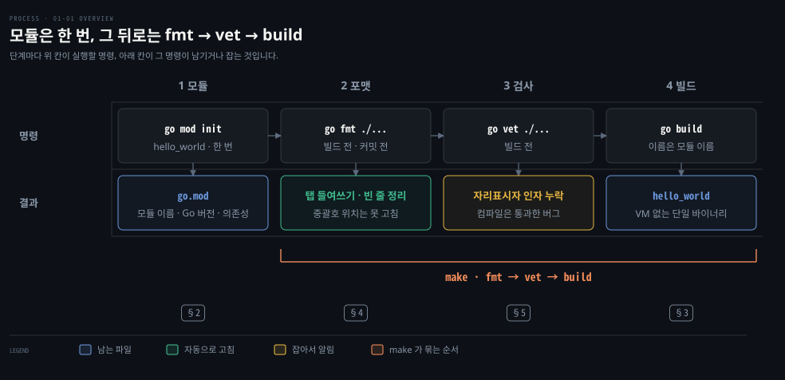

# go 명령 하나로 만들고 다듬고 검사합니다

---

> Learning Go 1장은 Go 개발 환경을 세우고 첫 프로그램을 만들어 검사하는 장입니다. 설치, 모듈, 빌드, 포맷, 정적 검사, Makefile, 편집기, 호환성 약속까지 한 번 훑습니다.

## 핵심 요약

> 이 장이 매달린 하나의 생각은 Go 가 개발 도구를 `go` 명령 하나에 모으고 코드 모양까지 정해 두어 개발자가 고를 것을 줄인다는 것입니다.

프로젝트는 `go mod init` 한 번으로 모듈이 됩니다. 그 뒤로는 `go fmt` 로 포맷을 맞추고 `go vet` 으로 버그를 찾고 `go build` 로 바이너리를 만듭니다.

포맷은 취향이 아니라 언어 규칙입니다. 여는 중괄호를 다음 줄에 두면 컴파일 에러가 납니다. 컴파일러가 세미콜론을 자동으로 넣는 규칙 때문입니다.

결과물은 가상 머신 없이 도는 단일 바이너리이고, Go 1 로 시작하는 버전 사이에서는 언어와 표준 라이브러리가 하위 호환을 지킵니다. 그래서 개발 도구를 올려도 이미 배포한 프로그램이 깨질 걱정이 적습니다. 다만 이 약속은 `go` 명령의 플래그와 동작까지 덮지는 않습니다.


## 학습 목표

> 이 편을 읽고 나면 아래 다섯 가지를 스스로 해낼 수 있습니다.

1. `go mod init` 으로 모듈을 만들고, `go.mod` 가 무엇을 적는 파일인지 설명할 수 있습니다.
2. `go build` 가 만든 바이너리의 이름이 어디서 오는지 알고, `-o` 로 바꿀 수 있습니다.
3. 여는 중괄호를 다음 줄에 두면 왜 컴파일이 깨지는지 세미콜론 자동 삽입 규칙으로 설명할 수 있습니다.
4. `go fmt` 와 `go vet` 이 각각 무엇을 고치고 무엇을 잡는지 구분하고, 둘을 빌드 앞에 묶는 Makefile 을 쓸 수 있습니다.
5. Go 1 호환성 약속이 보장하는 범위와 보장하지 않는 범위를 말할 수 있습니다.

아래는 이 장의 작업 순서를 네 단계로 이은 지도입니다. 모듈은 한 번 만들고 그 뒤로는 포맷·검사·빌드를 늘 같은 순서로 돌립니다. 원문은 `go build` 를 먼저 소개하고 `go fmt`·`go vet` 을 뒤에 소개합니다. 그래도 원문의 Makefile 이 실제로 고정하는 순서는 그림과 같습니다. 맨 아래 칩은 그 단계를 다루는 절입니다.




## 1. 설치 — Go 프로그램은 VM 없이 도는 단일 바이너리입니다

> Go 로 만든 프로그램은 네이티브 바이너리 하나로 컴파일되므로, 실행할 기계에 런타임을 따로 깔 필요가 없습니다. 설치는 개발 도구만 준비하는 일입니다.

Java 로 만든 서비스는 보통 실행할 서버에 JVM 이 먼저 있어야 합니다(이 비교는 원문 밖의 것입니다). Go 는 이 전제가 없습니다. 원문은 Go 프로그램이 추가 소프트웨어 없이 도는 단일 네이티브 바이너리로 컴파일된다고 적고, Java·Python·JavaScript 처럼 가상 머신을 깔아야 하는 언어와 대비합니다. 배포가 쉬워지는 이유가 여기 있습니다. 원문은 컨테이너를 다루지 않는다고 밝히면서도, Docker 나 Kubernetes 를 쓰는 개발자는 Go 앱을 `scratch` 나 distroless 이미지에 담을 수 있는 경우가 많다고 덧붙입니다.

설치는 Go 웹사이트의 다운로드 페이지에서 플랫폼에 맞는 파일을 받는 것으로 끝납니다. 맥의 `.pkg` 와 윈도우의 `.msi` 설치 파일이 해 주는 일은 세 가지입니다. 알맞은 위치에 Go 를 깔고 옛 설치를 지운 뒤 실행 경로에 `go` 를 넣습니다. 패키지 관리자를 쓰면 한 줄입니다.

```bash
# macOS — Homebrew
brew install go
# Windows — Chocolatey
choco install golang
```

리눅스와 BSD 는 gzip 으로 묶은 TAR 파일을 받아 `/usr/local` 에 풀고 `/usr/local/go/bin` 을 `$PATH` 에 더합니다. `/usr/local` 에 쓸 권한이 없으면 `tar` 앞에 `sudo` 를 붙입니다.

```bash
# 원문의 예 — 책이 쓰인 시점의 버전 go1.20.5
tar -C /usr/local -xzf go1.20.5.linux-amd64.tar.gz
echo 'export PATH=$PATH:/usr/local/go/bin' >> $HOME/.bash_profile
source $HOME/.bash_profile
```

설치를 확인하는 명령은 `go version` 입니다. 출력의 마지막 칸이 운영체제와 칩 아키텍처입니다. `darwin` 은 macOS 의 중심에 있는 운영체제 이름이고, `arm64` 는 ARM 설계 기반 64비트 칩을 가리킵니다.

```bash
go version
```

```bash
# 원문 출력 (macOS)
go version go1.20.5 darwin/arm64
# 원문 출력 (x64 리눅스)
go version go1.20.5 linux/amd64
# 이 노트를 쓴 기계의 출력 (2026-09-27)
go version go1.25.1 darwin/arm64
```

이 노트의 예제는 모두 `go1.25.1` 에서 다시 돌렸습니다. 책은 1.20 을 기준으로 쓰였으므로, 출력이 달라진 자리는 해당 절에서 따로 적습니다.

### 버전 대신 에러가 나오면 실행 경로부터 봅니다

원문이 드는 원인은 둘입니다. 실행 경로에 `go` 가 없거나, `go` 라는 이름의 다른 프로그램이 경로에 먼저 있는 경우입니다. macOS 와 유닉스 계열에서는 `which go` 로 실제로 실행되는 `go` 를 확인하고, 아무것도 나오지 않으면 실행 경로를 고칩니다. 리눅스와 BSD 라면 32비트 시스템에 64비트 도구를 깔았거나 칩 아키텍처가 다른 도구를 받았을 수도 있습니다.

### GOROOT 와 GOPATH 는 무시해도 됩니다

Go 는 2009년에 나온 뒤 코드와 의존성을 정리하는 방식이 여러 번 바뀌었습니다. 그래서 인터넷에는 서로 어긋나는 조언이 많고, 원문은 그 대부분이 낡았다고 말합니다. 예로 드는 것이 `GOROOT` 와 `GOPATH` 에 관한 논의입니다. 지금 규칙은 단순합니다. 프로젝트를 원하는 구조로, 원하는 위치에 두면 됩니다. Java 에서 클래스패스나 로컬 저장소 위치를 먼저 맞추던 습관을 여기서는 내려놓아도 됩니다.


## 2. 모듈 — go mod init 이 만든 go.mod 가 프로젝트의 이름과 의존성을 적습니다

> Go 프로젝트 하나가 모듈 하나이고, 모듈의 뿌리에는 늘 `go.mod` 가 있습니다. 이 파일은 손으로 고치지 않고 `go` 명령으로 관리합니다.

첫 파일을 쓰기 전에 정할 것이 있습니다. 이 코드가 어느 프로젝트에 속하고 의존성은 어디에 적는가입니다. Go 에서는 디렉터리를 만들고 그 안에서 `go mod init` 을 실행하는 것으로 둘을 한 번에 정합니다. 원문의 첫 프로그램은 `ch1` 디렉터리에 `hello_world` 라는 모듈로 만듭니다.

```bash
mkdir ch1
cd ch1
go mod init hello_world
```

```bash
go: creating new go.mod: module hello_world
```

**모듈(module)**은 Go 프로젝트를 부르는 이름입니다. 원문은 모듈이 소스 코드만이 아니라 그 코드가 쓰는 의존성의 정확한 명세이기도 하다고 강조합니다. 모든 모듈은 뿌리 디렉터리에 `go.mod` 파일을 갖습니다. `go mod init` 이 이 파일을 만듭니다.

`go.mod` 는 세 가지를 적습니다. 모듈 이름, 이 모듈이 지원하는 최소 Go 버전, 이 모듈이 의존하는 다른 모듈입니다. 원문은 Python 의 `requirements.txt` 나 Ruby 의 `Gemfile` 에 빗댑니다. Java 개발자라면 Maven 의 `pom.xml` 에서 좌표와 의존성 부분만 떼어 낸 파일로 보면 가깝습니다. 이 비유는 원문 밖의 것입니다.

```bash
# 원문의 go.mod (Go 1.20)
module hello_world
go 1.20
```

```bash
# go1.25.1 이 만든 go.mod (2026-09-27 실행)
module hello_world

go 1.25.1
```

같은 명령인데 `go` 줄이 다릅니다. 원문은 `go 1.20` 처럼 부 버전까지 적었지만, 이 노트를 쓴 환경의 `go mod init` 은 설치된 도구의 패치 버전까지 `go 1.25.1` 로 적었습니다. 어느 쪽이든 이 줄은 원문 설명대로 모듈이 요구하는 최소 Go 버전입니다.

원문은 `go.mod` 를 직접 고치지 말라고 합니다. 의존성을 더하거나 정리할 때는 `go get` 과 `go mod tidy` 를 씁니다. 모듈에 관한 나머지 내용은 10장에서 다룹니다.


## 3. 첫 프로그램과 go build — main 패키지의 main 함수에서 시작합니다

> Go 프로그램은 `main` 패키지의 `main` 함수에서 시작하고, `go build` 는 모듈 이름을 딴 실행 파일 하나를 만듭니다.

원문은 `ch1` 안에 `hello.go` 를 만들고 아래 코드를 넣습니다. 아래 블록은 원문을 그대로 옮긴 것이라 `fmt.Println` 줄에 들여쓰기가 없습니다. 저자가 일부러 뺀 것으로, 4절에서 `go fmt` 가 이 모양을 고치는 것을 보여 주려는 장치입니다.

```go
package main
import "fmt"
func main() {
fmt.Println("Hello, world!")
}
```

Go 코드를 실제로 쓸 때는 이렇게 쓰지 않습니다. 탭으로 들여쓰고 선언 사이에 빈 줄을 둔 올바른 모양은 4절 「go fmt」에 있습니다. 4절의 중괄호 예제처럼 일부러 틀린 코드를 빼면, 이 노트의 다른 코드 블록은 모두 탭 들여쓰기로 적었습니다.

첫 줄은 **패키지 선언**입니다. 모듈 안의 코드는 하나 이상의 패키지로 나뉘고, 그중 `main` 패키지가 프로그램을 시작하는 코드를 담습니다. 둘째 줄의 `import` 는 이 파일이 쓰는 패키지를 적습니다. 여기서는 표준 라이브러리의 `fmt` 를 씁니다. 원문은 이 이름을 보통 "fumpt" 로 읽는다고 적습니다.

Java 개발자가 눈여겨볼 차이가 이 `import` 에 있습니다. 원문은 "다른 언어와 달리" 라고만 적으므로 Java 와의 대비는 원문 밖에서 덧붙입니다. Java 는 `import java.util.List;` 처럼 클래스 하나만 골라 들여올 수 있습니다. Go 는 패키지 통째로만 들여옵니다. 패키지 안의 특정 타입·함수·상수·변수만 골라 들여오는 문법이 없습니다.

모든 Go 프로그램은 `main` 패키지의 `main` 함수에서 시작합니다. 함수는 `func main()` 과 여는 중괄호로 선언하고, 블록의 시작과 끝을 중괄호로 표시하는 것은 Java·JavaScript·C 와 같습니다. 본문 한 줄은 `fmt` 패키지의 `Println` 함수를 `"Hello, world!"` 인자로 부릅니다.

파일을 저장하고 `go build` 를 실행하면 현재 디렉터리에 실행 파일이 생깁니다.

```bash
go build
./hello_world
```

```bash
Hello, world!
```

실행 파일의 이름은 파일 이름이 아니라 모듈 선언의 이름을 따릅니다. 그래서 `hello.go` 를 빌드했는데 `hello_world` 가 생깁니다(윈도우에서는 `hello_world.exe`). 이름이나 저장 위치를 바꾸려면 `-o` 플래그를 씁니다.

```bash
# 바이너리 이름을 hello 로
go build -o hello
```

원문은 작은 프로그램을 바로 돌려 보는 `go run` 을 "Using go run to Try Out Small Programs" 절에서 다룬다고 예고합니다. 원문은 절 이름만 적고, 책 전체를 찾아보니 이 절은 11장에 있습니다.


## 4. go fmt — 포맷을 언어가 정해 두어 논쟁과 도구 부담을 없앱니다

> Go 는 코드 포맷을 하나로 정해 두고 `go fmt` 로 공백을 자동으로 맞춥니다. 다만 여는 중괄호의 위치는 포맷이 아니라 문법이라 `go fmt` 도 고치지 못합니다.

팀이 커지면 중괄호를 어디에 둘지, 탭과 스페이스 중 무엇을 쓸지를 두고 시간이 샙니다. 원문은 개발자들이 이런 포맷 논쟁에 오랫동안 많은 시간을 써 왔다고 말합니다. Go 는 이 선택지를 아예 없앴습니다. 대부분의 언어가 포맷을 자유롭게 두는 것과 달리, Go 는 표준 포맷을 하나로 정해 둡니다.

원문이 드는 이유는 둘입니다. 먼저 포맷이 하나로 고정되면 소스 코드를 다루는 도구를 만들기 쉬워집니다. 컴파일러가 단순해지고, 코드를 생성하는 영리한 도구들이 나올 수 있습니다. 논쟁이 사라지는 것은 그다음에 따라오는 이득입니다. 원문은 많은 사람이 반대로 알고 있다고 짚습니다. 논쟁을 피하려고 포맷을 정했다가 도구의 이점을 나중에 발견했다는 이야기인데, Go 개발 책임자 Russ Cox 는 자신의 원래 동기가 더 나은 도구였다고 공개적으로 밝혔습니다.

표준 포맷의 규칙 두 가지를 원문이 예로 듭니다. 들여쓰기는 탭으로 합니다. 블록을 여는 중괄호가 그 블록을 시작하는 선언이나 명령과 같은 줄에 있지 않으면 문법 에러입니다.

`go fmt` 는 코드의 공백을 표준 포맷에 맞게 고칩니다.

```bash
go fmt ./...
```

```bash
hello.go
```

`./...` 는 현재 디렉터리와 그 아래 모든 하위 디렉터리의 파일에 명령을 적용하라는 뜻이고, 다른 Go 도구에서도 계속 나옵니다. 출력은 고친 파일의 이름입니다. 실행 뒤 `hello.go` 를 열면 `fmt.Println` 줄이 탭 하나로 들여써져 있습니다.

원문은 들여쓰기만 짚지만, 이 노트를 쓰면서 돌려 보니 `package`·`import`·`func` 사이에도 빈 줄이 하나씩 들어갔습니다. 3절의 엉성한 코드는 `go fmt` 를 거쳐 아래 모양이 됩니다.

```go
package main

import "fmt"

func main() {
	fmt.Println("Hello, world!")
}
```

원문은 `go fmt` 를 컴파일 전에, 적어도 저장소에 커밋하기 전에는 꼭 돌리라고 권합니다. 잊었다면 `go fmt ./...` 만 담은 커밋을 따로 만들어, 로직 변경이 포맷 변경 더미에 묻히지 않게 하라고 덧붙입니다.

`go fmt` 가 중괄호 위치를 고치지 못하는 이유는 아래 세미콜론 규칙에 있습니다.

### 세미콜론 자동 삽입이 여는 중괄호를 같은 줄에 묶습니다

Go 도 C 나 Java 처럼 문장 끝에 세미콜론이 필요합니다. 그런데 Go 개발자는 세미콜론을 직접 쓰지 않습니다. 컴파일러의 렉서가 **세미콜론 자동 삽입 규칙**에 따라 넣어 주기 때문입니다. 규칙은 Effective Go 에 적혀 있고[^effective-go-semi], 원문이 옮긴 조건은 이렇습니다. 줄바꿈 바로 앞의 마지막 토큰이 아래 셋 중 하나이면 그 토큰 뒤에 세미콜론을 넣습니다.

- 식별자: `int`·`float64` 같은 단어도 여기 들어갑니다
- 기본 리터럴: 숫자나 문자열 상수
- 토큰 여덟 개: `break`·`continue`·`fallthrough`·`return`·`++`·`--`·`)`·`}`

이 규칙을 알면 중괄호를 다음 줄에 둘 때 무슨 일이 생기는지 보입니다.

```go
func main()
{
	fmt.Println("Hello, world!")
}
```

`func main()` 줄은 `)` 로 끝납니다. 렉서는 그 뒤에 세미콜론을 넣으므로, 컴파일러가 실제로 읽는 코드는 아래와 같습니다. 원문은 이것이 올바른 Go 가 아니라고 적습니다.

```go
func main();
{
	fmt.Println("Hello, world!");
};
```

`go1.25.1` 에서 이 코드를 빌드하면 아래 에러가 납니다. `go fmt` 도 같은 파일에서 같은 에러를 내며 멈춥니다. 포맷을 고치려면 먼저 코드를 읽을 수 있어야 하는데, 이 파일은 읽는 단계에서 이미 깨졌기 때문입니다.

```bash
# go1.25.1 에서 go build 를 실행한 출력 (2026-09-27)
b/main.go:6:1: syntax error: unexpected semicolon or newline before {
```

원문은 이 규칙과 그에 따른 중괄호 제약이 Go 컴파일러를 더 단순하고 빠르게 만들면서 동시에 코딩 스타일도 강제한다고 평가합니다.


## 5. go vet — 컴파일은 되지만 틀린 코드를 잡습니다

> 문법은 맞아서 컴파일되지만 거의 확실히 틀린 코드가 있습니다. `go vet` 은 이런 버그를 빌드 전에 찾아 줍니다.

형식 문자열에 자리표시자를 두고 값을 빠뜨리는 실수가 대표적입니다. `fmt.Printf` 는 C·Java·Ruby 의 `printf` 와 비슷한 함수로, 첫 인자가 템플릿이고 나머지 인자가 템플릿의 자리표시자에 들어갈 값입니다. 원문은 `hello.go` 의 `fmt.Println` 줄을 아래처럼 바꿔 버그를 심습니다.

```go
fmt.Printf("Hello, %s!\n")
```

템플릿에 `%s` 자리표시자가 있는데 값이 없습니다. 원문 말대로 이 코드는 컴파일되고 실행도 됩니다. 이 노트를 쓰면서 `go run` 으로 돌려 보니, 에러 없이 값이 빠졌다는 표시만 찍혔습니다.

```bash
# go1.25.1 에서 go run . 을 실행한 출력 (2026-09-27)
Hello, %!s(MISSING)!
```

`go vet` 이 찾는 것 가운데 하나가 이것입니다. 형식 템플릿의 자리표시자마다 값이 있는지 봅니다.

```bash
go vet ./...
```

```bash
# 원문 출력
# hello_world
./hello.go:6:2: fmt.Printf format %s reads arg #1, but call has 0 arg
```

```bash
# go1.25.1 출력 (2026-09-27)
# hello_world
# [hello_world]
./hello.go:6:21: fmt.Printf format %s reads arg #1, but call has 0 args
```

지금 버전의 출력은 세 군데가 다릅니다.

- `# [hello_world]` 줄이 하나 더 있습니다.
- 위치가 `6:2`(호출이 시작하는 열)가 아니라 `6:21`(형식 문자열 안의 `%s` 자리)을 가리킵니다.
- 끝이 `0 args` 입니다.

원문의 `0 arg` 가 인쇄 과정에서 줄 끝이 잘린 것인지 당시 도구의 출력인지는 이 PDF 만으로 가릴 수 없습니다. 오류 메시지를 스크립트로 읽는다면 버전마다 모양이 바뀐다는 점을 전제로 둡니다.

고치는 방법은 자리표시자에 값을 넣는 것입니다.

```go
fmt.Printf("Hello, %s!\n", "world")
```

`go vet` 이 흔한 실수를 여럿 잡지만 모든 것을 잡지는 못합니다. 원문은 그 빈틈을 서드파티 코드 품질 도구가 메운다고 말하고, "Using Code-Quality Scanners" 절로 넘깁니다. 이 절도 11장에 있습니다. 또 모든 Go 개발자가 Effective Go 와 Go 위키의 Code Review Comments 를 읽어 관용적인 Go 코드가 어떤 모양인지 익히라고 권합니다.

### go fmt 와 go vet 은 서로 다른 것을 봅니다

두 명령은 모두 빌드 전에 돌리지만 보는 대상이 다릅니다. 표는 이 편 4·5절을 모은 것이고, `go fmt` 행의 "선언 사이 빈 줄" 은 원문이 아니라 4절의 로컬 실행에서 본 것입니다.

| 명령 | 보는 것 | 고치나 | 이 장의 예 |
|---|---|---|---|
| `go fmt` | 공백과 줄 배치 | 자동으로 고침 | 탭 들여쓰기, 선언 사이 빈 줄 |
| `go vet` | 문법은 맞지만 의심스러운 코드 | 알리기만 함 | `%s` 에 값이 없는 `Printf` |
| 컴파일러 | 문법 | 빌드를 멈춤 | 다음 줄로 내려간 여는 중괄호 |


## 6. Makefile — fmt·vet·build 순서를 명령 하나에 묶습니다

> IDE 는 편하지만 자동화하기 어렵습니다. Go 개발자는 `make` 로 포맷·검사·빌드를 정해진 순서로 묶어, 누가 어디서 빌드하든 같은 단계를 거치게 합니다.

"제 기계에서는 되는데요" 라는 말이 나오는 이유는 빌드 단계가 사람 손에 달려 있어서입니다. 원문은 현대 소프트웨어 개발이 누구나 어디서나 언제든 돌릴 수 있는 반복 가능한 자동 빌드에 기대고 있다고 말합니다. 방법은 빌드 단계를 스크립트로 적는 것이고, Go 개발자들이 고른 도구가 `make` 입니다. `make` 는 1976년부터 유닉스에서 프로그램을 빌드하는 데 쓰여 왔습니다.

원문은 `ch1` 디렉터리에 아래 `Makefile` 을 만듭니다. 들여쓴 줄은 반드시 탭으로 들여써야 합니다.

```makefile
.DEFAULT_GOAL := build

.PHONY:fmt vet build
fmt:
	go fmt ./...
vet: fmt
	go vet ./...

build: vet
	go build
```

Makefile 의 각 작업을 **타깃(target)**이라 부릅니다. 읽는 법은 이렇습니다.

- `.DEFAULT_GOAL`: 타깃을 지정하지 않고 `make` 만 쳤을 때 돌릴 타깃입니다. 여기서는 `build` 입니다.
- `fmt:` 처럼 콜론 앞 단어: 타깃 이름입니다.
- `build: vet` 처럼 콜론 뒤 단어: 이 타깃보다 먼저 돌아야 하는 타깃입니다. 그래서 `build` 는 `vet` 을, `vet` 은 `fmt` 를 먼저 돌립니다.
- 타깃 아래 들여쓴 줄: 그 타깃이 실행하는 명령입니다.
- `.PHONY`: 프로젝트에 타깃과 같은 이름의 파일이나 디렉터리가 있어도 `make` 가 헷갈리지 않게 합니다.

`make` 를 실행하면 의존 순서대로 세 명령이 돕니다. `go1.25.1` 에서 돌린 출력도 원문과 같았습니다.

```bash
make
```

```bash
go fmt ./...
go vet ./...
go build
```

명령 하나로 포맷을 맞추고 드러나지 않는 에러를 검사한 뒤 컴파일까지 합니다. `make vet` 은 검사까지만, `make fmt` 는 포맷만 돌립니다. 원문은 이것이 대단한 개선으로 보이지 않을 수 있다고 인정합니다. 그래도 개발자든 CI 빌드 서버의 스크립트든 빌드 전에 포맷과 검사가 반드시 돌게 되므로 단계를 빠뜨리지 않습니다.

Maven 이 `package` 단계를 부르면 `compile`·`test` 가 먼저 도는 것과 같은 발상입니다. 이 비교는 원문 밖의 것입니다.

원문이 드는 단점도 있습니다. Makefile 은 까다로워서 타깃의 단계를 반드시 탭으로 들여써야 합니다. 윈도우에는 기본으로 들어 있지 않아, Chocolatey 같은 패키지 관리자를 깔고 `choco install make` 로 설치해야 합니다.


## 7. 편집기와 Go Playground — 어디서 쓰고 어디서 시험하나

> 프로젝트가 커지면 IDE 같은 더 나은 도구를 원하게 되고, 원문은 VS Code 와 GoLand 를 대표로 듭니다. 설치 없이 작은 코드를 돌려 보고 공유하는 자리로는 Go Playground 가 있습니다.

텍스트 편집기와 `go` 명령만으로도 작은 프로그램은 만들 수 있습니다. 프로젝트가 커지면 저장할 때 자동 포맷, 코드 완성, 타입 검사, 에러 보고, 통합 디버깅 같은 기능이 아쉬워집니다. 원문이 고른 세 도구를 같은 축으로 놓으면 아래와 같습니다.

| 도구 | 비용 | Go 지원을 얻는 방법 | 원문이 짚는 특징 |
|---|---|---|---|
| Visual Studio Code | 무료 | 확장 갤러리에서 Go 확장 설치. 컴파일러는 직접 깔고, Delve 와 gopls 는 확장이 깔아 줌 | 2015년 출시 뒤 가장 인기 있는 소스 코드 편집기 |
| GoLand | 유료. 30일 무료 체험, 학생·핵심 오픈소스 기여자 무료 라이선스 | 플러그인 없이 바로 동작. IntelliJ Ultimate 구독자는 플러그인으로 추가 | JetBrains 의 Go 전용 IDE. 리팩터링·커버리지·디버거, JavaScript·SQL 도구 포함 |
| Go Playground | 무료, 설치 없음 | 브라우저에서 바로 실행 | 작은 프로그램을 돌려 보고 URL 로 공유 |

VS Code 의 Go 확장이 쓰는 두 도구 이름이 처음 나옵니다. Delve 는 Go 디버거입니다. gopls 는 Go 팀이 만든 Go 언어 서버입니다. **언어 서버(language server)**는 편집기가 코드 완성, 품질 검사, 변수나 함수가 쓰인 곳 찾기 같은 지능적인 편집 기능을 구현하도록 해 주는 API 의 표준 명세입니다. 원문은 Language Server Protocol 웹사이트를 더 읽을 곳으로 듭니다.

IntelliJ 를 써 온 Java 개발자에게는 GoLand 의 화면이 익숙합니다. 원문도 GoLand 의 인터페이스가 IntelliJ·PyCharm 같은 다른 JetBrains IDE 와 닮았다고 적습니다.

### Go Playground 는 남의 컴퓨터라서 제약이 있습니다

Go Playground 는 작은 프로그램을 시험하고 공유하는 곳입니다. `irb`·`node`·`python` 같은 대화형 환경과 느낌이 비슷합니다. 원문이 설명하는 버튼은 아래와 같습니다.

- Run: 코드를 실행합니다.
- Format: `go fmt` 를 돌리고 import 를 정리합니다.
- Share: 고유 URL 을 만듭니다. 원문은 이 URL 이 오랫동안 유지돼 왔지만 소스 코드 저장소로 믿지는 말라고 합니다.

한 창에 여러 파일을 흉내 내려면 `-- filename.go --` 모양의 줄로 파일을 나눕니다. 이름에 `/` 를 넣으면 `-- subdir/my_code.go --` 처럼 하위 디렉터리도 흉내 낼 수 있습니다.

원문의 말대로 Playground 는 남의 컴퓨터, 정확히는 Google 의 컴퓨터에서 돕니다. 그래서 제약이 있습니다.

- Go 버전은 몇 개 중에서만 고릅니다. 보통 현재 릴리스, 직전 릴리스, 최신 개발 버전입니다.
- 네트워크 연결은 `localhost` 로만 됩니다.
- 너무 오래 돌거나 메모리를 너무 많이 쓰는 프로세스는 멈춥니다.
- 시계가 2009년 11월 10일 23:00:00 UTC 에 맞춰져 있습니다. Go 가 처음 발표된 날입니다. 시간에 기대는 프로그램이라면 이 점을 계산에 넣어야 합니다.

개인 식별 정보, 비밀번호, 개인 키 같은 민감한 정보는 Playground 에 넣지 않습니다. Share 를 누르면 그 내용이 Google 서버에 저장되고 URL 을 가진 누구나 볼 수 있기 때문입니다. 실수로 올렸다면 원문은 `security@golang.org` 에 URL 과 삭제가 필요한 이유를 보내라고 안내합니다.


## 8. 호환성 약속과 업데이트 — 언어는 깨지지 않고 go 명령은 깨질 수 있습니다

> Go 1 로 시작하는 버전 사이에서는 언어와 표준 라이브러리를 깨는 변경을 하지 않는다는 약속이 있습니다. 이 약속은 `go` 명령에는 적용되지 않습니다.

언어가 자주 바뀌면 도구를 올릴 때마다 코드가 깨질까 걱정하게 됩니다. 원문에 따르면 Go 는 1.2 이후로 대략 여섯 달마다 새 릴리스가 나오고, 버그·보안 수정은 필요할 때마다 패치 릴리스로 나옵니다. 개발 주기가 빠른 데다 Go 팀이 하위 호환에 매달리기 때문에 릴리스는 확장보다 점진적인 쪽입니다.

**Go 호환성 약속(Go Compatibility Promise)**은 Go 팀이 Go 코드를 깨지 않으려고 어떻게 할지를 적은 문서입니다.[^go1compat] 원문이 요약한 핵심은 이렇습니다. 1 로 시작하는 Go 버전에서는 언어와 표준 라이브러리에 하위 호환을 깨는 변경을 하지 않습니다. 예외는 버그나 보안 수정에 필요한 경우뿐입니다. 원문은 Russ Cox 의 GopherCon 2022 기조연설 "Compatibility: How Go Programs Keep Working" 에서 한 문장을 인용합니다.

> "I believe that prioritizing compatibility was the most important design decision that we made in Go 1."

이 보장이 덮지 않는 것이 있습니다. `go` 명령입니다. 원문은 `go` 명령의 플래그와 기능에는 하위 호환을 깨는 변경이 있었고 앞으로도 충분히 있을 수 있다고 적습니다. 5절에서 본 `go vet` 출력의 차이도 도구 쪽 변화라는 점에서 같은 범위로 읽을 수 있습니다. 이 연결은 원문이 아니라 이 노트의 해석입니다. 언어로 쓴 코드는 그대로 두어도 되지만, `go` 명령을 부르는 빌드 스크립트는 도구를 올린 뒤 한 번 확인하는 것이 안전합니다.

### 개발 도구를 올려도 이미 배포한 프로그램은 영향을 받지 않습니다

Go 프로그램은 독립된 네이티브 바이너리로 컴파일되므로, 개발 환경을 업데이트해도 이미 배포한 프로그램이 실패할 걱정은 없습니다. 서로 다른 Go 버전으로 컴파일한 프로그램이 같은 컴퓨터나 가상 머신에서 동시에 돌 수도 있습니다. Java 라면 공유된 JVM 을 올릴 때 그 위의 애플리케이션을 함께 따져 봐야 하는 경우가 있는데, Go 는 이 걱정이 구조적으로 없습니다. 이 비교는 원문 밖의 것입니다.

업데이트 방법은 설치 방법을 따라갑니다. `brew` 나 `chocolatey` 로 깔았다면 그 도구로 올립니다. 공식 설치 파일로 깔았다면 최신 설치 파일을 받아 실행하면 옛 버전을 지우고 새 버전을 깝니다. 리눅스와 BSD 는 옛 버전을 백업 디렉터리로 옮기고 새 버전을 푼 다음 옛 버전을 지웁니다.

```bash
# 원문의 예 — go1.20.6 으로 올리기
mv /usr/local/go /usr/local/old-go
tar -C /usr/local -xzf go1.20.6.linux-amd64.tar.gz
rm -rf /usr/local/old-go
```

옛 설치를 바로 지우고 새로 깔아도 되지만, 원문은 설치가 잘못될 때를 대비해 옛 버전을 잠시 남겨 두는 편을 권합니다.


## 연습 문제

> 원문의 연습 문제 세 개입니다. 2번과 3번은 `go1.25.1` 에서 직접 풀어 결과를 확인했고, 1번은 브라우저 작업이라 실행하지 않았습니다.

원문의 정답은 책의 Chapter 1 저장소에 있습니다.

### 1. Hello, world 를 Playground 에서 돌리고 공유하기

"Hello, world!" 프로그램을 Go Playground 에서 실행하고, Share 로 만든 링크를 Go 를 배우고 싶어 하는 동료에게 보냅니다. 7절의 경고대로 공유 URL 은 누구나 볼 수 있으므로, 연습에서도 민감한 값은 넣지 않습니다.

### 2. Makefile 에 clean 타깃 더하기

`go build` 가 만든 `hello_world` 바이너리와 다른 임시 파일을 지우는 `clean` 타깃을 더하는 문제입니다. 원문은 Go 명령 문서에서 쓸 만한 명령을 찾아보라고 힌트만 줍니다. 아래는 이 노트의 풀이이고, 찾은 명령은 `go clean` 입니다.

```makefile
clean:
	go clean
```

`go1.25.1` 에서 `go build` 와 `go build -o hello` 로 바이너리 둘을 만들었습니다. 그 뒤 `make clean` 을 돌리니 `hello_world` 와 `hello` 가 모두 지워지고 `go.mod`·`hello.go`·`Makefile` 만 남았습니다. `-o hello` 로 만든 바이너리까지 지워진 이유는 `go help clean` 의 삭제 대상 목록만으로는 분명하지 않아, 여기서는 관찰한 결과만 적습니다.

### 3. 포맷을 흐트러뜨리고 go fmt 가 되돌리는지 보기

빈 줄·공백·들여쓰기를 바꾸고 줄바꿈을 넣은 뒤 `go fmt` 가 되돌리는지, `go build` 가 여전히 되는지 보는 문제입니다. 함수 가운데 빈 줄을 넣고 `fmt.Println` 을 더해 보라는 제안도 있습니다. `import` 뒤에 빈 줄 셋, 함수 안에 스페이스 들여쓰기와 빈 줄 셋을 넣고 `gofmt -d` 로 차이를 봤습니다.

```bash
# go1.25.1 에서 gofmt -d hello.go 를 실행한 출력 (2026-09-27)
@@ -2,12 +2,8 @@
 
 import "fmt"
 
-
-
 func main() {
-    fmt.Println("a")
-
-
-
-        fmt.Println("b")
+	fmt.Println("a")
+
+	fmt.Println("b")
 }
```

연달아 넣은 빈 줄은 하나로 줄고, 스페이스 들여쓰기는 탭 하나로 바뀌었습니다. 함수 안의 빈 줄도 완전히 사라지지 않고 하나는 남습니다. 공백과 빈 줄만 바꾼 코드는 계속 빌드됩니다. 반면 4절처럼 줄바꿈으로 여는 중괄호를 다음 줄에 보내면 빌드와 포맷이 모두 멈춥니다.


## 핵심 개념 체크리스트

목표 번호 순서대로 짝지었습니다.

- [ ] (목표 1) `go mod init` 이 만드는 파일과, 그 파일이 적는 세 가지를 말할 수 있습니까?
- [ ] (목표 1) `go.mod` 를 손으로 고치지 않을 때 대신 쓰는 명령 둘을 댈 수 있습니까?
- [ ] (목표 2) `hello.go` 를 빌드했는데 `hello_world` 가 생기는 이유와, 이름을 바꾸는 플래그를 말할 수 있습니까?
- [ ] (목표 2) Java 의 `import` 와 비교해 Go 의 `import` 가 무엇을 못 하는지 말할 수 있습니까?
- [ ] (목표 3) 세미콜론 자동 삽입의 세 조건을 대고, `func main()` 다음 줄의 `{` 가 왜 깨지는지 설명할 수 있습니까?
- [ ] (목표 4) `go fmt` 가 고치는 것과 못 고치는 것, `go vet` 이 잡는 것의 예를 하나씩 들 수 있습니까?
- [ ] (목표 4) 원문 Makefile 에서 `make` 한 번이 세 명령을 어떤 순서로 돌리는지, 그 순서를 무엇이 정하는지 말할 수 있습니까?
- [ ] (목표 5) Go 1 호환성 약속이 덮는 것과 덮지 않는 것을 하나씩 말할 수 있습니까?
- [ ] (목표 5) Go 개발 도구를 올려도 이미 배포한 프로그램이 영향을 받지 않는 이유를 말할 수 있습니까?


## 관련 문서

- [Learning Go 2판 — 정독 인덱스](./README.md) — 16장 전체 지도와 로드맵 단계 대응
- [Go 학습 로드맵](../../../roadmap/go-roadmap.md) — 1단계 「환경과 선언」 묶음이 이 편 자리입니다


## 참고 자료

- 원본: 《Learning Go, 2nd Edition》 (Jon Bodner, O'Reilly)
- 다룬 범위: Chapter 1 전체와 연습 문제
- [Go 1 and the Future of Go Programs](https://go.dev/doc/go1compat) — 원문이 말하는 Go 호환성 약속 문서
- [Effective Go — Semicolons](https://go.dev/doc/effective_go#semicolons) — 세미콜론 자동 삽입 규칙의 출처

[^effective-go-semi]: Effective Go, Semicolons — 렉서가 줄 끝 토큰을 보고 세미콜론을 넣는 규칙. <https://go.dev/doc/effective_go#semicolons> (2026-09-27 조회)

[^go1compat]: Go 1 and the Future of Go Programs — Go 1 명세를 따르는 프로그램이 이후 Go 1 버전에서도 계속 컴파일되고 동작한다는 약속. <https://go.dev/doc/go1compat> (2026-09-27 조회)
