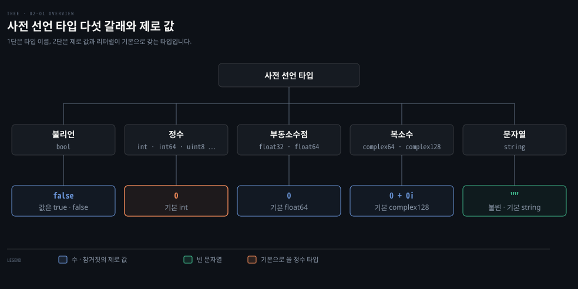

# 타입은 자동으로 섞이지 않고 리터럴만 유연합니다

---

> Learning Go 2장 앞 절반입니다. Go 에 미리 선언된 타입(불리언·숫자·문자열)과 리터럴, 그리고 타입 사이를 오가는 규칙을 다룹니다.

변수 선언과 상수는 [02-02](./02-02.var%20%EC%99%80%20%EC%A7%A7%EC%9D%80%20%EC%84%A0%EC%96%B8%EC%9D%80%20%EC%9D%98%EB%8F%84%EB%A5%BC%20%EB%93%9C%EB%9F%AC%EB%82%B4%EB%8A%94%20%EC%84%A0%ED%83%9D%EC%9E%85%EB%8B%88%EB%8B%A4.md)에서 이어집니다.

## 핵심 요약

> 이 편이 매달린 하나의 생각은 Go 가 변수의 타입을 자동으로 섞지 않는다는 것입니다. 타입이 다른 변수를 함께 쓰려면 직접 변환해야 하고, 타입이 정해지지 않은 리터럴만 쓰이는 자리에 맞춰집니다.

원문이 2장 첫머리에 세운 원칙은 의도가 분명하게 드러나게 쓰라는 것입니다. 이 원칙이 타입 규칙 곳곳에 보입니다. 선언만 한 변수는 제로 값을 갖습니다. `int` 와 `int64` 는 크기가 같아도 섞이지 않습니다. 숫자나 문자열을 참·거짓으로 읽는 일도 없습니다.

실무의 기본값도 원문이 정해 줍니다. 정수는 `int`, 실수는 `float64` 를 쓰고, 돈처럼 정확한 소수가 필요한 값에는 부동소수점을 쓰지 않습니다.


## 학습 목표

> 이 편을 읽고 나면 아래 다섯 가지를 스스로 해낼 수 있습니다.

1. 타입마다 제로 값이 무엇인지 말하고, 제로 값이 있어서 없어지는 버그를 설명할 수 있습니다.
2. 정수·부동소수점·룬·문자열 리터럴을 쓰고, 해석되는 문자열과 raw 문자열을 골라 쓸 수 있습니다.
3. 어느 정수 타입과 어느 부동소수점 타입을 쓸지 원문의 규칙으로 고를 수 있습니다.
4. 타입이 다른 변수를 함께 쓸 때 필요한 변환을 쓰고, Go 에 truthy 값이 없는 이유를 설명할 수 있습니다.
5. 리터럴은 타입이 다른 변수에 대입되는데 변수끼리는 왜 안 되는지 설명할 수 있습니다.

아래는 이 편이 다루는 사전 선언 타입을 다섯 갈래로 나눈 지도입니다. 1단은 갈래와 그 안의 타입 이름, 2단은 값을 주지 않고 선언했을 때의 제로 값과 리터럴이 기본으로 갖는 타입입니다. 불리언과 제로 값은 §1, 숫자 세 갈래는 §3, 문자열은 §4 에서 다룹니다.




## 1. 제로 값 — 선언만 해도 값이 정해집니다

> Go 는 값을 주지 않고 선언한 변수에 타입별 제로 값을 넣습니다. 초기화하지 않은 변수라는 상태가 없어서, C·C++ 에서 나던 종류의 버그가 사라집니다.

C 에서 초기화하지 않은 지역 변수를 읽으면 그 메모리에 남아 있던 아무 값이나 나올 수 있습니다(이 설명은 원문 밖의 것입니다). 원문은 Go 도 대부분의 현대 언어처럼 제로 값을 준다고 적습니다. 명시적인 제로 값이 코드를 더 분명하게 하고 C·C++ 프로그램의 버그 원인 하나를 없앤다고 말합니다. **제로 값(zero value)**은 선언했지만 값을 대입하지 않은 변수에 Go 가 넣어 주는 기본값입니다. 자세한 규칙은 언어 명세에 있습니다.[^spec-zero]

```go
var flag bool // 값을 주지 않았으므로 false
var isAwesome = true
```

타입별 제로 값은 위 지도의 2단에 모았습니다. 불리언은 `false`, 모든 숫자 타입은 `0`, 문자열은 빈 문자열입니다. 복소수는 실수부와 허수부가 둘 다 `0` 입니다.

Java 와 견주면 차이가 분명해집니다. 이 비교는 원문 밖의 것입니다. Java 는 필드에는 `0`·`false`·`null` 같은 기본값을 주지만, 지역 변수는 값을 넣기 전에 읽으면 컴파일 에러를 냅니다. Go 는 지역 변수에도 제로 값을 넣으므로, 선언만 하고 바로 읽어도 됩니다.


## 2. 리터럴 — 숫자·룬·문자열을 코드에 적는 방법

> Go 의 리터럴은 흔히 쓰는 네 종류(정수·부동소수점·룬·문자열)와 드문 다섯째(허수)가 있습니다. 실무에서는 숫자를 10진수로 쓰고, 문자열은 큰따옴표로 쓰는 것이 기본입니다.

**리터럴(literal)**은 코드에 직접 적은 숫자·문자·문자열입니다. 같은 값도 여러 모양으로 적을 수 있어서, 어느 모양을 고르느냐가 읽는 사람의 이해를 가릅니다. 원문은 종류마다 쓸 수 있는 모양을 모두 보인 뒤 실제로 쓸 모양을 좁혀 줍니다.

### 정수 리터럴은 접두사로 진법을 고르고 밑줄로 자릿수를 끊습니다

정수 리터럴은 기본이 10진수입니다. 다른 진법은 접두사로 표시하며, 접두사는 대문자도 소문자도 됩니다.

| 접두사 | 진법 | 예 |
|---|---|---|
| `0b` | 2진수 | `0b1010` |
| `0o` | 8진수 | `0o777` |
| `0x` | 16진수 | `0xFF` |

글자 없이 `0` 만 앞에 붙여도 8진수가 됩니다. 원문은 이 모양이 몹시 헷갈린다며 쓰지 말라고 합니다.

긴 숫자는 중간에 밑줄을 넣어 읽기 쉽게 할 수 있습니다. `1_234` 처럼 10진수를 천 단위로 끊는 식입니다. 밑줄은 값에 아무 영향이 없습니다. 제약은 둘입니다. 숫자의 맨 앞이나 맨 뒤에 둘 수 없고, 밑줄 두 개를 붙여 쓸 수 없습니다. `1_2_3_4` 처럼 자리마다 넣을 수도 있지만 원문은 하지 말라고 합니다. 10진수는 천 단위로, 2·8·16진수는 1·2·4바이트 경계로 끊는 데만 씁니다.

### 부동소수점 리터럴은 소수점과 지수로 적습니다

부동소수점 리터럴은 소수점으로 소수부를 표시합니다. `6.03e23` 처럼 `e` 뒤에 양수나 음수로 지수를 붙일 수 있습니다. `0x` 접두사와 지수 표시 `p` 로 16진수 표기도 됩니다. 원문의 예 `0x12.34p5` 는 10진수 582.5 이고, 이 노트를 쓰면서 출력해 보니 그대로 `582.5` 가 나왔습니다. 정수 리터럴처럼 밑줄도 쓸 수 있습니다.

### 룬 리터럴은 작은따옴표 안의 문자 하나입니다

룬 리터럴은 문자 하나를 나타내고 작은따옴표로 감쌉니다. 여러 언어와 달리 Go 에서는 작은따옴표와 큰따옴표를 바꿔 쓸 수 없습니다. 같은 문자 `a` 를 원문은 다섯 모양으로 적어 보입니다.

| 모양 | 예 |
|---|---|
| 유니코드 문자 그대로 | `'a'` |
| 8비트 8진수 | `'\141'` |
| 8비트 16진수 | `'\x61'` |
| 16비트 16진수 | `'\u0061'` |
| 32비트 유니코드 | `'\U00000061'` |

백슬래시 이스케이프도 여럿 있는데, 원문이 가장 쓸모 있다고 꼽는 것은 줄바꿈 `'\n'`, 탭 `'\t'`, 작은따옴표 `'\''`, 백슬래시 `'\\'` 입니다.

실무 기준은 원문이 분명히 적습니다. 정수와 부동소수점 리터럴은 10진수로 씁니다. 8진수는 드물고 `0o777`(rwxrwxrwx) 같은 POSIX 권한 플래그를 적을 때 주로 씁니다. 16진수와 2진수는 비트 필터나 네트워크·인프라 코드에서 가끔 씁니다. 룬 리터럴의 숫자 이스케이프는 코드를 더 분명하게 만드는 맥락이 아니면 피합니다.

### 문자열 리터럴은 해석되는 것과 raw 두 가지입니다

대부분은 큰따옴표로 만드는 **해석되는 문자열 리터럴(interpreted string literal)**을 씁니다. 안에 든 룬 리터럴(숫자 이스케이프와 백슬래시 이스케이프)을 문자 하나로 해석하기 때문에 이런 이름이 붙었습니다. 룬 이스케이프 가운데 작은따옴표 이스케이프 하나만은 문자열 안에서 쓸 수 없고, 대신 큰따옴표 이스케이프를 씁니다.

해석되는 문자열에 그대로 넣을 수 없는 문자는 셋입니다. 이스케이프하지 않은 백슬래시, 줄바꿈, 큰따옴표입니다. 인사와 이름을 다른 줄에 두고 이름을 따옴표로 감싸려면 이렇게 씁니다.

```go
"Greetings and\n\"Salutations\""
```

백슬래시·큰따옴표·줄바꿈을 넣어야 한다면 **raw 문자열 리터럴**이 편합니다. 백쿼트(`` ` ``)로 감싸고, 백쿼트를 뺀 모든 문자를 담을 수 있습니다. 이스케이프 문자가 없어서 모든 문자가 적힌 그대로 들어갑니다. 위와 같은 문자열을 raw 로 쓰면 줄바꿈을 그대로 넣습니다.

```go
`Greetings and
"Salutations"`
```

리터럴은 타입이 정해지지 않은 상태로 다뤄집니다. 이 성질은 §6 에서 다룹니다. 문맥에 타입을 알려 줄 것이 없으면 리터럴은 기본 타입을 따르며, 그 기본 타입은 §3·§4 에서 타입마다 적습니다.


## 3. 숫자 타입 — 정수는 int, 실수는 float64 가 기본입니다

> Go 에는 숫자 타입이 열두 개(와 특별한 이름 몇 개) 있고 세 갈래로 나뉩니다. 대부분의 코드는 정수에 `int`, 실수에 `float64` 만 쓰면 됩니다.

JavaScript 처럼 숫자 타입이 하나뿐인 언어에서 오면 열두 개는 많아 보입니다. 원문도 어떤 타입은 자주 쓰이고 어떤 타입은 드물다고 인정합니다. 그래서 이 절은 타입을 모두 소개한 뒤 무엇을 고를지 규칙으로 좁힙니다. 순서는 정수, 부동소수점, 그리고 거의 쓰지 않는 복소수입니다.

### 정수 타입은 1~8바이트 크기에 부호 있는 것과 없는 것이 있습니다

원문 표 2-1 을 옮깁니다. 이 노트를 쓰면서 `math` 패키지의 상수로 출력해 보니 범위가 모두 같았습니다. 모든 정수 타입의 제로 값은 `0` 입니다.

| 타입 | 범위 |
|---|---|
| `int8` | -128 ~ 127 |
| `int16` | -32768 ~ 32767 |
| `int32` | -2147483648 ~ 2147483647 |
| `int64` | -9223372036854775808 ~ 9223372036854775807 |
| `uint8` | 0 ~ 255 |
| `uint16` | 0 ~ 65535 |
| `uint32` | 0 ~ 4294967295 |
| `uint64` | 0 ~ 18446744073709551615 |

### byte·int·uint 는 특별한 이름입니다

정수에는 특별한 이름이 몇 개 있습니다. `byte` 는 `uint8` 의 별칭입니다. 둘 사이에는 대입·비교·연산이 모두 되지만, Go 코드에서 `uint8` 은 거의 보이지 않고 `byte` 라고 씁니다.

`int` 는 CPU 에 따라 크기가 달라집니다. 32비트 CPU 에서는 `int32` 같은 32비트 부호 있는 정수이고, 대부분의 64비트 CPU 에서는 `int64` 같은 64비트입니다. 이 노트를 쓴 기계(`darwin/arm64`)의 `strconv.IntSize` 는 `64` 였습니다. 원문은 `amd64p32`·`mips64p32`·`mips64p32le` 처럼 64비트인데 `int` 를 32비트로 쓰는 드문 아키텍처도 적어 둡니다.

`int` 의 크기가 플랫폼마다 다르기 때문에, `int` 와 `int32`·`int64` 사이의 대입·비교·연산은 변환 없이 하면 컴파일 에러입니다. `int` 가 64비트인 기계에서도 마찬가지입니다.

```bash
# go1.25.1 에서 int 와 int64 를 더한 출력 (2026-09-27)
invalid operation: a + b (mismatched types int and int64)
```

정수 리터럴의 기본 타입은 `int` 입니다. `uint` 는 `int` 와 같은 규칙을 따르되 부호가 없습니다. 남은 두 이름 중 `rune` 은 §4 에서, `uintptr` 는 16장에서 다룹니다.

### 어느 정수를 쓸지는 세 규칙으로 정합니다

타입이 많으면 언제 무엇을 쓸지 헷갈립니다. 원문은 세 규칙을 줍니다.

1. 정수의 크기나 부호가 정해진 바이너리 파일 형식이나 네트워크 프로토콜을 다룬다면, 거기에 맞는 정수 타입을 씁니다.
2. 어떤 정수 타입으로도 동작해야 하는 라이브러리 함수를 쓴다면, 제네릭 타입 파라미터로 받습니다. 함수는 5장, 제네릭은 8장에서 다룹니다.
3. 그 밖에는 모두 `int` 를 씁니다.

제네릭이 없던 시절의 흔적도 원문이 짚어 둡니다. 같은 일을 하는데 하나는 `int64`, 다른 하나는 `uint64` 로 받는 함수 쌍이 옛 코드에 있습니다. 제네릭 없이 타입마다 알고리즘을 따로 쓰려면 이름을 조금씩 바꾼 함수가 필요했습니다. `int64` 와 `uint64` 로 한 번씩만 쓰고 나머지 타입은 호출하는 쪽이 변환하게 한 것입니다. 표준 라이브러리 `strconv` 패키지의 `FormatInt`·`FormatUint` 가 그 예입니다.

### 정수 나눗셈은 0 쪽으로 버리고 0 으로 나누면 panic 이 납니다

정수는 `+`·`-`·`*`·`/` 와 나머지 `%` 를 지원합니다. 정수를 정수로 나누면 결과도 정수입니다. 실수 결과가 필요하면 먼저 부동소수점으로 변환해야 합니다. 원문은 나눗셈이 0 방향으로 버림을 한다고 적고 자세한 규칙은 언어 명세로 넘깁니다.[^spec-arith] 이 노트를 쓰면서 확인한 값은 아래와 같습니다.

```bash
# go1.25.1 에서 7/2, -7/2, 7%3, -7%3 을 출력 (2026-09-27)
3 -3 1 -1
```

`-7/2` 가 `-4` 가 아니라 `-3` 인 것이 0 방향 버림입니다. 나머지의 부호는 나누어지는 수를 따라가서 `-7%3` 은 `-1` 입니다.

정수를 0 으로 나누면 panic 이 납니다. panic 은 뒤의 "panic and recover" 절에서 다룹니다. 원문 밖의 확인을 하나 덧붙입니다. 두 쪽이 모두 상수인 `10 / 0` 은 컴파일러가 `invalid operation: division by zero` 로 먼저 막았습니다. 실행 중에 `panic: runtime error: integer divide by zero` 가 난 것은 변수를 0 으로 나눈 경우뿐이었습니다.

연산자는 `=` 와 합쳐 변수를 바로 고칠 수 있습니다(`+=`·`-=`·`*=`·`/=`·`%=`). 아래 코드가 끝나면 `x` 는 20 입니다.

```go
var x int = 10
x *= 2
```

비교는 `==`·`!=`·`>`·`>=`·`<`·`<=` 입니다. 비트 연산도 있습니다. 시프트 `<<`·`>>`, 비트 AND `&`, OR `|`, XOR `^`, 그리고 AND NOT `&^` 입니다. `&^` 는 Java 에는 없는 연산자입니다(원문 밖의 비교). 비트 연산자도 모두 `=` 와 합칠 수 있습니다(`&=`·`|=`·`^=`·`&^=`·`<<=`·`>>=`).

### 부동소수점은 float64 를 쓰되 정확한 소수가 필요한 곳에는 쓰지 않습니다

Go 의 부동소수점 타입은 둘입니다. 원문 표 2-2 의 값을 옮기고, 이 노트를 쓰면서 `math.MaxFloat32` 등으로 출력해 앞자리가 같은 것을 확인했습니다.

| 타입 | 가장 큰 절댓값 | 0 이 아닌 가장 작은 절댓값 |
|---|---|---|
| `float32` | 3.40282346638528859811704183484516925440e+38 | 1.401298464324817070923729583289e-45 |
| `float64` | 1.797693134862315708145274237317043567981e+308 | 4.940656458412465441765687928682e-324 |

제로 값은 정수처럼 `0` 입니다. Go 는 IEEE 754 명세를 따르므로 범위는 넓고 정밀도는 제한됩니다. 원문은 IEEE 754 의 규칙을 책 범위 밖으로 두고 The Floating Point Guide 를 권합니다.

고르는 규칙은 단순합니다. 기존 형식과 호환해야 하는 경우가 아니면 `float64` 를 씁니다. 부동소수점 리터럴의 기본 타입이 `float64` 라서 가장 단순하고, `float32` 는 10진수로 6~7자리 정밀도밖에 없어 정확도 문제도 줄여 줍니다. 메모리 크기 차이는 프로파일러로 문제라는 것을 확인하기 전에는 신경 쓰지 않습니다. 테스트와 프로파일링은 15장에서 다룹니다.

더 큰 물음은 부동소수점을 써야 하는가입니다. 원문의 답은 많은 경우 쓰지 말라는 것입니다. 범위는 넓지만 그 안의 모든 값을 저장하지 못하고 가장 가까운 근삿값을 저장합니다. 그래서 부정확한 값이 괜찮거나 부동소수점 규칙을 잘 아는 경우, 곧 그래픽·통계·과학 계산에만 씁니다. 부동소수점은 10진 소수를 정확히 표현하지 못하므로 돈처럼 정확한 소수 표현이 필요한 값에는 절대 쓰지 않습니다. 원문은 정확한 소수를 다루는 서드파티 모듈을 뒤의 "Importing Third-Party Code" 절에서 소개합니다. Java 에서 금액에 `BigDecimal` 을 쓰는 것과 같은 판단입니다(원문 밖의 비교).

부동소수점에는 `%` 를 뺀 산술·비교 연산자를 모두 쓸 수 있습니다. 이 노트를 쓰면서 `%` 를 써 보니 `operator % not defined on a (variable of type float64)` 로 컴파일되지 않았습니다. 0 으로 나눈 결과는 정수와 다릅니다.

- 0 이 아닌 값을 0 으로 나누면 부호에 따라 `+Inf` 나 `-Inf` 입니다.
- 0 을 0 으로 나누면 `NaN`(Not a Number)입니다.

이 노트를 쓰면서 `1/z`, `-1/z`, `z/z`(`z` 는 `float64` 0)를 출력하니 `+Inf -Inf NaN` 이 나왔습니다.

`==` 와 `!=` 로 부동소수점을 비교할 수는 있지만 원문은 하지 말라고 합니다. 부정확한 표현 때문에 같아야 할 두 값이 다를 수 있습니다. 대신 허용할 최대 차이(epsilon 이라고도 합니다)를 정해 두 값의 차이가 그보다 작은지 봅니다. epsilon 은 필요한 정확도에 달려 있어서 원문도 간단한 규칙을 주지 못한다고 말하고, The Floating Point Guide 의 "Comparison" 페이지를 권합니다.

### 복소수는 거의 쓸 일이 없습니다

원문 소제목부터 "아마 쓰지 않을 것" 이라고 적는 타입입니다. 복소수가 무엇인지 모른다면 이 기능의 대상 독자가 아니니 건너뛰어도 된다고 합니다. Go 는 복소수를 언어 차원에서 지원하고, 타입은 둘입니다. `complex64` 는 실수부와 허수부를 `float32` 로, `complex128` 은 `float64` 로 담습니다. 둘 다 내장 함수 `complex` 로 만듭니다.

```go
var complexNum = complex(20.3, 10.2)
```

`complex` 가 돌려주는 타입은 인자에 따라 정해집니다.

- 두 인자가 모두 타입 없는 상수나 리터럴이면 타입 없는 복소수 리터럴이 되고, 기본 타입은 `complex128` 입니다.
- 두 인자가 모두 `float32` 이면 `complex64` 입니다.
- 하나가 `float32` 이고 다른 하나가 `float32` 에 들어가는 타입 없는 상수나 리터럴이면 `complex64` 입니다.
- 나머지는 모두 `complex128` 입니다.

부동소수점 산술 연산자는 복소수에 모두 쓸 수 있습니다. `==`·`!=` 로 비교할 수 있지만 정밀도 한계가 같으므로 epsilon 기법을 쓰는 편이 낫습니다. 실수부와 허수부는 내장 함수 `real`·`imag` 로 꺼내고, `math/cmplx` 패키지에 `complex128` 을 다루는 함수가 더 있습니다. 원문 예제 2-1 입니다.

```go
func main() {
	x := complex(2.5, 3.1)
	y := complex(10.2, 2)
	fmt.Println(x + y)
	fmt.Println(x - y)
	fmt.Println(x * y)
	fmt.Println(x / y)
	fmt.Println(real(x))
	fmt.Println(imag(x))
	fmt.Println(cmplx.Abs(x))
}
```

```bash
# 원문 출력
(12.7+5.1i)
(-7.699999999999999+1.1i)
(19.3+36.62i)
(0.2934098482043688+0.24639022584228065i)
2.5
3.1
3.982461550347975
```

원문은 둘째 줄의 `-7.699999999999999` 에서 부동소수점의 부정확함이 보인다고 짚습니다. 이 노트를 `go1.25.1 darwin/arm64` 에서 돌렸을 때는 여섯 줄이 같고 마지막 줄만 `3.982461550347976` 으로 끝자리가 달랐습니다. Go 버전 차이인지 CPU 차이인지는 이 실행 하나로 가릴 수 없습니다. 부동소수점 결과를 끝자리까지 비교하면 안 된다는 원문의 경고를 그대로 보여 주는 예이기도 합니다.

2절에서 미뤄 둔 다섯째 리터럴이 여기서 나옵니다. **허수 리터럴(imaginary literal)**은 복소수의 허수부를 나타내며, 부동소수점 리터럴 끝에 `i` 를 붙인 모양입니다.

원문은 복소수가 있는데도 Go 가 수치 계산 언어로 인기를 얻지 못한 이유로, 행렬 같은 기능이 언어에 없어 라이브러리가 slice 의 slice 같은 비효율적인 대체물을 써야 한다는 점을 듭니다. Go 에 복소수가 들어간 이유는 Go(와 Unix)를 만든 사람 가운데 하나인 Ken Thompson 이 흥미롭다고 생각했기 때문이라고 합니다. 앞으로의 Go 에서 복소수를 빼자는 논의도 있었지만 그냥 무시하는 편이 쉽다는 것이 원문의 말입니다. 그래도 Go 로 수치 계산을 해야 한다면 서드파티 Gonum 패키지가 선형대수·행렬·적분·통계 라이브러리를 줍니다. 다만 원문은 다른 언어를 먼저 고려하라고 합니다.


## 4. 문자열과 룬 — 문자열은 바꿀 수 없고 문자 하나는 rune 입니다

> 문자열은 내장 타입이고 불변입니다. 문자 하나를 담을 때는 `int32` 가 아니라 `rune` 이라는 이름을 씁니다.

문자열은 대부분의 현대 언어처럼 Go 에서도 내장 타입입니다. 제로 값은 빈 문자열입니다. 유니코드를 지원하므로 §2 에서 본 것처럼 어떤 유니코드 문자든 문자열에 넣을 수 있습니다. 정수나 부동소수점처럼 `==`·`!=` 로 같음을, `>`·`>=`·`<`·`<=` 로 순서를 비교합니다. 이어 붙일 때는 `+` 를 씁니다.

Go 의 문자열은 불변입니다. 문자열 변수에 다른 값을 다시 대입할 수는 있어도, 대입된 문자열 자체를 바꿀 수는 없습니다. Java 의 `String` 과 같은 성질입니다(원문 밖의 비교).

코드 포인트 하나를 나타내는 타입이 `rune` 입니다. `byte` 가 `uint8` 의 별칭이듯 `rune` 은 `int32` 의 별칭입니다. 룬 리터럴의 기본 타입은 `rune`, 문자열 리터럴의 기본 타입은 `string` 입니다. 이 노트를 쓰면서 `fmt.Printf("%T", 'a')` 로 룬 리터럴의 타입을 찍어 보니 `int32` 가 나왔습니다. 별칭은 새 타입이 아니라 같은 타입의 다른 이름이기 때문입니다.

컴파일러에게 같아도 쓰는 이름은 의도를 드러내야 합니다. 원문은 문자를 가리킬 때 `int32` 가 아니라 `rune` 을 쓰라고 합니다.

```go
var myFirstInitial rune = 'J' // good - the type name matches the usage
var myLastInitial int32 = 'B' // bad - legal but confusing
```

문자열의 구현, 바이트·룬과의 관계, 고급 기능과 함정은 3장에서 다룹니다.


## 5. 명시적 타입 변환 — 자동 승격이 없으니 섞으려면 직접 바꿉니다

> Go 는 타입이 다른 변수 사이의 자동 형 변환을 허용하지 않습니다. 크기만 다른 정수끼리도 같은 타입으로 변환해야 함께 쓸 수 있고, 다른 타입을 불리언으로 읽는 일도 없습니다.

숫자 타입이 여럿인 언어는 대부분 필요할 때 한 타입을 다른 타입으로 자동으로 바꿉니다. 이를 **자동 형 승격(automatic type promotion)**이라 합니다. 편해 보이지만, 원문은 올바른 변환 규칙이 복잡해지고 예상하지 못한 결과를 낼 수 있다고 지적합니다. Java 도 `int` 와 `double` 을 더하면 `int` 가 `double` 로 자동으로 넓어집니다(원문 밖의 예).

Go 는 의도의 분명함과 가독성을 중시하는 언어라서 변수 사이의 자동 형 승격을 허용하지 않습니다. 타입이 맞지 않으면 변환을 써야 하고, 크기만 다른 정수나 부동소수점도 같은 타입으로 바꿔야 함께 쓸 수 있습니다. 변환 규칙을 외우지 않아도 원하는 타입이 무엇인지 코드에 드러납니다. 원문 예제 2-2 입니다.

```go
var x int = 10
var y float64 = 30.2
var sum1 float64 = float64(x) + y
var sum2 int = x + int(y)
fmt.Println(sum1, sum2)
```

`x` 는 `int`, `y` 는 `float64` 라서 더하려면 한쪽을 바꿔야 합니다. `sum1` 은 `x` 를 `float64` 로, `sum2` 는 `y` 를 `int` 로 변환했습니다. 원문은 `40.2 40` 이 찍힌다고 적고, 이 노트를 쓰면서 돌린 결과도 같았습니다. `int(y)` 가 30.2 의 소수부를 버려 `sum2` 가 40 이 된 것입니다.

크기가 다른 정수끼리도 같습니다(원문 예제 2-3).

```go
var x int = 10
var b byte = 100
var sum3 int = x + int(b)
var sum4 byte = byte(x) + b
fmt.Println(sum3, sum4)
```

원문은 이 예제의 출력을 적지 않습니다. 이 노트를 쓰면서 돌려 보니 `110 110` 이었습니다.

### Go 에는 truthy 값이 없습니다

엄격한 타입 규칙은 불리언에도 이어집니다. 모든 변환이 명시적이므로 다른 타입을 불리언처럼 쓸 수 없습니다. 많은 언어가 0 이 아닌 수나 빈 문자열이 아닌 문자열을 참으로 읽습니다. 원문 말대로 이 "truthy" 규칙은 언어마다 달라 헷갈립니다. Go 는 truthiness 를 허용하지 않습니다. 어떤 타입도 불리언으로 변환할 수 없고, 암묵적으로든 명시적으로든 마찬가지입니다.

다른 타입에서 불리언을 얻으려면 비교 연산자(`==`·`!=`·`>`·`<`·`<=`·`>=`)를 씁니다. 변수 `x` 가 0 인지는 `x == 0`, 문자열 `s` 가 비었는지는 `s == ""` 로 봅니다. 이 노트를 쓰면서 `if x {` 로 정수를 조건에 넣어 보니 `non-boolean condition in if statement` 로 컴파일되지 않았습니다.

원문은 이 절을 짧은 NOTE 로 정리합니다. 타입 변환은 Go 가 약간의 장황함을 받아들이고 큰 단순함과 명확함을 얻는 자리이며, 관용적인 Go 는 간결함보다 이해하기 쉬움을 중시합니다.


## 6. 리터럴은 타입이 없습니다 — 변수와 달리 리터럴은 쓰이는 자리에 맞춰집니다

> 정수 변수와 부동소수점 변수는 섞을 수 없지만, 정수 리터럴은 부동소수점 변수에 대입됩니다. 리터럴은 타입이 정해지지 않은 채 쓰이는 자리의 타입을 따르기 때문입니다.

§5 를 읽고 나면 이상한 점이 하나 보입니다. 타입이 다른 정수 변수끼리는 더할 수 없는데, 아래 코드는 컴파일됩니다.

```go
var x float64 = 10
var y float64 = 200.3 * 5
```

원문의 설명은 Go 의 리터럴이 타입을 갖지 않는다는 것입니다. 개발자가 타입을 정하기 전까지 타입을 강제하지 않는 것이 실용적이라는 판단입니다. 그래서 리터럴은 호환되는 타입의 변수라면 어디에나 쓸 수 있습니다. 7장에서 보듯 사전 선언 타입을 바탕으로 만든 사용자 정의 타입에도 쓸 수 있습니다.

타입이 없다고 무엇이든 되는 것은 아닙니다. 아래는 모두 컴파일 에러입니다.

- 문자열 리터럴을 숫자 타입 변수에, 숫자 리터럴을 문자열 변수에 대입하기
- 부동소수점 리터럴을 `int` 에 대입하기
- 변수가 담을 수 없을 만큼 큰 리터럴을 대입하기

크기 제한은 이렇습니다. 어떤 정수 타입보다 큰 숫자 리터럴도 쓸 수는 있지만, 변수에 대입할 때 넘치면 컴파일 에러입니다. 원문의 예는 `byte` 변수에 `1000` 을 대입하는 것입니다. 이 노트를 쓰면서 확인한 메시지는 아래와 같습니다.

```bash
# go1.25.1 에서 var b byte = 1000 을 빌드한 출력 (2026-09-27)
cannot use 1000 (untyped int constant) as byte value in variable declaration (overflows)
```

메시지 안의 `untyped int constant` 가 이 절의 요점을 그대로 말합니다. `1000` 은 타입 없는 정수 상수로 다뤄지다가, `byte` 자리에 맞춰지는 순간 넘친 것입니다. 타입 없는 상수는 [02-02](./02-02.var%20%EC%99%80%20%EC%A7%A7%EC%9D%80%20%EC%84%A0%EC%96%B8%EC%9D%80%20%EC%9D%98%EB%8F%84%EB%A5%BC%20%EB%93%9C%EB%9F%AC%EB%82%B4%EB%8A%94%20%EC%84%A0%ED%83%9D%EC%9E%85%EB%8B%88%EB%8B%A4.md) §3 에서 이어집니다.


## 핵심 개념 체크리스트

목표 번호 순서대로 짝지었습니다.

- [ ] (목표 1) `bool`·숫자·`string` 의 제로 값을 대고, Java 지역 변수와 다른 점을 말할 수 있습니까?
- [ ] (목표 2) 2·8·16진수 정수 리터럴의 접두사와, 밑줄을 넣을 수 없는 자리 두 곳을 말할 수 있습니까?
- [ ] (목표 2) 해석되는 문자열과 raw 문자열 중 무엇을 써야 백슬래시·큰따옴표·줄바꿈을 그대로 넣을 수 있습니까?
- [ ] (목표 3) 어느 정수 타입을 쓸지 정하는 세 규칙과, 금액에 부동소수점을 쓰지 않는 이유를 말할 수 있습니까?
- [ ] (목표 3) 정수를 0 으로 나눌 때와 부동소수점을 0 으로 나눌 때 결과가 어떻게 다릅니까?
- [ ] (목표 4) `int` 와 `int64` 를 더하는 코드가 왜 컴파일되지 않고, 어떻게 고치는지 말할 수 있습니까?
- [ ] (목표 4) 정수 `x` 가 0 이 아닌지 `if` 로 확인하는 올바른 Go 코드를 쓸 수 있습니까?
- [ ] (목표 5) `var x float64 = 10` 은 되는데 `int` 변수를 `float64` 변수에 대입하면 안 되는 이유를 설명할 수 있습니까?


## 관련 문서

- [02-02 var 와 짧은 선언은 의도를 드러내는 선택입니다](./02-02.var%20%EC%99%80%20%EC%A7%A7%EC%9D%80%20%EC%84%A0%EC%96%B8%EC%9D%80%20%EC%9D%98%EB%8F%84%EB%A5%BC%20%EB%93%9C%EB%9F%AC%EB%82%B4%EB%8A%94%20%EC%84%A0%ED%83%9D%EC%9E%85%EB%8B%88%EB%8B%A4.md) — 2장 뒤 절반. 변수 선언·상수·이름 짓기
- [01-01 go 명령 하나로 만들고 다듬고 검사합니다](./01-01.go%20%EB%AA%85%EB%A0%B9%20%ED%95%98%EB%82%98%EB%A1%9C%20%EB%A7%8C%EB%93%A4%EA%B3%A0%20%EB%8B%A4%EB%93%AC%EA%B3%A0%20%EA%B2%80%EC%82%AC%ED%95%A9%EB%8B%88%EB%8B%A4.md) — 1장. 예제를 돌리는 환경
- [Learning Go 2판 — 정독 인덱스](./README.md) — 16장 전체 지도


## 참고 자료

- 원본: 《Learning Go, 2nd Edition》 (Jon Bodner, O'Reilly)
- 다룬 범위: Chapter 2 도입부터 "Literals Are Untyped" 까지
- [The Go Programming Language Specification — The zero value](https://go.dev/ref/spec#The_zero_value) — 원문이 제로 값의 자세한 규칙으로 가리키는 곳
- [The Go Programming Language Specification — Arithmetic operators](https://go.dev/ref/spec#Arithmetic_operators) — 원문이 정수 나눗셈 규칙으로 가리키는 곳
- [The Floating Point Guide](https://floating-point-gui.de/) — 원문이 IEEE 754 와 부동소수점 비교에 권하는 자료

[^spec-zero]: The Go Programming Language Specification, The zero value — 명시적으로 초기화하지 않은 변수에 타입별 제로 값이 들어간다는 규칙. <https://go.dev/ref/spec#The_zero_value> (2026-09-27 조회)

[^spec-arith]: The Go Programming Language Specification, Arithmetic operators — 정수 몫은 0 방향으로 버림(truncated division)을 한다는 규칙. <https://go.dev/ref/spec#Arithmetic_operators> (2026-09-27 조회)
