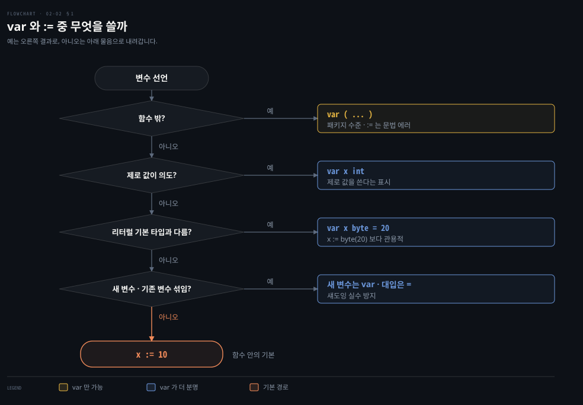

# var 와 짧은 선언은 의도를 드러내는 선택입니다

---

> Learning Go 2장 뒤 절반입니다. 변수를 선언하는 여러 모양, 상수, 쓰지 않는 변수에 대한 규칙, 이름 짓는 관례를 다루고 장 끝 연습 문제를 풉니다.

타입과 리터럴은 [02-01](./02-01.%ED%83%80%EC%9E%85%EC%9D%80%20%EC%9E%90%EB%8F%99%EC%9C%BC%EB%A1%9C%20%EC%84%9E%EC%9D%B4%EC%A7%80%20%EC%95%8A%EA%B3%A0%20%EB%A6%AC%ED%84%B0%EB%9F%B4%EB%A7%8C%20%EC%9C%A0%EC%97%B0%ED%95%A9%EB%8B%88%EB%8B%A4.md)에서 다뤘습니다.

## 핵심 요약

> 이 편이 매달린 하나의 생각은 Go 에서 선언의 모양 자체가 그 변수를 어떻게 쓸지 알리는 신호라는 것입니다.

작은 언어인데도 Go 에는 변수를 선언하는 방법이 여럿입니다. 원문은 그 이유를 각 모양이 변수의 쓰임을 전달하기 때문이라고 설명합니다. 함수 안에서는 `:=` 가 기본이고, 제로 값을 의도하거나 기본 타입이 아닌 타입을 원할 때는 `var` 로 그 의도를 드러냅니다.

상수는 다른 언어의 불변 변수가 아니라 리터럴에 붙인 이름입니다. 컴파일 시점에 알 수 있는 값만 담을 수 있습니다. Go 에는 변수를 불변으로 선언하는 방법이 따로 없습니다. 읽지 않는 지역 변수는 컴파일 에러이고, 이름은 짧은 camelCase 가 관례입니다.


## 학습 목표

> 이 편을 읽고 나면 아래 다섯 가지를 스스로 해낼 수 있습니다.

1. 같은 변수를 `var` 의 여러 모양과 `:=` 로 선언하고, 상황마다 어느 모양이 의도를 가장 잘 드러내는지 고를 수 있습니다.
2. `:=` 가 기존 변수에도 대입한다는 규칙과, 그 규칙 때문에 `var` 를 쓰는 편이 나은 경우를 설명할 수 있습니다.
3. `const` 에 담을 수 있는 값과 없는 값을 가르고, Go 상수가 Java 의 `final` 변수와 어떻게 다른지 설명할 수 있습니다.
4. 타입 없는 상수와 타입 있는 상수 중 무엇을 쓸지 고를 수 있습니다.
5. 읽지 않는 변수·상수에 대한 컴파일러 규칙과 Go 의 이름 짓기 관례를 적용할 수 있습니다.


## 1. var 와 := — 선언 모양이 변수의 쓰임을 알립니다

> 함수 안에서는 `:=` 가 가장 흔한 선언입니다. 제로 값을 의도할 때, 리터럴의 기본 타입이 원하는 타입이 아닐 때, 새 변수와 기존 변수가 섞일 때는 `var` 가 더 분명합니다.

같은 변수를 여러 모양으로 선언할 수 있으면 무엇을 써야 할지 망설여집니다. 원문의 답은 늘 같습니다. 의도가 가장 분명하게 드러나는 모양을 고르라는 것입니다. 그러려면 먼저 모양마다 무엇을 말하는지 알아야 하니, 긴 모양부터 차례로 봅니다.

### var 는 타입과 값을 얼마나 적느냐에 따라 모양이 바뀝니다

가장 긴 모양은 `var` 키워드, 명시한 타입, 대입을 모두 씁니다.

```go
var x int = 10
```

`=` 오른쪽 값의 타입이 원하는 타입과 같으면 왼쪽 타입을 뺄 수 있습니다. 정수 리터럴의 기본 타입이 `int` 이므로 아래 `x` 도 `int` 입니다.

```go
var x = 10
```

반대로 제로 값으로 두려면 타입을 남기고 `=` 쪽을 뺍니다.

```go
var x int
```

여러 변수를 한 번에 선언할 수도 있습니다.

```go
var x, y int = 10, 20   // 같은 타입, 값 있음
var x, y int            // 같은 타입, 제로 값
var x, y = 10, "hello"  // 다른 타입
```

여러 변수를 한꺼번에 선언할 때는 괄호로 묶은 선언 목록을 쓸 수 있습니다. PDF 추출본에서 이 예제의 줄이 흐트러져 있어, 원문 설명대로 복원한 모양을 `go1.25.1` 에서 컴파일해 확인했습니다. 출력은 `0 20 30 40 hello` 뒤에 `f`·`g` 의 빈 문자열 둘이 이어졌습니다.

```go
var (
	x    int
	y        = 20
	z    int = 30
	d, e     = 40, "hello"
	f, g string
)
```

### := 는 함수 안에서만 쓰고 기존 변수에도 대입합니다

함수 안에서는 타입 추론을 쓰는 `var` 선언을 `:=` 로 바꿀 수 있습니다. 이것을 짧은 변수 선언이라 합니다. 아래 두 줄은 똑같이 `x` 를 `int` 10 으로 선언합니다.

```go
var x = 10
x := 10
```

여러 변수도 됩니다. 아래 두 줄은 모두 `x` 에 10, `y` 에 `"hello"` 를 넣습니다.

```go
var x, y = 10, "hello"
x, y := 10, "hello"
```

`:=` 에는 `var` 로는 못 하는 일이 하나 있습니다. 왼쪽에 새 변수가 하나라도 있으면 나머지는 이미 있는 변수여도 됩니다. 아래에서 둘째 줄은 `y` 를 새로 만들고 기존 `x` 에는 30 을 대입합니다.

```go
x := 10
x, y := 30, "hello"
```

새 변수가 하나도 없으면 안 됩니다. 이 노트를 쓰면서 `x := 10` 뒤에 `x := 20` 을 쓰니 `no new variables on left side of :=` 로 컴파일되지 않았습니다.

`:=` 의 제약은 하나입니다. 함수 밖, 곧 패키지 수준에서는 쓸 수 없어서 `var` 를 써야 합니다. 이 노트를 쓰면서 함수 밖에 `x := 10` 을 두니 `syntax error: non-declaration statement outside function body` 가 났습니다.

### 어느 모양을 쓸지는 네 물음으로 가립니다

원문의 권고를 순서대로 모으면 아래 흐름이 됩니다. 함수 밖이면 `var` 만 됩니다. 원문은 여러 패키지 수준 변수를 선언하는 드문 경우에 선언 목록을 쓰라고 합니다. 함수 안에서는 `:=` 가 가장 흔하지만, 원문은 `:=` 를 피해야 할 경우 셋을 듭니다.



첫째 물음은 함수 밖인지입니다. 나머지 셋이 함수 안에서 `:=` 를 피할 경우입니다.

- 제로 값으로 초기화할 때는 `var x int` 로 씁니다. 제로 값이 의도라는 것이 드러납니다.
- 타입 없는 상수나 리터럴을 대입하는데 그 기본 타입이 원하는 타입이 아니면 타입을 적은 긴 `var` 모양을 씁니다. `x := byte(20)` 처럼 변환과 `:=` 를 함께 써도 문법에는 맞지만, 관용적인 모양은 `var x byte = 20` 입니다.
- `:=` 는 새 변수와 기존 변수 모두에 대입하므로, 기존 변수를 다시 쓰는 줄 알았는데 새 변수가 만들어지는 경우가 있습니다. 이 문제는 "Shadowing Variables" 절(4장)에서 다룹니다. 이럴 때는 새 변수를 모두 `var` 로 선언해 무엇이 새것인지 드러내고, 대입은 `=` 로 합니다.

한 줄에 여러 변수를 선언하는 모양은 함수가 돌려주는 여러 값을 받을 때나 comma ok 관용구에만 쓰라고 원문은 덧붙입니다. 원문은 5장과 "The comma ok Idiom" 절로 넘기며, 이 절은 3장에 있습니다.

### 값이 바뀌는 패키지 수준 변수는 피합니다

함수 밖, 곧 패키지 블록에 변수를 선언하는 일은 드물어야 합니다. 원문은 값이 바뀌는 패키지 수준 변수를 나쁜 생각이라고 단언합니다. 함수 밖에 있는 변수는 누가 언제 바꾸는지 추적하기 어려워, 데이터가 프로그램을 어떻게 흐르는지 이해하기 힘들어지고 미묘한 버그로 이어집니다. 일반 규칙은 패키지 블록에는 사실상 불변인 변수만 두라는 것입니다. Java 로 치면 `static` 필드를 바꿔 가며 쓰는 코드를 피하는 것과 같은 이유입니다(원문 밖의 비교).

그렇다면 Go 에 값을 불변으로 만드는 방법이 있을까요? 원문의 답은 있긴 하지만 다른 언어와 조금 다르다는 것이고, 그것이 다음 절의 `const` 입니다.


## 2. const — 상수는 리터럴에 붙인 이름입니다

> Go 의 `const` 는 컴파일 시점에 알 수 있는 값에 이름을 붙이는 기능입니다. 실행 중에 계산한 값을 불변으로 만드는 방법은 Go 에 없습니다.

다른 언어처럼 Go 도 `const` 키워드로 값을 불변으로 선언합니다. 처음 보면 다른 언어와 똑같아 보입니다. 원문 예제 2-4 입니다.

```go
package main

import "fmt"

const x int64 = 10

const (
	idKey   = "id"
	nameKey = "name"
)

const z = 20 * 10

func main() {
	const y = "hello"

	fmt.Println(x)
	fmt.Println(y)

	x = x + 1 // this will not compile!
	y = "bye" // this will not compile!

	fmt.Println(x)
	fmt.Println(y)
}
```

상수는 패키지 수준에도 함수 안에도 선언할 수 있습니다. `var` 처럼 관련된 상수는 괄호로 묶어 선언할 수 있고, 원문은 그렇게 하라고 권합니다. 상수에 대입하는 두 줄 때문에 컴파일이 실패합니다.

```bash
# 원문 출력
./prog.go:20:2: cannot assign to x (constant 10 of type int64)
./prog.go:21:2: cannot assign to y (untyped string constant "hello")
```

```bash
# go1.25.1 에서 같은 대입을 빌드한 출력 (2026-09-27)
cannot assign to x (neither addressable nor a map index expression)
cannot assign to y (neither addressable nor a map index expression)
```

지금 버전의 메시지는 상수라는 말 대신 대입할 수 없는 자리라는 일반 설명을 냅니다. 원문 메시지가 오류의 이유를 더 직접 알려 주므로, 지금 버전에서 이 메시지를 보면 대입 대상이 상수가 아닌지부터 확인합니다. 줄 번호는 원문의 Playground 코드와 이 노트의 파일이 달라서 뺐습니다.

### 상수에 담을 수 있는 것은 컴파일 시점에 정해지는 값뿐입니다

원문은 Go 의 `const` 가 꽤 제한적이라고 경고합니다. 상수는 리터럴에 이름을 붙이는 방법이라, 컴파일러가 컴파일 시점에 알아낼 수 있는 값만 담습니다. 담을 수 있는 것은 이렇습니다.

- 숫자 리터럴
- `true` 와 `false`
- 문자열
- 룬
- 내장 함수 `complex`·`real`·`imag`·`len`·`cap` 이 돌려주는 값
- 위의 값들과 연산자로 이루어진 식

`len`·`cap` 은 3장에서, 상수와 함께 쓰는 `iota` 는 7장에서 다룹니다.

실행 중에 계산한 값은 상수로 만들 수 없습니다. 원문의 예와 에러 메시지는 `go1.25.1` 에서도 그대로였습니다.

```go
x := 5
y := 10
const z = x + y // this won't compile!
```

```bash
x + y (value of type int) is not constant
```

여기서 Java 와의 차이가 드러납니다. 이 비교는 원문 밖의 것입니다. Java 의 `final` 은 실행 중에 계산한 값도 한 번 대입한 뒤에는 바꾸지 못하게 합니다. Go 에는 이런 불변 변수가 없습니다. 원문은 3장에서 보듯 불변 배열·slice·map·struct 도 없고, struct 필드를 불변으로 선언할 방법도 없다고 적습니다.

원문은 이것이 들리는 만큼 불편하지는 않다고 말합니다. 함수 안에서는 변수가 바뀌는지 눈으로 분명히 보이므로 불변성이 덜 중요합니다. 함수에 넘긴 인자를 Go 가 어떻게 보호하는지는 5장의 "Go Is Call by Value" 에서 다룹니다.


## 3. 타입 있는 상수와 타입 없는 상수 — 기본은 타입 없이 둡니다

> 타입 없는 상수는 리터럴처럼 여러 숫자 타입에 대입됩니다. 타입을 강제해야 할 이유가 없으면 상수는 타입 없이 두는 편이 유연합니다.

상수에 타입을 붙일지 말지는 그 상수를 왜 선언했는지에 달렸습니다. **타입 없는 상수(untyped constant)**는 리터럴과 똑같이 동작합니다. 자기 타입은 없고, 다른 타입을 추론할 수 없을 때 쓰이는 기본 타입만 있습니다. **타입 있는 상수(typed constant)**는 그 타입의 변수에만 직접 대입됩니다.

```go
const x = 10

var y int = x      // 된다
var z float64 = x  // 된다
var d byte = x     // 된다
```

```go
const typedX int = 10 // int 에만 직접 대입된다
```

`typedX` 를 다른 타입에 대입하면 컴파일 에러가 납니다.

```bash
# 원문 출력
cannot use typedX (type int) as type float64 in assignment
```

```bash
# go1.25.1 에서 var f float64 = typedX 를 빌드한 출력 (2026-09-27)
cannot use typedX (constant 10 of type int) as float64 value in variable declaration
```

원문의 메시지는 `go1.25.1` 보다 오래된 모양입니다. 어느 버전의 메시지를 옮긴 것인지는 원문에 적혀 있지 않습니다. 뜻은 같아서 `int` 타입 상수를 `float64` 자리에 쓸 수 없다는 것입니다.

고르는 기준은 원문이 줍니다. 여러 숫자 타입에서 쓰일 수 있는 수학 상수에 이름을 붙인다면 타입 없이 둡니다. 일반적으로 타입 없는 상수가 더 유연합니다. 타입을 강제해야 하는 경우도 있는데, 원문은 7장의 "iota Is for Enumerations—Sometimes" 에서 열거형을 만들 때 그 쓰임을 보여 줍니다. 타입 없는 상수가 리터럴처럼 맞춰지는 원리는 [02-01](./02-01.%ED%83%80%EC%9E%85%EC%9D%80%20%EC%9E%90%EB%8F%99%EC%9C%BC%EB%A1%9C%20%EC%84%9E%EC%9D%B4%EC%A7%80%20%EC%95%8A%EA%B3%A0%20%EB%A6%AC%ED%84%B0%EB%9F%B4%EB%A7%8C%20%EC%9C%A0%EC%97%B0%ED%95%A9%EB%8B%88%EB%8B%A4.md) §6 과 같습니다.


## 4. 쓰지 않는 변수 — 읽지 않는 지역 변수는 컴파일 에러입니다

> 선언한 지역 변수는 반드시 한 번 이상 읽어야 합니다. 다만 이 검사는 완전하지 않아서, 읽지 않는 대입이나 패키지 수준 변수는 잡지 못합니다.

큰 팀이 함께 프로그램을 만들기 쉽게 하는 것이 Go 의 목표 가운데 하나입니다. 그래서 다른 언어에는 드문 규칙이 있습니다. 1장의 `go fmt` 가 그 하나였고, 여기 또 하나가 있습니다. 선언한 지역 변수를 읽지 않으면 컴파일 에러입니다. 이 노트를 쓰면서 `x := 10` 만 쓰고 읽지 않으니 `declared and not used: x` 가 났습니다.

컴파일러의 검사는 완전하지 않습니다. 변수를 한 번이라도 읽으면, 그 전후에 아무도 읽지 않는 대입이 있어도 에러를 내지 않습니다. 아래는 올바른 Go 프로그램이고, 이 노트를 쓰면서 돌리니 `20` 이 찍혔습니다.

```go
func main() {
	x := 10 // this assignment isn't read!
	x = 20
	fmt.Println(x)
	x = 30 // this assignment isn't read!
}
```

10 과 30 을 넣은 대입은 컴파일러도 `go vet` 도 잡지 않습니다. 원문은 서드파티 도구가 이를 찾아낸다고 하고, 11장의 "Using Code-Quality Scanners" 에서 다룹니다.

패키지 수준 변수는 읽지 않아도 컴파일러가 막지 않습니다. 원문은 이것을 패키지 수준 변수를 피할 이유 하나로 더 듭니다.

### 읽지 않는 상수는 허용됩니다

뜻밖에도 읽지 않는 `const` 는 컴파일러가 허용합니다. Go 의 상수는 컴파일 시점에 계산되고 부작용이 없기 때문입니다. 쓰이지 않는 상수는 컴파일된 바이너리에서 그냥 빠집니다.


## 5. 이름 짓기 — 짧은 camelCase 가 관례입니다

> Go 는 유니코드 글자라면 무엇이든 식별자에 허용하지만, 관례는 훨씬 좁습니다. 여러 단어는 camelCase 로 잇고, 좁은 범위의 변수일수록 짧게 짓습니다.

Go 가 허용하는 이름과 Go 개발자가 실제로 짓는 이름 사이에는 차이가 있습니다. 규칙은 대부분의 언어와 같습니다. 식별자는 글자나 밑줄로 시작합니다. 그 뒤에는 숫자·밑줄·글자를 담을 수 있습니다. 다만 Go 는 "글자" 와 "숫자" 를 더 넓게 봅니다. 유니코드에서 글자나 숫자로 치는 문자는 모두 됩니다. 그래서 원문 예제 2-5 의 이름은 모두 올바른 Go 이고, 이 노트를 쓰면서 돌려 보니 다섯 줄이 모두 찍혔습니다.

```go
_0 := 0_0
_𝟙 := 20
π := 3
ａ := "hello" // Unicode U+FF41
__ := "double underscore" // two underscores
```

원문은 이런 이름을 절대 쓰지 말라고 합니다. 코드가 무엇을 하는지 전달해야 한다는 기본 규칙을 깨고, 헷갈리거나 여러 키보드에서 치기 어렵기 때문입니다. 가장 교활한 것은 모양이 비슷한 유니코드 코드 포인트입니다. 원문 예제 2-6 에서 전각 `ａ`(U+FF41)와 일반 `a`(U+0061)는 같아 보여도 서로 다른 변수라서, 실행하면 `hello` 와 `goodbye` 가 따로 찍힙니다. 이 노트를 쓰면서 돌린 결과도 같았습니다.

### 밑줄 대신 camelCase 를 쓰고 상수도 대문자로 쓰지 않습니다

밑줄은 이름에 쓸 수 있지만 거의 쓰지 않습니다. 관용적인 Go 는 `index_counter` 같은 snake case 대신 `indexCounter` 같은 camelCase 로 여러 단어를 잇습니다. 밑줄 하나(`_`)만으로 된 이름은 특별한 식별자이고 5장에서 다룹니다.

여러 언어가 상수를 `INDEX_COUNTER` 처럼 모두 대문자로 쓰지만 Go 는 이 관례를 따르지 않습니다. Go 는 패키지 수준 선언의 이름 첫 글자가 대문자인지로 그 항목을 패키지 밖에서 쓸 수 있는지 정하기 때문입니다. 10장에서 패키지를 다룰 때 이어집니다. Java 의 `public static final` 상수에 붙이던 대문자 관례를 그대로 가져오면, Go 에서는 이름이 외부에 공개되는 부작용이 생깁니다(원문 밖의 비교).

### 범위가 좁을수록 이름은 짧게 짓습니다

함수 안에서는 짧은 이름을 씁니다. 변수의 범위가 좁을수록 이름도 짧습니다. `for-range` 반복문의 `k`·`v`(key·value), 일반 `for` 문의 인덱스 `i`·`j` 처럼 한 글자 이름이 흔합니다. 타입 이름의 첫 글자를 변수 이름으로 쓰는 코드(정수는 `i`, 부동소수점은 `f`)도 보입니다. 약한 타입 시스템의 언어는 변수 이름에 타입을 넣으라고 권하기도 하지만, Go 는 강한 타입 언어라서 그럴 필요가 없습니다. 직접 만든 타입, 특히 receiver 변수에도 비슷한 관례가 있고 7장의 "Methods" 에서 다룹니다.

원문은 짧은 이름이 두 가지 일을 한다고 봅니다. 반복 타이핑을 줄여 코드를 짧게 하고, 코드가 얼마나 복잡한지 점검하는 장치가 됩니다. 짧은 이름의 변수를 따라가기 힘들다면 그 블록이 너무 많은 일을 하고 있을 가능성이 큽니다.

패키지 블록의 변수와 상수는 더 설명적인 이름을 씁니다. 타입은 여전히 이름에서 빼지만, 범위가 넓으므로 값이 무엇을 나타내는지 분명히 하려면 더 완전한 이름이 필요합니다. 원문은 이름 짓기를 더 보려면 Google 의 Go Style Decisions 중 Naming 절을 읽으라고 권합니다.


## 연습 문제

> 원문 연습 문제 세 개를 `go1.25.1` 에서 풀어 결과를 확인했습니다. 원문의 정답은 책의 Chapter 2 저장소에 있습니다.

### 1. 정수 변수를 부동소수점 변수에 대입하기

`i` 라는 정수 변수에 20 을 넣고, `f` 라는 부동소수점 변수에 `i` 를 대입한 뒤 둘을 출력하는 문제입니다. 그대로 `var f float64 = i` 로 쓰면 [02-01](./02-01.%ED%83%80%EC%9E%85%EC%9D%80%20%EC%9E%90%EB%8F%99%EC%9C%BC%EB%A1%9C%20%EC%84%9E%EC%9D%B4%EC%A7%80%20%EC%95%8A%EA%B3%A0%20%EB%A6%AC%ED%84%B0%EB%9F%B4%EB%A7%8C%20%EC%9C%A0%EC%97%B0%ED%95%A9%EB%8B%88%EB%8B%A4.md) §5 의 규칙에 걸립니다.

```bash
cannot use i (variable of type int) as float64 value in variable declaration
```

명시적 변환을 넣으면 됩니다. 출력은 `20 20` 이었습니다.

```go
i := 20
var f float64 = float64(i)
fmt.Println(i, f)
```

### 2. 정수와 부동소수점 모두에 대입되는 상수

`value` 라는 상수를 정수 변수와 부동소수점 변수 모두에 대입하는 문제입니다. §3 대로 타입 없는 상수로 선언하면 변환 없이 둘 다 됩니다. 출력은 `10 10` 이었습니다.

```go
const value = 10

var i int = value
var f float64 = value
```

### 3. 최댓값에 1 을 더하면 어떻게 되나

`byte` 인 `b`, `int32` 인 `smallI`, `uint64` 인 `bigI` 에 각 타입의 최댓값을 넣고 1 을 더해 출력하는 문제입니다. 최댓값은 `math` 패키지의 상수로 넣었습니다.

```go
var b byte = math.MaxUint8
var smallI int32 = math.MaxInt32
var bigI uint64 = math.MaxUint64
b += 1
smallI += 1
bigI += 1
fmt.Println(b, smallI, bigI)
```

```bash
# go1.25.1 출력 (2026-09-27)
0 -2147483648 0
```

셋 다 에러 없이 넘쳐서 한 바퀴 돌았습니다. 부호 없는 `byte`·`uint64` 는 0 으로, 부호 있는 `int32` 는 가장 작은 음수로 갔습니다. [02-01](./02-01.%ED%83%80%EC%9E%85%EC%9D%80%20%EC%9E%90%EB%8F%99%EC%9C%BC%EB%A1%9C%20%EC%84%9E%EC%9D%B4%EC%A7%80%20%EC%95%8A%EA%B3%A0%20%EB%A6%AC%ED%84%B0%EB%9F%B4%EB%A7%8C%20%EC%9C%A0%EC%97%B0%ED%95%A9%EB%8B%88%EB%8B%A4.md) §6 에서 `var b byte = 1000` 은 컴파일 에러였던 것과 대비됩니다. 상수가 넘치는 것은 컴파일러가 잡지만, 실행 중에 변수 값이 넘치는 것은 잡지 않습니다. 이 대비는 원문의 본문이 아니라 이 노트가 연습 문제를 풀며 확인한 것입니다.


## 핵심 개념 체크리스트

목표 번호 순서대로 짝지었습니다.

- [ ] (목표 1) `var x int = 10`, `var x = 10`, `var x int`, `x := 10` 이 각각 무엇을 드러내는지 말할 수 있습니까?
- [ ] (목표 1) 함수 밖에서 `:=` 를 쓸 수 없을 때 대신 쓰는 모양을 댈 수 있습니까?
- [ ] (목표 2) `x, y := 30, "hello"` 에서 `x` 가 이미 있으면 무슨 일이 일어나는지, 그 때문에 `var` 를 쓰는 편이 나은 경우를 말할 수 있습니까?
- [ ] (목표 3) `const` 에 담을 수 있는 값 여섯 종류를 대고, `const z = x + y` 가 왜 안 되는지 설명할 수 있습니까?
- [ ] (목표 3) Go 에 Java 의 `final` 지역 변수 같은 불변 변수가 없어도 원문이 크게 불편하지 않다고 보는 이유를 말할 수 있습니까?
- [ ] (목표 4) `const x = 10` 과 `const typedX int = 10` 을 `float64` 변수에 대입하면 각각 어떻게 됩니까?
- [ ] (목표 5) 읽지 않는 지역 변수, 읽지 않는 대입, 읽지 않는 패키지 수준 변수, 읽지 않는 상수 가운데 컴파일러가 막는 것은 무엇입니까?
- [ ] (목표 5) Go 에서 상수를 `INDEX_COUNTER` 처럼 대문자로 쓰지 않는 이유를 설명할 수 있습니까?


## 관련 문서

- [02-01 타입은 자동으로 섞이지 않고 리터럴만 유연합니다](./02-01.%ED%83%80%EC%9E%85%EC%9D%80%20%EC%9E%90%EB%8F%99%EC%9C%BC%EB%A1%9C%20%EC%84%9E%EC%9D%B4%EC%A7%80%20%EC%95%8A%EA%B3%A0%20%EB%A6%AC%ED%84%B0%EB%9F%B4%EB%A7%8C%20%EC%9C%A0%EC%97%B0%ED%95%A9%EB%8B%88%EB%8B%A4.md) — 2장 앞 절반. 사전 선언 타입과 리터럴, 명시적 변환
- [Learning Go 2판 — 정독 인덱스](./README.md) — 16장 전체 지도
- [Go 학습 로드맵](../../../roadmap/go-roadmap.md) — 1단계 「환경과 선언」 묶음이 이 편 자리입니다


## 참고 자료

- 원본: 《Learning Go, 2nd Edition》 (Jon Bodner, O'Reilly)
- 다룬 범위: Chapter 2 "var Versus :=" 부터 장 끝과 연습 문제까지
- [Go Style Decisions — Naming](https://google.github.io/styleguide/go/decisions#naming) — 원문이 이름 짓기를 더 보라고 권하는 곳
