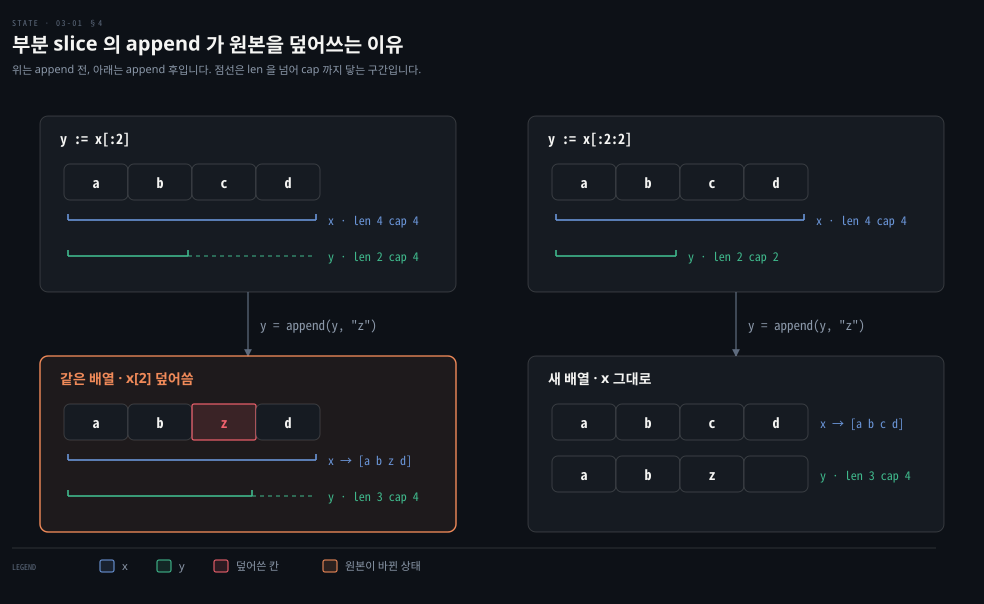

# slice 는 배열을 나눠 쓰는 창입니다

---

> Learning Go 3장 앞 절반입니다. 배열이 왜 거의 쓰이지 않는지, slice 가 어떻게 늘어나는지, 여러 slice 가 한 배열을 나눠 쓸 때 무슨 일이 생기는지를 다룹니다.

## 핵심 요약

> 이 편이 매달린 하나의 생각은 slice 가 값을 직접 담는 그릇이 아니라 뒷받침 배열(backing array)의 한 구간을 가리키는 창이라는 것입니다.

배열은 크기가 타입에 들어가서 쓰기 불편합니다. Go 에 배열이 있는 주된 이유는 slice 의 뒷받침 저장소가 되기 위해서입니다. slice 는 길이가 타입에 없으므로 늘릴 수 있고, 꽉 차면 `append` 가 더 큰 새 배열로 옮겨 갑니다.

창이라는 성질이 그대로 함정이 됩니다. slice 에서 잘라 낸 slice 는 같은 배열을 보므로, 한쪽을 고치면 다른 쪽이 바뀝니다. 잘라 낸 쪽에 `append` 하면 원본의 칸을 덮어쓸 수도 있습니다. 완전 slice 식으로 용량을 묶거나 `copy` 로 떼어 내면 이 공유를 끊을 수 있습니다.


## 학습 목표

> 이 편을 읽고 나면 아래 다섯 가지를 스스로 해낼 수 있습니다.

1. 배열의 크기가 타입의 일부라는 규칙과, 그 때문에 배열을 직접 쓰지 않는 이유를 설명할 수 있습니다.
2. slice 의 길이와 용량을 구분하고, `append` 가 용량을 넘을 때 일어나는 일을 설명할 수 있습니다.
3. nil slice·slice 리터럴·`make` 가운데 상황에 맞는 선언을 고를 수 있습니다.
4. 잘라 낸 slice 에 `append` 했을 때 원본이 바뀌는 이유를 용량으로 설명하고, 완전 slice 식이나 `copy` 로 막을 수 있습니다.
5. 배열과 slice 사이 변환에서 메모리를 공유하는 경우와 복사하는 경우를 가를 수 있습니다.


## 1. 배열 — 크기가 타입의 일부라서 직접 쓰기엔 경직됩니다

> Go 에도 배열이 있지만 직접 쓰는 일은 드뭅니다. `[3]int` 와 `[4]int` 가 서로 다른 타입이라서, 크기가 다른 배열을 한 함수로 다룰 수 없기 때문입니다.

값을 순서대로 담는 자료구조가 필요할 때 Java 개발자는 배열을 먼저 떠올립니다. Go 에서는 그 자리에 slice 를 씁니다. 원문은 이유를 설명하기 전에 배열 문법부터 짧게 보여 줍니다.

배열의 원소는 모두 선언한 타입이어야 합니다. 크기와 원소 타입을 적어 선언하면 모든 원소가 제로 값으로 채워집니다.

```go
var x [3]int                             // [0 0 0]
var x = [3]int{10, 20, 30}               // 배열 리터럴
var x = [12]int{1, 5: 4, 6, 10: 100, 15} // 0 이 아닌 칸만 인덱스로
var x = [...]int{10, 20, 30}             // 리터럴로 크기를 정함
```

셋째 줄은 대부분의 원소가 제로 값인 희소 배열을 쓸 때 편합니다. 원문 설명대로 `[1 0 0 0 0 4 6 0 0 0 100 15]` 가 되며, 이 노트를 쓰면서 출력해 보니 같았습니다. 배열 리터럴에서는 크기 자리에 `...` 를 써도 됩니다.

배열은 `==`·`!=` 로 비교할 수 있습니다. 길이가 같고 값이 모두 같으면 같은 배열입니다.

```go
var x = [...]int{1, 2, 3}
var y = [3]int{1, 2, 3}
fmt.Println(x == y) // prints true
```

Go 의 배열은 1차원뿐입니다. `var x [2][3]int` 는 길이 3 짜리 `int` 배열을 원소로 갖는 길이 2 배열로 다차원을 흉내 낸 것입니다. 원문은 Fortran·Julia 처럼 진짜 행렬을 지원하는 언어가 있고 Go 는 그렇지 않다고 적습니다.

읽고 쓰는 문법은 대괄호입니다. 길이는 내장 함수 `len` 으로 얻습니다. 끝을 넘거나 음수 인덱스로 읽고 쓸 수는 없습니다. 상수나 리터럴 인덱스라면 컴파일 에러입니다. 변수 인덱스라면 컴파일은 되지만 실행 중에 panic 이 납니다. 이 노트를 쓰면서 `[4]int` 에 `a[5]` 로 쓰니 `invalid argument: index 5 out of bounds [0:4]` 로 컴파일되지 않았습니다.

### 크기가 타입에 들어가는 것이 배열의 한계입니다

원문이 배열을 거의 쓰지 않는다고 한 이유가 여기 있습니다. Go 는 배열의 크기를 배열 타입의 일부로 봅니다. `[3]int` 와 `[4]int` 는 서로 다른 타입입니다. 여기서 제약 셋이 따라옵니다.

- 타입은 컴파일 시점에 정해져야 하므로 변수로 배열 크기를 정할 수 없습니다.
- 크기가 다른 배열끼리는 타입 변환으로도 바꿀 수 없습니다.
- 그래서 어떤 크기의 배열이든 받는 함수를 쓸 수 없고, 크기가 다른 배열을 한 변수에 대입할 수도 없습니다.

Java 는 다릅니다. 이 비교는 원문 밖의 것입니다. Java 의 `int[]` 는 길이가 타입에 없어서, `int[]` 를 받는 메서드에 길이 3 배열도 길이 4 배열도 넘길 수 있습니다. Java 배열이 하던 일은 Go 에서 slice 가 맡습니다.

원문의 권고는 필요한 길이를 미리 정확히 알 때만 배열을 쓰라는 것입니다. 표준 라이브러리의 암호 함수 일부는 체크섬 크기가 알고리즘에 정해져 있어서 배열을 돌려주는데, 원문은 이것이 규칙이 아니라 예외라고 말합니다. 그렇다면 이렇게 제한적인 기능이 왜 언어에 있을까요? 원문의 답은 배열이 slice 의 뒷받침 저장소가 되기 위해 존재한다는 것입니다. 배열이 메모리에 어떻게 놓이는지는 6장에서 다룹니다.


## 2. slice 기본 — 길이가 타입에 없어서 늘릴 수 있습니다

> 값을 순서대로 담을 때는 거의 언제나 slice 를 씁니다. slice 는 길이가 타입의 일부가 아니라서 필요한 만큼 늘릴 수 있고, 어떤 길이의 slice 든 한 함수로 다룰 수 있습니다.

slice 는 배열의 가장 큰 제약을 없앤 타입입니다. 쓰는 법은 배열과 거의 같고, 선언할 때 크기를 적지 않는 것이 첫째 차이입니다.

```go
var x = []int{10, 20, 30}
var x = []int{1, 5: 4, 6, 10: 100, 15}
var x [][]int // slice 의 slice
```

원문의 팁 한 줄이 둘을 가릅니다. `[...]` 는 배열을 만들고 `[]` 는 slice 를 만듭니다. 대괄호로 읽고 쓰는 것, 끝을 넘거나 음수 인덱스를 쓸 수 없는 것은 배열과 같습니다.

### slice 의 제로 값은 nil 입니다

차이는 리터럴 없이 선언할 때 드러납니다.

```go
var x []int
```

값을 주지 않았으므로 `x` 는 slice 의 제로 값을 받습니다. 그 값이 처음 보는 `nil` 입니다. 원문은 `nil` 이 다른 언어의 `null` 과 조금 다르다고 말합니다. **`nil`** 은 일부 타입에서 값이 없음을 나타내는 식별자입니다. 2장의 타입 없는 숫자 상수처럼 `nil` 도 타입이 없어서, 여러 타입의 값에 대입하거나 비교할 수 있습니다. nil slice 에는 아무것도 없습니다. `len` 에 넘기면 0 이 나옵니다. `nil` 은 6장에서 더 다룹니다.

### slice 는 == 로 비교할 수 없습니다

slice 는 이 책에서 처음 만나는 비교할 수 없는 타입입니다. 두 slice 가 같은지 `==` 로, 다른지 `!=` 로 보면 컴파일 에러이고, `==` 로 비교할 수 있는 상대는 `nil` 뿐입니다. 이 노트를 쓰면서 `x == []int{1}` 을 써 보니 `invalid operation: x == []int{…} (slice can only be compared to nil)` 이 났습니다.

```go
fmt.Println(x == nil) // prints true
```

Go 1.21 부터는 표준 라이브러리 `slices` 패키지에 slice 를 비교하는 함수가 둘 있습니다.

- `slices.Equal`: 길이가 같고 모든 원소가 같으면 `true` 입니다. 원소가 비교 가능한 타입이어야 합니다.
- `slices.EqualFunc`: 같음을 판정할 함수를 넘기며, 원소가 비교 가능하지 않아도 됩니다.

```go
x := []int{1, 2, 3, 4, 5}
y := []int{1, 2, 3, 4, 5}
z := []int{1, 2, 3, 4, 5, 6}
s := []string{"a", "b", "c"}
fmt.Println(slices.Equal(x, y)) // prints true
fmt.Println(slices.Equal(x, z)) // prints false
fmt.Println(slices.Equal(x, s)) // does not compile
```

`reflect` 패키지의 `DeepEqual` 도 slice 를 포함해 거의 무엇이든 비교합니다. 원문은 이것을 주로 테스트용인 옛 함수로 보고, `slices` 함수보다 느리고 덜 안전하니 새 코드에서는 쓰지 말라고 경고합니다. 함수를 인자로 넘기는 법은 5장, `slices` 패키지의 나머지 함수는 8장에서 다룹니다.

### len 은 여러 타입을 받는 내장 함수입니다

`len` 은 배열과 slice 에 모두 쓰이고, 곧 보듯 문자열과 map, 12장의 채널에도 쓰입니다. 그 밖의 타입을 넘기면 컴파일 에러입니다. 원문은 `len` 이 내장 함수인 이유를 개발자가 직접 쓸 수 없는 일을 하기 때문이라고 설명합니다. 문자열·배열·slice·채널·map 은 받고 나머지는 거부하는 함수를 개발자가 쓰는 방법이 Go 에는 없습니다(5장).


## 3. append 와 용량 — 꽉 차면 더 큰 새 배열로 옮깁니다

> `append` 는 slice 끝에 값을 더하고 그 결과 slice 를 돌려줍니다. 길이가 용량에 닿은 상태에서 더하면, Go 런타임이 더 큰 뒷받침 배열을 새로 잡아 값을 옮깁니다.

slice 를 늘리는 도구는 내장 함수 `append` 입니다. 적어도 두 인자, 곧 어떤 타입의 slice 와 그 타입의 값을 받아 같은 타입의 slice 를 돌려줍니다.

```go
var x []int
x = append(x, 10) // assign result to the variable that's passed in

var x = []int{1, 2, 3}
x = append(x, 4)
x = append(x, 5, 6, 7) // 여러 값을 한 번에

y := []int{20, 30, 40}
x = append(x, y...) // ... 로 다른 slice 를 풀어 넣음
```

`append` 가 돌려준 값을 대입하지 않으면 컴파일 에러입니다. 번거로워 보이는 이 규칙의 이유를 원문은 Go 가 값에 의한 호출(call by value) 언어라는 데서 찾습니다. 함수에 인자를 넘길 때마다 Go 는 그 값을 복사합니다. `append` 도 slice 의 사본을 받아 거기에 값을 더하고 그 사본을 돌려주므로, 호출한 쪽이 돌려받은 slice 를 다시 변수에 넣어야 합니다. 자세한 내용은 5장에서 다룹니다. `...` 연산자는 5장의 "Variadic Input Parameters and Slices" 에서 다룹니다.

### 길이는 채운 칸, 용량은 잡아 둔 칸입니다

slice 의 원소는 연속된 메모리 칸에 놓여 빠르게 읽고 쓸 수 있습니다. 원문은 여기서 두 수를 구분합니다.

- **길이(length)**: 값이 들어 있는 연속된 칸의 수입니다. `len` 으로 얻습니다.
- **용량(capacity)**: 예약해 둔 연속된 칸의 수입니다. 길이보다 클 수 있고, 내장 함수 `cap` 으로 얻습니다.

`append` 할 때마다 끝에 값이 붙고 길이가 1씩 늡니다. 길이가 용량에 닿으면 더 넣을 자리가 없습니다. 이때 `append` 는 Go 런타임에게 더 큰 뒷받침 배열을 받아, 원래 배열의 값을 새 배열로 옮기고 새 값을 끝에 붙인 뒤, slice 가 새 배열을 가리키게 해서 돌려줍니다.

원문은 이 대목에서 **Go 런타임(Go runtime)**을 소개합니다. 메모리 할당과 가비지 컬렉션, 동시성 지원, 네트워킹, 내장 타입과 내장 함수의 구현을 맡는 라이브러리 묶음입니다. Go 런타임은 모든 Go 바이너리에 컴파일되어 들어갑니다. 가상 머신을 따로 깔아야 하는 언어와 달리 배포가 쉽고 런타임과 프로그램 사이의 호환성 걱정도 없습니다. 대신 가장 단순한 Go 프로그램도 바이너리가 약 2MB 가 됩니다. 원문 밖의 관찰로, 이 노트를 쓰면서 1장 예제를 빌드했을 때 `hello_world` 바이너리가 2.3MB 였던 것도 이 때문입니다.

### 용량은 한 칸씩이 아니라 넉넉하게 늘어납니다

새 메모리를 잡고 값을 옮기는 데는 시간이 들고, 옛 메모리는 가비지 컬렉션 대상이 됩니다. 그래서 Go 런타임은 용량이 모자랄 때 보통 1 보다 많이 늘립니다. 원문이 적은 Go 1.18 기준 규칙은 이렇습니다.

- 현재 용량이 256 보다 작으면 두 배로 늘립니다.
- 그보다 크면 `(current_capacity + 768)/4` 만큼 늘립니다. 증가율이 차츰 25% 로 수렴해서, 용량 512 는 63%, 4,096 은 30% 늘어난다고 원문은 적습니다.

이 공식은 `go1.25.1` 의 `src/runtime/slice.go` 에도 그대로 있습니다(`threshold = 256`, `newcap += (newcap + 3*threshold) >> 2`). 다만 실제로 재 보니 용량이 공식보다 조금 컸습니다.

원문 밖의 관찰입니다. 이 노트를 쓴 기계에서 용량 512 인 `[]int` 에 하나를 더하니 용량이 공식의 832 가 아니라 848 이 됐습니다. 4,096 은 약 5,312 가 아니라 6,144 가 됐습니다. 런타임이 공식으로 구한 크기를 메모리 할당기가 쓰는 크기 단위로 올리는(`roundupsize`) 단계가 뒤에 있기 때문입니다. 공식은 하한으로 읽습니다. 정확한 용량이 중요하면 `make` 로 직접 정합니다.

`cap` 은 `len` 보다 훨씬 덜 씁니다. 원문은 slice 가 새 데이터를 담기에 충분한지, `make` 로 새 slice 를 만들어야 하는지 볼 때 주로 쓴다고 합니다. 배열에도 `cap` 을 쓸 수 있지만 늘 `len` 과 같은 값이 나오니, 원문 말대로 코드에 넣지 말고 퀴즈용으로 남겨 둡니다.

원문 예제 3-1 은 빈 slice 에 값을 하나씩 더하며 길이와 용량을 찍습니다. 이 노트를 쓰면서 돌린 결과도 원문과 같았습니다.

```go
var x []int
fmt.Println(x, len(x), cap(x))
x = append(x, 10)
fmt.Println(x, len(x), cap(x))
// 20·30·40·50 을 차례로 append 하며 같은 줄을 찍는다
```

```bash
[] 0 0
[10] 1 1
[10 20] 2 2
[10 20 30] 3 4
[10 20 30 40] 4 4
[10 20 30 40 50] 5 8
```

용량이 1, 2, 4, 8 로 두 배씩 뛰는 것이 보입니다. 원문은 slice 가 알아서 자라는 것은 좋지만 한 번에 크기를 잡는 편이 훨씬 효율적이라고 말합니다. 몇 개를 넣을지 안다면 처음부터 알맞은 용량으로 만들고, 그 도구가 `make` 입니다.

Java 의 `ArrayList` 도 같은 구조입니다. 이 비교는 원문 밖의 것입니다. 내부 배열이 차면 더 큰 배열을 잡아 옮기고, 생성자에 초기 용량을 줄 수 있습니다. 다른 점은 `ArrayList` 는 `add` 가 자기 자신을 고치는 반면, Go 의 `append` 는 결과를 돌려주고 호출한 쪽이 대입한다는 것입니다.

### make 는 길이와 용량을 미리 정합니다

slice 리터럴과 nil 로는 길이나 용량을 미리 정한 빈 slice 를 만들 수 없습니다. 그 일을 내장 함수 `make` 가 합니다. 타입과 길이, 그리고 선택으로 용량을 받습니다.

```go
x := make([]int, 5)      // 길이 5, 용량 5, x[0]~x[4] 는 0
x := make([]int, 5, 10)  // 길이 5, 용량 10
x := make([]int, 0, 10)  // 길이 0, 용량 10, nil 아님
```

원문이 초보자의 흔한 실수로 드는 것이 `make` 로 길이를 잡은 뒤 `append` 로 채우려는 것입니다.

```go
x := make([]int, 5)
x = append(x, 10)
```

`append` 는 늘 길이를 늘리므로 10 은 0 다섯 개 뒤에 붙습니다. `x` 는 `[0 0 0 0 0 10]`, 길이 6, 용량 10 이 됩니다. 여섯째 원소를 더하는 순간 용량이 두 배가 된 것이고, 이 노트를 쓰면서 확인한 값도 같았습니다.

길이 0 에 용량이 있는 slice 는 인덱스로 바로 쓸 수 없지만 `append` 는 됩니다. `make([]int, 0, 10)` 에 `append(x, 5, 6, 7, 8)` 을 하면 `[5 6 7 8]`, 길이 4, 용량 10 입니다.

용량을 길이보다 작게 주면 안 됩니다. 상수나 숫자 리터럴이라면 컴파일 에러이고(이 노트에서 확인한 메시지는 `invalid argument: length and capacity swapped`), 변수로 주면 실행 중에 panic 이 납니다.

### clear 는 원소를 제로 값으로 되돌리고 길이는 둡니다

Go 1.21 에 `clear` 함수가 들어왔습니다. slice 의 모든 원소를 제로 값으로 바꾸고 길이는 그대로 둡니다.

```go
s := []string{"first", "second", "third"}
fmt.Println(s, len(s))
clear(s)
fmt.Println(s, len(s))
```

원문은 두 번째 줄 출력으로 대괄호 안에 빈칸만 보이는 `[  ] 3` 을 보입니다. 빈 문자열 셋이 찍힌 것이라 눈으로는 알아보기 어렵습니다. 이 노트를 쓰면서 `%q` 로 찍어 보니 `["" "" ""] 3` 이었습니다.


## 4. slice 선언 고르기 — 늘어나는 횟수를 줄이는 쪽으로

> 선언 방식을 고르는 기준은 slice 가 늘어나야 하는 횟수를 줄이는 것입니다. 늘 필요가 없으면 nil slice, 시작 값이 있으면 리터럴, 크기를 알면 `make` 를 씁니다.

지금까지 slice 를 만드는 방법이 여럿 나왔습니다(nil·리터럴·빈 리터럴·`make`, 이 분류는 노트의 정리입니다). 원문은 무엇을 쓸지 이렇게 정리합니다.

- slice 가 전혀 자라지 않을 수도 있다면 값을 주지 않은 `var` 로 nil slice 를 만듭니다(`var data []int`).
- 시작 값이 있거나 값이 바뀌지 않을 slice 라면 slice 리터럴이 좋습니다(`data := []int{2, 4, 6, 8}`).
- 크기는 대강 알지만 값은 모른다면 `make` 를 씁니다.

`var x = []int{}` 처럼 빈 slice 리터럴로도 slice 를 만들 수 있습니다. 길이와 용량이 0 인데 nil slice 와는 헷갈리게 다릅니다. 구현상 이유로 이 slice 를 `nil` 과 비교하면 `false` 가 나옵니다. 원문은 단순하게 nil slice 를 쓰라고 하고, 길이 0 slice 는 JSON 으로 바꿀 때만 쓸모 있다고 합니다(뒤의 "encoding/json" 절).

### make 를 쓸 때 길이를 줄까, 용량만 줄까?

`make` 를 쓰기로 했다면 길이를 0 이 아니게 줄지, 길이 0 에 용량만 줄지가 남습니다. 원문은 세 경우를 나눕니다.

1. slice 를 버퍼로 쓴다면 길이를 줍니다. 뒤의 "io and Friends" 절에서 나옵니다.
2. 크기를 정확히 안다면 길이를 주고 인덱스로 값을 넣어도 됩니다. 한 slice 의 값을 변환해 다른 slice 에 담을 때 흔히 씁니다. 크기를 잘못 알면 끝에 제로 값이 남거나 없는 원소에 접근해 panic 이 납니다.
3. 그 밖에는 길이 0 에 용량을 주고 `append` 로 채웁니다. 실제 개수가 적으면 끝에 쓸데없는 제로 값이 남지 않고, 많으면 panic 대신 자랍니다.

원문은 Go 커뮤니티가 2번과 3번으로 갈린다고 적고, 저자 자신은 3번을 선호한다고 밝힙니다. 어떤 경우 조금 느릴 수 있어도 버그를 들일 가능성이 낮기 때문입니다. 경고도 하나 붙입니다. `append` 는 늘 길이를 늘리므로, `make` 로 길이를 정한 slice 에 `append` 하기 전에는 그게 정말 의도인지 확인해야 합니다. 아니면 slice 앞쪽에 뜻밖의 제로 값이 잔뜩 남습니다.


## 5. slice 의 slice — 같은 배열을 나눠 쓰므로 append 가 원본을 덮어씁니다

> slice 에서 잘라 낸 slice 는 데이터를 복사하지 않고 같은 배열을 봅니다. 잘라 낸 쪽의 용량이 원본 끝까지 닿아 있으면, 거기에 `append` 한 값이 원본의 칸을 덮어씁니다.

**slice 식(slice expression)**은 slice 에서 slice 를 만듭니다. 대괄호 안에 시작 위치와 끝 위치를 콜론으로 나눠 적습니다. 시작 위치는 새 slice 에 들어가는 첫 칸입니다. 끝 위치는 마지막으로 넣을 칸의 다음 칸입니다. 시작을 빼면 0, 끝을 빼면 slice 의 끝으로 봅니다. 원문 예제 3-4 입니다. 이 노트를 쓰면서 돌린 출력도 같았습니다.

```go
x := []string{"a", "b", "c", "d"}
y := x[:2]  // [a b]
z := x[1:]  // [b c d]
d := x[1:3] // [b c]
e := x[:]   // [a b c d]
```

### 잘라 낸 slice 는 메모리를 공유합니다

slice 식은 데이터를 복사하지 않습니다. 원문 말대로 이제 두 변수가 메모리를 나눠 씁니다. 그래서 한 slice 의 원소를 바꾸면 그 원소를 함께 쓰는 모든 slice 가 바뀝니다(원문 예제 3-5).

```go
x := []string{"a", "b", "c", "d"}
y := x[:2]
z := x[1:]
x[1] = "y"
y[0] = "x"
z[1] = "z"
fmt.Println("x:", x) // x: [x y z d]
fmt.Println("y:", y) // y: [x y]
fmt.Println("z:", z) // z: [y z d]
```

`x` 를 고치니 `y` 와 `z` 가 바뀌고, `y` 와 `z` 를 고치니 `x` 가 바뀌었습니다. Java 의 `List.subList` 가 원본 리스트의 뷰를 돌려주어 한쪽 수정이 다른 쪽에 보이는 것과 닮았습니다. 이 비교는 원문 밖의 것입니다.

### 부분 slice 에 append 하면 원본이 바뀝니다

`append` 가 끼면 더 헷갈립니다(원문 예제 3-6).

```go
x := []string{"a", "b", "c", "d"}
y := x[:2]
fmt.Println(cap(x), cap(y)) // 4 4
y = append(y, "z")
fmt.Println("x:", x)        // x: [a b z d]
fmt.Println("y:", y)        // y: [a b z]
```

`y` 에 값을 더했는데 `x[2]` 가 `c` 에서 `z` 로 바뀌었습니다. 원문의 설명은 용량에 있습니다. slice 에서 slice 를 잘라 내면 부분 slice 의 용량은 원본의 용량에서 시작 위치를 뺀 값이 됩니다. `y` 는 길이 2 이지만 용량은 `x` 와 같은 4 입니다. 용량이 남아 있으니 `append` 는 새 배열을 만들지 않고 뒷받침 배열의 다음 칸, 곧 `x` 의 셋째 칸에 값을 씁니다. 부분 slice 끝 너머의 원소는 쓰지 않은 용량까지 포함해 두 slice 가 함께 쓰는 셈입니다.

아래 그림 왼쪽 열이 이 과정입니다. 오른쪽 열은 다음 소절의 완전 slice 식으로 같은 `append` 를 했을 때입니다.



왼쪽 위에서 `y` 의 초록 괄호는 두 칸이지만 점선이 넷째 칸까지 닿습니다. 그 점선 구간이 `append` 가 쓸 수 있는 자리이고, 그래서 왼쪽 아래에서 `x` 의 셋째 칸이 `z` 로 덮였습니다.

원문 예제 3-7 은 여러 slice 가 서로의 데이터를 덮어쓰는 더 꼬인 경우입니다. 원문은 출력을 싣지 않고 독자에게 맞혀 보라고 합니다. 코드를 읽고 먼저 답을 정한 뒤 아래 출력과 비교해 보십시오.

```go
x := make([]string, 0, 5)
x = append(x, "a", "b", "c", "d")
y := x[:2]
z := x[2:]
fmt.Println(cap(x), cap(y), cap(z))
y = append(y, "i", "j", "k")
x = append(x, "x")
z = append(z, "y")
fmt.Println("x:", x)
fmt.Println("y:", y)
fmt.Println("z:", z)
```

```bash
# go1.25.1 출력 (2026-09-27)
5 5 3
x: [a b i j y]
y: [a b i j y]
z: [i j y]
```

세 slice 가 모두 용량 5 짜리 한 배열을 봅니다. `y` 에 더한 `i j k` 가 2~4번 칸을 덮었습니다. 이어서 `x` 에 더한 `x` 가 4번 칸을 다시 덮었고, 마지막으로 `z` 에 더한 `y` 가 또 4번 칸을 덮었습니다. 마지막에 쓴 값만 남아서 `x` 와 `y` 가 똑같아졌습니다.

### 완전 slice 식으로 용량을 묶습니다

원문의 처방은 둘 중 하나입니다. 부분 slice 에는 아예 `append` 하지 않거나, **완전 slice 식(full slice expression)**으로 `append` 가 덮어쓰지 못하게 합니다. 완전 slice 식에는 셋째 자리가 있어서, 부모 slice 의 용량 가운데 부분 slice 가 쓸 수 있는 마지막 위치를 적습니다. 이 수에서 시작 위치를 빼면 부분 slice 의 용량입니다. 원문은 조금 이상해 보여도 부모와 부분 slice 가 메모리를 얼마나 공유하는지 분명히 드러낸다고 말합니다. 예제 3-7 의 앞 네 줄을 바꾼 것이 원문 예제 3-8 입니다.

```go
x := make([]string, 0, 5)
x = append(x, "a", "b", "c", "d")
y := x[:2:2]
z := x[2:4:4]
```

`y` 와 `z` 는 모두 용량 2 입니다. 용량을 길이와 같게 묶었으므로 여기에 `append` 하면 새 slice 가 만들어져 다른 slice 와 얽히지 않습니다. 예제 3-7 의 나머지 줄을 이어 돌리면 원문대로 `x` 는 `[a b c d x]`, `y` 는 `[a b i j k]`, `z` 는 `[c d y]` 가 됩니다. 이 노트를 쓰면서 돌린 결과도 같았습니다.

원문은 이 절을 경고로 닫습니다. slice 의 slice 는 같은 메모리를 공유하므로 한쪽 변경이 다른 쪽에 보입니다. 잘라 낸 뒤의 slice 나 잘라서 만든 slice 는 고치지 말고, `append` 가 용량을 공유하지 못하게 하려면 세 자리 slice 식을 씁니다.


## 6. copy — 원본과 독립된 slice 가 필요할 때

> 원본과 메모리를 나누지 않는 slice 가 필요하면 내장 함수 `copy` 를 씁니다. 두 slice 가운데 짧은 쪽 길이만큼 복사하고, 복사한 원소 수를 돌려줍니다.

§5 의 공유를 끊는 가장 직접적인 방법이 `copy` 입니다. 첫째 인자가 대상 slice, 둘째 인자가 원본 slice 입니다.

```go
x := []int{1, 2, 3, 4}
y := make([]int, 4)
num := copy(y, x)
fmt.Println(y, num) // [1 2 3 4] 4
```

`copy` 는 원본에서 대상으로 복사할 수 있는 만큼, 곧 둘 중 작은 slice 의 길이만큼 복사합니다. 원문은 용량은 상관없고 길이가 중요하다고 강조합니다. 그래서 길이 2 인 대상에 네 원소 slice 를 복사하면 앞 두 개만 들어가고 `num` 은 2 입니다.

원본의 중간부터 복사하려면 slice 식을 씁니다. 복사한 원소 수가 필요 없으면 반환값을 대입하지 않아도 됩니다.

```go
x := []int{1, 2, 3, 4}
y := make([]int, 2)
copy(y, x[2:]) // y 는 [3 4]
```

같은 뒷받침 배열의 겹치는 구간끼리도 복사할 수 있습니다. 아래는 `x` 의 뒤 세 값을 앞 세 칸에 덮어써서 `[2 3 4 4] 3` 이 찍히고, 이 노트를 쓰면서 확인한 값도 같았습니다.

```go
x := []int{1, 2, 3, 4}
num := copy(x[:3], x[1:])
fmt.Println(x, num)
```

배열도 slice 식으로 잘라 넘기면 `copy` 의 원본이나 대상이 될 수 있습니다. 원문 예제에서 `copy(y, d[:])` 는 배열 `d` 의 앞 두 값 `[5 6]` 을 `y` 에 넣고, `copy(d[:], x)` 는 slice `x` 의 네 값을 배열 `d` 에 넣어 `[1 2 3 4]` 로 만듭니다.


## 7. 배열과 slice 사이 변환 — 공유하는 쪽과 복사하는 쪽을 가립니다

> 배열에서 slice 를 잘라 내면 메모리를 공유하고, slice 를 배열로 변환하면 새 메모리에 복사합니다. slice 를 배열 포인터로 변환하면 다시 공유합니다.

slice 만 받는 함수에 배열을 넘기려면 배열에서 slice 를 잘라 냅니다. 배열 전체는 `[:]`, 일부는 `[:2]` 나 `[2:]` 처럼 씁니다.

```go
xArray := [4]int{5, 6, 7, 8}
xSlice := xArray[:]
```

배열에서 잘라 낸 slice 도 §5 와 같은 공유 성질을 갖습니다. 원문 예제에서 `x := [4]int{5, 6, 7, 8}` 의 `y := x[:2]`, `z := x[2:]` 를 만든 뒤 `x[0] = 10` 을 하면 `y` 가 `[10 6]` 으로 바뀝니다.

### slice 를 배열로 변환하면 복사됩니다

반대 방향은 타입 변환으로 합니다. slice 전체를 같은 크기 배열로, 또는 slice 의 앞부분을 더 작은 배열로 바꿀 수 있습니다. 이때는 데이터가 새 메모리로 복사되므로, 이후 slice 를 고쳐도 배열은 그대로이고 그 반대도 마찬가지입니다.

```go
xSlice := []int{1, 2, 3, 4}
xArray := [4]int(xSlice)
smallArray := [2]int(xSlice)
xSlice[0] = 10
fmt.Println(xSlice)     // [10 2 3 4]
fmt.Println(xArray)     // [1 2 3 4]
fmt.Println(smallArray) // [1 2]
```

배열 크기는 컴파일 시점에 정해져야 하므로 이 변환에 `[...]` 를 쓰면 컴파일 에러입니다. 이 노트에서 확인한 메시지는 `invalid use of [...] array (outside a composite literal)` 이었습니다.

배열이 slice 보다 작은 것은 되지만 클 수는 없습니다. 원문은 컴파일러가 이것을 잡지 못해서, 배열 크기가 slice 의 길이(용량이 아니라)보다 크면 실행 중에 panic 이 난다고 경고합니다. `[5]int(xSlice)` 의 panic 메시지는 원문과 `go1.25.1` 이 같았습니다.

```bash
panic: runtime error: cannot convert slice with length 4 to array or pointer to array with length 5
```

### slice 를 배열 포인터로 변환하면 다시 공유합니다

포인터는 6장에서 다룹니다. 원문은 여기서 한 가지를 미리 보입니다. slice 를 배열 포인터로 타입 변환할 수도 있습니다. 이때는 저장 공간이 공유됩니다.

```go
xSlice := []int{1, 2, 3, 4}
xArrayPointer := (*[4]int)(xSlice)
xSlice[0] = 10
xArrayPointer[1] = 20
fmt.Println(xSlice)        // prints [10 20 3 4]
fmt.Println(xArrayPointer) // prints &[10 20 3 4]
```

§1 에서 배열은 크기가 다르면 한 함수로 받을 수 없다고 했습니다. 원문은 배열을 slice 로 바꾼 뒤 다른 크기의 배열로 다시 바꿔 넘기는 우회로가 기술적으로는 있다고 적습니다. 둘째 배열이 첫째보다 짧아야 하고 아니면 panic 이 납니다. 원문은 급할 때는 쓸 만해도 이런 일이 잦다면 함수가 배열 대신 slice 를 받도록 API 를 바꾸라고 강하게 권합니다.


## 핵심 개념 체크리스트

목표 번호 순서대로 짝지었습니다.

- [ ] (목표 1) `[3]int` 와 `[4]int` 가 다른 타입이라서 생기는 제약 셋을 말할 수 있습니까?
- [ ] (목표 1) Go 에 배열이 있는 주된 이유를 한 문장으로 말할 수 있습니까?
- [ ] (목표 2) 길이와 용량의 차이, 그리고 길이가 용량에 닿았을 때 `append` 가 하는 일을 순서대로 말할 수 있습니까?
- [ ] (목표 2) `append` 의 반환값을 꼭 대입해야 하는 이유를 값에 의한 호출로 설명할 수 있습니까?
- [ ] (목표 3) nil slice·빈 slice 리터럴·`make([]int, 0, 10)` 을 `nil` 과 비교하면 각각 무엇이 나옵니까?
- [ ] (목표 3) `make([]int, 5)` 에 `append(x, 10)` 을 하면 결과가 어떻게 되고, 저자가 선호하는 `make` 방식은 무엇입니까?
- [ ] (목표 4) 예제 3-6 에서 `y` 에 `append` 했는데 `x[2]` 가 바뀐 이유를 용량으로 설명할 수 있습니까?
- [ ] (목표 4) `x[2:4:4]` 의 용량은 얼마이고, 그렇게 쓰면 무엇이 달라집니까?
- [ ] (목표 5) 배열에서 slice 로, slice 에서 배열로, slice 에서 배열 포인터로 바꿀 때 각각 공유인지 복사인지 말할 수 있습니까?


## 관련 문서

- [03-02 문자열은 바이트이고 map 은 없는 키에 제로 값을 돌려줍니다](./03-02.%EB%AC%B8%EC%9E%90%EC%97%B4%EC%9D%80%20%EB%B0%94%EC%9D%B4%ED%8A%B8%EC%9D%B4%EA%B3%A0%20map%20%EC%9D%80%20%EC%97%86%EB%8A%94%20%ED%82%A4%EC%97%90%20%EC%A0%9C%EB%A1%9C%20%EA%B0%92%EC%9D%84%20%EB%8F%8C%EB%A0%A4%EC%A4%8D%EB%8B%88%EB%8B%A4.md) — 3장 가운데. 문자열·룬·바이트와 map
- [02-02 var 와 짧은 선언은 의도를 드러내는 선택입니다](./02-02.var%20%EC%99%80%20%EC%A7%A7%EC%9D%80%20%EC%84%A0%EC%96%B8%EC%9D%80%20%EC%9D%98%EB%8F%84%EB%A5%BC%20%EB%93%9C%EB%9F%AC%EB%82%B4%EB%8A%94%20%EC%84%A0%ED%83%9D%EC%9E%85%EB%8B%88%EB%8B%A4.md) — 2장 뒤 절반. 선언 방식
- [Learning Go 2판 — 정독 인덱스](./README.md) — 16장 전체 지도


## 참고 자료

- 원본: 《Learning Go, 2nd Edition》 (Jon Bodner, O'Reilly)
- 다룬 범위: Chapter 3 도입부터 "Converting Slices to Arrays" 까지
- go1.25.1 소스 `src/runtime/slice.go` — `growslice` 의 증가 공식과 `roundupsize` (로컬 `go env GOROOT` 아래)
