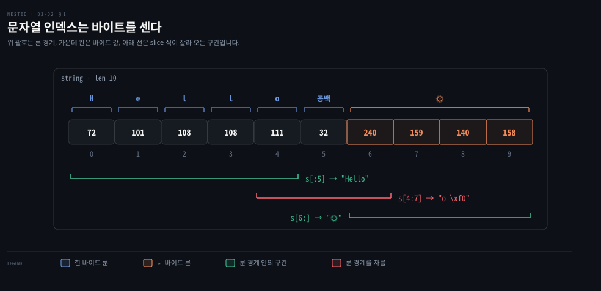

# 문자열은 바이트이고 map 은 없는 키에 제로 값을 돌려줍니다

---

> Learning Go 3장 가운데입니다. 문자열이 속으로는 바이트의 열이라는 사실과 그 때문에 생기는 함정, 그리고 키로 값을 찾는 map 을 다룹니다.

## 핵심 요약

> 이 편이 매달린 하나의 생각은 Go 가 "없음" 을 예외로 알리지 않고 값으로 돌려준다는 것입니다. 문자열 인덱스는 문자가 아니라 바이트를 돌려주고, map 은 없는 키에도 제로 값을 돌려줍니다.

문자열은 룬이 아니라 바이트의 열입니다. 그래서 인덱스·slice 식·`len` 은 모두 바이트를 세고, 한 문자가 여러 바이트인 UTF-8 문자열에서는 문자 한가운데를 잘라 올 수 있습니다. 문자열에서 문자를 다룰 때는 `strings`·`unicode/utf8` 패키지를 씁니다.

map 은 없는 키를 읽어도 panic 하지 않고 값 타입의 제로 값을 줍니다. 덕분에 카운터가 간단해지지만, 키가 정말 있는지 알아야 할 때는 comma ok 관용구로 두 번째 값을 받아 확인합니다.


## 학습 목표

> 이 편을 읽고 나면 아래 다섯 가지를 스스로 해낼 수 있습니다.

1. 문자열의 인덱스·slice 식·`len` 이 바이트를 센다는 것을 알고, 여러 바이트 문자가 섞인 문자열에서 생기는 문제를 설명할 수 있습니다.
2. 문자열과 룬·바이트 사이의 변환을 쓰고, 정수를 `string(x)` 로 바꾸면 안 되는 이유를 설명할 수 있습니다.
3. UTF-8 이 UTF-32·UTF-16 보다 널리 쓰이는 이유와 그 대가를 말할 수 있습니다.
4. nil map 과 빈 map 리터럴의 차이, map 읽기·쓰기·삭제·비우기·비교를 쓸 수 있습니다.
5. comma ok 관용구로 없는 키와 제로 값이 든 키를 구분하고, map 으로 집합을 흉내 낼 수 있습니다.


## 1. 문자열은 바이트의 열 — 인덱스와 slice 식은 바이트를 셉니다

> Go 의 문자열은 속으로 바이트의 열입니다. 인덱스와 slice 식과 `len` 은 모두 바이트 단위라서, 한 글자가 여러 바이트인 문자열에서는 글자 한가운데를 잘라 올 수 있습니다.

2장에서 문자열을 잠깐 봤습니다. slice 를 배운 지금 다시 봅니다. 원문은 문자열이 룬으로 이루어졌다고 생각하기 쉽지만 그렇지 않다고 말합니다. Go 는 문자열을 바이트의 열로 나타냅니다. 이 바이트들이 특정 인코딩일 필요는 없습니다. 다만 Go 라이브러리 함수 여럿과 4장의 `for-range` 반복문은 문자열이 UTF-8 로 인코딩된 코드 포인트의 열이라고 가정합니다. 언어 명세상 Go 소스 코드는 늘 UTF-8 로 쓰이므로, 16진수 이스케이프를 쓰지 않는 한 문자열 리터럴도 UTF-8 입니다.

배열이나 slice 처럼 문자열에서도 인덱스로 값 하나를 꺼낼 수 있고, slice 식도 쓸 수 있습니다.

```go
var s string = "Hello there"
var b byte = s[6]     // 116, 소문자 t 의 UTF-8 값
var s2 string = s[4:7] // "o t"
var s3 string = s[:5]  // "Hello"
var s4 string = s[6:]  // "there"
```

문자열은 불변이라서 03-01 에서 본 slice 의 slice 같은 수정 문제는 없습니다. 원문이 짚는 문제는 따로 있습니다. 문자열은 바이트의 열인데, UTF-8 의 코드 포인트 하나는 1~4바이트입니다. 위 예는 모든 글자가 1바이트라서 기대대로 동작했습니다. 영어가 아닌 언어나 이모지를 다루면 여러 바이트짜리 코드 포인트를 만납니다.

원문은 `"Hello 🌞"`(웃는 얼굴 해 이모지)로 같은 slice 식을 다시 씁니다. PDF 추출본에서 이모지가 빠져 있어, 예제 3-9 의 바이트 출력 `240 159 140 158` 로 이 문자가 U+1F31E 임을 확인하고 채웠습니다.

```go
var s string = "Hello 🌞"
var s2 string = s[4:7]
var s3 string = s[:5]
var s4 string = s[6:]
fmt.Println(len(s))
```

`s3` 은 여전히 `"Hello"` 이고 `s4` 는 해 이모지입니다. 그런데 `s2` 는 `"o 🌞"` 이 아닙니다. 해 이모지 코드 포인트의 첫 바이트만 복사했고, 그 바이트 하나는 올바른 코드 포인트가 아니기 때문입니다. `len(s)` 도 7 이 아니라 10 을 찍습니다. 인덱스와 slice 식이 바이트 위치를 세니 `len` 이 바이트 길이를 돌려주는 것도 자연스럽습니다. 해 이모지는 UTF-8 로 4바이트입니다.

아래 그림이 이 관계입니다. 가운데 열 칸이 바이트, 위 괄호가 코드 포인트(룬) 경계, 아래 선이 slice 식이 잘라 오는 구간입니다.



`s[4:7]` 의 빨간 선이 오른쪽 주황 괄호의 첫 칸에서 끊기는 것이 문제의 자리입니다. 이 노트를 쓰면서 `%q` 로 찍으니 `s2` 는 `"o \xf0"` 이었습니다. 원문 밖의 확인을 하나 더하면, `utf8.RuneCountInString(s)` 로 코드 포인트를 세니 7 이 나왔습니다.

원문의 경고는 분명합니다. 문자열에 인덱스와 slice 식을 쓸 수는 있지만, 모든 글자가 1바이트라는 것을 알 때만 씁니다. 그 밖에는 표준 라이브러리 `strings`·`unicode/utf8` 패키지의 함수로 부분 문자열과 코드 포인트를 꺼냅니다. 코드 포인트를 차례로 도는 `for-range` 는 4장에서 다룹니다.

Java 개발자라면 차이를 한 번 짚어 둘 만합니다. 이 비교는 원문 밖의 것입니다. Java 의 `String.charAt` 은 UTF-16 코드 단위(`char`)를 돌려주고, `length()` 도 UTF-16 코드 단위 수입니다. 해 이모지는 Java 에서 `char` 두 개(서로게이트 쌍)이고 Go 에서는 바이트 네 개입니다. 두 언어 모두 인덱스 하나가 곧 글자 하나는 아니라는 점은 같습니다.


## 2. 문자열·룬·바이트 변환 — 바이트 slice 와 오가는 일이 가장 흔합니다

> 룬이나 바이트 하나는 문자열로 바꿀 수 있고, 문자열은 바이트 slice 나 룬 slice 와 서로 바꿀 수 있습니다. 정수를 `string(x)` 로 바꾸면 숫자가 아니라 그 코드 포인트의 문자가 나오니 조심합니다.

룬·문자열·바이트의 관계가 복잡한 만큼 이들 사이에는 흥미로운 변환이 있습니다. 먼저 룬이나 바이트 하나를 문자열로 바꿀 수 있습니다.

```go
var a rune = 'x'
var s string = string(a)
var b byte = 'y'
var s2 string = string(b)
```

### 정수를 string 으로 변환하면 숫자가 아니라 문자가 나옵니다

원문이 새 Go 개발자의 흔한 버그로 드는 것이 타입 변환으로 `int` 를 문자열로 만들려는 것입니다.

```go
var x int = 65
var y = string(x)
fmt.Println(y)
```

`y` 는 `"65"` 가 아니라 `"A"` 가 됩니다. 65 가 대문자 A 의 코드 포인트이기 때문입니다. 원문은 Go 1.15 부터 `go vet` 이 `rune`·`byte` 가 아닌 정수 타입에서 문자열로의 변환을 막는다고 적습니다. 이 노트를 쓰면서 `go vet` 을 돌리니 아래처럼 잡혔고, `go run` 으로는 경고 없이 `A` 가 찍혔습니다. 1장의 Makefile 이 `go vet` 을 빌드 앞에 둔 이유가 여기서도 드러납니다(이 연결은 노트의 해석입니다).

```bash
# go1.25.1 에서 go vet 출력 (2026-09-27)
v/main.go:7:10: conversion from int to string yields a string of one rune, not a string of digits
```

숫자를 숫자 문자열로 바꾸는 도구는 원문의 이 절에 나오지 않습니다. 원문 밖의 보충으로, 표준 라이브러리 `strconv.Itoa` 가 그 일을 합니다. 2장에서 본 `strconv.FormatInt` 도 같은 패키지입니다.

### 문자열과 바이트 slice·룬 slice 는 서로 바꿀 수 있습니다

문자열은 바이트 slice 나 룬 slice 로, 그리고 다시 문자열로 바꿀 수 있습니다(원문 예제 3-9). 문자열의 이모지는 1절과 같은 이유로 PDF 에서 빠져 있어 채웠습니다.

```go
var s string = "Hello, 🌞"
var bs []byte = []byte(s)
var rs []rune = []rune(s)
fmt.Println(bs)
fmt.Println(rs)
```

```bash
[72 101 108 108 111 44 32 240 159 140 158]
[72 101 108 108 111 44 32 127774]
```

첫 줄은 문자열을 UTF-8 바이트로, 둘째 줄은 룬으로 바꾼 것입니다. 이 노트를 쓰면서 돌린 출력도 같았습니다. 해 이모지가 첫 줄에서는 네 바이트, 둘째 줄에서는 룬 하나(127774, 곧 U+1F31E)로 나옵니다. Go 에서 대부분의 데이터는 바이트의 열로 읽고 쓰므로, 가장 흔한 문자열 변환은 바이트 slice 와 오가는 것입니다. 룬 slice 는 드뭅니다.

### UTF-8 은 영문을 1바이트로 쓰는 대신 임의 접근을 포기합니다

원문은 여기서 UTF-8 을 따로 설명합니다. 코드 포인트는 글자와 수식 기호를 부르는 기술 용어입니다. 유니코드는 코드 포인트 하나를 4바이트, 곧 32비트로 나타냅니다. 코드 포인트마다 4바이트를 그대로 저장하는 것이 UTF-32 인데, 공간을 너무 낭비해서 거의 쓰이지 않습니다. 원문에 따르면 유니코드 구현의 세부 사정으로 32비트 가운데 11비트는 늘 0 입니다. UTF-16 은 16비트 곧 2바이트 한두 개로 코드 포인트를 나타냅니다. 세상의 콘텐츠 대부분이 1바이트로 들어가는 코드 포인트라서 이것도 낭비입니다.

UTF-8 이 그 자리를 채웁니다. 원문이 드는 장점을 노트가 셋으로 묶으면 이렇습니다.

- 128 보다 작은 값의 유니코드 문자, 곧 영어에서 흔히 쓰는 글자·숫자·문장부호를 모두 1바이트로 쓰고, 큰 값은 최대 4바이트까지 늘립니다. 최악의 경우가 UTF-32 와 같습니다.
- UTF-32·UTF-16 과 달리 리틀 엔디언과 빅 엔디언을 신경 쓰지 않아도 됩니다.
- 바이트 열의 아무 바이트나 보고 그것이 UTF-8 시퀀스의 시작인지 중간인지 알 수 있어서, 글자를 잘못 읽는 일이 없습니다.

단점은 하나입니다. UTF-8 로 인코딩한 문자열은 임의 접근을 할 수 없습니다. 글자 중간에 있는지는 알 수 있어도 몇 번째 글자인지는 알 수 없습니다. 그래서 문자열 처음부터 세야 합니다. Go 는 문자열이 UTF-8 이기를 요구하지는 않지만 강하게 권합니다. 원문은 UTF-8 을 1992년 Ken Thompson 과 Rob Pike 가 만들었다는 사실도 덧붙입니다. 두 사람 모두 Go 를 만든 사람입니다.


## 3. map 선언 — nil map 은 읽기는 되고 쓰기는 panic 입니다

> map 은 `map[키타입]값타입` 으로 쓰는 내장 해시 맵입니다. 제로 값인 nil map 은 읽으면 제로 값이 나오지만 쓰면 panic 이 나므로, 쓸 map 은 리터럴이나 `make` 로 만듭니다.

slice 는 순서가 있는 데이터에 씁니다. 한 값을 다른 값에 연결하고 싶을 때는 대부분의 언어처럼 Go 도 내장 자료형을 줍니다. map 타입은 `map[keyType]valueType` 으로 씁니다.

`var` 로 선언하면 제로 값을 받습니다.

```go
var nilMap map[string]int
```

`nilMap` 은 `string` 키와 `int` 값을 갖는 map 입니다. map 의 제로 값은 `nil` 입니다. nil map 은 길이가 0 입니다. 읽으면 늘 값 타입의 제로 값이 나옵니다. 반면 nil map 에 쓰면 panic 이 납니다. 이 노트를 쓰면서 확인한 메시지는 `panic: assignment to entry in nil map` 이었습니다.

map 리터럴을 대입하면 쓸 수 있는 map 이 됩니다.

```go
totalWins := map[string]int{}
```

빈 map 리터럴은 nil map 과 다릅니다. 길이는 0 이지만 읽기와 쓰기가 모두 됩니다. 값이 있는 map 리터럴은 키, 콜론, 값을 쓰고 쌍마다 쉼표로 나눕니다. 마지막 줄에도 쉼표를 씁니다.

```go
teams := map[string][]string{
	"Orcas":   []string{"Fred", "Ralph", "Bijou"},
	"Lions":   []string{"Sarah", "Peter", "Billie"},
	"Kittens": []string{"Waldo", "Raul", "Ze"},
}
```

값의 타입은 무엇이든 됩니다. 여기서는 문자열 slice 입니다. 키 타입에는 제약이 있는데 곧 봅니다. 넣을 쌍의 개수는 알지만 값을 모르면 `make` 로 기본 크기를 줄 수 있습니다. `make` 로 만든 map 도 길이는 0 이고, 처음 준 크기를 넘어 자랄 수 있습니다.

```go
ages := make(map[int][]string, 10)
```

### map 은 여러 면에서 slice 와 닮았습니다

원문이 정리한 공통점입니다.

- 키-값 쌍을 더하면 자동으로 자랍니다.
- 넣을 쌍의 개수를 알면 `make` 로 초기 크기를 줄 수 있습니다.
- `len` 에 넘기면 키-값 쌍의 개수가 나옵니다.
- 제로 값은 `nil` 입니다.
- 비교할 수 없습니다. `nil` 과 같은지는 볼 수 있지만, 두 map 의 키와 값이 같은지 `==`·`!=` 로 볼 수는 없습니다.

키는 비교 가능한 타입이면 무엇이든 됩니다. 그래서 slice 나 map 은 map 의 키가 될 수 없습니다.

map 과 slice 중 무엇을 쓸지도 원문이 정리합니다. 데이터를 차례로 처리하거나 원소의 순서가 중요하면 slice 를 씁니다. 늘어나는 정수가 아닌 것, 예를 들어 이름으로 값을 정리해야 하면 map 을 씁니다.

### Go 의 map 은 런타임에 들어 있는 해시 맵입니다

컴퓨터 과학에서 map 은 한 값을 다른 값에 연결하는 자료구조입니다. 구현 방식마다 맞바꿈이 다릅니다. Go 에 내장된 map 은 해시 맵(해시 테이블)입니다. 원문은 해시 테이블이 낯설면 Aditya Bhargava 의 『Grokking Algorithms』(Manning) 5장을 권합니다. Go 의 구현이 궁금하면 Keith Randall 의 GopherCon 2016 발표 "Inside the Map Implementation" 을 권합니다. 해시 맵은 직접 제대로 만들기 어려우니 런타임에 들어 있는 것이 좋다고도 말합니다.

Go 는 해시 알고리즘이나 같음의 정의를 직접 정하게 하지 않고, 허용하지도 않습니다. 키가 될 수 있는 모든 타입의 해시 알고리즘을 모든 Go 프로그램에 컴파일되는 런타임이 구현합니다. Java 에서 `HashMap` 의 키 클래스에 `hashCode`·`equals` 를 재정의하던 일이 Go 에는 없다는 뜻입니다. 이 비교는 원문 밖의 것입니다.


## 4. map 읽고 쓰기 — 없는 키는 제로 값, 있는지는 comma ok 로 봅니다

> 없는 키를 읽으면 값 타입의 제로 값이 나옵니다. 그래서 키가 제로 값으로 들어 있는지 아예 없는지는 값만으로 알 수 없고, comma ok 관용구의 두 번째 값으로 가립니다.

원문 예제 3-10 은 map 을 선언하고 쓰고 읽습니다.

```go
totalWins := map[string]int{}
totalWins["Orcas"] = 1
totalWins["Lions"] = 2
fmt.Println(totalWins["Orcas"])
fmt.Println(totalWins["Kittens"])
totalWins["Kittens"]++
fmt.Println(totalWins["Kittens"])
totalWins["Lions"] = 3
fmt.Println(totalWins["Lions"])
```

```bash
1
0
1
3
```

키를 대괄호에 넣고 `=` 로 값을 대입하고, 대괄호로 읽습니다. 원문은 map 키에 값을 대입할 때 `:=` 를 쓸 수 없다고 짚습니다. 한 번도 넣지 않은 키 `"Kittens"` 를 읽으니 `int` 의 제로 값 0 이 나왔습니다. 그래서 `++` 로 값을 올리는 일이 키가 없을 때도 됩니다. 카운터를 만들 때 편한 성질입니다.

Java 의 `HashMap.get` 은 없는 키에 `null` 을 돌려주고, `int` 로 받으면 언박싱에서 `NullPointerException` 이 납니다. Go 는 제로 값을 돌려주므로 이런 일이 없습니다. 이 비교는 원문 밖의 것입니다.

### comma ok 관용구로 없는 키를 구분합니다

제로 값을 돌려주는 것은 편하지만, 가끔은 키가 정말 map 에 있는지 알아야 합니다. 값이 0 인 키와 없는 키가 같은 0 을 돌려주기 때문입니다. Go 는 이 둘을 가르는 **comma ok 관용구(comma ok idiom)**를 줍니다.

```go
m := map[string]int{
	"hello": 5,
	"world": 0,
}
v, ok := m["hello"]
fmt.Println(v, ok) // 5 true
v, ok = m["world"]
fmt.Println(v, ok) // 0 true
v, ok = m["goodbye"]
fmt.Println(v, ok) // 0 false
```

map 읽기 결과를 변수 둘에 받습니다. 첫째는 키에 연결된 값이고, 둘째는 보통 `ok` 라 부르는 불리언입니다. `ok` 가 `true` 면 키가 있고 `false` 면 없습니다. 원문 출력과 이 노트를 쓰면서 돌린 출력이 같았습니다. 원문은 이 관용구가 값을 읽은 것과 제로 값을 돌려받은 것을 구분할 때 두루 쓰인다고 말합니다. 12장에서 채널을 읽을 때, 7장에서 타입 단언을 쓸 때 다시 나옵니다.

### delete 와 clear 로 지우고 비웁니다

키-값 쌍은 내장 함수 `delete` 로 지웁니다. map 과 키를 받아 그 키의 쌍을 지우고, 아무것도 돌려주지 않습니다. 키가 없거나 map 이 nil 이어도 아무 일도 일어나지 않습니다. 이 노트를 쓰면서 nil map 에 `delete` 를 해 보니 panic 없이 지나갔습니다.

```go
m := map[string]int{
	"hello": 5,
	"world": 10,
}
delete(m, "hello")
```

03-01 에서 본 `clear` 는 map 에도 쓰입니다. slice 와 다른 점은 비운 map 의 길이가 0 이 된다는 것입니다. slice 는 원소만 제로 값이 되고 길이는 그대로였습니다.

```go
fmt.Println(m, len(m)) // map[hello:5 world:10] 2
clear(m)
fmt.Println(m, len(m)) // map[] 0
```

### maps.Equal 로 두 map 을 비교합니다

Go 1.21 에 표준 라이브러리 `maps` 패키지가 들어왔습니다. 그 가운데 `maps.Equal` 과 `maps.EqualFunc` 이 두 map 이 같은지 봅니다. 03-01 의 `slices.Equal`·`slices.EqualFunc` 과 같은 짝입니다. 키를 넣은 순서가 달라도 키와 값이 같으면 같은 map 입니다.

```go
m := map[string]int{"hello": 5, "world": 10}
n := map[string]int{"world": 10, "hello": 5}
fmt.Println(maps.Equal(m, n)) // prints true
```

`maps` 패키지의 나머지는 8장의 "Adding Generics to the Standard Library" 에서 다룹니다.


## 5. map 을 집합으로 — 키만 쓰고 값은 bool 로 둡니다

> Go 에는 집합 타입이 없어서 map 으로 흉내 냅니다. 넣을 값을 키로, 값은 `bool` 로 두면 중복이 사라지고 포함 여부를 빠르게 확인할 수 있습니다.

집합은 같은 값을 많아야 하나만 두고 순서는 보장하지 않는 자료형입니다. 원소가 몇 개든 포함 여부를 빠르게 확인할 수 있습니다. slice 에서 같은 확인을 하면 원소가 늘수록 오래 걸립니다. 여러 언어가 표준 라이브러리에 집합을 두지만 Go 는 두지 않습니다. 원문은 map 의 키를 집합의 원소 타입으로, 값을 `bool` 로 두어 흉내 내라고 합니다(원문 예제 3-11).

```go
intSet := map[int]bool{}
vals := []int{5, 10, 2, 5, 8, 7, 3, 9, 1, 2, 10}
for _, v := range vals {
	intSet[v] = true
}
fmt.Println(len(vals), len(intSet)) // 11 8
fmt.Println(intSet[5])              // true
fmt.Println(intSet[500])            // false
if intSet[100] {
	fmt.Println("100 is in the set")
}
```

`for-range` 로 `vals` 를 돌며 값마다 `true` 를 넣습니다(4장의 "The for-range Statement"). 값은 11개를 넣었지만 map 은 키를 중복해 가질 수 없어서 `intSet` 의 길이는 8 입니다. 5 를 찾으면 `true`, 넣은 적 없는 500 이나 100 을 찾으면 `bool` 의 제로 값 `false` 가 나옵니다. §4 의 "없는 키는 제로 값" 이 여기서 포함 확인을 한 줄로 만들어 줍니다. 이 노트를 쓰면서 돌린 결과도 `11 8`, `true`, `false` 였습니다.

합집합·교집합·차집합 같은 연산이 필요하면 직접 쓰거나 서드파티 라이브러리를 씁니다. 서드파티 라이브러리 사용은 10장에서 다룹니다.

### 값을 struct{} 로 두는 방법도 있습니다

값에 `bool` 대신 빈 struct `struct{}` 를 쓰는 사람도 있습니다. struct 는 03-03 에서 다룹니다. 장점은 빈 struct 가 0바이트이고 `bool` 은 1바이트라는 것입니다.

```go
intSet := map[int]struct{}{}
vals := []int{5, 10, 2, 5, 8, 7, 3, 9, 1, 2, 10}
for _, v := range vals {
	intSet[v] = struct{}{}
}
if _, ok := intSet[5]; ok {
	fmt.Println("5 is in the set")
}
```

단점은 코드가 투박해진다는 것입니다. 대입이 덜 분명하고, 포함 여부를 보려면 comma ok 관용구를 써야 합니다. 원문은 아주 큰 집합이 아니면 메모리 차이가 이 단점을 넘을 만큼 크지 않을 것이라고 판단합니다.


## 핵심 개념 체크리스트

목표 번호 순서대로 짝지었습니다.

- [ ] (목표 1) `"Hello 🌞"` 의 `len` 이 7 이 아니라 10 인 이유와, `s[4:7]` 이 무엇을 잘라 오는지 설명할 수 있습니까?
- [ ] (목표 1) 문자열에 인덱스와 slice 식을 써도 되는 조건과, 그 밖에 쓸 패키지 둘을 댈 수 있습니까?
- [ ] (목표 2) `string(65)` 가 `"65"` 가 아니라 `"A"` 인 이유와, 이 실수를 잡아 주는 도구를 말할 수 있습니까?
- [ ] (목표 2) `[]byte("Hello, 🌞")` 와 `[]rune("Hello, 🌞")` 의 길이가 각각 얼마인지 말할 수 있습니까?
- [ ] (목표 3) UTF-8 이 UTF-32·UTF-16 에 견줘 얻는 것과 잃는 것을 말할 수 있습니까?
- [ ] (목표 4) nil map 과 `map[string]int{}` 에 각각 읽기와 쓰기를 하면 어떻게 됩니까?
- [ ] (목표 4) `clear` 를 slice 와 map 에 쓸 때 길이가 어떻게 달라집니까?
- [ ] (목표 5) comma ok 관용구로 값이 0 인 키와 없는 키를 가르는 코드를 쓸 수 있습니까?
- [ ] (목표 5) 집합을 `map[int]bool` 로 만들 때와 `map[int]struct{}` 로 만들 때의 차이를 말할 수 있습니까?


## 관련 문서

- [03-01 slice 는 배열을 나눠 쓰는 창입니다](./03-01.slice%20%EB%8A%94%20%EB%B0%B0%EC%97%B4%EC%9D%84%20%EB%82%98%EB%88%A0%20%EC%93%B0%EB%8A%94%20%EC%B0%BD%EC%9E%85%EB%8B%88%EB%8B%A4.md) — 3장 앞 절반. 배열과 slice
- [03-03 struct 는 타입이 다른 값을 이름으로 묶습니다](./03-03.struct%20%EB%8A%94%20%ED%83%80%EC%9E%85%EC%9D%B4%20%EB%8B%A4%EB%A5%B8%20%EA%B0%92%EC%9D%84%20%EC%9D%B4%EB%A6%84%EC%9C%BC%EB%A1%9C%20%EB%AC%B6%EC%8A%B5%EB%8B%88%EB%8B%A4.md) — 3장 끝. struct 와 연습 문제
- [Learning Go 2판 — 정독 인덱스](./README.md) — 16장 전체 지도


## 참고 자료

- 원본: 《Learning Go, 2nd Edition》 (Jon Bodner, O'Reilly)
- 다룬 범위: Chapter 3 "Strings and Runes and Bytes" 부터 "Using Maps as Sets" 까지
- 『Grokking Algorithms』 (Aditya Bhargava, Manning) 5장 — 원문이 해시 테이블 입문으로 권하는 자료
- "Inside the Map Implementation" (Keith Randall, GopherCon 2016) — 원문이 Go map 구현 설명으로 권하는 발표
