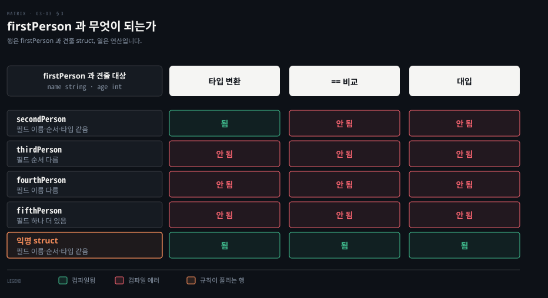

# struct 는 타입이 다른 값을 이름으로 묶습니다

---

> Learning Go 3장 끝입니다. 관련된 데이터를 한 타입으로 묶는 struct 와, struct 사이의 비교·변환 규칙을 다루고 장 끝 연습 문제를 풉니다.

## 핵심 요약

> 이 편이 매달린 하나의 생각은 struct 가 정해진 필드 이름과 타입으로 데이터를 묶어 map 이 못 하는 API 를 정의한다는 것입니다.

map 은 키를 제한할 수 없고 모든 값이 같은 타입이라서 함수 사이에 데이터를 넘기기에 알맞지 않습니다. 관련된 데이터를 묶을 때는 struct 를 정의합니다. struct 리터럴은 이름을 적는 모양이 유지보수에 낫고, 한 번만 쓰는 모양이라면 이름 없는 익명 struct 로 둡니다.

struct 끼리는 필드가 모두 비교 가능할 때만 `==` 로 비교할 수 있습니다. 타입이 다른 struct 는 비교할 수 없지만, 필드 이름·순서·타입이 모두 같으면 타입 변환이 됩니다. 한쪽이 익명 struct 라면 변환 없이 비교와 대입까지 됩니다.


## 학습 목표

> 이 편을 읽고 나면 아래 다섯 가지를 스스로 해낼 수 있습니다.

1. 관련 데이터를 map 대신 struct 로 묶어야 하는 이유를 설명할 수 있습니다.
2. struct 를 정의하고, 이름 없는 리터럴과 이름 있는 리터럴 중 알맞은 모양을 골라 쓸 수 있습니다.
3. 익명 struct 가 쓰이는 두 자리를 말할 수 있습니다.
4. struct 가 `==` 로 비교되는 조건과, 두 struct 타입 사이에 변환이 되는 조건을 말할 수 있습니다.
5. 익명 struct 가 끼면 비교·대입 규칙이 어떻게 풀리는지 설명할 수 있습니다.


## 1. struct 선언과 리터럴 — 관련 데이터는 map 이 아니라 struct 로 묶습니다

> map 은 키를 제한할 수 없고 값이 모두 같은 타입이라서 API 를 정의하지 못합니다. 관련 데이터를 묶을 때는 필드 이름과 타입을 정한 struct 를 씁니다.

사람 한 명의 이름·나이·반려동물을 함께 넘기고 싶다고 합시다. `map[string]string` 에 담으면 어떤 키가 올지 호출하는 쪽이 알 수 없습니다. 나이 같은 숫자도 문자열로 넣어야 합니다. 원문이 map 의 한계로 드는 것이 바로 이 둘입니다. 특정 키만 허용하도록 map 을 제한할 방법이 없어서 API 를 정의하지 못합니다. 또 map 의 모든 값은 같은 타입이어야 합니다. 그래서 map 은 함수 사이에 데이터를 넘기기에 알맞지 않습니다. 관련 데이터를 묶을 때는 struct 를 정의합니다.

객체지향 언어를 안다면 클래스와 struct 의 차이가 궁금할 것입니다. 원문의 답은 간단합니다. Go 에는 상속이 없어서 클래스도 없습니다. 객체지향의 기능이 아예 없다는 뜻은 아니고 방식이 조금 다를 뿐이며, 7장에서 다룹니다.

```go
type person struct {
	name string
	age  int
	pet  string
}
```

struct 타입은 `type` 키워드, struct 이름, `struct` 키워드, 중괄호 순서로 정의합니다. 중괄호 안에 필드를 적습니다. `var` 선언처럼 이름을 먼저 쓰고 타입을 뒤에 씁니다. map 리터럴과 달리 필드 사이에 쉼표가 없습니다. struct 타입은 함수 안에도 밖에도 정의할 수 있습니다. 함수 안에서 정의한 struct 는 그 함수 안에서만 쓸 수 있습니다. 원문은 엄밀히는 어느 블록 수준에든 struct 정의를 둘 수 있다고 덧붙입니다. 블록은 4장에서 다룹니다.

### 값을 주지 않으면 모든 필드가 제로 값입니다

struct 타입을 정의하면 그 타입의 변수를 선언할 수 있습니다.

```go
var fred person
bob := person{}
```

`fred` 는 값을 받지 않았으므로 `person` 의 제로 값을 받습니다. 제로 값 struct 는 모든 필드가 각 필드 타입의 제로 값입니다. `bob` 처럼 빈 struct 리터럴을 대입해도 결과가 같습니다. 원문은 여기서 map 과의 차이를 짚습니다. map 은 빈 리터럴과 nil 이 달랐지만(03-02 §3), struct 는 빈 리터럴을 대입하든 아무것도 대입하지 않든 모든 필드가 제로 값입니다.

### 리터럴은 이름을 적는 모양이 유지보수에 낫습니다

값이 있는 struct 리터럴은 두 모양이 있습니다. 첫째는 필드 값을 쉼표로 나열하는 모양입니다.

```go
julia := person{
	"Julia",
	40,
	"cat",
}
```

이 모양에서는 모든 필드에 값을 줘야 하고, 값은 struct 정의의 필드 순서대로 들어갑니다. 둘째는 map 리터럴처럼 필드 이름을 적는 모양입니다.

```go
beth := person{
	age:  30,
	name: "Beth",
}
```

필드 순서를 마음대로 쓸 수 있고, 모든 필드를 줄 필요도 없습니다. 적지 않은 필드는 제로 값입니다.

두 모양은 섞을 수 없습니다. 모든 필드를 이름과 함께 쓰거나, 아무 필드도 이름을 쓰지 않거나 둘 중 하나입니다. 이 노트를 쓰면서 섞어 보니 `mixture of field:value and value elements in struct literal` 로 컴파일되지 않았습니다.

원문의 기준은 이렇습니다. 필드를 늘 모두 채우는 작은 struct 라면 이름 없는 모양도 괜찮습니다. 그 밖에는 이름을 씁니다. 길어지지만 struct 정의를 보지 않고도 어느 값이 어느 필드에 가는지 분명합니다. 유지보수에도 낫습니다. 이름 없이 초기화한 코드는 struct 에 필드가 추가되는 순간 컴파일이 깨집니다.

필드는 점 표기로 읽고 씁니다. map 이 대괄호로 읽기와 쓰기를 모두 하듯 struct 는 점 표기로 둘 다 합니다.

```go
bob.name = "Bob"
fmt.Println(bob.name)
```


## 2. 익명 struct — 한 번만 쓰는 모양에는 이름을 붙이지 않습니다

> struct 타입에 이름을 붙이지 않고 변수 하나에 바로 struct 모양을 줄 수 있습니다. 외부 데이터와 오가는 변환과 표 기반 테스트에서 자주 씁니다.

struct 타입에 먼저 이름을 붙이지 않고 변수가 struct 모양을 갖게 할 수 있습니다. 이것을 **익명 struct(anonymous struct)**라 합니다.

```go
var person struct {
	name string
	age  int
	pet  string
}
person.name = "bob"
person.age = 50
person.pet = "dog"

pet := struct {
	name string
	kind string
}{
	name: "Fido",
	kind: "dog",
}
```

`person` 과 `pet` 의 타입은 모두 익명 struct 입니다. 필드를 읽고 쓰는 법은 이름 있는 struct 와 같고, struct 리터럴로 초기화하는 것도 같습니다.

인스턴스 하나에만 묶인 타입이 언제 쓸모 있을까요? 원문은 흔한 자리 둘을 듭니다.

1. 외부 데이터를 struct 로 옮기거나 struct 를 외부 데이터로 옮길 때입니다. JSON 이나 Protocol Buffers 가 그 예이고, 각각 언마샬링과 마샬링이라 합니다. 뒤의 "encoding/json" 절에서 다룹니다.
2. 테스트를 쓸 때입니다. 15장의 표 기반 테스트에서 익명 struct 의 slice 를 씁니다.


## 3. struct 비교와 변환 — 필드가 같으면 변환되고, 익명 struct 는 비교까지 됩니다

> struct 는 필드가 모두 비교 가능할 때만 `==` 로 비교됩니다. 타입이 다른 struct 는 비교할 수 없지만 필드 이름·순서·타입이 같으면 변환이 되고, 한쪽이 익명 struct 면 변환 없이 비교와 대입이 됩니다.

struct 를 `==` 로 비교할 수 있는지는 필드에 달렸습니다. 필드가 모두 비교 가능한 타입이면 그 struct 도 비교할 수 있습니다. slice 나 map 필드가 있으면 비교할 수 없습니다. 원문은 뒤 장에서 보듯 함수와 채널 필드도 비교를 막는다고 덧붙입니다. 이 노트를 쓰면서 `[]string` 필드가 있는 struct 를 비교하니 `struct containing []string cannot be compared` 가 났습니다.

> **원문 정오**: 원문 3장과 4장은 채널을 비교할 수 없는 타입으로 묶지만 사실과 다릅니다. Go 명세는 "Channel types are comparable" 이라 적고, 같은 `make` 호출로 만든 두 채널 값이나 둘 다 `nil` 인 값을 같다고 봅니다. 이 노트를 쓰면서 `go1.25.1` 에서 확인하니 같은 채널 두 값의 `==` 는 `true` 였고, 채널로 `switch` 하는 코드와 채널 필드만 가진 struct 끼리의 `==` 도 컴파일되어 `true` 를 찍었습니다. 비교할 수 없는 것은 slice·map·함수, 그리고 그런 필드를 가진 struct 입니다.

Python 이나 Ruby 와 달리 Go 에는 같음을 다시 정의해 비교할 수 없는 struct 에 `==`·`!=` 를 쓰게 해 주는 매직 메서드가 없습니다. 비교 함수를 직접 쓸 수는 있습니다. Java 의 `equals` 재정의에 해당하는 장치가 없는 셈입니다(원문 밖의 비교).

### 타입이 다르면 비교할 수 없지만, 필드가 같으면 변환은 됩니다

Go 가 서로 다른 기본 타입의 변수를 비교하지 않듯, 서로 다른 struct 타입의 변수도 비교하지 않습니다. 대신 두 struct 의 필드 이름·순서·타입이 모두 같으면 한 struct 타입에서 다른 struct 타입으로 변환할 수 있습니다. 원문은 아래 `firstPerson` 을 기준으로 네 타입을 차례로 견줍니다.

```go
type firstPerson struct {
	name string
	age  int
}
```

- `secondPerson`: 필드가 `name string`, `age int` 로 같습니다. 변환은 되지만 `==` 비교는 안 됩니다. 타입이 다르기 때문입니다.
- `thirdPerson`: 필드가 `age int`, `name string` 순서라서 변환도 안 됩니다.
- `fourthPerson`: 첫 필드 이름이 `firstName` 이라서 변환이 안 됩니다.
- `fifthPerson`: `favoriteColor` 필드가 하나 더 있어서 변환이 안 됩니다.

이 노트를 쓰면서 넷을 모두 빌드해 원문 설명대로 되는 것을 확인했습니다. `secondPerson(f)` 는 컴파일됐고, `f == secondPerson{}` 은 `mismatched types firstPerson and secondPerson`, 나머지 셋의 변환은 `cannot convert` 로 막혔습니다. 원문이 따로 다루지 않는 대입도 시험해 봤습니다. `secondPerson` 변수에 `firstPerson` 값을 변환 없이 넣으니 `cannot use ... as secondPerson value in assignment` 로 막혔습니다.

Java 에서는 필드가 똑같아도 이름이 다른 두 클래스 사이에 형변환이 안 됩니다. Go 는 이름이 다르면 비교·대입은 막지만, 필드가 완전히 같으면 명시적 변환은 허용합니다. 이 비교는 원문 밖의 것입니다.

### 익명 struct 가 끼면 변환 없이 비교와 대입이 됩니다

원문은 익명 struct 에 작은 반전이 있다고 말합니다. 비교하는 두 struct 변수 가운데 적어도 하나가 익명 struct 타입이고 두 struct 의 필드 이름·순서·타입이 같으면, 변환 없이 비교할 수 있습니다. 같은 조건에서 이름 있는 struct 와 익명 struct 사이에 대입도 됩니다.

```go
type firstPerson struct {
	name string
	age  int
}
f := firstPerson{
	name: "Bob",
	age:  50,
}
var g struct {
	name string
	age  int
}

// compiles -- can use = and == between identical named and anonymous structs
g = f
fmt.Println(f == g)
```

이 노트를 쓰면서 돌리니 컴파일되고 `true` 가 찍혔습니다. 아래 행렬이 이 절의 규칙을 한 장에 모은 것입니다. 행은 `firstPerson` 과 견줄 struct, 열은 연산입니다.



`secondPerson` 행은 변환 칸만 초록입니다. 필드가 같아도 이름 있는 두 타입은 변환이라는 명시적 한 단계를 거쳐야 한다는 뜻입니다. 맨 아래 익명 struct 행은 세 칸이 모두 초록이고, 이것이 원문이 말한 반전입니다. 원문이 직접 말하지 않는 칸, 곧 대입 열의 위 네 칸과 익명 struct 행의 변환 칸은 이 노트의 빌드로 채웠습니다.


## 연습 문제

> 원문 연습 문제 세 개를 `go1.25.1` 에서 풀어 결과를 확인했습니다. 원문의 정답은 책의 Chapter 3 저장소에 있습니다.

### 1. 인사말 slice 를 세 부분 slice 로 자르기

`greetings` 라는 문자열 slice 에 `"Hello"`, `"Hola"`, `"नमस्कार"`, `"こんにちは"`, `"Привіт"` 을 넣는 문제입니다. 처음 두 값, 둘째~넷째 값, 넷째~다섯째 값으로 부분 slice 셋을 만들어 넷을 모두 출력합니다. [03-01](./03-01.slice%20%EB%8A%94%20%EB%B0%B0%EC%97%B4%EC%9D%84%20%EB%82%98%EB%88%A0%20%EC%93%B0%EB%8A%94%20%EC%B0%BD%EC%9E%85%EB%8B%88%EB%8B%A4.md) §5 의 slice 식으로 풉니다.

```go
greetings := []string{"Hello", "Hola", "नमस्कार", "こんにちは", "Привіт"}
fmt.Println(greetings, greetings[:2], greetings[1:4], greetings[3:])
```

```bash
[Hello Hola नमस्कार こんにちは Привіт] [Hello Hola] [Hola नमस्कार こんにちは] [こんにちは Привіт]
```

slice 원소 단위로 자르므로 글자가 여러 바이트인 인사말도 깨지지 않습니다. 03-02 §1 의 문자열 slice 식과 다른 점입니다.

### 2. 문자열의 넷째 룬을 문자로 출력하기

`message` 라는 문자열 변수에 `"Hi"` 와 이모지 둘이 든 값을 넣고, 넷째 룬을 숫자가 아니라 문자로 출력하는 문제입니다. PDF 추출본에서 원문의 이모지 두 개가 빠져 있어 어떤 이모지였는지 알 수 없습니다. 여기서는 `"Hi 👧 and 👦"` 로 풀었습니다. 룬 slice 로 바꾼 뒤 인덱스로 꺼내 `string` 으로 바꿉니다.

```go
message := "Hi 👧 and 👦"
runes := []rune(message)
fmt.Println(string(runes[3])) // 👧
```

문자열에 바로 `message[3]` 을 쓰면 룬이 아니라 이모지 첫 바이트의 값 `240` 이 나옵니다. 03-02 §1 의 함정이 그대로 드러나는 자리입니다.

### 3. Employee struct 를 세 가지 방법으로 만들기

`firstName`·`lastName`(`string`)과 `id`(`int`) 필드를 갖는 `Employee` struct 를 정의하고, 이름 없는 리터럴·이름 있는 리터럴·`var` 선언 뒤 점 표기로 채우기, 세 방법으로 인스턴스를 만들어 출력하는 문제입니다. §1 의 세 모양을 차례로 씁니다.

```go
type Employee struct {
	firstName string
	lastName  string
	id        int
}

e1 := Employee{"Ada", "Lovelace", 1}
e2 := Employee{firstName: "Alan", lastName: "Turing", id: 2}
var e3 Employee
e3.firstName = "Grace"
e3.lastName = "Hopper"
e3.id = 3
fmt.Println(e1)
fmt.Println(e2)
fmt.Println(e3)
```

```bash
{Ada Lovelace 1}
{Alan Turing 2}
{Grace Hopper 3}
```


## 핵심 개념 체크리스트

목표 번호 순서대로 짝지었습니다.

- [ ] (목표 1) 함수 사이에 데이터를 넘길 때 map 이 알맞지 않은 이유 둘을 말할 수 있습니까?
- [ ] (목표 2) 이름 없는 struct 리터럴에서 필드 값이 들어가는 순서와, 이 모양이 필드 추가에 약한 이유를 설명할 수 있습니까?
- [ ] (목표 2) `var fred person` 과 `bob := person{}` 의 결과가 같은 이유를, map 의 nil 과 빈 리터럴 차이와 견줘 말할 수 있습니까?
- [ ] (목표 3) 익명 struct 가 흔히 쓰이는 자리 둘을 댈 수 있습니까?
- [ ] (목표 4) slice 필드가 있는 struct 를 `==` 로 비교하면 어떻게 됩니까?
- [ ] (목표 4) `thirdPerson`·`fourthPerson`·`fifthPerson` 이 `firstPerson` 에서 변환되지 않는 이유를 하나씩 말할 수 있습니까?
- [ ] (목표 5) `g = f` 와 `f == g` 가 컴파일되려면 `g` 가 어떤 타입이어야 합니까?


## 관련 문서

- [03-02 문자열은 바이트이고 map 은 없는 키에 제로 값을 돌려줍니다](./03-02.%EB%AC%B8%EC%9E%90%EC%97%B4%EC%9D%80%20%EB%B0%94%EC%9D%B4%ED%8A%B8%EC%9D%B4%EA%B3%A0%20map%20%EC%9D%80%20%EC%97%86%EB%8A%94%20%ED%82%A4%EC%97%90%20%EC%A0%9C%EB%A1%9C%20%EA%B0%92%EC%9D%84%20%EB%8F%8C%EB%A0%A4%EC%A4%8D%EB%8B%88%EB%8B%A4.md) — 3장 가운데. 문자열과 map
- [03-01 slice 는 배열을 나눠 쓰는 창입니다](./03-01.slice%20%EB%8A%94%20%EB%B0%B0%EC%97%B4%EC%9D%84%20%EB%82%98%EB%88%A0%20%EC%93%B0%EB%8A%94%20%EC%B0%BD%EC%9E%85%EB%8B%88%EB%8B%A4.md) — 3장 앞 절반. 배열과 slice
- [Learning Go 2판 — 정독 인덱스](./README.md) — 16장 전체 지도


## 참고 자료

- 원본: 《Learning Go, 2nd Edition》 (Jon Bodner, O'Reilly)
- 다룬 범위: Chapter 3 "Structs" 부터 장 끝과 연습 문제까지
