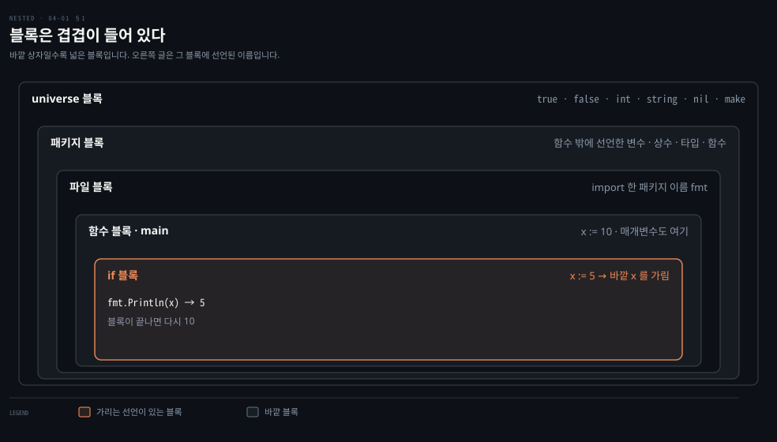

# 안쪽 블록의 같은 이름은 바깥 변수를 가립니다

---

> Learning Go 4장 앞 부분입니다. 선언이 놓이는 자리인 블록, 안쪽 블록에서 같은 이름을 다시 선언할 때 생기는 섀도잉, 그리고 조건에만 쓰는 변수를 선언할 수 있는 `if` 문을 다룹니다.

## 핵심 요약

> 이 편이 매달린 하나의 생각은 Go 의 이름이 블록 단위로 살고 죽으며, 안쪽 블록에서 같은 이름을 선언하면 바깥 것이 그 블록 안에서 보이지 않게 된다는 것입니다.

블록은 universe·패키지·파일·함수·중괄호 블록으로 겹겹이 들어 있습니다. 안쪽 블록은 바깥 블록의 이름을 쓸 수 있습니다. 다만 같은 이름을 새로 선언하면 바깥 것을 가립니다. 가려진 변수는 사라지거나 바뀌지 않습니다. 그 블록이 끝나면 다시 보입니다.

가장 흔한 사고는 `:=` 에서 납니다. `:=` 는 지금 블록에 선언된 변수만 다시 쓰므로, 바깥 변수에 대입하려던 코드가 새 변수를 만들어 버립니다. `go vet` 은 이를 잡지 않습니다. `if` 문은 조건 앞에 변수를 선언해 그 변수를 `if`/`else` 안에만 가둘 수 있습니다.


## 학습 목표

> 이 편을 읽고 나면 아래 다섯 가지를 스스로 해낼 수 있습니다.

1. universe·패키지·파일·함수 블록이 무엇을 담는지 말하고, 안쪽 블록에서 바깥 이름을 쓸 수 있다는 규칙을 설명할 수 있습니다.
2. 섀도잉 코드의 출력을 실행 전에 예측하고, 가려진 변수가 사라지지 않는다는 것을 설명할 수 있습니다.
3. `:=` 가 바깥 변수를 가리는 조건을 설명하고, 이를 피하는 선언 방식을 고를 수 있습니다.
4. 패키지 이름이나 `true` 같은 미리 선언된 식별자를 가리면 무슨 일이 생기는지 말할 수 있습니다.
5. `if` 문의 조건 앞에 변수를 선언하고, 그 변수가 어디까지 보이는지 설명할 수 있습니다.


## 1. 블록 — 선언이 놓이는 자리가 이름이 보이는 범위를 정합니다

> 선언이 놓이는 곳마다 블록이 있고, 블록은 겹겹이 들어 있습니다. 안쪽 블록은 바깥 블록에서 선언한 이름을 쓸 수 있습니다.

변수는 함수 밖에도, 함수의 매개변수로도, 함수 안의 지역 변수로도 선언할 수 있습니다. 같은 이름을 여러 자리에서 선언하면 어느 것이 쓰일까요? 이 물음에 답하려면 먼저 선언이 놓이는 자리를 나눠야 합니다. 원문은 선언이 놓이는 각 자리를 **블록(block)**이라 부릅니다.

- 패키지 블록: 어떤 함수에도 속하지 않게 선언한 변수·상수·타입·함수가 여기 놓입니다.
- 파일 블록: `import` 문이 만든 다른 패키지의 이름이 놓입니다. 이 이름은 그 `import` 문이 있는 파일에서만 유효합니다. `import` 는 10장에서 자세히 다룹니다.
- 함수 블록: 함수 최상위에 선언한 변수가 놓이고, 함수의 매개변수도 여기 속합니다. 매개변수가 있는 함수는 5장에서 씁니다.
- 중괄호 블록: 함수 안에서는 중괄호 `{}` 한 쌍마다 블록이 하나 더 생깁니다. 곧 보듯 Go 의 제어문도 각자 블록을 만듭니다.

안쪽 블록에서는 바깥 어느 블록의 식별자든 쓸 수 있습니다. 그렇다면 바깥 블록에 있는 이름을 안쪽 블록에서 다시 선언하면 어떻게 될까요? 원문의 답은 바깥 블록에서 만든 식별자를 가린다(shadow)는 것이고, 그 동작이 §2 입니다.

### universe 블록에는 int 와 true 같은 이름이 있습니다

블록이 하나 더 있는데, 원문은 조금 이상하다고 소개합니다. Go 는 키워드가 25개뿐인 작은 언어입니다. 그런데 `int`·`string` 같은 내장 타입, `true`·`false` 같은 상수, `make`·`close` 같은 함수, 그리고 `nil` 은 그 25개에 들어 있지 않습니다. 이 이름들은 어디에 있을까요?

Go 는 이것들을 키워드로 만들지 않고 **미리 선언된 식별자(predeclared identifier)**로 봅니다. 그리고 다른 모든 블록을 담는 **universe 블록**에 정의합니다. 아래 그림이 지금까지의 블록을 바깥에서 안쪽으로 겹친 모습입니다.



가장 바깥 상자가 universe 블록이고, 가장 안쪽 주황 상자가 §2 의 예제 4-1 에서 `x` 를 다시 선언하는 `if` 블록입니다. 오른쪽 글은 각 블록에 선언된 이름의 예입니다. universe 블록의 이름도 결국 한 블록에 선언된 이름이라서, 다른 블록에서 가릴 수 있습니다. 이것이 §2 의 마지막 함정입니다.


## 2. 섀도잉 — 같은 이름을 다시 선언하면 그 블록이 끝날 때까지 바깥 것이 안 보입니다

> 안쪽 블록에서 바깥과 같은 이름으로 변수를 선언하면, 그 변수가 있는 동안 바깥 변수에 접근할 수 없습니다. `:=` 로 이런 일이 가장 쉽게 일어나고, `go vet` 은 이를 경고하지 않습니다.

원문은 섀도잉을 설명하기 전에 코드부터 보여 주고 출력을 맞혀 보게 합니다(원문 예제 4-1).

```go
func main() {
	x := 10
	if x > 5 {
		fmt.Println(x)
		x := 5
		fmt.Println(x)
	}
	fmt.Println(x)
}
```

원문이 내놓는 보기는 셋입니다.

1. 컴파일되지 않아 아무것도 찍히지 않습니다.
2. 첫 줄 10, 둘째 줄 5, 셋째 줄 5 가 찍힙니다.
3. 첫 줄 10, 둘째 줄 5, 셋째 줄 10 이 찍힙니다.

답을 정한 뒤 읽어 보십시오. 실제 출력은 3번, 곧 `10`, `5`, `10` 이고 이 노트를 쓰면서 돌린 결과도 같았습니다.

**가리는 변수(shadowing variable)**는 바깥 블록의 변수와 같은 이름을 가진 변수입니다. 가리는 변수가 있는 동안에는 가려진 변수에 접근할 수 없습니다.

원문은 이 코드를 쓴 사람이 `if` 안에서 새 `x` 를 만들 생각은 거의 없었을 것이라고 봅니다. 함수 블록의 `x` 에 5 를 대입하려던 것입니다. 한 줄씩 따라가면 이렇습니다.

- 첫 `fmt.Println` 에서는 함수 블록의 `x` 가 보여 10 이 찍힙니다.
- 다음 줄 `x := 5` 가 `if` 본문 블록 안에 같은 이름의 새 변수를 선언해 `x` 를 가립니다.
- 둘째 `fmt.Println` 은 가리는 변수를 보므로 5 를 찍습니다.
- `if` 본문의 닫는 중괄호에서 가리는 `x` 가 있던 블록이 끝나고, 셋째 `fmt.Println` 은 다시 함수 블록의 `x`, 곧 10 을 봅니다.

바깥 `x` 는 사라지거나 다시 대입된 적이 없습니다. 원문의 표현대로 안쪽 블록에서 가려진 동안 접근할 방법이 없었을 뿐입니다. Java 에서는 지역 변수를 안쪽 블록에서 같은 이름으로 다시 선언하면 컴파일 에러입니다. Go 는 이를 허용하므로 이런 실수가 컴파일을 통과합니다. 이 비교는 원문 밖의 것입니다.

### := 는 지금 블록의 변수만 다시 쓰므로 바깥 변수를 가립니다

02-02 에서 원문이 `:=` 를 피할 때가 있다고 한 이유가 여기 있습니다. 원문은 이것을 "앞 장" 에서 말했다고 적습니다. 그 권고는 3장이 아니라 2장에 있습니다. `:=` 를 쓰면 실수로 변수를 가리기가 아주 쉽습니다. `:=` 는 여러 변수를 한꺼번에 만들고 대입할 수 있고, 왼쪽의 모든 변수가 새것일 필요도 없습니다. 새 변수가 하나라도 있으면 됩니다(원문 예제 4-2).

```go
func main() {
	x := 10
	if x > 5 {
		x, y := 5, 20
		fmt.Println(x, y)
	}
	fmt.Println(x)
}
```

```bash
5 20
10
```

바깥 블록에 `x` 가 이미 있는데도 `if` 안에서 `x` 가 가려졌습니다. 원문의 설명은 `:=` 가 지금 블록에 선언된 변수만 다시 쓴다는 것입니다. `y` 가 새 변수라서 문법은 맞습니다. `x` 는 지금 블록에 없으니 새로 만들어집니다. 원문은 `:=` 를 쓸 때 가릴 의도가 아니라면 왼쪽에 바깥 스코프의 변수를 두지 말라고 합니다. 02-02 §1 의 권고, 곧 새 변수는 `var` 로 선언하고 대입은 `=` 로 하라는 것이 이 사고를 막는 방법입니다.

### 패키지 이름을 가리면 그 패키지를 쓸 수 없습니다

`import` 한 패키지 이름도 가릴 수 있습니다. 원문 예제 4-3 은 `main` 안에 `fmt` 라는 변수를 선언합니다.

```go
func main() {
	x := 10
	fmt.Println(x)
	fmt := "oops"
	fmt.Println(fmt)
}
```

```bash
fmt.Println undefined (type string has no field or method Println)
```

이 에러 메시지는 원문과 `go1.25.1` 에서 같았습니다. 원문은 문제가 변수 이름을 `fmt` 로 지은 데 있지 않다고 짚습니다. 지역 변수 `fmt` 에 없는 것에 접근하려 한 데 있습니다. 지역 변수 `fmt` 가 선언되는 순간 파일 블록의 `fmt` 패키지를 가리므로, `main` 의 남은 부분에서는 `fmt` 패키지를 쓸 수 없습니다.

### universe 블록의 true 도 가릴 수 있습니다

§1 에서 본 universe 블록의 이름도 다른 스코프에서 가릴 수 있습니다(원문 예제 4-4).

```go
fmt.Println(true)
true := 10
fmt.Println(true)
```

```bash
true
10
```

`true` 가 정수 10 이 되었습니다. 원문은 universe 블록의 식별자를 절대 다시 정의하지 말라고 경고합니다. 운이 좋으면 컴파일 에러가 나지만, 운이 나쁘면 이상한 동작의 원인을 찾기가 훨씬 어려워집니다.

### go vet 은 섀도잉을 보고하지 않습니다

섀도잉은 쓸모 있는 경우가 몇 있어서(뒤 장에서 짚습니다) `go vet` 은 이것을 에러 후보로 보고하지 않습니다. 이 노트를 쓰면서 예제 4-1·4-2·4-4 를 한 파일에 넣고 `go vet` 을 돌리니 아무 경고 없이 끝났습니다. 원문은 실수로 생긴 섀도잉을 찾는 서드파티 도구를 "Using Code-Quality Scanners" 절(11장)에서 소개합니다.


## 3. if — 조건 앞에 선언한 변수는 if/else 안에서만 삽니다

> Go 의 `if` 는 조건을 괄호로 감싸지 않는 것 말고는 다른 언어와 비슷합니다. 다른 점은 조건 앞에 변수를 선언해, 그 변수를 조건과 모든 `if`/`else` 블록에만 가둘 수 있다는 것입니다.

`if` 는 워낙 익숙해서 원문도 앞 장들에서 설명 없이 써 왔습니다. 좀 더 완전한 예가 원문 예제 4-5 입니다.

```go
n := rand.Intn(10)
if n == 0 {
	fmt.Println("That's too low")
} else if n > 5 {
	fmt.Println("That's too big:", n)
} else {
	fmt.Println("That's a good number:", n)
}
```

다른 언어와 가장 눈에 띄게 다른 점은 조건을 괄호로 감싸지 않는다는 것입니다. 원문은 Go 가 `if` 에 변수를 더 잘 관리하게 돕는 기능을 더했다고만 적습니다. 무엇이 불편했는지는 노트의 풀이로 적으면 이렇습니다. `n` 은 `if`/`else` 판단에만 쓰이는데, 함수 블록에 선언되어 그 뒤로도 계속 보입니다.

### 조건 앞의 선언으로 변수를 if/else 에 가둡니다

`if` 나 `else` 의 중괄호 안에서 선언한 변수가 그 블록에서만 사는 것은 대부분의 언어에서 같습니다. Go 가 더하는 것은 조건과 `if`·`else` 블록 모두에서 보이는 변수를 선언하는 방법입니다. 예제 4-5 를 이렇게 고친 것이 원문 예제 4-6 입니다.

```go
if n := rand.Intn(10); n == 0 {
	fmt.Println("That's too low")
} else if n > 5 {
	fmt.Println("That's too big:", n)
} else {
	fmt.Println("That's a good number:", n)
}
```

조건 앞에 `n := rand.Intn(10);` 을 두었습니다. 원문은 이 특별한 스코프가 변수를 필요한 곳에서만 쓰게 해 줘서 편하다고 말합니다. `if`/`else` 가 끝나면 `n` 은 정의되지 않은 상태가 됩니다. 원문 예제 4-7 처럼 그 뒤에 `fmt.Println(n)` 을 쓰면 컴파일되지 않습니다. 이 노트를 쓰면서 확인한 메시지도 원문과 같은 `undefined: n` 이었습니다.

Java 에는 조건 앞에 변수를 선언하는 `if` 문법이 없습니다. 같은 효과를 내려면 `if` 를 중괄호 블록으로 한 번 더 감싸야 합니다. 이 비교는 원문 밖의 것입니다.

### 조건 앞에는 새 변수 선언만 둡니다

원문은 두 가지를 덧붙입니다. 엄밀히는 조건 앞에 어떤 단순 문장이든 둘 수 있습니다. 값을 돌려주지 않는 함수 호출이나 기존 변수에 새 값을 대입하는 것도 됩니다. 하지만 원문은 그렇게 하지 말라고 합니다. 이 기능은 `if`/`else` 에 가둘 새 변수를 선언할 때만 쓰고, 그 밖의 용도는 혼란스럽다는 것입니다.

또 조건 앞에서 선언한 변수도 다른 블록의 변수처럼 바깥 블록의 같은 이름을 가립니다. §2 의 함정이 `if` 의 조건 자리에서도 똑같이 일어날 수 있습니다.


## 핵심 개념 체크리스트

목표 번호 순서대로 짝지었습니다.

- [ ] (목표 1) 패키지 블록·파일 블록·함수 블록에 각각 무엇이 놓이는지 말할 수 있습니까?
- [ ] (목표 1) `int`·`true`·`make`·`nil` 이 키워드가 아니면 어디에 있는지 말할 수 있습니까?
- [ ] (목표 2) 예제 4-1 의 세 줄 출력을 예측하고, 셋째 줄이 10 인 이유를 설명할 수 있습니까?
- [ ] (목표 3) `x, y := 5, 20` 이 바깥 `x` 에 대입하지 않고 새 `x` 를 만드는 이유를 설명할 수 있습니까?
- [ ] (목표 3) 이런 섀도잉을 `go vet` 이 잡아 주는지, 잡지 않는다면 무엇으로 찾는지 말할 수 있습니까?
- [ ] (목표 4) 함수 안에서 `fmt := "oops"` 를 선언한 뒤 `fmt.Println` 이 왜 실패하는지 설명할 수 있습니까?
- [ ] (목표 5) `if n := rand.Intn(10); n == 0 { ... }` 에서 `n` 이 보이는 범위를 말하고, 조건 앞에 두지 말아야 할 문장을 댈 수 있습니까?


## 관련 문서

- [04-02 for 하나로 네 가지 반복을 씁니다](./04-02.for%20%ED%95%98%EB%82%98%EB%A1%9C%20%EB%84%A4%20%EA%B0%80%EC%A7%80%20%EB%B0%98%EB%B3%B5%EC%9D%84%20%EC%94%81%EB%8B%88%EB%8B%A4.md) — 4장 가운데. for 네 형태
- [02-02 var 와 짧은 선언은 의도를 드러내는 선택입니다](./02-02.var%20%EC%99%80%20%EC%A7%A7%EC%9D%80%20%EC%84%A0%EC%96%B8%EC%9D%80%20%EC%9D%98%EB%8F%84%EB%A5%BC%20%EB%93%9C%EB%9F%AC%EB%82%B4%EB%8A%94%20%EC%84%A0%ED%83%9D%EC%9E%85%EB%8B%88%EB%8B%A4.md) — 2장. `:=` 를 피할 경우
- [Learning Go 2판 — 정독 인덱스](./README.md) — 16장 전체 지도


## 참고 자료

- 원본: 《Learning Go, 2nd Edition》 (Jon Bodner, O'Reilly)
- 다룬 범위: Chapter 4 도입부터 "if" 까지
