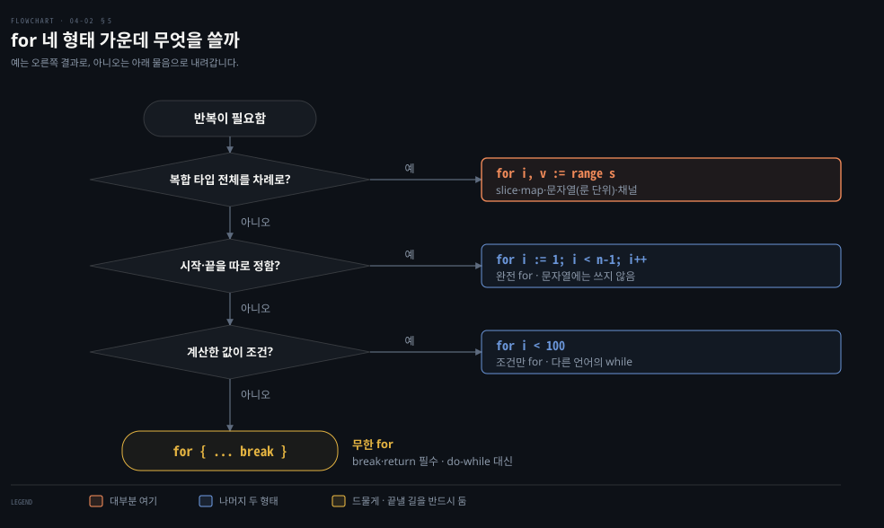

# for 하나로 네 가지 반복을 씁니다

---

> Learning Go 4장 가운데입니다. Go 에 하나뿐인 반복 키워드 `for` 의 네 가지 형태와 `break`·`continue`·라벨, 그리고 `for-range` 가 map·문자열을 돌 때의 특별한 동작을 다룹니다.

## 핵심 요약

> 이 편이 매달린 하나의 생각은 Go 가 반복 키워드를 `for` 하나로 줄이고, 필요한 모양은 `for` 의 부분을 빼거나 `range` 를 붙여서 얻는다는 것입니다.

완전 `for`, 조건만 있는 `for`, 무한 `for`, `for-range` 가 그 네 형태입니다. `while` 도 `do-while` 도 없고, 각각 조건만 있는 `for` 와 무한 `for` 에 `break` 를 넣은 모양으로 씁니다. 대부분의 반복은 `for-range` 로 씁니다.

`for-range` 에는 알아 둘 동작이 넷 있습니다. map 은 돌 때마다 순서가 달라지고, 문자열은 바이트가 아니라 룬 단위로 돕니다. 값 변수는 원소의 사본이라 고쳐도 원본이 바뀌지 않습니다. Go 1.22 부터는 반복마다 루프 변수를 새로 만듭니다.


## 학습 목표

> 이 편을 읽고 나면 아래 다섯 가지를 스스로 해낼 수 있습니다.

1. `for` 의 네 형태를 쓰고, Go 에 `while`·`do-while` 이 없을 때 대신 쓰는 모양을 말할 수 있습니다.
2. `continue` 로 중첩 `if`/`else` 를 펴서 조건을 한 줄로 세울 수 있습니다.
3. `for-range` 로 slice·map·문자열을 돌고, map 순서가 매번 다른 이유와 문자열 인덱스가 건너뛰는 이유를 설명할 수 있습니다.
4. `for-range` 의 값 변수가 사본이라는 것과, Go 1.22 의 루프 변수 변경이 무엇을 바꿨는지 설명할 수 있습니다.
5. 라벨로 바깥 루프를 `continue` 하고, 상황에 맞는 `for` 형태를 고를 수 있습니다.


## 1. for 네 형태 — 반복 키워드는 for 하나뿐입니다

> Go 는 C 계열 언어처럼 `for` 로 반복하지만 반복 키워드가 `for` 하나뿐입니다. 완전 `for`, 조건만 `for`, 무한 `for`, `for-range` 네 형태로 모든 반복을 씁니다.

Java 개발자는 `for`, `while`, `do-while`, 향상된 `for` 를 골라 씁니다. Go 에는 `for` 하나만 있습니다. 원문은 Go 가 `for` 키워드를 네 형태로 써서 이 모든 일을 한다고 소개합니다.

1. C 스타일의 완전 `for`
2. 조건만 있는 `for`
3. 무한 `for`
4. `for-range`

`for-range` 는 §3 에서 따로 다루고, 여기서는 앞의 셋을 봅니다.

### 완전 for 는 초기화·조건·증감 세 부분으로 됩니다

C·Java·JavaScript 에서 본 모양입니다(원문 예제 4-8). 0 부터 9 까지 찍습니다.

```go
for i := 0; i < 10; i++ {
	fmt.Println(i)
}
```

`if` 처럼 부분들을 괄호로 감싸지 않습니다. 세 부분은 세미콜론으로 나뉩니다.

> **원문 정오**: 원문은 이 자리에서 "The if statement has three parts, separated by semicolons" 라고 적습니다. 문맥상 `for` 문 설명이므로 `if` 가 아니라 `for` 가 맞습니다. 책 전체 PDF 를 검색해 보니 이 문장은 4장에 한 번만 나옵니다.

- 초기화: 루프가 시작되기 전에 변수 하나 이상을 정합니다. 원문이 기억하라는 점이 둘 있습니다. 변수는 반드시 `:=` 로 초기화해야 하고 `var` 는 안 됩니다. 또 `if` 의 변수 선언처럼 여기서도 바깥 변수를 가릴 수 있습니다(04-01 §2).
  이 노트를 쓰면서 `for var i = 0; ...` 을 써 보니 `syntax error: var declaration not allowed in for initializer` 가 났습니다.
- 조건: `bool` 로 평가되는 식이어야 합니다. 매 반복 직전에 확인하고, `true` 면 본문을 실행합니다.
- 증감: 보통 `i++` 을 쓰지만 어떤 대입이든 됩니다. 매 반복 직후, 조건을 평가하기 전에 실행됩니다.

> **원문 정오**: 원문은 증감 자리의 흔한 예를 `i{plus}{plus}` 로 인쇄했습니다. 원고의 AsciiDoc 속성 `{plus}` 가 `+` 로 바뀌지 않고 남은 것으로 보이며, 뜻은 `i++` 입니다. 책 전체에서 이 한 곳에만 있습니다.

세 부분 가운데 하나 이상을 뺄 수 있습니다. 원문이 흔하다고 드는 경우는 둘입니다. 루프 전에 계산한 값으로 시작하면 초기화를 빼고, 본문 안에 더 복잡한 증감 규칙이 있으면 증감을 뺍니다.

```go
i := 0
for ; i < 10; i++ {
	fmt.Println(i)
}

for i := 0; i < 10; {
	fmt.Println(i)
	if i%2 == 0 {
		i++
	} else {
		i += 2
	}
}
```

### 조건만 있는 for 가 while 입니다

초기화와 증감을 둘 다 빼면 세미콜론도 쓰지 않습니다. 써도 `go fmt` 가 지웁니다. 이것이 C·Java·JavaScript·Python·Ruby 의 `while` 에 해당합니다(원문 예제 4-9).

```go
i := 1
for i < 100 {
	fmt.Println(i)
	i = i * 2
}
```

### 무한 for 는 조건까지 뺀 모양입니다

셋째 형태는 조건도 없앱니다. 원문은 1980년대 BASIC 으로 처음 짠 무한 루프 `10 PRINT "HELLO"`, `20 GOTO 10` 을 떠올리며 그 Go 판을 보여 줍니다(원문 예제 4-10).

```go
package main

import "fmt"

func main() {
	for {
		fmt.Println("Hello")
	}
}
```

`Hello` 가 끝없이 찍히고, 멈추려면 Ctrl-C 를 누릅니다. Go Playground 에서 돌리면 몇 초 뒤에 멈추는데, 공유 자원이라 한 프로그램이 오래 도는 것을 막기 때문입니다(01-01 §7).


## 2. break 와 continue — 무한 for 를 끝내고 중첩 if 를 폅니다

> `break` 는 루프를 바로 빠져나가고 `continue` 는 남은 본문을 건너뛰고 다음 반복으로 갑니다. `do-while` 은 무한 `for` 끝의 `if` 와 `break` 로, 중첩 `if`/`else` 는 `continue` 로 폅니다.

키보드나 전원 없이 무한 `for` 를 빠져나오는 방법이 `break` 입니다. 다른 언어의 `break` 처럼 루프를 즉시 빠져나가고, 무한 `for` 뿐 아니라 모든 `for` 에 쓸 수 있습니다.

### do-while 은 무한 for 끝의 if 로 흉내 냅니다

Go 에는 Java·C·JavaScript 의 `do` 키워드가 없습니다. 적어도 한 번은 돌아야 할 때 원문이 권하는 가장 깔끔한 방법은 `if` 로 끝나는 무한 `for` 입니다. 원문은 Java 의 `do/while` 을 이렇게 옮깁니다.

```java
do {
    // things to do in the loop
} while (CONDITION);
```

```go
for {
	// things to do in the loop
	if !CONDITION {
		break
	}
}
```

조건 앞에 `!` 가 붙은 것을 원문이 짚습니다. Go 코드는 루프를 빠져나가는 조건을, Java 코드는 루프에 머무는 조건을 적기 때문입니다.

### continue 로 조건을 왼쪽에 세웁니다

`continue` 는 남은 본문을 건너뛰고 곧장 다음 반복으로 갑니다. 원문은 엄밀히는 `continue` 가 없어도 된다고 인정하면서, 없이 쓴 FizzBuzz 를 보입니다(원문 예제 4-11).

```go
for i := 1; i <= 100; i++ {
	if i%3 == 0 {
		if i%5 == 0 {
			fmt.Println("FizzBuzz")
		} else {
			fmt.Println("Fizz")
		}
	} else if i%5 == 0 {
		fmt.Println("Buzz")
	} else {
		fmt.Println(i)
	}
}
```

원문은 이것이 관용적이지 않다고 말합니다. Go 는 `if` 본문을 짧게, 되도록 왼쪽에 붙여 쓰기를 권합니다. 중첩된 코드는 따라가기 어렵기 때문입니다. `continue` 로 고쳐 쓴 것이 원문 예제 4-12 입니다.

```go
for i := 1; i <= 100; i++ {
	if i%3 == 0 && i%5 == 0 {
		fmt.Println("FizzBuzz")
		continue
	}
	if i%3 == 0 {
		fmt.Println("Fizz")
		continue
	}
	if i%5 == 0 {
		fmt.Println("Buzz")
		continue
	}
	fmt.Println(i)
}
```

`if`/`else` 사슬을 `continue` 를 쓰는 `if` 들로 바꾸니 조건이 한 줄로 늘어섭니다. 조건의 배치가 나아져 읽고 이해하기 쉬워졌다는 것이 원문의 판단입니다. 같은 FizzBuzz 를 빈 `switch` 로 더 줄이는 방법은 [04-03](./04-03.switch%20%EB%8A%94%20%EA%B8%B0%EB%B3%B8%EC%9C%BC%EB%A1%9C%20%EB%B9%A0%EC%A0%B8%EB%82%98%EA%B0%80%EA%B3%A0%20break%20%EB%8A%94%20%EB%9D%BC%EB%B2%A8%EB%A1%9C%20%EA%B3%A0%EB%A6%85%EB%8B%88%EB%8B%A4.md) §4 에 있습니다.


## 3. for-range — 내장 복합 타입을 순서대로 돕니다

> `for-range` 는 slice·배열·map·문자열을 돌며 위치와 값 두 변수를 줍니다(채널은 값 하나). map 은 매번 순서가 달라지고, 문자열은 룬 단위로 돌며, 값 변수는 원소의 사본입니다.

넷째 형태는 Go 의 내장 타입 일부의 원소를 도는 `for-range` 입니다. 원문은 다른 언어의 이터레이터와 닮았다고 소개하고, 이 절에서 문자열·배열·slice·map 을 다룹니다. 채널은 12장에서 다룹니다.

원문은 `for-range` 를 내장 복합 타입과 그것을 바탕으로 만든 사용자 정의 타입에만 쓸 수 있다고 적습니다. 이 노트를 쓰면서 확인해 보니 지금 Go 는 범위가 더 넓습니다. 원문 밖의 보충입니다. Go 명세는 정수와 특정 모양의 함수도 `range` 할 수 있다고 정합니다.[^spec-range] `go1.25.1` 에서 `for i := range 3` 은 `012` 를 찍었고, 값을 `yield` 로 넘기는 함수를 `range` 하는 코드도 돌았습니다. 이 책은 함수 이터레이터를 다루지 않으므로 여기서는 그런 기능이 있다는 것만 적어 둡니다.

### 위치와 값 두 변수를 받습니다

slice 로 먼저 봅니다(원문 예제 4-13).

```go
evenVals := []int{2, 4, 6, 8, 10, 12}
for i, v := range evenVals {
	fmt.Println(i, v)
}
```

`0 2` 부터 `5 12` 까지 여섯 줄이 찍힙니다. `for-range` 가 흥미로운 것은 루프 변수가 둘이라는 점입니다. 첫째는 도는 자료구조 안의 위치, 둘째는 그 위치의 값입니다. 관용적인 이름은 대상에 따라 다릅니다. 배열·slice·문자열은 인덱스라서 `i`, map 은 키라서 `k` 를 씁니다. 둘째 변수는 흔히 `v` 입니다. 값의 타입을 따라 이름을 짓기도 합니다. 본문이 짧으면 한 글자 이름이 잘 맞습니다. 길거나 중첩된 루프라면 더 설명적인 이름을 씁니다.

### 쓰지 않는 변수는 _ 로 버리거나 둘째를 뺍니다

첫째 변수가 필요 없을 때도 있습니다. 02-02 §4 에서 본 대로 Go 는 선언한 변수를 모두 읽어야 하고, `for` 에서 선언한 변수도 마찬가지입니다. 키가 필요 없으면 변수 이름에 밑줄 `_` 을 써서 그 값을 버린다고 Go 에 알립니다(원문 예제 4-14).

```go
for _, v := range evenVals {
	fmt.Println(v)
}
```

원문은 값이 돌아오는데 무시하고 싶을 때는 언제든 밑줄로 가리라고 팁을 줍니다. 5장의 함수와 10장의 패키지에서 다시 나옵니다.

반대로 키만 필요하고 값은 필요 없다면 둘째 변수를 아예 빼도 됩니다.

```go
uniqueNames := map[string]bool{"Fred": true, "Raul": true, "Wilma": true}
for k := range uniqueNames {
	fmt.Println(k)
}
```

키만 도는 흔한 이유는 03-02 §5 처럼 map 을 집합으로 쓸 때입니다. 배열이나 slice 에서도 값을 뺄 수 있지만 드뭅니다. 선형 자료구조를 도는 이유가 대개 데이터에 접근하는 것이기 때문입니다. 원문은 배열이나 slice 에 이 모양을 쓰고 있다면 자료구조를 잘못 골랐을 가능성이 크니 리팩터링을 고려하라고 합니다.

### map 은 돌 때마다 순서가 달라집니다

map 을 도는 방식에는 흥미로운 점이 있습니다(원문 예제 4-15).

```go
m := map[string]int{
	"a": 1,
	"c": 3,
	"b": 2,
}
for i := 0; i < 3; i++ {
	fmt.Println("Loop", i)
	for k, v := range m {
		fmt.Println(k, v)
	}
}
```

출력은 실행할 때마다 다릅니다. 원문이 보인 한 예에서는 첫 루프가 `c b a`, 둘째가 `a c b`, 셋째가 `b a c` 순서였습니다. 이 노트를 쓰면서 키만 이어 붙여 찍으니 `acb bac acb` 가 나왔습니다. 같은 순서가 나오는 실행도 있을 수 있습니다.

원문은 이것이 보안 기능이라고 설명합니다. 예전 Go 에서는 같은 항목을 넣으면 map 의 순회 순서가 대개(늘은 아니고) 같았습니다. 여기서 두 문제가 생겼습니다.

1. 순서가 고정됐다고 가정한 코드가 엉뚱한 때에 깨졌습니다.
2. map 이 항목을 늘 같은 값으로 해시한다면, 서버가 사용자 데이터를 map 에 저장한다는 것을 아는 공격자가 모두 같은 버킷으로 해시되는 키를 보내 서버를 느리게 만들 수 있습니다. 이 공격을 Hash DoS 라 합니다.

Go 팀은 두 문제를 막으려고 map 구현을 두 가지 바꿨습니다. map 변수를 만들 때마다 생성하는 난수를 해시 알고리즘에 넣었고, map 을 `for-range` 로 돌 때마다 순서가 조금씩 달라지게 했습니다. 이 둘이 Hash DoS 공격을 훨씬 어렵게 만듭니다.

예외가 하나 있습니다. 디버깅과 로깅을 쉽게 하려고 `fmt.Println` 같은 서식 함수는 map 을 늘 키의 오름차순으로 찍습니다. 위 실험에서도 `fmt.Println(m)` 은 매번 `map[a:1 b:2 c:3]` 이었습니다. 순회 순서가 필요하면 키를 정렬해서 따로 돕니다. 이 방법은 원문의 이 자리에 없는 노트의 보충입니다.

### 문자열은 룬 단위로 돌고 인덱스는 바이트 위치입니다

03-02 에서 문자열이 바이트의 열이라고 했습니다. `for-range` 로 문자열을 돌면 다른 일이 일어납니다(원문 예제 4-16).

```go
samples := []string{"hello", "apple_π!"}
for _, sample := range samples {
	for i, r := range sample {
		fmt.Println(i, r, string(r))
	}
	fmt.Println()
}
```

`"hello"` 는 놀랄 것이 없습니다. 첫 열은 인덱스, 둘째 열은 글자의 숫자 값, 셋째 열은 그 값을 문자열로 바꾼 것입니다. `"apple_π!"` 쪽에서 차이가 드러납니다.

```bash
0 97 a
1 112 p
2 112 p
3 108 l
4 101 e
5 95 _
6 960 π
8 33 !
```

원문이 짚는 두 가지가 있습니다. 첫 열이 7 을 건너뛰었고, 6번 위치의 값 960 은 한 바이트에 들어갈 수 없는 크기입니다. 이것이 `for-range` 로 문자열을 돌 때의 특별한 동작입니다.

- 바이트가 아니라 룬을 돕니다. 여러 바이트짜리 룬을 만나면 UTF-8 표현을 32비트 수 하나로 바꿔 값 변수에 넣습니다.
- 인덱스는 룬의 바이트 수만큼 늘어납니다. π 가 UTF-8 로 2바이트라서 6 다음이 8 입니다.
- 올바른 UTF-8 이 아닌 바이트를 만나면 유니코드 대체 문자(16진수 `0xfffd`)를 돌려줍니다. 이 노트를 쓰면서 `a`, `0xff`, `b` 세 바이트짜리 문자열을 돌려 보니 가운데 값이 `fffd` 였습니다.

원문의 팁은 문자열의 룬에 차례로 접근할 때 `for-range` 를 쓰라는 것입니다. 첫째 변수는 문자열 처음부터의 바이트 수이고, 둘째 변수의 타입은 `rune` 입니다.

### 값 변수는 사본이라 고쳐도 원본이 그대로입니다

`for-range` 는 반복할 때마다 복합 타입의 값을 값 변수로 복사합니다. 그래서 값 변수를 고쳐도 복합 타입 안의 값은 바뀌지 않습니다(원문 예제 4-17).

```go
evenVals := []int{2, 4, 6, 8, 10, 12}
for _, v := range evenVals {
	v *= 2
}
fmt.Println(evenVals) // [2 4 6 8 10 12]
```

원본을 두 배로 바꾸려면 인덱스로 `evenVals[i] *= 2` 처럼 써야 합니다. 이 방법은 원문이 이 자리에서 적지 않은 보충입니다.

### Go 1.22 부터 반복마다 루프 변수를 새로 만듭니다

원문은 루프 변수의 수명이 Go 1.22 에서 바뀌었다고 적습니다. 1.22 이전에는 값 변수를 한 번 만들어 모든 반복에서 다시 썼습니다. 1.22 부터는 반복마다 인덱스와 값 변수를 새로 만드는 것이 기본입니다. 원문은 이 변경이 흔한 버그 하나를 막는다고 말합니다. "Goroutines, for Loops, and Varying Variables" 절(12장)에서 1.22 이전에 `for-range` 안에서 고루틴을 띄우면 조심하지 않을 경우 결과가 이상하게 나오던 문제를 다룹니다.

흔한 버그를 없애는 변경이라도 하위 호환을 깨므로, 이 동작은 모듈 `go.mod` 의 `go` 지시어에 적은 Go 버전으로 켜고 끕니다. 원문은 "Using go.mod" 절(10장)에서 자세히 다룹니다. 이 노트를 쓰면서 고루틴 대신 클로저로 같은 현상을 재현해 봤습니다. 루프 안에서 값 변수 `v` 를 캡처하는 함수 셋을 모았다가 루프 뒤에 부르는 코드입니다.

```go
var fs []func()
for _, v := range []int{1, 2, 3} {
	fs = append(fs, func() { fmt.Print(v) })
}
for _, f := range fs {
	f()
}
```

```bash
# go.mod 에 go 1.21 (go1.25.1 로 실행, 2026-09-27)
333
# go.mod 에 go 1.22
123
```

같은 컴파일러인데 `go` 지시어만 바꾸니 결과가 달라졌습니다. 1.21 에서는 세 함수가 하나의 `v` 를 함께 보다가 마지막 값 3 을 찍고, 1.22 에서는 반복마다 새 `v` 를 각자 캡처합니다. 01-01 §2 에서 `go mod init` 이 `go 1.25.1` 을 적은 것은 새 모듈이 새 동작을 쓴다는 뜻이기도 합니다.

`break` 와 `continue` 는 다른 세 형태처럼 `for-range` 에도 씁니다.


## 4. 라벨 — 바깥 루프를 continue 하거나 break 합니다

> `break` 와 `continue` 는 기본으로 자신을 바로 감싼 `for` 에 적용됩니다. 중첩 루프에서 바깥 루프를 건너뛰거나 빠져나가려면 바깥 `for` 에 라벨을 달고 그 이름을 적습니다.

중첩 `for` 에서 안쪽 루프의 `continue` 로 바깥 루프의 다음 반복으로 가고 싶다면 어떻게 할까요? 원문은 §3 의 문자열 순회를 고쳐, 글자 `l` 을 만나는 즉시 그 문자열을 그만 돌고 다음 문자열로 가게 합니다(원문 예제 4-18).

```go
func main() {
	samples := []string{"hello", "apple_π!"}
outer:
	for _, sample := range samples {
		for i, r := range sample {
			fmt.Println(i, r, string(r))
			if r == 'l' {
				continue outer
			}
		}
		fmt.Println()
	}
}
```

```bash
0 104 h
1 101 e
2 108 l
0 97 a
1 112 p
2 112 p
3 108 l
```

라벨 `outer` 는 `go fmt` 가 감싼 함수와 같은 수준으로 들여씁니다. 원문 말대로 라벨은 늘 블록의 중괄호와 같은 수준에 놓여 눈에 잘 띕니다. `continue outer` 가 안쪽 루프가 아니라 바깥 루프의 다음 반복으로 가므로, `l` 을 만난 뒤의 글자와 빈 줄이 찍히지 않았습니다. 이 노트를 쓰면서 돌린 출력도 같았습니다.

원문은 라벨을 단 중첩 루프가 드물다고 말합니다. 가장 흔한 쓰임은 이런 의사 코드로 보입니다. 안쪽 값 가운데 하나라도 처리할 수 없으면 바깥 값 전체를 건너뜁니다. 모두 성공했을 때만 뒤 코드를 실행하는 모양입니다.

```go
outer:
	for _, outerVal := range outerValues {
		for _, innerVal := range outerVal {
			// process innerVal
			if invalidSituation(innerVal) {
				continue outer
			}
		}
		// here we have code that runs only when all of the
		// innerVal values were successfully processed
	}
```

`switch` 안에서 바깥 `for` 를 빠져나가는 `break` 에도 라벨이 필요합니다. 이것은 [04-03](./04-03.switch%20%EB%8A%94%20%EA%B8%B0%EB%B3%B8%EC%9C%BC%EB%A1%9C%20%EB%B9%A0%EC%A0%B8%EB%82%98%EA%B0%80%EA%B3%A0%20break%20%EB%8A%94%20%EB%9D%BC%EB%B2%A8%EB%A1%9C%20%EA%B3%A0%EB%A6%85%EB%8B%88%EB%8B%A4.md) §2 에서 봅니다.


## 5. for 형태 고르기 — 대부분 for-range, 범위를 좁힐 때 완전 for

> 복합 타입의 원소를 모두 돌 때는 `for-range` 를 씁니다. 처음부터 끝까지가 아니라 범위를 정해 돌 때는 완전 `for` 가 더 분명하고, 조건만 `for` 와 무한 `for` 는 덜 씁니다.

네 형태를 다 봤으니 언제 무엇을 쓸지가 남습니다. 원문의 판단을 흐름으로 옮기면 아래와 같습니다.



맨 위 물음에서 대부분 오른쪽으로 빠집니다. 원문은 대부분의 경우 `for-range` 를 쓴다고 말합니다. 문자열은 바이트가 아니라 룬을 제대로 돌려주므로 `for-range` 가 가장 좋은 방법입니다. slice 와 map 에도 잘 맞고, 12장에서 보듯 채널과도 자연스럽게 맞습니다. 다른 형태로 배열·slice·map 을 돌 때 필요한 상투적인 코드를 많이 줄여 준다는 것이 원문의 팁입니다.

### 범위를 좁혀 돌 때는 완전 for 가 짧습니다

완전 `for` 가 가장 잘 맞는 자리는 복합 타입을 첫 원소부터 마지막 원소까지 돌지 않을 때입니다. `for-range` 안에서 `if`·`continue`·`break` 를 조합해도 되지만, 시작과 끝을 드러내기에는 완전 `for` 가 더 분명합니다. 원문은 slice 의 둘째 원소부터 끝에서 둘째 원소까지 도는 두 코드를 견줍니다.

```go
evenVals := []int{2, 4, 6, 8, 10}
for i, v := range evenVals {
	if i == 0 {
		continue
	}
	if i == len(evenVals)-1 {
		break
	}
	fmt.Println(i, v)
}
```

```go
evenVals := []int{2, 4, 6, 8, 10}
for i := 1; i < len(evenVals)-1; i++ {
	fmt.Println(i, evenVals[i])
}
```

원문 말대로 완전 `for` 가 더 짧고 이해하기 쉽습니다. 다만 경고가 붙습니다. 이 방법으로 문자열의 앞부분을 건너뛰면 안 됩니다. 완전 `for` 는 여러 바이트 문자를 제대로 다루지 못하므로, 문자열에서 룬 몇 개를 건너뛰려면 `for-range` 를 써야 합니다.

### 조건만 for 와 무한 for 는 덜 씁니다

나머지 두 형태는 덜 씁니다. 조건만 `for` 는 그것이 대신하는 `while` 처럼 계산한 값을 조건으로 돌 때 쓸모 있습니다.

무한 `for` 도 쓸 자리가 있습니다. 원문은 영원히 도는 일은 드물기 때문에 본문에 늘 `break` 나 `return` 이 있어야 한다고 말합니다. 실제 프로그램은 반복 횟수에 한계를 둬야 합니다. 작업을 끝낼 수 없을 때는 우아하게 실패해야 한다는 것입니다. §2 에서 본 것처럼 `if` 와 합쳐 `do` 문을 흉내 낼 때 씁니다. "io and Friends" 절(13장)에서 볼 이터레이터 패턴의 일부 구현에도 씁니다.


## 핵심 개념 체크리스트

목표 번호 순서대로 짝지었습니다.

- [ ] (목표 1) `for` 네 형태를 쓰고, Java 의 `while` 과 `do-while` 을 각각 Go 로 어떻게 쓰는지 말할 수 있습니까?
- [ ] (목표 1) 완전 `for` 의 초기화 자리에 `var` 를 쓸 수 있습니까?
- [ ] (목표 2) 예제 4-11 을 `continue` 로 고친 코드가 왜 더 읽기 쉬운지 설명할 수 있습니까?
- [ ] (목표 3) map 순회 순서를 일부러 바꾸게 만든 두 이유를 말할 수 있습니까?
- [ ] (목표 3) `"apple_π!"` 를 `for-range` 로 돌 때 인덱스가 7 을 건너뛰는 이유와, 잘못된 UTF-8 바이트를 만나면 무엇이 나오는지 말할 수 있습니까?
- [ ] (목표 4) `for _, v := range s { v *= 2 }` 가 `s` 를 바꾸지 않는 이유와 바꾸는 방법을 말할 수 있습니까?
- [ ] (목표 4) 루프 변수를 캡처하는 클로저가 `go.mod` 의 `go` 지시어에 따라 `333` 과 `123` 으로 갈리는 이유를 설명할 수 있습니까?
- [ ] (목표 5) 중첩 루프에서 바깥 루프의 다음 반복으로 가는 코드를 라벨로 쓸 수 있습니까?
- [ ] (목표 5) slice 의 둘째부터 끝에서 둘째까지 돌 때 완전 `for` 가 나은 이유와, 문자열에서는 그러면 안 되는 이유를 말할 수 있습니까?


## 관련 문서

- [04-01 안쪽 블록의 같은 이름은 바깥 변수를 가립니다](./04-01.%EC%95%88%EC%AA%BD%20%EB%B8%94%EB%A1%9D%EC%9D%98%20%EA%B0%99%EC%9D%80%20%EC%9D%B4%EB%A6%84%EC%9D%80%20%EB%B0%94%EA%B9%A5%20%EB%B3%80%EC%88%98%EB%A5%BC%20%EA%B0%80%EB%A6%BD%EB%8B%88%EB%8B%A4.md) — 4장 앞. 블록·섀도잉·if
- [04-03 switch 는 기본으로 빠져나가고 break 는 라벨로 고릅니다](./04-03.switch%20%EB%8A%94%20%EA%B8%B0%EB%B3%B8%EC%9C%BC%EB%A1%9C%20%EB%B9%A0%EC%A0%B8%EB%82%98%EA%B0%80%EA%B3%A0%20break%20%EB%8A%94%20%EB%9D%BC%EB%B2%A8%EB%A1%9C%20%EA%B3%A0%EB%A6%85%EB%8B%88%EB%8B%A4.md) — 4장 끝. switch·goto
- [03-02 문자열은 바이트이고 map 은 없는 키에 제로 값을 돌려줍니다](./03-02.%EB%AC%B8%EC%9E%90%EC%97%B4%EC%9D%80%20%EB%B0%94%EC%9D%B4%ED%8A%B8%EC%9D%B4%EA%B3%A0%20map%20%EC%9D%80%20%EC%97%86%EB%8A%94%20%ED%82%A4%EC%97%90%20%EC%A0%9C%EB%A1%9C%20%EA%B0%92%EC%9D%84%20%EB%8F%8C%EB%A0%A4%EC%A4%8D%EB%8B%88%EB%8B%A4.md) — 3장. 문자열이 바이트인 이유
- [Learning Go 2판 — 정독 인덱스](./README.md) — 16장 전체 지도


## 참고 자료

- 원본: 《Learning Go, 2nd Edition》 (Jon Bodner, O'Reilly)
- 다룬 범위: Chapter 4 "for, Four Ways" 부터 "Choosing the Right for Statement" 까지
- [The Go Programming Language Specification — For statements with range clause](https://go.dev/ref/spec#For_range) — 정수·함수 range 의 근거

[^spec-range]: The Go Programming Language Specification, For statements with range clause — range 식이 될 수 있는 타입(배열·slice·문자열·map·채널·정수·특정 서명의 함수)을 정한 표. <https://go.dev/ref/spec#For_range> (2026-09-27 조회)
