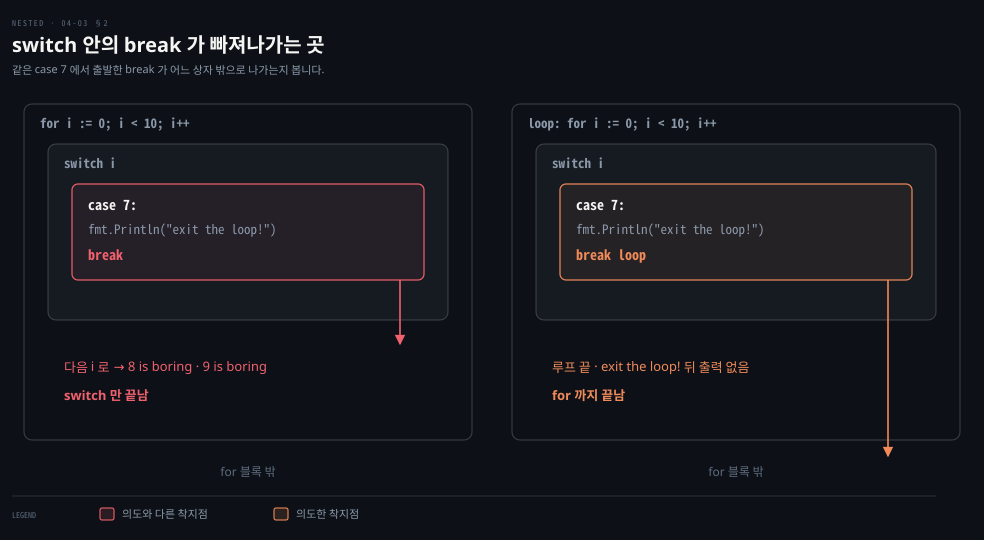

# switch 는 기본으로 빠져나가고 break 는 라벨로 고릅니다

---

> Learning Go 4장 끝입니다. Go 의 `switch` 와 비교식을 쓰는 빈 `switch`, `if` 와 `switch` 중 고르는 기준, 규칙이 걸린 `goto` 를 다루고 장 끝 연습 문제를 풉니다.

## 핵심 요약

> 이 편이 매달린 하나의 생각은 Go 가 `switch` 의 기본값을 뒤집어, case 가 끝나면 알아서 빠져나가게 해서 `switch` 를 다시 쓸 만한 도구로 만들었다는 것입니다.

case 끝에 `break` 를 쓰지 않아도 다음 case 로 흘러가지 않습니다. 같은 동작을 여러 값에 걸려면 쉼표로 나열합니다. 빈 case 는 아무것도 하지 않습니다. 비교할 값을 빼면 case 마다 아무 불리언 식이나 쓰는 빈 `switch` 가 됩니다. 관련된 비교가 여럿이면 `if`/`else` 사슬보다 이것이 읽기 쉽습니다.

기본으로 빠져나가는 대가가 하나 있습니다. `for` 안의 `switch` 에서 `break` 는 `for` 가 아니라 case 만 끝냅니다. 루프를 끝내려면 `for` 에 라벨을 달아야 합니다. `goto` 는 변수 선언을 건너뛰거나 블록 안으로 뛰어들 수 없게 묶여 있고, 드물게 코드를 더 분명하게 할 때만 씁니다.


## 학습 목표

> 이 편을 읽고 나면 아래 다섯 가지를 스스로 해낼 수 있습니다.

1. Go `switch` 의 case 가 다른 언어와 다르게 동작하는 점(기본 빠져나감·쉼표로 여러 값·빈 case)을 말할 수 있습니다.
2. `for` 안의 `switch` 에서 루프를 끝내는 코드를 라벨로 쓸 수 있습니다.
3. 빈 `switch` 를 쓰고, 표현식 `switch` 로 바꿔야 할 때를 알아볼 수 있습니다.
4. `if`/`else` 사슬과 빈 `switch` 가운데 무엇을 쓸지 고를 수 있습니다.
5. Go `goto` 에 걸린 두 제약과, `goto` 가 코드를 더 분명하게 하는 드문 경우를 설명할 수 있습니다.


## 1. switch — case 는 기본으로 빠져나가고 쉼표로 여러 값을 겁니다

> Go 의 `switch` 는 case 끝에 `break` 가 없어도 다음 case 로 흘러가지 않습니다. 같은 동작을 여러 값에 걸려면 쉼표로 나열하며, 빈 case 는 아무것도 하지 않습니다.

C 에서 온 여러 언어에 `switch` 가 있습니다. 원문은 그 언어의 개발자 대부분이 `switch` 를 피한다고 말합니다. 비교할 수 있는 값에 제약이 있는 데다 case 가 기본으로 다음 case 로 흘러가기(fall-through) 때문입니다. Go 는 달라서 `switch` 를 쓸모 있게 만들었다고 원문은 소개합니다. 이 장은 값으로 비교하는 표현식 `switch` 만 다룹니다. 타입으로 가르는 타입 `switch` 는 7장 인터페이스에서 다룹니다.

겉보기에는 C/C++·Java·JavaScript 의 `switch` 와 크게 다르지 않지만 놀랄 점이 몇 있습니다(원문 예제 4-19).

```go
words := []string{"a", "cow", "smile", "gopher",
	"octopus", "anthropologist"}
for _, word := range words {
	switch size := len(word); size {
	case 1, 2, 3, 4:
		fmt.Println(word, "is a short word!")
	case 5:
		wordLen := len(word)
		fmt.Println(word, "is exactly the right length:", wordLen)
	case 6, 7, 8, 9:
	default:
		fmt.Println(word, "is a long word!")
	}
}
```

```bash
a is a short word!
cow is a short word!
smile is exactly the right length: 5
anthropologist is a long word!
```

이 노트를 쓰면서 돌린 출력도 같았습니다. 원문이 이 출력을 설명하며 짚는 특징을 차례로 봅니다.

- `if` 처럼 비교할 값을 괄호로 감싸지 않습니다. 또 `if` 처럼 모든 가지에서 보이는 변수를 선언할 수 있습니다. 여기서는 `size` 를 모든 case 에 가뒀습니다.
- 모든 case 절과 선택인 `default` 절은 중괄호 한 쌍 안에 있지만, 각 case 의 내용은 중괄호로 감싸지 않습니다. case 안의 여러 줄은 모두 한 블록입니다.
- `case 5:` 안에서 새 변수 `wordLen` 을 선언했습니다. case 절도 블록이라 새 변수를 선언할 수 있고, 그 변수는 그 case 블록 안에서만 보입니다.

### break 없이도 다음 case 로 흘러가지 않습니다

모든 case 끝에 `break` 를 넣던 사람이라면 반가울 것입니다. Go 의 `switch` 는 기본으로 다음 case 로 흘러가지 않습니다. 원문은 Ruby 나, 옛날 프로그래머라면 Pascal 의 동작에 가깝다고 말합니다. Java 의 고전적인 `case X:` 문법은 `break` 를 빠뜨리면 다음 case 로 흘러가는데(Java 14 의 `case X ->` 문법은 흘러가지 않습니다), Go 는 흘러가지 않는 것이 기본입니다. 이 비교는 원문 밖의 것입니다.

그러면 여러 값이 같은 동작을 해야 할 때는 어떻게 할까요? Go 에서는 값들을 쉼표로 나눠 한 case 에 적습니다. 예제의 `1, 2, 3, 4` 와 `6, 7, 8, 9` 가 그렇고, 그래서 `a` 와 `cow` 가 같은 줄을 찍었습니다.

다음 물음이 이어집니다. 흘러가지 않는데 빈 case 가 있으면 어떻게 될까요? 예제에서 길이가 6~9 인 경우입니다. Go 에서 빈 case 는 아무 일도 하지 않습니다. `gopher` 와 `octopus` 가 아무것도 찍지 않은 이유입니다.

### fallthrough 는 있지만 쓰기 전에 구조를 다시 봅니다

원문은 완결성을 위해 Go 에도 한 case 가 다음 case 로 이어지게 하는 `fallthrough` 키워드가 있다고 적습니다. 그리고 이것을 쓰는 알고리즘을 만들기 전에 두 번 생각하라고 합니다. `fallthrough` 가 필요해 보이면 case 사이의 의존을 없애도록 로직을 다시 짜라는 것입니다. 이 노트를 쓰면서 `case 1:` 끝에 `fallthrough` 를 두고 `switch 1` 을 돌리니 `one` 과 `two` 가 함께 찍혔습니다.

### 비교할 수 있는 타입이면 무엇이든 switch 합니다

예제는 정수로 `switch` 했지만 그것만 되는 것은 아닙니다. `==` 로 비교할 수 있는 타입이면 무엇이든 됩니다. slice·map·채널·함수, 그리고 이런 타입의 필드를 가진 struct 를 뺀 모든 내장 타입이 해당합니다. 03-01·03-03 에서 본 비교 가능성 규칙이 그대로 적용됩니다. 다만 채널을 이 목록에 넣은 것은 아래 정오처럼 사실과 다릅니다. 이 노트를 쓰면서 slice 로 `switch` 하고 slice case 를 두니 `invalid case []int{…} in switch on s (slice can only be compared to nil)` 이 났습니다.

> **원문 정오**: 원문 3장과 4장은 채널을 비교할 수 없는 타입으로 묶지만 사실과 다릅니다. Go 명세는 "Channel types are comparable" 이라 적고, 같은 `make` 호출로 만든 두 채널 값이나 둘 다 `nil` 인 값을 같다고 봅니다. 이 노트를 쓰면서 `go1.25.1` 에서 확인하니 같은 채널 두 값의 `==` 는 `true` 였고, 채널로 `switch` 하는 코드와 채널 필드만 가진 struct 끼리의 `==` 도 컴파일되어 `true` 를 찍었습니다. 비교할 수 없는 것은 slice·map·함수, 그리고 그런 필드를 가진 struct 입니다.


## 2. for 안의 switch 에서 break — 라벨이 없으면 case 만 끝납니다

> case 끝에 `break` 가 필요 없지만, case 를 일찍 끝내려고 쓸 수는 있습니다. `for` 안의 `switch` 에서 루프를 빠져나가려면 `for` 에 라벨을 달고 `break 라벨` 로 씁니다.

case 끝에 `break` 가 필요 없다고 해서 쓸 수 없는 것은 아닙니다. case 를 일찍 끝내고 싶을 때 씁니다. 다만 원문은 `break` 가 필요하다면 너무 복잡한 일을 하고 있다는 신호일 수 있으니 리팩터링해서 없애 보라고 권합니다.

`switch` 의 case 에서 `break` 를 쓰게 되는 자리가 하나 더 있고, 여기에 함정이 있습니다. `for` 루프 안에 `switch` 가 있고 `for` 루프를 빠져나가고 싶은 경우입니다. 원문 예제 4-20 은 7 에 이르면 루프를 끝내려 합니다.

```go
func main() {
	for i := 0; i < 10; i++ {
		switch i {
		case 0, 2, 4, 6:
			fmt.Println(i, "is even")
		case 3:
			fmt.Println(i, "is divisible by 3 but not 2")
		case 7:
			fmt.Println("exit the loop!")
			break
		default:
			fmt.Println(i, "is boring")
		}
	}
}
```

```bash
0 is even
1 is boring
2 is even
3 is divisible by 3 but not 2
4 is even
5 is boring
6 is even
exit the loop!
8 is boring
9 is boring
```

의도와 다릅니다. 7 에서 `for` 루프를 끝내려 했는데, `break` 가 case 를 빠져나가는 것으로 해석되어 8 과 9 가 계속 찍혔습니다. 라벨 없는 `break` 에 대해 Go 는 case 를 빠져나가려는 것으로 봅니다. 04-02 §4 의 중첩 `for` 처럼 라벨로 풉니다. `for` 에 라벨을 달고, `break` 에 그 라벨 이름을 붙입니다.

```go
loop:
	for i := 0; i < 10; i++ {
```

```go
			break loop // case 7 안의 break 를 이렇게 바꾼다
```

다시 돌리면 `exit the loop!` 까지만 찍히고 끝납니다. 이 노트를 쓰면서 두 판을 모두 돌려 원문 출력과 같은 것을 확인했습니다. 아래 그림이 두 `break` 가 빠져나가는 상자를 나란히 보입니다.



왼쪽의 빨간 화살표는 `switch` 상자 밖에서 멈추고 `for` 상자 안에 남습니다. 그래서 다음 `i` 로 이어집니다. 오른쪽의 주황 화살표는 같은 자리에서 출발해 `for` 상자 밖까지 나갑니다. 라벨이 착지점을 바꾼 것입니다. Java 의 `switch` 안 `break` 도 `switch` 만 빠져나가고 루프를 끝내려면 라벨을 쓰므로, 이 함정 자체는 Java 개발자에게 낯설지 않습니다. 이 비교는 원문 밖의 것입니다.


## 3. 빈 switch — case 마다 아무 불리언 식이나 씁니다

> 비교할 값을 빼고 쓰는 빈 `switch` 는 case 마다 불리언 비교를 적을 수 있습니다. 모든 case 가 같은 변수의 같음 비교라면 표현식 `switch` 로 되돌립니다.

`for` 의 부분을 뺄 수 있듯 `switch` 도 비교할 값을 빼고 쓸 수 있습니다. 원문은 이것을 **빈 switch(blank switch)**라 부릅니다. 보통 `switch` 는 값이 같은지만 확인하지만, 빈 `switch` 는 case 마다 어떤 불리언 비교든 쓸 수 있습니다(원문 예제 4-21).

```go
words := []string{"hi", "salutations", "hello"}
for _, word := range words {
	switch wordLen := len(word); {
	case wordLen < 5:
		fmt.Println(word, "is a short word!")
	case wordLen > 10:
		fmt.Println(word, "is a long word!")
	default:
		fmt.Println(word, "is exactly the right length.")
	}
}
```

```bash
hi is a short word!
salutations is a long word!
hello is exactly the right length.
```

보통 `switch` 처럼 짧은 변수 선언을 넣을 수 있고, `wordLen := len(word);` 뒤에 비교할 값이 없는 것이 빈 `switch` 의 모양입니다. 원문은 빈 `switch` 가 멋지지만 지나치게 쓰지 말라고 합니다. 모든 case 가 같은 변수의 같음 비교인 빈 `switch` 를 썼다면 표현식 `switch` 로 바꿔야 합니다.

```go
switch {
case a == 2:
	fmt.Println("a is 2")
case a == 3:
	fmt.Println("a is 3")
case a == 4:
	fmt.Println("a is 4")
default:
	fmt.Println("a is ", a)
}
```

```go
switch a {
case 2:
	fmt.Println("a is 2")
case 3:
	fmt.Println("a is 3")
case 4:
	fmt.Println("a is 4")
default:
	fmt.Println("a is ", a)
}
```


## 4. if 와 switch 고르기 — 관련된 비교가 여럿이면 빈 switch 입니다

> 기능으로는 `if`/`else` 사슬과 빈 `switch` 가 거의 같습니다. `switch` 는 case 들 사이에 관계가 있다는 것을 드러내므로, 관련된 비교가 여럿이면 빈 `switch` 를 씁니다.

`if`/`else` 사슬과 빈 `switch` 는 둘 다 비교를 차례로 할 수 있어서 기능상 큰 차이가 없습니다. 원문이 두는 차이는 뜻입니다. `switch` 는 빈 `switch` 라도 각 case 의 값이나 비교 사이에 관계가 있다는 것을 드러냅니다. 원문은 04-02 §2 의 FizzBuzz 를 빈 `switch` 로 다시 씁니다(원문 예제 4-22).

```go
for i := 1; i <= 100; i++ {
	switch {
	case i%3 == 0 && i%5 == 0:
		fmt.Println("FizzBuzz")
	case i%3 == 0:
		fmt.Println("Fizz")
	case i%5 == 0:
		fmt.Println("Buzz")
	default:
		fmt.Println(i)
	}
}
```

원문은 대부분이 이것을 가장 읽기 쉬운 판으로 볼 것이라고 말합니다. `continue` 가 더는 필요 없고, 기본 동작이 `default` case 로 드러났기 때문입니다. 첫 case 가 둘째·셋째보다 먼저 와야 한다는 점도 위에서 아래로 읽으면 보입니다. case 는 위에서부터 처음 맞는 하나만 실행되기 때문입니다. 이 마지막 설명은 원문의 표현이 아니라 노트의 보충입니다.

빈 `switch` 의 case 마다 서로 관계없는 비교를 해도 Go 가 막지는 않습니다. 하지만 관용적이지 않으니, 그러고 싶다면 `if`/`else` 사슬을 쓰거나 코드를 리팩터링하라는 것이 원문의 권고입니다. 원문 팁도 같은 말입니다. 관련된 case 가 여럿이면 `if`/`else` 사슬보다 빈 `switch` 를 쓰면 비교가 더 잘 보이고, 한 묶음의 관심사라는 점도 분명해집니다.


## 5. goto — 규칙이 걸려 있고 드물게만 코드를 더 분명하게 합니다

> Go 에도 `goto` 가 있지만 변수 선언을 건너뛰거나 안쪽·옆 블록으로 뛰어드는 것은 금지됩니다. 대부분은 라벨 달린 `break`·`continue` 로 충분하고, 루프가 어떻게 끝났든 공통 마무리를 해야 할 때처럼 드문 경우에만 씁니다.

Go 에는 넷째 제어문이 있고, 원문은 아마 쓸 일이 없을 것이라고 말합니다. 1968년 Edsger Dijkstra 가 "Go To Statement Considered Harmful" 을 쓴 뒤로 `goto` 는 코딩계의 골칫덩이였습니다. 이유는 분명합니다. 전통적인 `goto` 는 프로그램 거의 어디로든 뛸 수 있었습니다. 루프 안팎으로, 변수 정의를 건너뛰어, `if` 문 중간으로 뛸 수 있어서 `goto` 를 쓴 프로그램이 무엇을 하는지 알기 어려웠습니다.

현대 언어 대부분에는 `goto` 가 없습니다. Java 도 `goto` 를 예약어로만 두고 쓸 수 없게 했습니다(원문 밖의 비교). 그런데 Go 에는 있습니다. 원문은 여전히 되도록 피해야 하지만 쓸 데가 있고, Go 가 건 제약 덕분에 구조적 프로그래밍과 더 잘 어울린다고 말합니다.

### 선언을 건너뛰거나 블록 안으로 뛸 수 없습니다

Go 의 `goto` 는 라벨 달린 줄을 가리키고 실행이 그곳으로 뜁니다. 하지만 아무 데나 뛸 수는 없습니다. 변수 선언을 건너뛰는 점프와 안쪽 블록이나 옆 블록으로 들어가는 점프를 금지합니다. 원문 예제 4-23 에 이런 `goto` 가 둘 있습니다.

```go
func main() {
	a := 10
	goto skip
	b := 20
skip:
	c := 30
	fmt.Println(a, b, c)
	if c > a {
		goto inner
	}
	if a < b {
	inner:
		fmt.Println("a is less than b")
	}
}
```

```bash
goto skip jumps over declaration of b at ./main.go:8:4
goto inner jumps into block starting at ./main.go:15:11
```

`goto skip` 은 `b` 의 선언을 건너뛰고, `goto inner` 는 다른 `if` 블록 안으로 뛰어듭니다. 이 노트를 쓰면서 빌드하니 파일 경로만 다르고 같은 두 메시지가 났습니다.

### 루프가 어떻게 끝났든 공통 마무리를 할 때 씁니다

그러면 `goto` 는 어디에 쓸까요? 원문의 답은 대부분 쓰지 말라는 것입니다. 깊이 중첩된 루프에서 빠져나가거나 반복을 건너뛰는 일은 라벨 달린 `break`·`continue` 가 합니다. 원문 예제 4-24 는 올바른 `goto` 와 몇 안 되는 정당한 쓰임을 보입니다.

```go
func main() {
	a := rand.Intn(10)
	for a < 100 {
		if a%5 == 0 {
			goto done
		}
		a = a*2 + 1
	}
	fmt.Println("do something when the loop completes normally")
done:
	fmt.Println("do complicated stuff no matter why we left the loop")
	fmt.Println(a)
}
```

원문은 이 예가 억지스럽다고 인정하면서, `goto` 가 프로그램을 더 분명하게 할 수 있음을 보여 준다고 말합니다. 함수 중간에서는 실행하지 않되 함수 끝에서는 실행해야 하는 로직이 있습니다. `goto` 없이 하는 방법도 있습니다.

- 불리언 플래그를 둡니다. 원문은 흐름을 제어하는 플래그를 코드 곳곳에 흩뿌리는 것이 기능상 `goto` 와 같다고 볼 수 있고 더 장황할 뿐이라고 봅니다.
- 복잡한 코드를 `for` 루프 뒤에 복제합니다. 유지보수가 어려워지니 문제입니다.

원문은 이런 상황이 드물지만, 로직을 다시 짤 방법을 찾지 못한다면 이렇게 쓴 `goto` 가 실제로 코드를 낫게 한다고 말합니다.

### 표준 라이브러리 strconv 에도 goto 가 있습니다

원문은 실제 예로 표준 라이브러리 `strconv` 패키지 `atof.go` 파일의 `floatBits` 메서드를 가리킵니다. 메서드 끝이 이렇게 끝납니다.

```go
overflow:
	// ±Inf
	mant = 0
	exp = 1<<flt.expbits - 1 + flt.bias
	overflow = true

out:
	// Assemble bits.
	bits := mant & (uint64(1)<<flt.mantbits - 1)
	bits |= uint64((exp-flt.bias)&(1<<flt.expbits-1)) << flt.mantbits
	if d.neg {
		bits |= 1 << flt.mantbits << flt.expbits
	}
	return bits, overflow
```

이 줄들 앞에 조건 검사가 여럿 있습니다. 어떤 조건은 `overflow` 라벨 뒤의 코드를 실행해야 합니다. 다른 조건은 그 코드를 건너뛰고 곧장 `out` 으로 가야 합니다.

조건에 따라 `overflow` 나 `out` 으로 뛰는 `goto` 가 있습니다. 원문은 `goto` 없이 쓰는 방법을 찾을 수도 있겠지만 모두 코드를 더 이해하기 어렵게 만든다고 판단합니다. 이 노트를 쓰면서 `go1.25.1` 의 `src/strconv/atof.go` 를 열어 보니 `floatBits` 안에 `goto out` 과 `goto overflow` 가 여러 번 있었습니다. 끝에는 `overflow:` 와 `out:` 라벨이 그대로 있었습니다.

원문의 마지막 팁은 `goto` 를 피하려고 무척 애쓰되, 코드를 더 읽기 쉽게 만드는 드문 상황에서는 선택지라는 것입니다.


## 연습 문제

> 원문 연습 문제 세 개를 `go1.25.1` 에서 풀어 결과를 확인했습니다. 원문의 정답은 책의 Chapter 4 저장소에 있습니다.

### 1. 0~100 사이 난수 100개를 slice 에 넣기

0 과 100 사이의 난수 100개를 `int` slice 에 넣는 `for` 루프를 쓰는 문제입니다. 원문은 100 을 포함하는지 적지 않습니다. 여기서는 100 을 포함하도록 `rand.Intn(101)` 을 썼습니다. 개수를 알므로 03-01 §4 의 권고대로 길이 0, 용량 100 으로 만들어 `append` 합니다.

```go
nums := make([]int, 0, 100)
for i := 0; i < 100; i++ {
	nums = append(nums, rand.Intn(101))
}
```

### 2. 2·3·6 의 배수에 따라 다른 말 찍기

1번의 slice 를 돌며 값마다 규칙을 적용하는 문제입니다.

- 2 로 나눠지면 "Two!" 를 찍습니다.
- 3 으로 나눠지면 "Three!" 를 찍습니다.
- 2 와 3 으로 모두 나눠지면 "Six!" 만 찍고 다른 것은 찍지 않습니다.
- 나머지는 "Never mind" 를 찍습니다.

"Six!" 조건이 나머지 둘을 막아야 하므로 §4 의 FizzBuzz 처럼 빈 `switch` 에서 그 case 를 맨 위에 둡니다.

```go
for _, v := range nums {
	switch {
	case v%2 == 0 && v%3 == 0:
		fmt.Println("Six!")
	case v%2 == 0:
		fmt.Println("Two!")
	case v%3 == 0:
		fmt.Println("Three!")
	default:
		fmt.Println("Never mind")
	}
}
```

난수라 실행마다 결과가 다르지만, 이 노트를 쓰면서 돌렸을 때 32 는 "Two!", 81 은 "Three!", 61 은 "Never mind" 였습니다.

### 3. total 이 끝내 0 인 이유

`main` 에 `int` 변수 `total` 을 선언하는 문제입니다. `i` 를 0 부터 10 미만까지 도는 `for` 루프 본문에 아래 두 줄을 넣고, 루프가 끝나면 `total` 을 찍습니다. 무엇이 찍히고 버그는 무엇일까요?

```go
var total int
for i := 0; i < 10; i++ {
	total := total + i
	fmt.Println(total)
}
fmt.Println(total)
```

```bash
# go1.25.1 출력 (2026-09-27), 줄바꿈 대신 공백으로 표시
0 1 2 3 4 5 6 7 8 9 0
```

루프 안에서는 `0` 부터 `9` 까지 찍힙니다. 루프 뒤의 `total` 은 `0` 입니다. 04-01 §2 의 섀도잉입니다. `total := total + i` 의 오른쪽 `total` 은 아직 바깥 변수라서 늘 0 입니다. 그리고 `:=` 가 루프 본문 블록에 새 `total` 을 만들어 바깥 것을 가립니다. 반복마다 새 `total` 이 `0 + i` 로 만들어졌다 사라지므로 바깥 `total` 은 한 번도 바뀌지 않습니다. `:=` 를 `=` 로 바꿔 `total = total + i` 로 쓰면 누적되어 마지막에 45 가 됩니다. 이 원인 설명과 고친 코드는 원문의 문제에 대한 노트의 풀이입니다.


## 핵심 개념 체크리스트

목표 번호 순서대로 짝지었습니다.

- [ ] (목표 1) 예제 4-19 에서 `gopher` 와 `octopus` 가 아무것도 찍지 않은 이유를 설명할 수 있습니까?
- [ ] (목표 1) `switch` 할 수 없는 타입을 댈 수 있습니까?
- [ ] (목표 2) 예제 4-20 에서 8 과 9 가 찍힌 이유와, 7 에서 루프를 끝내도록 고치는 두 줄을 말할 수 있습니까?
- [ ] (목표 3) 모든 case 가 `a == 2` 모양인 빈 `switch` 를 어떻게 바꿔야 합니까?
- [ ] (목표 4) FizzBuzz 에서 `i%3 == 0 && i%5 == 0` case 를 맨 위에 둬야 하는 이유를 말할 수 있습니까?
- [ ] (목표 5) Go `goto` 가 금지하는 점프 두 가지를 댈 수 있습니까?
- [ ] (목표 5) 예제 4-24 에서 `goto` 대신 쓸 수 있는 방법 둘과, 원문이 그 둘을 낫지 않다고 보는 이유를 말할 수 있습니까?


## 관련 문서

- [04-02 for 하나로 네 가지 반복을 씁니다](./04-02.for%20%ED%95%98%EB%82%98%EB%A1%9C%20%EB%84%A4%20%EA%B0%80%EC%A7%80%20%EB%B0%98%EB%B3%B5%EC%9D%84%20%EC%94%81%EB%8B%88%EB%8B%A4.md) — 4장 가운데. for 네 형태와 라벨
- [04-01 안쪽 블록의 같은 이름은 바깥 변수를 가립니다](./04-01.%EC%95%88%EC%AA%BD%20%EB%B8%94%EB%A1%9D%EC%9D%98%20%EA%B0%99%EC%9D%80%20%EC%9D%B4%EB%A6%84%EC%9D%80%20%EB%B0%94%EA%B9%A5%20%EB%B3%80%EC%88%98%EB%A5%BC%20%EA%B0%80%EB%A6%BD%EB%8B%88%EB%8B%A4.md) — 4장 앞. 연습 문제 3 의 섀도잉
- [Learning Go 2판 — 정독 인덱스](./README.md) — 16장 전체 지도


## 참고 자료

- 원본: 《Learning Go, 2nd Edition》 (Jon Bodner, O'Reilly)
- 다룬 범위: Chapter 4 "switch" 부터 장 끝과 연습 문제까지
- go1.25.1 소스 `src/strconv/atof.go` — `floatBits` 메서드의 `goto overflow`·`goto out` (로컬 `go env GOROOT` 아래)
