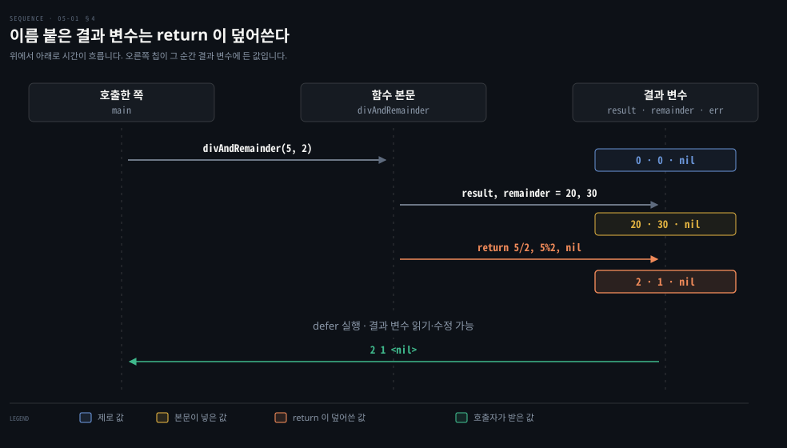

# Go 함수는 여러 값을 돌려주고 오류는 마지막 값입니다

---

> Learning Go 5장 앞 부분입니다. 함수 선언과 호출, Go 에 없는 이름 붙은 인자와 선택 인자를 흉내 내는 법, 가변 인자, 여러 값 반환과 오류, 이름 붙은 반환 값과 빈 `return` 을 다룹니다.

## 핵심 요약

> 이 편이 매달린 하나의 생각은 Go 함수가 결과와 오류를 함께 돌려주는 여러 값 반환을 기본 도구로 삼는다는 것입니다.

함수 선언은 `func`, 이름, 인자, 반환 타입 넷으로 됩니다. 인자는 모두 넘겨야 합니다. 이름 붙은 인자나 선택 인자가 필요하면 struct 를 넘깁니다. 개수가 정해지지 않은 인자는 가변 인자로 받습니다. 가변 인자는 함수 안에서 slice 입니다.

여러 값 반환은 튜플이 아니라 값 여러 개입니다. 반환된 값을 하나씩 모두 받아야 합니다. 쓰지 않는 값은 `_` 로 버립니다. 관례상 오류는 마지막 값입니다. 반환 값에 이름을 붙일 수 있지만 섀도잉과 무시 때문에 헷갈리기 쉽습니다. 이름만 믿고 값을 적지 않는 빈 `return` 은 쓰지 않습니다.


## 학습 목표

> 이 편을 읽고 나면 아래 다섯 가지를 스스로 해낼 수 있습니다.

1. 함수 선언의 네 부분을 대고, 같은 타입 인자를 묶어 선언할 수 있습니다.
2. struct 로 이름 붙은 인자와 선택 인자를 흉내 내고, 인자가 많아지는 것 자체를 경고 신호로 읽을 수 있습니다.
3. 가변 인자를 선언하고, slice 를 가변 인자에 넘길 때 필요한 문법을 쓸 수 있습니다.
4. 여러 값을 돌려주는 함수를 쓰고 호출하며, 오류를 마지막 값으로 돌려주는 관례와 `_` 로 값을 버리는 법을 적용할 수 있습니다.
5. 이름 붙은 반환 값이 `return` 문에 의해 덮어써지는 과정을 설명하고, 빈 `return` 을 쓰지 않는 이유를 말할 수 있습니다.


## 1. 함수 선언과 호출 — func · 이름 · 인자 · 반환 타입

> Go 함수 선언은 `func` 키워드, 함수 이름, 인자 목록, 반환 타입 네 부분으로 됩니다. 값을 돌려주는 함수는 반드시 `return` 해야 하고, 아무것도 돌려주지 않는 함수는 일찍 빠져나갈 때만 `return` 을 씁니다.

지금까지의 프로그램은 `main` 함수 안의 몇 줄이 전부였습니다. 더 큰 프로그램을 쓰려면 코드를 함수로 나눠야 합니다. 원문은 C·Python·Ruby·JavaScript 처럼 일급 함수가 있는 언어를 써 봤다면 Go 함수의 기본이 익숙할 것이라고 말합니다. 메서드는 7장에서 다룹니다. 제어문처럼 함수에도 Go 만의 변형이 있고, 원문은 그 가운데 개선인 것과 피해야 할 실험인 것을 모두 다루겠다고 예고합니다.

`main` 은 인자도 반환 값도 없으니, 둘 다 있는 함수를 봅니다.

```go
func div(num int, denom int) int {
	if denom == 0 {
		return 0
	}
	return num / denom
}
```

함수 선언은 네 부분입니다.

- `func` 키워드
- 함수 이름
- 인자 목록: 괄호 안에 쉼표로 나누고, 이름을 먼저 타입을 뒤에 씁니다. Go 는 타입 있는 언어라 인자의 타입을 반드시 적습니다.
- 반환 타입: 인자 목록의 닫는 괄호와 함수 본문의 여는 중괄호 사이에 씁니다.

값을 돌려주는 함수는 반드시 `return` 을 적어야 합니다. 아무것도 돌려주지 않는 함수는 끝에 `return` 이 필요 없습니다. 마지막 줄 전에 빠져나갈 때만 씁니다. 인자가 없으면 빈 괄호 `()` 를 씁니다. 돌려주는 것이 없으면 인자 괄호와 여는 중괄호 사이에 아무것도 쓰지 않습니다.

```go
func main() {
	result := div(5, 2)
	fmt.Println(result)
}
```

호출은 익숙한 모양입니다. `:=` 오른쪽에서 `div` 를 5 와 2 로 부르고, 왼쪽의 `result` 에 반환 값을 넣습니다. 원문의 팁 하나가 있습니다. 같은 타입의 인자가 둘 이상 이어지면 타입을 한 번만 적어도 됩니다.

```go
func div(num, denom int) int {
```


## 2. 이름 붙은 인자와 선택 인자는 struct 로 흉내 냅니다

> Go 에는 이름 붙은 인자도 선택 인자도 없습니다. 필요하면 인자에 맞는 필드를 가진 struct 를 만들어 넘기지만, 원문은 그럴 만큼 인자가 많다면 함수가 너무 복잡한 것일 수 있다고 봅니다.

Go 만의 기능을 보기 전에 원문은 Go 에 없는 기능 둘을 짚습니다. 이름 붙은 인자와 선택 인자입니다. 다음 절의 가변 인자라는 예외 하나를 빼면, 함수의 모든 인자를 넘겨야 합니다.

이름 붙은 인자와 선택 인자를 흉내 내려면, 원하는 인자에 맞는 필드를 가진 struct 를 정의해 함수에 넘깁니다(원문 예제 5-1).

```go
type MyFuncOpts struct {
	FirstName string
	LastName  string
	Age       int
}

func MyFunc(opts MyFuncOpts) error {
	// do something here
}

func main() {
	MyFunc(MyFuncOpts{
		LastName: "Patel",
		Age:      50,
	})
	MyFunc(MyFuncOpts{
		FirstName: "Joe",
		LastName:  "Smith",
	})
}
```

struct 리터럴에서 필드 이름을 적으니 인자에 이름이 붙은 셈이고, 적지 않은 필드는 제로 값이 되니 선택 인자가 되는 셈입니다(03-03 §1). 원문은 이 코드를 조각(snippet)이라 부릅니다. 이 노트를 쓰면서 그대로 빌드해 보니 `MyFunc` 가 `error` 를 돌려준다고 선언했는데 본문에 `return` 이 없어 `missing return` 이 났습니다. 실행해 보려면 본문에 `return nil` 같은 줄을 채워야 합니다.

원문은 이름 붙은 인자와 선택 인자가 없는 것이 실제로는 제약이 아니라고 말합니다. 함수의 인자는 몇 개를 넘지 않아야 하고, 이름 붙은 인자와 선택 인자는 입력이 많을 때 주로 쓸모 있습니다. 그런 상황이라면 함수가 너무 복잡한 것일 수 있다는 것입니다. Java 에서 생성자 인자가 많을 때 빌더 패턴을 쓰는 것과 비슷한 문제를 Go 는 struct 하나로 풉니다. 이 비교는 원문 밖의 것입니다.


## 3. 가변 인자 — 마지막 인자에 ... 을 붙이면 함수 안에서 slice 입니다

> 가변 인자는 인자 목록의 마지막에 두고 타입 앞에 `...` 을 붙입니다. 함수 안에서는 그 타입의 slice 이고, 이미 있는 slice 를 넘길 때는 뒤에 `...` 을 붙여야 합니다.

`fmt.Println` 은 인자를 몇 개든 받습니다. 어떻게 그럴 수 있을까요? 여러 언어처럼 Go 도 가변 인자를 지원합니다. 가변 인자는 인자 목록의 마지막(또는 유일한) 인자여야 하고, 타입 앞에 점 세 개 `...` 을 붙여 표시합니다. 함수 안에서 만들어지는 변수는 그 타입의 slice 라서 다른 slice 처럼 쓰면 됩니다.

기준 수를 가변 개수의 수에 더해 `int` slice 로 돌려주는 함수입니다.

```go
func addTo(base int, vals ...int) []int {
	out := make([]int, 0, len(vals))
	for _, v := range vals {
		out = append(out, base+v)
	}
	return out
}
```

여러 방식으로 불러 봅니다.

```go
fmt.Println(addTo(3))
fmt.Println(addTo(3, 2))
fmt.Println(addTo(3, 2, 4, 6, 8))
a := []int{4, 3}
fmt.Println(addTo(3, a...))
fmt.Println(addTo(3, []int{1, 2, 3, 4, 5}...))
```

```bash
[]
[5]
[5 7 9 11]
[7 6]
[4 5 6 7 8]
```

가변 인자에는 값을 몇 개든, 하나도 없이도 넘길 수 있습니다. 가변 인자는 slice 로 바뀌므로 slice 를 넘길 수도 있습니다. 이때 변수나 slice 리터럴 뒤에 `...` 을 붙여야 합니다. 붙이지 않으면 컴파일 에러입니다.

이 노트를 쓰면서 `...` 없이 slice 를 넘기니 `cannot use a (variable of type []int) as int value in argument to s` 가 났습니다. Java 의 가변 인자(`int... vals`)는 배열을 그대로 넘겨도 받아 줍니다. Go 는 slice 를 펼친다는 뜻을 `...` 로 적게 합니다. 이 비교는 원문 밖의 것입니다. 03-01 §3 에서 `append(x, y...)` 로 slice 를 이어 붙인 것도 같은 문법입니다.


## 4. 여러 값 반환 — 튜플이 아니라 값 여러 개이고 오류는 마지막입니다

> Go 함수는 값을 여러 개 돌려줄 수 있고, 오류는 관례상 마지막 값입니다. 반환된 값은 튜플로 묶이지 않으므로 하나씩 모두 받아야 하고, 쓰지 않는 값은 `_` 로 버립니다.

원문은 Go 와 다른 언어의 첫 차이로 여러 값 반환을 듭니다. 나눗셈 함수가 몫과 나머지를 함께 돌려주게 고칩니다.

```go
func divAndRemainder(num, denom int) (int, int, error) {
	if denom == 0 {
		return 0, 0, errors.New("cannot divide by zero")
	}
	return num / denom, num % denom, nil
}
```

바뀐 점이 몇 가지 있습니다.

- 반환 값의 타입을 괄호 안에 쉼표로 나눠 적습니다.
- 여러 값을 돌려주는 함수는 모든 값을 쉼표로 나눠 돌려줘야 합니다.
- 돌려주는 값들을 괄호로 감싸면 컴파일 에러입니다. 이 노트를 쓰면서 `return (1, 2)` 를 써 보니 `syntax error: unexpected comma, expected )` 가 났습니다.

처음 보는 것이 하나 더 있습니다. `error` 를 만들어 돌려주는 것입니다. 오류는 9장에서 자세히 다룹니다. 지금은 함수에서 무언가 잘못되면 여러 값 반환으로 오류를 돌려준다는 것만 알면 됩니다. 잘 끝나면 오류 자리에 `nil` 을 돌려줍니다. 관례상 오류는 늘 마지막(또는 유일한) 반환 값입니다.

```go
func main() {
	result, remainder, err := divAndRemainder(5, 2)
	if err != nil {
		fmt.Println(err)
		os.Exit(1)
	}
	fmt.Println(result, remainder)
}
```

02-02 의 여러 값 대입을 함수 호출 결과에 쓴 것입니다. 오류가 있는지는 `err` 를 `nil` 과 비교해 봅니다. Java 가 예외를 던져 실패를 알리는 자리에서, Go 는 오류를 반환 값으로 돌려주고 호출한 쪽이 바로 확인합니다. 이 비교는 원문 밖의 것이고, Go 의 오류 처리는 9장에서 이어집니다.

### 여러 값 반환은 튜플이 아닙니다

Python 에 익숙하다면 여러 값 반환을 튜플을 돌려주고 여러 변수에 대입하면 풀어 주는 것으로 생각할 수 있습니다. 원문 예제 5-2 는 Python 인터프리터에서 반환 값 전체를 변수 하나에 받거나 둘로 나눠 받는 모습을 보입니다. Go 는 그렇게 동작하지 않습니다. 반환된 값을 하나하나 모두 대입해야 하고, 여러 반환 값을 변수 하나에 받으면 컴파일 에러입니다. 이 노트를 쓰면서 확인한 메시지는 `assignment mismatch: 1 variable but two returns 2 values` 였습니다.

### 쓰지 않는 반환 값은 _ 로 버립니다

반환 값 가운데 일부만 쓰고 싶다면 어떻게 할까요? 02-02 §4 에서 본 대로 Go 는 쓰지 않는 변수를 허용하지 않습니다. 읽지 않을 값은 `_` 에 대입합니다. 나머지를 읽지 않는다면 `result, _, err := divAndRemainder(5, 2)` 처럼 씁니다.

뜻밖에도 Go 는 함수의 반환 값 전부를 암묵적으로 무시하는 것은 허용합니다. `divAndRemainder(5, 2)` 만 쓰면 반환 값이 모두 버려집니다. 원문은 우리가 처음부터 이렇게 해 왔다고 짚습니다. `fmt.Println` 도 값을 둘 돌려주지만 무시하는 것이 관용적입니다. 그 밖의 거의 모든 경우에는 `_` 로 무시한다는 것을 드러내라는 것이 원문의 권고입니다.


## 5. 이름 붙은 반환 값 — return 에 적은 값이 결과 변수를 덮어씁니다

> 반환 값에 이름을 붙이면 함수 안에서 쓸 결과 변수를 미리 선언하는 셈이고, 이 변수들은 제로 값으로 시작합니다. 하지만 `return` 문에 적은 값이 결과 변수에 다시 대입되므로, 이름을 붙여도 그 변수를 써야 할 의무는 없습니다.

Go 는 여러 값을 돌려주는 것에 더해 반환 값에 이름을 붙이게 해 줍니다. `divAndRemainder` 를 다시 씁니다.

```go
func divAndRemainder(num, denom int) (result int, remainder int, err error) {
	if denom == 0 {
		err = errors.New("cannot divide by zero")
		return result, remainder, err
	}
	result, remainder = num/denom, num%denom
	return result, remainder, err
}
```

반환 값에 이름을 붙이는 것은 함수 안에서 반환 값을 담을 변수를 미리 선언하는 것입니다. 괄호 안에 쉼표로 나눠 적고, 반환 값이 하나여도 괄호가 필요합니다. 이름 붙은 반환 값은 만들어질 때 제로 값으로 초기화되므로, 따로 쓰거나 대입하기 전에도 돌려줄 수 있습니다. 일부만 이름을 붙이고 싶으면 나머지 이름을 `_` 로 둡니다.

이름은 함수 안에서만 쓰입니다. 함수 밖의 이름을 강제하지 않으므로 `x, y, z := divAndRemainder(5, 2)` 처럼 다른 이름의 변수에 받아도 됩니다.

### 이름 붙은 반환 값의 함정 둘 — 섀도잉과 무시

원문은 이름 붙은 반환 값이 코드를 분명하게 할 때도 있지만 모서리가 있다고 경고합니다. 첫째는 섀도잉입니다. 다른 변수처럼 이름 붙은 반환 값도 가릴 수 있으니, 반환 값에 대입하는 것인지 그것을 가리는 새 변수에 대입하는 것인지 확인해야 합니다(04-01 §2).

둘째는 이름 붙은 반환 값을 돌려주지 않아도 된다는 것입니다. 원문은 이렇게 고친 함수에 5 와 2 를 넘기면 무엇이 나올지 맞혀 보라고 합니다.

```go
func divAndRemainder(num, denom int) (result int, remainder int, err error) {
	// assign some values
	result, remainder = 20, 30
	if denom == 0 {
		return 0, 0, errors.New("cannot divide by zero")
	}
	return num / denom, num % denom, nil
}
```

출력은 `2 1` 이고, 이 노트를 쓰면서 돌린 결과도 `2 1 <nil>` 이었습니다. 결과 변수에 20 과 30 을 넣었는데도 `return` 문의 값이 돌아왔습니다. 원문의 설명은 Go 컴파일러가 `return` 에 적은 값을 결과 변수에 대입하는 코드를 넣는다는 것입니다. 이름 붙은 결과 변수는 반환 값을 변수에 담을 의도를 선언하는 방법일 뿐 그 변수를 쓰도록 강제하지 않습니다.

아래 그림이 이 한 번의 호출을 시간순으로 보입니다. 오른쪽 칩이 그 순간 결과 변수에 든 값입니다.



결과 변수는 `0 · 0 · nil` 로 시작해 본문이 넣은 `20 · 30 · nil` 을 거치고, `return` 문이 `2 · 1 · nil` 로 덮어씁니다. 그림 아래쪽의 defer 줄은 05-03 에서 쓰는 자리입니다. 함수가 끝나기 직전에 도는 defer 는 이 결과 변수를 읽고 고칠 수 있습니다.

원문은 이름 붙은 반환 값이 문서 역할을 한다며 좋아하는 개발자도 있다고 적습니다. 그러면서도 자신은 그 가치가 제한적이라고 봅니다. 섀도잉 때문에도, 그냥 무시될 수 있어서도 헷갈리기 때문입니다. 다만 이름 붙은 반환 값이 꼭 필요한 상황이 하나 있습니다. 그것이 [05-03](./05-03.defer%20%EB%8A%94%20%ED%95%A8%EC%88%98%EA%B0%80%20%EB%81%9D%EB%82%A0%20%EB%95%8C%20%EC%A0%95%EB%A6%AC%ED%95%98%EA%B3%A0%20%EC%9D%B8%EC%9E%90%EB%8A%94%20%EB%8A%98%20%EB%B3%B5%EC%82%AC%EB%90%A9%EB%8B%88%EB%8B%A4.md) §2 의 `defer` 입니다.


## 6. 빈 return — 값이 무엇인지 거슬러 찾게 하므로 쓰지 않습니다

> 이름 붙은 반환 값이 있으면 값 없이 `return` 만 써도 결과 변수의 마지막 값이 돌아갑니다. 원문은 이것을 Go 의 심각한 오기능으로 보고, 값을 돌려주는 함수에서는 절대 쓰지 말라고 경고합니다.

이름 붙은 반환 값을 쓴다면 원문이 Go 의 심각한 오기능(misfeature)이라 부르는 것을 알아야 합니다. 빈 `return`(naked return 이라고도 합니다)입니다. 이름 붙은 반환 값이 있으면 돌려줄 값을 적지 않고 `return` 만 써도 되고, 그러면 결과 변수에 마지막으로 대입된 값이 돌아갑니다.

```go
func divAndRemainder(num, denom int) (result int, remainder int, err error) {
	if denom == 0 {
		err = errors.New("cannot divide by zero")
		return
	}
	result, remainder = num/denom, num%denom
	return
}
```

잘못된 입력이 오면 함수가 바로 돌아가고, `result` 와 `remainder` 에는 아무것도 대입하지 않았으므로 제로 값이 돌아갑니다. 이 노트를 쓰면서 0 으로 나누니 `0 0 cannot divide by zero` 가 나왔습니다. 이름 붙은 반환 값의 제로 값을 돌려줄 때는 그 값이 말이 되는지 확인해야 합니다. 함수 끝에도 여전히 `return` 을 써야 합니다. 빈 `return` 을 쓰더라도 이 함수는 값을 돌려주므로 `return` 을 빼면 컴파일 에러입니다. 이 노트를 쓰면서 확인한 메시지는 `missing return` 이었습니다.

처음에는 타이핑을 줄여 줘서 편해 보일 수 있습니다. 그러나 원문은 경험 많은 Go 개발자 대부분이 빈 `return` 을 나쁜 생각으로 본다고 말합니다. 데이터 흐름을 이해하기 어렵게 만들기 때문입니다. 좋은 소프트웨어는 무슨 일이 일어나는지 분명하고 읽기 쉽습니다. 빈 `return` 을 만나면 읽는 사람은 무엇이 실제로 돌아가는지 보려고 결과 변수에 마지막으로 대입된 값을 찾아 프로그램을 거슬러 올라가야 합니다. 원문의 경고는 단호합니다. 값을 돌려주는 함수라면 빈 `return` 을 절대 쓰지 마십시오.


## 핵심 개념 체크리스트

목표 번호 순서대로 짝지었습니다.

- [ ] (목표 1) 함수 선언의 네 부분을 대고, `func div(num, denom int) int` 가 무엇을 줄인 모양인지 말할 수 있습니까?
- [ ] (목표 2) 이름 붙은 인자·선택 인자를 흉내 내는 방법과, 원문이 이것을 제약으로 보지 않는 이유를 말할 수 있습니까?
- [ ] (목표 3) `addTo(3, a)` 가 컴파일되지 않는 이유와 고치는 법을 말할 수 있습니까?
- [ ] (목표 4) 오류를 돌려주는 함수에서 오류가 몇 번째 값이어야 하는지, 성공했을 때 오류 자리에 무엇을 돌려주는지 말할 수 있습니까?
- [ ] (목표 4) 반환 값이 셋인 함수를 변수 하나에 받으면 어떻게 되고, 가운데 값만 버리려면 어떻게 씁니까?
- [ ] (목표 5) 결과 변수에 20·30 을 넣은 뒤 `return num / denom, num % denom, nil` 을 하면 무엇이 돌아가는지 설명할 수 있습니까?
- [ ] (목표 5) 빈 `return` 이 데이터 흐름을 읽기 어렵게 만드는 이유를 말할 수 있습니까?


## 관련 문서

- [05-02 함수는 값이고 클로저는 바깥 변수를 붙잡습니다](./05-02.%ED%95%A8%EC%88%98%EB%8A%94%20%EA%B0%92%EC%9D%B4%EA%B3%A0%20%ED%81%B4%EB%A1%9C%EC%A0%80%EB%8A%94%20%EB%B0%94%EA%B9%A5%20%EB%B3%80%EC%88%98%EB%A5%BC%20%EB%B6%99%EC%9E%A1%EC%8A%B5%EB%8B%88%EB%8B%A4.md) — 5장 가운데. 함수 값과 클로저
- [05-03 defer 는 함수가 끝날 때 정리하고 인자는 늘 복사됩니다](./05-03.defer%20%EB%8A%94%20%ED%95%A8%EC%88%98%EA%B0%80%20%EB%81%9D%EB%82%A0%20%EB%95%8C%20%EC%A0%95%EB%A6%AC%ED%95%98%EA%B3%A0%20%EC%9D%B8%EC%9E%90%EB%8A%94%20%EB%8A%98%20%EB%B3%B5%EC%82%AC%EB%90%A9%EB%8B%88%EB%8B%A4.md) — 5장 끝. defer 와 값에 의한 호출
- [Learning Go 2판 — 정독 인덱스](./README.md) — 16장 전체 지도


## 참고 자료

- 원본: 《Learning Go, 2nd Edition》 (Jon Bodner, O'Reilly)
- 다룬 범위: Chapter 5 도입부터 "Blank Returns—Never Use These!" 까지
