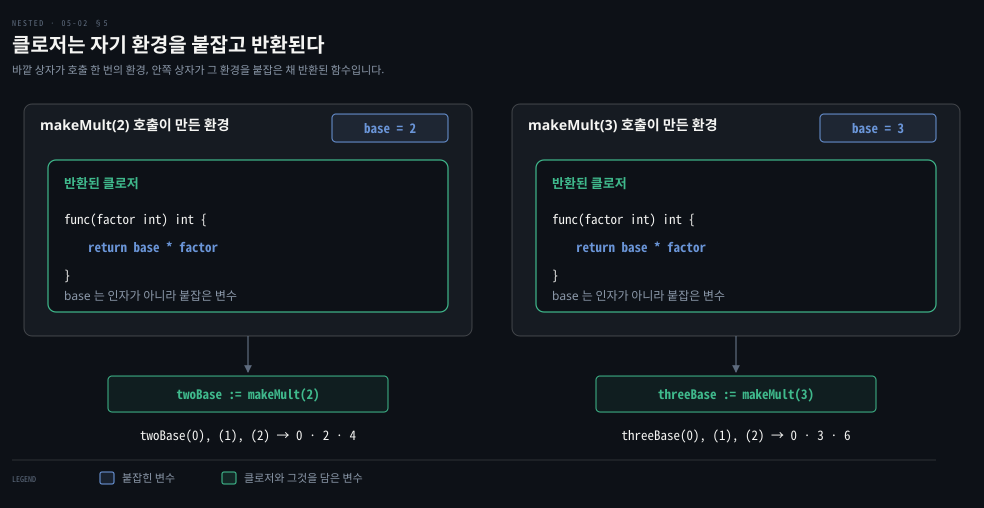

# 함수는 값이고 클로저는 바깥 변수를 붙잡습니다

---

> Learning Go 5장 가운데입니다. 함수를 변수에 담는 함수 값, 함수 타입 선언, 이름 없는 익명 함수, 바깥 변수를 붙잡는 클로저, 그리고 함수를 인자로 넘기고 돌려받는 법을 다룹니다.

## 핵심 요약

> 이 편이 매달린 하나의 생각은 Go 에서 함수가 변수에 담기고 넘겨지는 값이며, 함수 안에서 선언한 함수는 바깥 함수의 변수를 붙잡은 채 그 값이 된다는 것입니다.

함수의 타입은 인자와 반환 값의 타입, 곧 시그니처로 정해집니다. 시그니처가 같은 함수는 같은 변수나 map 에 담을 수 있고, `type` 으로 함수 타입에 이름을 붙일 수도 있습니다. 함수 안에서는 이름 없는 익명 함수를 선언해 변수에 담거나 바로 부를 수 있습니다.

함수 안에서 선언한 함수는 클로저입니다. 바깥 함수의 변수를 인자로 받지 않고도 읽고 고칩니다. 클로저를 다른 함수에 넘기면 지역 변수를 그 함수 안에서 쓸 수 있고(`sort.Slice`), 함수에서 클로저를 돌려주면 호출마다 자기 환경을 붙잡은 함수가 만들어집니다(`makeMult`).


## 학습 목표

> 이 편을 읽고 나면 아래 다섯 가지를 스스로 해낼 수 있습니다.

1. 함수 시그니처가 무엇으로 정해지는지 말하고, 함수 값을 변수와 map 에 담아 쓸 수 있습니다.
2. `type` 으로 함수 타입을 선언하고, 그렇게 하는 이점을 말할 수 있습니다.
3. 익명 함수를 변수에 담거나 바로 호출하고, 패키지 수준 익명 함수를 바꾸는 일이 위험한 이유를 설명할 수 있습니다.
4. 클로저가 바깥 변수를 읽고 고치는 동작과, 클로저 안의 `:=` 가 만드는 섀도잉을 구분할 수 있습니다.
5. 클로저를 인자로 넘겨 slice 를 정렬하고, 클로저를 돌려주는 함수를 쓸 수 있습니다.


## 1. 함수는 값 — 시그니처가 같은 함수는 같은 변수에 담깁니다

> Go 의 함수는 값이고, 함수의 타입은 `func` 와 인자·반환 값 타입의 조합인 시그니처로 정해집니다. 시그니처가 같은 함수는 같은 함수 변수에 대입할 수 있고, 제로 값은 `nil` 입니다.

여러 언어처럼 Go 의 함수도 값입니다. 함수의 타입은 `func` 키워드와 인자·반환 값의 타입으로 만들어지고, 이 조합을 **시그니처(signature)**라 합니다. 인자와 반환 값의 개수와 타입이 정확히 같은 함수는 모두 그 시그니처의 타입에 맞습니다.

함수가 값이니 함수 변수를 선언할 수 있습니다.

```go
var myFuncVariable func(string) int
```

`myFuncVariable` 에는 `string` 인자 하나를 받아 `int` 하나를 돌려주는 함수라면 무엇이든 대입할 수 있습니다.

```go
func f1(a string) int {
	return len(a)
}

func f2(a string) int {
	total := 0
	for _, v := range a {
		total += int(v)
	}
	return total
}

func main() {
	var myFuncVariable func(string) int
	myFuncVariable = f1
	result := myFuncVariable("Hello")
	fmt.Println(result) // 5
	myFuncVariable = f2
	result = myFuncVariable("Hello")
	fmt.Println(result) // 500
}
```

같은 변수가 처음에는 길이를 세는 `f1`, 다음에는 룬 값을 더하는 `f2` 를 가리켜 `5` 와 `500` 을 찍습니다. 이 노트를 쓰면서 돌린 결과도 같았습니다. 함수 변수의 기본 제로 값은 `nil` 이고, `nil` 인 함수 변수를 부르면 panic 이 납니다. 이 노트를 쓰면서 확인하니 `panic: runtime error: invalid memory address or nil pointer dereference` 였습니다. panic 은 "panic and recover" 절(9장)에서 다룹니다.

### 함수를 map 값으로 담아 계산기를 만듭니다

함수가 값이라서 영리한 일이 됩니다. 원문은 함수를 map 의 값으로 넣어 간단한 계산기를 만듭니다. 먼저 시그니처가 같은 함수들을 만들고, 연산자를 키로 하는 map 에 연결합니다.

```go
func add(i int, j int) int { return i + j }
func sub(i int, j int) int { return i - j }
func mul(i int, j int) int { return i * j }
func div(i int, j int) int { return i / j }

var opMap = map[string]func(int, int) int{
	"+": add,
	"-": sub,
	"*": mul,
	"/": div,
}
```

식 몇 개로 계산기를 돌립니다.

```go
func main() {
	expressions := [][]string{
		{"2", "+", "3"},
		{"2", "-", "3"},
		{"2", "*", "3"},
		{"2", "/", "3"},
		{"2", "%", "3"},
		{"two", "+", "three"},
		{"5"},
	}
	for _, expression := range expressions {
		if len(expression) != 3 {
			fmt.Println("invalid expression:", expression)
			continue
		}
		p1, err := strconv.Atoi(expression[0])
		if err != nil {
			fmt.Println(err)
			continue
		}
		op := expression[1]
		opFunc, ok := opMap[op]
		if !ok {
			fmt.Println("unsupported operator:", op)
			continue
		}
		p2, err := strconv.Atoi(expression[2])
		if err != nil {
			fmt.Println(err)
			continue
		}
		result := opFunc(p1, p2)
		fmt.Println(result)
	}
}
```

```bash
5
-1
6
0
unsupported operator: %
strconv.Atoi: parsing "two": invalid syntax
invalid expression: [5]
```

표준 라이브러리의 `strconv.Atoi` 는 문자열을 `int` 로 바꿉니다. 둘째 반환 값이 오류입니다(05-01 §4). `op` 를 키로 `opMap` 에서 값을 꺼내 `opFunc` 에 담습니다. 이 `opFunc` 의 타입은 `func(int, int) int` 입니다. 키에 연결된 함수가 없으면 03-02 §4 의 comma ok 로 알아채고 넘어갑니다. 변수에 담긴 함수를 부르는 모양은 함수를 직접 부르는 것과 같습니다. 이 노트를 쓰면서 돌린 출력도 원문과 같았습니다.

원문은 이 예제에 한 가지를 덧붙입니다. 취약한 프로그램을 쓰지 말라는 것입니다. `for` 루프 안 22줄 가운데 실제 알고리즘은 6줄이고 나머지 16줄은 오류 검사와 데이터 검증입니다. 들어오는 데이터를 검증하지 않거나 오류를 확인하지 않고 싶은 유혹이 있겠지만, 그러면 불안정하고 유지보수하기 어려운 코드가 됩니다. 원문은 오류 처리가 프로와 아마추어를 가른다고 말합니다.


## 2. 함수 타입 선언 — 자주 쓰는 시그니처에 이름을 붙입니다

> struct 를 `type` 으로 정의하듯 함수 타입도 `type` 으로 선언할 수 있습니다. 시그니처가 맞는 함수는 따로 고치지 않아도 그 타입에 들어맞습니다.

`type` 키워드로 struct 를 정의하듯 함수 타입도 정의할 수 있습니다. 타입 선언은 7장에서 자세히 다룹니다.

```go
type opFuncType func(int, int) int

var opMap = map[string]opFuncType{
	// same as before
}
```

함수들은 전혀 고칠 필요가 없습니다. `int` 인자 둘을 받아 `int` 하나를 돌려주는 함수는 자동으로 이 타입에 맞고 map 의 값으로 대입됩니다. 이 노트를 쓰면서 §1 의 계산기를 `opFuncType` 으로 바꿔 돌려도 출력이 같았습니다.

함수 타입을 선언하는 이점은 무엇일까요? 원문이 드는 첫째 쓰임은 문서화입니다. 여러 번 가리킬 것이라면 이름을 붙이는 것이 좋습니다. 또 다른 쓰임은 "Function Types Are a Bridge to Interfaces" 절(7장)에서 봅니다. Java 에서는 람다를 받으려면 추상 메서드가 하나인 인터페이스가 대상 타입으로 있어야 합니다. Go 는 인터페이스 없이 함수 타입 자체에 이름을 붙이고, 시그니처가 맞는 함수는 따로 선언하지 않아도 그 타입에 들어맞습니다. 이 비교는 원문 밖의 것입니다.


## 3. 익명 함수 — 이름 없이 선언하고 담거나 바로 부릅니다

> 함수 안에서 이름 없는 함수를 선언해 변수에 담거나 선언과 동시에 부를 수 있습니다. 바로 부르는 익명 함수는 `defer` 와 고루틴에서 쓸모 있고, 패키지 수준 익명 함수를 다시 대입하는 일은 피합니다.

함수를 변수에 대입하는 데서 그치지 않고, 함수 안에서 새 함수를 정의해 변수에 대입할 수도 있습니다.

```go
func main() {
	f := func(j int) {
		fmt.Println("printing", j, "from inside of an anonymous function")
	}
	for i := 0; i < 5; i++ {
		f(i)
	}
}
```

안쪽 함수는 이름이 없는 **익명 함수(anonymous function)**입니다. `func` 키워드 바로 뒤에 인자, 반환 값, 여는 중괄호를 씁니다. `func` 와 인자 사이에 함수 이름을 넣으면 컴파일 에러입니다. 이 노트를 쓰면서 `func name() {}` 로 이름을 넣어 보니 `syntax error: unexpected name name` 으로 시작하는 문법 에러가 났습니다. 익명 함수도 괄호로 부릅니다. 여기서는 루프 변수 `i` 가 익명 함수의 인자 `j` 에 들어가 `printing 0 ...` 부터 `printing 4 ...` 까지 다섯 줄이 찍힙니다.

익명 함수를 꼭 변수에 담을 필요는 없습니다. 인라인으로 쓰고 바로 부를 수 있습니다.

```go
func main() {
	for i := 0; i < 5; i++ {
		func(j int) {
			fmt.Println("printing", j, "from inside of an anonymous function")
		}(i)
	}
}
```

원문은 이것이 평소에 하는 일은 아니라고 말합니다. 선언하자마자 실행할 익명 함수라면 익명 함수를 없애고 그 코드를 그냥 쓰는 편이 낫습니다. 다만 변수에 담지 않은 익명 함수를 선언하는 것이 쓸모 있는 자리가 둘 있습니다. `defer` 문과 고루틴 실행입니다. `defer` 는 [05-03](./05-03.defer%20%EB%8A%94%20%ED%95%A8%EC%88%98%EA%B0%80%20%EB%81%9D%EB%82%A0%20%EB%95%8C%20%EC%A0%95%EB%A6%AC%ED%95%98%EA%B3%A0%20%EC%9D%B8%EC%9E%90%EB%8A%94%20%EB%8A%98%20%EB%B3%B5%EC%82%AC%EB%90%A9%EB%8B%88%EB%8B%A4.md) 에서, 고루틴은 12장에서 다룹니다.

### 패키지 수준 익명 함수는 다시 대입할 수 있어서 위험합니다

패키지 범위에 변수를 선언할 수 있으니, 익명 함수를 담은 패키지 수준 변수도 선언할 수 있습니다.

```go
var (
	add = func(i, j int) int { return i + j }
	sub = func(i, j int) int { return i - j }
	mul = func(i, j int) int { return i * j }
	div = func(i, j int) int { return i / j }
)
```

보통 함수 정의와 달리, 패키지 수준 익명 함수에는 새 값을 대입할 수 있습니다.

```go
func main() {
	x := add(2, 3)
	fmt.Println(x) // 5
	changeAdd()
	y := add(2, 3)
	fmt.Println(y) // 8
}

func changeAdd() {
	add = func(i, j int) int { return i + j + j }
}
```

같은 `add(2, 3)` 이 한 번은 5, 한 번은 8 을 돌려줬습니다. 이 노트를 쓰면서 확인한 값도 같았습니다. 원문은 패키지 수준 익명 함수를 쓰기 전에 이 능력이 정말 필요한지 확인하라고 경고합니다. 02-02 §1 에서 본 대로 패키지 수준 상태는 데이터 흐름을 이해하기 쉽게 불변이어야 합니다. 실행 도중 함수의 뜻이 바뀌면 데이터가 어떻게 흐르는지뿐 아니라 어떻게 처리되는지도 이해하기 어려워집니다.


## 4. 클로저 — 안쪽 함수는 바깥 함수의 변수를 읽고 고칩니다

> 함수 안에서 선언한 함수는 클로저라서 바깥 함수의 변수를 인자로 받지 않고도 읽고 고칠 수 있습니다. 클로저 안에서 `:=` 를 쓰면 바깥 변수를 고치는 대신 가리는 새 변수가 생깁니다.

함수 안에서 선언한 함수는 특별합니다. 원문은 이것을 **클로저(closure)**라 부릅니다. 컴퓨터 과학 용어로, 함수 안에서 선언한 함수가 바깥 함수에서 선언한 변수에 접근하고 고칠 수 있다는 뜻입니다.

```go
func main() {
	a := 20
	f := func() {
		fmt.Println(a)
		a = 30
	}
	f()
	fmt.Println(a)
}
```

```bash
20
30
```

`f` 에 대입한 익명 함수는 `a` 를 인자로 받지 않았는데도 `a` 를 읽고 씁니다. 첫 줄은 클로저 안에서 읽은 20 이고, 둘째 줄은 클로저가 30 으로 바꾼 뒤 `main` 에서 읽은 값입니다.

### 클로저 안의 := 는 바깥 변수를 가립니다

다른 안쪽 스코프처럼 클로저 안에서도 변수를 가릴 수 있습니다. 위 코드를 이렇게 고치면 출력이 달라집니다.

```go
func main() {
	a := 20
	f := func() {
		fmt.Println(a)
		a := 30
		fmt.Println(a)
	}
	f()
	fmt.Println(a)
}
```

```bash
20
30
20
```

클로저 안에서 `=` 대신 `:=` 를 쓰면 클로저가 끝날 때 사라지는 새 `a` 가 만들어집니다. 원문은 안쪽 함수를 다룰 때, 특히 왼쪽에 변수가 여럿일 때 올바른 대입 연산자를 쓰라고 당부합니다. 04-01 §2 의 섀도잉이 클로저에서 그대로 일어나는 것입니다. 이 노트를 쓰면서 돌린 두 판의 출력도 원문과 같았습니다.

### 클로저로 함수의 범위를 좁히고 반복을 없앱니다

큰 함수 안에 작은 함수를 만드는 것이 무슨 이득일까요? 원문이 드는 첫째는 함수의 범위를 좁히는 것입니다. 한 함수에서만, 그러나 여러 번 불리는 함수라면 안쪽 함수로 숨길 수 있습니다. 그러면 패키지 수준 선언이 줄어 쓰지 않은 이름을 찾기도 쉬워집니다.

둘째는 한 함수 안에서 여러 번 되풀이되는 로직을 클로저로 없애는 것입니다. 원문 저자는 자신이 쓴 간단한 Lisp 인터프리터를 예로 듭니다. 입력 문자열을 Lisp 프로그램의 조각으로 나누는 `Scan` 함수가 `buildCurToken` 과 `update` 두 클로저로 코드를 짧고 이해하기 쉽게 만든다고 합니다.

원문은 클로저가 정말 흥미로워지는 것은 다른 함수에 넘기거나 함수에서 돌려줄 때라고 말합니다. 함수 안의 변수를 함수 밖에서 쓰게 해 주기 때문입니다. 다음 두 절이 그 둘입니다.


## 5. 함수를 넘기고 돌려받기 — 클로저로 지역 변수를 바깥에서 씁니다

> 함수는 값이므로 다른 함수의 인자로 넘기거나 반환 값으로 돌려줄 수 있습니다. 지역 변수를 붙잡은 클로저를 넘기면 `sort.Slice` 같은 함수가 그 변수를 쓰고, 클로저를 돌려주면 호출마다 자기 환경을 가진 함수가 만들어집니다.

함수는 값이고 인자·반환 타입으로 함수의 타입을 적을 수 있으니, 함수를 인자로 넘길 수 있습니다. 함수를 데이터처럼 다루는 데 익숙하지 않다면, 지역 변수를 가리키는 클로저를 만들어 다른 함수에 넘긴다는 것이 무엇을 뜻하는지 잠시 생각해 봐야 할 수도 있습니다. 원문은 이것이 표준 라이브러리에 여러 번 나오는 아주 쓸모 있는 패턴이라고 말합니다.

### sort.Slice 에 비교 클로저를 넘겨 정렬합니다

원문의 예는 slice 정렬입니다. 표준 라이브러리 `sort` 패키지의 `sort.Slice` 는 아무 slice 와, 그 slice 를 정렬하는 데 쓸 함수를 받습니다. 원문은 `sort.Slice` 가 제네릭보다 먼저 나온 함수라서 어떤 slice 로든 동작하게 하려고 내부에서 마법 같은 일을 한다고 적고, 그 마법은 16장에서 다룹니다.

```go
type Person struct {
	FirstName string
	LastName  string
	Age       int
}

people := []Person{
	{"Pat", "Patterson", 37},
	{"Tracy", "Bobdaughter", 23},
	{"Fred", "Fredson", 18},
}
fmt.Println(people)

// sort by last name
sort.Slice(people, func(i, j int) bool {
	return people[i].LastName < people[j].LastName
})
fmt.Println(people)

// sort by age
sort.Slice(people, func(i, j int) bool {
	return people[i].Age < people[j].Age
})
fmt.Println(people)
```

```bash
[{Pat Patterson 37} {Tracy Bobdaughter 23} {Fred Fredson 18}]
[{Tracy Bobdaughter 23} {Fred Fredson 18} {Pat Patterson 37}]
[{Fred Fredson 18} {Tracy Bobdaughter 23} {Pat Patterson 37}]
```

`sort.Slice` 에 넘긴 클로저는 인자로 인덱스 `i`·`j` 만 받지만, 안에서 `people` 을 써서 `LastName` 필드로 비교합니다. 컴퓨터 과학 용어로 `people` 이 클로저에 **붙잡혔다(captured)**고 합니다. 나이로 정렬할 때도 같은 모양의 클로저를 `Age` 필드로 넘깁니다. 이 노트를 쓰면서 돌린 출력도 원문과 같았습니다.

`people` slice 가 `sort.Slice` 호출로 바뀐 것을 원문이 짚어 둡니다. 05-03 §3 의 "Go 는 값에 의한 호출" 과 6장에서 이 이유를 다룹니다. 원문의 팁은 같은 종류의 데이터에 서로 다른 연산을 할 때 함수를 인자로 넘기는 것이 흔히 쓸모 있다는 것입니다. 원문 밖의 비교로, Java 에서 `Collections.sort` 에 `Comparator` 람다를 넘기는 것과 비슷한 쓰임입니다. 다만 `Comparator` 는 비교할 원소 둘을 받는 반면, `sort.Slice` 의 함수는 인덱스 둘만 받으므로 slice 를 클로저로 붙잡아야 한다는 점이 다릅니다.

### 클로저를 돌려주는 함수는 호출마다 따로 환경을 붙잡습니다

클로저로 함수의 상태를 다른 함수에 넘기는 것에 더해, 함수에서 클로저를 돌려줄 수도 있습니다. 원문은 곱셈기 함수를 돌려주는 함수를 씁니다.

```go
func makeMult(base int) func(int) int {
	return func(factor int) int {
		return base * factor
	}
}

func main() {
	twoBase := makeMult(2)
	threeBase := makeMult(3)
	for i := 0; i < 3; i++ {
		fmt.Println(twoBase(i), threeBase(i))
	}
}
```

```bash
0 0
2 3
4 6
```

같은 `i` 를 넘겼는데 `twoBase` 는 2 를, `threeBase` 는 3 을 곱했습니다. 아래 그림이 그 까닭을 보입니다.



`makeMult(2)` 를 부르면 `base = 2` 인 환경이 생기고, 반환된 클로저는 그 `base` 를 인자가 아니라 붙잡은 변수로 씁니다. `makeMult(3)` 은 `base = 3` 인 별개의 환경을 만듭니다. `twoBase` 와 `threeBase` 는 모양은 같은 함수지만 각자 다른 환경을 들고 있습니다. 이 그림과 설명은 원문 출력을 노트가 풀어 쓴 것입니다.

### 클로저는 정렬·검색·미들웨어·정리에 두루 쓰입니다

원문은 클로저가 생각보다 훨씬 쓸모 있다고 정리합니다. slice 정렬에 쓰는 것을 봤고, 정렬된 slice 를 효율적으로 찾는 `sort.Search` 에도 클로저를 씁니다. 클로저를 돌려주는 패턴은 13장의 "Middleware" 에서 웹 서버 미들웨어를 만들 때 나옵니다(절 이름만 원문에 있고 장 번호는 노트가 찾아 붙였습니다). Go 는 `defer` 키워드로 자원을 정리할 때도 클로저를 씁니다(05-03).

원문의 마지막 노트는 용어 하나입니다. Haskell 같은 함수형 언어를 쓰는 사람들에게서 고차 함수(higher-order function)라는 말을 들을 수 있는데, 함수를 인자나 반환 값으로 갖는 함수를 멋있게 부르는 말입니다. 원문 말대로라면 Go 개발자도 그만큼 멋집니다.


## 핵심 개념 체크리스트

목표 번호 순서대로 짝지었습니다.

- [ ] (목표 1) `var f func(string) int` 에 대입할 수 있는 함수의 조건과, `f` 의 제로 값을 부르면 무슨 일이 생기는지 말할 수 있습니까?
- [ ] (목표 1) 계산기 예제에서 `opMap[op]` 를 comma ok 로 받는 이유를 설명할 수 있습니까?
- [ ] (목표 2) `type opFuncType func(int, int) int` 로 바꿔도 `add`·`sub` 를 고치지 않아도 되는 이유를 말할 수 있습니까?
- [ ] (목표 3) 선언하자마자 부르는 익명 함수가 쓸모 있는 두 자리를 댈 수 있습니까?
- [ ] (목표 3) 패키지 수준 `add` 를 다른 함수가 다시 대입하면 무엇이 어려워지는지 설명할 수 있습니까?
- [ ] (목표 4) 클로저 안에서 `a = 30` 과 `a := 30` 을 쓸 때 바깥 `a` 가 각각 어떻게 되는지 말할 수 있습니까?
- [ ] (목표 5) `sort.Slice` 에 넘긴 클로저가 `people` 을 인자로 받지 않고도 쓸 수 있는 이유를 설명할 수 있습니까?
- [ ] (목표 5) `makeMult(2)` 와 `makeMult(3)` 이 돌려준 함수가 같은 인자에 다른 값을 내는 이유를 설명할 수 있습니까?


## 관련 문서

- [05-01 Go 함수는 여러 값을 돌려주고 오류는 마지막 값입니다](./05-01.Go%20%ED%95%A8%EC%88%98%EB%8A%94%20%EC%97%AC%EB%9F%AC%20%EA%B0%92%EC%9D%84%20%EB%8F%8C%EB%A0%A4%EC%A3%BC%EA%B3%A0%20%EC%98%A4%EB%A5%98%EB%8A%94%20%EB%A7%88%EC%A7%80%EB%A7%89%20%EA%B0%92%EC%9E%85%EB%8B%88%EB%8B%A4.md) — 5장 앞. 함수 선언과 반환 값
- [05-03 defer 는 함수가 끝날 때 정리하고 인자는 늘 복사됩니다](./05-03.defer%20%EB%8A%94%20%ED%95%A8%EC%88%98%EA%B0%80%20%EB%81%9D%EB%82%A0%20%EB%95%8C%20%EC%A0%95%EB%A6%AC%ED%95%98%EA%B3%A0%20%EC%9D%B8%EC%9E%90%EB%8A%94%20%EB%8A%98%20%EB%B3%B5%EC%82%AC%EB%90%A9%EB%8B%88%EB%8B%A4.md) — 5장 끝. defer 와 값에 의한 호출
- [04-02 for 하나로 네 가지 반복을 씁니다](./04-02.for%20%ED%95%98%EB%82%98%EB%A1%9C%20%EB%84%A4%20%EA%B0%80%EC%A7%80%20%EB%B0%98%EB%B3%B5%EC%9D%84%20%EC%94%81%EB%8B%88%EB%8B%A4.md) — 4장. 루프 변수를 붙잡는 클로저와 Go 1.22
- [Learning Go 2판 — 정독 인덱스](./README.md) — 16장 전체 지도


## 참고 자료

- 원본: 《Learning Go, 2nd Edition》 (Jon Bodner, O'Reilly)
- 다룬 범위: Chapter 5 "Functions Are Values" 부터 "Returning Functions from Functions" 까지
