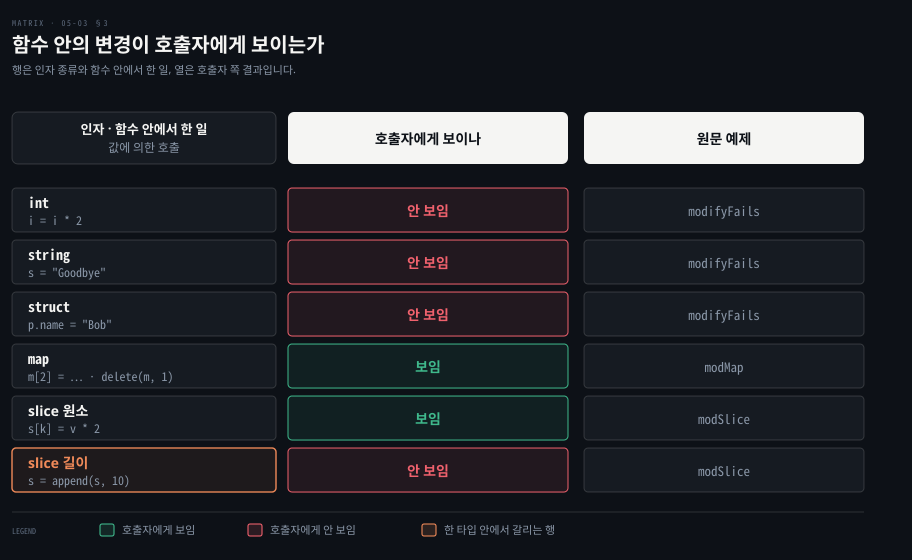

# defer 는 함수가 끝날 때 정리하고 인자는 늘 복사됩니다

---

> Learning Go 5장 끝입니다. 함수가 어떻게 끝나든 정리 코드를 실행하는 `defer` 와, 인자를 늘 복사해 넘기는 Go 의 값에 의한 호출을 다루고 장 끝 연습 문제를 풉니다.

## 핵심 요약

> 이 편이 매달린 하나의 생각은 Go 가 자원 정리를 블록이 아니라 `defer` 로 함수에 붙이고, 함수에 넘긴 값은 늘 복사본이라는 것입니다.

`defer` 로 등록한 호출은 둘러싼 함수가 끝날 때 늦게 등록한 것부터 실행됩니다. 인자는 등록 시점에 평가되고, 이름 붙은 반환 값과 함께 쓰면 함수의 결과까지 고칠 수 있습니다. 자원을 여는 함수가 그 자원을 닫는 클로저를 함께 돌려주는 것도 흔한 패턴입니다.

Go 는 인자로 넘긴 변수의 값을 늘 복사합니다. 그래서 `int`·`string`·struct 를 함수 안에서 바꿔도 호출자에게는 보이지 않습니다. map 과 slice 는 포인터로 구현되어 있어 map 의 변경과 slice 원소의 변경은 보이지만, slice 의 길이를 늘린 것은 보이지 않습니다.


## 학습 목표

> 이 편을 읽고 나면 아래 다섯 가지를 스스로 해낼 수 있습니다.

1. `defer` 로 파일 같은 자원을 닫는 코드를 쓰고, 여러 `defer` 가 실행되는 순서와 인자가 평가되는 시점을 말할 수 있습니다.
2. 이름 붙은 반환 값과 `defer` 로 함수의 반환 오류에 따라 커밋·롤백을 가르는 패턴을 설명할 수 있습니다.
3. 자원과 정리 클로저를 함께 돌려주는 함수를 쓰고, 그것이 호출자에게 `defer` 를 잊지 않게 하는 이유를 말할 수 있습니다.
4. Go 의 값에 의한 호출에서 `int`·`string`·struct·map·slice 가 함수 안 변경에 대해 어떻게 다르게 구는지 말할 수 있습니다.
5. 연습 문제 셋을 풀며 오류 반환·`defer`·클로저 반환을 직접 쓸 수 있습니다.


## 1. defer — 함수가 어떻게 끝나든 정리 코드를 실행합니다

> 파일이나 네트워크 연결 같은 임시 자원은 함수가 어느 길로 끝나든 정리해야 합니다. Go 는 정리 코드를 `defer` 키워드로 함수에 붙이고, 등록한 호출은 둘러싼 함수가 끝날 때 실행됩니다.

프로그램은 파일이나 네트워크 연결 같은 임시 자원을 자주 만듭니다. 원문은 이런 자원을 함수의 출구가 몇 개든, 함수가 성공했든 실패했든 정리해야 한다고 말합니다. Go 에서는 그 정리 코드를 `defer` 키워드로 함수에 붙입니다.

원문은 파일 내용을 찍는 유닉스 도구 `cat` 의 간단한 판으로 `defer` 를 보입니다. Go Playground 에서는 인자를 넘길 수 없어 로컬에서 돌려야 합니다.

```go
func main() {
	if len(os.Args) < 2 {
		log.Fatal("no file specified")
	}
	f, err := os.Open(os.Args[1])
	if err != nil {
		log.Fatal(err)
	}
	defer f.Close()
	data := make([]byte, 2048)
	for {
		count, err := f.Read(data)
		os.Stdout.Write(data[:count])
		if err != nil {
			if err != io.EOF {
				log.Fatal(err)
			}
			break
		}
	}
}
```

원문이 뒤 장에서 자세히 다룰 기능이 몇 나오니 차례로 읽습니다.

- `os.Args` 는 `os` 패키지의 slice 입니다. 첫 값은 프로그램 이름이고 나머지가 프로그램에 넘긴 인자라서, 길이가 2 이상인지로 파일 이름이 주어졌는지 봅니다. 없으면 `log.Fatal` 로 메시지를 찍고 프로그램을 끝냅니다.
- `os.Open` 은 읽기 전용 파일 핸들과 오류를 돌려줍니다. 파일을 열지 못하면 오류를 찍고 끝냅니다. 오류는 9장에서 다룹니다.
- 올바른 파일 핸들을 얻었으면, 함수가 어떻게 끝나든 쓴 뒤에 닫아야 합니다. 그래서 `defer` 뒤에 함수나 메서드 호출을 적습니다. 여기서는 파일 변수의 `Close` 메서드입니다. 메서드는 7장에서 다룹니다.
- 보통 함수 호출은 바로 실행되지만, `defer` 는 둘러싼 함수가 끝날 때까지 호출을 미룹니다.
- `Read` 메서드는 바이트 slice 에 읽은 바이트 수와 오류를 돌려줍니다. 오류가 파일 끝 표시 `io.EOF` 면 `break` 로 루프를 끝내고, 다른 오류면 `log.Fatal` 로 바로 끝냅니다. `Read` 는 "io and Friends" 절(13장)에서 다룹니다.

이 노트를 쓰면서 이 프로그램을 빌드해 자기 소스 파일을 넘기니 파일 내용이 찍혔고, 인자 없이 돌리니 `no file specified` 를 찍고 끝났습니다.

Java 는 `try`-`finally` 블록으로 같은 일을 하고, Java 7 부터는 try-with-resources 도 씁니다. 이 문단의 Java 이야기는 원문 밖의 보충입니다.

원문도 이 비교를 다룹니다. 원문 표현으로는 Java·JavaScript·Python 의 `try/catch/finally` 나 Ruby 의 `begin/rescue/ensure` 처럼 함수 안의 블록으로 자원 정리 시점을 정하는 언어에 익숙하면 `defer` 가 낯설 수 있습니다. 원문이 드는 그런 블록의 단점은 들여쓰기 한 단계가 더 생겨 코드를 읽기 어려워진다는 것입니다. Python 의 실제 문법은 `try/except/finally` 이니, 원문의 이 묶음은 느슨한 표현으로 읽습니다.

원문은 이것이 자기 의견만이 아니라고 말하며 두 연구를 인용합니다. 2017년 『Empirical Software Engineering』 에 실린 Vard Antinyan 등의 논문은 제안된 열한 가지 코드 특성 가운데 복잡도 증가에 뚜렷이 영향을 주는 것이 중첩 깊이와 구조의 결여 둘뿐이라고 밝혔습니다. 1983년 Richard Miara 등의 논문은 알맞은 들여쓰기 폭을 찾으려 했습니다. 그 결과는 두 칸에서 네 칸이었습니다.

### 여러 defer 는 늦게 등록한 것부터 돌고 인자는 등록할 때 정해집니다

원문은 `defer` 에 대해 몇 가지를 더 알아 두라고 합니다.

- `defer` 에는 함수, 메서드, 클로저를 모두 쓸 수 있습니다. 원문은 `defer` 와 함께 "함수" 라고 하면 "함수·메서드·클로저" 로 넓혀 읽으라고 합니다.
- 한 함수에서 여러 함수를 `defer` 할 수 있습니다. 실행 순서는 후입선출(LIFO)이라서 마지막에 등록한 것이 먼저 돕니다.
- `defer` 한 함수의 코드는 `return` 문 뒤에 실행됩니다.
- `defer` 에 인자를 넘기면 그 인자는 즉시 평가되어, 함수가 실행될 때까지 값이 저장됩니다.

두 성질을 한꺼번에 보이는 원문 예제입니다.

```go
func deferExample() int {
	a := 10
	defer func(val int) {
		fmt.Println("first:", val)
	}(a)
	a = 20
	defer func(val int) {
		fmt.Println("second:", val)
	}(a)
	a = 30
	fmt.Println("exiting:", a)
	return a
}
```

```bash
exiting: 30
second: 20
first: 10
```

둘째로 등록한 `defer` 가 먼저 돌았습니다. 각 `defer` 는 등록하던 순간의 `a`(10, 20)를 찍었습니다. 함수가 끝나는 시점의 `a` 는 30 인데도 그렇습니다. 이 노트를 쓰면서 돌린 결과도 같았습니다. 이 함수는 `30` 을 돌려줬습니다.

값을 돌려주는 함수를 `defer` 할 수는 있지만 그 반환 값을 읽을 방법은 없습니다. 원문은 이런 코드를 보입니다.

```go
func example() {
	defer func() int {
		return 2 // there's no way to read this value
	}()
}
```

`defer` 뒤 함수 끝의 괄호를 빠뜨리는 것도 원문이 짚는 흔한 실수입니다. 새 Go 개발자가 `defer` 에 함수를 적을 때 중괄호 뒤 괄호를 잊곤 하는데, 빠뜨리면 컴파일 에러이고 곧 습관이 된다고 합니다. 괄호가 있어야 함수가 실행될 때 넘길 값을 적을 수 있다고 기억하면 도움이 됩니다. 이 노트를 쓰면서 `defer func() {}` 로 써 보니 `expression in defer must be function call` 이 났습니다.


## 2. defer 와 이름 붙은 반환 값 — 오류에 따라 커밋과 롤백을 가릅니다

> `defer` 한 클로저는 이름 붙은 반환 값을 읽고 고칠 수 있습니다. 원문은 이것을 이름 붙은 반환 값을 쓸 가장 좋은 이유로 들고, 데이터베이스 트랜잭션의 커밋과 롤백을 오류 값으로 가르는 예를 보입니다.

`defer` 한 함수가 둘러싼 함수의 반환 값을 보거나 고칠 방법이 있을까요? 원문의 답은 있다는 것입니다. 그것이 이름 붙은 반환 값을 쓸 가장 좋은 이유입니다. [05-01](./05-01.Go%20%ED%95%A8%EC%88%98%EB%8A%94%20%EC%97%AC%EB%9F%AC%20%EA%B0%92%EC%9D%84%20%EB%8F%8C%EB%A0%A4%EC%A3%BC%EA%B3%A0%20%EC%98%A4%EB%A5%98%EB%8A%94%20%EB%A7%88%EC%A7%80%EB%A7%89%20%EA%B0%92%EC%9E%85%EB%8B%88%EB%8B%A4.md) §5 의 그림에서 `return` 이 결과 변수를 덮어쓴 뒤 defer 가 도는 자리가 여기입니다. 이 노트를 쓰면서 `(r int)` 를 돌려주는 함수에 `defer func() { r = r * 10 }()` 를 두고 `return 4` 를 하니 `40` 이 돌아왔습니다. 원문은 9장에서 `defer` 로 반환 오류에 맥락 정보를 더하는 패턴을 다룬다고 예고합니다. 여기서는 데이터베이스 트랜잭션 정리를 보입니다.

```go
func DoSomeInserts(ctx context.Context, db *sql.DB, value1, value2 string) (err error) {
	tx, err := db.BeginTx(ctx, nil)
	if err != nil {
		return err
	}
	defer func() {
		if err == nil {
			err = tx.Commit()
		}
		if err != nil {
			tx.Rollback()
		}
	}()
	_, err = tx.ExecContext(ctx, "INSERT INTO FOO (val) values $1", value1)
	if err != nil {
		return err
	}
	// use tx to do more database inserts here
	return nil
}
```

원문은 이 책에서 Go 의 데이터베이스 지원을 다루지 않습니다. 다만 표준 라이브러리 `database/sql` 패키지가 데이터베이스를 폭넓게 지원한다고 적습니다.

이 함수는 트랜잭션을 만들어 여러 번 삽입합니다. 하나라도 실패하면 롤백해 데이터베이스를 바꾸지 않습니다. 모두 성공하면 커밋해 변경을 저장합니다. `defer` 한 클로저가 `err` 에 값이 들어갔는지 봅니다. 들어가지 않았으면 `tx.Commit` 을 부릅니다. 이것도 오류를 돌려줄 수 있어서 그 경우 `err` 가 바뀝니다. 어느 데이터베이스 작업이든 오류를 냈다면 `tx.Rollback` 을 부릅니다. 결과 변수 `err` 에 이름이 붙어 있어서 클로저가 함수의 최종 반환 오류를 읽고 고칠 수 있다는 것이 이 예제의 요점입니다. 이 한 줄 정리는 노트의 해석입니다.

> **원문 정오**: 원문의 SQL 문자열 `"INSERT INTO FOO (val) values $1"` 은 `VALUES` 뒤 괄호가 빠져 있습니다. `$1` 자리표시자를 쓰는 PostgreSQL 의 문법은 `VALUES ( { expression | DEFAULT } [, ...] )` 로 괄호를 요구하므로, 실행하려면 `values ($1)` 로 써야 합니다. 책 전체 PDF 에서 이 문자열은 5장에 한 번만 나옵니다. 코드 블록의 마지막 인자 `value1` 은 PDF 추출본에서 `value` 까지만 보여, 함수 인자 이름에 맞춰 채웠습니다.

### 자원을 여는 함수가 닫는 클로저를 함께 돌려줍니다

원문은 자원을 할당하는 함수가 그 자원을 정리하는 클로저를 함께 돌려주는 것이 Go 의 흔한 패턴이라고 소개합니다. `cat` 프로그램을 이렇게 고친 판이 책 저장소에 있습니다. 먼저 파일을 열고 클로저를 돌려주는 도우미 함수입니다.

```go
func getFile(name string) (*os.File, func(), error) {
	file, err := os.Open(name)
	if err != nil {
		return nil, nil, err
	}
	return file, func() {
		file.Close()
	}, nil
}
```

이 함수는 파일, 함수, 오류를 돌려줍니다. `*` 는 Go 의 파일 참조가 포인터라는 뜻이고, 포인터는 6장에서 다룹니다. `main` 에서는 이렇게 씁니다.

```go
f, closer, err := getFile(os.Args[1])
if err != nil {
	log.Fatal(err)
}
defer closer()
```

Go 는 쓰지 않는 변수를 허용하지 않으므로, 함수에서 `closer` 를 돌려받고 부르지 않으면 컴파일되지 않습니다(02-02 §4). 원문은 이것이 호출자에게 `defer` 를 쓰라고 일깨운다고 말합니다. `defer` 할 때 `closer` 뒤에 괄호를 붙이는 것도 잊지 않습니다.


## 3. 값에 의한 호출 — 넘긴 값은 늘 복사되고 map 과 slice 만 다르게 보입니다

> Go 는 인자로 넘긴 변수의 값을 늘 복사합니다. `int`·`string`·struct 의 변경은 호출자에게 안 보이고, map 의 변경과 slice 원소의 변경은 보이지만 slice 에 `append` 한 것은 안 보입니다.

Go 가 값에 의한 호출(call by value) 언어라는 말은, 함수 인자에 변수를 넘기면 Go 가 늘 그 변수 값의 사본을 만든다는 뜻입니다. 원문은 간단한 struct 와 이를 고치려는 함수로 확인합니다.

```go
type person struct {
	age  int
	name string
}

func modifyFails(i int, s string, p person) {
	i = i * 2
	s = "Goodbye"
	p.name = "Bob"
}

func main() {
	p := person{}
	i := 2
	s := "Hello"
	modifyFails(i, s, p)
	fmt.Println(i, s, p)
}
```

```bash
2 Hello {0 }
```

함수 이름대로, 함수는 넘겨받은 인자의 값을 바꾸지 못합니다. 원문은 이것이 기본 타입만의 이야기가 아님을 보이려고 struct 를 넣었다고 말합니다. Java·JavaScript·Python·Ruby 를 써 봤다면 struct 의 동작이 이상하게 보일 수 있습니다. 그 언어들은 객체를 인자로 넘기면 함수 안에서 객체의 필드를 바꿀 수 있기 때문입니다. 원문은 이 차이의 이유를 포인터를 다룰 때 설명하겠다고 합니다.

### map 과 slice 는 다르게 보입니다

map 과 slice 는 조금 다릅니다. 원문은 map 인자를 고치는 함수와 slice 인자를 고치는 함수를 씁니다.

```go
func modMap(m map[int]string) {
	m[2] = "hello"
	m[3] = "goodbye"
	delete(m, 1)
}

func modSlice(s []int) {
	for k, v := range s {
		s[k] = v * 2
	}
	s = append(s, 10)
}

func main() {
	m := map[int]string{
		1: "first",
		2: "second",
	}
	modMap(m)
	fmt.Println(m)
	s := []int{1, 2, 3}
	modSlice(s)
	fmt.Println(s)
}
```

```bash
map[2:hello 3:goodbye]
[2 4 6]
```

map 쪽은 설명이 쉽습니다. map 인자에 한 변경은 모두 넘긴 변수에 반영됩니다. slice 는 더 복잡합니다. slice 의 원소는 무엇이든 바꿀 수 있지만 slice 를 늘릴 수는 없습니다. `[2 4 6]` 에는 두 배로 바뀐 원소가 보이지만 `append` 한 10 은 없습니다. 원문은 이것이 함수에 직접 넘긴 map·slice 에도, struct 의 map·slice 필드에도 똑같이 적용된다고 말합니다. 이 노트를 쓰면서 돌린 세 출력도 원문과 같았습니다. 아래 행렬이 이 절의 여섯 경우를 모읍니다.



맨 아래 주황 행이 눈여겨볼 자리입니다. 같은 slice 인데 원소 변경은 보이고 길이 변경은 안 보입니다. 03-01 §3 에서 `append` 가 결과를 돌려주고 호출자가 대입해야 한다고 한 것과 같은 뿌리입니다. 함수 안의 `s = append(s, 10)` 은 함수 안의 사본 `s` 만 바꾸고, 호출자의 `s` 는 여전히 길이 3 입니다. 이 연결은 노트의 해석입니다.

왜 map 과 slice 는 다른 타입과 다르게 굴까요? 원문의 답은 둘 다 포인터로 구현되어 있기 때문입니다. 6장에서 자세히 다룹니다. 원문의 팁 한 줄이 이것을 요약합니다. Go 의 모든 타입은 값 타입입니다. 다만 그 값이 포인터인 경우가 있을 뿐입니다.

### 값에 의한 호출이 상수의 빈자리를 메웁니다

원문은 값에 의한 호출이 Go 의 제한적인 상수 지원(02-02 §2)을 작은 불편에 그치게 하는 이유 하나라고 말합니다. 변수가 값으로 넘어가므로, 함수를 불러도 넘긴 변수가 바뀌지 않는다고 확신할 수 있습니다(변수가 slice 나 map 이 아니라면). 함수가 입력을 고치지 않고 새로 계산한 값을 돌려주면 프로그램의 데이터 흐름을 이해하기 쉬워지니, 대체로 좋은 일입니다. 그래도 가끔은 바꿀 수 있는 무언가를 함수에 넘겨야 합니다. 원문은 그때 필요한 것이 포인터라고 말하며 6장으로 넘어갑니다.


## 연습 문제

> 원문 연습 문제 세 개를 `go1.25.1` 에서 풀어 결과를 확인했습니다. 원문의 정답은 책의 Chapter 5 저장소에 있습니다.

### 1. 계산기에 0 으로 나누기 오류 더하기

05-02 §1 의 계산기는 0 으로 나누는 경우를 다루지 않습니다. 연산 함수의 시그니처를 `int` 와 `error` 를 함께 돌려주게 바꾸고, `div` 에서 나누는 수가 0 이면 `errors.New("division by zero")` 를, 나머지 경우에는 `nil` 을 돌려주는 문제입니다. `main` 도 이 오류를 확인하게 고칩니다. 05-01 §4 의 여러 값 반환과 오류 관례를 그대로 씁니다.

```go
func div(i, j int) (int, error) {
	if j == 0 {
		return 0, errors.New("division by zero")
	}
	return i / j, nil
}

var opMap = map[string]func(int, int) (int, error){
	"+": add,
	"-": sub,
	"*": mul,
	"/": div,
}
```

`main` 에서는 `result, err := opFunc(p1, p2)` 로 받고 `err` 가 `nil` 이 아니면 찍고 넘어갑니다. 이 노트를 쓰면서 `6 / 3` 과 `6 / 0` 을 넣어 보니 `2 <nil>` 과 `0 division by zero` 가 나왔습니다. 나머지 세 연산 함수도 같은 시그니처로 바꿔 `nil` 을 돌려주게 해야 map 에 함께 담깁니다.

### 2. defer 로 파일을 닫는 fileLen

파일 이름 `string` 을 받아 파일의 바이트 수 `int` 와 `error` 를 돌려주는 `fileLen` 을 쓰는 문제입니다. 파일을 읽다 오류가 나면 그 오류를 돌려줍니다. 파일이 제대로 닫히도록 `defer` 를 씁니다. 여기서는 바이트를 세는 방법으로 `Stat` 의 크기를 썼습니다. 이 방법은 원문이 정한 것이 아니라 노트의 풀이입니다. §1 의 `cat` 처럼 `Read` 로 읽으며 세도 됩니다.

```go
func fileLen(name string) (int, error) {
	f, err := os.Open(name)
	if err != nil {
		return 0, err
	}
	defer f.Close()
	info, err := f.Stat()
	if err != nil {
		return 0, err
	}
	return int(info.Size()), nil
}
```

이 노트를 쓰면서 풀이 파일 자신을 넘기니 `1041 <nil>` 이 나왔고 `ls` 로 본 크기와 같았습니다. 없는 파일을 넘기면 `0 open nope.txt: no such file or directory` 가 나왔습니다. `defer f.Close()` 를 파일을 연 직후에 두어, 뒤의 `Stat` 이 실패해 일찍 돌아가도 파일이 닫힙니다.

### 3. 접두어를 붙이는 함수를 돌려주는 prefixer

`string` 하나를 받아, `string` 을 받아 `string` 을 돌려주는 함수를 돌려주는 `prefixer` 를 쓰는 문제입니다. 돌려준 함수는 입력 앞에 `prefixer` 에 넘긴 문자열을 붙입니다. 05-02 §5 의 `makeMult` 와 같은 모양의 클로저입니다.

```go
func prefixer(p string) func(string) string {
	return func(s string) string {
		return p + " " + s
	}
}

func main() {
	helloPrefix := prefixer("Hello")
	fmt.Println(helloPrefix("Bob"))   // should print Hello Bob
	fmt.Println(helloPrefix("Maria")) // should print Hello Maria
}
```

이 노트를 쓰면서 돌리니 원문이 주석으로 적은 대로 `Hello Bob` 과 `Hello Maria` 가 찍혔습니다. 원문의 기대 출력에 공백이 있으므로 접두어와 입력 사이에 `" "` 를 넣었습니다.


## 핵심 개념 체크리스트

목표 번호 순서대로 짝지었습니다.

- [ ] (목표 1) `cat` 예제에서 `defer f.Close()` 를 `os.Open` 의 오류 확인 뒤에 두는 이유를 설명할 수 있습니까?
- [ ] (목표 1) `deferExample` 이 `exiting: 30`, `second: 20`, `first: 10` 순서로 찍는 이유를 두 성질로 설명할 수 있습니까?
- [ ] (목표 2) `DoSomeInserts` 의 `defer` 클로저가 `err` 를 보고 커밋과 롤백을 가를 수 있는 이유를 말할 수 있습니까?
- [ ] (목표 3) `getFile` 이 정리 클로저를 돌려주면 호출자가 `defer` 를 빠뜨리기 어려워지는 이유를 말할 수 있습니까?
- [ ] (목표 4) `modifyFails` 가 `p.name` 을 바꿔도 호출자의 `p` 가 그대로인 이유를 말할 수 있습니까?
- [ ] (목표 4) `modSlice` 뒤에 원소는 두 배가 됐는데 10 은 없는 이유를 설명할 수 있습니까?
- [ ] (목표 5) 계산기 map 의 값 타입을 `func(int, int) (int, error)` 로 바꾸면 무엇을 함께 고쳐야 합니까?


## 관련 문서

- [05-02 함수는 값이고 클로저는 바깥 변수를 붙잡습니다](./05-02.%ED%95%A8%EC%88%98%EB%8A%94%20%EA%B0%92%EC%9D%B4%EA%B3%A0%20%ED%81%B4%EB%A1%9C%EC%A0%80%EB%8A%94%20%EB%B0%94%EA%B9%A5%20%EB%B3%80%EC%88%98%EB%A5%BC%20%EB%B6%99%EC%9E%A1%EC%8A%B5%EB%8B%88%EB%8B%A4.md) — 5장 가운데. 클로저
- [05-01 Go 함수는 여러 값을 돌려주고 오류는 마지막 값입니다](./05-01.Go%20%ED%95%A8%EC%88%98%EB%8A%94%20%EC%97%AC%EB%9F%AC%20%EA%B0%92%EC%9D%84%20%EB%8F%8C%EB%A0%A4%EC%A3%BC%EA%B3%A0%20%EC%98%A4%EB%A5%98%EB%8A%94%20%EB%A7%88%EC%A7%80%EB%A7%89%20%EA%B0%92%EC%9E%85%EB%8B%88%EB%8B%A4.md) — 5장 앞. 이름 붙은 반환 값
- [03-01 slice 는 배열을 나눠 쓰는 창입니다](./03-01.slice%20%EB%8A%94%20%EB%B0%B0%EC%97%B4%EC%9D%84%20%EB%82%98%EB%88%A0%20%EC%93%B0%EB%8A%94%20%EC%B0%BD%EC%9E%85%EB%8B%88%EB%8B%A4.md) — 3장. append 가 결과를 돌려주는 이유
- [Learning Go 2판 — 정독 인덱스](./README.md) — 16장 전체 지도


## 참고 자료

- 원본: 《Learning Go, 2nd Edition》 (Jon Bodner, O'Reilly)
- 다룬 범위: Chapter 5 "defer" 부터 장 끝과 연습 문제까지
- [PostgreSQL — INSERT](https://www.postgresql.org/docs/current/sql-insert.html) — `VALUES` 뒤 괄호를 요구하는 문법, 원문 정오의 근거
