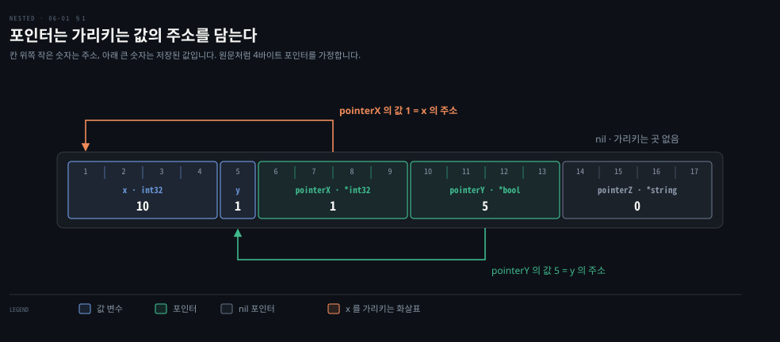

# 포인터는 값이 놓인 주소를 담고 객체 변수도 사실 포인터입니다

---

> Learning Go 6장 앞 부분입니다. 포인터 문법(`&`·`*`·`nil`·`new`)과 상수에 주소가 없어 생기는 불편, 그리고 Java·Python 의 객체 변수가 사실 포인터처럼 동작한다는 비교를 다룹니다.

## 핵심 요약

> 이 편이 매달린 하나의 생각은 포인터가 낯선 도구가 아니라 Java·Python 의 객체 변수가 늘 해 오던 동작이라는 것입니다.

포인터는 다른 값이 저장된 메모리 주소를 담는 변수입니다. `&` 는 변수의 주소를 얻습니다. `*` 는 포인터가 가리키는 값을 꺼냅니다. 포인터의 제로 값은 `nil` 입니다. `nil` 포인터를 역참조하면 panic 이 납니다. 숫자·문자열 리터럴과 상수에는 주소가 없어서 `&` 를 붙일 수 없습니다. 그래서 변수를 하나 두거나 제네릭 도우미 함수로 우회합니다.

Java·Python 에서 객체를 함수에 넘기면 필드 변경은 호출자에게 보이지만 매개변수를 새 객체로 바꾼 것은 보이지 않습니다. 원문은 이것이 참조에 의한 전달이 아니라, 객체 변수가 포인터이고 그 포인터가 값으로 복사되기 때문이라고 말합니다. Go 는 같은 동작을 포인터로 드러내고, 기본형과 struct 모두에서 값과 포인터 가운데 하나를 고르게 합니다.


## 학습 목표

> 이 편을 읽고 나면 아래 네 가지를 스스로 해낼 수 있습니다.

1. 메모리 칸 그림에서 변수와 포인터가 어디에 어떤 값으로 놓이는지 말할 수 있습니다.
2. `&`·`*`·`new`·포인터 타입을 써서 포인터를 만들고 역참조하며, `nil` 역참조가 panic 을 내는 이유를 설명할 수 있습니다.
3. 리터럴과 상수에 `&` 를 붙일 수 없는 이유와 두 가지 우회법을 말할 수 있습니다.
4. Java·Python 의 객체 전달이 참조에 의한 전달이 아닌 이유를 Go 의 포인터로 설명할 수 있습니다.


## 1. 포인터 — 다른 값이 놓인 주소를 담는 변수입니다

> 변수는 메모리의 연속된 칸에 저장되고, 칸마다 주소가 있습니다. 포인터는 그 주소를 값으로 담는 변수이며, 무엇을 가리키든 크기가 같습니다.

값을 함수에 넘기면 복사본이 넘어간다는 것을 05-03 §3 에서 봤습니다. 그런데 가끔은 함수가 호출자의 값을 바꿔야 합니다. 그러려면 값 자체가 아니라 값이 놓인 자리를 넘겨야 합니다. 그 자리를 담는 도구가 포인터입니다.

원문은 두 변수가 메모리에 놓이는 모습에서 시작합니다.

```go
var x int32 = 10
var y bool = true
```

모든 변수는 하나 이상의 연속된 메모리 칸에 저장됩니다. 그 칸의 위치를 **주소**라고 부릅니다. 타입마다 차지하는 칸 수가 다릅니다. 32비트 정수 `x` 는 네 바이트가 필요해서 주소 1 부터 4 까지 차지합니다. 불리언은 참·거짓을 담는 데 한 비트면 됩니다. 하지만 따로 주소를 매길 수 있는 가장 작은 단위가 바이트라서 한 바이트를 씁니다. 그래서 `y` 는 주소 5 에 값 1 로 놓입니다.

**포인터**는 다른 변수가 저장된 주소를 담는 변수입니다. 원문은 위 두 변수에 포인터 셋을 더합니다.

```go
var x int32 = 10
var y bool = true
pointerX := &x
pointerY := &y
var pointerZ *string
```



변수는 타입에 따라 차지하는 칸 수가 다릅니다. 포인터는 무엇을 가리키든 늘 같은 칸 수를 씁니다. 원문의 예는 4바이트 포인터를 씁니다. 요즘 컴퓨터는 8바이트 포인터를 쓰는 경우가 많다고 원문이 덧붙입니다. `pointerX` 는 주소 6 에 놓이고 값은 `x` 의 주소인 1 입니다. `pointerY` 는 주소 10 에 놓이고 값은 5 입니다. `pointerZ` 는 아무것도 가리키지 않아서 값이 0 입니다.

### nil 은 0 이 아니라 값이 없음을 뜻하는 이름입니다

포인터의 제로 값은 `nil` 입니다. `nil` 은 slice·map·함수의 제로 값으로 이미 나왔습니다. 원문은 이 타입들이 모두 포인터로 구현되어 있다고 말합니다. 채널과 인터페이스도 포인터로 구현되며, 원문은 이 둘을 「A Quick Lesson on Interfaces」와 「Channels」에서 다룹니다. `nil` 은 3장에서 본 대로 일부 타입에서 값이 없음을 나타내는 타입 없는 식별자입니다.

C 의 `NULL` 과 달리 `nil` 은 0 의 다른 이름이 아니어서 숫자와 서로 바꿀 수 없습니다. 원문의 경고도 하나 있습니다. `nil` 은 universe 블록에 정의된 이름이라 04-01 에서 본 `true` 처럼 가려질 수 있습니다. 원문은 동료를 속이려는 게 아니라면 변수나 함수 이름을 `nil` 로 짓지 말라고 말합니다.

Go 의 포인터 문법은 일부를 C 와 C++ 에서 가져왔습니다. 다만 Go 에는 가비지 컬렉터가 있어서 메모리 관리의 고통이 대부분 사라집니다. C 에서 흔한 포인터 산술 같은 기법은 Go 에서 쓸 수 없습니다. 표준 라이브러리의 `unsafe` 패키지로 저수준 조작을 할 수 있지만, 원문은 Go 개발자가 이것을 거의 쓰지 않는다고 말하며 16장에서 잠깐 다룹니다.

### & 는 주소를 얻고 * 는 가리키는 값을 꺼냅니다

`&` 는 **주소 연산자**입니다. 값 타입 변수 앞에 붙어 그 값이 저장된 주소를 돌려줍니다.

```go
x := "hello"
pointerToX := &x
```

`*` 는 **간접 연산자**입니다. 포인터 타입 변수 앞에 붙어 가리키는 값을 돌려줍니다. 이것을 **역참조**라고 부릅니다.

```go
x := 10
pointerToX := &x
fmt.Println(pointerToX)  // prints a memory address
fmt.Println(*pointerToX) // prints 10
z := 5 + *pointerToX
fmt.Println(z)           // prints 15
```

이 노트를 쓰면서 돌려 보니 `10` 과 `15` 가 찍혔습니다. 역참조하기 전에는 포인터가 `nil` 이 아닌지 확인해야 합니다. `nil` 포인터를 역참조하면 프로그램이 panic 을 냅니다.

```go
var x *int
fmt.Println(x == nil) // prints true
fmt.Println(*x)       // panics
```

로컬에서 돌리니 `true` 다음에 `runtime error: invalid memory address or nil pointer dereference` 로 panic 이 났습니다. Java 개발자라면 `NullPointerException` 과 같은 자리라고 보면 됩니다. 이 대응은 원문 밖의 비교입니다.

포인터를 나타내는 타입을 **포인터 타입**이라고 부릅니다. 타입 이름 앞에 `*` 를 붙여 쓰며, 어떤 타입이든 포인터 타입의 바탕이 될 수 있습니다.

```go
x := 10
var pointerToX *int
pointerToX = &x
```

내장 함수 `new` 도 포인터 변수를 만듭니다. 주어진 타입의 제로 값 인스턴스를 가리키는 포인터를 돌려줍니다.

```go
var x = new(int)
fmt.Println(x == nil) // prints false
fmt.Println(*x)       // prints 0
```

원문은 `new` 가 드물게 쓰인다고 말합니다. struct 는 리터럴 앞에 `&` 를 붙여 포인터를 만들면 됩니다.

```go
x := &Foo{}
var y string
z := &y
```


## 2. 리터럴과 상수에는 주소가 없습니다

> 숫자·불리언·문자열 리터럴과 상수는 컴파일 시점에만 있어서 `&` 를 붙일 수 없습니다. 기본형을 가리키는 포인터가 필요하면 변수를 두거나 제네릭 도우미 함수로 값을 변수에 담아 주소를 얻습니다.

struct 에는 `&` 를 붙일 수 있는데, 기본형 리터럴과 상수에는 붙일 수 없습니다. 원문은 이 둘이 메모리 주소를 갖지 않고 컴파일 시점에만 존재하기 때문이라고 설명합니다. 기본형 포인터가 필요하면 위의 `z := &y` 처럼 변수를 선언하고 그 변수를 가리킵니다.

이 제약이 가장 불편한 자리는 기본형 포인터를 필드로 가진 struct 입니다. 리터럴을 필드에 바로 넣을 수 없습니다.

```go
type person struct {
	FirstName  string
	MiddleName *string
	LastName   string
}

p := person{
	FirstName:  "Pat",
	MiddleName: "Perry", // This line won't compile
	LastName:   "Peterson",
}
```

원문은 이 코드가 다음 오류를 낸다고 적었습니다. `"Perry"` 앞에 `&` 를 붙이면 둘째 오류가 난다고 합니다.

```bash
# 원문 출력
cannot use "Perry" (type string) as type *string in field value
cannot take the address of "Perry"
```

```bash
# go1.25.1 에서 같은 두 줄을 빌드한 출력 (2026-09-27)
cannot use "Perry" (untyped string constant) as *string value in struct literal
invalid operation: cannot take address of "Perry" (untyped string constant)
```

문구는 달라졌지만 뜻은 같습니다. 지금 버전은 `"Perry"` 가 타입 없는 문자열 상수라는 점을 메시지에 드러내므로, 상수에는 주소가 없다는 원문의 설명과 더 곧게 이어집니다. 02-02 §2 에서 상수 대입 오류의 문구가 버전마다 달랐던 것과 같은 종류의 차이입니다.

### 제네릭 도우미 함수가 상수를 변수로 바꿔 줍니다

원문은 우회법 두 가지를 듭니다. 첫째는 앞에서 본 대로 값을 담을 변수를 하나 두는 것입니다. 둘째는 어떤 타입의 인자든 받아 그 타입의 포인터를 돌려주는 제네릭 도우미 함수를 쓰는 것입니다.

```go
func makePointer[T any](t T) *T {
	return &t
}
```

이 함수가 있으면 필드에 바로 쓸 수 있습니다.

```go
p := person{
	FirstName:  "Pat",
	MiddleName: makePointer("Perry"), // This works
	LastName:   "Peterson",
}
```

이 노트를 쓰면서 `*p.MiddleName` 을 찍으니 `Perry` 가 나왔습니다. 이 방법이 통하는 까닭은 05-03 §3 의 값에 의한 호출에 있습니다. 상수를 함수에 넘기면 상수가 매개변수로 복사되고, 매개변수는 변수입니다. 변수에는 메모리 주소가 있으니 함수가 그 주소를 돌려줄 수 있습니다. 제네릭 함수를 쓰는 법은 8장에서 다룹니다. 원문의 팁은 한 줄입니다. 상수 값을 포인터로 바꿀 때는 도우미 함수를 쓰라는 것입니다.


## 3. 포인터를 두려워하지 않기 — 객체 변수도 사실 포인터입니다

> Java·Python 에서 객체를 함수에 넘기면 필드 변경은 보이고 매개변수 재대입은 보이지 않습니다. 원문은 이것이 참조에 의한 전달이 아니라 객체 변수라는 포인터가 값으로 복사되는 동작이며, Go 의 포인터가 똑같이 동작한다고 말합니다.

원문이 세운 포인터의 첫째 규칙은 두려워하지 말라는 것입니다. Java·JavaScript·Python·Ruby 에 익숙하면 포인터가 위협적으로 보일 수 있습니다. 하지만 원문은 포인터가 사실 이 언어들의 클래스가 늘 보여 온 익숙한 동작이라고 말합니다. Go 에서 낯선 쪽은 오히려 포인터가 아닌 struct 입니다.

Java 와 JavaScript 는 기본형과 클래스의 동작이 다릅니다. Python 과 Ruby 에는 기본형이 따로 없지만 불변 인스턴스로 기본형을 흉내 냅니다. 기본형 값을 다른 변수에 대입하거나 함수에 넘기면 그쪽을 바꿔도 원본에는 드러나지 않습니다.

```java
int x = 10;
int y = x;
y = 20;
System.out.println(x); // prints 10
```

클래스의 인스턴스를 넘기면 어떻게 될까요? 원문은 Python 으로 예제를 보입니다. Java·JavaScript·Ruby 판은 책의 6장 저장소에 있다고 합니다.

```python
class Foo:
    def __init__(self, x):
        self.x = x

def outer():
    f = Foo(10)
    inner1(f)
    print(f.x)
    inner2(f)
    print(f.x)
    g = None
    inner2(g)
    print(g is None)

def inner1(f):
    f.x = 20

def inner2(f):
    f = Foo(30)

outer()
```

원문이 적은 출력은 `20`, `20`, `True` 이고, 이 노트를 쓰면서 Python 3 로 돌린 결과도 같았습니다. 원문은 이 네 언어에서 다음 세 가지가 성립한다고 정리합니다.

| 함수 안에서 한 일 | 호출자의 변수 | 이 예제의 자리 |
|------|------|------|
| 넘겨받은 인스턴스의 필드를 바꿉니다 | 바뀐 필드가 보입니다 | `inner1` 뒤 `20` |
| 매개변수에 새 인스턴스를 대입합니다 | 그대로입니다 | `inner2(f)` 뒤 `20` |
| `nil`·`null`·`None` 을 넘겨받아 매개변수에 새 값을 대입합니다 | 그대로입니다 | `inner2(g)` 뒤 `True` |

이 동작을 두고 이 언어들이 클래스 인스턴스를 참조로 넘긴다고 설명하는 사람들이 있습니다. 원문은 이것이 사실이 아니라고 말합니다. 참조로 넘긴다면 둘째와 셋째 경우에도 호출자의 변수가 바뀌어야 하기 때문입니다. 이 언어들도 Go 처럼 늘 값으로 넘깁니다.

실제로 벌어지는 일은 클래스 인스턴스가 모두 포인터로 구현되어 있다는 것입니다. 인스턴스를 함수에 넘기면 복사되는 값은 인스턴스를 가리키는 포인터입니다. `outer` 와 `inner1` 은 같은 메모리를 가리키므로 `inner1` 이 `f` 의 필드를 바꾸면 `outer` 에도 보입니다. `inner2` 가 `f` 에 새 인스턴스를 대입하면 따로 된 인스턴스가 생길 뿐 `outer` 의 변수는 그대로입니다.

Spring 위에서 Java 를 써 온 독자에게 옮기면, 서비스 메서드에 넘긴 엔티티의 setter 를 부르면 호출한 쪽에서도 값이 바뀌어 보이는 것이 첫째 경우입니다. 메서드 안에서 `entity = new Order()` 로 바꿔 끼워도 호출한 쪽이 모르는 것이 둘째 경우입니다. 이 대응은 노트의 풀이입니다.

### Go 는 기본형과 struct 모두에서 값과 포인터를 고르게 합니다

Go 에서 포인터 변수나 포인터 매개변수를 쓰면 위와 똑같은 동작을 봅니다. 차이는 Go 가 기본형과 struct 모두에 대해 값을 쓸지 포인터를 쓸지 고르게 한다는 점입니다. Java 에서는 `int` 는 늘 값이고 객체는 늘 포인터라서 이 선택권이 없습니다. 이 대비는 원문의 설명을 Java 쪽에서 다시 적은 것입니다.

원문은 대부분의 경우 값을 쓰라고 권합니다. 값을 쓰면 데이터가 언제 어떻게 바뀌는지 이해하기 쉽습니다. 부수 이점으로 가비지 컬렉터가 할 일도 줄어듭니다. 앞의 이유는 06-02 에서, 뒤의 이유는 06-03 에서 이어집니다.


## 핵심 개념 체크리스트

목표 번호 순서대로 짝지었습니다.

- [ ] (목표 1) 원문의 메모리 그림에서 `pointerY` 가 주소 10 에 놓이고 값이 5 인 이유를 설명할 수 있습니까?
- [ ] (목표 1) `int32` 와 `bool` 은 칸 수가 다른데 두 포인터는 같은 칸 수를 쓰는 이유를 말할 수 있습니까?
- [ ] (목표 2) `var x *int` 뒤에 `*x` 를 찍으면 무슨 일이 일어나고, 그것을 막으려면 무엇을 먼저 확인합니까?
- [ ] (목표 2) `new(int)` 가 돌려준 포인터를 역참조하면 무엇이 나옵니까?
- [ ] (목표 3) `MiddleName: &"Perry"` 가 컴파일되지 않는데 `makePointer("Perry")` 는 되는 이유를 말할 수 있습니까?
- [ ] (목표 4) Python 예제의 `inner2(f)` 뒤에 `f.x` 가 `30` 이 아니라 `20` 인 이유를 포인터 복사로 설명할 수 있습니까?


## 관련 문서

- [06-02 포인터 매개변수는 바꿔도 된다는 표시이고 slice 는 길이까지 복사됩니다](./06-02.%ED%8F%AC%EC%9D%B8%ED%84%B0%20%EB%A7%A4%EA%B0%9C%EB%B3%80%EC%88%98%EB%8A%94%20%EB%B0%94%EA%BF%94%EB%8F%84%20%EB%90%9C%EB%8B%A4%EB%8A%94%20%ED%91%9C%EC%8B%9C%EC%9D%B4%EA%B3%A0%20slice%20%EB%8A%94%20%EA%B8%B8%EC%9D%B4%EA%B9%8C%EC%A7%80%20%EB%B3%B5%EC%82%AC%EB%90%A9%EB%8B%88%EB%8B%A4.md) — 6장 가운데. 포인터를 언제 쓰는가
- [05-03 defer 는 함수가 끝날 때 정리하고 인자는 늘 복사됩니다](./05-03.defer%20%EB%8A%94%20%ED%95%A8%EC%88%98%EA%B0%80%20%EB%81%9D%EB%82%A0%20%EB%95%8C%20%EC%A0%95%EB%A6%AC%ED%95%98%EA%B3%A0%20%EC%9D%B8%EC%9E%90%EB%8A%94%20%EB%8A%98%20%EB%B3%B5%EC%82%AC%EB%90%A9%EB%8B%88%EB%8B%A4.md) — 5장 끝. 값에 의한 호출
- [04-01 안쪽 블록의 같은 이름은 바깥 변수를 가립니다](./04-01.%EC%95%88%EC%AA%BD%20%EB%B8%94%EB%A1%9D%EC%9D%98%20%EA%B0%99%EC%9D%80%20%EC%9D%B4%EB%A6%84%EC%9D%80%20%EB%B0%94%EA%B9%A5%20%EB%B3%80%EC%88%98%EB%A5%BC%20%EA%B0%80%EB%A6%BD%EB%8B%88%EB%8B%A4.md) — 4장. universe 블록의 이름이 가려지는 일
- [Learning Go 2판 — 정독 인덱스](./README.md) — 16장 전체 지도


## 참고 자료

- 원본: 《Learning Go, 2nd Edition》 (Jon Bodner, O'Reilly)
- 다룬 범위: Chapter 6 도입부터 "Don't Fear the Pointers" 까지
