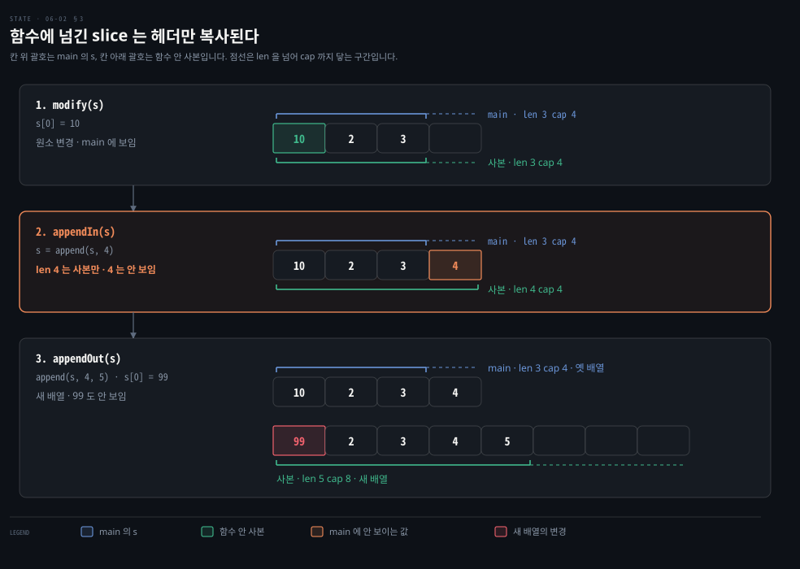

# 포인터 매개변수는 바꿔도 된다는 표시이고 slice 는 길이까지 복사됩니다

---

> Learning Go 6장 가운데입니다. 포인터를 언제 쓰고 언제 피하는지, 제로 값과 값 없음을 가르는 법, 그리고 5장에서 미뤄 둔 map 과 slice 가 함수 안에서 다르게 구는 이유를 다룹니다.

## 핵심 요약

> 이 편이 매달린 하나의 생각은 Go 에서 포인터가 성능 도구이기 전에 이 값을 바꿀 수 있다는 표시라는 것입니다.

Go 에는 변수를 불변으로 선언하는 장치가 없습니다. 대신 값으로 넘기면 원본이 바뀌지 않는다는 것이 보장되고, 포인터로 넘기면 바뀔 수 있다는 뜻이 됩니다. 포인터 매개변수도 복사본이라서 함수 안에서 포인터 자체를 바꾸면 호출자에게 보이지 않습니다. 호출자의 값을 바꾸려면 역참조해서 가리키는 자리에 써야 합니다.

원문은 포인터를 마지막 수단으로 두라고 권합니다. struct 를 채울 때는 포인터를 받기보다 새 값을 돌려주고, `json.Unmarshal` 처럼 인터페이스를 받는 함수에서만 포인터로 채웁니다. map 은 struct 를 가리키는 포인터라서 함수 안의 변경이 보입니다. slice 는 길이·용량·포인터 세 필드의 struct 라서 원소 변경은 보이지만 길이 변경은 보이지 않습니다. 이 성질 덕에 slice 를 재사용 버퍼로 씁니다.


## 학습 목표

> 이 편을 읽고 나면 아래 다섯 가지를 스스로 해낼 수 있습니다.

1. 포인터 매개변수가 왜 바뀔 수 있다는 표시가 되는지 말하고, `nil` 포인터를 넘기면 함수가 값을 채울 수 없는 이유를 설명할 수 있습니다.
2. struct 를 채울 때 포인터를 받는 대신 값을 돌려주라는 권고와, 그 예외인 `json.Unmarshal` 의 두 가지 이유를 말할 수 있습니다.
3. 제로 값과 값 없음을 구분해야 할 때 `nil` 포인터와 comma ok 가운데 무엇을 고를지 판단할 수 있습니다.
4. map 과 slice 의 내부 구조로 함수 안 변경이 호출자에게 어떻게 보이는지 설명할 수 있습니다.
5. slice 를 버퍼로 재사용하는 읽기 루프를 쓰고 연습 문제 2 의 결과를 설명할 수 있습니다.


## 1. 포인터는 바꿀 수 있는 매개변수를 표시합니다

> Go 에는 불변 선언이 없지만, 값으로 넘기면 원본이 바뀌지 않는다는 것이 보장됩니다. 포인터로 넘겨야 함수가 원본을 바꿀 수 있고, 그래서 포인터 매개변수는 이 값이 바뀔 수 있다는 표시가 됩니다.

Go 의 상수는 컴파일 시점에 계산할 수 있는 리터럴 식에 이름을 붙일 뿐입니다(02-02 §2). 다른 종류의 값을 불변으로 선언하는 장치는 없습니다. 그런데 요즘 소프트웨어 공학은 불변성을 받아들입니다. 원문은 MIT 의 Software Construction 강의가 그 이유를 요약한 문장을 인용합니다.

> "[I]mmutable types are safer from bugs, easier to understand, and more ready for change. Mutability makes it harder to understand what your program is doing, and much harder to enforce contracts."

불변 타입이 버그에 더 안전하고 이해하기 쉬우며 변경에 더 잘 대비한다는 뜻입니다. 가변성은 프로그램이 무엇을 하는지 이해하기 어렵게 하고 계약을 지키게 하기는 더 어렵게 한다는 말이 이어집니다.

불변 선언이 없으면 문제가 될 것 같지만, 원문은 값과 포인터 가운데 매개변수 타입을 고를 수 있다는 점이 이 문제를 푼다고 말합니다. 같은 강의 자료는 가변 객체라도 한 메서드 안에서만 쓰고 그 객체를 가리키는 참조가 하나뿐이면 괜찮다고 이어 갑니다. 그래서 Go 개발자는 어떤 변수가 불변이라고 선언하는 대신 포인터로 이 매개변수가 바뀔 수 있다는 것을 드러냅니다.

Go 는 값에 의한 호출이라 함수에 넘긴 값은 복사본입니다(05-03 §3). 기본형·struct·배열처럼 포인터가 아닌 타입은 호출된 함수가 원본을 바꿀 수 없으니 원본의 불변성이 보장됩니다. 포인터를 넘기면 함수는 포인터의 복사본을 받지만, 그 복사본도 원본 데이터를 가리키므로 원본을 바꿀 수 있습니다.

### 포인터 복사본을 바꿔도 호출자의 포인터는 그대로입니다

포인터도 복사된다는 사실에서 두 가지가 따라 나옵니다. 첫째, `nil` 포인터를 함수에 넘기면 함수 안에서 그것을 `nil` 이 아닌 값으로 만들 수 없습니다. 메모리 주소가 값으로 복사되어 넘어왔으니, `int` 매개변수를 바꿔도 호출자가 모르는 것처럼 주소를 바꿔도 호출자는 모릅니다.

```go
func failedUpdate(g *int) {
	x := 10
	g = &x
}

func main() {
	var f *int // f is nil
	failedUpdate(f)
	fmt.Println(f) // prints nil
}
```

`main` 의 `f` 는 `nil` 입니다. `failedUpdate` 를 부르면 `f` 의 값 `nil` 이 매개변수 `g` 로 복사됩니다. 함수 안에서 `g` 가 새 변수 `x` 를 가리키게 바꿔도 `main` 의 `f` 는 그대로 `nil` 입니다. 이 노트를 쓰면서 돌리니 `<nil>` 이 찍혔습니다.

둘째, 함수가 끝난 뒤에도 포인터 매개변수에 넣은 값이 남아 있게 하려면 역참조해서 값을 넣어야 합니다. 포인터를 바꾸면 복사본을 바꾼 것일 뿐입니다. 역참조하면 원본과 복사본이 함께 가리키는 자리에 새 값이 들어갑니다.

```go
func failedUpdate(px *int) {
	x2 := 20
	px = &x2
}

func update(px *int) {
	*px = 20
}

func main() {
	x := 10
	failedUpdate(&x)
	fmt.Println(x) // prints 10
	update(&x)
	fmt.Println(x) // prints 20
}
```

`failedUpdate` 는 `px` 가 함수 안의 `x2` 를 가리키게 바꿨을 뿐이라 `main` 의 `x` 는 10 입니다. `update` 는 `px` 가 가리키는 자리, 곧 `main` 의 `x` 에 20 을 씁니다. 로컬에서도 `10` 다음 `20` 이 찍혔습니다. Java 로 옮기면 메서드 안에서 매개변수에 새 객체를 대입하는 것이 `failedUpdate`, setter 로 필드를 바꾸는 것이 `update` 에 해당합니다. 이 대응은 06-01 §3 의 비교를 이어 적은 노트의 풀이입니다.


## 2. 포인터는 마지막 수단입니다

> 포인터는 데이터 흐름을 읽기 어렵게 하고 가비지 컬렉터의 일을 늘립니다. 그래서 struct 를 채울 때는 값을 돌려주고, 포인터로 채우는 방식은 인터페이스를 받는 `json.Unmarshal` 같은 예외에만 씁니다.

포인터를 쓰면 데이터 흐름을 이해하기 어려워지고 가비지 컬렉터에 일이 더 생깁니다. 원문은 그래서 Go 에서 포인터를 조심해서 쓰라고 말합니다. 함수에 struct 포인터를 넘겨 채우게 하지 말고, 함수가 struct 를 만들어 돌려주게 하라는 것이 원문의 권고입니다.

```go
// Example 6-3. Don't do this
func MakeFoo(f *Foo) error {
	f.Field1 = "val"
	f.Field2 = 20
	return nil
}

// Example 6-4. Do this
func MakeFoo() (Foo, error) {
	f := Foo{
		Field1: "val",
		Field2: 20,
	}
	return f, nil
}
```

원문은 포인터 매개변수로 변수를 고쳐도 되는 경우를 함수가 인터페이스를 받을 때 하나로 좁힙니다. JSON 을 다룰 때 이 패턴을 봅니다.

```go
f := struct {
	Name string `json:"name"`
	Age  int    `json:"age"`
}{}
err := json.Unmarshal([]byte(`{"name": "Bob", "age": 30}`), &f)
```

`Unmarshal` 은 JSON 이 든 바이트 slice 로 변수를 채웁니다. 바이트 slice 와 `any` 매개변수를 받게 선언되어 있고, `any` 자리에 넘긴 값은 포인터여야 합니다. 포인터가 아니면 오류를 돌려줍니다. 이 노트를 쓰면서 `&f` 대신 `f` 를 넘겨 보니 `json: Unmarshal(non-pointer struct { ... })` 오류가 돌아왔습니다.

### Unmarshal 이 값을 돌려주지 않고 포인터를 받는 두 이유

원문이 드는 첫째 이유는 이 함수가 제네릭보다 먼저 나왔다는 것입니다. 제네릭이 없으면 어떤 타입의 값을 만들어 돌려줄지 알 방법이 없습니다. 제네릭은 8장에서 다룹니다.

둘째 이유는 포인터를 넘기면 호출자가 메모리 할당을 쥘 수 있다는 것입니다. 데이터를 돌며 JSON 을 Go struct 로 바꾸는 일은 흔한 패턴이라 `Unmarshal` 은 이 경우에 맞춰 최적화되어 있습니다. `Unmarshal` 이 값을 돌려주고 루프 안에서 불린다면 반복마다 struct 인스턴스가 하나씩 생깁니다. 가비지 컬렉터의 일이 크게 늘고 프로그램이 느려집니다. 같은 패턴은 이 편 §3 의 버퍼에서 다시 나오고, 메모리를 효율적으로 쓰는 이야기는 06-03 에서 이어집니다.

원문은 JSON 연동이 워낙 흔해서 Go 를 처음 쓰는 개발자가 이 API 를 예외가 아니라 일반적인 경우로 받아들이기도 한다고 경고합니다. Spring 에서 Jackson 의 `ObjectMapper.readValue` 가 새 객체를 만들어 돌려주는 데 익숙하다면, Go 의 `Unmarshal` 이 채울 자리를 받는 쪽이라는 점이 반대로 보입니다. 이 비교는 원문 밖입니다.

함수에서 값을 돌려줄 때도 원문은 값 타입을 먼저 고르라고 권합니다. 반환 타입을 포인터로 하는 것은 데이터 타입 안에 바뀌어야 할 상태가 있을 때뿐입니다. 원문은 그 예로 「io and Friends」에서 볼 읽기·쓰기 버퍼를 들고, 동시성에 쓰이는 일부 타입은 늘 포인터로 넘겨야 한다며 12장을 가리킵니다.

### 포인터 전달의 성능 이점은 큰 데이터에서만 드러납니다

struct 가 충분히 크면 입력 매개변수나 반환 값을 포인터로 해서 성능이 좋아집니다. 원문의 수치를 옮깁니다.

| 측정 | 원문 수치 |
|------|------|
| 포인터를 함수에 넘기기 | 데이터 크기와 무관하게 약 1 나노초 |
| 값을 함수에 넘기기, 10MB 안팎 | 약 0.7 밀리초 |
| 100바이트 값 돌려주기 | 약 10 나노초 |
| 100바이트 값의 포인터 돌려주기 | 약 30 나노초 |
| 10MB 값 돌려주기 | 1.5 밀리초에 가까움 |
| 10MB 값의 포인터 돌려주기 | 0.5 밀리초가 조금 안 됨 |

넘기는 쪽에서 포인터는 데이터 크기와 무관하게 거의 같은 시간이 걸립니다. 포인터의 크기는 어떤 데이터 타입이든 같기 때문입니다. 값은 데이터가 커질수록 넘기는 데 오래 걸립니다. 돌려주는 쪽은 사정이 다릅니다. 10MB 보다 작은 데이터는 포인터를 돌려주는 편이 오히려 느리고, 데이터가 커지면 그 관계가 뒤집힙니다.

원문은 이 시간들이 아주 짧아서 대부분의 경우 포인터와 값의 차이가 성능에 영향을 주지 않는다고 말합니다. 다만 메가바이트 단위의 데이터를 함수 사이에 넘긴다면 그 데이터가 불변이어도 포인터를 고려하라고 합니다.

이 수치는 32GB RAM 의 i7-8700 에서 잰 것입니다. CPU 가 다르면 뒤집히는 지점도 달라집니다. 원문은 16GB RAM 의 Apple M1 에서는 100KB 안팎에서 이미 포인터를 돌려주는 편(5 마이크로초)이 값(8 마이크로초)보다 빠르다고 적었습니다. 직접 재 보려면 책 6장 저장소의 `sample_code/pointer_perf` 에서 벤치마크를 돌립니다. 벤치마크는 「Using Benchmarks」에서 다룹니다.

```bash
# 원문 명령을 실행할 수 있게 고친 형태
go test ./... -bench=.
```

> **원문 정오**: 원문은 이 명령을 `go test ./…​-bench=.` 로 인쇄했습니다. `./...` 의 점 세 개가 말줄임표 한 글자(`…`)로 바뀌며 그 뒤에 폭 없는 공백(U+200B)이 붙었고, 공백이 빠져 `-bench=.` 와 이어졌습니다. 공백이 빠진 것이 원고 탓인지 PDF 추출 탓인지는 이 PDF 만으로 가릴 수 없습니다. 이 노트를 쓰면서 그대로 입력해 보니 인자 전체를 한 디렉터리 이름으로 읽어 `directory not found` 로 실패했습니다. 같은 책 1장은 `go fmt ./...` 처럼 점 세 개로 바르게 인쇄했습니다. 16장 PDF 전체에서 `…` 는 네 자리에 나오며, 나머지 셋은 인용과 제목 속 말줄임이고 명령 안은 여기 하나뿐이었습니다.

### 제로 값과 값 없음을 가를 때는 comma ok 를 먼저 고릅니다

Go 에서 포인터는 제로 값이 대입된 변수·필드와 아예 값이 대입되지 않은 변수·필드를 가르는 데에도 흔히 쓰입니다. 이 구분이 중요하다면 대입되지 않은 상태를 `nil` 포인터로 나타냅니다.

다만 포인터는 바뀔 수 있다는 뜻도 지니므로 원문은 이 패턴을 조심하라고 말합니다. 함수에서 `nil` 로 설정한 포인터를 돌려주지 말라는 것입니다. 대신 map 에서 본 comma ok 관용구처럼 값 타입과 불리언을 함께 돌려주라고 권합니다(03-02). 매개변수나 매개변수의 필드로 `nil` 포인터가 넘어오면 함수 안에서 값을 채울 수 없다는 점도 원문이 다시 짚습니다. 값을 담을 자리가 없기 때문입니다. `nil` 이 아닌 포인터가 넘어왔더라도 문서에 적지 않았다면 고치지 말라고 합니다.

여기서도 JSON 은 예외입니다. JSON 과 데이터를 주고받을 때는 제로 값과 값이 전혀 없는 상태를 가를 방법이 자주 필요합니다. 그래서 struct 필드 가운데 null 이 될 수 있는 것은 포인터로 둡니다. JSON 이나 다른 외부 프로토콜을 다루는 게 아니라면, 값이 없음을 포인터 필드로 나타내고 싶은 유혹을 참으라고 원문은 말합니다. 값을 고칠 게 아니라면 값 타입과 불리언을 짝지어 씁니다.

Java 에서 엔티티의 나이 필드를 `int` 대신 `Integer` 로 두어 `null` 로 값 없음을 나타내는 것이 같은 발상입니다. 원문의 권고를 옮기면 JSON·DB 경계가 아닌 곳에서는 메서드가 `Optional` 을 돌려주거나 별도 플래그를 두어 값 없음을 드러내라는 말에 가깝습니다. Java 관례상 `Optional` 은 반환 타입용이라 엔티티 필드에는 두지 않습니다. 이 대응은 원문 밖의 비교입니다.


## 3. map 은 포인터이고 slice 는 세 필드 struct 입니다

> map 은 런타임 안에서 struct 를 가리키는 포인터라서, 함수에 넘기면 포인터가 복사되고 변경이 호출자에게 보입니다. slice 는 길이·용량·포인터를 담은 struct 라서, 원소 변경은 보이지만 `append` 로 바꾼 길이는 보이지 않습니다.

05-03 §3 에서 함수에 넘긴 map 의 변경은 호출자에게 보이고, slice 는 원소 변경만 보인다는 것을 확인했습니다. 원문은 이제 포인터를 알았으니 그 이유를 이해할 수 있다고 말합니다. Go 런타임 안에서 map 은 struct 를 가리키는 포인터로 구현되어 있습니다. map 을 함수에 넘기면 포인터를 복사하는 셈입니다.

이 노트를 쓰면서 64비트 macOS 에서 `unsafe.Sizeof` 로 재 보니 map 변수는 8바이트, slice 변수는 24바이트였습니다. 포인터 하나와 워드 세 개에 해당하는 크기입니다. 원문 밖의 확인입니다.

### map 은 공개 API 의 입력과 반환 값으로 신중히 고릅니다

map 이 포인터라는 사실 때문에 원문은 입력 매개변수나 반환 값에 map 을 쓰기 전에, 특히 공개 API 라면 신중히 생각하라고 말합니다. API 설계 측면에서 map 은 안에 든 값에 대해 아무것도 말해 주지 않습니다. 어떤 키가 있는지 명시적으로 정의하는 곳이 없으니 코드를 따라가 보는 수밖에 없습니다. 불변성 측면에서도 map 에 무엇이 들어갔는지 알려면 map 을 건드리는 함수를 모두 따라가 봐야 합니다. 그러면 API 가 스스로를 설명하지 못합니다.

동적 언어에 익숙하다면 다른 언어에 구조가 없는 자리를 map 으로 메우지 말라고 원문은 말합니다. Go 는 강한 타입 언어이니 map 을 돌리지 말고 struct 를 쓰라는 것입니다. struct 를 선호할 이유 하나는 메모리 배치에서도 나오며, 06-03 §2 에서 이어집니다. 다만 map 이 맞는 경우도 있습니다. struct 는 컴파일 시점에 필드 이름을 정해야 하므로, 데이터의 키를 컴파일 시점에 알 수 없다면 map 이 알맞습니다.

### slice 는 헤더가 복사되어 길이 변경이 보이지 않습니다

slice 를 함수에 넘길 때의 동작은 더 복잡합니다. slice 의 내용을 바꾸면 원본 변수에 보이지만, `append` 로 길이를 바꾼 것은 보이지 않습니다. 원본의 용량이 길이보다 커도 마찬가지입니다. 원문은 slice 가 세 필드의 struct 로 구현되어 있기 때문이라고 설명합니다. 길이를 담는 `int` 필드, 용량을 담는 `int` 필드, 그리고 메모리 블록을 가리키는 포인터입니다.

slice 를 다른 변수에 복사하거나 함수에 넘기면 길이·용량·포인터가 복사됩니다. 두 slice 변수는 같은 메모리를 가리킵니다. 이 노트가 그림에 맞춰 만든 예제로 세 경우를 확인했습니다.

```go
func modify(s []int)    { s[0] = 10 }
func appendIn(s []int)  { s = append(s, 4) }
func appendOut(s []int) { s = append(s, 4, 5); s[0] = 99 }

func main() {
	s := make([]int, 3, 4)
	s[0], s[1], s[2] = 1, 2, 3
	modify(s)    // s: [10 2 3] len 3 cap 4
	appendIn(s)  // s: [10 2 3] len 3 cap 4, s[:4] 은 [10 2 3 4]
	appendOut(s) // s: [10 2 3] len 3 cap 4
}
```

주석의 값은 go1.25.1 에서 찍은 결과입니다. 함수 안의 사본은 `appendIn` 에서 `[10 2 3 4]` len 4 cap 4, `appendOut` 에서 `[99 2 3 4 5]` len 5 cap 8 이었습니다.



원소를 바꾸면 포인터가 가리키는 메모리가 바뀌므로 복사본과 원본 모두에서 보입니다. 복사본에 `append` 했는데 용량이 남아 있으면 복사본의 길이만 바뀌고 새 값은 둘이 함께 쓰는 메모리 블록에 저장됩니다. 원본의 길이는 그대로라서, Go 런타임은 원본 길이를 넘어선 그 값을 원본에서 보이지 않게 막습니다. `s[:4]` 로 원본의 길이를 용량까지 넓혀 보면 `4` 가 거기 들어 있는 것이 보입니다.

용량이 모자라면 더 큰 새 메모리 블록이 할당되고 값이 복사됩니다. 그리고 복사본의 포인터·길이·용량이 새로 바뀝니다. 이 변경은 복사본에만 있으니 원본에 반영되지 않습니다. 이제 두 slice 는 서로 다른 메모리 블록을 가리키므로, `appendOut` 안에서 `s[0] = 99` 로 바꾼 것도 원본에는 보이지 않습니다. 03-01 §4 에서 부분 slice 에 `append` 하면 원본을 덮어쓰던 일과 같은 뿌리이며, 이 연결은 노트의 해석입니다.

결과적으로 함수에 넘긴 slice 는 내용을 바꿀 수 있지만 크기를 바꿀 수는 없습니다. slice 는 Go 에서 쓸 수 있는 유일한 선형 자료구조라 프로그램 곳곳으로 자주 넘겨집니다. 원문은 기본적으로 함수가 slice 를 고치지 않는다고 가정하고, 내용을 고치는 함수라면 문서에 적으라고 권합니다.

원문의 메모도 하나 있습니다. 어떤 크기의 slice 든 함수에 넘길 수 있는 것은 넘기는 타입이 크기와 무관하게 `int` 둘과 포인터 하나의 struct 로 같기 때문입니다. 크기가 제각각인 배열을 받는 함수를 쓸 수 없는 것은 배열은 데이터 전체가 넘어가기 때문입니다(03-01 §1).

### slice 를 재사용 버퍼로 씁니다

slice 매개변수의 내용은 바꿀 수 있고 크기는 바꿀 수 없다는 성질이 요긴하게 쓰이는 자리가 재사용 버퍼입니다. 파일이나 네트워크 연결 같은 외부 자원에서 데이터를 읽을 때, 많은 언어는 원문이 든 다음 의사 코드처럼 씁니다.

```bash
r = open_resource()
while r.has_data() {
	data_chunk = r.next_chunk()
	process(data_chunk)
}
close(r)
```

원문이 짚는 문제는 `while` 루프를 돌 때마다 한 번 쓰고 버릴 `data_chunk` 를 새로 할당한다는 점입니다. 불필요한 메모리 할당이 잔뜩 생깁니다. 가비지 컬렉션 언어가 이 할당을 알아서 처리해 주더라도 다 쓴 뒤 치우는 일은 여전히 남습니다. Go 도 가비지 컬렉션 언어입니다. 그래도 원문은 관용적인 Go 란 불필요한 할당을 피하는 것이라고 말합니다. 그래서 읽을 때마다 새로 할당해 돌려받지 않고, 바이트 slice 를 한 번 만들어 버퍼로 씁니다.

```go
file, err := os.Open(fileName)
if err != nil {
	return err
}
defer file.Close()
data := make([]byte, 100)
for {
	count, err := file.Read(data)
	process(data[:count])
	if err != nil {
		if errors.Is(err, io.EOF) {
			return nil
		}
		return err
	}
}
```

100바이트 버퍼를 한 번 만듭니다. 루프를 돌 때마다 다음 바이트 묶음(최대 100바이트)을 slice 에 복사합니다. 그리고 채워진 부분만 잘라 `process` 에 넘깁니다. `io.EOF` 는 더 읽을 데이터가 없다는 특수한 오류입니다. 그 밖의 오류가 나면 그 오류를 돌려줍니다. `io.EOF` 가 오면 데이터가 끝났으니 `nil` 을 돌려줍니다. I/O 는 「io and Friends」에서, 오류 처리는 9장에서 자세히 다룹니다.

`count` 만큼 먼저 처리하고 나서 오류를 보는 순서에는 까닭이 있습니다. `io.Reader` 의 문서는 `Read` 가 데이터를 돌려주면서 동시에 `io.EOF` 를 돌려줄 수 있으니 오류를 보기 전에 받은 바이트부터 처리하라고 적어 둡니다. 이 설명은 원문 밖이며 표준 라이브러리 문서[^reader]에 근거합니다.


## 연습 문제

> 원문 연습 문제 가운데 이 편의 내용에 해당하는 2번을 `go1.25.1` 에서 풀었습니다. 1번과 3번은 06-03 에 있습니다.

### 2. UpdateSlice 와 GrowSlice

`UpdateSlice` 는 `[]string` 과 `string` 을 받아 slice 의 마지막 자리를 그 문자열로 바꿉니다. 끝에서 slice 를 찍습니다. `GrowSlice` 는 같은 인자를 받아 문자열을 slice 에 `append` 한 뒤 slice 를 찍습니다. `main` 에서 두 함수를 부르고, 각 호출 앞뒤로 slice 를 찍어 어떤 변경이 `main` 에 보이는지 확인하는 문제입니다.

```go
func UpdateSlice(s []string, v string) {
	s[len(s)-1] = v
	fmt.Println("in UpdateSlice:", s)
}

func GrowSlice(s []string, v string) {
	s = append(s, v)
	fmt.Println("in GrowSlice:", s)
}

func main() {
	s := []string{"a", "b", "c"}
	fmt.Println("before UpdateSlice:", s)
	UpdateSlice(s, "d")
	fmt.Println("after UpdateSlice:", s)
	GrowSlice(s, "e")
	fmt.Println("after GrowSlice:", s)
}
```

```bash
# go1.25.1 에서 실행한 출력 (2026-09-27)
before UpdateSlice: [a b c]
in UpdateSlice: [a b d]
after UpdateSlice: [a b d]
in GrowSlice: [a b d e]
after GrowSlice: [a b d]
```

`UpdateSlice` 는 함께 쓰는 메모리의 원소를 바꿨으니 `main` 에도 `d` 가 보입니다. `GrowSlice` 는 복사본의 길이를 늘렸을 뿐이라 `main` 의 slice 는 길이 3 그대로입니다. 이 풀이는 리터럴로 만든 slice 라 길이와 용량이 같아 `append` 가 새 배열을 만드는 경우입니다. 용량이 남는 slice 였다면 `e` 는 함께 쓰는 배열에 들어가되 `main` 의 길이 밖이라 역시 보이지 않습니다.


## 핵심 개념 체크리스트

목표 번호 순서대로 짝지었습니다.

- [ ] (목표 1) `failedUpdate(f)` 뒤에 `f` 가 여전히 `nil` 인 이유를 포인터 복사로 설명할 수 있습니까?
- [ ] (목표 1) `update` 가 `*px = 20` 으로 쓰면 `main` 의 `x` 가 바뀌는 이유를 말할 수 있습니까?
- [ ] (목표 2) `json.Unmarshal` 이 결과를 돌려주지 않고 포인터를 받는 두 이유를 말할 수 있습니까?
- [ ] (목표 3) JSON 을 다루지 않는 함수에서 값이 없음을 알리려면 무엇을 돌려주는 편이 낫습니까?
- [ ] (목표 4) 함수 안의 `append` 가 용량 안에서 일어났는데도 호출자의 slice 에 새 값이 보이지 않는 이유를 설명할 수 있습니까?
- [ ] (목표 4) 공개 API 의 입력으로 map 보다 struct 를 권하는 두 가지 측면을 말할 수 있습니까?
- [ ] (목표 5) 버퍼 읽기 루프에서 `process(data[:count])` 를 오류 확인보다 먼저 두는 이유를 말할 수 있습니까?


## 관련 문서

- [06-01 포인터는 값이 놓인 주소를 담고 객체 변수도 사실 포인터입니다](./06-01.%ED%8F%AC%EC%9D%B8%ED%84%B0%EB%8A%94%20%EA%B0%92%EC%9D%B4%20%EB%86%93%EC%9D%B8%20%EC%A3%BC%EC%86%8C%EB%A5%BC%20%EB%8B%B4%EA%B3%A0%20%EA%B0%9D%EC%B2%B4%20%EB%B3%80%EC%88%98%EB%8F%84%20%EC%82%AC%EC%8B%A4%20%ED%8F%AC%EC%9D%B8%ED%84%B0%EC%9E%85%EB%8B%88%EB%8B%A4.md) — 6장 앞. 포인터 문법
- [06-03 값을 스택에 두면 가비지가 줄고 GOGC 와 GOMEMLIMIT 가 힙을 조절합니다](./06-03.%EA%B0%92%EC%9D%84%20%EC%8A%A4%ED%83%9D%EC%97%90%20%EB%91%90%EB%A9%B4%20%EA%B0%80%EB%B9%84%EC%A7%80%EA%B0%80%20%EC%A4%84%EA%B3%A0%20GOGC%20%EC%99%80%20GOMEMLIMIT%20%EA%B0%80%20%ED%9E%99%EC%9D%84%20%EC%A1%B0%EC%A0%88%ED%95%A9%EB%8B%88%EB%8B%A4.md) — 6장 끝. 가비지 컬렉터의 일 줄이기
- [03-01 slice 는 배열을 나눠 쓰는 창입니다](./03-01.slice%20%EB%8A%94%20%EB%B0%B0%EC%97%B4%EC%9D%84%20%EB%82%98%EB%88%A0%20%EC%93%B0%EB%8A%94%20%EC%B0%BD%EC%9E%85%EB%8B%88%EB%8B%A4.md) — 3장. 길이·용량과 append
- [Learning Go 2판 — 정독 인덱스](./README.md) — 16장 전체 지도


## 참고 자료

- 원본: 《Learning Go, 2nd Edition》 (Jon Bodner, O'Reilly)
- 다룬 범위: Chapter 6 "Pointers Indicate Mutable Parameters" 부터 "Slices as Buffers" 까지, 연습 문제 2

[^reader]: [Go 표준 라이브러리 — io.Reader](https://pkg.go.dev/io#Reader) — "Callers should always process the n > 0 bytes returned before considering the error err."
