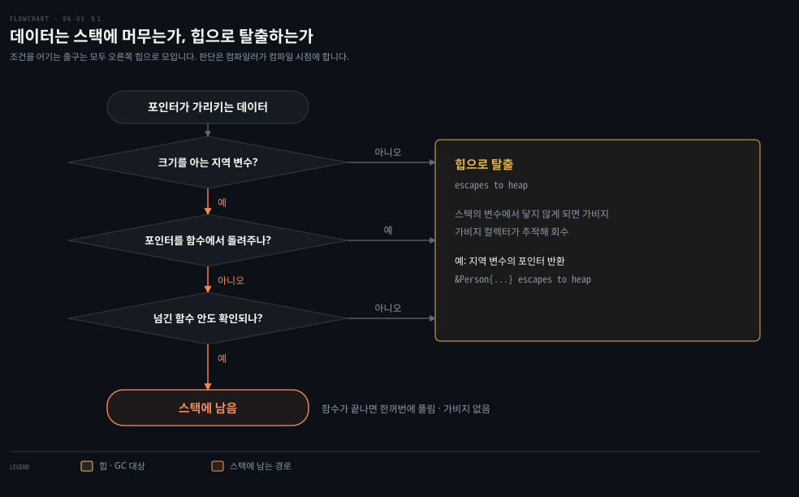

# 값을 스택에 두면 가비지가 줄고 GOGC 와 GOMEMLIMIT 가 힙을 조절합니다

---

> Learning Go 6장 끝입니다. 가비지가 무엇인지, 스택과 힙이 어떻게 다른지, 컴파일러가 데이터를 힙으로 보내는 탈출 분석, 힙이 느린 두 까닭, 그리고 가비지 컬렉터를 조정하는 `GOGC` 와 `GOMEMLIMIT` 를 다루고 장 끝 연습 문제를 풉니다.

## 핵심 요약

> 이 편이 매달린 하나의 생각은 Go 에서 값을 쓰라는 권고가 스타일이 아니라 가비지 컬렉터의 일을 줄이는 성능 원칙이라는 것입니다.

가비지는 더 이상 가리키는 포인터가 없는 데이터입니다. 스택은 스택 포인터만 옮겨 할당하고 함수가 끝나면 통째로 풀리므로 빠르고 가비지를 남기지 않습니다. 컴파일 시점에 크기를 알고 함수 밖으로 새지 않는 데이터만 스택에 둘 수 있습니다. 그렇지 않으면 컴파일러가 데이터를 힙으로 보내며, 이것을 탈출이라고 부릅니다.

힙은 두 가지로 느립니다. 가비지 컬렉터가 일하는 시간이 프로그램의 시간을 빼앗습니다. 그리고 포인터로 흩어진 데이터는 메모리를 순서대로 읽는 하드웨어의 장점을 살리지 못합니다. Go 의 가비지 컬렉터는 지연 시간을 짧게 하는 쪽을 골랐고, `GOGC` 로 수집 빈도를, `GOMEMLIMIT` 로 메모리 상한을 정합니다. 원문은 두 값을 함께 쓰라고 권합니다.


## 학습 목표

> 이 편을 읽고 나면 아래 다섯 가지를 스스로 해낼 수 있습니다.

1. 스택 할당이 왜 빠른지, 어떤 데이터가 스택에 머물 수 있는지 말할 수 있습니다.
2. 탈출 분석이 무엇이고 지역 변수의 포인터를 돌려줘도 Go 에서는 안전한 이유를 설명할 수 있습니다.
3. 힙 할당이 성능을 떨어뜨리는 두 까닭을 말하고, struct slice 와 포인터 slice 의 차이를 기계적 공감으로 설명할 수 있습니다.
4. `GOGC` 와 `GOMEMLIMIT` 가 각각 무엇을 정하는지, 둘을 함께 써야 하는 이유를 말할 수 있습니다.
5. `go build -gcflags="-m"` 과 `GODEBUG=gctrace=1` 로 탈출과 GC 횟수를 직접 확인할 수 있습니다.


## 1. 가비지는 가리키는 포인터가 없는 데이터이고 스택에는 가비지가 없습니다

> 가비지 컬렉터가 있어도 가비지를 많이 만들면 느려집니다. 컴파일 시점에 크기를 알고 함수 밖으로 새지 않는 값은 스택에 두어 가비지를 만들지 않고, 그렇지 않은 값만 힙으로 보냅니다.

06-02 §3 의 버퍼는 가비지 컬렉터의 일을 줄이는 방법 하나였습니다. 원문은 여기서 한발 물러나 가비지가 무엇이고 어디서 생기는지부터 짚습니다. 프로그래머가 말하는 **가비지**는 더 이상 가리키는 포인터가 없는 데이터입니다. 가리키는 포인터가 없어지면 그 데이터가 차지하던 메모리를 다시 쓸 수 있습니다. 메모리를 되찾지 않으면 프로그램의 메모리 사용량이 계속 늘어 결국 RAM 이 바닥납니다.

가비지 컬렉터는 쓰지 않는 메모리를 자동으로 찾아 되찾는 일을 합니다. 원문은 수십 년의 경험이 사람이 메모리를 손으로 제대로 관리하기 어렵다는 것을 보여 줬다며 Go 에 가비지 컬렉터가 있다는 점을 반깁니다. 하지만 가비지 컬렉터가 있다고 가비지를 잔뜩 만들어도 된다는 뜻은 아니라고 덧붙입니다.

### 스택은 포인터 하나만 옮겨 할당하고 함수가 끝나면 통째로 풉니다

**스택**은 연속된 메모리 블록입니다. 한 실행 흐름의 함수 호출은 모두 같은 스택을 함께 씁니다. 스택 포인터가 마지막으로 할당한 자리를 기억하고, 메모리를 더 할당할 때는 스택 포인터의 값만 옮깁니다. 그래서 스택 할당은 빠르고 단순합니다.

함수를 부르면 그 함수의 데이터를 위한 **스택 프레임**이 새로 생깁니다. 지역 변수와 함수에 넘어온 매개변수가 스택에 저장되고, 새 변수가 생길 때마다 스택 포인터가 그 값의 크기만큼 움직입니다. 함수가 끝나면 반환 값이 스택을 거쳐 호출한 함수로 복사됩니다. 그리고 스택 포인터가 끝난 함수의 프레임 시작점으로 돌아가, 그 함수의 지역 변수와 매개변수가 쓰던 메모리를 한꺼번에 풉니다. 이렇게 풀린 스택 메모리는 가비지 컬렉터가 따로 치울 필요가 없습니다. 이것은 원문의 설명에서 이끌어 낸 노트의 해석입니다.

원문의 메모 둘을 옮깁니다. Go 1.17 부터는 값을 함수에 넘기고 돌려받을 때 스택과 함께 레지스터(CPU 에 붙은 작고 아주 빠른 메모리)를 씁니다. 더 빠르고 더 복잡하지만 스택만 쓰는 함수 호출의 일반 개념은 그대로 통합니다. 또 Go 는 실행 중에 스택 크기를 늘릴 수 있습니다. 고루틴마다 자기 스택이 있고, 고루틴은 운영체제가 아니라 Go 런타임이 관리하기 때문입니다. 스택이 작게 시작해 메모리를 덜 쓰는 대신, 스택이 커져야 할 때는 스택의 데이터를 모두 복사해야 해서 느립니다. 스택이 커졌다 줄었다를 되풀이하게 만드는 최악의 코드도 쓸 수 있다고 원문은 덧붙입니다. 고루틴은 12장에서 다룹니다.

### 컴파일러가 스택에 둘 수 없다고 보면 데이터는 힙으로 탈출합니다

스택에 무언가를 두려면 컴파일 시점에 크기를 정확히 알아야 합니다. Go 의 값 타입인 기본형·배열·struct 는 모두 컴파일 시점에 차지할 메모리를 정확히 압니다. 배열의 크기가 타입의 일부인 이유도 여기에 있다고 원문은 말합니다(03-01 §1). 크기를 아니까 힙이 아니라 스택에 할당할 수 있습니다. 포인터 타입의 크기도 정해져 있으므로 포인터 자체도 스택에 저장됩니다.

포인터가 가리키는 데이터는 규칙이 더 복잡합니다. 원문은 그 데이터가 스택에 할당되려면 몇 가지 조건이 모두 맞아야 한다고 말합니다.

| 조건 | 어기면 왜 스택에 둘 수 없는가 |
|------|------|
| 컴파일 시점에 크기를 아는 지역 변수입니다 | 크기를 모르면 스택 포인터를 옮겨 자리를 만들 수 없습니다 |
| 그 포인터를 함수에서 돌려주지 않습니다 | 돌려주면 함수가 끝나 스택 프레임이 풀린 뒤에도 그 자리를 가리키게 됩니다 |
| 포인터를 다른 함수에 넘겨도 위 조건이 지켜진다고 컴파일러가 확인할 수 있습니다 | 확인할 수 없으면 컴파일러는 안전한 쪽을 고릅니다(아래 보수성 문단에서 가져온 풀이) |

컴파일러가 데이터를 스택에 둘 수 없다고 판단하는 경우를 두고 포인터가 가리키는 데이터가 스택을 **탈출**한다고 말합니다. 탈출한 데이터는 힙에 저장됩니다. **힙**은 가비지 컬렉터가 관리하는 메모리입니다. C 와 C++ 에서는 이 메모리를 손으로 관리합니다. 힙에 저장된 데이터는 스택에 있는 포인터 타입 변수에서 거슬러 올라갈 수 있는 동안 유효합니다. 스택의 어떤 변수도 직접이든 포인터 사슬을 거쳐서든 가리키지 않게 되면 그 데이터는 가비지가 됩니다. 그것을 치우는 것이 가비지 컬렉터의 일입니다.



C 프로그램에서 흔한 버그 하나는 지역 변수의 포인터를 돌려주는 것입니다. C 에서는 그 포인터가 이미 풀린 메모리를 가리킵니다. 원문은 Go 컴파일러가 더 영리하다고 말합니다. 지역 변수의 포인터를 돌려주는 것을 보면 그 지역 변수의 값을 힙에 둡니다. 연습 문제 1 에서 이것을 컴파일러 출력으로 직접 봅니다.

**탈출 분석**이라 부르는 이 판단은 완벽하지 않습니다. 스택에 둘 수 있었던 데이터가 힙으로 가는 경우도 있습니다. 하지만 컴파일러는 보수적이어야 합니다. 힙에 있어야 할 값을 스택에 남겼다가 무효한 데이터를 가리키게 되면 메모리가 망가지기 때문입니다. 원문은 새 Go 릴리스들이 탈출 분석을 개선한다고 덧붙입니다.


## 2. 힙이 느린 두 까닭 — 수집 시간과 흩어진 메모리

> 힙이 느린 까닭은 둘입니다. 가비지 컬렉터가 일하는 시간이 프로그램의 시간을 빼앗고, 포인터로 흩어진 데이터는 메모리를 순서대로 읽는 하드웨어의 장점을 잃습니다.

힙에 두는 게 뭐가 그리 나쁜가 싶을 수 있습니다. 원문은 성능과 관련된 문제 두 가지를 듭니다.

첫째, 가비지 컬렉터가 일하는 데 시간이 듭니다. 힙에서 쓸 수 있는 빈 메모리 조각을 모두 추적하고, 쓰인 블록 가운데 아직 유효한 포인터가 있는 것을 추적하는 일은 가볍지 않습니다. 그 시간만큼 프로그램이 원래 하려던 처리를 못 합니다. 가비지 컬렉션 알고리즘은 대략 두 부류로 나뉩니다. 한 번 훑을 때 가비지를 최대한 많이 찾는 **처리량** 중심과, 훑기를 최대한 빨리 끝내는 **지연 시간** 중심입니다.

원문은 Jeffrey Dean 이 2013년에 함께 쓴 논문 "The Tail at Scale" 을 듭니다. 이 논문은 응답 시간을 낮게 유지하도록 시스템을 지연 시간 중심으로 최적화해야 한다고 주장합니다. Go 런타임의 가비지 컬렉터도 낮은 지연 시간을 택했습니다.

원문은 각 수집 주기가 프로그램을 멈추는 시간을 500 마이크로초 미만으로 설계했다고 적었습니다. 하지만 가비지를 많이 만드는 프로그램이면 한 주기 안에 가비지를 다 찾지 못합니다. 그러면 수집이 느려지고 메모리 사용량이 늘어납니다. 구현이 궁금하면 Rick Hudson 이 2018년 International Symposium on Memory Management 에서 Go 가비지 컬렉터의 역사와 구현을 설명한 발표를 들어 보라고 원문이 권합니다.

### struct slice 는 한 줄로 놓이고 포인터 slice 는 흩어집니다

둘째 문제는 컴퓨터 하드웨어의 성질에서 옵니다. RAM 은 random access memory 라는 이름이지만, 메모리를 가장 빨리 읽는 방법은 순서대로 읽는 것입니다. Go 의 struct slice 는 데이터가 메모리에 순서대로 놓입니다. 그래서 불러오기도 처리하기도 빠릅니다. struct 를 가리키는 포인터의 slice, 또는 필드가 포인터인 struct 는 데이터가 RAM 곳곳에 흩어져 읽고 처리하기가 훨씬 느립니다.

원문은 Forrest Smith 가 이 영향을 깊이 다룬 블로그 글을 소개합니다. 그 수치에 따르면 RAM 에 무작위로 흩어진 포인터를 거쳐 데이터에 접근하면 대략 백 배쯤 느립니다. 원문 표현은 "two orders of magnitude" 입니다.

하드웨어를 의식하며 소프트웨어를 쓰는 이런 접근을 **기계적 공감**(mechanical sympathy)이라고 부릅니다. 이 말은 자동차 경주에서 왔습니다. 차가 무엇을 하는지 이해하는 운전자가 차의 성능을 마지막 한 방울까지 끌어낸다는 생각입니다. 2011년 Martin Thompson 이 이 말을 소프트웨어 개발에 쓰기 시작했습니다. 원문은 Go 의 모범 관례를 따르면 기계적 공감이 저절로 따라온다고 말합니다.

### Java 는 객체를 늘 힙에 두고 영리한 가비지 컬렉터로 메웁니다

원문은 Go 의 방식을 Java 와 견줍니다. Java 도 Go 처럼 지역 변수와 매개변수를 스택에 둡니다. 하지만 06-01 §3 에서 본 대로 Java 의 객체는 포인터로 구현됩니다. 객체 변수마다 스택에는 포인터만 할당되고 객체 안의 데이터는 힙에 할당됩니다. 스택에 통째로 저장되는 것은 숫자·불리언·char 같은 기본형뿐입니다. 그래서 Java 의 가비지 컬렉터는 할 일이 아주 많습니다.

`List` 인터페이스의 구현도 포인터 배열을 가리키는 포인터로 만들어집니다. 겉보기엔 선형 자료구조지만 읽을 때 메모리 여기저기를 건너뛰어야 해서 비효율적입니다. 원문은 Python·Ruby·JavaScript 의 순차 자료형도 비슷하다고 말합니다. 이 비효율을 메우려고 JVM 에는 처리량 중심·지연 시간 중심의 영리한 가비지 컬렉터들이 있고, 모두 설정으로 조정할 수 있습니다. Python·Ruby·JavaScript 의 가상 머신은 덜 최적화되어 성능이 그만큼 떨어진다고 원문은 봅니다.

HotSpot 에서는 Parallel GC 가 처리량 쪽, ZGC 가 짧은 멈춤 쪽 수집기이고, Spring 서버의 기본인 G1 은 멈춤 시간 목표를 두고 둘 사이의 균형을 잡습니다. HotSpot 의 JIT 도 탈출 분석을 해서 메서드 밖으로 새지 않는 일부 객체를 힙에 할당하지 않고 필드로 풀어 씁니다(스칼라 치환). 그래서 기본형만 스택에 있다는 원문의 설명은 JIT 최적화를 뺀 언어 모델 기준으로 읽는 것이 맞습니다. 이 단락은 원문 밖의 보충입니다.

### 가비지를 덜 만드는 것이 Go 의 관용이자 가장 효율적인 길입니다

이제 Go 가 포인터를 아껴 쓰라고 권하는 이유가 보입니다. 되도록 많은 것을 스택에 두면 가비지 컬렉터의 일이 줄어듭니다. struct 나 기본형의 slice 는 데이터가 메모리에 한 줄로 놓여 빨리 접근됩니다. 가비지 컬렉터가 일할 때도 가비지를 최대한 모으기보다 빨리 돌아오도록 최적화되어 있습니다.

원문은 이 접근이 통하는 열쇠가 애초에 가비지를 덜 만드는 것이라고 말합니다. 메모리 할당 최적화에 신경 쓰는 일이 섣부른 최적화처럼 느껴질 수 있습니다. 그러나 Go 에서는 관용적인 방식이 곧 가장 효율적인 방식이라는 것이 원문의 결론입니다. 스택·힙 할당과 탈출 분석을 더 알고 싶다면 Ardan Labs 의 Bill Kennedy, Segment 의 Achille Roussel 과 Rick Branson 이 쓴 블로그 글을 원문이 권합니다.


## 3. GOGC 는 수집 빈도를, GOMEMLIMIT 는 메모리 상한을 정합니다

> 가비지 컬렉터는 가비지를 조금 쌓아 두었다가 치웁니다. 얼마나 쌓일 때까지 기다릴지는 `GOGC` 가, 전체 메모리를 얼마까지 쓸지는 `GOMEMLIMIT` 가 정합니다.

가비지 컬렉터는 참조가 끊긴 메모리를 곧바로 되찾지 않습니다. 그렇게 하면 성능이 크게 떨어지기 때문입니다. 대신 가비지가 조금 쌓이게 둡니다. 그래서 힙에는 거의 늘 살아 있는 데이터와 더는 필요 없는 메모리가 함께 들어 있습니다. Go 런타임은 힙 크기를 조절하는 설정 두 가지를 줍니다.

### GOGC — 다음 수집을 언제 시작할지 정합니다

첫째는 `GOGC` 환경 변수입니다. 가비지 컬렉터는 수집 주기가 끝날 때 힙 크기를 보고, 다음 수집을 시작할 힙 크기를 원문이 적은 다음 공식으로 계산합니다.

```bash
CURRENT_HEAP_SIZE + CURRENT_HEAP_SIZE*GOGC/100
```

원문은 실제 계산이 이보다 조금 복잡하다고 메모를 붙입니다. 힙 크기만이 아니라 모든 고루틴의 스택 크기와 패키지 수준 변수를 담는 메모리도 따집니다. 대부분은 힙이 이 영역들보다 훨씬 크지만 이 영역들이 영향을 주는 경우도 있다고 합니다. Go 팀의 가비지 컬렉터 가이드[^gcguide]에 적힌 공식은 이 메모와 맞습니다.

```bash
# A Guide to the Go Garbage Collector 의 공식 (2026-09-27 조회)
Target heap memory = Live heap + (Live heap + GC roots) * GOGC / 100
```

가이드는 이 공식 바로 뒤에 살아 있는 힙 8 MiB, 고루틴 스택 1 MiB, 전역 변수의 포인터 1 MiB 인 프로그램을 예로 듭니다. 그래서 GC roots 는 원문 메모가 말한 스택과 패키지 수준 변수 쪽 메모리에 해당한다고 읽힙니다. 이 대응은 노트의 해석입니다.

`GOGC` 의 기본값은 `100` 입니다. 다음 수집을 부르는 힙 크기가 이번 수집이 끝났을 때 힙 크기의 대략 두 배라는 뜻입니다. 값을 줄이면 목표 힙이 작아지고 늘리면 커집니다. 원문은 어림잡아 `GOGC` 를 두 배로 하면 GC 에 드는 CPU 시간이 절반이 된다고 말합니다. 가이드도 "doubling GOGC will double heap memory overheads and roughly halve GC CPU cost" 라고 적어, 메모리 비용이 두 배가 된다는 반대편 대가를 함께 밝힙니다.

`GOGC` 를 `off` 로 하면 가비지 컬렉션이 꺼집니다. 프로그램은 빨라지지만 오래 도는 프로세스라면 컴퓨터의 메모리를 모두 써 버릴 수 있습니다. 원문은 보통 이것을 바람직한 동작으로 보지 않는다고 말합니다.

### GOMEMLIMIT — 전체 메모리 상한을 정합니다

둘째 설정은 Go 프로그램이 쓸 수 있는 메모리 총량의 상한입니다. 원문은 Java 개발자라면 JVM 인자 `-Xmx` 가 익숙할 텐데 `GOMEMLIMIT` 가 비슷하다고 말합니다. 기본값은 꺼져 있습니다. 엄밀히는 `math.MaxInt64` 로 설정되어 있지만, 원문 말대로 그만한 메모리를 가진 컴퓨터는 아마 없을 것입니다.

`GOMEMLIMIT` 값은 바이트 단위이며 `B`·`KiB`·`MiB`·`GiB`·`TiB` 접미사를 붙일 수 있습니다. 예를 들어 `GOMEMLIMIT=3GiB` 는 상한을 3 기비바이트, 곧 3,221,225,472 바이트로 정합니다. 이 접미사는 흔히 쓰는 10의 거듭제곱 KB·MB·GB·TB 에 대응하는 2의 거듭제곱 공식 단위입니다. KiB 는 2^10, MiB 는 2^20 입니다.

최대 메모리를 제한하면 성능이 좋아진다는 말은 직관에 어긋나 보입니다. 원문이 드는 주된 이유는 컴퓨터나 가상 머신, 컨테이너의 RAM 이 무한하지 않다는 것입니다. 메모리 사용량이 갑자기 잠깐 치솟을 때 `GOGC` 만 믿으면 최대 힙이 쓸 수 있는 메모리를 넘을 수 있습니다. 그러면 메모리가 디스크로 스왑되어 크게 느려지고, 운영체제와 설정에 따라서는 프로그램이 죽을 수도 있습니다. 상한을 정하면 힙이 컴퓨터의 자원을 넘어서까지 커지지 않습니다.

### GOMEMLIMIT 는 스래싱을 피하려고 넘어설 수 있는 느슨한 상한입니다

`GOMEMLIMIT` 는 경우에 따라 넘어설 수 있는 느슨한 상한입니다. 가비지 컬렉션 시스템에서 흔한 문제가 있습니다. 수집기가 메모리를 상한 아래로 내릴 만큼 비우지 못하거나, 프로그램이 계속 상한에 부딪혀 수집 주기가 빠르게 연달아 돌 때입니다. 이것을 **스래싱**이라 부르며, 프로그램이 가비지 컬렉터를 돌리는 일 말고는 아무것도 못 하게 됩니다. Go 런타임은 스래싱이 시작되는 것을 감지하면 현재 수집 주기를 끝내고 상한을 넘어서는 쪽을 고릅니다. 그러니 `GOMEMLIMIT` 는 쓸 수 있는 메모리의 절대 최대치보다 낮게 잡아 여유를 두라고 원문은 말합니다.

`GOMEMLIMIT` 를 정하면 `GOGC` 를 `off` 로 해도 메모리가 바닥나지 않습니다. 하지만 원문은 이것이 원하는 성능을 주지 않을 수 있다고 말합니다. 짧은 멈춤이 잦던 것이 긴 멈춤이 드문 것으로 바뀌기 쉽습니다. 웹 서비스라면 응답 시간이 들쭉날쭉해지는데, 바로 Go 의 가비지 컬렉션이 피하려고 설계된 동작입니다. 원문의 결론은 두 환경 변수를 함께 써서 적당한 수집 속도와 지켜야 할 상한을 모두 확보하라는 것입니다. 더 자세한 사용법은 Go 개발팀의 "A Guide to the Go Garbage Collector" 를 읽으라고 권합니다.


## 연습 문제

> 원문 연습 문제 가운데 1번과 3번을 `go1.25.1` 에서 풀었습니다. 2번은 06-02 에 있고, 원문의 정답은 책의 Chapter 6 저장소에 있습니다.

### 1. MakePerson 과 MakePersonPointer 의 탈출

`string` 필드 `FirstName`·`LastName` 과 `int` 필드 `Age` 를 가진 struct `Person` 을 만듭니다. `firstName`·`lastName`·`age` 를 받아 `Person` 을 돌려주는 `MakePerson` 과 `*Person` 을 돌려주는 `MakePersonPointer` 를 쓰고 `main` 에서 둘 다 부릅니다. 그리고 `go build -gcflags="-m"` 으로 컴파일해 어떤 값이 힙으로 탈출하는지 보는 문제입니다. 원문은 무엇이 탈출하는지 보고 놀랐는지를 묻습니다.

```go
func MakePerson(firstName, lastName string, age int) Person {
	return Person{FirstName: firstName, LastName: lastName, Age: age}
}

func MakePersonPointer(firstName, lastName string, age int) *Person {
	return &Person{FirstName: firstName, LastName: lastName, Age: age}
}

func main() {
	p := MakePerson("Bob", "Bobson", 50)
	fmt.Println(p)
	pp := MakePersonPointer("Fred", "Fredson", 30)
	fmt.Println(pp)
}
```

```bash
# go build -gcflags="-m" 의 출력에서 탈출 관련 줄만 (go1.25.1, 2026-09-27)
./main.go:16:9: &Person{...} escapes to heap
./main.go:21:14: p escapes to heap
./main.go:22:25: &Person{...} escapes to heap
```

`MakePersonPointer` 안의 `&Person{...}` 이 탈출하는 것은 §1 의 규칙대로입니다. 지역 변수의 포인터를 돌려주니 힙에 둡니다. 16행은 함수 본문이고 22행은 `main` 에 인라인된 호출이라 같은 탈출이 두 줄로 나옵니다. 눈여겨볼 쪽은 21행의 `p escapes to heap` 입니다. `MakePerson` 은 값을 돌려줬는데도 `p` 가 탈출했습니다.

`fmt.Println` 이 인자를 `any` 로 받기 때문입니다. 값을 인터페이스에 담으면 그 값이 힙으로 가는 경우가 많습니다. 이 풀이는 노트의 해석이며, 인터페이스는 7장에서 다룹니다. 이 노트를 쓰면서 `fmt.Println(p)` 를 `_ = p.Age` 로 바꿔 다시 빌드하니 `p escapes to heap` 줄이 사라지고 `&Person{...}` 두 줄만 남았습니다.

### 3. 천만 명의 Person 과 GOGC

`Person` 천만 개를 담은 `[]Person` 을 만드는 프로그램을 쓰고 걸린 시간을 잽니다. `GOGC` 를 바꿔 가며 시간이 어떻게 달라지는지 보고, `GODEBUG=gctrace=1` 로 수집이 언제 일어나는지, `GOGC` 에 따라 수집 횟수가 어떻게 바뀌는지 봅니다. 마지막으로 용량을 천만으로 잡아 slice 를 만들면 무엇이 달라지는지 묻습니다.

```go
func main() {
	start := time.Now()
	var people []Person
	if len(os.Args) > 1 && os.Args[1] == "cap" {
		people = make([]Person, 0, 10_000_000)
	}
	for i := 0; i < 10_000_000; i++ {
		people = append(people, Person{"Bob", "Bobson", 30})
	}
	fmt.Println(len(people), time.Since(start))
}
```

이 노트를 쓰면서 Apple M3 에서 한 번씩 돌린 결과입니다. 수집 횟수는 `gctrace` 출력에서 `gc ` 로 시작하는 줄을 센 값입니다.

| GOGC | 용량 없이 append 시간 | 수집 횟수 | 용량 천만으로 시작 시간 | 수집 횟수 |
|:--:|--:|--:|--:|--:|
| 50 | 942ms | 29 | 80ms | 1 |
| 100 | 906ms | 18 | 190ms | 1 |
| 200 | 463ms | 12 | 187ms | 1 |
| off | 432ms | 0 | 43ms | 0 |

`GOGC` 를 키울수록 수집 횟수가 29, 18, 12, 0 으로 줄었습니다. 용량을 미리 잡으면 `append` 가 새 배열을 거듭 만들 일이 없어 수집이 한 번뿐이었습니다. 03-01 §3 에서 본 용량 증가가 곧 버려지는 옛 배열, 곧 가비지라는 점이 이 숫자로 드러납니다. 이 연결은 노트의 해석입니다.

시간은 흔들림이 큽니다. `GOGC=100` 으로 두 번 더 돌리니 용량 없이 581ms·561ms, 용량을 잡고 182ms·106ms 였습니다. 그래서 표의 시간은 경향만 보고, 수집 횟수 쪽을 믿을 만한 비교로 읽는 것이 맞습니다.


## 핵심 개념 체크리스트

목표 번호 순서대로 짝지었습니다.

- [ ] (목표 1) 스택 할당이 스택 포인터를 옮기는 것만으로 끝나는 이유와, 그래서 스택에 둘 수 있는 데이터의 조건을 말할 수 있습니까?
- [ ] (목표 2) C 에서는 버그인 지역 변수 포인터 반환이 Go 에서는 안전한 이유를 탈출 분석으로 설명할 수 있습니까?
- [ ] (목표 2) 탈출 분석이 보수적이어야 하는 이유를 말할 수 있습니까?
- [ ] (목표 3) `[]Person` 이 `[]*Person` 보다 읽기 빠른 이유를 기계적 공감으로 설명할 수 있습니까?
- [ ] (목표 4) `GOGC=100` 이 다음 수집 시점을 어떻게 정하는지, `GOGC` 를 두 배로 하면 무엇을 얻고 무엇을 내주는지 말할 수 있습니까?
- [ ] (목표 4) `GOMEMLIMIT` 만 정하고 `GOGC=off` 로 두면 웹 서비스에서 무엇이 나빠질 수 있습니까?
- [ ] (목표 5) 연습 문제 3 에서 용량을 미리 잡으면 수집 횟수가 1 로 줄어든 이유를 말할 수 있습니까?


## 관련 문서

- [06-02 포인터 매개변수는 바꿔도 된다는 표시이고 slice 는 길이까지 복사됩니다](./06-02.%ED%8F%AC%EC%9D%B8%ED%84%B0%20%EB%A7%A4%EA%B0%9C%EB%B3%80%EC%88%98%EB%8A%94%20%EB%B0%94%EA%BF%94%EB%8F%84%20%EB%90%9C%EB%8B%A4%EB%8A%94%20%ED%91%9C%EC%8B%9C%EC%9D%B4%EA%B3%A0%20slice%20%EB%8A%94%20%EA%B8%B8%EC%9D%B4%EA%B9%8C%EC%A7%80%20%EB%B3%B5%EC%82%AC%EB%90%A9%EB%8B%88%EB%8B%A4.md) — 6장 가운데. 포인터를 언제 쓰는가
- [03-01 slice 는 배열을 나눠 쓰는 창입니다](./03-01.slice%20%EB%8A%94%20%EB%B0%B0%EC%97%B4%EC%9D%84%20%EB%82%98%EB%88%A0%20%EC%93%B0%EB%8A%94%20%EC%B0%BD%EC%9E%85%EB%8B%88%EB%8B%A4.md) — 3장. 용량 증가와 새 배열
- [Learning Go 2판 — 정독 인덱스](./README.md) — 16장 전체 지도


## 참고 자료

- 원본: 《Learning Go, 2nd Edition》 (Jon Bodner, O'Reilly)
- 다룬 범위: Chapter 6 "Reducing the Garbage Collector's Workload" 부터 장 끝까지, 연습 문제 1·3

[^gcguide]: [A Guide to the Go Garbage Collector](https://go.dev/doc/gc-guide) — 목표 힙 공식 `Target heap memory = Live heap + (Live heap + GC roots) * GOGC / 100` 과 GOGC 두 배의 비용
