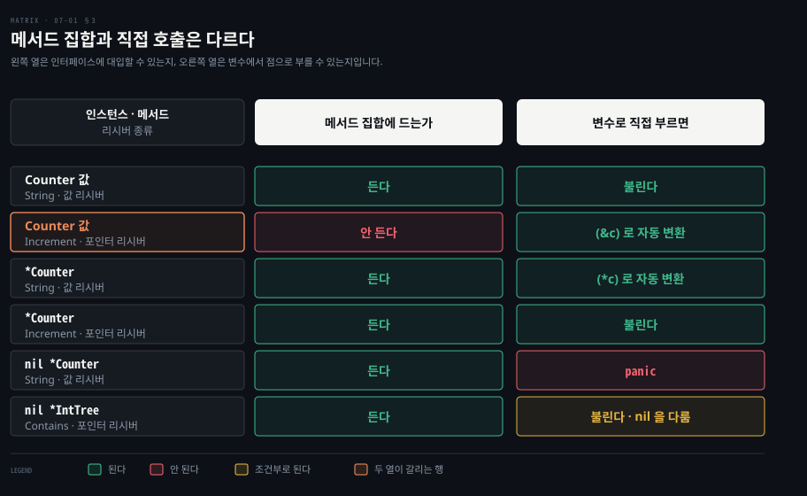

# 메서드는 리시버로 타입에 붙고 포인터 리시버만 원본을 바꿉니다

---

> Learning Go 7장 앞 부분입니다. 사용자 정의 타입을 선언하는 법, 메서드와 리시버, 포인터 리시버와 값 리시버를 고르는 규칙, `nil` 리시버를 다루는 메서드, 메서드 값과 메서드 식, 그리고 함수와 메서드를 가르는 기준을 다룹니다.

## 핵심 요약

> 이 편이 매달린 하나의 생각은 메서드의 리시버가 함수의 첫 매개변수와 같은 규칙을 따른다는 것입니다.

Go 는 어떤 기본형이나 복합 타입 리터럴을 바탕으로도 사용자 정의 타입을 선언합니다. 그 타입에 메서드를 붙입니다. 메서드는 함수 선언에 리시버 하나를 더한 모양입니다. 메서드는 패키지 블록에서만, 타입과 같은 패키지에서만 선언할 수 있습니다. 이름을 겹쳐 쓰는 오버로딩은 없습니다.

리시버는 06-02 의 포인터 매개변수와 똑같이 동작합니다. 리시버를 바꾸거나 `nil` 을 다뤄야 하면 포인터 리시버를 씁니다. 그렇지 않으면 값 리시버를 씁니다. 값 변수로 포인터 리시버 메서드를 부르면 Go 가 알아서 주소를 넘깁니다. 다만 이것은 문법 편의일 뿐 메서드 집합과는 별개입니다. 메서드는 함수 값으로 꺼내 쓸 수도 있습니다. 시작할 때 정해지거나 실행 중에 바뀌는 상태에 기대는 로직은 struct 의 메서드로, 입력만 보는 로직은 함수로 둡니다.


## 학습 목표

> 이 편을 읽고 나면 아래 다섯 가지를 스스로 해낼 수 있습니다.

1. 사용자 정의 타입과 메서드를 선언하고, 메서드 선언의 제약 셋(패키지 블록, 같은 패키지, 오버로딩 없음)을 말할 수 있습니다.
2. 포인터 리시버와 값 리시버를 고르는 원문의 세 규칙을 적용할 수 있습니다.
3. 포인터 인스턴스와 값 인스턴스의 메서드 집합이 어떻게 다른지 말하고, 자동 주소 변환과 구분할 수 있습니다.
4. `nil` 리시버를 받아들이는 메서드를 쓰고, 그래도 호출자의 `nil` 포인터를 바꿀 수 없는 이유를 설명할 수 있습니다.
5. 메서드 값과 메서드 식을 쓰고, 함수로 둘지 메서드로 둘지 판단할 수 있습니다.


## 1. 사용자 정의 타입 — 어떤 타입이든 바탕으로 새 이름을 만듭니다

> Go 의 타입 선언은 이름을 하나 짓고 그 바탕 타입을 정합니다. struct 리터럴뿐 아니라 기본형·함수·map 타입도 바탕이 될 수 있습니다.

Java 에서 새 타입을 만들려면 클래스나 인터페이스, enum, record 를 선언해야 합니다. 정수에 다른 이름을 붙이는 방법은 없습니다. Go 는 여기서 훨씬 자유롭습니다. 원문은 3장의 「Structs」 절에서 본 struct 선언을 다시 꺼냅니다. 절 이름만 원문에 있고 장 번호는 노트가 찾아 붙였습니다.

```go
type Person struct {
	FirstName string
	LastName  string
	Age       int
}
```

원문은 이 선언을 `Person` 이라는 이름의 사용자 정의 타입을 선언하고, 그 **바탕 타입**(underlying type)을 뒤따르는 struct 리터럴로 정한다고 읽으라고 말합니다. struct 리터럴 말고도 어떤 기본형이나 복합 타입 리터럴로든 구체 타입을 정의할 수 있습니다.

```go
type Score int
type Converter func(string) Score
type TeamScores map[string]Score
```

타입은 패키지 블록부터 그 아래 어느 블록에서든 선언할 수 있습니다. 다만 선언한 범위 안에서만 쓸 수 있고, 예외는 다른 패키지에서 내보낸 타입뿐이며 10장에서 다룹니다.

원문은 용어 둘을 정해 둡니다. **추상 타입**은 무엇을 해야 하는지만 정하고 어떻게 하는지는 정하지 않습니다. **구체 타입**은 무엇과 어떻게를 모두 정합니다. 곧 데이터를 저장하는 방식이 정해져 있고 타입에 선언된 메서드의 구현을 갖습니다. Go 의 타입은 모두 둘 중 하나입니다. Java 의 추상 클래스나 default 메서드가 있는 인터페이스 같은 혼합형은 Go 에 없다고 원문은 짚습니다.


## 2. 메서드 — 함수 선언에 리시버를 더한 것입니다

> 메서드는 `func` 와 이름 사이에 리시버를 둔 함수 선언입니다. 패키지 블록에서, 타입과 같은 패키지에서만 선언할 수 있고, 이름을 겹쳐 쓸 수 없습니다.

타입에 동작을 붙이려면 메서드가 필요합니다. Go 는 대부분의 현대 언어처럼 사용자 정의 타입에 메서드를 지원하며, 메서드는 패키지 블록 수준에서 정의합니다.

```go
func (p Person) String() string {
	return fmt.Sprintf("%s %s, age %d", p.FirstName, p.LastName, p.Age)
}
```

메서드 선언은 함수 선언과 같은데 하나가 더 붙습니다. `func` 키워드와 메서드 이름 사이의 **리시버** 명세입니다. 다른 변수 선언처럼 리시버 이름이 타입 앞에 옵니다. 관례상 리시버 이름은 타입 이름의 짧은 줄임, 보통 첫 글자입니다. 원문은 `this` 나 `self` 를 쓰는 것이 Go 답지 않다고 말합니다. Java 에서 `this` 가 암묵적으로 있던 자리를 Go 는 이름 붙은 매개변수처럼 드러냅니다. 이 대비는 원문 밖입니다.

호출은 다른 언어의 메서드 호출과 같아 보입니다.

```go
p := Person{
	FirstName: "Fred",
	LastName:  "Fredson",
	Age:       52,
}
output := p.String()
```

### 메서드 선언에는 제약 셋이 있습니다

원문이 드는 메서드와 함수의 핵심 차이는 메서드가 패키지 블록에서만 정의되고, 함수는 어느 블록에서든 정의될 수 있다는 점입니다(05-02 의 익명 함수를 떠올리면 됩니다).

메서드 이름은 함수처럼 오버로딩할 수 없습니다. 다른 타입에서는 같은 메서드 이름을 쓸 수 있습니다. 하지만 한 타입에 같은 이름의 메서드 둘을 둘 수는 없습니다. 오버로딩이 있는 언어에서 오면 답답하게 느껴집니다. 그래도 원문은 이름을 다시 쓰지 않는 것이 코드가 하는 일을 분명히 하려는 Go 철학의 일부라고 말합니다.

메서드는 연결된 타입과 같은 패키지에 선언해야 합니다. Go 는 내가 관리하지 않는 타입에 메서드를 더하는 것을 허용하지 않습니다. 같은 패키지 안이면 다른 파일에 메서드를 정의할 수도 있지만, 원문은 타입 정의와 메서드를 함께 두어야 구현을 따라가기 쉽다고 권합니다. Kotlin 의 확장 함수처럼 남의 타입에 메서드를 덧붙이는 방식은 Go 에 없다는 뜻입니다. 이 비교는 원문 밖입니다.


## 3. 포인터 리시버와 값 리시버 — 바꾸거나 nil 을 다루면 포인터입니다

> 리시버도 매개변수처럼 포인터면 원본을, 값이면 복사본을 받습니다. 리시버를 바꾸거나 `nil` 을 다뤄야 하면 포인터 리시버를 쓰고, 한 타입 안에서는 한쪽으로 맞추는 것이 흔한 관례입니다.

06-02 에서 Go 는 포인터 타입 매개변수로 함수가 그 매개변수를 바꿀 수 있음을 드러낸다고 했습니다. 원문은 메서드 리시버에도 같은 규칙이 적용된다고 말합니다. 타입이 포인터인 **포인터 리시버**와 값 타입인 **값 리시버**가 있고, 원문은 둘을 고르는 규칙을 이렇게 정리합니다.

| 메서드가 하는 일 | 리시버 |
|------|------|
| 리시버를 바꿉니다 | 포인터 리시버여야 합니다 |
| `nil` 인스턴스를 다뤄야 합니다 | 포인터 리시버여야 합니다 |
| 리시버를 바꾸지 않습니다 | 값 리시버를 쓸 수 있습니다 |

바꾸지 않는 메서드에 값 리시버를 쓸지는 그 타입의 다른 메서드에 달렸습니다. 원문은 타입에 포인터 리시버 메서드가 하나라도 있으면 일관성을 위해 바꾸지 않는 메서드까지 모두 포인터 리시버로 쓰는 것이 흔한 관례라고 말합니다.

원문의 예제는 두 리시버를 한 타입에 둡니다.

```go
type Counter struct {
	total       int
	lastUpdated time.Time
}

func (c *Counter) Increment() {
	c.total++
	c.lastUpdated = time.Now()
}

func (c Counter) String() string {
	return fmt.Sprintf("total: %d, last updated: %v", c.total, c.lastUpdated)
}
```

```go
var c Counter
fmt.Println(c.String())
c.Increment()
fmt.Println(c.String())
```

원문의 출력은 `total: 0, last updated: 0001-01-01 00:00:00 +0000 UTC` 다음에 `total: 1, last updated: 2009-11-10 23:00:00 +0000 UTC m=+0.000000001` 입니다. 둘째 줄의 날짜는 Go Playground 의 고정된 시계 값입니다. 로컬에서 돌리면 실행한 시각이 찍힙니다. 이 설명은 원문 밖입니다.

### 값 변수로 포인터 리시버를 부르면 Go 가 주소를 넘깁니다

`c` 는 값 타입인데 포인터 리시버 메서드 `Increment` 를 불렀습니다. 원문은 값 타입 지역 변수로 포인터 리시버를 부르면 Go 가 자동으로 그 변수의 주소를 얻는다고 설명합니다. `c.Increment()` 는 `(&c).Increment()` 로 바뀝니다. 반대로 포인터 변수로 값 리시버를 부르면 Go 가 자동으로 역참조합니다. `c := &Counter{}` 였다면 `c.String()` 은 조용히 `(*c).String()` 이 됩니다.

원문의 경고가 여기 붙습니다. 값이 `nil` 인 포인터로 값 리시버 메서드를 부르면 컴파일은 되지만 실행 중 panic 이 납니다. 역참조할 값이 없기 때문입니다. 이 노트를 쓰면서 `var np *Counter` 로 `np.String()` 을 부르니 `invalid memory address or nil pointer dereference` 로 panic 이 났습니다.

### 함수에 값으로 넘기면 포인터 리시버도 복사본을 바꿉니다

함수에 값을 넘기는 규칙은 여기서도 그대로입니다. 값 타입을 함수에 넘기고 그 안에서 포인터 리시버 메서드를 부르면, 복사본에 대해 메서드를 부른 것입니다.

```go
func doUpdateWrong(c Counter) {
	c.Increment()
	fmt.Println("in doUpdateWrong:", c.String())
}

func doUpdateRight(c *Counter) {
	c.Increment()
	fmt.Println("in doUpdateRight:", c.String())
}

func main() {
	var c Counter
	doUpdateWrong(c)
	fmt.Println("in main:", c.String())
	doUpdateRight(&c)
	fmt.Println("in main:", c.String())
}
```

원문의 출력에서 `total` 만 추리면 `doUpdateWrong` 안에서 1, 돌아온 `main` 에서 0, `doUpdateRight` 안에서 1, 돌아온 `main` 에서 1 입니다. 이 노트를 쓰면서 `total` 만 찍게 바꿔 돌린 값도 1·0·1·1 이었습니다. `doUpdateWrong` 의 `c.Increment()` 는 함수 안 복사본의 주소를 넘겼을 뿐입니다.

### 메서드 집합은 포인터 인스턴스가 더 큽니다

`doUpdateRight` 의 매개변수는 `*Counter` 라는 포인터 인스턴스입니다. 거기서 `Increment` 와 `String` 을 둘 다 불렀습니다. 원문은 Go 가 포인터 인스턴스의 **메서드 집합**에는 포인터 리시버와 값 리시버 메서드를 모두 넣고, 값 인스턴스의 메서드 집합에는 값 리시버 메서드만 넣는다고 말합니다. 지금은 사소해 보여도 인터페이스에서 다시 나온다고 예고합니다(07-03 §1).



원문의 메모가 헷갈리는 지점을 짚습니다. 포인터와 값 사이의 자동 변환은 순전히 문법 편의이고 메서드 집합 개념과는 별개라는 것입니다. 그래서 값 변수 `c` 로 `c.Increment()` 를 부를 수는 있어도, `Counter` 값의 메서드 집합에 `Increment` 가 들어가지는 않습니다. 원문은 그 이유를 자세히 다룬 Alexey Gronskiy 의 블로그 글을 소개합니다.

### getter 와 setter 는 필요할 때만 씁니다

원문의 마지막 당부는 인터페이스를 맞추려는 게 아니면 Go struct 에 getter 와 setter 를 쓰지 말라는 것입니다. Go 는 필드에 바로 접근하기를 권하고, 메서드는 비즈니스 로직을 위해 남겨 둡니다. 예외는 여러 필드를 한 번에 바꿔야 하거나, 새 값을 그냥 대입하는 것이 아닌 갱신입니다. 앞의 `Increment` 가 두 성질을 모두 보입니다. Spring 에서 Lombok 의 `@Getter`·`@Setter` 를 습관처럼 붙이던 개발자에게는 가장 크게 달라지는 관례입니다. 이 대비는 원문 밖입니다.


## 4. nil 인스턴스를 위한 메서드 — 포인터 리시버는 nil 에서도 불립니다

> Go 는 `nil` 인스턴스에서도 메서드를 실제로 부릅니다. 포인터 리시버 메서드가 `nil` 을 다루도록 쓰면 코드가 단순해지기도 하지만, 리시버도 복사본이라 호출자의 `nil` 포인터를 채울 수는 없습니다.

포인터 리시버를 알고 나면 `nil` 인스턴스로 메서드를 부르면 어떻게 되는지 궁금해집니다. 원문은 대부분의 언어가 여기서 어떤 오류를 낸다고 말합니다. Objective-C 는 `nil` 인스턴스에 메서드를 부를 수 있지만 늘 아무 일도 하지 않습니다.

Go 는 조금 다르게 실제로 메서드를 부르려고 합니다. 값 리시버 메서드라면 가리키는 값이 없어서 panic 이 납니다. 포인터 리시버 메서드라면 `nil` 가능성을 다루도록 쓰여 있을 때 동작합니다. Java 에서 `null` 참조로 인스턴스 메서드를 부르면 메서드 본문에 들어가기도 전에 `NullPointerException` 이 나는 것과 다른 점입니다. 이 대비는 원문 밖입니다.

원문은 `nil` 리시버를 기대하면 코드가 단순해지는 예로 이진 트리를 보입니다.

```go
type IntTree struct {
	val         int
	left, right *IntTree
}

func (it *IntTree) Insert(val int) *IntTree {
	if it == nil {
		return &IntTree{val: val}
	}
	if val < it.val {
		it.left = it.left.Insert(val)
	} else if val > it.val {
		it.right = it.right.Insert(val)
	}
	return it
}

func (it *IntTree) Contains(val int) bool {
	switch {
	case it == nil:
		return false
	case val < it.val:
		return it.left.Contains(val)
	case val > it.val:
		return it.right.Contains(val)
	default:
		return true
	}
}
```

```go
func main() {
	var it *IntTree
	it = it.Insert(5)
	it = it.Insert(3)
	it = it.Insert(10)
	it = it.Insert(2)
	fmt.Println(it.Contains(2))  // true
	fmt.Println(it.Contains(12)) // false
}
```

이 노트를 쓰면서 돌리니 `true` 와 `false` 가 찍혔습니다. `Contains` 는 트리를 바꾸지 않는데도 포인터 리시버로 선언됐습니다. 원문의 메모대로 이것이 `nil` 리시버를 지원하려면 포인터 리시버여야 한다는 규칙을 보이는 자리입니다. 값 리시버는 `nil` 인지 확인할 수 없고 `nil` 로 불리면 panic 이 납니다.

### nil 리시버를 받아도 호출자의 포인터는 채울 수 없습니다

원문은 `nil` 리시버로 메서드를 부를 수 있는 것이 영리한 장치이고 트리 노드처럼 쓸모 있는 경우도 있지만, 대부분은 그다지 쓸모가 없다고 말합니다. 포인터 리시버는 포인터 함수 매개변수처럼 동작해서, 메서드에 넘어오는 것은 포인터의 복사본이기 때문입니다. 06-02 §1 의 `failedUpdate` 처럼 복사본을 바꿔도 원본은 그대로입니다. 그래서 `nil` 을 받아 원래 포인터를 `nil` 이 아니게 만드는 포인터 리시버 메서드는 쓸 수 없습니다. `Insert` 가 새 트리를 돌려주고 호출자가 `it = it.Insert(5)` 로 받아 두는 까닭이 여기 있습니다. 이 연결은 노트의 해석입니다.

포인터 리시버인데 `nil` 에서 동작하지 않는 메서드라면 `nil` 리시버를 어떻게 다룰지 정해야 합니다. 원문이 드는 선택은 둘입니다. slice 길이를 넘는 위치에 접근하는 것처럼 치명적인 결함으로 보고 아무것도 하지 않은 채 panic 을 두는 것입니다. 이때는 좋은 테스트를 쓰라고 원문이 덧붙이며 15장을 가리킵니다. 되살릴 수 있는 상황이라면 `nil` 을 확인해 오류를 돌려주며, 오류는 9장에서 다룹니다.


## 5. 메서드는 함수이기도 합니다 — 메서드 값과 메서드 식

> 메서드는 함수 타입 변수나 매개변수 자리에 그대로 쓸 수 있습니다. 인스턴스에서 꺼내면 메서드 값, 타입에서 꺼내면 리시버를 첫 인자로 받는 메서드 식입니다.

원문은 Go 의 메서드가 함수와 워낙 비슷해서, 함수 타입의 변수나 매개변수가 있는 곳이면 언제든 메서드를 함수 대신 쓸 수 있다고 말합니다.

```go
type Adder struct {
	start int
}

func (a Adder) AddTo(val int) int {
	return a.start + val
}

myAdder := Adder{start: 10}
fmt.Println(myAdder.AddTo(5)) // prints 15
```

메서드를 변수에 대입하거나 `func(int) int` 타입 매개변수에 넘길 수 있습니다. 이것을 **메서드 값**이라고 부릅니다.

```go
f1 := myAdder.AddTo
fmt.Println(f1(10)) // prints 20
```

원문은 메서드 값이 만들어진 인스턴스의 필드 값에 접근할 수 있다는 점에서 클로저와 조금 닮았다고 말합니다(05-02 §4). 원문 밖의 확인을 하나 더하면, 값 리시버의 메서드 값은 만들어지는 순간 리시버를 복사해 둡니다. 이 노트를 쓰면서 `f1` 을 만든 뒤 `myAdder.start = 100` 으로 바꾸고 `f1(10)` 을 부르니 여전히 `20` 이었습니다. 바깥 변수 자체를 붙잡는 클로저와 다른 점입니다.

타입 자체에서 함수를 만들 수도 있습니다. 이것은 **메서드 식**이라고 부릅니다.

```go
f2 := Adder.AddTo
fmt.Println(f2(myAdder, 15)) // prints 25
```

메서드 식에서는 첫 매개변수가 메서드의 리시버입니다. 시그니처는 `func(Adder, int) int` 입니다. 로컬에서 `%T` 로 찍어도 `func(main.Adder, int) int` 가 나왔습니다. 원문은 메서드 값과 메서드 식이 영리한 구석 사례가 아니라고 말합니다. 그리고 07-04 §4 의 의존성 주입에서 쓰임을 보여 준다고 예고합니다.

### 함수와 메서드를 가르는 기준은 다른 데이터에 기대는가입니다

메서드를 함수처럼 쓸 수 있으니 언제 함수를 선언하고 언제 메서드를 쓸지 궁금해집니다. 원문의 기준은 그 로직이 다른 데이터에 기대는가입니다. 원문이 여러 번 말했듯 패키지 수준 상태는 사실상 불변이어야 합니다. 시작할 때 설정되거나 실행 중에 바뀌는 값에 로직이 기댄다면, 그 값은 struct 에 두고 로직은 메서드로 구현합니다. 로직이 입력 매개변수에만 기댄다면 함수여야 합니다.

Spring 으로 옮기면 설정값이나 저장소를 주입받아 쓰는 서비스의 로직은 빈의 메서드로, 입력만으로 답이 나오는 계산은 정적 유틸리티 메서드로 두는 구분과 같습니다. 이 대응은 노트의 풀이입니다.


## 핵심 개념 체크리스트

목표 번호 순서대로 짝지었습니다.

- [ ] (목표 1) `type Converter func(string) Score` 처럼 함수 타입을 바탕으로 사용자 정의 타입을 만들 수 있다는 것이 Java 와 어떻게 다릅니까?
- [ ] (목표 1) `time.Time` 에 메서드를 더하는 코드를 내 패키지에 쓸 수 없는 이유를 말할 수 있습니까?
- [ ] (목표 2) `Contains` 가 트리를 바꾸지 않는데도 포인터 리시버인 이유를 말할 수 있습니까?
- [ ] (목표 3) 값 변수 `c` 로 `c.Increment()` 를 부를 수 있는데도 `Counter` 값의 메서드 집합에 `Increment` 가 없다는 말을 설명할 수 있습니까?
- [ ] (목표 4) `doUpdateWrong` 안의 `Increment` 가 `main` 의 `c` 를 바꾸지 못하는 이유를 말할 수 있습니까?
- [ ] (목표 4) `Insert` 가 트리를 돌려주고 호출자가 `it = it.Insert(5)` 로 받는 이유를 설명할 수 있습니까?
- [ ] (목표 5) `myAdder.AddTo` 와 `Adder.AddTo` 의 타입은 각각 무엇입니까?


## 관련 문서

- [07-02 타입 선언과 임베딩은 상속이 아니라 이름 붙이기와 승격입니다](./07-02.%ED%83%80%EC%9E%85%20%EC%84%A0%EC%96%B8%EA%B3%BC%20%EC%9E%84%EB%B2%A0%EB%94%A9%EC%9D%80%20%EC%83%81%EC%86%8D%EC%9D%B4%20%EC%95%84%EB%8B%88%EB%9D%BC%20%EC%9D%B4%EB%A6%84%20%EB%B6%99%EC%9D%B4%EA%B8%B0%EC%99%80%20%EC%8A%B9%EA%B2%A9%EC%9E%85%EB%8B%88%EB%8B%A4.md) — 7장 둘째. 상속 없는 재사용
- [06-02 포인터 매개변수는 바꿔도 된다는 표시이고 slice 는 길이까지 복사됩니다](./06-02.%ED%8F%AC%EC%9D%B8%ED%84%B0%20%EB%A7%A4%EA%B0%9C%EB%B3%80%EC%88%98%EB%8A%94%20%EB%B0%94%EA%BF%94%EB%8F%84%20%EB%90%9C%EB%8B%A4%EB%8A%94%20%ED%91%9C%EC%8B%9C%EC%9D%B4%EA%B3%A0%20slice%20%EB%8A%94%20%EA%B8%B8%EC%9D%B4%EA%B9%8C%EC%A7%80%20%EB%B3%B5%EC%82%AC%EB%90%A9%EB%8B%88%EB%8B%A4.md) — 6장. 포인터 매개변수의 규칙
- [05-02 함수는 값이고 클로저는 바깥 변수를 붙잡습니다](./05-02.%ED%95%A8%EC%88%98%EB%8A%94%20%EA%B0%92%EC%9D%B4%EA%B3%A0%20%ED%81%B4%EB%A1%9C%EC%A0%80%EB%8A%94%20%EB%B0%94%EA%B9%A5%20%EB%B3%80%EC%88%98%EB%A5%BC%20%EB%B6%99%EC%9E%A1%EC%8A%B5%EB%8B%88%EB%8B%A4.md) — 5장. 함수 값과 클로저
- [Learning Go 2판 — 정독 인덱스](./README.md) — 16장 전체 지도


## 참고 자료

- 원본: 《Learning Go, 2nd Edition》 (Jon Bodner, O'Reilly)
- 다룬 범위: Chapter 7 도입부터 "Functions Versus Methods" 까지
