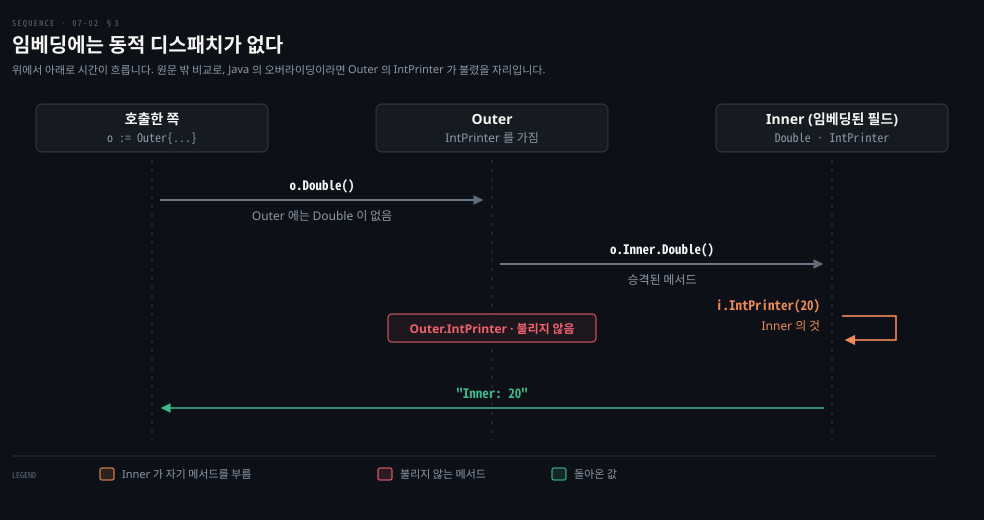

# 타입 선언과 임베딩은 상속이 아니라 이름 붙이기와 승격입니다

---

> Learning Go 7장 둘째 부분입니다. 다른 타입을 바탕으로 한 타입 선언, 문서로서의 타입, 열거형 대신 쓰는 `iota`, 그리고 조합을 위한 임베딩과 그것이 상속이 아닌 이유를 다룹니다.

## 핵심 요약

> 이 편이 매달린 하나의 생각은 Go 가 상속을 빼고도 이름 붙이기와 임베딩으로 재사용을 얻는다는 것입니다.

`type HighScore Score` 는 상속처럼 보이지만 같은 바탕 타입을 공유할 뿐입니다. 서로 변환 없이 대입할 수 없고 `Score` 의 메서드도 넘어오지 않습니다. 그래도 바탕이 같은 데이터에 다른 연산을 붙이고 싶을 때 타입을 새로 만드는 일은 코드를 문서로 만듭니다.

Go 에는 열거형이 없고 `iota` 로 상수에 늘어나는 번호를 매깁니다. 값이 바깥에서 의미를 갖는다면 `iota` 대신 값을 직접 적습니다. 재사용은 임베딩으로 합니다. 이름 없이 넣은 필드의 필드와 메서드가 바깥 struct 로 승격됩니다. 하지만 바깥 타입을 안쪽 타입 변수에 대입할 수 없고, 안쪽 메서드가 부르는 메서드는 바깥에 같은 이름이 있어도 안쪽 것입니다.


## 학습 목표

> 이 편을 읽고 나면 아래 다섯 가지를 스스로 해낼 수 있습니다.

1. 다른 타입을 바탕으로 선언한 타입이 상속이 아닌 이유를 대입·메서드 두 측면으로 설명할 수 있습니다.
2. 바탕이 같은 데이터에 새 타입을 만들어야 할 때를 원문의 문서 논리로 판단할 수 있습니다.
3. `iota` 가 증가하는 규칙으로 `0 2 20 20 4` 같은 결과를 읽고, `iota` 를 피해야 할 때를 말할 수 있습니다.
4. 임베딩으로 필드와 메서드가 승격되는 모습과, 이름이 겹칠 때 안쪽 필드에 접근하는 법을 쓸 수 있습니다.
5. 임베딩에 동적 디스패치가 없다는 것을 `Inner: 20` 출력으로 설명할 수 있습니다.


## 1. 다른 타입을 바탕으로 한 선언은 상속이 아닙니다

> `type HighScore Score` 는 바탕 타입만 같을 뿐 계층이 없습니다. 서로 변환 없이 대입할 수 없고 메서드도 물려받지 않습니다.

07-01 §1 에서 Go 는 기본형이나 struct 리터럴을 바탕으로 타입을 선언했습니다. 원문은 사용자 정의 타입을 바탕으로 또 다른 사용자 정의 타입을 선언할 수도 있다고 말합니다.

```go
type HighScore Score
type Employee Person
```

Java 개발자라면 `class HighScore extends Score` 를 떠올리기 쉽습니다. 원문은 객체 지향이라 부를 만한 개념이 많은데 그중 **상속**이 두드러진다고 말합니다. 상속에서는 부모 타입의 상태와 메서드를 자식 타입에서 쓸 수 있습니다. 그리고 자식 타입의 값을 부모 타입 자리에 바꿔 넣을 수 있습니다. 원문의 각주는 컴퓨터 과학에서 서브타이핑과 상속이 다른 개념이라고 짚습니다. 다만 대부분의 언어가 상속으로 서브타이핑을 구현해 흔히 섞어 쓴다고 덧붙입니다.

다른 타입을 바탕으로 한 선언은 상속처럼 보이지만 아닙니다. 두 타입은 같은 바탕 타입을 가질 뿐이고 계층이 없습니다. `HighScore` 를 `Score` 변수에 대입하거나 그 반대를 하려면 타입 변환이 필요합니다. 둘 다 `int` 변수에 대입할 때도 마찬가지입니다. 게다가 `Score` 에 정의한 메서드는 `HighScore` 에 정의되지 않습니다.

```go
// assigning untyped constants is valid
var i int = 300
var s Score = 100
var hs HighScore = 200
hs = s            // compilation error!
s = i             // compilation error!
s = Score(i)      // ok
hs = HighScore(s) // ok
```

```bash
# go1.25.1 에서 빌드한 오류 두 줄 (2026-09-27)
cannot use s (variable of int type Score) as HighScore value in assignment
cannot use i (variable of type int) as Score value in assignment
```

바탕 타입이 기본형인 사용자 정의 타입에는 바탕 타입과 맞는 리터럴과 상수를 대입할 수 있고, 바탕 타입의 연산자도 쓸 수 있습니다.

```go
var s Score = 50
scoreWithBonus := s + 100 // type of scoreWithBonus is Score
```

로컬에서 `%T` 로 찍으니 `main.Score 150` 이 나왔습니다. 02-02 §3 의 타입 없는 상수 `100` 이 `Score` 로 맞춰진 것입니다. 원문의 팁은 바탕 타입을 공유하는 타입 사이의 변환이 같은 바탕 저장소를 유지한 채 다른 메서드 집합을 연결한다는 것입니다.

### 타입은 실행되는 문서입니다

관련된 데이터 묶음에 struct 타입을 선언하는 것은 당연하게 받아들여집니다. 그런데 기본형을 바탕으로, 또는 다른 사용자 정의 타입을 바탕으로 타입을 선언해야 할 때는 덜 분명합니다. 원문의 짧은 답은 타입이 문서라는 것입니다. 타입은 개념에 이름을 주고 기대하는 데이터의 종류를 밝혀 코드를 분명하게 합니다. 메서드의 매개변수가 `int` 보다 `Percentage` 일 때 읽는 사람이 이해하기 쉽고, 잘못된 값으로 부르기도 어렵습니다.

같은 논리가 사용자 정의 타입을 바탕으로 한 선언에도 적용됩니다. 바탕 데이터는 같은데 수행할 연산의 집합이 다르면 타입 둘을 만듭니다. 하나를 다른 것 바탕으로 선언하면 반복을 줄이고 두 타입이 관련 있다는 것을 드러냅니다. Java 로 치면 `long userId` 대신 `UserId` 값 객체를 두는 발상과 같은데, Go 는 클래스를 새로 쓰지 않고 한 줄로 합니다. 이 비교는 원문 밖입니다.


## 2. iota 는 가끔만 열거형입니다

> Go 에는 열거형이 없고 `iota` 가 const 블록 안 상수에 늘어나는 번호를 매깁니다. 값이 바깥에서 의미를 갖거나 중간에 끼워 넣을 수 있다면 `iota` 대신 값을 직접 적습니다.

많은 언어에는 타입이 가질 수 있는 값을 제한된 집합으로 정하는 열거형이 있습니다. Go 에는 열거형 타입이 없습니다. 대신 상수 묶음에 증가하는 값을 매기는 `iota` 가 있습니다.

원문의 메모가 이름의 유래를 알려 줍니다. `iota` 는 APL(A Programming Language)에서 왔습니다. APL 에서 첫 세 양의 정수 목록을 만들려면 그리스 소문자 이오타 `ι` 를 써서 `ι3` 이라고 씁니다. APL 은 전용 키보드가 필요할 만큼 고유 기호에 기대는 언어로 유명합니다. 원문은 가독성을 중시하는 Go 가 지나치게 간결한 언어에서 개념을 빌려 온 것이 역설적으로 보일 수 있다며, 그래서 여러 언어를 배워야 한다고 말합니다.

원문이 권하는 첫 단계는 유효한 값들을 나타낼 `int` 바탕 타입을 먼저 정의하는 것입니다. 다음으로 const 블록으로 그 타입의 값 집합을 정의합니다.

```go
type MailCategory int

const (
	Uncategorized MailCategory = iota
	Personal
	Spam
	Social
	Advertisements
)
```

const 블록의 첫 상수만 타입과 값 `iota` 를 적고, 그 뒤 줄에는 타입도 값도 적지 않습니다. 컴파일러는 이것을 보면 블록 안 뒤따르는 상수 모두에 타입과 대입(`iota`)을 되풀이합니다. `iota` 는 0 부터 시작해 블록 안 상수마다 1 씩 늘어납니다. 그래서 `Uncategorized` 에 0, `Personal` 에 1 이 매겨집니다. 로컬에서 다섯 상수를 찍으니 `0 1 2 3 4` 였습니다. 새 const 블록을 만들면 `iota` 는 다시 0 이 됩니다.

### iota 는 쓰지 않은 줄에서도 늘어납니다

`iota` 는 상수의 값을 정하는 데 `iota` 를 썼든 안 썼든 블록 안 상수마다 늘어납니다. 원문은 `iota` 를 띄엄띄엄 쓴 블록으로 이것을 보입니다.

```go
const (
	Field1 = 0
	Field2 = 1 + iota
	Field3 = 20
	Field4
	Field5 = iota
)

func main() {
	fmt.Println(Field1, Field2, Field3, Field4, Field5)
}
```

원문이 "아마 예상 밖일" 결과라고 한 출력은 `0 2 20 20 4` 이고, 로컬에서도 같았습니다. `Field2` 는 둘째 줄에서 `iota` 가 1 이라 2 가 됩니다. `Field4` 는 타입도 값도 적지 않아 앞에서 타입과 대입을 적은 줄의 값 20 을 받습니다. `Field5` 는 다섯째 줄이고 `iota` 가 0 부터 세므로 4 입니다.

원문은 `iota` 에 관해 본 최고의 조언이라며 Danny van Heumen 의 글을 인용합니다.

> "Don't use iota for defining constants where its values are explicitly defined (elsewhere). … Use iota for "internal" purposes only. That is, where the constants are referred to by name rather than by value."

값이 다른 곳에 명시적으로 정해진 상수, 예를 들어 명세가 어떤 상수에 어떤 값을 매길지 정해 둔 경우에는 `iota` 를 쓰지 말고 값을 직접 적으라는 말입니다. `iota` 는 상수를 값이 아니라 이름으로 가리키는 내부 용도에만 쓰라고 합니다. 그래야 목록 어디에 새 상수를 끼워 넣어도 모든 것이 깨질 위험 없이 `iota` 를 즐길 수 있다는 것입니다.

### iota 열거는 값이 상관없을 때만 맞습니다

원문이 강조하는 한계는 둘입니다. Go 의 어떤 장치도 누군가 그 타입의 값을 더 만드는 것을 막지 못합니다. 그리고 목록 가운데에 새 식별자를 끼워 넣으면 뒤따르는 것들이 모두 번호가 바뀝니다. 그 상수들이 다른 시스템이나 데이터베이스의 값을 나타냈다면 애플리케이션이 미묘하게 깨집니다. 그래서 `iota` 기반 열거는 값들을 서로 구별할 수만 있으면 되고 뒤에 있는 실제 값은 신경 쓰지 않을 때에만 맞습니다. 실제 값이 중요하면 명시적으로 적으라고 원문은 말합니다.

Java 의 `enum` 은 닫힌 집합이라 선언하지 않은 값을 만들 수 없지만, Go 에서는 `MailCategory(99)` 같은 변환이 그대로 컴파일됩니다. JPA 에서 `@Enumerated(EnumType.ORDINAL)` 로 순번을 DB 에 저장했다가 enum 순서를 바꿔 데이터가 어긋나는 사고가, 원문이 말하는 renumbering 문제와 같은 모양입니다. 이 두 비교는 원문 밖입니다.

원문은 경고 하나를 더 붙입니다. 상수에 리터럴 식을 대입할 수 있어서 이런 예제를 보게 됩니다.

```go
type BitField int

const (
	Field1 BitField = 1 << iota // assigned 1
	Field2                      // assigned 2
	Field3                      // assigned 4
	Field4                      // assigned 8
)
```

로컬에서도 `1 2 4 8` 이었습니다. 영리하지만, 이 패턴을 쓴다면 무엇을 하는지 문서로 남기라고 원문은 말합니다. 값이 중요할 때 `iota` 는 깨지기 쉽습니다. 나중에 누가 목록 중간에 상수를 끼워 넣어 코드를 깨뜨리는 일을 원하지 않을 것입니다.

마지막으로 `iota` 는 0 부터 번호를 매깁니다. 설정 상태를 나타내는 상수라면 제로 값이 쓸모 있을 수 있습니다. `MailCategory` 에서 메일이 처음 도착하면 분류되지 않은 상태이니 제로 값이 말이 됩니다. 말이 되는 기본값이 없다면, 흔한 패턴은 블록의 첫 `iota` 값을 `_` 나 값이 유효하지 않음을 뜻하는 상수에 매기는 것입니다. 그러면 변수가 제대로 초기화되지 않은 것을 쉽게 알아챌 수 있습니다.


## 3. 임베딩으로 조합합니다

> 이름 없이 넣은 필드를 임베딩된 필드라 하고, 그 필드의 필드와 메서드는 바깥 struct 로 승격됩니다. 이름이 겹치면 임베딩된 타입 이름으로 안쪽을 직접 가리킵니다.

"클래스 상속보다 객체 조합을 선호하라"는 소프트웨어 공학의 조언은 적어도 1994년 책 *Design Patterns* 까지 거슬러 올라갑니다. Erich Gamma, Richard Helm, Ralph Johnson, John Vlissides 가 쓴 책으로 흔히 GoF 책이라 부릅니다. Go 에는 상속이 없지만, 조합과 **승격**을 언어 차원에서 지원해 코드 재사용을 권합니다.

```go
type Employee struct {
	Name string
	ID   string
}

func (e Employee) Description() string {
	return fmt.Sprintf("%s (%s)", e.Name, e.ID)
}

type Manager struct {
	Employee
	Reports []Employee
}

func (m Manager) FindNewEmployees() []Employee {
	// do business logic
}
```

`Manager` 에는 `Employee` 타입 필드가 있지만 이름이 없습니다. 이렇게 넣은 `Employee` 를 **임베딩된 필드**라고 부릅니다. 임베딩된 필드에 선언된 필드와 메서드는 바깥 struct 로 승격되어 바깥 struct 에서 바로 부를 수 있습니다.

```go
m := Manager{
	Employee: Employee{
		Name: "Bob Bobson",
		ID:   "12345",
	},
	Reports: []Employee{},
}
fmt.Println(m.ID)            // prints 12345
fmt.Println(m.Description()) // prints Bob Bobson (12345)
```

로컬에서도 두 줄이 그대로 찍혔습니다. 원문의 메모대로 struct 안에는 다른 struct 뿐 아니라 어떤 타입이든 임베딩할 수 있고, 임베딩된 타입의 메서드가 바깥 struct 로 승격됩니다.

바깥 struct 에 임베딩된 필드와 같은 이름의 필드나 메서드가 있으면, 가려진 쪽은 임베딩된 필드의 타입 이름으로 가리켜야 합니다.

```go
type Inner struct {
	X int
}

type Outer struct {
	Inner
	X int
}

o := Outer{
	Inner: Inner{
		X: 10,
	},
	X: 20,
}
fmt.Println(o.X)       // prints 20
fmt.Println(o.Inner.X) // prints 10
```

04-01 의 섀도잉처럼 가까운 쪽 이름이 먼 쪽을 가리는 모습입니다. 이 연결은 노트의 해석입니다.

### 임베딩은 상속이 아닙니다

원문은 언어 차원의 임베딩 지원이 드물다고 말합니다. 저자는 이를 지원하는 다른 인기 언어를 알지 못한다고 합니다. 상속에 익숙한 개발자들은 임베딩을 상속으로 이해하려 하는데, 원문은 그 길 끝에 눈물이 있다고 말합니다. `Manager` 타입 변수를 `Employee` 타입 변수에 대입할 수 없습니다. `Manager` 안의 `Employee` 에 접근하려면 명시적으로 해야 합니다.

```go
var eFail Employee = m        // compilation error!
var eOK Employee = m.Employee // ok!
```

원문은 오류를 `cannot use m (type Manager) as type Employee in assignment` 로 적었습니다. go1.25.1 에서 빌드하니 `cannot use m (variable of struct type Manager) as Employee value in variable declaration` 이 나왔습니다. 07-03 §1 의 메서드 집합 오류 메시지와 같은 종류의 버전 차이입니다.

게다가 Go 에는 구체 타입에 대한 **동적 디스패치**가 없습니다. 임베딩된 필드의 메서드는 자기가 임베딩되었다는 것을 모릅니다. 임베딩된 필드의 메서드가 같은 필드의 다른 메서드를 부르면, 바깥 struct 에 같은 이름의 메서드가 있어도 임베딩된 필드의 메서드가 불립니다.

```go
type Inner struct {
	A int
}

func (i Inner) IntPrinter(val int) string {
	return fmt.Sprintf("Inner: %d", val)
}

func (i Inner) Double() string {
	return i.IntPrinter(i.A * 2)
}

type Outer struct {
	Inner
	S string
}

func (o Outer) IntPrinter(val int) string {
	return fmt.Sprintf("Outer: %d", val)
}

func main() {
	o := Outer{
		Inner: Inner{
			A: 10,
		},
		S: "Hello",
	}
	fmt.Println(o.Double())
}
```

원문의 출력은 `Inner: 20` 이고 로컬에서도 같았습니다.



Java 에서 `Outer extends Inner` 로 `intPrinter` 를 재정의했다면 `o.doubleIt()` 안의 `this.intPrinter(...)` 는 `Outer` 의 것을 불러 `Outer: 20` 이 나옵니다. 템플릿 메서드 패턴이 기대는 바로 그 동작이 Go 의 임베딩에는 없습니다. 이 대비는 원문 밖입니다.

다만 구체 타입을 다른 구체 타입에 임베딩해도 바깥 타입을 안쪽 타입처럼 다룰 수는 없지만, 임베딩된 필드의 메서드는 바깥 struct 의 메서드 집합에 들어갑니다. 원문은 그래서 임베딩이 바깥 struct 가 인터페이스를 구현하게 만들 수 있다고 말하며 인터페이스로 넘어갑니다(07-03).


## 핵심 개념 체크리스트

목표 번호 순서대로 짝지었습니다.

- [ ] (목표 1) `hs = s` 는 컴파일되지 않는데 `hs = HighScore(s)` 는 되는 이유를 말할 수 있습니까?
- [ ] (목표 1) `Score` 에 붙인 메서드를 `HighScore` 값으로 부를 수 있습니까?
- [ ] (목표 2) 매개변수를 `int` 대신 `Percentage` 로 두면 얻는 두 가지를 말할 수 있습니까?
- [ ] (목표 3) `Field4` 가 20 이고 `Field5` 가 4 인 이유를 각각 설명할 수 있습니까?
- [ ] (목표 3) DB 에 저장되는 상태 코드를 `iota` 로 정의하면 안 되는 이유를 말할 수 있습니까?
- [ ] (목표 4) `Outer` 에서 `Inner` 의 `X` 를 읽으려면 무엇을 써야 합니까?
- [ ] (목표 5) `o.Double()` 이 `Outer: 20` 이 아니라 `Inner: 20` 을 찍는 이유를 설명할 수 있습니까?


## 관련 문서

- [07-01 메서드는 리시버로 타입에 붙고 포인터 리시버만 원본을 바꿉니다](./07-01.%EB%A9%94%EC%84%9C%EB%93%9C%EB%8A%94%20%EB%A6%AC%EC%8B%9C%EB%B2%84%EB%A1%9C%20%ED%83%80%EC%9E%85%EC%97%90%20%EB%B6%99%EA%B3%A0%20%ED%8F%AC%EC%9D%B8%ED%84%B0%20%EB%A6%AC%EC%8B%9C%EB%B2%84%EB%A7%8C%20%EC%9B%90%EB%B3%B8%EC%9D%84%20%EB%B0%94%EA%BF%89%EB%8B%88%EB%8B%A4.md) — 7장 앞. 메서드와 리시버
- [07-03 인터페이스는 암묵적으로 만족되고 nil 은 타입과 값이 모두 비어야 합니다](./07-03.%EC%9D%B8%ED%84%B0%ED%8E%98%EC%9D%B4%EC%8A%A4%EB%8A%94%20%EC%95%94%EB%AC%B5%EC%A0%81%EC%9C%BC%EB%A1%9C%20%EB%A7%8C%EC%A1%B1%EB%90%98%EA%B3%A0%20nil%20%EC%9D%80%20%ED%83%80%EC%9E%85%EA%B3%BC%20%EA%B0%92%EC%9D%B4%20%EB%AA%A8%EB%91%90%20%EB%B9%84%EC%96%B4%EC%95%BC%20%ED%95%A9%EB%8B%88%EB%8B%A4.md) — 7장 셋째. 인터페이스
- [02-02 var 와 짧은 선언은 의도를 드러내는 선택입니다](./02-02.var%20%EC%99%80%20%EC%A7%A7%EC%9D%80%20%EC%84%A0%EC%96%B8%EC%9D%80%20%EC%9D%98%EB%8F%84%EB%A5%BC%20%EB%93%9C%EB%9F%AC%EB%82%B4%EB%8A%94%20%EC%84%A0%ED%83%9D%EC%9E%85%EB%8B%88%EB%8B%A4.md) — 2장. 상수와 타입 없는 상수
- [Learning Go 2판 — 정독 인덱스](./README.md) — 16장 전체 지도


## 참고 자료

- 원본: 《Learning Go, 2nd Edition》 (Jon Bodner, O'Reilly)
- 다룬 범위: Chapter 7 "Type Declarations Aren't Inheritance" 부터 "Embedding Is Not Inheritance" 까지
