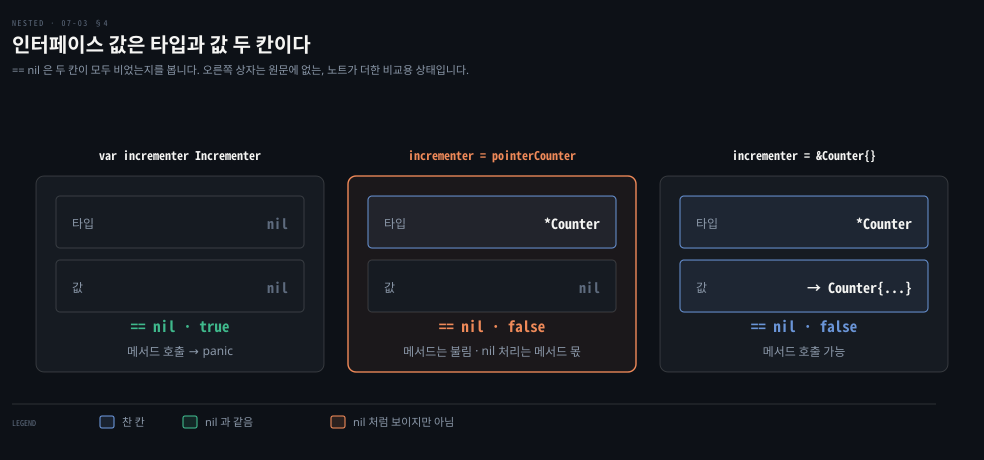

# 인터페이스는 암묵적으로 만족되고 nil 은 타입과 값이 모두 비어야 합니다

---

> Learning Go 7장 셋째 부분입니다. 인터페이스 선언과 메서드 집합, 암묵적 구현이 동적 언어와 Java 사이에서 서는 자리, 인터페이스 임베딩, "인터페이스를 받고 struct 를 돌려주라"는 관례, 인터페이스와 `nil`, 인터페이스 비교, 그리고 빈 인터페이스를 다룹니다.

## 핵심 요약

> 이 편이 매달린 하나의 생각은 Go 인터페이스가 구현하는 쪽이 아니라 쓰는 쪽에서 정의된다는 것입니다.

인터페이스는 Go 의 유일한 추상 타입이고 메서드 집합을 나열합니다. 구체 타입은 `implements` 선언 없이, 메서드 집합이 인터페이스의 메서드를 모두 담으면 그 인터페이스를 구현합니다. 그래서 인터페이스는 쓰는 쪽이 필요한 것을 적는 자리가 됩니다. 원문은 함수가 인터페이스를 받고 구체 타입을 돌려주라고 권합니다. 돌려준 struct 에는 필드와 메서드를 더해도 호출자가 깨지지 않기 때문입니다.

인터페이스 값은 런타임에 타입과 값 두 칸으로 되어 있어서, 두 칸이 모두 비어야 `nil` 입니다. `nil` 포인터를 담은 인터페이스는 `nil` 이 아닙니다. 인터페이스끼리 `==` 로 비교할 수 있지만 담긴 타입이 비교 불가능하면 실행 중 panic 이 납니다. 빈 인터페이스 `any` 는 어떤 값이든 담지만 아무것도 말해 주지 않으니 드물게 씁니다.


## 학습 목표

> 이 편을 읽고 나면 아래 다섯 가지를 스스로 해낼 수 있습니다.

1. 인터페이스를 선언하고, 값 인스턴스와 포인터 인스턴스 가운데 어느 쪽이 인터페이스를 만족하는지 메서드 집합으로 판단할 수 있습니다.
2. 암묵적 인터페이스가 동적 언어의 덕 타이핑과 Java 의 명시적 인터페이스 사이에서 무엇을 가져왔는지 설명할 수 있습니다.
3. "인터페이스를 받고 struct 를 돌려주라"의 이유와 그 예외를 말할 수 있습니다.
4. `nil` 포인터를 담은 인터페이스가 `nil` 이 아닌 이유를 두 칸 구조로 설명할 수 있습니다.
5. 인터페이스 비교와 map 키가 panic 을 낼 수 있는 경우를 말하고, `any` 를 써야 하는 드문 경우를 판단할 수 있습니다.


## 1. 인터페이스 — 메서드 집합을 나열한 유일한 추상 타입입니다

> 인터페이스는 구체 타입이 갖춰야 할 메서드를 나열합니다. 07-01 의 메서드 집합 규칙 때문에 포인터 리시버 메서드가 필요한 인터페이스는 값 인스턴스로 만족시킬 수 없습니다.

원문은 Go 의 동시성 모델이 주목을 다 받지만, Go 설계의 진짜 주인공은 Go 의 유일한 추상 타입인 암묵적 인터페이스라고 말합니다. 인터페이스 선언 자체는 단순합니다. 다른 사용자 정의 타입처럼 `type` 키워드를 씁니다. `fmt` 패키지의 `Stringer` 가 그 예입니다.

```go
type Stringer interface {
	String() string
}
```

인터페이스 선언에서는 인터페이스 타입 이름 뒤에 인터페이스 리터럴이 옵니다. 리터럴은 구체 타입이 인터페이스를 만족하려면 구현해야 할 메서드들을 나열합니다. 이 메서드들이 인터페이스의 메서드 집합입니다. 07-01 §3 에서 포인터 인스턴스의 메서드 집합에는 포인터 리시버와 값 리시버 메서드가 모두 들고, 값 인스턴스에는 값 리시버 메서드만 든다고 했습니다. 원문은 07-01 의 `Counter` 로 이것이 어떻게 드러나는지 보입니다.

```go
type Incrementer interface {
	Increment()
}

var myStringer fmt.Stringer
var myIncrementer Incrementer
pointerCounter := &Counter{}
valueCounter := Counter{}
myStringer = pointerCounter    // ok
myStringer = valueCounter      // ok
myIncrementer = pointerCounter // ok
myIncrementer = valueCounter   // compile-time error!
```

원문이 적은 오류는 다음과 같습니다.

```bash
# 원문 출력
cannot use valueCounter (variable of type Counter) as Incrementer value in assignment: Counter does not implement Incrementer (method Increment has pointer receiver)
```

go1.25.1 은 `variable of struct type Counter` 로 한 단어를 더 적을 뿐 나머지는 같았습니다.

`Increment` 는 포인터 리시버라 `Counter` 값의 메서드 집합에 없고, 그래서 값은 `Incrementer` 를 만족하지 못합니다. 07-01 에서 `c.Increment()` 호출이 되던 것은 문법 편의였을 뿐이라는 원문의 메모가 여기서 의미를 갖습니다.

인터페이스도 다른 타입처럼 어느 블록에서든 선언할 수 있습니다. 이름은 보통 "er" 로 끝납니다. `fmt.Stringer` 말고도 `io.Reader`, `io.Closer`, `io.ReadCloser`, `json.Marshaler`, `http.Handler` 가 있습니다.


## 2. 인터페이스는 타입 안전한 덕 타이핑입니다

> Go 인터페이스는 암묵적으로 구현됩니다. 동적 언어의 덕 타이핑처럼 구현 쪽이 인터페이스를 몰라도 되고, Java 처럼 쓰는 쪽이 필요한 것을 타입으로 적어 컴파일러가 확인합니다.

여기까지는 다른 언어의 인터페이스와 크게 다르지 않습니다. 원문은 Go 인터페이스를 특별하게 만드는 것이 암묵적 구현이라고 말합니다. `Counter` 는 `Incrementer` 를 구현한다고 선언하지 않았습니다. 구체 타입의 메서드 집합이 인터페이스의 메서드 집합에 있는 메서드를 모두 담으면 그 구체 타입은 인터페이스를 구현합니다. 그러니 그 인터페이스 타입으로 선언한 변수나 필드에 대입할 수 있습니다. 원문은 이 암묵적 동작 덕에 인터페이스가 타입 안전성과 결합도 낮추기를 함께 주어, 정적 언어와 동적 언어의 기능을 잇는다고 말합니다.

왜 그런지 보려고 원문은 언어에 인터페이스가 왜 있는지부터 짚습니다. *Design Patterns* 는 조합을 상속보다 선호하라는 것 말고도 "구현이 아니라 인터페이스에 맞춰 프로그래밍하라"고 조언합니다. 그러면 구현이 아니라 동작에 기댈 수 있어 필요할 때 구현을 바꿀 수 있고, 요구사항이 바뀌는 동안 코드가 진화할 수 있습니다.

### 덕 타이핑과 Java 의 명시적 인터페이스는 각자 옳습니다

Python·Ruby·JavaScript 같은 동적 타입 언어에는 인터페이스가 없습니다. 대신 **덕 타이핑**을 씁니다. "오리처럼 걷고 오리처럼 꽥꽥거리면 오리다"라는 표현에서 온 말로, 함수가 기대하는 메서드를 찾을 수만 있으면 어떤 타입의 인스턴스든 매개변수로 넘길 수 있다는 개념입니다.

```python
class Logic:
    def process(self, data):
        # business logic

def program(logic):
    # get data from somewhere
    logic.process(data)

logicToUse = Logic()
program(logicToUse)
```

원문은 덕 타이핑이 처음에는 이상하게 들려도 크고 성공한 시스템을 만드는 데 쓰였다고 말합니다. 하지만 정적 타입 언어로 프로그래밍한다면 이것은 완전한 혼돈처럼 들립니다. 명시적 타입이 없으니 어떤 기능을 기대해야 하는지 알기 어렵습니다. 새 개발자가 프로젝트에 오거나 기존 개발자가 코드를 잊으면, 실제 의존성을 찾으려고 코드를 따라가야 합니다.

Java 개발자는 다른 패턴을 씁니다. 인터페이스를 정의하고 그 구현을 만들되, 클라이언트 코드에서는 인터페이스만 가리킵니다.

```java
public interface Logic {
    String process(String data);
}

public class LogicImpl implements Logic {
    public String process(String data) {
        // business logic
    }
}

public class Client {
    private final Logic logic;
    // this type is the interface, not the implementation

    public Client(Logic logic) {
        this.logic = logic;
    }

    public void program() {
        // get data from somewhere
        this.logic.process(data);
    }
}

public static void main(String[] args) {
    Logic logic = new LogicImpl();
    Client client = new Client(logic);
    client.program();
}
```

동적 언어 개발자는 Java 의 명시적 인터페이스를 보고, 의존성이 명시되어 있으면 시간이 지나며 코드를 어떻게 리팩터링하느냐고 묻습니다. 다른 제공자의 새 구현으로 바꾸려면 새 인터페이스에 기대도록 코드를 다시 써야 한다는 것입니다.

원문은 Go 개발자들이 두 쪽이 모두 옳다고 판단했다고 말합니다. 애플리케이션이 자라고 바뀐다면 구현을 바꿀 유연함이 필요합니다. 동시에 사람들이 코드가 하는 일을 이해하려면 코드가 무엇에 기대는지 적어야 합니다. 그 자리에 암묵적 인터페이스가 들어옵니다. Go 코드는 앞의 두 방식을 섞은 것입니다.

```go
type LogicProvider struct {}

func (lp LogicProvider) Process(data string) string {
	// business logic
}

type Logic interface {
	Process(data string) string
}

type Client struct{
	L Logic
}

func(c Client) Program() {
	// get data from somewhere
	c.L.Process(data)
}

main() {
	c := Client{
		L: LogicProvider{},
	}
	c.Program()
}
```

> **원문 정오**: 원문은 마지막 함수를 `main() {` 로 인쇄해 `func` 키워드가 빠졌습니다. Go 에서 함수 선언은 `func` 로 시작해야 하므로 `func main() {` 이 맞습니다. 이 예제는 `data` 가 정의되지 않고 `Process` 에 `return` 이 없는 설명용 조각이라 그대로는 컴파일되지 않지만, `func` 누락은 그와 별개의 인쇄 오류입니다. 이 노트를 쓰면서 16장 PDF 를 모두 `pdftotext` 로 검색해 보니, 11장의 `main() {` 은 앞 줄의 `func` 와 줄이 갈린 것이라 오류가 아니었고, 책 전체에서 `func` 없이 시작하는 `main() {` 은 여기 하나였습니다.

Go 코드는 인터페이스를 제공합니다. 그런데 그것을 아는 것은 호출하는 쪽 `Client` 뿐입니다. `LogicProvider` 에는 인터페이스를 만족한다는 표시가 전혀 없습니다. 원문은 이것으로 나중에 새 로직 제공자를 받을 수 있다고 말합니다. 또 클라이언트에 넘기는 타입이 클라이언트의 필요에 맞는지 확인하는 실행 가능한 문서도 된다고 말합니다. 원문의 팁은 이렇습니다. 인터페이스는 호출하는 쪽이 무엇이 필요한지 적은 것이고, 클라이언트 코드가 자기에게 필요한 기능을 인터페이스로 정의합니다.

Spring 에서는 보통 `OrderRepository` 인터페이스를 구현 쪽 모듈이 정의하고 서비스가 그것을 가져다 씁니다. Go 의 관례는 반대로, 서비스 패키지가 자기가 쓰는 메서드만 담은 작은 인터페이스를 직접 정의합니다. 이 대비는 원문 밖입니다.

### 표준 인터페이스는 공유하고 데코레이터로 겹칩니다

그렇다고 인터페이스를 공유하지 말라는 뜻은 아닙니다. 표준 라이브러리의 입출력 인터페이스처럼 표준 인터페이스가 있으면 강력합니다. `io.Reader` 와 `io.Writer` 에 맞춰 코드를 쓰면 로컬 디스크의 파일에 쓰든 메모리의 값에 쓰든 올바르게 동작합니다. 표준 인터페이스는 데코레이터 패턴도 부추깁니다. Go 에서는 인터페이스의 인스턴스를 받아 같은 인터페이스를 구현하는 다른 타입을 돌려주는 팩토리 함수를 흔히 씁니다.

```go
func process(r io.Reader) error
```

이런 함수가 있다면 파일의 데이터를 이렇게 처리합니다.

```go
r, err := os.Open(fileName)
if err != nil {
	return err
}
defer r.Close()
return process(r)
```

`os.Open` 이 돌려준 `os.File` 인스턴스는 `io.Reader` 인터페이스를 만족하므로 데이터를 읽는 어떤 코드에서든 쓸 수 있습니다. 파일이 gzip 으로 압축되어 있다면 `io.Reader` 를 다른 `io.Reader` 로 감쌉니다.

```go
r, err := os.Open(fileName)
if err != nil {
	return err
}
defer r.Close()
gz, err := gzip.NewReader(r)
if err != nil {
	return err
}
defer gz.Close()
return process(gz)
```

압축되지 않은 파일을 읽던 똑같은 코드가 이제 압축된 파일을 읽습니다. Java 의 `new GZIPInputStream(new FileInputStream(f))` 와 같은 겹치기인데, Go 에서는 `gzip.Reader` 가 `io.Reader` 를 구현한다고 어디에도 선언하지 않았다는 점이 다릅니다. 이 비교는 원문 밖입니다. 원문의 팁은 표준 라이브러리 인터페이스가 코드에 필요한 것을 설명한다면 그것을 쓰라는 것이고, 흔히 쓰는 것으로 `io.Reader`, `io.Writer`, `io.Closer` 를 듭니다.

인터페이스를 만족하는 타입이 인터페이스에 없는 메서드를 더 가져도 괜찮습니다. 어떤 클라이언트 코드는 그 메서드에 관심이 없고 다른 코드는 관심을 가집니다. 파일을 읽기만 한다면 `io.Reader` 로 파일 인스턴스를 가리키고 나머지 메서드는 무시하면 됩니다.

> **원문 정오**: 원문은 이 예를 "the io.File type also meets the io.Writer interface" 로 적었습니다. `io` 패키지에는 `File` 타입이 없고, 앞 예제의 `os.Open` 이 돌려준 `os.File` 이 맞습니다. go1.25.1 소스의 `os/file.go` 에서 `(*File).Read` 와 `(*File).Write` 가 둘 다 정의된 것을 확인했습니다. 이 노트를 쓰면서 16장 PDF 를 모두 검색해 보니 `io.File` 은 이 한 곳에만 나왔습니다.

### 인터페이스 안에도 인터페이스를 임베딩합니다

임베딩은 struct 만의 것이 아닙니다. 인터페이스 안에 인터페이스를 임베딩할 수 있습니다. 예를 들어 `io.ReadCloser` 는 `io.Reader` 와 `io.Closer` 로 만들어져 있습니다.

```go
type Reader interface {
	Read(p []byte) (n int, err error)
}

type Closer interface {
	Close() error
}

type ReadCloser interface {
	Reader
	Closer
}
```

원문의 메모대로 struct 에 구체 타입을 임베딩하듯 struct 에 인터페이스를 임베딩할 수도 있으며, 원문은 그 쓰임을 15장의 「Using Stubs in Go」에서 보여 준다고 합니다(절 이름만 원문에 있고 장 번호는 노트가 찾아 붙였습니다).


## 3. 인터페이스를 받고 struct 를 돌려줍니다

> 함수가 인터페이스를 받으면 유연해지고 필요한 기능이 드러납니다. 돌려주는 값은 구체 타입이어야 새 필드와 메서드를 더해도 호출자가 깨지지 않습니다.

경험 많은 Go 개발자들은 "인터페이스를 받고 struct 를 돌려주라"고 자주 말합니다. 원문은 이 말을 Jack Lindamood 가 2016년 블로그 글 "Preemptive Interface Anti-Pattern in Go" 에서 처음 쓴 것으로 보인다고 소개합니다. 함수가 부르는 비즈니스 로직은 인터페이스로 부르되, 함수의 출력은 구체 타입이어야 한다는 뜻입니다. 인터페이스를 받아야 하는 이유는 앞에서 봤습니다. 코드를 유연하게 하고 쓰는 기능을 정확히 밝히기 때문입니다.

구체 타입을 돌려줘야 하는 주된 이유는 새 버전에서 함수의 반환 값을 조금씩 갱신하기 쉽기 때문입니다. 함수가 구체 타입을 돌려주면 새 메서드와 필드를 더해도 그 함수를 부르는 기존 코드가 깨지지 않습니다. 새 필드와 메서드는 무시되니까요. 인터페이스는 그렇지 않습니다. 인터페이스에 새 메서드를 더하면 그 인터페이스의 기존 구현이 모두 갱신되어야 하고, 그렇지 않으면 코드가 깨집니다. 유의적 버전으로 말하면 하위 호환되는 마이너 릴리스와 하위 호환을 깨는 메이저 릴리스의 차이입니다. 조직 안에서든 오픈 소스로든 남이 쓰는 API 를 내놓는다면 호환을 깨는 변경을 피해야 사용자가 즐겁습니다.

### 인터페이스를 돌려줄 수밖에 없는 경우도 있습니다

드물게는 함수가 인터페이스를 돌려주는 것이 가장 덜 나쁜 선택입니다. 원문의 예는 표준 라이브러리의 `database/sql/driver` 패키지입니다. 이 패키지는 데이터베이스 드라이버가 제공해야 할 것을 인터페이스 묶음으로 정의하고, 구체 구현은 드라이버 작성자의 몫입니다. 그래서 이 패키지 인터페이스의 거의 모든 메서드가 인터페이스를 돌려줍니다.

Go 1.8 부터 드라이버는 추가 기능을 지원해야 했습니다. 표준 라이브러리에는 호환성 약속이 있어서 기존 인터페이스에 새 메서드를 더할 수도, 기존 메서드의 반환 타입을 바꿀 수도 없습니다. 해법은 기존 인터페이스는 그대로 두고 새 기능을 설명하는 새 인터페이스를 정의한 뒤, 드라이버 작성자에게 구체 타입에서 옛 메서드와 새 메서드를 모두 구현하라고 알리는 것이었습니다. 새 메서드가 있는지 어떻게 확인하고 접근하는지는 07-04 §1 에서 봅니다.

원문은 입력 매개변수에 따라 서로 다른 인스턴스를 인터페이스 뒤에 숨겨 돌려주는 팩토리 함수 하나를 쓰기보다, 구체 타입마다 팩토리 함수를 따로 쓰라고 권합니다. 한 가지 이상의 토큰을 돌려줄 수 있는 파서처럼 어쩔 수 없이 인터페이스를 돌려줘야 하는 경우도 있습니다. 오류도 이 규칙의 예외입니다. 9장에서 보듯 Go 의 함수와 메서드는 `error` 인터페이스 타입의 반환 매개변수를 선언할 수 있습니다. `error` 는 여러 구현이 돌아올 가능성이 커서, Go 의 유일한 추상 타입인 인터페이스로 모든 경우를 다뤄야 합니다.

### 인터페이스 매개변수는 힙 할당을 부를 수 있습니다

원문은 이 패턴의 잠재적 단점 하나를 짚습니다. 06-03 에서 힙 할당을 줄이면 가비지 컬렉터의 일이 줄어 성능이 좋아진다고 했습니다. struct 를 돌려주면 힙 할당을 피하니 좋습니다. 하지만 원문은 인터페이스 타입 매개변수로 함수를 부르면 인터페이스 매개변수마다 힙 할당이 일어난다고 말합니다.

더 나은 추상화와 더 나은 성능 사이의 균형은 프로그램의 수명에 걸쳐 찾아야 한다는 것입니다. 읽기 쉽고 유지하기 쉽게 쓰고, 프로그램이 너무 느리고 프로파일링으로 인터페이스 매개변수의 힙 할당이 원인이라고 확인했을 때에만 구체 타입 매개변수로 다시 쓰라고 합니다. 여러 구현이 들어온다면 로직이 반복되는 함수 여러 개를 만들게 됩니다.

원문의 "매개변수마다" 는 늘 그렇다는 뜻으로 읽힐 수 있어 이 노트를 쓰면서 재 봤습니다. 인라인되지 않게 한 `func total(s Shape) int` 에 값을 넘기니 `testing.AllocsPerRun` 이 호출당 1 번 할당을 셌습니다. 이미 포인터인 `*Rect` 를 넘기니 0 번이었습니다. 인터페이스 값의 값 칸에는 포인터가 들어갑니다. 그래서 포인터가 아닌 값을 담을 때 그 값을 힙에 복사하는 할당이 대개 생긴다고 읽는 것이 정확합니다. 아주 작은 값이나 크기 0 인 값은 런타임의 지름길로 할당 없이 담기기도 하고, 탈출 분석 결과에 따라서도 달라집니다. 이 측정과 해석은 원문 밖입니다.

원문의 메모도 하나 있습니다. C++ 이나 Rust 에서 온 개발자는 컴파일러가 특수화된 함수를 만들게 하려고 제네릭을 쓸 수 있는데, Go 1.21 기준으로는 아마 더 빠른 코드가 나오지 않는다고 합니다. 그 이유는 8장의 「Idiomatic Go and Generics」에서 다룹니다(절 이름만 원문에 있고 장 번호는 노트가 찾아 붙였습니다).


## 4. 인터페이스와 nil — 타입과 값이 모두 비어야 nil 입니다

> 인터페이스는 런타임에 타입을 가리키는 칸과 값을 가리키는 칸으로 되어 있습니다. 타입 칸이 차 있으면 값이 `nil` 포인터여도 인터페이스는 `nil` 이 아닙니다.

06-01 에서 포인터 타입의 제로 값 `nil` 을 봤습니다. `nil` 은 인터페이스 인스턴스의 제로 값도 나타내지만, 원문은 구체 타입만큼 단순하지 않다고 말합니다. 인터페이스와 `nil` 의 관계를 이해하려면 인터페이스가 어떻게 구현되는지 조금 알아야 합니다.

Go 런타임에서 인터페이스는 포인터 필드 두 개짜리 struct 로 구현됩니다. 하나는 값을, 하나는 값의 타입을 가리킵니다. 타입 필드가 `nil` 이 아니면 인터페이스는 `nil` 이 아닙니다. 타입 없는 변수는 있을 수 없으니 값 포인터가 `nil` 이 아니면 타입 포인터도 늘 `nil` 이 아닙니다. 인터페이스가 `nil` 로 여겨지려면 타입과 값이 모두 `nil` 이어야 합니다.

```go
var pointerCounter *Counter
fmt.Println(pointerCounter == nil) // prints true
var incrementer Incrementer
fmt.Println(incrementer == nil)    // prints true
incrementer = pointerCounter
fmt.Println(incrementer == nil)    // prints false
```



로컬에서도 `true`, `true`, `false` 였습니다. 원문은 인터페이스 타입 변수에서 `nil` 이 뜻하는 것이 그 변수로 메서드를 부를 수 있는가라고 말합니다. 07-01 §4 에서 `nil` 구체 인스턴스로도 메서드를 부를 수 있었으니, `nil` 구체 인스턴스를 담은 인터페이스 변수로 메서드를 부를 수 있는 것도 말이 됩니다.

인터페이스 변수가 `nil` 이면 어떤 메서드를 불러도 panic 이 납니다. `nil` 이 아니면 메서드를 부를 수 있습니다. 다만 값이 `nil` 이고 대입된 타입의 메서드가 `nil` 을 제대로 다루지 않으면 여전히 panic 이 날 수 있다고 원문은 덧붙입니다.

타입이 `nil` 이 아닌 인터페이스는 `nil` 과 같지 않으므로, 타입이 있을 때 담긴 값이 `nil` 인지 알아내기는 간단하지 않습니다. 원문은 리플렉션을 써야 한다며 16장의 「Use Reflection to Check If an Interface's Value Is nil」을 가리킵니다. 절 이름만 원문에 있고 장 번호는 노트가 찾아 붙였습니다. 이 노트를 쓰면서 `reflect.ValueOf(incrementer).IsNil()` 을 찍어 보니 `true` 였습니다.

Java 의 참조 변수에는 이런 두 겹이 없어서 `null` 인지 아닌지뿐입니다. 그래서 Go 에서 `error` 를 돌려주는 함수가 `nil` 인 `*MyError` 변수를 그대로 돌려주면 호출자의 `err != nil` 이 참이 되는 실수가 흔합니다. 이 연결은 원문 밖이며, 오류는 9장에서 다룹니다.


## 5. 인터페이스는 비교할 수 있지만 panic 에 주의합니다

> 두 인터페이스 값은 타입과 값이 모두 같을 때 같습니다. 담긴 타입이 비교 불가능하면 `==` 도 map 키도 컴파일은 되고 실행 중 panic 이 납니다.

03-03 에서 `==` 로 같은지 확인할 수 있는 비교 가능한 타입을 배웠습니다. 원문은 인터페이스도 비교할 수 있다는 것이 놀라울 수 있다고 말합니다. 인터페이스가 타입과 값 필드가 모두 `nil` 일 때만 `nil` 과 같듯, 인터페이스 타입의 두 인스턴스는 타입이 같고 값이 같을 때만 같습니다. 그러면 타입이 비교 불가능하면 어떻게 될까요? 원문은 인터페이스 하나와 구현 둘로 이것을 살핍니다.

```go
type Doubler interface {
	Double()
}

type DoubleInt int

func (d *DoubleInt) Double() {
	*d = *d * 2
}

type DoubleIntSlice []int

func (d DoubleIntSlice) Double() {
	for i := range d {
		d[i] = d[i] * 2
	}
}
```

`DoubleInt` 의 `Double` 은 `int` 값을 바꾸므로 포인터 리시버입니다. `DoubleIntSlice` 는 06-02 §3 에서 본 대로 slice 매개변수의 원소를 바꿀 수 있어서 값 리시버를 씁니다. `*DoubleInt` 는 비교 가능하고(모든 포인터 타입이 그렇습니다), `DoubleIntSlice` 는 비교할 수 없습니다(slice 는 비교할 수 없습니다).

```go
func DoublerCompare(d1, d2 Doubler) {
	fmt.Println(d1 == d2)
}

var di DoubleInt = 10
var di2 DoubleInt = 10
var dis = DoubleIntSlice{1, 2, 3}
var dis2 = DoubleIntSlice{1, 2, 3}
```

| 호출 | 결과 | 원문의 이유 |
|------|------|------|
| `DoublerCompare(&di, &di2)` | `false` | 타입은 둘 다 `*DoubleInt` 로 같지만 값이 아니라 서로 다른 인스턴스를 가리키는 포인터를 비교합니다 |
| `DoublerCompare(&di, dis)` | `false` | 타입이 다릅니다 |
| `DoublerCompare(dis, dis2)` | 실행 중 panic | 컴파일은 되지만 비교할 수 없는 타입을 비교합니다 |

마지막 호출의 panic 은 원문과 로컬 모두 `runtime error: comparing uncomparable type main.DoubleIntSlice` 였습니다. map 키도 비교 가능해야 하므로 인터페이스를 키로 하는 map 을 정의할 수 있습니다.

```go
m := map[Doubler]int{}
```

키가 비교 불가능한 값을 넣으면 역시 panic 이 납니다. 로컬에서 `m[dis] = 1` 을 해 보니 `runtime error: hash of unhashable type main.DoubleIntSlice` 였습니다.

원문은 그래서 인터페이스에 `==` 나 `!=` 를 쓰거나 인터페이스를 map 키로 쓸 때 조심하라고 말합니다. 지금 구현이 모두 비교 가능해도 누가 코드를 쓰거나 고칠 때 무슨 일이 생길지 모르고, 인터페이스를 비교 가능한 타입만 구현하도록 제한할 방법도 없습니다. 더 안전하게 하려면 `reflect.Value` 의 `Comparable` 메서드로 먼저 확인할 수 있습니다. 로컬에서 `reflect.ValueOf(dis).Comparable()` 은 `false` 였습니다.


## 6. 빈 인터페이스는 아무것도 말하지 않습니다

> `any` 는 메서드가 없는 인터페이스라 어떤 값이든 담습니다. 그만큼 아무것도 알려 주지 않으니, 스키마를 모르는 외부 데이터 같은 드문 경우에만 씁니다.

정적 타입 언어에서도 가끔은 변수가 어떤 타입의 값이든 담을 수 있다고 말해야 합니다. Go 는 빈 인터페이스 `interface{}` 로 이것을 나타냅니다.

```go
var i interface{}
i = 20
i = "hello"
i = struct {
	FirstName string
	LastName  string
}{"Fred", "Fredson"}
```

원문의 메모대로 `interface{}` 는 특별한 문법이 아닙니다. 빈 인터페이스 타입은 메서드를 0 개 이상 구현하는 타입의 값을 담을 수 있다고 말할 뿐이고, 마침 Go 의 모든 타입이 여기에 맞습니다. 가독성을 위해 Go 는 `interface{}` 의 타입 별칭 `any` 를 더했습니다. Go 1.18 이전의 코드는 `interface{}` 를 썼지만 새 코드에는 `any` 를 쓰라고 원문은 권합니다.

빈 인터페이스는 담은 값에 대해 아무것도 알려 주지 않으니 그걸로 할 수 있는 일이 많지 않습니다. 흔한 쓰임 하나는 JSON 파일처럼 외부에서 읽은, 스키마가 불확실한 데이터의 자리 표시입니다.

```go
data := map[string]any{}
contents, err := os.ReadFile("testdata/sample.json")
if err != nil {
	return err
}
json.Unmarshal(contents, &data)
// the contents are now in the data map
```

원문은 제네릭이 들어오기 전에 만든 사용자 데이터 컨테이너가 빈 인터페이스로 값을 담았다고 말합니다. 표준 라이브러리의 `container/list` 가 그 예이고, 제네릭이 생긴 지금은 새 데이터 컨테이너에 제네릭을 쓰라고 합니다(8장). Java 5 이전 컬렉션이 `Object` 를 담던 것과 같은 자리입니다. 이 비교는 원문 밖입니다.

빈 인터페이스를 받는 함수를 보면 리플렉션으로 값을 채우거나 읽을 가능성이 큽니다(16장). 앞 예제의 `json.Unmarshal` 도 둘째 매개변수가 `any` 입니다. 원문은 이런 상황이 비교적 드물어야 한다며 `any` 를 피하라고 말합니다. Go 는 강한 타입 언어로 설계되었고 이를 우회하려는 시도는 Go 답지 않습니다. 빈 인터페이스에 담은 값을 다시 꺼내려면 타입 단언과 타입 스위치를 알아야 하며, 07-04 §1 에서 이어집니다.


## 핵심 개념 체크리스트

목표 번호 순서대로 짝지었습니다.

- [ ] (목표 1) `myIncrementer = valueCounter` 가 컴파일되지 않는 이유를 메서드 집합으로 설명할 수 있습니까?
- [ ] (목표 2) `LogicProvider` 가 `Logic` 을 구현한다는 표시가 없는데도 `Client` 에 넣을 수 있는 이유와, 그것이 덕 타이핑과 다른 점을 말할 수 있습니까?
- [ ] (목표 2) Go 에서 인터페이스를 구현 쪽이 아니라 쓰는 쪽 패키지에 두는 이유를 말할 수 있습니까?
- [ ] (목표 3) 공개 API 가 인터페이스를 돌려주면 새 메서드를 더할 때 무엇이 깨집니까?
- [ ] (목표 4) `nil` 인 `*Counter` 를 담은 `incrementer == nil` 이 `false` 인 이유를 두 칸으로 설명할 수 있습니까?
- [ ] (목표 5) `DoublerCompare(dis, dis2)` 가 컴파일은 되고 실행 중 panic 이 나는 이유를 말할 수 있습니까?
- [ ] (목표 5) `map[string]any` 가 알맞은 경우를 하나 들 수 있습니까?


## 관련 문서

- [07-04 타입 단언은 아껴 쓰고 암묵 인터페이스로 의존성을 주입합니다](./07-04.%ED%83%80%EC%9E%85%20%EB%8B%A8%EC%96%B8%EC%9D%80%20%EC%95%84%EA%BB%B4%20%EC%93%B0%EA%B3%A0%20%EC%95%94%EB%AC%B5%20%EC%9D%B8%ED%84%B0%ED%8E%98%EC%9D%B4%EC%8A%A4%EB%A1%9C%20%EC%9D%98%EC%A1%B4%EC%84%B1%EC%9D%84%20%EC%A3%BC%EC%9E%85%ED%95%A9%EB%8B%88%EB%8B%A4.md) — 7장 끝. 타입 단언과 의존성 주입
- [07-02 타입 선언과 임베딩은 상속이 아니라 이름 붙이기와 승격입니다](./07-02.%ED%83%80%EC%9E%85%20%EC%84%A0%EC%96%B8%EA%B3%BC%20%EC%9E%84%EB%B2%A0%EB%94%A9%EC%9D%80%20%EC%83%81%EC%86%8D%EC%9D%B4%20%EC%95%84%EB%8B%88%EB%9D%BC%20%EC%9D%B4%EB%A6%84%20%EB%B6%99%EC%9D%B4%EA%B8%B0%EC%99%80%20%EC%8A%B9%EA%B2%A9%EC%9E%85%EB%8B%88%EB%8B%A4.md) — 7장 둘째. 임베딩
- [03-03 struct 는 타입이 다른 값을 이름으로 묶습니다](./03-03.struct%20%EB%8A%94%20%ED%83%80%EC%9E%85%EC%9D%B4%20%EB%8B%A4%EB%A5%B8%20%EA%B0%92%EC%9D%84%20%EC%9D%B4%EB%A6%84%EC%9C%BC%EB%A1%9C%20%EB%AC%B6%EC%8A%B5%EB%8B%88%EB%8B%A4.md) — 3장. 비교 가능한 타입
- [Learning Go 2판 — 정독 인덱스](./README.md) — 16장 전체 지도


## 참고 자료

- 원본: 《Learning Go, 2nd Edition》 (Jon Bodner, O'Reilly)
- 다룬 범위: Chapter 7 "A Quick Lesson on Interfaces" 부터 "The Empty Interface Says Nothing" 까지
- go1.25.1 표준 라이브러리 소스 `os/file.go` — `(*File).Read`·`(*File).Write`, `io.File` 원문 정오의 근거
