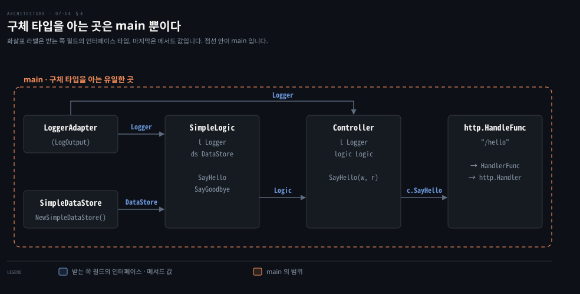

# 타입 단언은 아껴 쓰고 암묵 인터페이스로 의존성을 주입합니다

---

> Learning Go 7장 끝입니다. 인터페이스 안의 구체 타입을 꺼내는 타입 단언과 타입 스위치, 그것을 아껴 써야 하는 이유와 선택적 인터페이스, 함수를 인터페이스로 잇는 함수 타입, 그리고 암묵적 인터페이스로 프레임워크 없이 의존성을 주입하는 법을 다루고 장 끝 연습 문제를 풉니다.

## 핵심 요약

> 이 편이 매달린 하나의 생각은 쓰는 쪽이 정의한 작은 인터페이스만으로 구성 요소를 갈아 끼울 수 있다는 것입니다.

타입 단언 `i.(T)` 는 인터페이스에 담긴 값이 `T` 인지 실행 중에 확인하고, 틀리면 panic 을 냅니다. 그래서 늘 comma ok 형태로 씁니다. 여러 타입 가운데 하나라면 타입 스위치를 씁니다. 원문은 둘을 아껴 쓰라고 말합니다. 다만 구체 타입이 다른 인터페이스도 구현하는지 확인하는 선택적 인터페이스는 표준 라이브러리도 쓰는 쓰임입니다.

메서드를 가진 함수 타입은 함수를 인터페이스에 잇는 다리입니다. `http.HandlerFunc` 가 대표 예입니다. 비즈니스 로직이 필요한 기능을 작은 인터페이스로 적고 팩토리 함수가 인터페이스를 받아 struct 를 돌려주면, 구체 타입은 `main` 한 곳만 압니다. 원문은 이것이 크고 복잡한 프레임워크 없이도 되는 의존성 주입이라고 말하고, Go 가 객체 지향도 함수형도 아닌 실용적인 언어라고 정리합니다.


## 학습 목표

> 이 편을 읽고 나면 아래 다섯 가지를 스스로 해낼 수 있습니다.

1. 타입 단언과 타입 스위치를 쓰고, 타입 단언과 타입 변환이 어떻게 다른지 말할 수 있습니다.
2. 타입 단언을 아껴 써야 하는 이유와, 선택적 인터페이스라는 정당한 쓰임 및 그 한계를 설명할 수 있습니다.
3. 메서드를 가진 함수 타입이 함수를 인터페이스에 잇는 방식을 `http.HandlerFunc` 로 설명하고, 함수 타입 매개변수와 인터페이스 매개변수 가운데 무엇을 쓸지 판단할 수 있습니다.
4. 암묵적 인터페이스로 의존성을 주입한 작은 웹 앱을 쓰고, 구체 타입을 아는 곳이 `main` 뿐인 이유를 말할 수 있습니다.
5. 장 끝 연습 문제 셋을 풀며 타입·메서드·인터페이스를 함께 쓸 수 있습니다.


## 1. 타입 단언과 타입 스위치 — 인터페이스 안의 구체 타입을 꺼냅니다

> 타입 단언은 인터페이스에 담긴 값의 타입을 실행 중에 확인해 꺼내고, 틀리면 panic 이 납니다. comma ok 형태로 panic 을 피하고, 후보가 여럿이면 타입 스위치를 씁니다.

07-03 §6 에서 빈 인터페이스에 값을 담았다면 그 값을 어떻게 다시 꺼낼까요? Go 는 인터페이스 타입 변수에 특정 구체 타입이 들어 있는지, 또는 그 구체 타입이 다른 인터페이스를 구현하는지 보는 방법 두 가지를 줍니다.

**타입 단언**은 인터페이스를 구현한 구체 타입의 이름을 대거나, 인터페이스에 담긴 값의 구체 타입이 함께 구현하는 다른 인터페이스의 이름을 댑니다.

```go
type MyInt int

func main() {
	var i any
	var mine MyInt = 20
	i = mine
	i2 := i.(MyInt)
	fmt.Println(i2 + 1)
}
```

`i2` 의 타입은 `MyInt` 이고, 로컬에서 `21` 이 찍혔습니다. 타입 단언이 틀리면 코드가 panic 을 냅니다.

```go
i2 := i.(string)
fmt.Println(i2)
```

원문과 로컬 모두 `interface conversion: interface {} is main.MyInt, not string` 으로 panic 이 났습니다. 원문은 Go 가 구체 타입에 대해 아주 신중하다고 말합니다. 두 타입이 같은 바탕 타입을 공유해도 타입 단언은 인터페이스에 담긴 값의 타입과 정확히 맞아야 합니다. 그래서 `i.(int)` 도 panic 이 납니다. 로컬 메시지는 `interface {} is main.MyInt, not int` 였습니다.

### 타입 단언은 늘 comma ok 로 씁니다

실행이 멈추는 것은 바라는 동작이 아닙니다. 03-02 의 map 에서 제로 값이 들어 있는지 가릴 때처럼 comma ok 관용구로 이것을 피합니다.

```go
i2, ok := i.(int)
if !ok {
	return fmt.Errorf("unexpected type for %v", i)
}
fmt.Println(i2 + 1)
```

타입 변환이 성공하면 불리언 `ok` 가 `true` 입니다. 실패하면 `false` 이고 다른 변수(여기서는 `i2`)는 제로 값이 됩니다. 로컬에서 `i2, ok` 를 찍으니 `0 false` 였습니다. 예상 밖의 상황은 `if` 문 안에서 다루며, 오류 처리는 9장에서 자세히 봅니다.

원문은 타입 단언이 타입 변환과 아주 다르다고 강조합니다.

| 구분 | 타입 변환 | 타입 단언 |
|------|------|------|
| 하는 일 | 값을 새 타입으로 바꿉니다 | 인터페이스에 담긴 값의 타입을 드러냅니다 |
| 적용 대상 | 구체 타입과 인터페이스 모두 | 인터페이스 타입만 |
| 검사 시점 | 대부분 컴파일 시점. slice 와 배열 포인터 사이 변환은 실행 중에 실패할 수 있고 comma ok 를 지원하지 않습니다 | 늘 실행 시점. comma ok 를 쓰지 않으면 panic 으로 실패할 수 있습니다 |

원문은 타입 단언이 틀림없다고 확신하더라도 comma ok 형태를 쓰라고 말합니다. 다른 사람이, 혹은 여섯 달 뒤의 내가 코드를 어떻게 다시 쓸지 모르기 때문입니다. 검증하지 않은 타입 단언은 언젠가 실행 중에 실패합니다. Java 의 `(String) obj` 캐스트가 `ClassCastException` 을 던지는 것과 같은 자리이고, comma ok 는 `if (obj instanceof String s)` 에 가깝습니다. 이 비교는 원문 밖입니다.

### 후보가 여럿이면 타입 스위치를 씁니다

인터페이스에 여러 타입 가운데 하나가 들어 있을 수 있다면 **타입 스위치**를 씁니다.

```go
func doThings(i any) {
	switch j := i.(type) {
	case nil:
		// i is nil, type of j is any
	case int:
		// j is of type int
	case MyInt:
		// j is of type MyInt
	case io.Reader:
		// j is of type io.Reader
	case string:
		// j is a string
	case bool, rune:
		// i is either a bool or rune, so j is of type any
	default:
		// no idea what i is, so j is of type any
	}
}
```

타입 스위치는 04-03 의 `switch` 와 많이 닮았습니다. 불리언 연산 대신 인터페이스 타입 변수 뒤에 `.(type)` 을 붙입니다. 보통은 검사하는 변수를 `switch` 안에서만 유효한 다른 변수에 대입합니다. 원문의 메모에 따르면 타입 스위치의 목적이 기존 변수에서 새 변수를 이끌어 내는 것이라, 같은 이름에 대입하는 `i := i.(type)` 이 관용적입니다. 04-01 에서 피하라던 섀도잉이 좋은 생각이 되는 드문 자리라는 것입니다. 이 예제는 주석을 읽기 쉽게 하려고 섀도잉하지 않았습니다.

새 변수의 타입은 맞은 `case` 에 따라 정해집니다. `nil` 을 한 `case` 로 두면 인터페이스에 연결된 타입이 없는지 볼 수 있습니다. 한 `case` 에 타입을 둘 이상 나열하면 새 변수는 `any` 입니다. `switch` 문처럼 어떤 타입에도 맞지 않을 때 걸리는 `default` 를 둘 수 있습니다. 그 밖에는 맞은 `case` 의 타입을 가집니다. 지금까지는 `any` 로 예를 들었지만 모든 인터페이스 타입에서 구체 타입을 꺼낼 수 있습니다. 원문의 팁은 인터페이스에 담긴 값의 타입을 모른다면 리플렉션을 써야 한다는 것이며, 16장에서 다룹니다.


## 2. 타입 단언과 타입 스위치는 아껴 씁니다

> 매개변수는 선언된 타입으로 다루는 것이 원칙입니다. 예외는 구체 타입이 다른 인터페이스도 구현하는지 확인하는 선택적 인터페이스인데, 데코레이터로 감싸면 가려진다는 한계가 있습니다.

인터페이스 변수에서 구체 구현을 꺼낼 수 있는 것은 편리해 보입니다. 그래도 원문은 이 기법을 드물게 쓰라고 말합니다. 대부분은 매개변수나 반환 값을 주어진 타입 그대로 다루고, 그것이 또 무엇일 수 있는지 따지지 않아야 합니다. 그렇지 않으면 함수의 API 가 일하는 데 필요한 타입을 정확히 밝히지 않는 셈입니다. 다른 타입이 필요했다면 그 타입을 적었어야 합니다.

### 선택적 인터페이스 — 구체 타입이 더 할 줄 아는지 묻습니다

그래도 타입 단언과 타입 스위치가 쓸모 있는 경우가 있습니다. 흔한 쓰임은 인터페이스 뒤의 구체 타입이 다른 인터페이스도 구현하는지 보는 것입니다. 이것으로 선택적 인터페이스를 지정할 수 있습니다. 원문의 예는 표준 라이브러리의 `io.Copy` 입니다. 이 함수는 `io.Writer` 와 `io.Reader` 매개변수를 받고 실제 일은 `io.copyBuffer` 에 맡기는데, 원문은 추가 인터페이스를 구현하면 일의 대부분을 건너뛸 수 있다고 말합니다.

```go
// copyBuffer is the actual implementation of Copy and CopyBuffer.
// if buf is nil, one is allocated.
func copyBuffer(dst Writer, src Reader, buf []byte) (written int64, err error) {
	// If the reader has a WriteTo method, use it to do the copy.
	// Avoids an allocation and a copy.
	if wt, ok := src.(WriterTo); ok {
		return wt.WriteTo(dst)
	}
	// Similarly, if the writer has a ReadFrom method, use it to do the copy.
	if rt, ok := dst.(ReaderFrom); ok {
		return rt.ReadFrom(src)
	}
	// function continues...
}
```

원문 PDF 는 시그니처 끝과 둘째 주석 끝이 판면에서 잘려 `err er`, `the co` 로 끝납니다. 위 코드는 go1.25.1 의 `io/io.go` 에서 같은 줄을 찾아 채운 것입니다.

> **원문 정오**: 원문 산문은 "If the io.Writer parameter also implements io.WriterTo, or the io.Reader parameter also implements io.ReaderFrom" 이라고 적어 짝을 거꾸로 맺었습니다. 바로 아래 코드와 go1.25.1 의 `io/io.go` 는 읽는 쪽 `src` 가 `WriterTo` 를, 쓰는 쪽 `dst` 가 `ReaderFrom` 을 구현하는지 확인합니다. 뒤의 bufio 설명도 같은 뒤바뀜에서 나온 것으로 보입니다(노트의 해석). 원문은 넘긴 `io.Reader` 가 `io.ReaderFrom` 을 구현하면 버퍼로 감쌀 때 최적화가 사라진다고 적었습니다. 읽는 쪽에서 `io.Copy` 가 확인하는 것은 `WriterTo` 입니다.

원문 밖의 확인을 하나 더하면, 올바른 짝으로 고쳐 읽어도 bufio 는 이 한계의 예로 딱 맞지 않습니다. go1.25.1 의 `(*bufio.Reader).WriteTo` 는 감싼 리더가 `io.WriterTo` 를 구현하면 그 메서드를 그대로 불러 줍니다. 한계 자체는 사실이지만, 감싸는 쪽이 이렇게 넘겨주지 않는 데코레이터에서 드러난다고 읽는 것이 정확합니다.

### 데이터베이스 드라이버는 선택적 인터페이스로 진화했습니다

선택적 인터페이스가 쓰이는 또 다른 자리는 API 가 진화할 때입니다. 07-03 §3 에서 본 대로 데이터베이스 드라이버의 API 는 시간이 지나며 바뀌었습니다. 원문은 그 이유 하나로 컨텍스트의 추가를 듭니다. 컨텍스트는 함수에 넘기는 매개변수로, 무엇보다 취소를 다루는 표준 방법을 줍니다(14장). Go 1.7 에 추가되었으니 그 전의 코드, 곧 옛 데이터베이스 드라이버는 이를 지원하지 않습니다.

Go 1.8 에서 `database/sql/driver` 패키지에 기존 인터페이스의 컨텍스트 인식 판이 정의되었습니다. 예를 들어 `StmtExecContext` 인터페이스는 `Stmt` 의 `Exec` 메서드를 컨텍스트를 인식하는 쪽으로 대체하는 `ExecContext` 메서드를 정의합니다. `Stmt` 구현이 표준 라이브러리 데이터베이스 코드에 넘어오면, 그것이 `StmtExecContext` 도 구현하는지 확인합니다. 구현하면 `ExecContext` 를 부르고, 아니면 표준 라이브러리가 새 코드의 취소 지원을 대신하는 대체 구현을 제공합니다.

```go
func ctxDriverStmtExec(ctx context.Context, si driver.Stmt,
	nvdargs []driver.NamedValue) (driver.Result, error) {
	if siCtx, is := si.(driver.StmtExecContext); is {
		return siCtx.ExecContext(ctx, nvdargs)
	}
	// fallback code is here
}
```

> **원문 정오**: 원문은 이 함수의 시그니처 뒤 여는 중괄호 `{` 를 빠뜨려 `(driver.Result, error)` 다음 줄에서 바로 `if` 가 시작합니다. go1.25.1 의 `database/sql/ctxutil.go` 는 `(driver.Result, error) {` 로 엽니다. 위 코드는 여는 중괄호를 넣고, PDF 추출에서 흐트러진 들여쓰기를 정리해 옮겼습니다.

### 감싸면 선택적 인터페이스가 가려집니다

원문은 선택적 인터페이스 기법의 단점도 짚습니다. 07-03 §2 에서 인터페이스 구현이 같은 인터페이스의 다른 구현을 감싸 동작을 겹치는 데코레이터 패턴이 흔하다고 했습니다. 감싼 구현 가운데 하나가 선택적 인터페이스를 구현해도, 바깥에서 타입 단언이나 타입 스위치로는 알아낼 수 없습니다.

오류를 다룰 때도 이것을 봅니다. 오류는 `error` 인터페이스를 구현하고, 다른 오류를 감싸 정보를 더할 수 있습니다. 타입 스위치나 타입 단언은 감싸진 오류를 찾거나 맞추지 못합니다. 반환된 오류의 구체 구현마다 다르게 처리하려면 `errors.Is` 와 `errors.As` 로 감싸진 오류를 확인하고 꺼내라고 원문은 말합니다.

### 타입 스위치에는 default 를 둡니다

타입 스위치는 서로 다른 처리가 필요한 인터페이스 구현 여럿을 구별하게 해 줍니다. 원문은 인터페이스에 들어올 수 있는 유효한 타입이 정해져 있을 때 가장 쓸모 있다고 말합니다. 개발할 때 몰랐던 구현을 다루도록 `default` 를 꼭 두라고 합니다. 새 인터페이스 구현을 더하면서 타입 스위치 갱신을 잊어도 보호받을 수 있습니다.

```go
func walkTree(t *treeNode) (int, error) {
	switch val := t.val.(type) {
	case nil:
		return 0, errors.New("invalid expression")
	case number:
		// we know that t.val is of type number, so return the
		// int value
		return int(val), nil
	case operator:
		// we know that t.val is of type operator, so
		// find the values of the left and right children, then
		// call the process() method on operator to return the
		// result of processing their values.
		left, err := walkTree(t.lchild)
		if err != nil {
			return 0, err
		}
		right, err := walkTree(t.rchild)
		if err != nil {
			return 0, err
		}
		return val.process(left, right), nil
	default:
		// if a new treeVal type is defined, but walkTree wasn't updated
		// to process it, this detects it
		return 0, errors.New("unknown node type")
	}
}
```

원문의 메모는 인터페이스를 내보내지 않고 메서드도 적어도 하나 내보내지 않으면 예상 밖의 구현을 더 막을 수 있다고 말합니다. 인터페이스를 내보내면 다른 패키지의 struct 에 임베딩되어 그 struct 가 인터페이스를 구현하게 될 수 있기 때문입니다. 패키지와 내보내기는 10장에서 다룹니다. Java 17 의 `sealed interface ... permits` 가 언어 차원에서 하는 일을 Go 는 이런 관례로 대신한다고 볼 수 있습니다. 이 비교는 원문 밖입니다.


## 3. 함수 타입은 인터페이스로 가는 다리입니다

> Go 는 함수 타입에도 메서드를 붙일 수 있어 함수가 인터페이스를 구현하게 만듭니다. 설정이 필요한 호출 사슬의 입구라면 인터페이스를, 단순한 함수라면 함수 타입 매개변수를 씁니다.

struct 에 메서드를 선언하는 개념을 알고 나면 `int` 나 `string` 을 바탕으로 한 사용자 정의 타입에도 메서드가 있을 수 있다는 것이 보입니다. 메서드는 인스턴스의 상태와 상호작용하는 비즈니스 로직이고, 정수와 문자열에도 상태가 있으니까요. 원문은 Go 가 사용자 정의 함수 타입을 포함해 어떤 사용자 정의 타입에든 메서드를 허용한다고 말합니다. 학문적인 구석처럼 들리지만 함수가 인터페이스를 구현하게 해 줘서 아주 쓸모 있습니다.

가장 흔한 쓰임은 HTTP 핸들러입니다. HTTP 핸들러는 HTTP 서버 요청을 처리하며 인터페이스로 정의됩니다.

```go
type Handler interface {
	ServeHTTP(http.ResponseWriter, *http.Request)
}
```

`http.HandlerFunc` 로 타입 변환하면 시그니처가 `func(http.ResponseWriter, *http.Request)` 인 함수는 무엇이든 `http.Handler` 로 쓸 수 있습니다.

```go
type HandlerFunc func(http.ResponseWriter, *http.Request)

func (f HandlerFunc) ServeHTTP(w http.ResponseWriter, r *http.Request) {
	f(w, r)
}
```

이것으로 함수·메서드·클로저로 HTTP 핸들러를 구현하고, `http.Handler` 를 만족하는 다른 타입과 똑같은 코드 경로를 탈 수 있습니다. 05-02 §1 에서 Go 는 시그니처만 맞으면 같은 함수 타입 변수에 담긴다고 봤는데, `HandlerFunc` 는 그 반대 방향, 곧 함수에 인터페이스를 입히는 어댑터입니다. 이 연결은 노트의 해석입니다.

### 함수 타입 매개변수와 인터페이스 매개변수를 고르는 기준

Go 에서 함수는 일급 개념이라 함수에 매개변수로 자주 넘겨집니다. 한편 Go 는 작은 인터페이스를 권하고, 메서드 하나짜리 인터페이스는 함수 타입 매개변수를 쉽게 대신할 수 있습니다. 그러면 함수나 메서드의 입력 매개변수를 언제 함수 타입으로, 언제 인터페이스로 해야 할까요?

원문의 기준은 이렇습니다. 그 함수 하나가 입력 매개변수에 드러나지 않은 다른 함수나 상태에 많이 기댈 가능성이 크다면, 인터페이스 매개변수를 쓰고 함수 타입을 정의해 함수를 인터페이스에 잇습니다. `http` 패키지가 그렇게 합니다. `Handler` 는 설정이 필요한 호출 사슬의 입구일 가능성이 크기 때문입니다. 반면 `sort.Slice` 에 쓰는 것처럼 단순한 함수라면 함수 타입 매개변수가 좋은 선택입니다.


## 4. 암묵적 인터페이스로 의존성을 주입합니다

> 비즈니스 로직과 컨트롤러가 필요한 기능을 자기 쪽의 작은 인터페이스로 적으면, 구체 타입은 서로를 몰라도 맞물립니다. 모든 구체 타입을 아는 곳은 연결을 맡은 `main` 하나입니다.

원문은 서문에서 소프트웨어 작성을 다리 건설에 견줬습니다. 소프트웨어가 물리적 기반 시설과 닮은 점 하나는, 여러 사람이 오래 쓰는 프로그램이면 유지 보수가 필요하다는 것입니다. 프로그램이 닳지는 않지만 개발자는 버그를 고치고 기능을 더하고 새 환경에서 돌리라는 요청을 자주 받습니다. 그러니 고치기 쉬운 구조로 짜야 합니다. 소프트웨어 엔지니어는 프로그램의 한 부분을 바꿔도 다른 부분에 영향이 없도록 코드의 결합을 푸는 것을 이야기합니다.

결합을 풀려고 개발된 기법 하나가 **의존성 주입**입니다. 코드가 일하는 데 필요한 기능을 명시적으로 밝혀야 한다는 개념입니다. 원문은 이것이 생각보다 오래되었다며, 1996년 Robert Martin 이 "The Dependency Inversion Principle" 이라는 글을 썼다고 말합니다.

원문은 Go 의 암묵적 인터페이스가 가져온 뜻밖의 이점(surprising benefit) 하나가 의존성 주입을 코드의 결합을 푸는 훌륭한 방법으로 만든다는 것이라고 말합니다. 다른 언어 개발자들은 의존성을 주입하려고 크고 복잡한 프레임워크를 흔히 쓰지만, Go 에서는 추가 라이브러리 없이 쉽게 구현할 수 있다는 것입니다. Spring 의 IoC 컨테이너가 하던 일을 손으로 하는 셈이라, Spring 개발자라면 아래 예제가 `@Configuration` 클래스의 `@Bean` 메서드들을 `main` 에 풀어 쓴 모양으로 보일 것입니다. 이 비교는 원문 밖입니다.

### 작은 웹 앱 — 구성 요소는 서로의 인터페이스만 압니다

원문은 아주 단순한 웹 애플리케이션을 만듭니다. Go 의 내장 HTTP 서버는 13장의 「The Server」에서 다루니 미리보기라고 합니다. 절 이름만 원문에 있고 장 번호는 노트가 찾아 붙였습니다. 먼저 작은 유틸리티 함수인 로거를 씁니다.

```go
func LogOutput(message string) {
	fmt.Println(message)
}
```

앱에는 데이터 저장소도 필요합니다. 단순한 것을 하나 만들고, `SimpleDataStore` 인스턴스를 만드는 팩토리 함수도 정의합니다.

```go
type SimpleDataStore struct {
	userData map[string]string
}

func (sds SimpleDataStore) UserNameForID(userID string) (string, bool) {
	name, ok := sds.userData[userID]
	return name, ok
}

func NewSimpleDataStore() SimpleDataStore {
	return SimpleDataStore{
		userData: map[string]string{
			"1": "Fred",
			"2": "Mary",
			"3": "Pat",
		},
	}
}
```

다음은 사용자를 찾아 인사하거나 작별하는 비즈니스 로직입니다. 로직에는 다룰 데이터가 필요하니 데이터 저장소가 필요합니다. 불릴 때 기록도 남기고 싶으니 로거에도 기댑니다. 하지만 나중에 다른 로거나 저장소를 쓸 수 있으니 `LogOutput` 이나 `SimpleDataStore` 에 억지로 기대게 하고 싶지는 않습니다. 비즈니스 로직에 필요한 것은 자기가 무엇에 기대는지 설명하는 인터페이스입니다.

```go
type DataStore interface {
	UserNameForID(userID string) (string, bool)
}

type Logger interface {
	Log(message string)
}
```

`LogOutput` 함수가 이 인터페이스를 만족하게 하려면 메서드를 가진 함수 타입을 정의합니다. §3 의 다리입니다.

```go
type LoggerAdapter func(message string)

func (lg LoggerAdapter) Log(message string) {
	lg(message)
}
```

원문은 "놀라운 우연으로" `LoggerAdapter` 와 `SimpleDataStore` 가 비즈니스 로직에 필요한 인터페이스를 만족하지만, 두 타입 모두 그 사실을 전혀 모른다고 적습니다. 이제 비즈니스 로직의 구현입니다.

```go
type SimpleLogic struct {
	l  Logger
	ds DataStore
}

func (sl SimpleLogic) SayHello(userID string) (string, error) {
	sl.l.Log("in SayHello for " + userID)
	name, ok := sl.ds.UserNameForID(userID)
	if !ok {
		return "", errors.New("unknown user")
	}
	return "Hello, " + name, nil
}

func (sl SimpleLogic) SayGoodbye(userID string) (string, error) {
	sl.l.Log("in SayGoodbye for " + userID)
	name, ok := sl.ds.UserNameForID(userID)
	if !ok {
		return "", errors.New("unknown user")
	}
	return "Goodbye, " + name, nil
}
```

필드 둘은 `Logger` 와 `DataStore` 입니다. `SimpleLogic` 어디에도 구체 타입이 나오지 않으니 구체 타입에 대한 의존도 없습니다. 나중에 전혀 다른 제공자의 새 구현으로 바꿔도, 그 제공자는 이 인터페이스와 아무 관계가 없으니 문제가 없습니다. 원문은 이것이 Java 같은 명시적 인터페이스 언어와 아주 다르다고 말합니다. Java 는 인터페이스로 구현을 분리하지만, 명시적 인터페이스가 클라이언트와 제공자를 묶어서 의존성을 바꾸기가 Go 보다 훨씬 어렵다는 것입니다.

`SimpleLogic` 인스턴스는 인터페이스를 받아 struct 를 돌려주는 팩토리 함수로 만듭니다.

```go
func NewSimpleLogic(l Logger, ds DataStore) SimpleLogic {
	return SimpleLogic{
		l:  l,
		ds: ds,
	}
}
```

원문의 메모대로 `SimpleLogic` 의 필드는 내보내지 않아서 같은 패키지의 코드만 접근할 수 있습니다. Go 에서 불변성을 강제할 수는 없지만, 필드에 접근하는 코드를 제한하면 실수로 바꿀 가능성이 줄어듭니다. 내보내기는 10장에서 다룹니다.

### 컨트롤러는 자기가 쓰는 메서드만 인터페이스로 적습니다

이제 API 입니다. 엔드포인트는 사용자 ID 를 받아 그 사람에게 인사하는 `/hello` 하나뿐입니다. 원문은 실제 애플리케이션에서 인증 정보를 쿼리 매개변수로 쓰지 말라고, 이것은 빠른 예제일 뿐이라고 덧붙입니다. 컨트롤러에는 인사하는 비즈니스 로직이 필요하니 그것을 인터페이스로 정의합니다.

```go
type Logic interface {
	SayHello(userID string) (string, error)
}
```

이 메서드는 `SimpleLogic` 에 있지만, 이번에도 구체 타입은 인터페이스를 모릅니다. 게다가 `SimpleLogic` 의 다른 메서드 `SayGoodbye` 는 컨트롤러가 관심이 없어서 인터페이스에 없습니다. 원문은 인터페이스가 클라이언트 코드의 것이라 메서드 집합이 클라이언트의 필요에 맞춰진다고 말합니다.

```go
type Controller struct {
	l     Logger
	logic Logic
}

func (c Controller) SayHello(w http.ResponseWriter, r *http.Request) {
	c.l.Log("In SayHello")
	userID := r.URL.Query().Get("user_id")
	message, err := c.logic.SayHello(userID)
	if err != nil {
		w.WriteHeader(http.StatusBadRequest)
		w.Write([]byte(err.Error()))
		return
	}
	w.Write([]byte(message))
}

func NewController(l Logger, logic Logic) Controller {
	return Controller{
		l:     l,
		logic: logic,
	}
}
```

다른 타입처럼 `Controller` 에도 팩토리 함수를 썼습니다. 이번에도 인터페이스를 받고 struct 를 돌려줍니다. 마지막으로 `main` 에서 모든 구성 요소를 연결하고 서버를 띄웁니다.

```go
func main() {
	l := LoggerAdapter(LogOutput)
	ds := NewSimpleDataStore()
	logic := NewSimpleLogic(l, ds)
	c := NewController(l, logic)
	http.HandleFunc("/hello", c.SayHello)
	http.ListenAndServe(":8080", nil)
}
```



`main` 은 코드에서 모든 구체 타입을 아는 유일한 곳입니다. 다른 구현으로 바꾸고 싶다면 바꿀 곳은 여기뿐입니다. 원문은 의존성 주입으로 의존성을 밖으로 빼면, 코드를 진화시키는 데 필요한 변경이 제한된다고 말합니다.

이 노트를 쓰면서 포트를 여는 대신 `httptest.NewServer` 에 같은 핸들러를 올려 `/hello` 를 두 번 불렀습니다. `user_id=1` 은 `200 Hello, Fred` 를, `user_id=9` 는 `400 unknown user` 를 돌려줬고, 호출마다 `In SayHello` 와 `in SayHello for …` 두 줄이 로그로 찍혔습니다.

의존성 주입은 테스트를 쉽게 하는 좋은 패턴이기도 합니다. 원문은 단위 테스트를 쓰는 것이 사실상 입력과 출력을 제한한 다른 환경에서 코드를 재사용하는 일이라 놀랍지 않다고 말합니다. 예를 들어 로그 출력을 붙잡아 `Logger` 인터페이스를 만족하는 타입을 주입하면 테스트에서 로그 출력을 검증할 수 있습니다. 15장에서 더 다룹니다.

원문의 메모는 `http.HandleFunc("/hello", c.SayHello)` 한 줄이 앞의 두 가지를 보인다고 짚습니다. 첫째, `SayHello` 메서드를 함수로 다룹니다(07-01 §5 의 메서드 값).

둘째, `http.HandleFunc` 는 함수를 받아 `http.HandlerFunc` 함수 타입으로 바꾸는데, 이 타입은 `http.Handler` 인터페이스를 만족하는 메서드를 선언합니다. 한 타입의 메서드를 꺼내 자기 메서드를 가진 다른 타입으로 바꾼 것입니다.

### Wire 는 연결 코드를 생성합니다

손으로 의존성 주입 코드를 쓰는 것이 너무 번거롭다면 Google 이 만든 의존성 주입 도우미 Wire 를 쓸 수 있다고 원문은 소개합니다. Wire 는 코드 생성으로 `main` 에 직접 썼던 구체 타입 선언을 자동으로 만듭니다. 주로 실행 시점에 리플렉션으로 빈을 연결하는 Spring 과 달리 컴파일 전에 코드를 만들어 둔다는 점이 다릅니다. 이 대비는 원문 밖입니다.


## 5. Go 는 딱히 객체 지향 언어가 아닙니다

> Go 는 절차적 언어도, 객체 지향 언어도, 함수형 언어도 아닙니다. 원문은 한 단어로 고르라면 실용적이라고 말합니다.

원문은 Go 의 관용적인 타입 사용을 보고 나면 Go 를 어떤 스타일의 언어로 분류하기 어렵다는 것을 알게 된다고 말합니다. 엄격한 절차적 언어는 분명 아닙니다. 동시에 메서드 오버라이딩, 상속, 그리고 사실상 객체가 없으니 딱히 객체 지향 언어도 아닙니다. 함수 타입과 클로저가 있지만 함수형 언어도 아닙니다. 원문은 Go 를 이 범주 가운데 하나에 억지로 끼우려 하면 Go 답지 않은 코드가 나온다고 말합니다.

Go 의 스타일에 이름을 붙여야 한다면 가장 좋은 단어는 **실용적**이라고 원문은 정리합니다. Go 는 여러 곳에서 개념을 빌려 오며, 큰 팀이 여러 해 동안 유지할 수 있는 단순하고 읽기 쉬운 언어를 만드는 것을 가장 큰 목표로 삼습니다.


## 연습 문제

> 원문 연습 문제 세 개는 하나로 이어지는 농구 리그 프로그램입니다. `go1.25.1` 에서 풀고 `go vet` 까지 통과했으며, 원문의 정답은 책의 Chapter 7 저장소의 `exercise_solutions` 에 있습니다.

### 1. Team 과 League 타입

타입 둘을 정의합니다. `Team` 에는 팀 이름 필드와 선수 이름들 필드가 있습니다. `League` 에는 리그의 팀들을 담는 `Teams` 필드와, 팀 이름을 승리 수에 대응시키는 `Wins` 필드가 있습니다.

```go
type Team struct {
	Name    string
	Players []string
}

type League struct {
	Teams []Team
	Wins  map[string]int
}
```

### 2. MatchResult 와 Ranking 메서드

`League` 에 메서드 둘을 더합니다. `MatchResult` 는 첫째 팀 이름과 점수, 둘째 팀 이름과 점수를 받아 `League` 의 `Wins` 필드를 갱신합니다. `Ranking` 은 승리 순으로 정렬한 팀 이름 slice 를 돌려줍니다. `main` 에서 예시 데이터로 자료구조를 만들고 두 메서드를 부릅니다.

```go
func (l League) MatchResult(team1 string, score1 int, team2 string, score2 int) {
	if _, ok := l.Wins[team1]; !ok {
		return
	}
	if _, ok := l.Wins[team2]; !ok {
		return
	}
	if score1 == score2 {
		return
	}
	if score1 > score2 {
		l.Wins[team1]++
	} else {
		l.Wins[team2]++
	}
}

func (l League) Ranking() []string {
	names := make([]string, 0, len(l.Teams))
	for _, t := range l.Teams {
		names = append(names, t.Name)
	}
	sort.SliceStable(names, func(i, j int) bool {
		return l.Wins[names[i]] > l.Wins[names[j]]
	})
	return names
}
```

`MatchResult` 는 `League` 를 바꾸는데도 값 리시버입니다. 바꾸는 것이 `Wins` map 의 내용뿐이고, map 은 06-02 §3 에서 본 대로 포인터라 복사된 리시버에서도 같은 map 을 가리키기 때문입니다. 07-01 §3 의 규칙대로라면 `League` 자체의 필드를 바꾸는 메서드가 생기는 순간 포인터 리시버로 맞추는 편이 안전합니다. 이 풀이와 설명은 노트의 것입니다.

동점 팀의 순서를 입력 순서대로 두려고 `sort.Slice` 대신 `sort.SliceStable` 을 썼습니다. `sort.Slice` 는 안정 정렬을 보장하지 않아서 승수가 같은 팀의 순서가 입력 순서와 달라질 수 있습니다.

### 3. Ranker 인터페이스와 RankPrinter

`Ranking` 메서드 하나를 가진 `Ranker` 인터페이스를 정의합니다. 첫째 매개변수가 `Ranker`, 둘째가 `io.Writer` 인 `RankPrinter` 함수를 쓰고, `io.WriteString` 으로 `Ranker` 가 돌려준 값을 한 줄에 하나씩 `io.Writer` 에 씁니다. `main` 에서 이 함수를 부릅니다.

```go
type Ranker interface {
	Ranking() []string
}

func RankPrinter(r Ranker, w io.Writer) {
	for _, v := range r.Ranking() {
		io.WriteString(w, v)
		w.Write([]byte("\n"))
	}
}
```

이 노트는 네 팀(`Italy`·`France`·`India`·`Nigeria`)에 여섯 경기를 넣었습니다.

```go
l.MatchResult("Italy", 50, "France", 70)
l.MatchResult("India", 85, "Nigeria", 80)
l.MatchResult("Italy", 60, "India", 55)
l.MatchResult("France", 100, "Nigeria", 110)
l.MatchResult("Italy", 65, "Nigeria", 70)
l.MatchResult("France", 95, "India", 80)
RankPrinter(l, os.Stdout)
```

`RankPrinter(l, os.Stdout)` 을 부르니 두 번 이긴 `France`·`Nigeria`, 한 번 이긴 `Italy`·`India` 순으로 네 줄이 찍혔습니다. `League` 는 `Ranker` 를 구현한다고 선언하지 않았지만 `Ranking` 메서드가 있어 그대로 넘어갑니다. `os.Stdout` 도 `io.Writer` 이므로 파일이나 `bytes.Buffer` 로 바꿔 넘겨도 같은 코드가 돕니다. 07-03 §2 의 암묵적 인터페이스와 표준 인터페이스가 한 줄에 함께 나온 모습입니다.


## 핵심 개념 체크리스트

목표 번호 순서대로 짝지었습니다.

- [ ] (목표 1) `i.(int)` 가 `MyInt` 를 담은 `i` 에서 panic 을 내는 이유와, panic 없이 확인하는 형태를 쓸 수 있습니까?
- [ ] (목표 1) 타입 스위치에서 `case bool, rune:` 에 걸린 `j` 의 타입이 `any` 인 이유를 말할 수 있습니까?
- [ ] (목표 2) `io.Copy` 가 읽는 쪽과 쓰는 쪽에서 각각 어떤 선택적 인터페이스를 확인하는지 말할 수 있습니까?
- [ ] (목표 2) 선택적 인터페이스를 구현한 값을 데코레이터로 감싸면 무엇이 사라질 수 있습니까?
- [ ] (목표 3) `http.HandlerFunc(f)` 가 `http.Handler` 가 되는 원리를 설명할 수 있습니까?
- [ ] (목표 4) `Controller` 가 `SimpleLogic` 대신 `Logic` 인터페이스를 필드로 두어 얻는 두 가지를 말할 수 있습니까?
- [ ] (목표 5) 값 리시버인 `MatchResult` 가 `Wins` 를 바꿀 수 있는 이유를 말할 수 있습니까?


## 관련 문서

- [07-03 인터페이스는 암묵적으로 만족되고 nil 은 타입과 값이 모두 비어야 합니다](./07-03.%EC%9D%B8%ED%84%B0%ED%8E%98%EC%9D%B4%EC%8A%A4%EB%8A%94%20%EC%95%94%EB%AC%B5%EC%A0%81%EC%9C%BC%EB%A1%9C%20%EB%A7%8C%EC%A1%B1%EB%90%98%EA%B3%A0%20nil%20%EC%9D%80%20%ED%83%80%EC%9E%85%EA%B3%BC%20%EA%B0%92%EC%9D%B4%20%EB%AA%A8%EB%91%90%20%EB%B9%84%EC%96%B4%EC%95%BC%20%ED%95%A9%EB%8B%88%EB%8B%A4.md) — 7장 셋째. 인터페이스
- [05-02 함수는 값이고 클로저는 바깥 변수를 붙잡습니다](./05-02.%ED%95%A8%EC%88%98%EB%8A%94%20%EA%B0%92%EC%9D%B4%EA%B3%A0%20%ED%81%B4%EB%A1%9C%EC%A0%80%EB%8A%94%20%EB%B0%94%EA%B9%A5%20%EB%B3%80%EC%88%98%EB%A5%BC%20%EB%B6%99%EC%9E%A1%EC%8A%B5%EB%8B%88%EB%8B%A4.md) — 5장. 함수 타입
- [03-02 문자열은 바이트이고 map 은 없는 키에 제로 값을 돌려줍니다](./03-02.%EB%AC%B8%EC%9E%90%EC%97%B4%EC%9D%80%20%EB%B0%94%EC%9D%B4%ED%8A%B8%EC%9D%B4%EA%B3%A0%20map%20%EC%9D%80%20%EC%97%86%EB%8A%94%20%ED%82%A4%EC%97%90%20%EC%A0%9C%EB%A1%9C%20%EA%B0%92%EC%9D%84%20%EB%8F%8C%EB%A0%A4%EC%A4%8D%EB%8B%88%EB%8B%A4.md) — 3장. comma ok
- [Learning Go 2판 — 정독 인덱스](./README.md) — 16장 전체 지도


## 참고 자료

- 원본: 《Learning Go, 2nd Edition》 (Jon Bodner, O'Reilly)
- 다룬 범위: Chapter 7 "Type Assertions and Type Switches" 부터 장 끝까지, 연습 문제 1~3
- go1.25.1 표준 라이브러리 소스 `io/io.go`(copyBuffer), `database/sql/ctxutil.go`(ctxDriverStmtExec), `bufio/bufio.go`((*Reader).WriteTo) — 원문 정오 두 건의 근거
