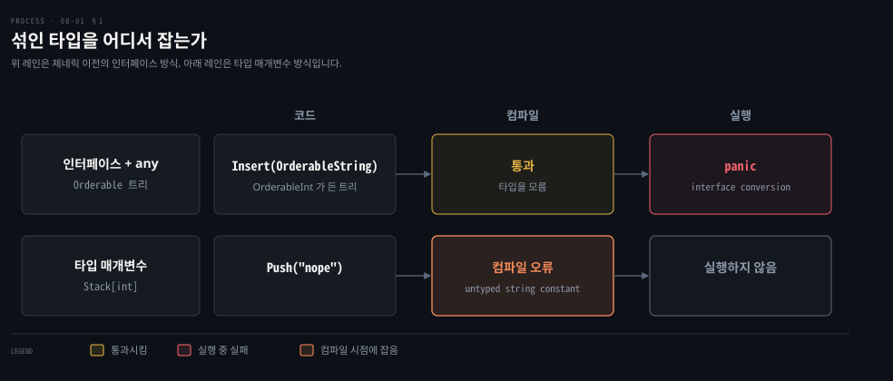

# 제네릭은 타입 매개변수로 한 번 쓰고 컴파일 시점에 타입을 검사합니다

---

> Learning Go 8장 앞 부분입니다. 제네릭이 없을 때 인터페이스로 버티면 무엇을 잃는지, Go 의 타입 매개변수와 타입 제약, `any` 와 `comparable`, 제네릭 함수로 쓰는 Map·Filter·Reduce, 그리고 인터페이스를 타입 제약으로 쓰는 법을 다룹니다.

## 핵심 요약

> 이 편이 매달린 하나의 생각은 제네릭이 코드 중복과 실행 중 타입 오류를 함께 없앤다는 것입니다.

Go 1.18 전에는 사용자 정의 타입과 함수가 여러 구체 타입을 받을 수 없었습니다. 인터페이스와 `any` 로 한 번만 쓰면 서로 다른 타입이 섞여도 컴파일러가 막지 못하고 실행 중에 panic 이 납니다. 타입 매개변수는 대괄호 안에 이름과 타입 제약을 적어, 쓰는 순간 타입을 정하고 컴파일러가 확인하게 합니다.

타입 제약은 Go 인터페이스로 적습니다. 아무 타입이나 받으면 `any`, `==` 를 쓰려면 `comparable` 입니다. 제네릭 타입의 제로 값은 `var` 로 선언해 돌려줍니다. 함수도 이름 뒤에 타입 매개변수를 둘 수 있어 Map·Filter·Reduce 를 한 번만 씁니다. 메서드를 가진 인터페이스도 제약이 되고, 인터페이스 자체가 타입 매개변수를 가질 수도 있습니다.


## 학습 목표

> 이 편을 읽고 나면 아래 다섯 가지를 스스로 해낼 수 있습니다.

1. 인터페이스와 `any` 로 만든 트리가 서로 다른 타입의 값을 컴파일 시점에 막지 못하는 이유를 설명할 수 있습니다.
2. 타입 매개변수와 타입 제약으로 제네릭 타입을 선언하고, 리시버에 `Stack[T]` 를 적는 이유와 제로 값을 돌려주는 법을 말할 수 있습니다.
3. `any` 로는 `==` 를 쓸 수 없고 `comparable` 이 필요한 이유를 말할 수 있습니다.
4. 제네릭 함수 Map·Filter·Reduce 를 쓰고 타입 매개변수가 어디에 놓이는지 말할 수 있습니다.
5. 메서드를 가진 인터페이스와 타입 매개변수를 가진 인터페이스를 제약으로 써서 `FindCloser` 를 설명할 수 있습니다.


## 1. 제네릭이 없으면 중복하거나 타입 안전을 버려야 합니다

> 제네릭이 없으면 같은 자료구조를 타입마다 다시 쓰거나, 인터페이스와 `any` 로 한 번만 쓰고 컴파일 시점 타입 검사를 포기해야 합니다. 함수 쪽 제약은 더 커서 표준 라이브러리 설계에도 흔적이 남았습니다.

"같은 것을 반복하지 말라"는 흔한 소프트웨어 공학 조언입니다. 중복된 코드 사이에서 변경을 맞춰 두기 어려우니 자료구조나 함수를 다시 만드는 것보다 재사용하는 편이 낫습니다. Go 같은 강한 타입 언어에서는 모든 함수 매개변수와 struct 필드의 타입을 컴파일 시점에 알아야 합니다. 그 엄격함 덕에 컴파일러가 코드를 검증해 줍니다. 그런데 가끔은 함수의 로직이나 struct 의 필드를 다른 타입으로 재사용하고 싶어집니다. Go 는 이것을 **타입 매개변수**로 제공하며, 흔히 제네릭이라 부릅니다.

원문은 map·slice·채널 같은 내장 타입과 `len`·`cap`·`make` 같은 내장 함수는 여러 구체 타입의 값을 받고 돌려줄 수 있었다고 말합니다. 하지만 Go 1.18 전까지 사용자 정의 타입과 함수는 그럴 수 없었습니다.

동적 타입 언어에 익숙하면 제네릭이 왜 대단한지 모를 수 있습니다. 원문은 이것을 "타입 매개변수"로 생각하면 도움이 된다고 말합니다. 지금까지 본 함수는 호출할 때 값이 정해지는 매개변수를 받았습니다. 05-01 의 `divAndRemainder` 는 `int` 매개변수 둘을 받았습니다. struct 도 선언할 때 필드 타입을 정했습니다. 어떤 경우에는 매개변수나 필드의 구체 타입을 쓸 때까지 정하지 않고 두는 것이 쓸모 있습니다.

### 인터페이스로 만든 트리는 섞인 타입을 막지 못합니다

제네릭 타입이 필요한 이유는 이해하기 쉽습니다. 07-01 §4 에서 `int` 용 이진 트리를 봤습니다. 문자열이나 `float64` 용 트리가 필요하고 타입 안전도 원한다면 선택지가 몇 없습니다. 타입마다 트리를 따로 쓰면 코드가 너무 많이 중복되어 장황하고 실수하기 쉽습니다. 제네릭 없이 중복을 피하는 유일한 방법은 값의 순서를 정하는 인터페이스를 쓰도록 트리 구현을 고치는 것입니다.

```go
type Orderable interface {
	// Order returns:
	// a value < 0 when the Orderable is less than the supplied value,
	// a value > 0 when the Orderable is greater than the supplied value,
	// and 0 when the two values are equal.
	Order(any) int
}

type Tree struct {
	val         Orderable
	left, right *Tree
}

func (t *Tree) Insert(val Orderable) *Tree {
	if t == nil {
		return &Tree{val: val}
	}
	switch comp := val.Order(t.val); {
	case comp < 0:
		t.left = t.left.Insert(val)
	case comp > 0:
		t.right = t.right.Insert(val)
	}
	return t
}
```

`OrderableInt` 타입을 만들면 `int` 값을 넣을 수 있습니다.

```go
type OrderableInt int

func (oi OrderableInt) Order(val any) int {
	return int(oi - val.(OrderableInt))
}

func main() {
	var it *Tree
	it = it.Insert(OrderableInt(5))
	it = it.Insert(OrderableInt(3))
	// etc...
}
```

이 코드는 올바르게 동작하지만, 자료구조에 넣는 값들이 모두 같은 타입인지 컴파일러가 검증하지 못합니다. `OrderableString` 타입도 있다면 다음 코드가 컴파일됩니다.

```go
type OrderableString string

func (os OrderableString) Order(val any) int {
	return strings.Compare(string(os), val.(string))
}

var it *Tree
it = it.Insert(OrderableInt(5))
it = it.Insert(OrderableString("nope"))
```

`Order` 가 넘어오는 값을 `any` 로 받으니 Go 의 주된 장점인 컴파일 시점 타입 안전 검사가 사실상 무력해집니다. 원문은 `OrderableInt` 가 든 트리에 `OrderableString` 을 넣는 코드를 컴파일러가 받아 주고, 실행하면 다음처럼 panic 이 난다고 말합니다.

```bash
panic: interface conversion: interface {} is main.OrderableInt, not string
```

로컬에서도 같은 메시지였습니다. 07-04 §1 의 검증하지 않은 타입 단언이 실행 중에 실패하는 모습 그대로입니다.

> **원문 정오**: 원문의 `OrderableString.Order` 는 넘어온 값을 `val.(string)` 으로 단언합니다. 트리에 저장되는 값의 타입은 `string` 이 아니라 `OrderableString` 이라서, 이 메서드는 `OrderableString` 끼리만 넣어도 실패합니다. 이 노트를 쓰면서 `OrderableString("a")` 다음 `OrderableString("b")` 를 넣으니 `interface {} is main.OrderableString, not string` 으로 panic 이 났습니다. `OrderableInt` 처럼 `val.(OrderableString)` 이어야 자기 타입끼리 동작합니다. 그렇게 고쳐도 서로 다른 타입을 섞으면 panic 이 나므로, 원문이 보이려던 요점은 그대로 성립합니다. 16장 PDF 전체에서 `val.(string)` 은 이 한 곳이었습니다.

제네릭이 있으면 자료구조를 한 번만 구현해 여러 타입에 쓰면서 맞지 않는 데이터를 컴파일 시점에 잡을 수 있습니다. 원문은 곧 그 쓰는 법을 보인다고 예고합니다.



### 함수에서는 한계가 더 컸습니다

원문은 제네릭 없는 자료구조가 불편한 정도라면, 진짜 한계는 함수를 쓸 때라고 말합니다. 표준 라이브러리의 여러 구현 결정이 처음에 제네릭이 없었기 때문에 내려졌습니다.

예를 들어 Go 는 숫자 타입마다 함수를 여럿 쓰는 대신 `math.Max`·`math.Min`·`math.Mod` 를 `float64` 매개변수로 구현했습니다. `float64` 는 범위가 넓어 다른 숫자 타입 거의 모두를 정확히 나타낼 수 있습니다.

원문이 드는 예외는 값이 2^53 − 1 보다 크거나 −2^53 − 1 보다 작은 `int`·`int64`·`uint` 입니다. 이 노트를 쓰면서 확인하니 `float64(1<<53) == float64(1<<53 + 1)` 이 `true` 여서, 2^53 을 넘으면 이웃한 정수를 구별하지 못했습니다. 2^53 자체는 정확히 담기므로 원문의 경계는 한 칸 보수적입니다(원문 밖 확인).

제네릭 없이는 아예 불가능한 일도 있습니다. 인터페이스로 지정한 변수의 새 인스턴스를 만들 수 없습니다. 같은 인터페이스 타입의 두 매개변수가 같은 구체 타입이라고 지정할 수도 없습니다.

어떤 타입의 slice 든 처리하는 함수를 쓰려면 리플렉션에 기대 성능과 컴파일 시점 타입 안전을 조금 내줘야 했습니다. `sort.Slice` 가 그렇게 동작합니다. 그래서 제네릭 전에는 map·reduce·filter 같은 slice 함수를 slice 타입마다 되풀이해 구현했습니다. 원문은 단순한 알고리즘은 복사하기 쉽지만, 컴파일러가 자동으로 해 주지 못한다는 이유로 코드를 중복하는 것을 많은(대부분일 수도 있는) 엔지니어가 거슬려한다고 말합니다.


## 2. Go 의 제네릭 — 대괄호 안의 타입 매개변수와 타입 제약

> 타입 매개변수는 선언 이름 뒤 대괄호에 이름과 타입 제약을 적고, 타입 제약은 인터페이스로 적습니다. 제네릭 타입의 제로 값은 `var` 로 선언해 돌려주고, `==` 를 쓰려면 `any` 대신 `comparable` 이 필요합니다.

원문은 Go 가 처음 발표된 때부터 제네릭을 더하라는 요구가 있었다고 말합니다. Go 개발 책임자 Russ Cox 는 2009년 블로그 글에서 처음에 제네릭을 넣지 않은 이유를 설명했습니다. Go 는 빠른 컴파일러, 읽기 쉬운 코드, 좋은 실행 시간을 중시하는데, 그들이 아는 제네릭 구현 가운데 셋을 모두 허락하는 것이 없었다는 것입니다. 10년 동안 문제를 연구한 끝에 Go 팀은 Type Parameters Proposal 에 정리한 실행 가능한 방식을 얻었습니다.

원문은 스택으로 Go 제네릭을 보입니다. 스택은 값을 후입선출(LIFO) 순서로 넣고 빼는 자료형입니다. 설거지를 기다리는 접시 더미처럼 먼저 놓은 것이 아래에 있어서, 나중에 쌓인 것을 다 치워야 닿습니다.

```go
type Stack[T any] struct {
	vals []T
}

func (s *Stack[T]) Push(val T) {
	s.vals = append(s.vals, val)
}

func (s *Stack[T]) Pop() (T, bool) {
	if len(s.vals) == 0 {
		var zero T
		return zero, false
	}
	top := s.vals[len(s.vals)-1]
	s.vals = s.vals[:len(s.vals)-1]
	return top, true
}
```

원문이 짚는 점은 셋입니다. 첫째, 타입 선언 뒤에 `[T any]` 가 있습니다. 타입 매개변수 정보는 대괄호 안에 두며 두 부분으로 됩니다. 앞은 타입 매개변수 이름이고, 어떤 이름이든 되지만 대문자를 쓰는 것이 관례입니다. 뒤는 **타입 제약**으로, 어떤 타입이 유효한지 Go 인터페이스로 적습니다. 아무 타입이나 된다면 07-03 §6 에서 본 universe 블록 식별자 `any` 로 적습니다. `Stack` 선언 안에서는 `vals` 를 `[]T` 타입으로 선언했습니다.

둘째, 메서드 선언에서도 `vals` 선언처럼 `T` 를 씁니다. 리시버 부분에서도 `Stack` 이 아니라 `Stack[T]` 로 타입을 가리킵니다.

셋째, 제네릭은 제로 값 다루기를 조금 흥미롭게 만듭니다. `Pop` 에서는 `nil` 을 돌려줄 수 없습니다. `int` 같은 값 타입에는 `nil` 이 유효한 값이 아니기 때문입니다. 원문은 제네릭의 제로 값을 얻는 가장 쉬운 방법이 `var` 로 변수를 선언해 돌려주는 것이라고 말합니다. 02-01 에서 본 대로 `var` 는 다른 값을 대입하지 않으면 늘 제로 값으로 초기화하니까요. Java 제네릭이라면 참조 타입만 들어오므로 `return null` 이 되지만, Go 의 `T` 는 `int` 일 수도 있어서 이 방식이 필요합니다. 이 대비는 원문 밖입니다.

제네릭 타입을 쓰는 것은 제네릭이 아닌 타입을 쓰는 것과 비슷합니다.

```go
func main() {
	var intStack Stack[int]
	intStack.Push(10)
	intStack.Push(20)
	intStack.Push(30)
	v, ok := intStack.Pop()
	fmt.Println(v, ok)
}
```

로컬에서 `30 true` 가 찍혔습니다. 다른 점은 변수를 선언할 때 `Stack` 에 쓸 타입, 여기서는 `int` 를 함께 적는다는 것뿐입니다. 문자열을 넣으려 하면 컴파일러가 잡습니다. `intStack.Push("nope")` 를 더하면 원문과 go1.25.1 모두 `cannot use "nope" (untyped string constant) as int value in argument to intStack.Push` 를 냈습니다.

### == 를 쓰려면 comparable 이 필요합니다

원문은 스택에 값이 들어 있는지 알려 주는 메서드를 하나 더합니다.

```go
func (s Stack[T]) Contains(val T) bool {
	for _, v := range s.vals {
		if v == val {
			return true
		}
	}
	return false
}
```

아쉽게도 이것은 컴파일되지 않습니다. 원문이 적은 오류는 `invalid operation: v == val (type parameter T is not comparable with ==)` 입니다. go1.25.1 은 `invalid operation: v == val (incomparable types in type set)` 으로 문구가 달랐습니다.

원문은 `interface{}` 가 아무것도 말하지 않듯 `any` 도 그렇다고 말합니다(07-03 §6). 어떤 타입의 값이든 담고 꺼낼 수만 있을 뿐입니다. `==` 를 쓰려면 다른 타입이 필요합니다. Go 타입은 거의 모두 `==` 와 `!=` 로 비교할 수 있어서, universe 블록에 `comparable` 이라는 내장 인터페이스가 새로 정의되었습니다. `Stack` 정의를 `comparable` 로 바꾸면 새 메서드를 쓸 수 있습니다.

```go
type Stack[T comparable] struct {
	vals []T
}

func main() {
	var s Stack[int]
	s.Push(10)
	s.Push(20)
	s.Push(30)
	fmt.Println(s.Contains(10))
	fmt.Println(s.Contains(5))
}
```

원문과 로컬 모두 `true` 와 `false` 가 찍혔습니다. Java 제네릭은 모든 객체에 `equals` 가 있어서 제약 없이 `v.equals(val)` 을 부를 수 있지만, Go 는 `==` 를 쓸 수 있다는 사실 자체를 제약으로 밝혀야 합니다. 이 대비는 원문 밖입니다.


## 3. 제네릭 함수로 알고리즘을 추상화합니다

> 함수는 이름 뒤, 일반 매개변수 앞에 타입 매개변수를 둡니다. 제네릭 이전에 slice 타입마다 되풀이하던 Map·Filter·Reduce 를 한 번만 씁니다.

원문은 제네릭 함수도 쓸 수 있다고 말하며, 제네릭이 없어서 모든 타입에 통하는 map·reduce·filter 를 쓰기 어려웠던 이야기를 다시 꺼냅니다. 제네릭이 있으면 쉽습니다. 원문은 Type Parameters Proposal 에 있는 구현을 가져옵니다.

```go
// Map turns a []T1 to a []T2 using a mapping function.
// This function has two type parameters, T1 and T2.
// This works with slices of any type.
func Map[T1, T2 any](s []T1, f func(T1) T2) []T2 {
	r := make([]T2, len(s))
	for i, v := range s {
		r[i] = f(v)
	}
	return r
}

// Reduce reduces a []T1 to a single value using a reduction function.
func Reduce[T1, T2 any](s []T1, initializer T2, f func(T2, T1) T2) T2 {
	r := initializer
	for _, v := range s {
		r = f(r, v)
	}
	return r
}

// Filter filters values from a slice using a filter function.
// It returns a new slice with only the elements of s
// for which f returned true.
func Filter[T any](s []T, f func(T) bool) []T {
	var r []T
	for _, v := range s {
		if f(v) {
			r = append(r, v)
		}
	}
	return r
}
```

함수는 함수 이름 뒤, 일반 매개변수 앞에 타입 매개변수를 둡니다. `Map` 과 `Reduce` 는 둘 다 `any` 인 타입 매개변수 두 개를, `Filter` 는 하나를 가집니다.

```go
words := []string{"One", "Potato", "Two", "Potato"}
filtered := Filter(words, func(s string) bool {
	return s != "Potato"
})
fmt.Println(filtered)
lengths := Map(filtered, func(s string) int {
	return len(s)
})
fmt.Println(lengths)
sum := Reduce(lengths, 0, func(acc int, val int) int {
	return acc + val
})
fmt.Println(sum)
```

원문의 출력은 `[One Two]`, `[3 3]`, `6` 이고 로컬에서도 같았습니다. 호출할 때 타입 인자를 적지 않았는데도 동작하는 것은 타입 추론 덕입니다. 타입 추론은 08-02 §2 에서 다룹니다. Java 의 `stream().filter(...).map(...).reduce(...)` 와 하는 일은 같지만, Go 에서는 메서드 사슬이 아니라 함수 호출을 차례로 씁니다. 그 이유는 08-03 §1 에서 나옵니다. 이 비교는 원문 밖입니다.


## 4. 인터페이스도 타입 제약이 됩니다

> `any` 와 `comparable` 말고도 어떤 인터페이스든 타입 제약이 됩니다. 인터페이스가 타입 매개변수를 가질 수도 있어서, 자기 타입과 비교하는 메서드를 요구할 수 있습니다.

원문은 `any` 와 `comparable` 뿐 아니라 어떤 인터페이스든 타입 제약으로 쓸 수 있다고 말합니다. 예를 들어 같은 타입의 값 둘을 담되 그 타입이 `fmt.Stringer` 를 구현해야 하는 타입을 만들고 싶다면, 제네릭으로 이것을 컴파일 시점에 강제할 수 있습니다.

```go
type Pair[T fmt.Stringer] struct {
	Val1 T
	Val2 T
}
```

타입 매개변수를 가진 인터페이스도 만들 수 있습니다. 원문의 예는 지정한 타입의 값과 비교해 `float64` 를 돌려주는 메서드를 가지며 `fmt.Stringer` 를 임베딩한 인터페이스입니다.

```go
type Differ[T any] interface {
	fmt.Stringer
	Diff(T) float64
}
```

이 두 타입으로 비교 함수를 만듭니다. 이 함수는 `Differ` 타입 필드를 가진 `Pair` 인스턴스 둘을 받아 값이 더 가까운 `Pair` 를 돌려줍니다.

```go
func FindCloser[T Differ[T]](pair1, pair2 Pair[T]) Pair[T] {
	d1 := pair1.Val1.Diff(pair1.Val2)
	d2 := pair2.Val1.Diff(pair2.Val2)
	if d1 < d2 {
		return pair1
	}
	return pair2
}
```

`FindCloser` 는 필드가 `Differ` 인터페이스를 만족하는 `Pair` 를 받습니다. `Pair` 는 필드 둘이 같은 타입이고 그 타입이 `fmt.Stringer` 를 만족하기만 요구하는데, 이 함수는 더 까다롭습니다. `Pair` 인스턴스의 필드가 `Differ` 를 만족하지 않으면 컴파일러가 그 `Pair` 를 `FindCloser` 에 쓰지 못하게 막습니다. `T Differ[T]` 는 `T` 가 자기 자신과 비교하는 `Diff(T)` 를 가져야 한다는 뜻입니다. Java 의 `<T extends Comparable<T>>` 와 같은 모양입니다. 이 비교는 원문 밖입니다.

원문은 `Differ` 를 만족하는 타입 둘을 정의합니다.

```go
type Point2D struct {
	X, Y int
}

func (p2 Point2D) String() string {
	return fmt.Sprintf("{%d,%d}", p2.X, p2.Y)
}

func (p2 Point2D) Diff(from Point2D) float64 {
	x := p2.X - from.X
	y := p2.Y - from.Y
	return math.Sqrt(float64(x*x) + float64(y*y))
}

type Point3D struct {
	X, Y, Z int
}

func (p3 Point3D) String() string {
	return fmt.Sprintf("{%d,%d,%d}", p3.X, p3.Y, p3.Z)
}

func (p3 Point3D) Diff(from Point3D) float64 {
	x := p3.X - from.X
	y := p3.Y - from.Y
	z := p3.Z - from.Z
	return math.Sqrt(float64(x*x) + float64(y*y) + float64(z*z))
}

func main() {
	pair2Da := Pair[Point2D]{Point2D{1, 1}, Point2D{5, 5}}
	pair2Db := Pair[Point2D]{Point2D{10, 10}, Point2D{15, 5}}
	closer := FindCloser(pair2Da, pair2Db)
	fmt.Println(closer)

	pair3Da := Pair[Point3D]{Point3D{1, 1, 10}, Point3D{5, 5, 0}}
	pair3Db := Pair[Point3D]{Point3D{10, 10, 10}, Point3D{11, 5, 0}}
	closer2 := FindCloser(pair3Da, pair3Db)
	fmt.Println(closer2)
}
```

원문은 출력을 적지 않았습니다. 이 노트를 쓰면서 돌리니 `{{1,1} {5,5}}` 와 `{{10,10,10} {11,5,0}}` 이 찍혔습니다. 2차원 쌍은 거리 약 5.66 이 약 7.07 보다 가까워 첫 쌍이, 3차원 쌍은 약 11.22 가 약 11.49 보다 가까워 둘째 쌍이 뽑혔습니다. `Point2D` 와 `Point3D` 는 `Differ` 를 구현한다고 선언하지 않았습니다. 07-03 §2 의 암묵적 인터페이스가 타입 제약에서도 그대로 통합니다.


## 핵심 개념 체크리스트

목표 번호 순서대로 짝지었습니다.

- [ ] (목표 1) `OrderableInt` 가 든 트리에 `OrderableString` 을 넣는 코드가 컴파일되고 실행 중에 panic 이 나는 이유를 말할 수 있습니까?
- [ ] (목표 2) `Pop` 에서 `nil` 대신 `var zero T` 를 돌려주는 이유를 말할 수 있습니까?
- [ ] (목표 2) 메서드 리시버에 `Stack` 이 아니라 `Stack[T]` 를 적는 이유를 말할 수 있습니까?
- [ ] (목표 3) `Stack[T any]` 에서 `Contains` 가 컴파일되지 않는 이유와 고치는 법을 말할 수 있습니까?
- [ ] (목표 4) `Map` 의 타입 매개변수 `T1`·`T2` 는 각각 무엇을 나타냅니까?
- [ ] (목표 5) `FindCloser[T Differ[T]]` 에서 제약에 `T` 가 두 번 나오는 뜻을 설명할 수 있습니까?


## 관련 문서

- [08-02 타입 요소는 쓸 수 있는 연산자를 정하고 ~ 는 바탕 타입까지 넓힙니다](./08-02.%ED%83%80%EC%9E%85%20%EC%9A%94%EC%86%8C%EB%8A%94%20%EC%93%B8%20%EC%88%98%20%EC%9E%88%EB%8A%94%20%EC%97%B0%EC%82%B0%EC%9E%90%EB%A5%BC%20%EC%A0%95%ED%95%98%EA%B3%A0%20~%20%EB%8A%94%20%EB%B0%94%ED%83%95%20%ED%83%80%EC%9E%85%EA%B9%8C%EC%A7%80%20%EB%84%93%ED%9E%99%EB%8B%88%EB%8B%A4.md) — 8장 가운데. 타입 요소와 제네릭 트리
- [07-03 인터페이스는 암묵적으로 만족되고 nil 은 타입과 값이 모두 비어야 합니다](./07-03.%EC%9D%B8%ED%84%B0%ED%8E%98%EC%9D%B4%EC%8A%A4%EB%8A%94%20%EC%95%94%EB%AC%B5%EC%A0%81%EC%9C%BC%EB%A1%9C%20%EB%A7%8C%EC%A1%B1%EB%90%98%EA%B3%A0%20nil%20%EC%9D%80%20%ED%83%80%EC%9E%85%EA%B3%BC%20%EA%B0%92%EC%9D%B4%20%EB%AA%A8%EB%91%90%20%EB%B9%84%EC%96%B4%EC%95%BC%20%ED%95%A9%EB%8B%88%EB%8B%A4.md) — 7장. 인터페이스와 any
- [Learning Go 2판 — 정독 인덱스](./README.md) — 16장 전체 지도


## 참고 자료

- 원본: 《Learning Go, 2nd Edition》 (Jon Bodner, O'Reilly)
- 다룬 범위: Chapter 8 도입부터 "Generics and Interfaces" 까지
