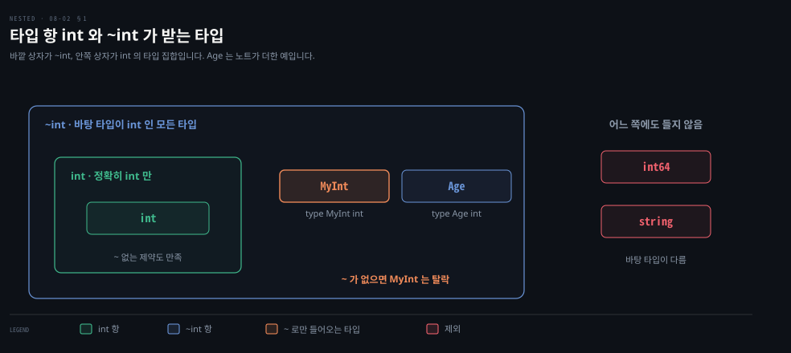

# 타입 요소는 쓸 수 있는 연산자를 정하고 ~ 는 바탕 타입까지 넓힙니다

---

> Learning Go 8장 가운데입니다. 연산자를 쓸 수 있게 하는 타입 요소와 `~`, `cmp` 패키지, 타입 추론, 타입 요소가 허락하는 상수, 지금까지를 모두 묶은 제네릭 이진 트리, 그리고 `comparable` 제약이 막지 못하는 panic 을 다룹니다.

## 핵심 요약

> 이 편이 매달린 하나의 생각은 타입 제약이 메서드뿐 아니라 연산자·상수까지 정한다는 것입니다.

`/` 나 `%` 같은 연산자를 쓰려면 인터페이스 안에 `int | int8 | …` 처럼 타입 항을 `|` 로 나열한 타입 요소를 둡니다. 나열한 모든 타입에 유효한 연산자와 상수만 쓸 수 있고, 타입 요소가 든 인터페이스는 제약으로만 쓸 수 있습니다. 타입 항은 기본으로 정확히 그 타입만 맞으므로, 바탕 타입이 같은 사용자 정의 타입까지 받으려면 `~` 를 붙입니다. 순서가 있는 타입의 제약과 비교 함수는 Go 1.21 의 `cmp` 패키지에 있습니다.

제네릭 함수 호출은 대개 타입 인자를 추론하지만 반환 타입에만 쓰인 타입 매개변수는 적어야 합니다. 비교 함수를 받는 제네릭 트리는 내장 타입에는 `cmp.Compare`, struct 에는 함수나 메서드 식을 넘겨 한 구현으로 모든 타입을 담습니다. `comparable` 제약은 slice 타입을 컴파일 시점에 막지만, slice 를 담은 인터페이스 값은 통과시켜 실행 중 panic 이 날 수 있습니다.


## 학습 목표

> 이 편을 읽고 나면 아래 다섯 가지를 스스로 해낼 수 있습니다.

1. 타입 요소로 연산자를 쓸 수 있는 제약을 만들고, 타입 요소가 든 인터페이스를 어디에 쓸 수 없는지 말할 수 있습니다.
2. `~` 가 있을 때와 없을 때 `MyInt` 가 제약을 만족하는지 판단할 수 있습니다.
3. 타입 추론이 안 되는 경우를 알아보고, 타입 요소가 어떤 상수를 허락하는지 설명할 수 있습니다.
4. 비교 함수를 받는 제네릭 트리를 쓰고, `cmp.Compare`·일반 함수·메서드 식을 넘기는 세 방식을 쓸 수 있습니다.
5. `comparable` 제약을 통과한 인터페이스 값이 실행 중 panic 을 낼 수 있는 이유를 말할 수 있습니다.


## 1. 타입 요소 — 쓸 수 있는 연산자를 타입 항으로 정합니다

> 연산자를 쓰려면 인터페이스에 타입 항을 `|` 로 나열한 타입 요소를 둡니다. 나열한 모든 타입에 유효한 연산자만 쓸 수 있고, 타입 요소가 든 인터페이스는 타입 제약으로만 쓸 수 있습니다.

제네릭으로 나타내야 할 것이 하나 더 있습니다. 연산자입니다. 05-01 의 `divAndRemainder` 는 `int` 에 잘 동작하지만, 다른 정수 타입에 쓰려면 타입 변환을 해야 합니다. 게다가 `uint` 는 `int` 로 나타내기에 너무 큰 값을 담을 수 있습니다. 제네릭 판을 쓰려면 `/` 와 `%` 를 쓸 수 있다고 지정할 방법이 필요합니다. Go 제네릭은 인터페이스 안에서 하나 이상의 **타입 항**으로 이루어진 **타입 요소**로 이것을 합니다.

```go
type Integer interface {
	int | int8 | int16 | int32 | int64 |
		uint | uint8 | uint16 | uint32 | uint64 | uintptr
}
```

07-03 §2 에서 인터페이스를 임베딩해 바깥 인터페이스의 메서드 집합에 임베딩된 인터페이스의 메서드를 넣는 것을 봤습니다. 타입 요소는 타입 매개변수에 어떤 타입을 대입할 수 있는지와 어떤 연산자를 지원하는지를 정합니다. 구체 타입들을 `|` 로 나눠 나열하고, 허락되는 연산자는 나열된 모든 타입에 유효한 것입니다. 나머지(`%`) 연산자는 정수에만 유효하므로 모든 정수 타입을 나열했습니다. `byte` 와 `rune` 은 각각 `uint8` 과 `int32` 의 타입 별칭이라 빼도 됩니다.

원문은 타입 요소가 든 인터페이스가 타입 제약으로만 유효하다고 주의를 줍니다. 변수·필드·반환 값·매개변수의 타입으로 쓰면 컴파일 오류입니다. 이 노트를 쓰면서 `var v Integer` 를 선언해 보니 `cannot use type Integer outside a type constraint: interface contains type constraints` 가 났습니다.

이제 제네릭 `divAndRemainder` 를 쓰고 내장 `uint` 타입(또는 `Integer` 에 나열한 다른 타입)으로 쓸 수 있습니다.

```go
func divAndRemainder[T Integer](num, denom T) (T, T, error) {
	if denom == 0 {
		return 0, 0, errors.New("cannot divide by zero")
	}
	return num / denom, num % denom, nil
}

func main() {
	var a uint = 18_446_744_073_709_551_615
	var b uint = 9_223_372_036_854_775_808
	fmt.Println(divAndRemainder(a, b))
}
```

원문은 출력을 적지 않았습니다. 64비트에서 돌리니 `1 9223372036854775807 <nil>` 이 찍혔습니다. `a` 는 `uint64` 최댓값 2^64−1, `b` 는 2^63 이라 몫 1, 나머지 2^63−1 입니다. 둘 다 `int` 로는 담을 수 없는 값이라 원문이 `uint` 를 드는 이유가 보입니다.

### 타입 항은 정확히 맞아야 하고 ~ 가 바탕 타입까지 넓힙니다

타입 항은 기본으로 정확히 그 타입만 맞습니다. 바탕 타입이 `Integer` 에 나열된 타입 가운데 하나인 사용자 정의 타입으로 `divAndRemainder` 를 부르면 오류가 납니다.

```go
type MyInt int
var myA MyInt = 10
var myB MyInt = 20
fmt.Println(divAndRemainder(myA, myB))
```

```bash
MyInt does not satisfy Integer (possibly missing ~ for int in Integer)
```

원문과 go1.25.1 의 메시지가 같았습니다. 오류 문구가 해법을 알려 줍니다. 그 타입을 바탕 타입으로 가진 어떤 타입에도 타입 항이 유효하게 하려면 타입 항 앞에 `~` 를 붙입니다.

```go
type Integer interface {
	~int | ~int8 | ~int16 | ~int32 | ~int64 |
		~uint | ~uint8 | ~uint16 | ~uint32 | ~uint64 | ~uintptr
}
```

`~` 를 붙인 판으로 다시 돌리니 `divAndRemainder(myA, myB)` 가 `0 10 <nil>` 을 찍었습니다. 07-02 §1 에서 `type HighScore Score` 가 바탕 타입만 같고 계층이 없다고 했는데, `~int` 는 바로 그 "바탕 타입이 `int` 인 모든 타입"을 한 번에 가리키는 표기입니다. 이 연결은 노트의 해석입니다.



### 순서 있는 타입의 제약은 cmp 패키지에 있습니다

타입 항이 생기면서 제네릭 비교 함수를 쓸 수 있는 타입을 정의할 수 있습니다.

```go
type Ordered interface {
	~int | ~int8 | ~int16 | ~int32 | ~int64 |
		~uint | ~uint8 | ~uint16 | ~uint32 | ~uint64 | ~uintptr |
		~float32 | ~float64 |
		~string
}
```

`Ordered` 인터페이스는 `==`, `!=`, `<`, `>`, `<=`, `>=` 연산자를 지원하는 타입을 모두 나열합니다. 원문은 변수가 순서 있는 타입을 나타낸다고 지정하는 방법이 워낙 쓸모 있어서 Go 1.21 이 이 `Ordered` 인터페이스를 정의한 `cmp` 패키지를 더했다고 말합니다.

이 패키지는 비교 함수 둘도 정의합니다. `Compare` 는 첫 매개변수가 둘째보다 작은지, 같은지, 큰지에 따라 −1, 0, 1 을 돌려주고, `Less` 는 첫 매개변수가 둘째보다 작으면 `true` 를 돌려줍니다. 로컬에서 `cmp.Compare(3, 5)`, `cmp.Compare(5, 5)`, `cmp.Compare(7, 5)`, `cmp.Less(3, 5)` 는 `-1 0 1 true` 였습니다. Java 의 `Comparable` 과 `compareTo` 가 음수·0·양수를 돌려주는 규약과 같은 자리입니다. 이 비교는 원문 밖입니다.

### 타입 요소와 메서드 요소를 함께 둘 수 있습니다

타입 매개변수에 쓰는 인터페이스에는 타입 요소와 메서드 요소를 함께 둘 수 있습니다. 예를 들어 바탕 타입이 `int` 이고 `String() string` 메서드를 가진 타입을 요구할 수 있습니다.

```go
type PrintableInt interface {
	~int
	String() string
}
```

원문은 Go 가 실제로는 인스턴스화할 수 없는 타입 매개변수 인터페이스를 선언하게 둔다고 주의를 줍니다. `PrintableInt` 에서 `~int` 대신 `int` 를 썼다면 만족하는 타입이 없습니다. `int` 에는 메서드가 없으니까요. 나빠 보여도 컴파일러가 구해 줍니다. 불가능한 타입 매개변수로 타입이나 함수를 선언하면 그것을 쓰려는 순간 컴파일 오류가 납니다.

```go
type ImpossiblePrintableInt interface {
	int
	String() string
}

type ImpossibleStruct[T ImpossiblePrintableInt] struct {
	val T
}

type MyInt int

func (mi MyInt) String() string {
	return fmt.Sprint(mi)
}
```

`ImpossibleStruct` 는 인스턴스화할 수 없지만 컴파일러는 이 선언들을 문제 삼지 않습니다. 하지만 `ImpossibleStruct` 를 쓰려고 하면 불평합니다.

```go
s := ImpossibleStruct[int]{10}
s2 := ImpossibleStruct[MyInt]{10}
```

```bash
# 원문 출력
int does not implement ImpossiblePrintableInt (missing String method)
MyInt does not implement ImpossiblePrintableInt (possibly missing ~ for
int in constraint ImpossiblePrintableInt)
```

```bash
# go1.25.1 에서 빌드한 출력 (2026-09-27)
int does not satisfy ImpossiblePrintableInt (missing method String)
MyInt does not satisfy ImpossiblePrintableInt (possibly missing ~ for int in ImpossiblePrintableInt)
```

지금 버전은 제약에 대해 "implement" 대신 "satisfy" 라고 적고 어순이 조금 다를 뿐 뜻은 같습니다. 원문은 타입 항이 내장 기본형뿐 아니라 slice·map·배열·채널·struct·함수일 수도 있다고 덧붙입니다. 타입 매개변수가 특정 바탕 타입과 메서드 하나 이상을 함께 가져야 할 때 가장 쓸모 있습니다.


## 2. 타입 추론과 타입 요소가 허락하는 상수

> 제네릭 함수는 대개 인자에서 타입 인자를 추론하지만, 반환 값에만 쓰인 타입 매개변수는 추론할 수 없어 모두 적어야 합니다. 타입 요소는 나열한 모든 타입에 유효한 상수만 허락합니다.

원문은 `:=` 에서 타입을 추론하듯 Go 가 제네릭 함수 호출도 타입 추론으로 간단하게 해 준다고 말합니다. 08-01 §3 의 `Map`·`Filter`·`Reduce` 호출이 그 예입니다. 하지만 타입 매개변수가 반환 값에만 쓰일 때처럼 추론이 불가능한 경우가 있고, 그때는 타입 인자를 모두 적어야 합니다. 원문은 조금 억지스러운 예를 듭니다.

```go
type Integer interface {
	int | int8 | int16 | int32 | int64 | uint | uint8 | uint16 | uint32 | uint64 | uintptr
}

func Convert[T1, T2 Integer](in T1) T2 {
	return T2(in)
}

func main() {
	var a int = 10
	b := Convert[int, int64](a) // can't infer the return type
	fmt.Println(b)
}
```

원문 PDF 는 `Integer` 줄이 `uint32 |` 에서 판면 밖으로 잘렸습니다. 위 코드는 앞 절의 목록을 따라 `uint64 | uintptr` 로 끝맺었고, 이 노트를 쓰면서 돌리니 `10` 이 찍혔습니다. `T2` 는 인자 어디에도 나오지 않으니 컴파일러가 알 방법이 없습니다. Java 에서 `Collections.<String>emptyList()` 처럼 타입 인자를 명시하는 자리와 같습니다. 이 비교는 원문 밖입니다.

### 상수도 모든 타입 항에 유효해야 합니다

타입 요소는 제네릭 타입의 변수에 어떤 상수를 대입할 수 있는지도 정합니다. 연산자처럼 상수도 타입 요소의 모든 타입 항에 유효해야 합니다. `Ordered` 에 나열된 모든 타입에 대입할 수 있는 상수는 없으므로, 그 제네릭 타입의 변수에는 상수를 대입할 수 없습니다. `Integer` 인터페이스라면 다음 코드는 컴파일되지 않습니다. 8비트 정수에 1,000 을 담을 수 없기 때문입니다.

```go
// INVALID!
func PlusOneThousand[T Integer](in T) T {
	return in + 1_000
}

// VALID
func PlusOneHundred[T Integer](in T) T {
	return in + 100
}
```

go1.25.1 은 `PlusOneThousand` 에 `cannot convert 1_000 (untyped int constant 1000) to type T` 를 냈습니다. 100 은 `int8` 의 범위 −128~127 안이라 모든 타입 항에 들어갑니다.


## 3. 제네릭 함수와 제네릭 자료구조를 묶은 트리

> 트리에 필요한 것은 두 값을 비교해 순서를 알려 주는 제네릭 함수 하나입니다. 그 함수를 받는 제네릭 트리는 `cmp.Compare`·일반 함수·메서드 식 가운데 무엇을 넘기느냐로 모든 타입을 담습니다.

원문은 08-01 §1 의 이진 트리로 돌아와 지금까지 배운 것을 모두 묶어 어떤 구체 타입에도 동작하는 트리 하나를 만듭니다. 비결은 트리에 필요한 것이 두 값을 비교해 순서를 알려 주는 제네릭 함수 하나라는 것을 깨닫는 것입니다.

```go
type OrderableFunc [T any] func(t1, t2 T) int
```

이제 트리 구현을 `Tree` 와 `Node` 두 타입으로 나눕니다.

```go
type Tree[T any] struct {
	f    OrderableFunc[T]
	root *Node[T]
}

type Node[T any] struct {
	val         T
	left, right *Node[T]
}

func NewTree[T any](f OrderableFunc[T]) *Tree[T] {
	return &Tree[T]{
		f: f,
	}
}
```

`Tree` 의 메서드는 모든 실제 일을 `Node` 에 맡기므로 아주 단순합니다.

```go
func (t *Tree[T]) Add(v T) {
	t.root = t.root.Add(t.f, v)
}

func (t *Tree[T]) Contains(v T) bool {
	return t.root.Contains(t.f, v)
}
```

`Node` 의 `Add` 와 `Contains` 는 07-01 §4 에서 본 것과 아주 비슷합니다. 다른 점은 원소의 순서를 정하는 함수를 넘겨받는다는 것뿐입니다.

```go
func (n *Node[T]) Add(f OrderableFunc[T], v T) *Node[T] {
	if n == nil {
		return &Node[T]{val: v}
	}
	switch r := f(v, n.val); {
	case r <= -1:
		n.left = n.left.Add(f, v)
	case r >= 1:
		n.right = n.right.Add(f, v)
	}
	return n
}

func (n *Node[T]) Contains(f OrderableFunc[T], v T) bool {
	if n == nil {
		return false
	}
	switch r := f(v, n.val); {
	case r <= -1:
		return n.left.Contains(f, v)
	case r >= 1:
		return n.right.Contains(f, v)
	}
	return true
}
```

07-01 의 `IntTree` 처럼 `nil` 리시버를 받는 포인터 리시버 메서드가 트리를 단순하게 합니다. 이 연결은 노트의 해석입니다.

### 내장 타입에는 cmp.Compare 를 넘깁니다

이제 순서 함수가 필요합니다. 원문은 이미 본 것 하나가 맞는다고 말합니다. `cmp` 패키지의 `Compare` 입니다.

> **원문 정오**: 원문은 이 자리를 "Now you need a function that matches the OrderedFunc definition" 으로 적었습니다. 바로 위에서 선언한 타입 이름은 `OrderableFunc` 이고, 16장 PDF 전체에서 `OrderedFunc` 는 이 한 곳에만 나왔습니다.

```go
t1 := NewTree(cmp.Compare[int])
t1.Add(10)
t1.Add(30)
t1.Add(15)
fmt.Println(t1.Contains(15))
fmt.Println(t1.Contains(40))
```

로컬에서 `true` 와 `false` 가 찍혔습니다. `cmp.Compare` 자체가 제네릭 함수라 `cmp.Compare[int]` 로 타입 인자를 적어 인스턴스화한 뒤 넘깁니다.

### struct 에는 함수나 메서드 식을 넘깁니다

struct 에는 선택지가 둘 있습니다. 함수를 쓸 수 있습니다.

```go
type Person struct {
	Name string
	Age  int
}

func OrderPeople(p1, p2 Person) int {
	out := cmp.Compare(p1.Name, p2.Name)
	if out == 0 {
		out = cmp.Compare(p1.Age, p2.Age)
	}
	return out
}

t2 := NewTree(OrderPeople)
t2.Add(Person{"Bob", 30})
t2.Add(Person{"Maria", 35})
t2.Add(Person{"Bob", 50})
fmt.Println(t2.Contains(Person{"Bob", 30}))
fmt.Println(t2.Contains(Person{"Fred", 25}))
```

함수 대신 메서드를 `NewTree` 에 넘길 수도 있습니다. 07-01 §5 에서 메서드 식으로 메서드를 함수처럼 다룰 수 있다고 했습니다.

```go
func (p Person) Order(other Person) int {
	out := cmp.Compare(p.Name, other.Name)
	if out == 0 {
		out = cmp.Compare(p.Age, other.Age)
	}
	return out
}

t3 := NewTree(Person.Order)
t3.Add(Person{"Bob", 30})
t3.Add(Person{"Maria", 35})
t3.Add(Person{"Bob", 50})
fmt.Println(t3.Contains(Person{"Bob", 30}))
fmt.Println(t3.Contains(Person{"Fred", 25}))
```

두 방식 모두 로컬에서 `true` 와 `false` 였습니다. `Person.Order` 의 타입은 `func(Person, Person) int` 라서 `OrderableFunc[Person]` 에 그대로 맞습니다. Java 의 `TreeMap` 생성자에 `Comparator.comparing(Person::getName).thenComparing(Person::getAge)` 를 넘기는 것과 같은 설계입니다. 이 비교는 원문 밖입니다.


## 4. comparable 을 통과한 인터페이스 값도 panic 을 냅니다

> `comparable` 제약은 slice 타입을 컴파일 시점에 막습니다. 하지만 인터페이스 타입은 비교 가능하다고 보고 통과시키므로, 비교할 수 없는 값을 담은 인터페이스를 넘기면 실행 중 panic 이 납니다.

07-03 §5 에서 인터페이스가 비교 가능한 타입이라 `==` 와 `!=` 를 조심해야 한다고 했습니다. 인터페이스의 바탕 타입이 비교 불가능하면 실행 중 panic 이 납니다. 원문은 `comparable` 인터페이스를 제네릭에 써도 이 구덩이가 그대로 있다고 말합니다.

```go
type Thinger interface {
	Thing()
}

type ThingerInt int

func (t ThingerInt) Thing() {
	fmt.Println("ThingInt:", t)
}

type ThingerSlice []int

func (t ThingerSlice) Thing() {
	fmt.Println("ThingSlice:", t)
}

func Comparer[T comparable](t1, t2 T) {
	if t1 == t2 {
		fmt.Println("equal!")
	}
}
```

`int` 나 `ThingerInt` 변수로 이 함수를 부르는 것은 적법합니다.

```go
var a int = 10
var b int = 10
Comparer(a, b) // prints true

var a2 ThingerInt = 20
var b2 ThingerInt = 20
Comparer(a2, b2) // prints true
```

> **원문 정오**: 원문은 `Comparer` 호출 셋에 `// prints true` 라는 주석을 달았습니다. 위에 정의한 `Comparer` 는 두 값이 같을 때 `equal!` 을 찍고 `true` 는 찍지 않습니다. 이 노트를 쓰면서 돌리니 세 호출 모두 `equal!` 이 찍혔습니다. 주석의 뜻은 "같다고 판정된다"로 읽으면 됩니다.

컴파일러는 `ThingerSlice`(또는 `[]int`) 변수로 이 함수를 부르지 못하게 합니다.

```go
var a3 ThingerSlice = []int{1, 2, 3}
var b3 ThingerSlice = []int{1, 2, 3}
Comparer(a3, b3) // compile fails: "ThingerSlice does not satisfy comparable"
```

원문 PDF 는 이 주석이 `comparab` 에서 판면 밖으로 잘렸습니다. go1.25.1 의 메시지가 `ThingerSlice does not satisfy comparable` 이라 위처럼 채웠습니다.

하지만 `Thinger` 타입 변수로 부르는 것은 완전히 적법합니다. `ThingerInt` 를 담으면 컴파일되고 기대대로 동작합니다.

```go
var a4 Thinger = a2
var b4 Thinger = b2
Comparer(a4, b4) // prints true
```

그런데 `ThingerSlice` 도 `Thinger` 타입 변수에 대입할 수 있습니다. 여기서 문제가 생깁니다.

```go
a4 = a3
b4 = b3
Comparer(a4, b4) // compiles, panics at runtime
```

컴파일러는 막지 않지만, 실행하면 `panic: runtime error: comparing uncomparable type main.ThingerSlice` 로 멈춥니다. 원문과 로컬 메시지가 같았습니다. 원문은 비교 가능한 타입과 제네릭이 어떻게 맞물리는지, 왜 이렇게 설계했는지 궁금하면 Go 팀 Robert Griesemer 의 블로그 글 "All Your Comparable Types" 를 읽으라고 권합니다.


## 핵심 개념 체크리스트

목표 번호 순서대로 짝지었습니다.

- [ ] (목표 1) `Integer` 인터페이스로 `var v Integer` 를 선언할 수 없는 이유를 말할 수 있습니까?
- [ ] (목표 1) `%` 를 쓰는 제약에 `float64` 를 넣을 수 없는 이유를 말할 수 있습니까?
- [ ] (목표 2) `MyInt` 가 `int` 항은 만족하지 못하고 `~int` 항은 만족하는 이유를 설명할 수 있습니까?
- [ ] (목표 3) `Convert[int, int64](a)` 에서 타입 인자를 적어야 하는 이유를 말할 수 있습니까?
- [ ] (목표 3) `PlusOneThousand` 가 컴파일되지 않는 이유를 `int8` 로 설명할 수 있습니까?
- [ ] (목표 4) `NewTree(Person.Order)` 가 동작하는 이유를 메서드 식의 타입으로 말할 수 있습니까?
- [ ] (목표 5) `Comparer(a4, b4)` 가 `ThingerSlice` 를 담았을 때 컴파일은 되고 실행 중 panic 이 나는 이유를 말할 수 있습니까?


## 관련 문서

- [08-01 제네릭은 타입 매개변수로 한 번 쓰고 컴파일 시점에 타입을 검사합니다](./08-01.%EC%A0%9C%EB%84%A4%EB%A6%AD%EC%9D%80%20%ED%83%80%EC%9E%85%20%EB%A7%A4%EA%B0%9C%EB%B3%80%EC%88%98%EB%A1%9C%20%ED%95%9C%20%EB%B2%88%20%EC%93%B0%EA%B3%A0%20%EC%BB%B4%ED%8C%8C%EC%9D%BC%20%EC%8B%9C%EC%A0%90%EC%97%90%20%ED%83%80%EC%9E%85%EC%9D%84%20%EA%B2%80%EC%82%AC%ED%95%A9%EB%8B%88%EB%8B%A4.md) — 8장 앞. 타입 매개변수
- [08-03 Go 제네릭은 일부러 작게 만들었고 성능을 위해 바꿀 도구가 아닙니다](./08-03.Go%20%EC%A0%9C%EB%84%A4%EB%A6%AD%EC%9D%80%20%EC%9D%BC%EB%B6%80%EB%9F%AC%20%EC%9E%91%EA%B2%8C%20%EB%A7%8C%EB%93%A4%EC%97%88%EA%B3%A0%20%EC%84%B1%EB%8A%A5%EC%9D%84%20%EC%9C%84%ED%95%B4%20%EB%B0%94%EA%BF%80%20%EB%8F%84%EA%B5%AC%EA%B0%80%20%EC%95%84%EB%8B%99%EB%8B%88%EB%8B%A4.md) — 8장 끝. 빠진 기능과 관용
- [07-01 메서드는 리시버로 타입에 붙고 포인터 리시버만 원본을 바꿉니다](./07-01.%EB%A9%94%EC%84%9C%EB%93%9C%EB%8A%94%20%EB%A6%AC%EC%8B%9C%EB%B2%84%EB%A1%9C%20%ED%83%80%EC%9E%85%EC%97%90%20%EB%B6%99%EA%B3%A0%20%ED%8F%AC%EC%9D%B8%ED%84%B0%20%EB%A6%AC%EC%8B%9C%EB%B2%84%EB%A7%8C%20%EC%9B%90%EB%B3%B8%EC%9D%84%20%EB%B0%94%EA%BF%89%EB%8B%88%EB%8B%A4.md) — 7장. IntTree 와 메서드 식
- [Learning Go 2판 — 정독 인덱스](./README.md) — 16장 전체 지도


## 참고 자료

- 원본: 《Learning Go, 2nd Edition》 (Jon Bodner, O'Reilly)
- 다룬 범위: Chapter 8 "Use Type Terms to Specify Operators" 부터 "More on comparable" 까지
