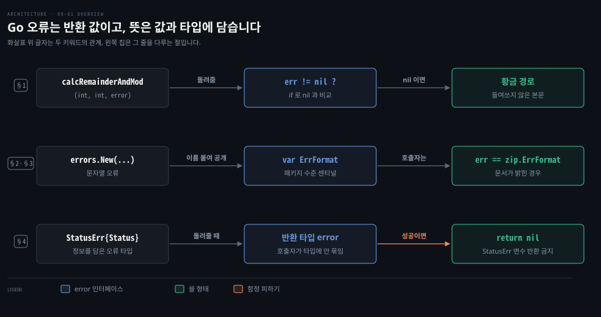
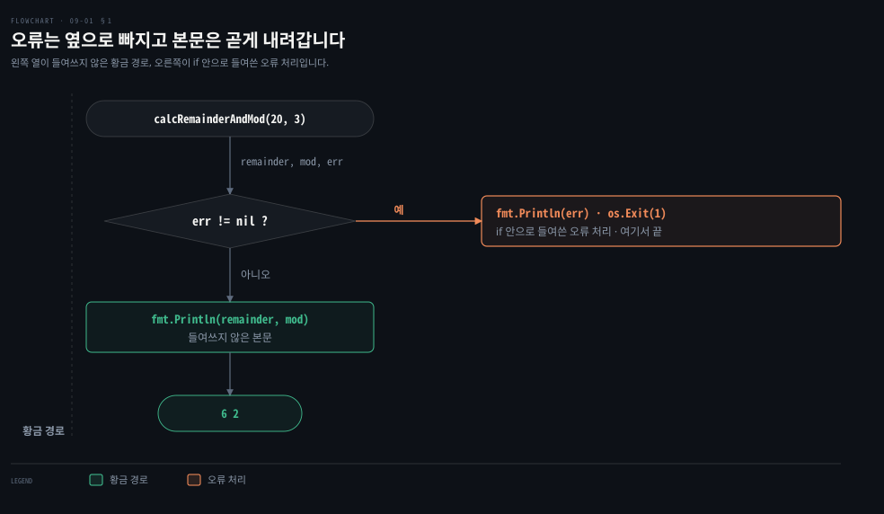
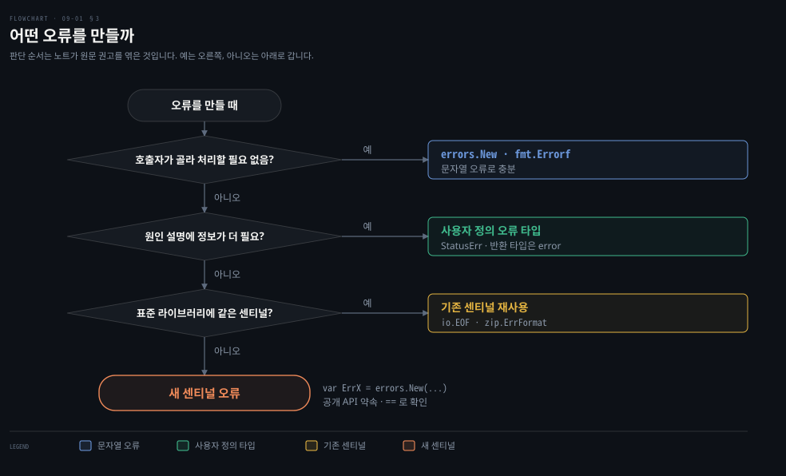
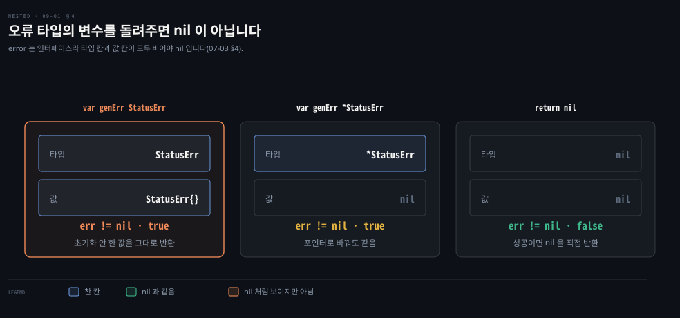

# Go 오류는 마지막 반환 값이고 센티널과 사용자 정의 타입으로 뜻을 담습니다

---

> Learning Go 9장 앞 부분입니다. 예외 대신 오류를 반환 값으로 돌려주는 Go 의 기본, 문자열로 만드는 단순한 오류, 처리를 멈추라는 신호인 센티널 오류, 그리고 추가 정보를 담는 사용자 정의 오류 타입과 그 함정을 다룹니다.

## 핵심 요약

> 이 편이 매달린 하나의 생각은 Go 에서 오류가 특별한 제어 흐름이 아니라 함수가 돌려주는 평범한 값이라는 것입니다.

Go 함수는 마지막 반환 값으로 `error` 를 돌려주고, 호출자는 `if err != nil` 로 확인합니다. `error` 는 `Error() string` 하나를 가진 내장 인터페이스라서 이것을 구현하면 무엇이든 오류입니다. 원문은 예외를 쓰지 않는 이유로 예외가 보이지 않는 코드 경로를 더한다는 점과, 반환 값으로 두면 컴파일러가 오류를 확인하거나 `_` 로 명시적으로 버리게 만든다는 점을 듭니다.

단순한 오류는 `errors.New` 나 `fmt.Errorf` 로 만듭니다. 더 처리할 수 없는 상태를 알리는 오류는 패키지 수준 변수인 센티널 오류로 두고 `==` 로 확인합니다. 상태 코드 같은 정보를 담으려면 사용자 정의 오류 타입을 만들되, 반환 타입은 늘 `error` 로 둡니다. 사용자 정의 오류 타입의 변수를 그대로 돌려주면 값이 비어 있어도 `nil` 이 아닌 오류가 되니, 성공이면 `nil` 을 직접 돌려줍니다.


## 학습 목표

> 이 편을 읽고 나면 아래 다섯 가지를 스스로 해낼 수 있습니다.

1. 오류를 마지막 반환 값으로 돌려주고 확인하는 코드를 쓰고, 오류 메시지의 관례를 말할 수 있습니다.
2. Go 가 예외 대신 반환 값을 쓰는 원문의 두 이유를 설명할 수 있습니다.
3. 센티널 오류를 언제 정의하고 어떻게 확인하는지, 상수 센티널이 관용적이지 않은 이유를 말할 수 있습니다.
4. 추가 정보를 담는 사용자 정의 오류 타입을 쓰고, 반환 타입을 `error` 로 두는 이유를 말할 수 있습니다.
5. 사용자 정의 오류 타입 변수를 돌려주면 `nil` 이 아닌 오류가 되는 이유를 07-03 의 인터페이스 구조로 설명할 수 있습니다.

아래는 이 편의 키워드를 이은 개념도입니다. 첫 줄은 함수가 마지막 반환 값으로 `error` 를 돌려주는 흐름입니다. 호출자는 `nil` 과 비교해 오류가 없으면 황금 경로로 이어갑니다. 둘째 줄은 `errors.New` 로 만든 오류에 이름을 붙여 센티널로 공개하면 호출자가 `==` 로 확인한다는 것입니다. 셋째 줄은 사용자 정의 오류 타입도 반환 타입은 `error` 로 두고, 성공이면 `nil` 을 직접 돌려준다는 것입니다. 왼쪽 칩이 그 줄을 다루는 절입니다.




## 1. 오류 처리의 기본 — 마지막 반환 값으로 돌려주고 nil 과 비교합니다

> Go 는 오류를 함수의 마지막 반환 값인 `error` 로 돌려주고, 호출자는 `if` 문에서 `nil` 과 비교해 처리합니다. 예외처럼 숨은 경로가 없고, 컴파일러가 오류를 확인하거나 명시적으로 버리게 합니다.

원문은 오류 처리가 다른 언어에서 Go 로 옮겨 오는 개발자에게 가장 큰 어려움 가운데 하나라고 말합니다. 예외에 익숙하면 Go 의 방식이 시대에 뒤떨어져 보입니다. 하지만 그 밑에는 탄탄한 소프트웨어 공학 원칙이 있다는 것이 원문의 주장입니다. Spring 의 `@ExceptionHandler` 나 `@ControllerAdvice` 로 예외를 한 곳에 모으던 개발자에게는 가장 낯선 장입니다. 이 대비는 원문 밖입니다.

05-01 §4 에서 짧게 봤듯 Go 는 함수의 마지막 반환 값으로 `error` 타입 값을 돌려 오류를 다룹니다. 이것은 전적으로 관례지만, 원문은 결코 어겨서는 안 될 만큼 강한 관례라고 말합니다. 함수가 기대대로 실행되면 오류 매개변수에 `nil` 을 돌려줍니다. 문제가 생기면 오류 값을 돌려줍니다. 호출하는 함수는 반환된 오류를 `nil` 과 비교해 확인한 뒤 처리하거나 자기 오류를 돌려줍니다.

```go
func calcRemainderAndMod(numerator, denominator int) (int, int, error) {
	if denominator == 0 {
		return 0, 0, errors.New("denominator is 0")
	}
	return numerator / denominator, numerator % denominator, nil
}
```

새 오류는 `errors` 패키지의 `New` 함수에 문자열을 넘겨 만듭니다. 오류 메시지는 대문자로 시작하지 않고 문장 부호나 줄바꿈으로 끝나지 않아야 합니다. 대부분의 경우 `nil` 이 아닌 오류를 돌려줄 때 다른 반환 값은 제로 값으로 둡니다. 원문은 이 규칙의 예외를 센티널 오류에서 본다고 예고합니다.

예외가 있는 언어와 달리 Go 에는 오류가 돌아왔는지 알아내는 특별한 구문이 없습니다. 함수가 오류를 돌려주면 `if` 문으로 오류 변수가 `nil` 이 아닌지 봅니다.

```go
func main() {
	numerator := 20
	denominator := 3
	remainder, mod, err := calcRemainderAndMod(numerator, denominator)
	if err != nil {
		fmt.Println(err)
		os.Exit(1)
	}
	fmt.Println(remainder, mod)
}
```

로컬에서 `6 2` 가 찍혔습니다. `error` 는 메서드 하나를 정의한 내장 인터페이스입니다.

```go
type error interface {
	Error() string
}
```

이 인터페이스를 구현하면 무엇이든 오류로 여겨집니다. 오류가 없음을 알리려고 `nil` 을 돌려주는 것은 `nil` 이 모든 인터페이스 타입의 제로 값이기 때문입니다(07-03 §4).

### 예외 대신 반환 값을 쓰는 두 이유

원문이 드는 첫째 이유는 예외가 코드에 적어도 하나의 새 코드 경로를 더한다는 것입니다. 이 경로는 때로 분명하지 않습니다. 특히 함수 선언에 예외가 날 수 있다는 표시가 없는 언어에서 그렇습니다. 그래서 예외를 제대로 처리하지 않으면 뜻밖의 방식으로 죽는 코드가 되거나, 더 나쁘게는 죽지는 않지만 데이터가 제대로 초기화·수정·저장되지 않은 코드가 됩니다. Java 에서 `RuntimeException` 은 `throws` 선언 없이 어디서든 날아오는 바로 그런 경로입니다. 이 연결은 원문 밖입니다.

둘째 이유는 더 미묘하지만 Go 의 기능들이 어떻게 맞물리는지 보여 줍니다. Go 컴파일러는 모든 변수를 읽도록 요구합니다(02-02 §4). 오류를 반환 값으로 두면 개발자는 오류 조건을 확인해 처리하거나, 반환된 오류 자리에 밑줄 `_` 을 써서 무시한다는 것을 명시해야 합니다. 원문은 예외 처리가 코드를 짧게 할 수는 있어도 줄이 적다고 이해하거나 유지하기 쉬운 것은 아니라며, 줄이 더 들더라도 분명한 코드를 쓰는 것이 Go 답다고 말합니다.

Go 코드의 흐름도 눈여겨볼 만합니다. 오류 처리는 `if` 문 안으로 들여쓰고 비즈니스 로직은 들여쓰지 않습니다. 그래서 어느 코드가 "황금 경로"에 있고 어느 코드가 예외 상황인지 눈으로 바로 구별됩니다. 앞의 `main` 으로 그리면 아래와 같습니다.



### 원문 NOTE 의 「둘째 상황」

원문의 NOTE 는 "The second situation is a reused err variable" 로 시작합니다.

Go 컴파일러는 모든 변수를 적어도 한 번 읽기를 요구할 뿐, 변수에 쓴 값마다 읽기를 요구하지는 않습니다. 그래서 `err` 변수를 여러 번 쓰면 한 번만 읽어도 컴파일러가 만족합니다. 앞선 오류를 확인하지 않고 덮어써도 컴파일러가 잡지 못한다는 뜻으로 읽힙니다(노트의 풀이). 원문은 이것을 잡는 방법을 「staticcheck」에서 보인다고 합니다.

이 NOTE 가 "둘째 상황"이라고 하는데, 이 노트가 본 9장 PDF 판면에는 "첫째 상황"이 없습니다. 첫째 후보로는 02-02 §4 에서 본, 쓰지 않는 변수 검사가 놓치는 다른 경우인 패키지 수준 변수가 더 그럴듯합니다. 바로 앞 문단의 `_` 는 컴파일러가 놓치는 경우가 아니라 명시적으로 버리는 경우라서 짝이 덜 맞습니다. 어느 쪽이든 원문에서 떨어져 나온 문장으로 보이며, 이 판단은 노트의 해석입니다.


## 2. 문자열로 만드는 단순한 오류

> 표준 라이브러리는 문자열로 오류를 만드는 방법 둘을 줍니다. `errors.New` 는 문자열을 그대로, `fmt.Errorf` 는 `Printf` 서식 문자로 실행 시점 정보를 넣은 문자열을 오류로 만듭니다.

오류를 돌려주려면 먼저 `error` 값이 있어야 합니다. 무엇이 잘못됐는지 적은 문자열 하나로 충분하다면, 그 값은 어떻게 만들까요? 표준 라이브러리는 방법을 둘 줍니다. 첫째는 `errors.New` 함수입니다. 문자열을 받아 `error` 를 돌려주고, 돌려받은 오류 인스턴스의 `Error` 메서드를 부르면 그 문자열이 나옵니다. 오류를 `fmt.Println` 에 넘기면 `Error` 메서드가 자동으로 불립니다.

```go
func doubleEven(i int) (int, error) {
	if i % 2 != 0 {
		return 0, errors.New("only even numbers are processed")
	}
	return i * 2, nil
}

func main() {
	result, err := doubleEven(1)
	if err != nil {
		fmt.Println(err) // prints "only even numbers are processed"
	}
	fmt.Println(result)
}
```

둘째는 `fmt.Errorf` 함수입니다. `fmt.Printf` 의 서식 문자로 오류 문자열을 만들어 실행 시점 정보를 넣을 수 있습니다. `errors.New` 처럼 돌려받은 오류의 `Error` 메서드를 부르면 이 문자열이 나옵니다.

```go
func doubleEven(i int) (int, error) {
	if i % 2 != 0 {
		return 0, fmt.Errorf("%d isn't an even number", i)
	}
	return i * 2, nil
}
```

로컬에서 `doubleEven(1)` 의 오류는 `1 isn't an even number` 였습니다. `%w` 서식 문자로 다른 오류를 감싸는 쓰임은 09-02 §1 에서 다룹니다.


## 3. 센티널 오류 — 더 처리할 수 없는 상태를 알리는 약속된 값

> 센티널 오류는 처리를 시작하거나 계속할 수 없는 상태를 알리려고 패키지 수준에 선언한 오류 값입니다. 공개 API 의 일부가 되므로 신중히 정의하고, 문서가 센티널을 돌려준다고 밝힌 함수에는 `==` 로 확인합니다.

어떤 오류는 현재 상태의 문제로 처리를 이어 갈 수 없다는 신호입니다. Go 커뮤니티에서 오래 활동한 Dave Cheney 는 블로그 글 "Don't Just Check Errors, Handle Them Gracefully" 에서 이것을 **센티널 오류**라고 불렀습니다.

> "The name descends from the practice in computer programming of using a specific value to signify that no further processing is possible. So too with Go, we use specific values to signify an error."

더 처리할 수 없음을 특정 값으로 나타내던 프로그래밍 관행에서 온 이름이고, Go 에서도 특정 값으로 오류를 나타낸다는 뜻입니다.

센티널 오류는 패키지 수준에서 선언하는 몇 안 되는 변수입니다. 관례상 이름은 `Err` 로 시작하며 눈에 띄는 예외는 `io.EOF` 입니다. 읽기 전용으로 다뤄야 합니다. Go 컴파일러가 이를 강제할 방법은 없지만 값을 바꾸는 것은 프로그래밍 오류입니다.

표준 라이브러리의 ZIP 파일 처리 패키지 `archive/zip` 은 여러 센티널 오류를 정의하는데 그 가운데 `ErrFormat` 은 ZIP 파일이 아닌 데이터가 들어오면 돌아옵니다.

```go
func main() {
	data := []byte("This is not a zip file")
	notAZipFile := bytes.NewReader(data)
	_, err := zip.NewReader(notAZipFile, int64(len(data)))
	if err == zip.ErrFormat {
		fmt.Println("Told you so")
	}
}
```

로컬에서 `err == zip.ErrFormat` 이 `true` 였고, 오류 문자열은 `zip: not a valid zip file` 이었습니다. 원문은 표준 라이브러리의 다른 예로 `crypto/rsa` 패키지의 `rsa.ErrMessageTooLong` 을 듭니다. 메시지가 주어진 공개 키로 암호화하기에 너무 길다는 뜻입니다. 센티널 오류 `context.Canceled` 는 14장에서 다룹니다.

### 센티널 오류는 공개 API 에 대한 약속입니다

원문은 센티널 오류를 정의하기 전에 정말 필요한지 확인하라고 말합니다. 정의하는 순간 공개 API 의 일부가 되고, 앞으로 하위 호환되는 모든 릴리스에서 그것을 제공하겠다고 약속한 셈입니다. 표준 라이브러리의 기존 센티널을 재사용하거나, 오류가 난 조건에 대한 정보를 담은 오류 타입을 정의하는 편이 훨씬 낫습니다(§4). 하지만 더 처리할 수 없는 특정 상태에 이르렀고 그 상태를 설명할 추가 정보가 필요 없다면 센티널 오류가 맞는 선택입니다.

센티널 오류는 어떻게 확인할까요? 앞의 예처럼, 문서가 센티널 오류를 돌려준다고 명시한 함수를 불렀을 때는 `==` 로 그 오류가 돌아왔는지 확인합니다. 다른 상황에서 센티널을 확인하는 법은 09-02 §3 의 `errors.Is` 에서 다룹니다.



### 상수 센티널은 관용적이지 않습니다

원문의 글상자는 Dave Cheney 가 "Constant Errors" 에서 상수가 쓸모 있는 센티널이 될 것이라고 제안한 방식을 소개합니다. 패키지에 이런 타입을 둡니다. 패키지 만들기는 10장에서 다룹니다.

```go
package consterr

type Sentinel string

func(s Sentinel) Error() string {
	return string(s)
}
```

그리고 이렇게 씁니다.

```go
package mypkg

const (
	ErrFoo = consterr.Sentinel("foo error")
	ErrBar = consterr.Sentinel("bar error")
)
```

함수 호출처럼 보이지만 실제로는 문자열 리터럴을 `error` 인터페이스를 구현한 타입으로 변환하는 것입니다. `ErrFoo` 와 `ErrBar` 의 값은 바꿀 수 없습니다. 처음 보기엔 좋은 해법 같습니다.

하지만 원문은 이것이 관용적이지 않다고 말합니다. 같은 타입으로 여러 패키지에서 상수 오류를 만들면, 오류 문자열이 같은 두 오류가 같다고 판정됩니다. 같은 값의 문자열 리터럴과도 같아집니다.

반면 `errors.New` 로 만든 오류는 자기 자신이나 그 값을 명시적으로 대입받은 변수와만 같습니다. 서로 다른 패키지의 오류가 같아지기를 바랄 리는 거의 없습니다. 그렇다면 왜 다른 오류를 둘 선언했겠느냐고 원문은 묻습니다. 패키지마다 공개하지 않는 오류 타입을 만들어 피할 수는 있지만 반복 코드가 많아집니다.

이 노트를 쓰면서 문자열이 같은 `Sentinel` 상수 둘을 만들어 비교하니 `true` 였고, `ErrFoo == "foo error"` 도 `true` 였습니다.

원문은 센티널 오류 패턴이 Go 설계 철학의 또 다른 예라고 말합니다. 센티널 오류는 드물어야 하니 언어 규칙이 아니라 관례로 다룰 수 있습니다. 공개 패키지 수준 변수라 바꿀 수는 있지만, 누가 실수로 패키지의 공개 변수를 다시 대입할 가능성은 아주 낮습니다. 다른 기능과 패턴이 처리하는 구석 사례라는 것입니다. 원문은 기능을 더하기보다 언어를 단순하게 두고 개발자와 도구를 믿는 것이 낫다는 것이 Go 의 철학이라고 정리합니다.


## 4. 오류는 값입니다 — 사용자 정의 오류 타입

> `error` 는 인터페이스라서 상태 코드 같은 정보를 담은 사용자 정의 오류를 만들 수 있습니다. 반환 타입은 늘 `error` 로 두고, 사용자 정의 오류 타입의 변수를 그대로 돌려주지 않습니다.

지금까지 본 오류는 모두 문자열이었습니다. `error` 는 인터페이스라서 로깅이나 오류 처리를 위한 정보를 더 담은 오류를 직접 정의할 수 있습니다. 예를 들어 사용자에게 어떤 종류의 오류로 알릴지 나타내는 상태 코드를 오류에 담을 수 있습니다. 그러면 오류 원인을 가리려고 문구가 바뀔 수 있는 문자열을 비교하지 않아도 됩니다. 원문은 먼저 상태 코드를 나타낼 열거형을 정의합니다(07-02 §2 의 `iota`).

```go
type Status int

const (
	InvalidLogin Status = iota + 1
	NotFound
)

type StatusErr struct {
	Status  Status
	Message string
}

func (se StatusErr) Error() string {
	return se.Message
}
```

이제 `StatusErr` 로 무엇이 잘못됐는지 더 자세히 알릴 수 있습니다.

```go
func LoginAndGetData(uid, pwd, file string) ([]byte, error) {
	token, err := login(uid, pwd)
	if err != nil {
		return nil, StatusErr{
			Status:  InvalidLogin,
			Message: fmt.Sprintf("invalid credentials for user %s", uid),
		}
	}
	data, err := getData(token, file)
	if err != nil {
		return nil, StatusErr{
			Status:  NotFound,
			Message: fmt.Sprintf("file %s not found", file),
		}
	}
	return data, nil
}
```

원문은 사용자 정의 오류 타입을 정의하더라도 오류 결과의 반환 타입은 늘 `error` 로 쓰라고 말합니다. 그래야 함수가 여러 타입의 오류를 돌려줄 수 있고, 호출자가 특정 오류 타입에 기대지 않을 수 있습니다. 07-03 §3 의 "인터페이스를 받고 struct 를 돌려주라"는 관례에서 `error` 가 예외라고 했던 바로 그 자리입니다.

### 사용자 정의 오류 타입 변수를 그대로 돌려주면 nil 이 아닙니다

원문은 사용자 정의 오류 타입을 쓴다면 초기화하지 않은 인스턴스를 돌려주지 말라고 경고합니다.

```go
func GenerateErrorBroken(flag bool) error {
	var genErr StatusErr
	if flag {
		genErr = StatusErr{
			Status: NotFound,
		}
	}
	return genErr
}

func main() {
	err := GenerateErrorBroken(true)
	fmt.Println("GenerateErrorBroken(true) returns non-nil error:", err != nil)
	err = GenerateErrorBroken(false)
	fmt.Println("GenerateErrorBroken(false) returns non-nil error:", err != nil)
}
```

원문 PDF 는 두 `Println` 줄 끝이 판면에서 잘려 `err !=` 에서 끊깁니다. 위 코드는 원문의 출력과 맞게 `err != nil` 로 채웠습니다. 원문이 적은 출력은 `true` 두 줄이고, 로컬에서도 두 줄 모두 `true` 로 끝났습니다.

원문은 이것이 포인터 타입 대 값 타입의 문제가 아니라고 말합니다. `genErr` 를 `*StatusErr` 로 선언해도 같은 결과가 나옵니다. 이 노트를 쓰면서 포인터 판으로 바꾸고 `false` 를 넘겨도 `true` 였습니다. `err` 가 `nil` 이 아닌 이유는 `error` 가 인터페이스이기 때문입니다. 07-03 §4 에서 본 대로 인터페이스가 `nil` 이려면 바탕 타입과 바탕 값이 모두 `nil` 이어야 합니다. `genErr` 가 포인터든 아니든 인터페이스의 타입 부분은 `nil` 이 아닙니다.



고치는 방법은 둘입니다. 가장 흔한 방법은 함수가 성공하면 오류 값으로 `nil` 을 명시적으로 돌려주는 것입니다. `return` 문의 오류 변수가 제대로 정의되었는지 코드를 읽어 확인할 필요가 없다는 장점이 있습니다.

```go
func GenerateErrorOKReturnNil(flag bool) error {
	if flag {
		return StatusErr{
			Status: NotFound,
		}
	}
	return nil
}
```

다른 방법은 오류를 담는 지역 변수를 `error` 타입으로 두는 것입니다.

```go
func GenerateErrorUseErrorVar(flag bool) error {
	var genErr error
	if flag {
		genErr = StatusErr{
			Status: NotFound,
		}
	}
	return genErr
}
```

원문의 경고는 사용자 정의 오류를 쓸 때 변수를 그 사용자 정의 오류 타입으로 정의하지 말라는 것입니다. 오류가 없으면 `nil` 을 명시적으로 돌려주거나 변수를 `error` 타입으로 정의합니다.

원문은 07-04 §2 에서 말한 대로 사용자 정의 오류의 필드와 메서드에 접근하려고 타입 단언이나 타입 스위치를 쓰지 말고 `errors.As` 를 쓰라고 덧붙이며 09-02 §3 으로 넘어갑니다.


## 핵심 개념 체크리스트

목표 번호 순서대로 짝지었습니다.

- [ ] (목표 1) 오류 메시지를 `"Denominator is 0."` 로 쓰면 어떤 관례 둘을 어깁니까?
- [ ] (목표 2) 오류를 반환 값으로 두면 컴파일러가 개발자에게 무엇을 강제하는지 말할 수 있습니까?
- [ ] (목표 3) 센티널 오류를 정의하는 것이 공개 API 에 대한 약속이 되는 이유를 말할 수 있습니까?
- [ ] (목표 3) 같은 `Sentinel` 타입의 상수 오류가 패키지를 건너 같아지는 이유를 설명할 수 있습니까?
- [ ] (목표 4) `LoginAndGetData` 의 반환 타입을 `StatusErr` 가 아니라 `error` 로 두는 이유를 말할 수 있습니까?
- [ ] (목표 5) `GenerateErrorBroken(false)` 가 `nil` 이 아닌 오류를 돌려주는 이유를 두 칸 구조로 설명할 수 있습니까?


## 관련 문서

- [09-02 오류를 감싸면 트리가 되고 errors.Is 와 As 가 그 안을 찾습니다](./09-02.%EC%98%A4%EB%A5%98%EB%A5%BC%20%EA%B0%90%EC%8B%B8%EB%A9%B4%20%ED%8A%B8%EB%A6%AC%EA%B0%80%20%EB%90%98%EA%B3%A0%20errors.Is%20%EC%99%80%20As%20%EA%B0%80%20%EA%B7%B8%20%EC%95%88%EC%9D%84%20%EC%B0%BE%EC%8A%B5%EB%8B%88%EB%8B%A4.md) — 9장 가운데. 감싸기와 Is·As
- [07-03 인터페이스는 암묵적으로 만족되고 nil 은 타입과 값이 모두 비어야 합니다](./07-03.%EC%9D%B8%ED%84%B0%ED%8E%98%EC%9D%B4%EC%8A%A4%EB%8A%94%20%EC%95%94%EB%AC%B5%EC%A0%81%EC%9C%BC%EB%A1%9C%20%EB%A7%8C%EC%A1%B1%EB%90%98%EA%B3%A0%20nil%20%EC%9D%80%20%ED%83%80%EC%9E%85%EA%B3%BC%20%EA%B0%92%EC%9D%B4%20%EB%AA%A8%EB%91%90%20%EB%B9%84%EC%96%B4%EC%95%BC%20%ED%95%A9%EB%8B%88%EB%8B%A4.md) — 7장. 인터페이스와 nil
- [05-01 Go 함수는 여러 값을 돌려주고 오류는 마지막 값입니다](./05-01.Go%20%ED%95%A8%EC%88%98%EB%8A%94%20%EC%97%AC%EB%9F%AC%20%EA%B0%92%EC%9D%84%20%EB%8F%8C%EB%A0%A4%EC%A3%BC%EA%B3%A0%20%EC%98%A4%EB%A5%98%EB%8A%94%20%EB%A7%88%EC%A7%80%EB%A7%89%20%EA%B0%92%EC%9E%85%EB%8B%88%EB%8B%A4.md) — 5장. 여러 값 반환
- [Learning Go 2판 — 정독 인덱스](./README.md) — 16장 전체 지도


## 참고 자료

- 원본: 《Learning Go, 2nd Edition》 (Jon Bodner, O'Reilly)
- 다룬 범위: Chapter 9 도입부터 "Errors Are Values" 까지
