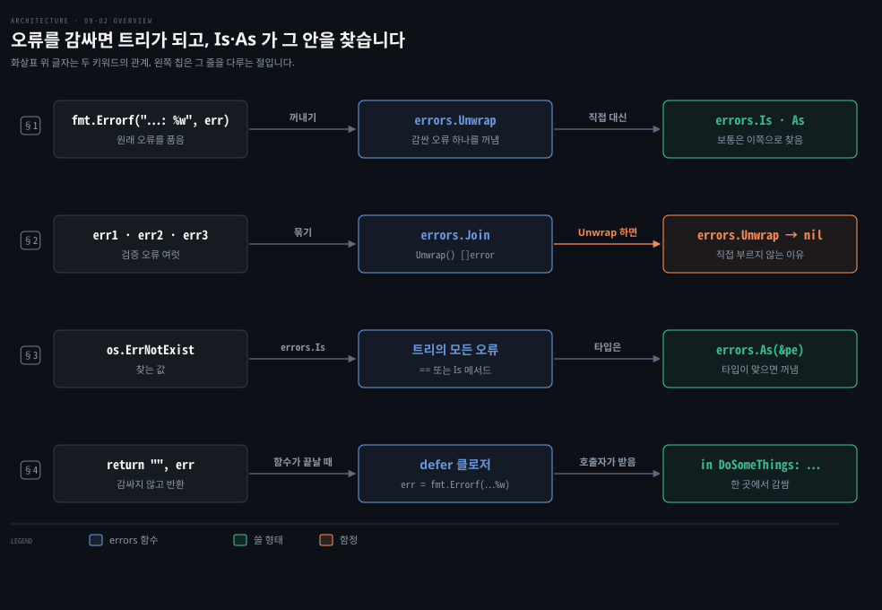
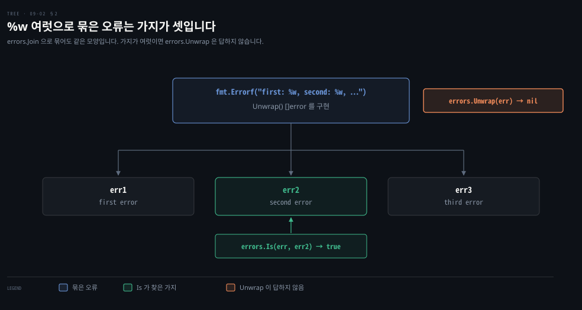
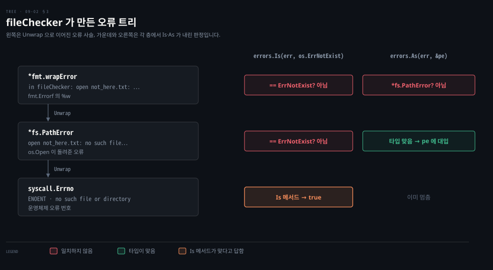
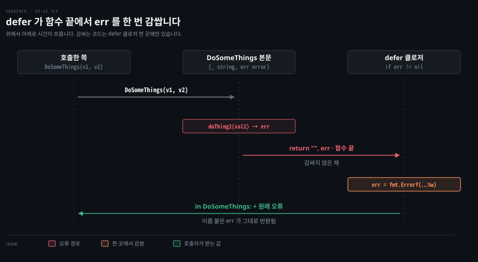

# 오류를 감싸면 트리가 되고 errors.Is 와 As 가 그 안을 찾습니다

---

> Learning Go 9장 가운데입니다. 오류에 정보를 더하며 원래 오류를 보존하는 감싸기, 여러 오류를 하나로 묶는 `errors.Join`, 감싼 오류 트리에서 특정 값과 타입을 찾는 `errors.Is` 와 `errors.As`, 그리고 `defer` 로 같은 감싸기를 한 곳에 모으는 패턴을 다룹니다.

## 핵심 요약

> 이 편이 매달린 하나의 생각은 오류에 맥락을 더해도 원래 오류를 잃지 않고 나중에 찾아낼 수 있다는 것입니다.

`fmt.Errorf` 의 `%w` 는 원래 오류를 품은 새 오류를 만듭니다. `errors.Unwrap` 이 그것을 꺼냅니다. 사용자 정의 오류 타입은 `Unwrap() error` 를 구현하면 다른 오류를 감쌀 수 있습니다. 여러 오류는 `errors.Join` 이나 `%w` 여럿으로 묶으며, 이때 타입은 `Unwrap() []error` 를 구현합니다. 감싼 오류가 쌓이면 오류 트리가 됩니다.

감싼 뒤에는 `==` 나 타입 단언으로 원래 오류를 찾을 수 없습니다. 특정 인스턴스나 값을 찾을 때는 `errors.Is`, 특정 타입을 찾을 때는 `errors.As` 를 씁니다. 둘 다 트리를 따라 내려가며, `Is` 메서드를 구현하면 비교 방식을 바꿀 수 있습니다. 모든 오류를 같은 메시지로 감싼다면 이름 붙은 반환 값과 `defer` 로 한 곳에서 감쌉니다.


## 학습 목표

> 이 편을 읽고 나면 아래 다섯 가지를 스스로 해낼 수 있습니다.

1. `%w` 로 오류를 감싸고 `%v` 와의 차이를 말할 수 있습니다.
2. 사용자 정의 오류 타입에 `Unwrap` 을 구현해 다른 오류를 감쌀 수 있습니다.
3. `errors.Join` 과 여러 `%w` 로 오류를 묶고, `errors.Unwrap` 을 직접 부르지 말아야 하는 이유를 말할 수 있습니다.
4. `errors.Is` 와 `errors.As` 를 언제 쓰는지 가르고, 사용자 정의 `Is` 로 패턴 매칭을 할 수 있습니다.
5. 이름 붙은 반환 값과 `defer` 로 같은 감싸기를 한 곳에 모을 수 있습니다.

아래는 이 편의 키워드를 이은 개념도입니다. 첫 줄은 `%w` 가 원래 오류를 품고 `errors.Unwrap` 대신 보통은 `Is`·`As` 로 찾는다는 것입니다. 둘째 줄은 여러 오류를 묶으면 `errors.Unwrap` 이 `nil` 을 돌려준다는 것입니다. 셋째 줄은 `errors.Is` 가 값을, `errors.As` 가 타입을 트리에서 찾는다는 것입니다. 넷째 줄은 `defer` 클로저가 한 곳에서 감싼다는 것입니다. 왼쪽 칩이 그 줄을 다루는 절입니다.




## 1. 오류 감싸기 — 정보를 더하면서 원래 오류를 보존합니다

> `fmt.Errorf` 의 `%w` 는 원래 오류의 문자열을 포함하면서 원래 오류 자체도 품은 오류를 만듭니다. 사용자 정의 오류 타입은 `Unwrap() error` 를 구현해 같은 일을 합니다.

오류가 코드를 거슬러 올라올 때 정보를 더하고 싶을 때가 많습니다. 오류를 받은 함수의 이름이나 하려던 작업 같은 것입니다. 그런데 새 오류를 만들어 돌려주면 원래 오류는 어떻게 될까요? 원래 오류를 보존하면서 정보를 더하는 것을 오류 **감싸기**라고 부르고, 감싼 오류가 줄줄이 이어지면 **오류 트리**라고 부릅니다. Java 의 예외 체이닝, 곧 `new ServiceException("...", cause)` 로 원인을 붙이고 `getCause()` 로 꺼내는 것과 같은 발상입니다. 이 비교는 원문 밖입니다.

표준 라이브러리에서 오류를 감싸는 함수는 이미 봤습니다. `fmt.Errorf` 에는 `%w` 라는 특별한 서식 문자가 있습니다. 이것으로 다른 오류의 문자열을 포함하고 그 원래 오류도 품은 오류를 만듭니다. 관례는 오류 서식 문자열 끝에 `: %w` 를 쓰고 감쌀 오류를 `fmt.Errorf` 의 마지막 인자로 넘기는 것입니다.

표준 라이브러리는 오류를 푸는 함수 `errors.Unwrap` 도 줍니다. 오류를 넘기면 감싼 오류가 있으면 그것을, 없으면 `nil` 을 돌려줍니다.

```go
func fileChecker(name string) error {
	f, err := os.Open(name)
	if err != nil {
		return fmt.Errorf("in fileChecker: %w", err)
	}
	f.Close()
	return nil
}

func main() {
	err := fileChecker("not_here.txt")
	if err != nil {
		fmt.Println(err)
		if wrappedErr := errors.Unwrap(err); wrappedErr != nil {
			fmt.Println(wrappedErr)
		}
	}
}
```

```bash
in fileChecker: open not_here.txt: no such file or directory
open not_here.txt: no such file or directory
```

원문 PDF 는 둘째 줄이 판면에서 흐트러졌지만 내용은 위와 같고, 로컬 출력도 같았습니다. 원문의 메모대로 보통은 `errors.Unwrap` 을 직접 부르지 않고 `errors.Is` 와 `errors.As` 로 감싼 오류를 찾습니다(§3).

### 사용자 정의 오류 타입은 Unwrap 으로 감쌉니다

사용자 정의 오류 타입으로 오류를 감싸려면 그 타입에 `Unwrap` 메서드를 구현합니다. 매개변수 없이 `error` 를 돌려주는 메서드입니다. 원문은 09-01 §4 의 `StatusErr` 를 고칩니다.

```go
type StatusErr struct {
	Status  Status
	Message string
	Err     error
}

func (se StatusErr) Error() string {
	return se.Message
}

func (se StatusErr) Unwrap() error {
	return se.Err
}
```

이제 `StatusErr` 로 바탕 오류를 감쌉니다. `LoginAndGetData` 의 두 `StatusErr` 에 `Err: err` 필드가 더해질 뿐 나머지는 09-01 §4 와 같습니다.

```go
func LoginAndGetData(uid, pwd, file string) ([]byte, error) {
	token, err := login(uid, pwd)
	if err != nil {
		return nil, StatusErr{
			Status:  InvalidLogin,
			Message: fmt.Sprintf("invalid credentials for user %s", uid),
			Err:     err,
		}
	}
	data, err := getData(token, file)
	if err != nil {
		return nil, StatusErr{
			Status:  NotFound,
			Message: fmt.Sprintf("file %s not found", file),
			Err:     err,
		}
	}
	return data, nil
}
```

### 모든 오류를 감쌀 필요는 없습니다

원문은 모든 오류를 감쌀 필요는 없다고 말합니다. 라이브러리가 처리를 계속할 수 없다는 오류를 돌려주더라도, 그 메시지에 프로그램의 다른 부분에는 필요 없는 구현 세부가 담겨 있을 수 있습니다. 그럴 때는 새 오류를 만들어 대신 돌려줘도 전혀 문제없습니다. 상황을 이해하고 무엇을 돌려줄지 판단하라는 것입니다.

원문의 팁은 다른 오류의 메시지를 담되 감싸지는 않는 새 오류가 필요하면 `fmt.Errorf` 에서 `%w` 대신 `%v` 를 쓰라는 것입니다.

```go
err := internalFunction()
if err != nil {
	return fmt.Errorf("internal failure: %v", err)
}
```

로컬에서 `%v` 로 만든 오류를 `errors.Unwrap` 에 넘기니 `nil` 이 나왔습니다. 문자열은 이어졌지만 원래 오류와의 연결은 끊긴 것입니다.


## 2. 여러 오류를 하나로 묶습니다

> 반환 타입은 `[]error` 가 아니라 `error` 라서 여러 오류는 하나로 합쳐야 합니다. `errors.Join` 이나 `%w` 여럿을 쓰고, 직접 만든 타입은 `Unwrap() []error` 를 구현합니다.

함수가 돌려줘야 할 오류가 여럿이라면 어떻게 돌려줄까요? 예를 들어 struct 필드를 검증하는 함수라면 잘못된 필드마다 오류를 돌려주는 편이 낫습니다. 표준 함수 시그니처는 `[]error` 가 아니라 `error` 를 돌려주므로 여러 오류를 하나로 합쳐야 하는데, `errors.Join` 이 그 일을 합니다.

```go
type Person struct {
	FirstName string
	LastName  string
	Age       int
}

func ValidatePerson(p Person) error {
	var errs []error
	if len(p.FirstName) == 0 {
		errs = append(errs, errors.New("field FirstName cannot be empty"))
	}
	if len(p.LastName) == 0 {
		errs = append(errs, errors.New("field LastName cannot be empty"))
	}
	if p.Age < 0 {
		errs = append(errs, errors.New("field Age cannot be negative"))
	}
	if len(errs) > 0 {
		return errors.Join(errs...)
	}
	return nil
}
```

이 노트를 쓰면서 `Person{Age: -1}` 을 넘기니 오류 문자열이 세 메시지를 줄바꿈으로 이은 것이었습니다. Spring 의 Bean Validation 이 `ConstraintViolation` 들을 `Set` 으로 모아 돌려주는 것과 같은 목적입니다. 이 비교는 원문 밖입니다.

여러 오류를 합치는 다른 방법은 `fmt.Errorf` 에 `%w` 를 여러 개 넘기는 것입니다.

```go
err1 := errors.New("first error")
err2 := errors.New("second error")
err3 := errors.New("third error")
err := fmt.Errorf("first: %w, second: %w, third: %w", err1, err2, err3)
```

로컬에서 이 `err` 는 `first: first error, second: second error, third: third error` 를 찍었고, `errors.Is(err, err2)` 는 `true` 였습니다.

### 직접 만든 타입은 Unwrap() []error 를 구현합니다

여러 오류를 감싸는 오류 타입을 직접 만들 수도 있습니다. `Unwrap` 메서드를 구현하되 `error` 대신 `[]error` 를 돌려주게 합니다.

```go
type MyError struct {
	Code   int
	Errors []error
}

func (m MyError) Error() string {
	return errors.Join(m.Errors...).Error()
}

func (m MyError) Unwrap() []error {
	return m.Errors
}
```

> **원문 정오**: 원문은 `Error` 메서드를 `type (m MyError) Error() string {` 으로 인쇄했습니다. 메서드 선언은 `func` 로 시작해야 하며, go1.25.1 은 원문 그대로를 `syntax error: unexpected name Error after top level declaration` 으로 거부했습니다. 바로 아래의 `Unwrap` 은 `func` 로 바르게 적혀 있습니다. 책 16개 장 PDF 전체를 검색하니 `type (` 로 시작하는 리시버 선언은 이 한 곳이었습니다.

Go 는 메서드 오버로딩을 지원하지 않으므로 두 가지 `Unwrap` 을 모두 제공하는 타입 하나를 만들 수는 없습니다. 또 `[]error` 판 `Unwrap` 을 구현한 오류를 `errors.Unwrap` 에 넘기면 `nil` 이 돌아옵니다. 로컬에서 `MyError` 와 `%w` 여럿으로 만든 오류 모두 `errors.Unwrap` 결과가 `nil` 이었습니다. 원문은 이것이 `errors.Unwrap` 을 직접 부르지 말아야 할 또 하나의 이유라고 말합니다.



감싼 오류가 없거나 하나거나 여럿일 수 있는 오류를 다뤄야 한다면, 원문은 다음 코드를 바탕으로 쓰라고 합니다.

```go
var err error
err = funcThatReturnsAnError()
switch err := err.(type) {
case interface{ Unwrap() error }:
	// handle single error
	innerErr := err.Unwrap()
	// process innerErr
case interface{ Unwrap() []error }:
	//handle multiple wrapped errors
	innerErrs := err.Unwrap()
	for _, innerErr := range innerErrs {
		// process each innerErr
	}
default:
	// handle no wrapped error
}
```

표준 라이브러리에 두 `Unwrap` 판을 나타내는 인터페이스가 정의되어 있지 않아서, 이 코드는 타입 스위치 안에서 익명 인터페이스로 메서드를 맞추고 감싼 오류에 접근합니다. 07-04 §1 의 타입 스위치와, 07-04 §2 의 선택적 인터페이스를 확인하는 방식이 함께 쓰인 모양입니다. 이 연결은 노트의 해석입니다. 원문은 직접 이런 코드를 쓰기 전에 `errors.Is` 와 `errors.As` 로 오류 트리를 살필 수 있는지 먼저 보라고 권합니다.


## 3. errors.Is 는 값을, errors.As 는 타입을 트리에서 찾습니다

> 감싼 오류는 `==` 나 타입 단언으로 찾을 수 없습니다. 특정 인스턴스나 값은 `errors.Is` 로, 특정 타입은 `errors.As` 로 트리 전체에서 찾습니다.

오류 감싸기는 추가 정보를 얻는 쓸모 있는 방법이지만 문제를 낳습니다. 센티널 오류가 감싸지면 `==` 로 확인할 수 없고, 감싼 사용자 정의 오류를 타입 단언이나 타입 스위치로 맞출 수도 없습니다. Go 는 `errors` 패키지의 두 함수 `Is` 와 `As` 로 이 문제를 풉니다.



### errors.Is 는 트리에서 특정 인스턴스를 찾습니다

반환된 오류나 그것이 감싼 오류들이 특정 센티널 오류 인스턴스와 맞는지 보려면 `errors.Is` 를 씁니다. 확인할 오류와 비교할 인스턴스를 받고 오류 트리의 어떤 오류든 주어진 센티널과 맞으면 `true` 를 돌려줍니다.

```go
func main() {
	err := fileChecker("not_here.txt")
	if err != nil {
		if errors.Is(err, os.ErrNotExist) {
			fmt.Println("That file doesn't exist")
		}
	}
}
```

원문의 출력은 `That file doesn't exist` 입니다. 이 노트를 쓰면서 트리를 들여다보니 `fmt.Errorf` 가 감싼 것은 `*fs.PathError` 였고, 그것이 다시 `syscall.Errno`(`ENOENT`)를 감싸고 있었습니다. `ENOENT` 가 `os.ErrNotExist` 와 같은 값은 아니지만 `syscall.Errno` 가 `Is` 메서드로 자신을 `ErrNotExist` 와 맞다고 답해 주기 때문에 `true` 가 됩니다. 이 트리 구조와 설명은 원문 밖의 확인입니다.

### Is 메서드로 비교 방식을 바꿉니다

기본적으로 `errors.Is` 는 감싼 오류 하나하나를 지정한 오류와 `==` 로 비교합니다. 직접 정의한 오류 타입에서 이것이 통하지 않는다면, 예를 들어 오류가 비교 불가능한 타입이라면, 오류에 `Is` 메서드를 구현합니다.

```go
type MyErr struct {
	Codes []int
}

func (me MyErr) Error() string {
	return fmt.Sprintf("codes: %v", me.Codes)
}

func (me MyErr) Is(target error) bool {
	if me2, ok := target.(MyErr); ok {
		return slices.Equal(me.Codes, me2.Codes)
	}
	return false
}
```

`slices.Equal` 은 03-01 에서 봤습니다. 로컬에서 `MyErr{Codes: []int{1, 2}}` 를 `%w` 로 감싼 뒤 같은 코드를 가진 새 `MyErr` 로 `errors.Is` 를 부르니 `true` 였습니다. slice 필드 때문에 `==` 로는 비교할 수 없는 타입인데도 찾아낸 것입니다.

`Is` 메서드를 정의하는 또 다른 쓰임은 동일한 인스턴스가 아닌 오류와의 비교를 허락하는 것입니다. 일부 필드만 같은 오류들과 맞는 필터 인스턴스로 오류를 패턴 매칭하고 싶을 수 있습니다. 원문은 새 오류 타입 `ResourceErr` 를 정의합니다.

```go
type ResourceErr struct {
	Resource string
	Code     int
}

func (re ResourceErr) Error() string {
	return fmt.Sprintf("%s: %d", re.Resource, re.Code)
}

func (re ResourceErr) Is(target error) bool {
	if other, ok := target.(ResourceErr); ok {
		ignoreResource := other.Resource == ""
		ignoreCode := other.Code == 0
		matchResource := other.Resource == re.Resource
		matchCode := other.Code == re.Code
		return matchResource && matchCode ||
			matchResource && ignoreCode ||
			ignoreResource && matchCode
	}
	return false
}
```

이제 코드와 상관없이 데이터베이스를 가리키는 모든 오류를 찾을 수 있습니다.

```go
if errors.Is(err, ResourceErr{Resource: "Database"}) {
	fmt.Println("The database is broken:", err)
	// process the codes
}
```

로컬에서 `ResourceErr{Resource: "Database", Code: 123}` 을 감싸 확인했습니다. `ResourceErr{Resource: "Database"}` 와 `ResourceErr{Code: 123}` 에는 `true` 였습니다. `ResourceErr{Resource: "Network"}` 에는 `false` 였습니다.

### errors.As 는 트리에서 특정 타입을 찾아 꺼냅니다

`errors.As` 는 반환된 오류나 그것이 감싼 오류가 특정 타입과 맞는지 확인합니다. 매개변수는 둘입니다. 첫째는 살펴볼 오류이고, 둘째는 찾는 타입의 변수를 가리키는 포인터입니다. 함수가 `true` 를 돌려주면 오류 트리에서 맞는 오류를 찾은 것입니다. 그 오류가 둘째 매개변수에 대입됩니다. `false` 면 트리에 맞는 것이 없습니다.

```go
err := AFunctionThatReturnsAnError()
var myErr MyErr
if errors.As(err, &myErr) {
	fmt.Println(myErr.Codes)
}
```

`var` 로 특정 타입의 변수를 제로 값으로 선언하고 그 변수의 포인터를 `errors.As` 에 넘깁니다. 로컬에서 감싼 `MyErr` 를 꺼내니 `[1 2]` 가 찍혔습니다. Java 의 `catch (MyException e)` 가 타입으로 예외를 골라 변수에 받는 것과 비슷한 자리인데, Go 는 원인 사슬 전체를 뒤진다는 점이 다릅니다. 이 비교는 원문 밖입니다.

둘째 매개변수로 오류 타입 변수의 포인터만 넘겨야 하는 것은 아닙니다. 인터페이스를 가리키는 포인터를 넘겨 그 인터페이스를 만족하는 오류를 찾을 수 있습니다.

```go
err := AFunctionThatReturnsAnError()
var coder interface {
	CodeVals() []int
}
if errors.As(err, &coder) {
	fmt.Println(coder.CodeVals())
}
```

예제는 익명 인터페이스를 썼지만 어떤 인터페이스 타입이든 됩니다. 원문은 `errors.As` 의 둘째 매개변수가 오류나 인터페이스를 가리키는 포인터가 아니면 panic 이 난다고 경고합니다. 이 노트를 쓰면서 `*string` 을 넘기니 `errors: *target must be interface or implement error` 로 panic 이 났습니다.

`Is` 메서드로 기본 `errors.Is` 비교를 바꾸듯, `As` 메서드로 기본 `errors.As` 비교를 바꿀 수 있습니다. 원문은 `As` 메서드 구현이 간단하지 않고 리플렉션이 필요하다며(16장), 한 타입의 오류를 맞추고 다른 타입을 돌려주고 싶을 때 같은 드문 상황에서만 하라고 말합니다. 원문의 팁은 이렇게 정리됩니다. 특정 인스턴스나 특정 값을 찾을 때는 `errors.Is`, 특정 타입을 찾을 때는 `errors.As` 를 씁니다.


## 4. defer 로 같은 감싸기를 한 곳에 모읍니다

> 모든 오류를 같은 메시지로 감싼다면, 이름 붙은 반환 값 `err` 를 `defer` 클로저에서 감싸 한 번만 씁니다. 오류마다 다른 정보가 필요하면 `fmt.Errorf` 마다 적습니다.

같은 메시지로 여러 오류를 감싸는 코드를 쓰게 될 때가 있습니다.

```go
func DoSomeThings(val1 int, val2 string) (string, error) {
	val3, err := doThing1(val1)
	if err != nil {
		return "", fmt.Errorf("in DoSomeThings: %w", err)
	}
	val4, err := doThing2(val2)
	if err != nil {
		return "", fmt.Errorf("in DoSomeThings: %w", err)
	}
	result, err := doThing3(val3, val4)
	if err != nil {
		return "", fmt.Errorf("in DoSomeThings: %w", err)
	}
	return result, nil
}
```

`defer` 를 쓰면 단순해집니다.

```go
func DoSomeThings(val1 int, val2 string) (_ string, err error) {
	defer func() {
		if err != nil {
			err = fmt.Errorf("in DoSomeThings: %w", err)
		}
	}()
	val3, err := doThing1(val1)
	if err != nil {
		return "", err
	}
	val4, err := doThing2(val2)
	if err != nil {
		return "", err
	}
	return doThing3(val3, val4)
}
```

`defer` 로 등록한 함수에서 `err` 를 가리키려면 반환 값에 이름을 붙여야 합니다. 반환 값 하나에 이름을 붙이면 모두에 붙여야 하므로, 명시적으로 대입하지 않는 `string` 반환 값에는 밑줄을 씁니다. `defer` 클로저는 오류가 돌아왔는지 확인하고, 그렇다면 원래 오류를 감싸 어느 함수가 오류를 발견했는지 알리는 새 오류로 다시 대입합니다. 05-03 §2 에서 `defer` 가 이름 붙은 결과 변수를 고쳐 커밋과 롤백을 갈랐던 것과 같은 장치입니다.



이 노트를 쓰면서 이 모양을 줄여 오류를 내게 하니 `in DoSomeThings: negative` 가 돌아왔습니다. 원문은 이 패턴이 모든 오류를 같은 메시지로 감쌀 때 잘 맞는다고 말합니다. 감싸는 오류를 더 자세히 바꾸고 싶다면 `fmt.Errorf` 마다 구체적인 메시지와 공통 메시지를 함께 적으라고 합니다.


## 핵심 개념 체크리스트

목표 번호 순서대로 짝지었습니다.

- [ ] (목표 1) `fmt.Errorf("internal failure: %v", err)` 로 만든 오류에서 `errors.Is(result, err)` 는 무엇을 돌려줍니까?
- [ ] (목표 2) `StatusErr` 가 `Unwrap` 을 구현하지 않으면 `errors.Is` 가 그 안의 오류를 찾지 못하는 이유를 말할 수 있습니까?
- [ ] (목표 3) `errors.Join` 으로 묶은 오류를 `errors.Unwrap` 에 넘기면 무엇이 나옵니까?
- [ ] (목표 4) `os.ErrNotExist` 를 찾을 때 `errors.Is` 를, `*fs.PathError` 를 꺼낼 때 `errors.As` 를 쓰는 이유를 말할 수 있습니까?
- [ ] (목표 4) `ResourceErr{Resource: "Database"}` 가 코드가 다른 데이터베이스 오류들과도 맞는 이유를 설명할 수 있습니까?
- [ ] (목표 5) `defer` 감싸기 패턴에서 반환 값에 이름을 붙이고 `string` 자리에 `_` 를 쓰는 이유를 말할 수 있습니까?


## 관련 문서

- [09-01 Go 오류는 마지막 반환 값이고 센티널과 사용자 정의 타입으로 뜻을 담습니다](./09-01.Go%20%EC%98%A4%EB%A5%98%EB%8A%94%20%EB%A7%88%EC%A7%80%EB%A7%89%20%EB%B0%98%ED%99%98%20%EA%B0%92%EC%9D%B4%EA%B3%A0%20%EC%84%BC%ED%8B%B0%EB%84%90%EA%B3%BC%20%EC%82%AC%EC%9A%A9%EC%9E%90%20%EC%A0%95%EC%9D%98%20%ED%83%80%EC%9E%85%EC%9C%BC%EB%A1%9C%20%EB%9C%BB%EC%9D%84%20%EB%8B%B4%EC%8A%B5%EB%8B%88%EB%8B%A4.md) — 9장 앞. 센티널과 사용자 정의 오류
- [09-03 panic 은 복구할 수 없을 때만 쓰고 recover 는 API 경계에서 씁니다](./09-03.panic%20%EC%9D%80%20%EB%B3%B5%EA%B5%AC%ED%95%A0%20%EC%88%98%20%EC%97%86%EC%9D%84%20%EB%95%8C%EB%A7%8C%20%EC%93%B0%EA%B3%A0%20recover%20%EB%8A%94%20API%20%EA%B2%BD%EA%B3%84%EC%97%90%EC%84%9C%20%EC%94%81%EB%8B%88%EB%8B%A4.md) — 9장 끝. panic 과 recover
- [05-03 defer 는 함수가 끝날 때 정리하고 인자는 늘 복사됩니다](./05-03.defer%20%EB%8A%94%20%ED%95%A8%EC%88%98%EA%B0%80%20%EB%81%9D%EB%82%A0%20%EB%95%8C%20%EC%A0%95%EB%A6%AC%ED%95%98%EA%B3%A0%20%EC%9D%B8%EC%9E%90%EB%8A%94%20%EB%8A%98%20%EB%B3%B5%EC%82%AC%EB%90%A9%EB%8B%88%EB%8B%A4.md) — 5장. defer 와 이름 붙은 반환 값
- [Learning Go 2판 — 정독 인덱스](./README.md) — 16장 전체 지도


## 참고 자료

- 원본: 《Learning Go, 2nd Edition》 (Jon Bodner, O'Reilly)
- 다룬 범위: Chapter 9 "Wrapping Errors" 부터 "Wrapping Errors with defer" 까지
