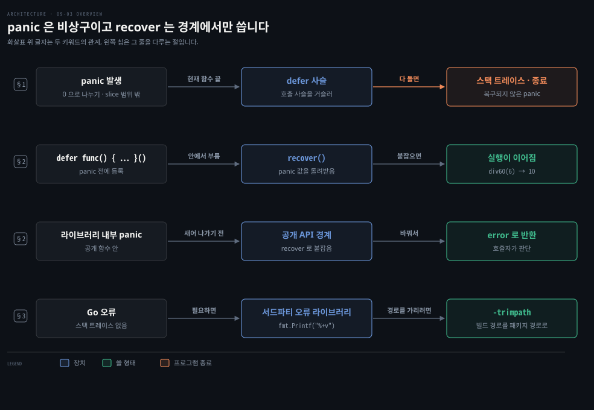
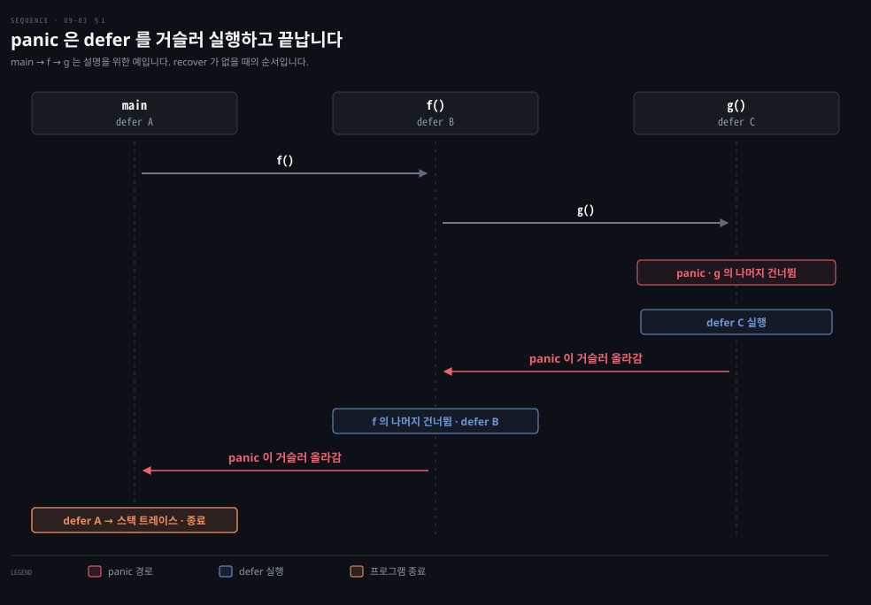
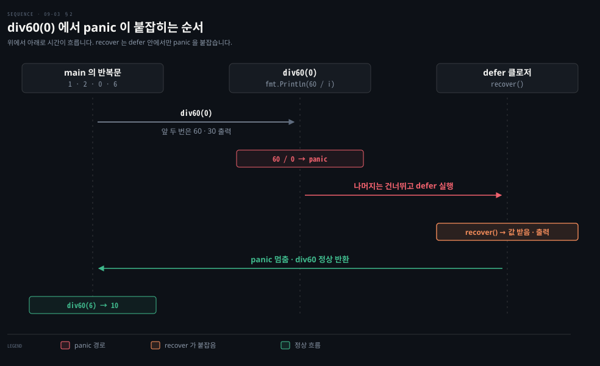
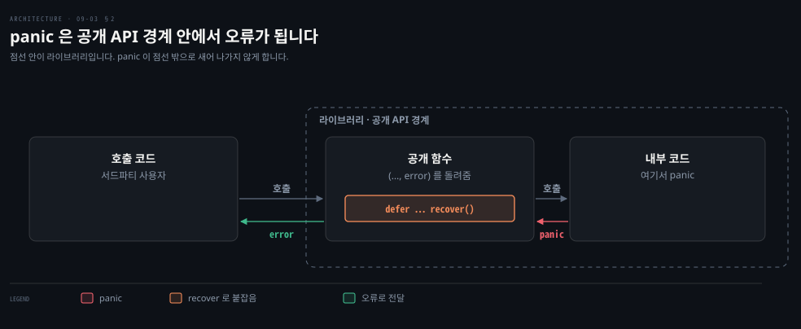

# panic 은 복구할 수 없을 때만 쓰고 recover 는 API 경계에서 씁니다

---

> Learning Go 9장 끝입니다. 런타임이 다음에 할 일을 알 수 없을 때 나는 panic, `defer` 안에서 panic 을 붙잡는 `recover`, 둘을 예외처럼 쓰지 말아야 하는 이유, 오류에서 스택 트레이스를 얻는 법을 다루고 장 끝 연습 문제를 풉니다.

## 핵심 요약

> 이 편이 매달린 하나의 생각은 panic 과 recover 가 예외 처리 장치가 아니라 치명적인 상황을 위한 비상구라는 것입니다.

panic 은 슬라이스 끝 너머를 읽는 것 같은 프로그래밍 오류로 런타임이 다음에 할 일을 알 수 없을 때 생깁니다. panic 이 나면 현재 함수가 곧바로 끝나고 `defer` 들이 호출 사슬을 거슬러 실행된 뒤 프로그램이 메시지와 스택 트레이스를 찍고 끝납니다. `defer` 안에서 `recover` 를 부르면 panic 을 붙잡아 실행을 이어 갈 수 있습니다.

원문은 panic 을 치명적인 상황에만 쓰고, recover 는 그 상황을 깔끔하게 다루는 데 쓰라고 말합니다. recover 는 무엇이 실패할 수 있는지 드러내지 않기 때문입니다. recover 를 권하는 곳은 하나, 서드파티용 라이브러리의 공개 API 경계에서 panic 을 오류로 바꿔 돌려줄 때입니다. Go 는 기본으로 오류에 스택 트레이스를 담지 않으니, 필요하면 감싸기로 직접 만들거나 서드파티 라이브러리를 씁니다.


## 학습 목표

> 이 편을 읽고 나면 아래 다섯 가지를 스스로 해낼 수 있습니다.

1. panic 이 언제 생기고, 난 뒤 `defer` 가 어떤 순서로 실행되는지 말할 수 있습니다.
2. `defer` 안에서 `recover` 로 panic 을 붙잡는 패턴을 쓸 수 있습니다.
3. panic 과 recover 를 예외처럼 쓰지 말아야 하는 이유와, recover 를 권하는 유일한 상황을 말할 수 있습니다.
4. Go 오류에서 스택 트레이스를 얻는 방법과 `-trimpath` 의 쓰임을 말할 수 있습니다.
5. 센티널 오류·사용자 정의 오류·`errors.Join` 을 함께 쓰는 검증 코드를 쓸 수 있습니다.

아래는 이 편의 키워드를 이은 개념도입니다. 첫 줄은 panic 이 나면 `defer` 가 호출 사슬을 거슬러 실행된 뒤 프로그램이 끝난다는 것입니다. 둘째 줄은 `defer` 안의 `recover` 가 panic 값을 받아 실행을 잇는다는 것입니다. 셋째 줄은 라이브러리의 공개 함수가 panic 을 오류로 바꿔 돌려준다는 것입니다. 넷째 줄은 스택 트레이스를 서드파티 라이브러리로 얻고 `-trimpath` 로 경로를 가린다는 것입니다. 왼쪽 칩이 그 줄을 다루는 절입니다.




## 1. panic — 런타임이 다음에 할 일을 모를 때 멈춥니다

> panic 은 거의 늘 프로그래밍 오류로 생기며, 나는 즉시 현재 함수를 끝내고 호출 사슬을 거슬러 `defer` 를 실행한 뒤 스택 트레이스를 찍고 프로그램을 끝냅니다. 복구할 수 없는 상황이라면 `panic` 을 직접 부를 수도 있습니다.

앞 장들에서 panic 을 여러 번 스치듯 언급했습니다. 06-01 의 `nil` 포인터 역참조, 07-03 §5 의 비교할 수 없는 타입 비교가 그 예입니다. 원문은 panic 이 Java 나 Python 의 Error 와 비슷하다고 말합니다. Go 런타임이 다음에 무엇을 해야 할지 알아낼 수 없을 때 만드는 상태입니다.

Java 에는 `Exception` 과 따로 `java.lang.Error`(예를 들어 `OutOfMemoryError`)라는 복구를 기대하지 않는 계층이 있어서 이 비교가 잘 맞습니다. Python 에서 가장 가까운 것은 `Exception` 밖에 있는 `BaseException` 계열(`SystemExit` 등)이지만 `MemoryError` 는 `Exception` 아래에 있어 대응이 덜 깔끔합니다. 이 보충은 원문 밖입니다.

panic 은 거의 늘 프로그래밍 오류 때문에 생깁니다. slice 끝을 넘어 읽으려 하거나 `make` 에 음수 크기를 넘기는 경우입니다. Go 런타임은 가비지 컬렉터가 오작동하는 것 같은 자기 버그를 발견해도 panic 을 냅니다. 원문 저자는 그런 일을 한 번도 본 적 없다며, panic 이 나면 런타임은 맨 마지막에 의심하라고 말합니다.

panic 이 나면 현재 함수는 곧바로 끝납니다. 그리고 현재 함수에 붙은 `defer` 들이 실행됩니다. 그것들이 끝나면 호출한 함수에 붙은 `defer` 들이 실행되고, 이렇게 `main` 에 이를 때까지 이어집니다. 그런 다음 프로그램은 메시지와 스택 트레이스를 찍고 끝납니다. 호출 사슬 하나로 그리면 아래와 같습니다.



원문의 메모에 따르면 메인이 아닌 고루틴에서 panic 이 나면 `defer` 사슬은 그 고루틴을 시작한 함수에서 끝납니다. 어느 고루틴이든 복구되지 않은 panic 이 나면 프로그램 전체가 끝납니다. 고루틴은 12장 「Goroutines」에서 다룹니다(절 이름만 원문에 있고 장 번호는 노트가 찾아 붙였습니다).

### panic 을 직접 부를 수도 있습니다

프로그램에 복구할 수 없는 상황이 있다면 panic 을 직접 만들 수 있습니다. 내장 함수 `panic` 은 어떤 타입이든 되는 매개변수 하나를 받는데, 보통은 문자열입니다.

```go
func doPanic(msg string) {
	panic(msg)
}

func main() {
	doPanic(os.Args[0])
}
```

원문의 출력은 Go Playground 에서 돌린 것이라 `panic: /tmpfs/play` 다음에 `/tmp/sandbox567884271/prog.go` 경로가 담긴 스택 트레이스가 이어집니다. 로컬에서 빌드해 돌리니 첫 줄이 `panic: ./pan` 이었고, 스택 트레이스에는 소스 파일의 전체 경로가 찍혔습니다. 보다시피 panic 은 메시지를 찍고 스택 트레이스를 뒤에 붙입니다.


## 2. recover — defer 안에서 panic 을 붙잡습니다

> 내장 함수 `recover` 는 `defer` 안에서 불러 panic 이 났는지 확인하고, 났다면 panic 에 넘긴 값을 돌려줍니다. recover 한 뒤에는 실행이 정상으로 이어집니다.

위처럼 panic 이 나면 프로그램은 스택 트레이스를 찍고 끝납니다. 요청 하나를 처리하다 난 panic 이 서버 전체를 멈춘다면 어떻게 막을까요? Go 는 panic 을 붙잡아 더 깔끔하게 끝내거나 아예 끝나지 않게 하는 방법을 줍니다. 내장 함수 `recover` 를 `defer` 안에서 불러 panic 이 났는지 확인합니다. panic 이 났다면 panic 에 넘긴 값이 돌아오고, 한 번 recover 하면 실행은 정상으로 이어집니다.

```go
func div60(i int) {
	defer func() {
		if v := recover(); v != nil {
			fmt.Println(v)
		}
	}()
	fmt.Println(60 / i)
}

func main() {
	for _, val := range []int{1, 2, 0, 6} {
		div60(val)
	}
}
```

recover 를 쓰는 패턴은 정해져 있습니다. 가능한 panic 을 처리할 함수를 `defer` 로 등록하고, 그 안의 `if` 문에서 `recover` 를 불러 `nil` 이 아닌 값이 나왔는지 봅니다. panic 이 나면 `defer` 로 등록한 함수만 실행되므로 `recover` 는 반드시 `defer` 안에서 불러야 합니다.

```bash
60
30
runtime error: integer divide by zero
10
```

원문과 로컬의 출력이 같았습니다. `div60(0)` 에서 panic 이 났지만 그 `defer` 가 붙잡아 메시지를 찍었고, 반복문은 다음 값 6 으로 이어졌습니다.



### panic(nil) 은 Go 1.21 부터 PanicNilError 가 됩니다

`recover` 는 `nil` 이 아닌 값으로 panic 이 났는지 알아내니, 눈 밝은 독자라면 `panic(nil)` 을 부르고 `recover` 가 있으면 어떻게 되는지 물을 것입니다.

원문은 Go 1.21 이전 버전으로 컴파일한 코드에서는 답이 "좋지 않다"였다고 말합니다. 그 버전들에서 `recover` 는 panic 이 퍼지는 것을 막지만 무슨 일이 있었는지 알려 주는 메시지나 데이터가 없었습니다. Go 1.21 부터 `panic(nil)` 호출은 `panic(new(runtime.PanicNilError))` 와 같습니다.

이 노트를 쓰면서 `go.mod` 의 `go` 줄을 1.25 로 두고 돌리니 `recover` 가 `*runtime.PanicNilError` 타입 값 `panic called with nil argument` 를 돌려줬습니다. 04-02 의 루프 변수처럼 `go.mod` 의 `go` 줄에 따라 동작이 갈리는 기능입니다(원문 밖 연결).

### panic 과 recover 는 예외 처리가 아닙니다

원문은 panic 과 recover 가 다른 언어의 예외 처리와 많이 닮았지만 그렇게 쓰라고 만든 것이 아니라고 말합니다. panic 은 치명적인 상황에 남겨 두고, recover 는 그런 상황을 깔끔하게 다루는 데 씁니다. 프로그램이 panic 을 냈다면 계속 실행하려 할 때 조심해야 합니다. panic 뒤에 프로그램을 계속 돌리고 싶은 경우는 드뭅니다.

원문이 드는 두 경우는 이렇습니다. 컴퓨터가 메모리나 디스크 공간 같은 자원을 다 써서 panic 이 났다면, 가장 안전한 방법은 `recover` 로 모니터링 소프트웨어에 상황을 기록하고 `os.Exit(1)` 로 끝내는 것입니다. 프로그래밍 오류로 panic 이 났다면 계속해 볼 수는 있지만 같은 문제를 다시 만날 가능성이 큽니다. 앞의 예제에서도 0 으로 나누는지 확인해 오류를 돌려주는 것이 관용적이라고 원문은 말합니다.

원문은 panic 과 recover 에 기대지 않는 이유가 `recover` 가 무엇이 실패할 수 있는지 분명히 하지 않기 때문이라고 말합니다. `recover` 는 무엇이든 실패하면 메시지를 찍고 계속하게 해 줄 뿐입니다. 관용적인 Go 는 무엇이든 처리하면서 아무것도 말하지 않는 짧은 코드보다, 실패할 수 있는 조건을 명시하는 코드를 선호합니다. Spring 에서 모든 예외를 `catch (Exception e)` 로 받아 로그만 남기는 코드를 리뷰에서 막는 것과 같은 판단입니다. 이 비교는 원문 밖입니다.

### recover 는 서드파티용 API 경계에서 씁니다

원문이 recover 를 권하는 상황은 하나입니다. 서드파티를 위한 라이브러리를 만든다면 panic 이 공개 API 의 경계를 넘어 새어 나가게 하지 말아야 합니다. panic 이 날 수 있다면 공개 함수는 `recover` 로 panic 을 오류로 바꿔 돌려주고, 호출하는 코드가 어떻게 할지 정하게 합니다.



원문의 메모도 하나 있습니다. Go 에 내장된 HTTP 서버는 핸들러의 panic 을 recover 하지만, David Symonds 가 GitHub 댓글에서 2015년 기준으로 Go 팀이 이것을 실수로 본다고 말했다는 것입니다.


## 3. 오류에서 스택 트레이스 얻기

> Go 오류는 기본으로 스택 트레이스를 담지 않습니다. 감싸기로 호출 사슬을 직접 만들거나, 스택 트레이스를 담는 서드파티 오류 라이브러리를 쓰고 `%+v` 로 찍습니다.

새로 Go 를 쓰는 개발자가 panic 과 recover 에 끌리는 이유 하나는 무언가 잘못됐을 때 스택 트레이스를 얻고 싶어서입니다. 원문은 Go 가 기본으로는 그것을 주지 않는다고 말합니다. 09-02 에서 본 대로 오류 감싸기로 호출 사슬을 손으로 만들 수 있지만, 오류 타입을 가진 서드파티 라이브러리 가운데 그 스택을 자동으로 만들어 주는 것도 있습니다. 원문은 Cockroachdb 가 스택 트레이스와 함께 오류를 감싸는 함수를 담은 서드파티 라이브러리를 제공한다고 소개합니다. 서드파티 코드를 들이는 법은 10장에서 다룹니다.

기본으로 스택 트레이스는 찍히지 않습니다. 보려면 `fmt.Printf` 와 자세한 출력 서식 문자 `%+v` 를 씁니다. 자세한 것은 그 라이브러리의 문서를 보라고 원문은 말합니다. Java 에서 `e.printStackTrace()` 로 늘 얻던 정보를 Go 에서는 라이브러리를 골라야 얻는다는 점이 가장 크게 달라지는 대목입니다. 이 대비는 원문 밖입니다.

원문의 메모에 따르면 오류에 스택 트레이스가 있으면 출력에 프로그램을 컴파일한 컴퓨터의 파일 전체 경로가 들어갑니다. 경로를 드러내고 싶지 않다면 빌드할 때 `-trimpath` 플래그를 씁니다. 전체 경로가 패키지 경로로 바뀝니다. 이 노트를 쓰면서 §1 의 `doPanic` 을 `-trimpath` 로 다시 빌드하니 panic 스택 트레이스의 경로도 `/private/tmp/…/main.go` 대신 `pan/main.go` 로 찍혔습니다.


## 연습 문제

> 원문 연습 문제는 책 9장 저장소의 `sample_code/exercise` 코드를 고치는 문제인데, 그 코드는 책에 실려 있지 않습니다. 이 노트는 문제 설명에 맞춰 직원 검증 코드를 직접 만들어 세 문제를 한 번에 풀었고, `go1.25.1` 에서 돌리고 `go vet` 까지 통과했습니다.

원문의 세 문제는 이렇습니다. 첫째, 잘못된 ID 를 나타내는 센티널 오류를 만듭니다. 그리고 `main` 에서 `errors.Is` 로 확인해 메시지를 찍습니다. 둘째, 비어 있는 필드 오류를 나타내는 사용자 정의 오류 타입을 정의하고 비어 있는 `Employee` 필드 이름을 담습니다. `main` 에서는 `errors.As` 로 확인해 필드 이름을 찍습니다. 셋째, 처음 찾은 오류만 돌려주지 말고 검증에서 찾은 모든 오류를 담은 오류 하나를 돌려줍니다. 그에 맞춰 `main` 이 여러 오류를 제대로 알리게 고칩니다.

책 저장소의 원래 코드는 이 노트에서 확인하지 못했습니다. 아래 `Employee` 의 필드와 ID 규칙(`\w{4}-\d{3}`)은 노트가 문제 설명에 맞춰 구성한 것이라, 저장소 코드와 다를 수 있습니다.

```go
type Employee struct {
	ID        string
	FirstName string
	LastName  string
	Title     string
}

var ErrInvalidID = errors.New("invalid ID")

type EmptyFieldError struct {
	FieldName string
}

func (fe EmptyFieldError) Error() string {
	return fe.FieldName
}

var validID = regexp.MustCompile(`\w{4}-\d{3}`)

func ValidateEmployee(e Employee) error {
	var allErrors []error
	if len(e.ID) == 0 {
		allErrors = append(allErrors, EmptyFieldError{FieldName: "ID"})
	} else if !validID.MatchString(e.ID) {
		allErrors = append(allErrors, ErrInvalidID)
	}
	if len(e.FirstName) == 0 {
		allErrors = append(allErrors, EmptyFieldError{FieldName: "FirstName"})
	}
	if len(e.LastName) == 0 {
		allErrors = append(allErrors, EmptyFieldError{FieldName: "LastName"})
	}
	if len(e.Title) == 0 {
		allErrors = append(allErrors, EmptyFieldError{FieldName: "Title"})
	}
	return errors.Join(allErrors...)
}

func report(err error) {
	var fieldErr EmptyFieldError
	switch {
	case errors.Is(err, ErrInvalidID):
		fmt.Println("invalid ID")
	case errors.As(err, &fieldErr):
		fmt.Println("empty field", fieldErr.FieldName)
	default:
		fmt.Println(err)
	}
}
```

`main` 은 직원마다 `ValidateEmployee` 를 부르고, 돌아온 오류가 `Unwrap() []error` 를 구현하면 안의 오류들을 하나씩 `report` 에 넘깁니다. 09-02 §2 의 타입 스위치가 쓴 익명 인터페이스를 타입 단언으로 바꿔 쓴 것입니다. `errors.Join` 은 넘긴 오류가 모두 `nil` 이면 `nil` 을 돌려주므로, 오류가 없는 직원은 `err == nil` 로 걸러집니다.

```bash
# go1.25.1 에서 일곱 명을 검증한 출력 일부 (2026-09-27)
ABCD-123: valid
XYZ-123:
  invalid ID
YDOD-324:
  empty field FirstName
  empty field LastName
  empty field Title
```

`XYZ-123` 은 앞부분이 세 글자라 센티널 `ErrInvalidID` 로 걸렸고, 세 필드가 빈 `YDOD-324` 는 `EmptyFieldError` 셋이 한 오류에 묶여 모두 알려졌습니다. 첫 문제는 `errors.Is`, 둘째는 `errors.As`, 셋째는 `errors.Join` 이 맡은 셈입니다.


## 핵심 개념 체크리스트

목표 번호 순서대로 짝지었습니다.

- [ ] (목표 1) 메인이 아닌 고루틴에서 복구되지 않은 panic 이 나면 프로그램에 무슨 일이 일어납니까?
- [ ] (목표 2) `div60(0)` 뒤에도 반복문이 `6` 으로 이어지는 이유를 `defer` 와 `recover` 로 설명할 수 있습니까?
- [ ] (목표 2) `recover` 를 `defer` 밖에서 부르면 panic 을 붙잡지 못하는 이유를 말할 수 있습니까?
- [ ] (목표 3) 원문이 recover 를 권하는 유일한 상황은 무엇이고, 거기서 panic 을 무엇으로 바꿉니까?
- [ ] (목표 4) 오류 출력에 빌드한 컴퓨터의 경로가 드러나지 않게 하려면 무엇을 씁니까?
- [ ] (목표 5) 검증 오류 셋을 하나로 돌려주고 호출자가 각각을 `errors.As` 로 가려내는 코드를 쓸 수 있습니까?


## 관련 문서

- [09-02 오류를 감싸면 트리가 되고 errors.Is 와 As 가 그 안을 찾습니다](./09-02.%EC%98%A4%EB%A5%98%EB%A5%BC%20%EA%B0%90%EC%8B%B8%EB%A9%B4%20%ED%8A%B8%EB%A6%AC%EA%B0%80%20%EB%90%98%EA%B3%A0%20errors.Is%20%EC%99%80%20As%20%EA%B0%80%20%EA%B7%B8%20%EC%95%88%EC%9D%84%20%EC%B0%BE%EC%8A%B5%EB%8B%88%EB%8B%A4.md) — 9장 가운데. 감싸기와 Is·As
- [05-03 defer 는 함수가 끝날 때 정리하고 인자는 늘 복사됩니다](./05-03.defer%20%EB%8A%94%20%ED%95%A8%EC%88%98%EA%B0%80%20%EB%81%9D%EB%82%A0%20%EB%95%8C%20%EC%A0%95%EB%A6%AC%ED%95%98%EA%B3%A0%20%EC%9D%B8%EC%9E%90%EB%8A%94%20%EB%8A%98%20%EB%B3%B5%EC%82%AC%EB%90%A9%EB%8B%88%EB%8B%A4.md) — 5장. defer
- [Learning Go 2판 — 정독 인덱스](./README.md) — 16장 전체 지도


## 참고 자료

- 원본: 《Learning Go, 2nd Edition》 (Jon Bodner, O'Reilly)
- 다룬 범위: Chapter 9 "panic and recover" 부터 장 끝까지, 연습 문제 1~3
